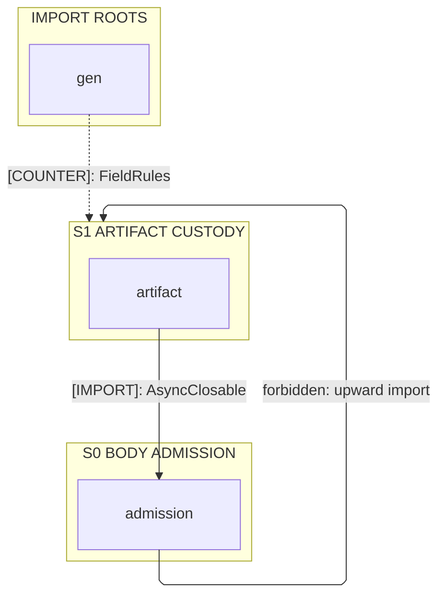
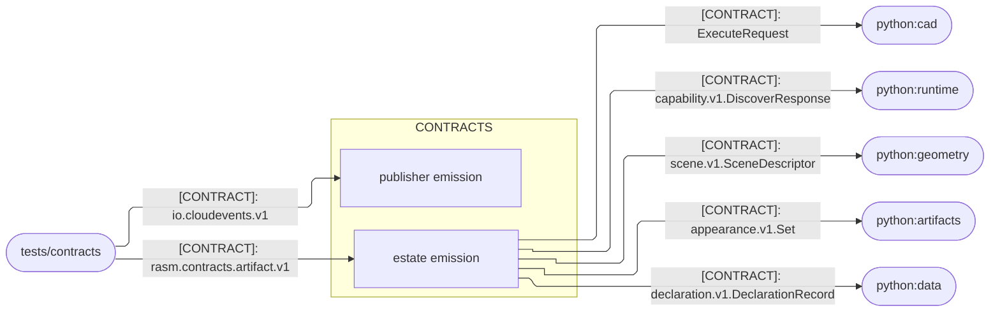
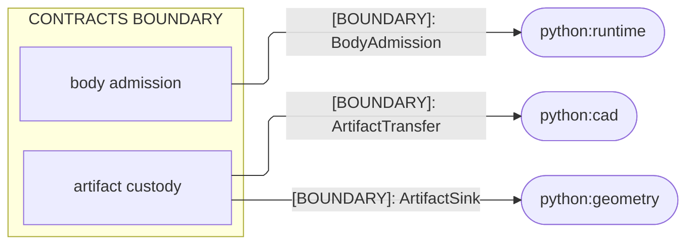

# [PY_CONTRACTS_ARCHITECTURE]

`contracts` maps the branch's wire boundary onto two clean-swept emission roots and the one hand-written surface seated above them: `gen` carries the estate closure, `vendor` the publisher closure, and `admission` beside `artifact` is the only code no generator writes. Descriptor-relative imports resolve inside each root, so a family arrives by regenerating its package rather than by editing a module, and the module root is the `rasm-contracts` distribution's own — every sibling reads this vocabulary and none mints back into it.

## [01]-[DOMAIN_MAP]

```text codemap
contracts/
└── rasm/contracts/          # Module root of the `rasm-contracts` distribution; identity and policy seat above both sweeps
    ├── __init__.py              # Package boundary; re-exports the admission surface consumers reach by bare name
    ├── admission.py             # BodyAdmission over four Connect shapes, the side and phase posture, AdmissionError evidence
    ├── artifact.py              # ArtifactLaw descriptor read, ArtifactSink custody, ArtifactStream envelopes, ArtifactTransfer
    ├── py.typed                 # Typed-package marker, seated outside every swept root
    ├── gen/                     # Estate emission root; descriptor-relative imports resolve from here alone
    │   ├── buf/validate/        # Rule vocabulary the artifact law reads and Protovalidate evaluates
    │   ├── google/rpc/          # Error-detail closure the fault family reaches
    │   ├── google/type/         # Calendar closure the declaration family reaches
    │   └── rasm/contracts/      # Estate families, one versioned package each
    │       ├── appearance/v1/   # Surface appearance Set, environment planes, and the pack and plane rosters
    │       ├── artifact/v1/     # ArtifactRef, ArtifactFrame, and the ArtifactService fetch and put pair
    │       ├── cad/v1/          # Exact-modeling operations and types under the CadService execute and tessellate pair
    │       ├── capability/v1/   # Capability descriptors under the CapabilityDiscoveryService discover call
    │       ├── clock/v1/        # Hlc stamp every causal ordering carries
    │       ├── compute/v1/      # ComputeService tessellate call and its request and response pair
    │       ├── crdt/v1/         # CrdtOpWire replication operations
    │       ├── declaration/v1/  # DeclarationRecord impact cells and their sources
    │       ├── event/v1/        # Extensions vocabulary the estate mints over the CloudEvents envelope
    │       ├── fabrication/v1/  # FeatureControl fabrication vocabulary
    │       ├── fault/v1/        # FaultDetail every branch projects its refusals onto
    │       ├── geometry/v1/     # TessellationPolicy the mesh producers read
    │       ├── organization/v1/ # Organization and Entity graph vocabulary
    │       ├── parity/v1/       # Backend parity rows the conformance corpus proves
    │       ├── scan/v1/         # GaussianSplatScan reality-capture payload
    │       ├── scene/v1/        # SceneDescriptor sun band, photometry, and shading references
    │       └── spatial/v1/      # Point, frame, and curve vocabulary every geometric family composes
    └── vendor/                  # Publisher emission root, collision-safe beside gen
        ├── grpc/health/v1/      # Publisher Health service and its generated Connect stubs
        └── io/cloudevents/v1/   # Publisher CloudEvent messages beside the exact cloudevents.avsc resource
```

## [02]-[STRATA]

Strata rank the contracts interior; seating rows carry only the law the fence cannot show.



- S0 `admission` — floor owner importing no generated module: descriptor-generic validation names no family and widens with none.
- S1 `artifact` — one rank above, holding every custody owner and the only interior import edge this package draws.
- `artifact` reads `buf.validate` bounds and `ArtifactFrame` envelopes as values, so the counter-edge carries payload and never an owner.
- `gen` and `vendor` are admitted import roots, never ranks; descriptor-relative imports resolve inside each root and reach no owner above.
- `vendor` draws no interior edge at all — no owner above imports a publisher module, so that root meets its consumers at `[03]-[SEAMS]`.
- `__init__.py` and `py.typed` seat above both roots under `init_files=false`, so PEP 420 resolution carries every emitted package.

## [03]-[SEAMS]





Every edge leaves this package: the corpus defines, generation transcribes, and consumers read, so no counterpart mints a shape back and no arrow is two-headed. Each edge collapses every contract between its endpoints at that kind — `cad` also reads `SealedStep` and `TessellationPolicy`, `geometry` also reads `geometry.v1.TessellationPolicy`, and `runtime` also reads the fault, clock, and event families its transport plane serves. `compute` holds no edge here, composing peer evidence rather than generated vocabulary.

Publisher bytes cross with their exact resource: `io.cloudevents.v1` lands as generated messages beside the untouched `cloudevents.avsc` a consumer parses rather than transcribes, and `grpc.health.v1` lands as messages and Connect stubs because no publisher ships a Python health client.

## [04]-[INTERNAL]

Generation and service both run through the emission roots and meet nowhere else: the corpus descriptor image writes both roots, the artifact law reads its bounds back out of the emitted rules, and one served call crosses body admission before any custody begins.

```mermaid
---
config:
  layout: elk
  flowchart:
    curve: linear
    padding: 25
---
flowchart LR
    accTitle: contracts emission and service spine
    accDescr: How corpus descriptors become both emission roots and how one served call crosses body admission into artifact custody.
    Proto[[corpus descriptors]] e1@-->|"descriptor image"| Generate[[buf generation]]
    Generate e2@-->|"estate closure"| Gen[gen · estate root]
    Generate e3@-->|"publisher closure and exact bytes"| Vendor[vendor · publisher root]
    Gen e4@-->|"buf.validate rules"| Law[artifact law]
    Wire([Connect wire]) e5@-->|"request element"| Admission[body admission]
    Admission e6@-->|"admitted element"| Handler([consumer handler])
    Law e7@-->|"declared frame, extent, identity"| Sink[artifact sink]
    Sink e8@-->|"sealed custody"| Stream[artifact stream]
    Stream e9@-->|"framed transfer"| Wire
    Admission f1@-.->|"refusal: AdmissionError or ConnectError"| Handler
    Sink f2@-.->|"rail refusal: ArtifactRefusal"| Handler
```



Generation deletes and rewrites both roots whole, so identity and policy above them survive every pass and no emitted module is ever edited in place. Admission decodes nothing: it validates whatever element the transport already decoded, names no family, and so admits a new package the day it emits. Custody reads its bounds once from the descriptors rather than restating a literal, and refusals ride `Result` values until a generated stream demands the raise that `ArtifactError` reconstructs.

## [05]-[ROUTING]

| [INDEX] | [CHANGE]           | [OWNER_SURFACE]               | [SHAPE_OF_THE_EDIT]                         |
| :-----: | :----------------- | :---------------------------- | :------------------------------------------ |
|  [01]   | corpus declaration | `tests/contracts/proto`       | one source edit, then regenerate            |
|  [02]   | publisher module   | `buf.yaml` module roster      | one module row and its lint carve           |
|  [03]   | publisher asset    | `tests/contracts/vendor`      | replace the bytes, then regenerate          |
|  [04]   | emitted family     | `buf.gen.yaml` type roster    | one type token per generator block          |
|  [05]   | generator pin      | root `[tool.uv.sources]`      | one source coordinate paired to its runtime |
|  [06]   | runtime closure    | root `[project.dependencies]` | one unpinned name                           |
|  [07]   | emission root      | root lane carves              | one path row on ty, mypy, ruff, attributes  |

## [06]-[BOUNDARIES]

- `contracts` owns generated wire vocabulary, Connect body admission, and custody proof — no domain fault, storage, or composition seats.
- Corpus sources and frozen publisher bytes own wire shape; generation transcribes them, and no emitted module is hand-corrected.
- `rasm-contracts` member manifest owns distribution identity and dependency closure; root lane carves hold over both emission roots.
- Consumer packages own domain admission, handler composition, and fault projection; refusal evidence crosses as values they map.
- `tests/contracts` owns compatibility — `buf breaking` grades a wire change, and no runtime descriptor diff stands beside it.
