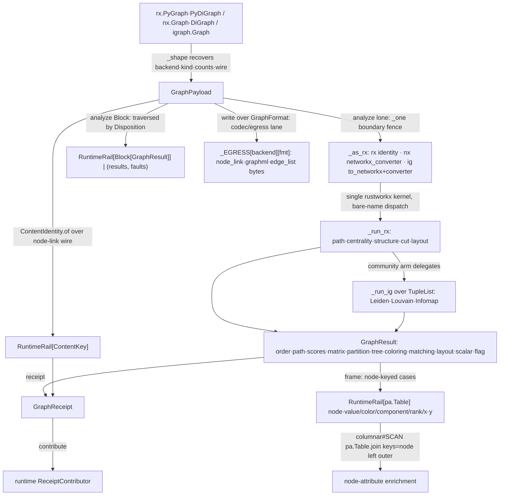

# [PY_DATA_GRAPH]

The graph-payload owner over a license-split backend triangle: the permissive `rustworkx` analysis core, the `networkx` codec/egress lane, and the GPL-confined `igraph` community engine carrying the Leiden/Louvain/Infomap split rustworkx lacks and the BSD core cannot license. The backend is recovered from the source shape, never a knob, and analysis collapses onto ONE kernel: every algorithm runs on `rustworkx` keyed by its stable non-recycled integer index, a `networkx` or `igraph` source converting once through the one-way `_as_rx` bridge, so the `NodeId` stays the rx `int` the node-keyed frame seam joins on.

Payload identity is the railed `ContentIdentity` fingerprint over the canonical node-link wire, never a `repr(dict)` byte stream. `GraphResult.frame` lowers node-index-keyed results into one canonical `node`-keyed `pa.Table` the `tabular/columnar#SCAN` plane left-joins by `node` — a centrality run is a left-join enrichment, never a re-keyed copy. The GPL `igraph` core stays in this data graph rail and is never linked into a host-distributed plugin.

## [01]-[INDEX]

- [01]-[GRAPH]: the `GraphPayload` owner — one rustworkx kernel over `_as_rx`-coerced sources, family-folded algorithm intent, typed result receipts, content-keyed egress.

## [02]-[GRAPH]

- Owner: `GraphPayload` carries the admitted graph as `self.graph`, so the recovered `backend`/`kind` never decouple from the analyzed graph — `analyze`/`write` take no graph parameter; a re-passed handle breaking that invariant is the rejected form.
- Cases: payload splits follow real provider arity — `all_pairs_distance` carries the `null_value` its `distance_matrix` substrate declares while `floyd_warshall` carries only its `WeightSelector` (`floyd_warshall_numpy` takes `weight_fn`, no null-value parameter); the connectivity polarity is recovered from `kind.directed`, never a caller flag; every weighted member carries a `WeightSelector` slot defaulting `WEIGHT_IDENTITY`, so a non-float edge payload is weightable by one policy value.
- Entry: `analyze` absorbs a lone `GraphAlgorithm` or a `Block` over one `match` at the head — the arity is the value's shape, the `Disposition` selects the batch output shape through the `@overload` ladder and is inert for a lone algorithm, so the input shape and the disposition together carry the output type. A non-node-keyed result case carries no per-node row, so `frame` names the case as non-node-keyed rather than minting a degenerate frame; `write` routes the `_EGRESS` codec directly on the source backend, never through the analysis-coercion path.
- Auto: the bare-name rustworkx members dispatch on graph subtype, so the owner never names the `graph_*`/`digraph_*` typed forms; the dense matrices stay `npt.NDArray[np.float64]` so they fold straight into the tensor carriers.
- Receipt: the content key derives once at admission from the canonical node-link wire and the receipt reuses it — an unchanged graph keys byte-stable, an added edge re-admits to a new key; the algorithm receipt is typed rail evidence, never product graph-database state.
- Packages: `pyarrow` binds function-local, so the codec-only graph path never loads Arrow.
- Growth: a new algorithm is one `GraphAlgorithm` case plus one `_run_rx` arm; a new community algorithm one `IG_COMMUNITY` row; a new centrality metric one `RX_CENTRALITY` row; a new egress one `GraphFormat` row plus one `_EGRESS` codec row; a new layout one `LayoutKind` row. A networkx `@_dispatchable` accelerator lands as one `backend=`/`nx.config.backend_priority` policy on the codec lane when such a backend enters the manifest roster, never a second analysis kernel — a phantom accelerator axis claimed but unwired is the rejected form. The deferred rustworkx residue is the named set — VF2 isomorphism (`vf2_mapping`/`is_isomorphic`), the `rustworkx.generators` builders, the DOT/Matrix-Market IO codecs, group centrality, edge coloring — each one case plus one arm when a consumer names it.
- Boundary: the graph plane produces the node-keyed enrichment frame; the relational join belongs to the tabular plane, never a graph-database node table re-minted here. `NodeId` is never widened to `Hashable` to admit a networkx analysis kernel — conversion keeps it the rx `int`. No product collaboration store, no bridge lifecycle, no compute numeric trio.

```python signature
import sys
import tempfile
from collections.abc import Iterable
from enum import StrEnum
from pathlib import Path
from typing import TYPE_CHECKING, Any, Final, Literal, assert_never, overload

import msgspec
import networkx as nx
import numpy as np
import rustworkx as rx
from expression import Block, case, tag, tagged_union
from expression.collections import Map
from msgspec import Struct

from rasm.runtime.faults import BoundaryFault, Disposition, RuntimeRail, boundary, traversed
from rasm.runtime.identity import ContentIdentity, ContentKey
from rasm.runtime.receipts import Receipt

if TYPE_CHECKING:
    from collections.abc import Callable

    import igraph
    import numpy.typing as npt
    import pyarrow as pa


# --- [TYPES] ----------------------------------------------------------------------------

type NodeId = int
type RxGraph = rx.PyGraph | rx.PyDiGraph
type NxGraph = nx.Graph | nx.DiGraph
# the GPL igraph member is TYPE_CHECKING-only, so the alias is checker-facing while the runtime
# carrier slot on `GraphPayload` stays the honest `Any` wire floor.
type AnyGraph = "RxGraph | NxGraph | igraph.Graph"
type GraphBackend = Literal["rustworkx", "networkx", "igraph"]
type ScoreMap = tuple[tuple[NodeId, float], ...]
type Partition = tuple[tuple[NodeId, ...], ...]
type Matrix = npt.NDArray[np.float64]
type WeightSelector = Callable[[Any], float]

WEIGHT_IDENTITY: Final[WeightSelector] = float


class GraphFormat(StrEnum):
    NODE_LINK = "node_link"
    GRAPHML = "graphml"
    EDGE_LIST = "edge_list"


class LayoutKind(StrEnum):
    SPRING = "spring"
    CIRCULAR = "circular"
    KAMADA_KAWAI = "kamada_kawai"


# --- [MODELS] ---------------------------------------------------------------------------


class GraphKind(Struct, frozen=True, gc=False):
    directed: bool
    multigraph: bool


@tagged_union(frozen=True)
class GraphAlgorithm:
    tag: Literal[
        "bfs",
        "dfs",
        "topo_sort",
        "ancestors",
        "descendants",
        "shortest_path",
        "bellman_ford",
        "astar",
        "k_shortest",
        "all_simple_paths",
        "all_pairs_distance",
        "floyd_warshall",
        "longest_path",
        "transitive_reduction",
        "dominators",
        "connected",
        "strongly_connected",
        "articulation",
        "bridges",
        "cycle_basis",
        "condensation",
        "core_number",
        "min_cut",
        "betweenness",
        "closeness",
        "eigenvector",
        "katz",
        "pagerank",
        "hits",
        "degree",
        "greedy_color",
        "max_weight_matching",
        "spanning_tree",
        "steiner_tree",
        "transitivity",
        "is_planar",
        "layout",
        "leiden",
        "louvain",
        "infomap",
    ] = tag()
    bfs: NodeId = case()
    dfs: NodeId | None = case()
    topo_sort: None = case()
    ancestors: NodeId = case()
    descendants: NodeId = case()
    shortest_path: tuple[NodeId, NodeId, WeightSelector] = case()
    bellman_ford: tuple[NodeId, NodeId, WeightSelector] = case()
    astar: tuple[NodeId, NodeId, WeightSelector, "Callable[[NodeId], float]"] = case()
    k_shortest: tuple[NodeId, int, WeightSelector] = case()
    all_simple_paths: tuple[NodeId, NodeId] = case()
    all_pairs_distance: float = case()
    floyd_warshall: WeightSelector = case()
    longest_path: None = case()
    transitive_reduction: None = case()
    dominators: NodeId = case()
    connected: None = case()
    strongly_connected: None = case()
    articulation: None = case()
    bridges: None = case()
    cycle_basis: NodeId | None = case()
    condensation: None = case()
    core_number: None = case()
    min_cut: WeightSelector = case()
    betweenness: bool = case()
    closeness: bool = case()
    eigenvector: int = case()
    katz: float = case()
    pagerank: float = case()
    hits: int = case()
    degree: None = case()
    greedy_color: None = case()
    max_weight_matching: tuple[bool, WeightSelector] = case()
    spanning_tree: WeightSelector = case()
    steiner_tree: tuple[tuple[NodeId, ...], WeightSelector] = case()
    transitivity: None = case()
    is_planar: None = case()
    layout: LayoutKind = case()
    leiden: float = case()
    louvain: float = case()
    infomap: int = case()


@tagged_union(frozen=True)
class GraphResult:
    tag: Literal["order", "path", "paths", "scores", "matrix", "partition", "tree", "coloring", "matching", "layout", "scalar", "flag"] = tag()
    order: tuple[NodeId, ...] = case()
    path: tuple[NodeId, ...] = case()
    paths: tuple[tuple[NodeId, ...], ...] = case()
    scores: ScoreMap = case()
    matrix: Matrix = case()
    partition: Partition = case()
    tree: tuple[tuple[NodeId, NodeId], ...] = case()
    coloring: tuple[tuple[NodeId, int], ...] = case()
    matching: tuple[tuple[NodeId, NodeId], ...] = case()
    layout: tuple[tuple[NodeId, tuple[float, float]], ...] = case()
    scalar: float = case()
    flag: bool = case()

    def frame(self) -> "RuntimeRail[pa.Table]":
        return boundary(f"graph.frame.{self.tag}", lambda: _frame(self))


class GraphReceipt(Struct, frozen=True, gc=False):
    backend: GraphBackend
    kind: GraphKind
    node_count: int
    edge_count: int
    algorithm: str
    result: str
    content_key: ContentKey

    def contribute(self) -> Iterable[Receipt]:
        yield Receipt.of(
            "graph",
            (
                "emitted",
                self.backend,
                {
                    "kind": f"directed={self.kind.directed},multi={self.kind.multigraph}",
                    "nodes": self.node_count,
                    "edges": self.edge_count,
                    "algorithm": self.algorithm,
                    "result": self.result,
                },
            ),
        )


class GraphPayload(Struct, frozen=True, gc=False):
    graph: Any
    backend: GraphBackend
    kind: GraphKind
    node_count: int
    edge_count: int
    content_key: ContentKey

    @classmethod
    def of(cls, graph: "AnyGraph") -> "RuntimeRail[GraphPayload]":
        backend, kind, n, e, wire = _shape(graph)
        return ContentIdentity.of("graph", wire).map(
            lambda key: cls(graph=graph, backend=backend, kind=kind, node_count=n, edge_count=e, content_key=key)
        )

    @overload
    def analyze(self, algo: "GraphAlgorithm", *, by: Disposition = ...) -> "RuntimeRail[GraphResult]": ...
    @overload
    def analyze(
        self, algo: "Block[GraphAlgorithm]", *, by: Literal[Disposition.ABORT, Disposition.ACCUMULATE] = ...
    ) -> "RuntimeRail[Block[GraphResult]]": ...
    @overload
    def analyze(
        self, algo: "Block[GraphAlgorithm]", *, by: Literal[Disposition.PARTITION]
    ) -> "RuntimeRail[tuple[Block[GraphResult], Block[BoundaryFault]]]": ...
    def analyze(
        self, algo: "GraphAlgorithm | Block[GraphAlgorithm]", *, by: Disposition = Disposition.ABORT
    ) -> "RuntimeRail[GraphResult] | RuntimeRail[Block[GraphResult]] | RuntimeRail[tuple[Block[GraphResult], Block[BoundaryFault]]]":
        match algo:
            case Block() as algos:
                return traversed(algos.map(self._one), by=by)
            case lone:
                return self._one(lone)

    def _one(self, algo: "GraphAlgorithm") -> "RuntimeRail[GraphResult]":
        return boundary(f"graph.analyze.{algo.tag}", lambda: _run_rx(_as_rx(self.graph), algo, self.kind))

    def write(self, fmt: GraphFormat) -> "RuntimeRail[bytes]":
        return boundary(f"graph.egress.{fmt}", lambda: _EGRESS[self.backend][fmt](self.graph))

    def receipt(self, algo: "GraphAlgorithm", result: GraphResult) -> GraphReceipt:
        return GraphReceipt(
            backend=self.backend,
            kind=self.kind,
            node_count=self.node_count,
            edge_count=self.edge_count,
            algorithm=algo.tag,
            result=result.tag,
            content_key=self.content_key,
        )


# --- [OPERATIONS] -----------------------------------------------------------------------


def _node_link(g: NxGraph) -> bytes:
    # `node_link_data` is the canonical persisted graph document, encoded through the shared `msgspec` JSON rail.
    return msgspec.json.encode(nx.node_link_data(g, edges="edges"))


def _wire(graph: "AnyGraph", backend: GraphBackend) -> bytes:
    match backend:
        case "rustworkx":
            return rx.node_link_json(graph).encode()
        case "igraph":
            return _node_link(graph.to_networkx())
        case _:
            return _node_link(graph)


def _is_ig(graph: object) -> bool:
    # STRUCTURAL GPL confinement: the probe reads `sys.modules` and never imports — an igraph
    # source can only exist in-process if the caller already linked the GPL core, so a run that
    # never sees one never loads igraph; module-top `import igraph` is the deleted form.
    ig = sys.modules.get("igraph")
    return ig is not None and isinstance(graph, ig.Graph)


def _shape(graph: "AnyGraph") -> "tuple[GraphBackend, GraphKind, int, int, bytes]":
    match graph:
        case rx.PyGraph() | rx.PyDiGraph():
            kind = GraphKind(directed=isinstance(graph, rx.PyDiGraph), multigraph=graph.multigraph)
            return "rustworkx", kind, graph.num_nodes(), graph.num_edges(), _wire(graph, "rustworkx")
        case _ if _is_ig(graph):
            kind = GraphKind(directed=graph.is_directed(), multigraph=graph.has_multiple())
            return "igraph", kind, graph.vcount(), graph.ecount(), _wire(graph, "igraph")
        case _:
            kind = GraphKind(directed=graph.is_directed(), multigraph=graph.is_multigraph())
            return "networkx", kind, graph.number_of_nodes(), graph.number_of_edges(), _wire(graph, "networkx")


def _frame(result: GraphResult) -> "pa.Table":  # noqa: PLR0911
    # `pyarrow` is module-level-import-banned; the deferred import rides the same boundary the
    # columnar/interop owners bind `pl`/`read_excel` under.
    import pyarrow as pa  # noqa: PLC0415

    match result:
        case GraphResult(tag="scores", scores=rows):
            return pa.Table.from_pydict({"node": [n for n, _ in rows], "value": [v for _, v in rows]})
        case GraphResult(tag="coloring", coloring=rows):
            return pa.Table.from_pydict({"node": [n for n, _ in rows], "color": [c for _, c in rows]})
        case GraphResult(tag="partition", partition=blocks):
            return pa.Table.from_pydict({
                "node": [n for block in blocks for n in block],
                "component": [i for i, block in enumerate(blocks) for _ in block],
            })
        case GraphResult(tag="order", order=nodes):
            return pa.Table.from_pydict({"node": list(nodes), "rank": list(range(len(nodes)))})
        case GraphResult(tag="layout", layout=rows):
            return pa.Table.from_pydict({"node": [n for n, _ in rows], "x": [xy[0] for _, xy in rows], "y": [xy[1] for _, xy in rows]})
        case _:
            raise ValueError(f"{result.tag} carries no per-node index row; only scores/coloring/partition/order/layout key the node table")


# --- [RUSTWORKX_KERNEL] -----------------------------------------------------------------

RX_CENTRALITY: "Final[Map[str, Callable[[RxGraph, GraphAlgorithm], dict[NodeId, float]]]]" = Map.of_seq([
    ("betweenness", lambda g, a: rx.betweenness_centrality(g, normalized=a.betweenness)),
    ("closeness", lambda g, a: rx.closeness_centrality(g, wf_improved=a.closeness)),
    ("eigenvector", lambda g, a: rx.eigenvector_centrality(g, max_iter=a.eigenvector)),
    ("katz", lambda g, a: rx.katz_centrality(g, alpha=a.katz)),
    ("pagerank", lambda g, a: rx.pagerank(g, alpha=a.pagerank)),
    ("degree", lambda g, _: rx.degree_centrality(g)),
])
RX_LAYOUT: "Final[Map[LayoutKind, Callable[[RxGraph], rx.Pos2DMapping]]]" = Map.of_seq([
    (LayoutKind.SPRING, rx.spring_layout),
    (LayoutKind.CIRCULAR, rx.circular_layout),
    (LayoutKind.KAMADA_KAWAI, rx.kamada_kawai_layout),
])


def _as_rx(graph: "AnyGraph") -> RxGraph:
    # the one analysis-coercion seam. `networkx_converter`'s `keep_attributes` default rides the original label as node
    # payload so the rx index stays the stable join key; the nx->rx bridge is the only converter direction, so the igraph
    # leg crosses networkx first (`to_networkx` then convert).
    match graph:
        case rx.PyGraph() | rx.PyDiGraph():
            return graph
        case _ if _is_ig(graph):
            return rx.networkx_converter(graph.to_networkx())
        case _:
            return rx.networkx_converter(graph)


def _run_rx(g: RxGraph, algo: GraphAlgorithm, kind: GraphKind) -> GraphResult:  # noqa: PLR0911, C901
    match algo:
        case GraphAlgorithm(tag="bfs"):
            return GraphResult(order=(algo.bfs, *(c for _, kids in rx.bfs_successors(g, algo.bfs) for c in kids)))
        case GraphAlgorithm(tag="dfs"):
            return GraphResult(order=tuple(n for edge in rx.dfs_edges(g, algo.dfs) for n in edge))
        case GraphAlgorithm(tag="topo_sort"):
            return GraphResult(order=tuple(rx.topological_sort(g)))
        case GraphAlgorithm(tag="ancestors"):
            return GraphResult(order=tuple(rx.ancestors(g, algo.ancestors)))
        case GraphAlgorithm(tag="descendants"):
            return GraphResult(order=tuple(rx.descendants(g, algo.descendants)))
        case GraphAlgorithm(tag="shortest_path", shortest_path=(src, dst, weight)):
            # `PathMapping` is a `__contains__`/`__getitem__` view, not a `dict` — `.get` does not
            # exist, so the membership-gated subscript reads the path or the empty unreachable path.
            paths = rx.dijkstra_shortest_paths(g, src, target=dst, weight_fn=weight)
            return GraphResult(path=tuple(paths[dst]) if dst in paths else ())
        case GraphAlgorithm(tag="bellman_ford", bellman_ford=(src, dst, weight)):
            paths = rx.bellman_ford_shortest_paths(g, src, target=dst, weight_fn=weight)
            return GraphResult(path=tuple(paths[dst]) if dst in paths else ())
        case GraphAlgorithm(tag="astar", astar=(src, dst, edge_cost, estimate)):
            # the carried selector pair: `edge_cost` reads the edge payload, `estimate` the node —
            # the admissible-heuristic policy is DATA on the case, never a hardcoded unit lambda.
            return GraphResult(path=tuple(rx.astar_shortest_path(g, src, lambda n: n == dst, edge_cost, estimate)))
        case GraphAlgorithm(tag="k_shortest", k_shortest=(src, k, weight)):
            return GraphResult(scores=tuple(rx.k_shortest_path_lengths(g, src, k, weight).items()))
        case GraphAlgorithm(tag="all_simple_paths", all_simple_paths=(src, dst)):
            return GraphResult(paths=tuple(tuple(p) for p in rx.all_simple_paths(g, src, dst)))
        case GraphAlgorithm(tag="all_pairs_distance"):
            return GraphResult(matrix=np.asarray(rx.distance_matrix(g, null_value=algo.all_pairs_distance), dtype=np.float64))
        case GraphAlgorithm(tag="floyd_warshall", floyd_warshall=weight):
            return GraphResult(matrix=np.asarray(rx.floyd_warshall_numpy(g, weight_fn=weight), dtype=np.float64))
        case GraphAlgorithm(tag="longest_path"):
            return GraphResult(order=tuple(rx.dag_longest_path(g)))
        case GraphAlgorithm(tag="transitive_reduction"):
            # `transitive_reduction` returns the `(reduced_graph, index_map)` pair, not a bare graph.
            return GraphResult(tree=tuple(rx.transitive_reduction(g)[0].edge_list()))
        case GraphAlgorithm(tag="dominators"):
            return GraphResult(scores=tuple((n, float(d)) for n, d in rx.immediate_dominators(g, algo.dominators).items()))
        case GraphAlgorithm(tag="connected"):
            comp = rx.weakly_connected_components(g) if kind.directed else rx.connected_components(g)
            return GraphResult(partition=tuple(tuple(c) for c in comp))
        case GraphAlgorithm(tag="strongly_connected"):
            return GraphResult(partition=tuple(tuple(c) for c in rx.strongly_connected_components(g)))
        case GraphAlgorithm(tag="articulation"):
            return GraphResult(order=tuple(rx.articulation_points(g)))
        case GraphAlgorithm(tag="bridges"):
            return GraphResult(matching=tuple(rx.bridges(g)))
        case GraphAlgorithm(tag="cycle_basis"):
            return GraphResult(paths=tuple(tuple(c) for c in rx.cycle_basis(g, root=algo.cycle_basis)))
        case GraphAlgorithm(tag="condensation"):
            return GraphResult(tree=tuple(rx.condensation(g).edge_list()))
        case GraphAlgorithm(tag="core_number"):
            return GraphResult(scores=tuple((n, float(k)) for n, k in rx.core_number(g).items()))
        case GraphAlgorithm(tag="min_cut", min_cut=weight):
            cut, _ = rx.stoer_wagner_min_cut(g, weight_fn=weight)
            return GraphResult(scalar=cut)
        case GraphAlgorithm(tag="betweenness" | "closeness" | "eigenvector" | "katz" | "pagerank" | "degree"):
            # `pagerank` is rustworkx-directed-only — a `pagerank` run on an undirected `PyGraph`
            # raises `TypeError`, which the enclosing `boundary` fence rails to a `BoundaryFault`
            # rather than crashing; the other five centralities run on either graph kind.
            return GraphResult(scores=tuple(RX_CENTRALITY[algo.tag](g, algo).items()))
        case GraphAlgorithm(tag="hits"):
            # `hits` is rustworkx-directed-only (the boundary fence rails an undirected misuse).
            hubs, _ = rx.hits(g, max_iter=algo.hits)
            return GraphResult(scores=tuple(hubs.items()))
        case GraphAlgorithm(tag="greedy_color"):
            return GraphResult(coloring=tuple(rx.graph_greedy_color(g, strategy=rx.ColoringStrategy.Saturation).items()))
        case GraphAlgorithm(tag="max_weight_matching", max_weight_matching=(max_cardinality, weight)):
            # rustworkx matching demands an int weight — the carried float selector quantizes at the
            # call head, so the policy stays one selector row rather than a parallel int selector kind.
            return GraphResult(matching=tuple(rx.max_weight_matching(g, max_cardinality=max_cardinality, weight_fn=lambda e: int(weight(e)))))
        case GraphAlgorithm(tag="spanning_tree", spanning_tree=weight):
            return GraphResult(tree=tuple(rx.minimum_spanning_tree(g, weight_fn=weight).edge_list()))
        case GraphAlgorithm(tag="steiner_tree", steiner_tree=(terminals, weight)):
            return GraphResult(tree=tuple(rx.steiner_tree(g, list(terminals), weight).edge_list()))
        case GraphAlgorithm(tag="transitivity"):
            return GraphResult(scalar=rx.transitivity(g))
        case GraphAlgorithm(tag="is_planar"):
            return GraphResult(flag=rx.is_planar(g))
        case GraphAlgorithm(tag="layout"):
            return GraphResult(layout=tuple((n, tuple(xy)) for n, xy in RX_LAYOUT[algo.layout](g).items()))
        case GraphAlgorithm(tag="leiden" | "louvain" | "infomap"):
            return _run_ig(_ig_from(g, kind), algo, kind)
        case unreachable:
            assert_never(unreachable)


# --- [IGRAPH_COMMUNITY] -----------------------------------------------------------------

# the community rows call methods ON the passed C-core graph, so the table itself links no GPL
# symbol — the one import site is `_ig_from`, reached only from the `_run_rx` community arm.
IG_COMMUNITY: "Final[Map[str, Callable[[igraph.Graph, GraphAlgorithm], igraph.VertexClustering]]]" = Map.of_seq([
    ("leiden", lambda g, a: g.community_leiden(objective_function="modularity", resolution=a.leiden)),
    ("louvain", lambda g, a: g.community_multilevel(resolution=a.louvain)),
    ("infomap", lambda g, a: g.community_infomap(trials=a.infomap)),
])


def _ig_from(g: RxGraph, kind: GraphKind) -> "igraph.Graph":
    # the ONE GPL import site, function-local by law — the community split is the only leg that
    # links the igraph C core, so the confinement is structural rather than prose. The leg builds
    # the C-core graph from the rustworkx edge list (`_as_rx` already coerced any networkx/igraph
    # source to rustworkx, so the edge list is always rx integer indices). `Graph.TupleList`'s
    # default `vertex_name_attr="name"` stores each rx endpoint index in the `name` vertex
    # attribute, so the membership read recovers the rx index — robust to rx index gaps after node
    # removal — rather than igraph's reindexed 0-based vertex. `TupleList` creates a vertex only
    # per endpoint, so an ISOLATED rx node carries no edge and would vanish from the partition;
    # the `add_vertices` pass re-admits the edgeless rx indices as `name`-carrying singleton
    # vertices so the community partition stays TOTAL over the node set.
    import igraph  # noqa: PLC0415

    ig = igraph.Graph.TupleList(g.edge_list(), directed=kind.directed)
    isolated = [n for n in g.node_indices() if n not in set(ig.vs["name"])]
    if isolated:
        ig.add_vertices(len(isolated), attributes={"name": isolated})
    return ig


def _run_ig(g: "igraph.Graph", algo: GraphAlgorithm, _: GraphKind) -> GraphResult:
    match algo:
        case GraphAlgorithm(tag="leiden" | "louvain" | "infomap"):
            # `VertexClustering` membership is keyed by igraph's reindexed 0-based vertex; `_ig_from`'s
            # `TupleList`+`add_vertices` carries each rx index in the `name` attribute, so the partition
            # lowers back onto the rx index the rest of the rail (and `GraphResult.frame`) joins on.
            names = g.vs["name"]
            return GraphResult(partition=tuple(tuple(names[v] for v in block) for block in IG_COMMUNITY[algo.tag](g, algo)))
        case off_lane:
            # igraph owns only the community split — a reachable out-of-lane rejection the fence rails.
            raise NotImplementedError(f"igraph backend owns only the community split, not {off_lane.tag}; route to rustworkx")


# --- [COMPOSITION] ----------------------------------------------------------------------


def _graphml(write: "Callable[[str], object]") -> bytes:
    # GraphML is path-keyed on every backend (`rx.write_graphml(g, path)`, `nx.write_graphml(g, path)`);
    # the one helper reads the written document back through a scratch path rather than re-encoding
    # through a foreign codec or an unconfirmed byte-streaming variant.
    with tempfile.NamedTemporaryFile(suffix=".graphml") as handle:
        write(handle.name)
        return Path(handle.name).read_bytes()


_EGRESS: "Final[Map[GraphBackend, Map[GraphFormat, Callable[[Any], bytes]]]]" = Map.of_seq([
    (
        "rustworkx",
        Map.of_seq([
            (GraphFormat.NODE_LINK, lambda g: rx.node_link_json(g).encode()),
            (GraphFormat.GRAPHML, lambda g: _graphml(lambda path: rx.write_graphml(g, path))),
            (GraphFormat.EDGE_LIST, lambda g: "\n".join(f"{u} {v}" for u, v in g.edge_list()).encode()),
        ]),
    ),
    (
        "networkx",
        Map.of_seq([
            (GraphFormat.NODE_LINK, _node_link),
            (GraphFormat.GRAPHML, lambda g: _graphml(lambda path: nx.write_graphml(g, path))),
            (GraphFormat.EDGE_LIST, lambda g: nx.to_pandas_edgelist(g).to_csv(index=False).encode()),
        ]),
    ),
    (
        "igraph",
        Map.of_seq([
            (GraphFormat.NODE_LINK, lambda g: _node_link(g.to_networkx())),
            (GraphFormat.GRAPHML, lambda g: _graphml(lambda path: g.write_graphml(path))),
            (GraphFormat.EDGE_LIST, lambda g: g.get_edge_dataframe().to_csv(index=False).encode()),
        ]),
    ),
])
```



## [03]-[RESEARCH]

<!-- source-only: research row template:
[TOKEN]-[OPEN|BLOCKED]: <exact question>; <verification route>.
-->

(none)
