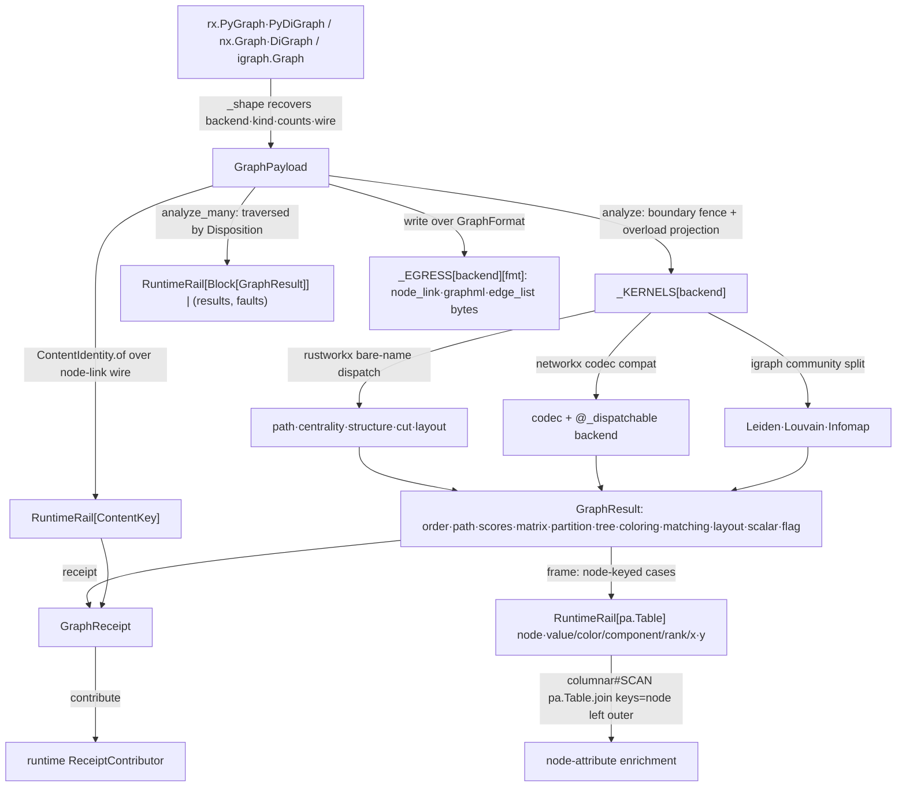

# [PY_DATA_GRAPH]

The graph-payload owner over a permissive-license `rustworkx` fast-path, a `networkx` codec/backend-dispatch compat row, and a GPL-confined `igraph` community-detection engine. `GraphPayload` carries the recovered backend, the directed/multigraph `GraphKind`, the node/edge counts, and the content-key seam over a `GraphBackend` axis; `GraphAlgorithm` is one tagged-union algorithm intent folded by family (traversal, shortest-path, all-pairs, DAG, connectivity, cut, centrality, coloring, matching, spanning, structure, layout, community); `GraphResult` is one discriminated typed receipt whose case recovers the algorithm class and parameterizes the output (node order, path, score map, dense `numpy` matrix, partition, tree, coloring, matching, 2-D layout, scalar, flag). The backend is recovered from the source shape, never a knob — `rustworkx` owns the hot path/centrality/structure suite, `networkx` the read-side codec and `@_dispatchable` backend axis, `igraph` the Leiden/Louvain/Infomap community split rustworkx lacks and the BSD core cannot license. Every analysis rides one `boundary`-fenced rail that records on the active span; payload identity is the railed `ContentIdentity` fingerprint over the canonical node-link wire, and a run streams onto the runtime `ReceiptContributor` rail.

## [01]-[INDEX]

- [01]-[GRAPH]: graph payloads, backend-dispatched family-folded algorithms, typed result receipts, content-keyed graph egress, and the community-detection split.

## [02]-[GRAPH]

- Owner: `GraphPayload` — the recovered `GraphBackend`/`GraphKind`/counts/content-key value object over one backend axis; `GraphAlgorithm` the family-folded tagged-union intent; `GraphResult` the discriminated typed receipt parameterizing the output shape, owning the `frame` lowering of its node-index-keyed cases into the canonical `node`-keyed Arrow seam; `GraphFormat` the closed egress-format axis; `GraphReceipt` the typed `ReceiptContributor` evidence keyed by `ContentIdentity` over the canonical node-link fingerprint. A new graph kind is one `GraphKind` field, a new algorithm one `GraphAlgorithm` case plus one `RxKernel`/`NxKernel`/`IgKernel` dispatch arm, a new backend one `GraphBackend` tag, a new egress one `GraphFormat` row, a new node-keyed enrichment one `GraphResult.frame` arm — never a per-algorithm `analyze_*`/`get_*` family and never a parallel `RustworkxGraph`/`NetworkxGraph`/`IgraphGraph` carrier triple.
- Cases: `GraphAlgorithm` is the one intent axis closed by `assert_never`. The traversal family (`bfs`/`dfs`/`topo_sort`/`ancestors`/`descendants`) carries a source `NodeId` or `None`; the shortest-path family (`shortest_path`/`bellman_ford`/`astar`/`k_shortest`/`all_simple_paths`) carries the `(source, target)` pair plus the path policy; the all-pairs family (`all_pairs_distance`/`floyd_warshall`) carries the `null_value`; the DAG family (`longest_path`/`transitive_reduction`/`dominators`) carries the optional root; the connectivity family (`connected`/`strongly_connected`/`articulation`/`bridges`/`cycle_basis`/`condensation`/`core_number`) recovers the weak-vs-strong component polarity from `kind.directed` in the `connected` arm rather than a separate tag; the cut family (`min_cut`) carries the weight selector; the centrality family (`betweenness`/`closeness`/`eigenvector`/`katz`/`pagerank`/`hits`/`degree`) carries its tuning scalar and folds through the `RX_CENTRALITY`/`NX_CENTRALITY` tables rather than one arm per metric; the structure family (`greedy_color`/`max_weight_matching`/`spanning_tree`/`steiner_tree`/`transitivity`/`is_planar`) carries its parameters; the `layout` family carries the `LayoutKind`; the community family (`leiden`/`louvain`/`infomap`) carries its resolution and routes to `igraph`. Arity, filters, weight selector, normalization, and resolution live in the case payload, never a parallel name.
- Entry: `GraphPayload.of` admits a `rustworkx.PyGraph`/`PyDiGraph`/`PyDAG`, a `networkx.Graph`/`DiGraph`/`MultiGraph`/`MultiDiGraph`, or an `igraph.Graph`, recovers the backend and `GraphKind` from the source shape, and returns a `RuntimeRail[GraphPayload]` because the canonical-encode content-key seam is fallible. `GraphPayload.analyze` runs one `GraphAlgorithm` through the backend kernel inside a `boundary(f"graph.analyze.{algo.tag}", ...)` fence and returns `RuntimeRail[GraphResult]` over the one discriminated receipt whose case the caller matches — the result is parameterized over its case (a `pagerank` run carries `scores`, a `connected` run `partition`, an all-pairs run the dense `matrix`), so the output shape is the union case rather than a stringly `tuple`. `GraphPayload.analyze_many` folds a `Block[GraphAlgorithm]` through `traversed(rails, by=by)` and is the genuine input-and-output parameterized surface: the `Disposition` row selects the multi-algorithm output shape through the `@overload` ladder mirroring the faults owner's `traversed` (`ACCUMULATE` aborts-or-combines to `RuntimeRail[Block[GraphResult]]`, `PARTITION` returns the `RuntimeRail[tuple[Block[GraphResult], Block[BoundaryFault]]]` split a health sweep reads) so a caller narrows on the disposition it passes. `GraphPayload.write` emits one `GraphFormat` through the backend codec, keyed by `ContentIdentity`. `GraphResult.frame` lowers a node-index-keyed result — `scores` (centrality/k-shortest/dominators/core-number/hits), `coloring`, `partition` (components/community membership), `order` (traversal/topo/articulation), and `layout` — into a `RuntimeRail[pa.Table]` carrying one canonical `node` column keyed by the stable non-recycled rustworkx integer index plus the per-case value column(s), so the `tabular/columnar#SCAN` plane left-joins a node-attribute `pa.Table` by `node` (`pa.Table.join(other, keys=["node"], join_type="left outer")`) and a centrality run is a left-join enrichment rather than a re-keyed copy; the produced frame rides the `tabular/interop#INTEROP` `ArrowCStream.of` carrier zero-copy at the downstream hop exactly as the `columnar#SCAN` `Corpus` arm does. A non-node-keyed case (`path`/`paths`/`matrix`/`tree`/`matching`/`scalar`/`flag`) carries no per-node index row, so the `boundary` names the case as non-node-keyed rather than minting a degenerate frame. The community split rejects a non-`igraph` backend at the kernel arm rather than silently degrading.
- Auto: the centrality family folds through one `RX_CENTRALITY`/`NX_CENTRALITY` `Final[Map[...]]` behavior table keyed by the algorithm tag rather than seven sibling arms — the `expression` `Map.of_seq` dispatch the sibling `tabular/contract#QUALITY` `_CMP` and `tabular/interop#INTEROP` `_BACKEND` rows own, never a `from builtins import frozendict` table; the `graph_*`/`digraph_*` prefixed rustworkx variants are the typed dispatch the bare names select by graph subtype, so the owner names only the bare form; the connectivity polarity (`connected` vs `weakly_connected`) is recovered from `kind.directed` through one fold, never a caller flag; the community methods route through the `IG_COMMUNITY` method-binding `Map` on the `igraph.Graph` exactly as the sibling `tabular/profile#PROFILE` `ProbeTables` binds the unbound `pb.Validate` methods, never a detector class per algorithm. The dense `all_pairs_distance`/`floyd_warshall` matrices and the `adjacency`/`distance` exports stay `numpy`-typed `npt.NDArray[np.float64]` so they fold straight into the `pyarrow`/`numpy` tensor carriers.
- Receipt: `GraphReceipt.contribute` emits an `emitted`-phase `Receipt.of` row keyed by `ContentIdentity` over the payload fingerprint — `GraphPayload.fingerprint` derives the key from the canonical node-link wire (the backend's own `node_link_json`/`node_link_data`, never a `repr(dict)` byte stream), so an unchanged graph reuses its key byte-stable while an added edge flips it. The receipt carries the backend, the `(directed, multigraph)` kind, the node/edge counts, the algorithm tag, and the result discriminant as one typed evidence stream the metrics/lanes fold reads, exactly as the sibling `tabular/profile#PROFILE` `ProfileReceipt` and `tabular/columnar#SCAN` `QueryReceipt` do. The algorithm receipt is the typed evidence the graph rail emits, never product graph-database state.
- Packages: `rustworkx` (`PyGraph`/`PyDiGraph`/`PyDAG`/`num_nodes`/`num_edges`/`multigraph`/`edge_list`/`bfs_successors`/`dfs_edges`/`topological_sort`/`ancestors`/`descendants`/`dijkstra_shortest_paths`/`bellman_ford_shortest_paths`/`astar_shortest_path`/`k_shortest_path_lengths`/`all_simple_paths`/`distance_matrix`/`floyd_warshall_numpy`/`dag_longest_path`/`transitive_reduction`/`immediate_dominators`/`connected_components`/`strongly_connected_components`/`weakly_connected_components`/`articulation_points`/`bridges`/`cycle_basis`/`condensation`/`core_number`/`stoer_wagner_min_cut`/`betweenness_centrality`/`closeness_centrality`/`eigenvector_centrality`/`katz_centrality`/`pagerank`/`hits`/`degree_centrality`/`graph_greedy_color`/`ColoringStrategy`/`max_weight_matching`/`minimum_spanning_tree`/`steiner_tree`/`transitivity`/`is_planar`/`spring_layout`/`circular_layout`/`kamada_kawai_layout`/`node_link_json`/`write_graphml`/`NoPathFound`/`DAGHasCycle`/`NullGraph`/`FailedToConverge`), `networkx` (`Graph`/`DiGraph`/`MultiGraph`/`MultiDiGraph`/`number_of_nodes`/`number_of_edges`/`is_directed`/`is_multigraph`/`edges`/`bfs_tree`/`dfs_preorder_nodes`/`topological_sort`/`shortest_path`/`all_pairs_dijkstra_path_length`/`betweenness_centrality`/`closeness_centrality`/`eigenvector_centrality`/`pagerank`/`connected_components`/`weakly_connected_components`/`strongly_connected_components`/`node_link_data`/`write_graphml`/`to_pandas_edgelist`/`NetworkXException`/`config`), `igraph` (`Graph.TupleList`/`is_directed`/`has_multiple`/`vcount`/`ecount`/`community_leiden`/`community_multilevel`/`community_infomap`/`VertexClustering.membership`/`VertexClustering.modularity`/`to_networkx`/`get_edge_dataframe`/`write_graphml`/`InternalError`), `msgspec` (`json.encode` the canonical node-link wire codec), `numpy` (`npt.NDArray[np.float64]` the dense matrix carriers, `asarray`/`array`), `pyarrow` (`Table.from_pydict` the node-index-keyed `GraphResult.frame` column lift on this pyarrow-resident plane, the seam the `tabular/columnar#SCAN` `pa.Table.join(keys=["node"], join_type="left outer")` left-joins a node-attribute table against — banned-module-level-import-bound exactly as the `columnar`/`interop` owners), stdlib (`tempfile.NamedTemporaryFile`/`pathlib.Path` the GraphML scratch-path read), runtime (`ContentIdentity`/`ContentKey`/`RuntimeRail`/`boundary`/`traversed`/`Disposition`/`BoundaryFault`/`Receipt`/`ReceiptContributor`).
- Growth: a new traversal/path/centrality/structure algorithm is one `GraphAlgorithm` case plus one kernel arm; a new community algorithm is one `IG_COMMUNITY` row; a new centrality metric is one `RX_CENTRALITY`/`NX_CENTRALITY` row; a new dense export is one `GraphResult.matrix` producer; a new node-index-keyed enrichment column is one `GraphResult.frame` arm the `tabular/columnar#SCAN` `pa.Table.join` left-joins by `node`; a new egress is one `GraphFormat` row threading the backend codec; a new layout is one `LayoutKind` row; a second `@_dispatchable` networkx backend is the existing `nx.config.backend_priority` axis, never a forked call site; zero new entrypoint and never a per-algorithm `analyze_*` family.
- Boundary: `rustworkx` owns the permissive path/DAG/connectivity/cut/centrality/coloring/matching/spanning/structure/layout suite and the stable non-recycled integer node index this owner lowers into the `node`-keyed Arrow seam through `GraphResult.frame`, `networkx` the read-side codec and the `@_dispatchable` backend-dispatch axis, `igraph` the GPL-confined Leiden/Louvain/Infomap community split, `numpy` the dense matrix carrier, `pyarrow` the `GraphResult.frame` node-keyed `pa.Table` the `tabular/columnar#SCAN` plane left-joins a node-attribute table against by the same index, runtime the identity/rail/receipt. The graph plane produces the node-keyed enrichment frame; the relational join that enriches a node-attribute table is the `columnar#SCAN`/`query#QUERY` `pa.Table.join` the tabular plane already owns, never a graph-database node table re-minted here. The GPL `igraph` core stays in this data graph rail and is never linked into a host-distributed plugin. No product collaboration store, no bridge lifecycle, no compute numeric trio; a per-algorithm `get_*` family, a parallel `RustworkxGraph`/`NetworkxGraph`/`IgraphGraph` carrier triple, a `backend=` knob where the source shape recovers it, a `repr(dict)` content-key byte stream where the canonical node-link wire keys it, a `content_key=ContentIdentity.of(...)` field assignment ignoring the returned rail, a `from builtins import frozendict` dispatch table where the `expression` `Map.of_seq` behavior rows own the callable lookup the sibling `tabular/contract#QUALITY` `_CMP` and `tabular/interop#INTEROP` `_BACKEND` tables carry, a four-positional `Receipt.of("emitted", owner, subject, {...})` call against the two-argument `Receipt.of(owner, evidence)` factory, a stringly `GraphResult` over weak `tuple` shapes, a `node`-keyed frame re-keyed away from the stable rustworkx index or a `GraphResult.frame` minting a row for a non-node-keyed `path`/`matrix`/`tree`/`matching`/`scalar`/`flag` case, a local graph-database node-table owner where the tabular plane owns the relational join, a hand-rolled BFS/DFS/Dijkstra loop where the Rust core owns it, a hand-rolled modularity-optimization where the `igraph` C core owns it, and a generic `IReceipt` replacing the typed `GraphReceipt` are the deleted forms.

```python signature
import tempfile
from collections.abc import Iterable
from enum import StrEnum
from pathlib import Path
from typing import TYPE_CHECKING, Final, Literal, assert_never, overload

import igraph
import msgspec
import networkx as nx
import numpy as np
import rustworkx as rx
from expression import Block, case, tag, tagged_union
from expression.collections import Map
from msgspec import Struct

from rasm.runtime.content_identity import ContentIdentity, ContentKey
from rasm.runtime.faults import BoundaryFault, Disposition, RuntimeRail, boundary, traversed
from rasm.runtime.receipts import Receipt

if TYPE_CHECKING:
    from collections.abc import Callable

    import numpy.typing as npt
    import pyarrow as pa


# --- [TYPES] ----------------------------------------------------------------------------

type NodeId = int
type RxGraph = rx.PyGraph | rx.PyDiGraph
type NxGraph = nx.Graph | nx.DiGraph
type AnyGraph = RxGraph | NxGraph | igraph.Graph
type GraphBackend = Literal["rustworkx", "networkx", "igraph"]
type ScoreMap = tuple[tuple[NodeId, float], ...]
type Partition = tuple[tuple[NodeId, ...], ...]
type Matrix = "npt.NDArray[np.float64]"


class GraphFormat(StrEnum):
    NODE_LINK = "node_link"
    GRAPHML = "graphml"
    EDGE_LIST = "edge_list"


class LayoutKind(StrEnum):
    SPRING = "spring"
    CIRCULAR = "circular"
    KAMADA_KAWAI = "kamada_kawai"


# --- [MODELS] ---------------------------------------------------------------------------

class GraphKind(Struct, frozen=True, gc=False):
    directed: bool
    multigraph: bool


@tagged_union(frozen=True)
class GraphAlgorithm:
    tag: Literal[
        "bfs", "dfs", "topo_sort", "ancestors", "descendants",
        "shortest_path", "bellman_ford", "astar", "k_shortest", "all_simple_paths",
        "all_pairs_distance", "floyd_warshall",
        "longest_path", "transitive_reduction", "dominators",
        "connected", "strongly_connected", "articulation", "bridges", "cycle_basis", "condensation", "core_number",
        "min_cut",
        "betweenness", "closeness", "eigenvector", "katz", "pagerank", "hits", "degree",
        "greedy_color", "max_weight_matching", "spanning_tree", "steiner_tree", "transitivity", "is_planar",
        "layout", "leiden", "louvain", "infomap",
    ] = tag()
    bfs: NodeId = case()
    dfs: NodeId | None = case()
    topo_sort: None = case()
    ancestors: NodeId = case()
    descendants: NodeId = case()
    shortest_path: tuple[NodeId, NodeId] = case()
    bellman_ford: tuple[NodeId, NodeId] = case()
    astar: tuple[NodeId, NodeId] = case()
    k_shortest: tuple[NodeId, int] = case()
    all_simple_paths: tuple[NodeId, NodeId] = case()
    all_pairs_distance: float = case()
    floyd_warshall: float = case()
    longest_path: None = case()
    transitive_reduction: None = case()
    dominators: NodeId = case()
    connected: None = case()
    strongly_connected: None = case()
    articulation: None = case()
    bridges: None = case()
    cycle_basis: NodeId | None = case()
    condensation: None = case()
    core_number: None = case()
    min_cut: None = case()
    betweenness: bool = case()
    closeness: bool = case()
    eigenvector: int = case()
    katz: float = case()
    pagerank: float = case()
    hits: int = case()
    degree: None = case()
    greedy_color: None = case()
    max_weight_matching: bool = case()
    spanning_tree: None = case()
    steiner_tree: tuple[NodeId, ...] = case()
    transitivity: None = case()
    is_planar: None = case()
    layout: LayoutKind = case()
    leiden: float = case()
    louvain: float = case()
    infomap: int = case()

    @staticmethod
    def Bfs(source: NodeId) -> "GraphAlgorithm":
        return GraphAlgorithm(bfs=source)

    @staticmethod
    def ShortestPath(source: NodeId, target: NodeId) -> "GraphAlgorithm":
        return GraphAlgorithm(shortest_path=(source, target))

    @staticmethod
    def PageRank(alpha: float = 0.85) -> "GraphAlgorithm":
        return GraphAlgorithm(pagerank=alpha)

    @staticmethod
    def Connected() -> "GraphAlgorithm":
        return GraphAlgorithm(connected=None)

    @staticmethod
    def Leiden(resolution: float = 1.0) -> "GraphAlgorithm":
        return GraphAlgorithm(leiden=resolution)


@tagged_union(frozen=True)
class GraphResult:
    tag: Literal["order", "path", "paths", "scores", "matrix", "partition", "tree", "coloring", "matching", "layout", "scalar", "flag"] = tag()
    order: tuple[NodeId, ...] = case()
    path: tuple[NodeId, ...] = case()
    paths: tuple[tuple[NodeId, ...], ...] = case()
    scores: ScoreMap = case()
    matrix: Matrix = case()
    partition: Partition = case()
    tree: tuple[tuple[NodeId, NodeId], ...] = case()
    coloring: tuple[tuple[NodeId, int], ...] = case()
    matching: tuple[tuple[NodeId, NodeId], ...] = case()
    layout: tuple[tuple[NodeId, tuple[float, float]], ...] = case()
    scalar: float = case()
    flag: bool = case()

    def frame(self) -> "RuntimeRail[pa.Table]":
        # lowers a node-index-keyed result into the canonical `node`-keyed Arrow frame the
        # `tabular/columnar#SCAN` plane left-joins a node-attribute table against by the same
        # stable rustworkx index (`pa.Table.join(other, keys=["node"], join_type="left outer")`):
        # `scores`/`coloring`/`partition`/`order`/`layout` carry one row per node keyed by the
        # non-recycled integer index, so a centrality run is a left-join enrichment, not a re-keyed
        # copy. The path/matrix/tree/matching/scalar/flag cases carry no per-node index row, so the
        # boundary names the case as non-node-keyed rather than minting a degenerate frame.
        return boundary(f"graph.frame.{self.tag}", lambda: _frame(self))


class GraphReceipt(Struct, frozen=True, gc=False):
    backend: GraphBackend
    kind: GraphKind
    node_count: int
    edge_count: int
    algorithm: str
    result: str
    content_key: ContentKey

    def contribute(self) -> Iterable[Receipt]:
        yield Receipt.of(
            "graph",
            ("emitted", self.backend, {
                "kind": f"directed={self.kind.directed},multi={self.kind.multigraph}",
                "nodes": self.node_count, "edges": self.edge_count,
                "algorithm": self.algorithm, "result": self.result,
            }),
        )


class GraphPayload(Struct, frozen=True, gc=False):
    backend: GraphBackend
    kind: GraphKind
    node_count: int
    edge_count: int
    content_key: ContentKey

    @classmethod
    def of(cls, graph: AnyGraph) -> "RuntimeRail[GraphPayload]":
        backend, kind, n, e, wire = _shape(graph)
        return ContentIdentity.of("graph", wire).map(
            lambda key: cls(backend=backend, kind=kind, node_count=n, edge_count=e, content_key=key)
        )

    def analyze(self, graph: AnyGraph, algo: "GraphAlgorithm") -> "RuntimeRail[GraphResult]":
        return boundary(f"graph.analyze.{algo.tag}", lambda: _KERNELS[self.backend](graph, algo, self.kind))

    @overload
    def analyze_many(self, graph: AnyGraph, algos: "Block[GraphAlgorithm]", *, by: Literal[Disposition.ABORT, Disposition.ACCUMULATE] = ...) -> "RuntimeRail[Block[GraphResult]]": ...
    @overload
    def analyze_many(self, graph: AnyGraph, algos: "Block[GraphAlgorithm]", *, by: Literal[Disposition.PARTITION]) -> "RuntimeRail[tuple[Block[GraphResult], Block[BoundaryFault]]]": ...
    def analyze_many(self, graph: AnyGraph, algos: "Block[GraphAlgorithm]", *, by: Disposition = Disposition.ABORT) -> "RuntimeRail[Block[GraphResult]] | RuntimeRail[tuple[Block[GraphResult], Block[BoundaryFault]]]":
        return traversed(algos.map(lambda a: self.analyze(graph, a)), by=by)

    def write(self, graph: AnyGraph, fmt: GraphFormat) -> "RuntimeRail[bytes]":
        return boundary(f"graph.egress.{fmt}", lambda: _EGRESS[self.backend][fmt](graph))

    def fingerprint(self, graph: AnyGraph) -> "RuntimeRail[ContentKey]":
        return ContentIdentity.of("graph", _wire(graph, self.backend))

    def receipt(self, algo: "GraphAlgorithm", result: GraphResult) -> GraphReceipt:
        return GraphReceipt(
            backend=self.backend, kind=self.kind, node_count=self.node_count,
            edge_count=self.edge_count, algorithm=algo.tag, result=result.tag, content_key=self.content_key,
        )


# --- [OPERATIONS] -----------------------------------------------------------------------

def _node_link(g: NxGraph) -> bytes:
    # `node_link_data` is the canonical persisted graph document; the dict encodes through the
    # shared `msgspec` JSON rail, never a non-canonical `repr(dict)` byte stream.
    return msgspec.json.encode(nx.node_link_data(g, edges="edges"))


def _wire(graph: AnyGraph, backend: GraphBackend) -> bytes:
    match backend:
        case "rustworkx":
            return rx.node_link_json(graph).encode()
        case "igraph":
            return _node_link(graph.to_networkx())
        case _:
            return _node_link(graph)


def _shape(graph: AnyGraph) -> "tuple[GraphBackend, GraphKind, int, int, bytes]":
    match graph:
        case rx.PyGraph() | rx.PyDiGraph():
            kind = GraphKind(directed=isinstance(graph, rx.PyDiGraph), multigraph=graph.multigraph)
            return "rustworkx", kind, graph.num_nodes(), graph.num_edges(), _wire(graph, "rustworkx")
        case igraph.Graph():
            kind = GraphKind(directed=graph.is_directed(), multigraph=graph.has_multiple())
            return "igraph", kind, graph.vcount(), graph.ecount(), _wire(graph, "igraph")
        case _:
            kind = GraphKind(directed=graph.is_directed(), multigraph=graph.is_multigraph())
            return "networkx", kind, graph.number_of_nodes(), graph.number_of_edges(), _wire(graph, "networkx")


def _frame(result: GraphResult) -> "pa.Table":  # noqa: PLR0911
    # the node-index-keyed seam producer: every arm keys its `node` column off the stable
    # non-recycled rustworkx integer index, so the resulting `pa.Table` left-joins a node-attribute
    # table by `node` rather than re-keying. `pa.Table.from_pydict` is the stdlib-Arrow column lift,
    # and `pyarrow` rides the banned-module-level-import boundary the columnar/interop owners do.
    import pyarrow as pa  # noqa: PLC0415

    match result:
        case GraphResult(tag="scores", scores=rows):
            return pa.Table.from_pydict({"node": [n for n, _ in rows], "value": [v for _, v in rows]})
        case GraphResult(tag="coloring", coloring=rows):
            return pa.Table.from_pydict({"node": [n for n, _ in rows], "color": [c for _, c in rows]})
        case GraphResult(tag="partition", partition=blocks):
            return pa.Table.from_pydict({
                "node": [n for block in blocks for n in block],
                "component": [i for i, block in enumerate(blocks) for _ in block],
            })
        case GraphResult(tag="order", order=nodes):
            return pa.Table.from_pydict({"node": list(nodes), "rank": list(range(len(nodes)))})
        case GraphResult(tag="layout", layout=rows):
            return pa.Table.from_pydict({
                "node": [n for n, _ in rows], "x": [xy[0] for _, xy in rows], "y": [xy[1] for _, xy in rows],
            })
        case _:
            raise ValueError(f"{result.tag} carries no per-node index row; only scores/coloring/partition/order/layout key the node table")


# --- [RUSTWORKX_KERNEL] -----------------------------------------------------------------

RX_CENTRALITY: "Final[Map[str, Callable[[RxGraph, GraphAlgorithm], dict[NodeId, float]]]]" = Map.of_seq([
    ("betweenness", lambda g, a: rx.betweenness_centrality(g, normalized=a.betweenness)),
    ("closeness", lambda g, a: rx.closeness_centrality(g, wf_improved=a.closeness)),
    ("eigenvector", lambda g, a: rx.eigenvector_centrality(g, max_iter=a.eigenvector)),
    ("katz", lambda g, a: rx.katz_centrality(g, alpha=a.katz)),
    ("pagerank", lambda g, a: rx.pagerank(g, alpha=a.pagerank)),
    ("degree", lambda g, _: rx.degree_centrality(g)),
])
RX_LAYOUT: "Final[Map[LayoutKind, Callable[[RxGraph], object]]]" = Map.of_seq([
    (LayoutKind.SPRING, rx.spring_layout), (LayoutKind.CIRCULAR, rx.circular_layout), (LayoutKind.KAMADA_KAWAI, rx.kamada_kawai_layout),
])


def _run_rx(g: RxGraph, algo: GraphAlgorithm, kind: GraphKind) -> GraphResult:  # noqa: PLR0911, C901
    match algo:
        case GraphAlgorithm(tag="bfs"):
            return GraphResult(order=(algo.bfs, *(c for _, kids in rx.bfs_successors(g, algo.bfs) for c in kids)))
        case GraphAlgorithm(tag="dfs"):
            return GraphResult(order=tuple(n for edge in rx.dfs_edges(g, algo.dfs) for n in edge))
        case GraphAlgorithm(tag="topo_sort"):
            return GraphResult(order=tuple(rx.topological_sort(g)))
        case GraphAlgorithm(tag="ancestors"):
            return GraphResult(order=tuple(rx.ancestors(g, algo.ancestors)))
        case GraphAlgorithm(tag="descendants"):
            return GraphResult(order=tuple(rx.descendants(g, algo.descendants)))
        case GraphAlgorithm(tag="shortest_path", shortest_path=(src, dst)):
            # `PathMapping` is a `__contains__`/`__getitem__` view, not a `dict` — `.get` does not
            # exist, so the membership-gated subscript reads the path or the empty unreachable path.
            paths = rx.dijkstra_shortest_paths(g, src, target=dst, weight_fn=float)
            return GraphResult(path=tuple(paths[dst]) if dst in paths else ())
        case GraphAlgorithm(tag="bellman_ford", bellman_ford=(src, dst)):
            paths = rx.bellman_ford_shortest_paths(g, src, target=dst, weight_fn=float)
            return GraphResult(path=tuple(paths[dst]) if dst in paths else ())
        case GraphAlgorithm(tag="astar", astar=(src, dst)):
            return GraphResult(path=tuple(rx.astar_shortest_path(g, src, lambda n: n == dst, lambda _: 1.0, lambda _: 0.0)))
        case GraphAlgorithm(tag="k_shortest", k_shortest=(src, k)):
            return GraphResult(scores=tuple(rx.k_shortest_path_lengths(g, src, k, lambda _: 1.0).items()))
        case GraphAlgorithm(tag="all_simple_paths", all_simple_paths=(src, dst)):
            return GraphResult(paths=tuple(tuple(p) for p in rx.all_simple_paths(g, src, dst)))
        case GraphAlgorithm(tag="all_pairs_distance"):
            return GraphResult(matrix=np.asarray(rx.distance_matrix(g, null_value=algo.all_pairs_distance), dtype=np.float64))
        case GraphAlgorithm(tag="floyd_warshall"):
            return GraphResult(matrix=np.asarray(rx.floyd_warshall_numpy(g, weight_fn=float), dtype=np.float64))
        case GraphAlgorithm(tag="longest_path"):
            return GraphResult(order=tuple(rx.dag_longest_path(g)))
        case GraphAlgorithm(tag="transitive_reduction"):
            # `transitive_reduction` returns the `(reduced_graph, index_map)` pair, not a bare graph.
            return GraphResult(tree=tuple(rx.transitive_reduction(g)[0].edge_list()))
        case GraphAlgorithm(tag="dominators"):
            return GraphResult(scores=tuple((n, float(d)) for n, d in rx.immediate_dominators(g, algo.dominators).items()))
        case GraphAlgorithm(tag="connected"):
            comp = rx.weakly_connected_components(g) if kind.directed else rx.connected_components(g)
            return GraphResult(partition=tuple(tuple(c) for c in comp))
        case GraphAlgorithm(tag="strongly_connected"):
            return GraphResult(partition=tuple(tuple(c) for c in rx.strongly_connected_components(g)))
        case GraphAlgorithm(tag="articulation"):
            return GraphResult(order=tuple(rx.articulation_points(g)))
        case GraphAlgorithm(tag="bridges"):
            return GraphResult(matching=tuple(rx.bridges(g)))
        case GraphAlgorithm(tag="cycle_basis"):
            return GraphResult(paths=tuple(tuple(c) for c in rx.cycle_basis(g, root=algo.cycle_basis)))
        case GraphAlgorithm(tag="condensation"):
            return GraphResult(tree=tuple(rx.condensation(g).edge_list()))
        case GraphAlgorithm(tag="core_number"):
            return GraphResult(scores=tuple((n, float(k)) for n, k in rx.core_number(g).items()))
        case GraphAlgorithm(tag="min_cut"):
            cut, _ = rx.stoer_wagner_min_cut(g, weight_fn=float)
            return GraphResult(scalar=cut)
        case GraphAlgorithm(tag="betweenness" | "closeness" | "eigenvector" | "katz" | "pagerank" | "degree"):
            return GraphResult(scores=tuple(RX_CENTRALITY[algo.tag](g, algo).items()))
        case GraphAlgorithm(tag="hits"):
            hubs, _ = rx.hits(g, max_iter=algo.hits)
            return GraphResult(scores=tuple(hubs.items()))
        case GraphAlgorithm(tag="greedy_color"):
            return GraphResult(coloring=tuple(rx.graph_greedy_color(g, strategy=rx.ColoringStrategy.Saturation).items()))
        case GraphAlgorithm(tag="max_weight_matching"):
            return GraphResult(matching=tuple(rx.max_weight_matching(g, max_cardinality=algo.max_weight_matching, weight_fn=int)))
        case GraphAlgorithm(tag="spanning_tree"):
            return GraphResult(tree=tuple(rx.minimum_spanning_tree(g, weight_fn=float).edge_list()))
        case GraphAlgorithm(tag="steiner_tree"):
            return GraphResult(tree=tuple(rx.steiner_tree(g, list(algo.steiner_tree), float).edge_list()))
        case GraphAlgorithm(tag="transitivity"):
            return GraphResult(scalar=rx.transitivity(g))
        case GraphAlgorithm(tag="is_planar"):
            return GraphResult(flag=rx.is_planar(g))
        case GraphAlgorithm(tag="layout"):
            return GraphResult(layout=tuple((n, tuple(xy)) for n, xy in RX_LAYOUT[algo.layout](g).items()))
        case GraphAlgorithm(tag="leiden" | "louvain" | "infomap"):
            return _run_ig(_ig_from(g, kind), algo, kind)
        case unreachable:
            assert_never(unreachable)


# --- [NETWORKX_KERNEL] ------------------------------------------------------------------

NX_CENTRALITY: "Final[Map[str, Callable[[NxGraph], dict[NodeId, float]]]]" = Map.of_seq([
    ("betweenness", nx.betweenness_centrality), ("closeness", nx.closeness_centrality),
    ("eigenvector", nx.eigenvector_centrality), ("pagerank", nx.pagerank),
])


def _run_nx(g: NxGraph, algo: GraphAlgorithm, kind: GraphKind) -> GraphResult:  # noqa: PLR0911
    match algo:
        case GraphAlgorithm(tag="bfs"):
            return GraphResult(order=tuple(nx.bfs_tree(g, algo.bfs).nodes()))
        case GraphAlgorithm(tag="dfs"):
            return GraphResult(order=tuple(nx.dfs_preorder_nodes(g, algo.dfs)))
        case GraphAlgorithm(tag="topo_sort"):
            return GraphResult(order=tuple(nx.topological_sort(g)))
        case GraphAlgorithm(tag="shortest_path", shortest_path=(src, dst)):
            return GraphResult(path=tuple(nx.shortest_path(g, src, dst, weight="weight")))
        case GraphAlgorithm(tag="all_pairs_distance" | "floyd_warshall"):
            order = list(g.nodes())
            lengths = dict(nx.all_pairs_dijkstra_path_length(g, weight="weight"))
            null = algo.all_pairs_distance if algo.tag == "all_pairs_distance" else algo.floyd_warshall
            return GraphResult(matrix=np.array([[lengths.get(r, {}).get(c, null) for c in order] for r in order], dtype=np.float64))
        case GraphAlgorithm(tag="connected"):
            comp = nx.weakly_connected_components(g) if kind.directed else nx.connected_components(g)
            return GraphResult(partition=tuple(tuple(c) for c in comp))
        case GraphAlgorithm(tag="strongly_connected"):
            return GraphResult(partition=tuple(tuple(c) for c in nx.strongly_connected_components(g)))
        case GraphAlgorithm(tag="betweenness" | "closeness" | "eigenvector" | "pagerank"):
            return GraphResult(scores=tuple(NX_CENTRALITY[algo.tag](g).items()))
        case GraphAlgorithm(tag="leiden" | "louvain" | "infomap"):
            return _run_ig(_ig_from(g, kind), algo, kind)
        case unreachable:
            raise NotImplementedError(f"networkx compat row omits {unreachable.tag}; route to the rustworkx fast-path")


# --- [IGRAPH_COMMUNITY] -----------------------------------------------------------------

IG_COMMUNITY: "Final[Map[str, Callable[[igraph.Graph, GraphAlgorithm], igraph.VertexClustering]]]" = Map.of_seq([
    ("leiden", lambda g, a: g.community_leiden(objective_function="modularity", resolution=a.leiden)),
    ("louvain", lambda g, a: g.community_multilevel(resolution=a.louvain)),
    ("infomap", lambda g, a: g.community_infomap(trials=a.infomap)),
])


def _ig_from(g: RxGraph | NxGraph, kind: GraphKind) -> igraph.Graph:
    # The edge list is the universal cross-backend seam `rx.PyGraph.edge_list` and `nx.Graph.edges`
    # both expose; `rx.networkx_converter` only runs networkx->rustworkx, so the rustworkx/networkx
    # community legs construct the C-core graph from edges through `Graph.TupleList`.
    edges = g.edge_list() if isinstance(g, rx.PyGraph | rx.PyDiGraph) else list(g.edges())
    return igraph.Graph.TupleList(edges, directed=kind.directed)


def _run_ig(g: igraph.Graph, algo: GraphAlgorithm, _: GraphKind) -> GraphResult:
    match algo:
        case GraphAlgorithm(tag="leiden" | "louvain" | "infomap"):
            return GraphResult(partition=tuple(tuple(c) for c in IG_COMMUNITY[algo.tag](g, algo)))
        case unreachable:
            raise NotImplementedError(f"igraph backend owns only the community split, not {unreachable.tag}; route to rustworkx")


# --- [COMPOSITION] ----------------------------------------------------------------------

_KERNELS: "Final[Map[GraphBackend, Callable[[AnyGraph, GraphAlgorithm, GraphKind], GraphResult]]]" = Map.of_seq([
    ("rustworkx", _run_rx), ("networkx", _run_nx), ("igraph", _run_ig),
])
def _graphml(write: "Callable[[str], object]") -> bytes:
    # GraphML is path-keyed on every backend (`rx.write_graphml(g, path)`, `nx.write_graphml(g, path)`);
    # the one helper reads the written document back through a scratch path rather than re-encoding
    # through a foreign codec or an unconfirmed byte-streaming variant.
    with tempfile.NamedTemporaryFile(suffix=".graphml") as handle:
        write(handle.name)
        return Path(handle.name).read_bytes()


_EGRESS: "Final[Map[GraphBackend, Map[GraphFormat, Callable[[AnyGraph], bytes]]]]" = Map.of_seq([
    ("rustworkx", Map.of_seq([
        (GraphFormat.NODE_LINK, lambda g: rx.node_link_json(g).encode()),
        (GraphFormat.GRAPHML, lambda g: _graphml(lambda path: rx.write_graphml(g, path))),
        (GraphFormat.EDGE_LIST, lambda g: "\n".join(f"{u} {v}" for u, v in g.edge_list()).encode()),
    ])),
    ("networkx", Map.of_seq([
        (GraphFormat.NODE_LINK, _node_link),
        (GraphFormat.GRAPHML, lambda g: _graphml(lambda path: nx.write_graphml(g, path))),
        (GraphFormat.EDGE_LIST, lambda g: nx.to_pandas_edgelist(g).to_csv(index=False).encode()),
    ])),
    ("igraph", Map.of_seq([
        (GraphFormat.NODE_LINK, lambda g: _node_link(g.to_networkx())),
        (GraphFormat.GRAPHML, lambda g: _graphml(lambda path: g.write_graphml(path))),
        (GraphFormat.EDGE_LIST, lambda g: g.get_edge_dataframe().to_csv(index=False).encode()),
    ])),
])
```

`_run_rx` is the permissive Rust-core kernel routing through the bare-name dispatch (`rx.connected_components`/`rx.betweenness_centrality`/`rx.distance_matrix`) the catalogue confirms dispatches on graph subtype, so the owner never names the `graph_*`/`digraph_*` typed forms; the centrality family folds through `RX_CENTRALITY` keyed on the algorithm tag rather than one arm per metric, and the community arms delegate to `_run_ig` over the one-way `rx.networkx_converter` bridge because rustworkx's permissive core has no Leiden/Louvain. `_run_nx` is the BSD codec compat row covering the algorithms `networkx` owns natively; an algorithm outside the compat set raises rather than silently degrading, because the caller hands a networkx graph only for the codec/`@_dispatchable`-backend leg and routes the hot path to rustworkx. `_run_ig` is the one GPL-confined community engine — the `igraph` `_KERNELS` arm and the rustworkx/networkx community legs share it — binding `community_leiden`/`community_multilevel`/`community_infomap` through the `IG_COMMUNITY` `Map` exactly as `tabular/profile#PROFILE` `ProbeTables` binds the unbound `pb.Validate` methods, closing its closed community axis by `assert_never`-shaped raise on an out-of-lane tag and reading `VertexClustering` membership off the iterator rather than re-walking the C-core partition.



## [03]-[RESEARCH]

- [BACKEND_SPLIT]: the three-backend axis is the catalogue-confirmed license-and-capability split. `rustworkx` ([01]-[PACKAGE_SURFACE], Apache-2.0, the abi3 cp310-cp315 single wheel) owns the permissive path/DAG/connectivity/cut/centrality/coloring/matching/spanning/structure/layout suite and the stable non-recycled integer index `GraphResult.frame` lowers into the durable `node`-keyed Arrow column the `tabular/columnar#SCAN` `pa.Table.join(keys=["node"], join_type="left outer")` left-joins a node-attribute table against; `networkx` ([01]-[PACKAGE_SURFACE], BSD-3-Clause, pure-Python) owns the read-side codec family and the `@_dispatchable`/`nx.config.backend_priority` dispatch axis; `igraph` ([01]-[PACKAGE_SURFACE], GPL-2.0+, the libigraph C core) owns the `community_*` Leiden/Louvain/Infomap split rustworkx and networkx's BSD core cannot license at C-core speed. The `rustworkx.md` `[SIBLING_STACK]` law fixes the route directly: GRAPH_COMMUNITY to `igraph`, GRAPH_PATH/GRAPH_CENTRALITY/GRAPH_STRUCTURE to `rustworkx`, the GPL dependency off the host-distributed plugin. The backend is recovered from the source shape through `_shape`, never a `backend=` knob, exactly as the sibling `tabular/columnar#COLUMNAR` `DatasetKind` recovers the source by shape.
- [RUSTWORKX_SUITE]: the `_run_rx` kernel arms bind catalogue-confirmed bare-name entrypoints ([03]-[ENTRYPOINTS] shortest-path [01]-[10], DAG [11]-[13], connectivity/traversal/centrality, coloring/matching/spanning/structure/layout): `bfs_successors`/`dfs_edges`/`topological_sort`/`ancestors`/`descendants` (traversal [06]/[11]), `dijkstra_shortest_paths(graph, source, target=, weight_fn=)`/`bellman_ford_shortest_paths`/`astar_shortest_path(graph, node, goal_fn, edge_cost_fn, estimate_cost_fn)`/`k_shortest_path_lengths(graph, start, k, edge_cost)`/`all_simple_paths` ([01]-[10]), `distance_matrix(graph, null_value=)`/`floyd_warshall_numpy` ([09]/[08]) returning the dense NumPy matrix, `dag_longest_path`/`transitive_reduction`/`immediate_dominators(graph, start_node)` ([12]-[13]), `connected_components`/`strongly_connected_components`/`weakly_connected_components`/`articulation_points`/`bridges`/`cycle_basis(graph, root=)`/`condensation`/`core_number` (connectivity [01]-[04]), `stoer_wagner_min_cut(graph, weight_fn=)` returning the `(cut, partition)` pair (cut [05]), `betweenness_centrality(graph, normalized=)`/`closeness_centrality(graph, wf_improved=)`/`eigenvector_centrality(graph, max_iter=)`/`katz_centrality(graph, alpha=)`/`pagerank(graph, alpha=)`/`hits(graph, max_iter=)` returning the hub/authority pair/`degree_centrality` (centrality [08]-[12]), `graph_greedy_color(graph, strategy=ColoringStrategy.Saturation)` (coloring [01]), `max_weight_matching(graph, max_cardinality=, weight_fn=)` (matching [02]), `minimum_spanning_tree(graph, weight_fn=)`/`steiner_tree(graph, terminal_nodes, weight_fn)` (spanning [03]), `transitivity`/`is_planar` (structure [06]), and the `spring_layout`/`circular_layout`/`kamada_kawai_layout` `Pos2DMapping` producers (layout [08]). The `RX_CENTRALITY` fold keys six metrics on the tag rather than six arms, the same data-table collapse the sibling `tabular/profile#PROFILE` `ProbeTables` and `tabular/contract#QUALITY` `_CMP` tables use. The `ColoringStrategy.Saturation` DSATUR ordering ([02]-[PUBLIC_TYPES] coloring strategy [07]) is the catalogue-named parameter, never a hand-rolled saturation order. Settled fence code.
- [NETWORKX_COMPAT]: the `_run_nx` kernel binds catalogue-confirmed `networkx` algorithm-family entrypoints ([03]-[ENTRYPOINTS] algorithm families [01]-[27]): `bfs_tree`/`dfs_preorder_nodes`/`topological_sort` (traversal/DAG [15]/[04]), `shortest_path(G, source, target, weight=)` discriminating method/source/target presence from one entry [01], `all_pairs_dijkstra_path_length(G, weight=)` folded into the dense matrix, `connected_components`/`weakly_connected_components`/`strongly_connected_components` ([06]/[10]/[07]), and the `NX_CENTRALITY` table over `betweenness_centrality`/`closeness_centrality`/`eigenvector_centrality`/`pagerank` ([16]-[18]). The compat row is deliberately partial: it covers the codec round-trip and the `@_dispatchable` backend-dispatch leg (`backend=`/`nx.config.backend_priority` [04]-[IMPLEMENTATION_LAW] BACKEND_DISPATCH), and a hot path-or-centrality run routes to the rustworkx fast-path rather than the pure-Python networkx implementation, so an algorithm outside the compat set raises rather than minting a degenerate result. The `node_link_data(G, edges="edges")` canonical wire form ([04]-[IMPLEMENTATION_LAW] INTEGRATION) uses the settled 3.x `edges` key, never the removed `links` spelling. Settled fence code.
- [IGRAPH_COMMUNITY]: the `_run_ig`/`IG_COMMUNITY` community engine binds catalogue-confirmed `igraph.Graph` community methods ([03]-[ENTRYPOINTS] community detection [01]-[03]): `community_leiden(objective_function='modularity', resolution=)` (the refined Leiden [01], `objective_function` selecting `CPM`/`modularity`), `community_multilevel(resolution=)` (the Louvain implementation [02]), and `community_infomap(trials=)` ([03]), each returning a `VertexClustering` whose membership iterates to the per-community node partition ([02]-[PUBLIC_TYPES] clustering carriers, `VertexClustering.membership`/`modularity`). The `IG_COMMUNITY` table binds the bound methods exactly as `tabular/profile#PROFILE` `ProbeTables` binds the unbound `pb.Validate` step methods, never a detector class per algorithm. The rustworkx/networkx community legs construct the C-core graph through `igraph.Graph.TupleList(edges, directed=)` ([03]-[ENTRYPOINTS] construction [01], the edge-tuple builder) off the universal edge-list seam (`rx.PyGraph.edge_list` [03]-[PUBLIC_TYPES] edge views [03], `nx.Graph.edges`), because `rx.networkx_converter` runs only networkx->rustworkx and the edge list is the one cross-backend shape both expose — never a backwards converter or a `repr(dict)` round-trip. The `igraph.md` `[GRAPH_COMMUNITY]` law confines the GPL C core to this data graph rail and off any host-distributed plugin. The container-introspection members the `_shape`/`_EGRESS` igraph arms read — `has_multiple`, `vcount`/`ecount`, `write_graphml` — bind directly on the live `Graph` alongside the catalogued `community_*`/`VertexClustering`/`TupleList`/`to_networkx`/`get_edge_dataframe` surface; the `community_*` signatures, the `TupleList` construction, and the `VertexClustering` partition read are settled fence code.
- [RESULT_PARAMETERIZATION]: the `GraphResult` union parameterizes the output over twelve cases so a centrality run types `scores: ScoreMap`, a component run `partition: Partition`, an all-pairs run `matrix: npt.NDArray[np.float64]`, a spanning/transitive run `tree`, a coloring run `coloring`, a matching/bridges run `matching`, a layout run `layout`, a min-cut/transitivity run `scalar`, and a planarity run `flag` — no stringly weak `tuple` shape, the `numpy` matrix folding straight into the `pyarrow`/`numpy` tensor carriers (`rustworkx.md` `[SIBLING_STACK]`). `GraphPayload.analyze` returns the one `RuntimeRail[GraphResult]` the caller matches on, because `GraphAlgorithm` is one closed type rather than a per-tag type family and Python overload resolution cannot key on a runtime tag value — the result case carries the per-algorithm shape. `analyze_many` is where the input-and-output parameterization is real: it mirrors the faults owner's `traversed` `Disposition`-keyed overload pair (`reliability/faults#FAULT` `traversed`) exactly as the runtime `evidence/evidence#EVIDENCE` `GrammarRegistry.scan` mirrors it, so a batch sweep narrows on the disposition it passes rather than re-narrowing the runtime union. Settled fence code.
- [NODE_FRAME_SEAM]: `GraphResult.frame` is the producer side of the `graph → tabular [WIRE]` node-index-keyed seam (`data/ARCHITECTURE.md` `[SEAMS]`). The rustworkx integer index is stable and never recycled after node removal (`rustworkx.md` [02]-[PUBLIC_TYPES], "integer indices are stable and never recycled after removal, so `NodeIndices`/`EdgeIndices` are valid stable keys into sibling tables"), so it is a genuinely durable join key — the node-keyed `GraphResult` cases lower into a `pa.Table` carrying one canonical `node` column keyed by that index plus the per-case value column(s): `scores`→`(node, value)`, `coloring`→`(node, color)`, `partition`→`(node, component)` over the membership-block enumerate, `order`→`(node, rank)` over the position, `layout`→`(node, x, y)`. `pyarrow.Table.from_pydict` is the catalogue-confirmed column lift (folder `pyarrow.md` [03]-[ENTRYPOINTS] row [06], "build `Table` from Python/arrays"), and the consumer is the catalogue-confirmed `pyarrow.Table.join(right, keys, join_type='left outer', ..., filter_expression=None)` (folder `pyarrow.md` [04]-[ENTRYPOINTS] row [06b], the left-outer hash join) the `tabular/columnar#SCAN`/`query#QUERY` plane already owns — so a centrality/coloring/community run left-joins a node-attribute table by `node` as enrichment, never a re-keyed copy and never a local graph-database node table. The produced frame rides the `tabular/interop#INTEROP` `ArrowCStream.of` PyCapsule carrier zero-copy downstream exactly as the `columnar#SCAN` `Corpus` arm does. The non-node-keyed cases (`path`/`paths`/`matrix`/`tree`/`matching`/`scalar`/`flag`) carry no per-node index row, so the `boundary(f"graph.frame.{tag}", ...)` fence converts the explicit non-node-keyed raise to a `BoundaryFault` rather than minting a degenerate frame; `pyarrow` rides the banned-module-level-import boundary inside `_frame` under `# noqa: PLC0415` exactly as the `columnar`/`interop` owners bind `pl`/`read_excel`. Settled fence code.
- [IDENTITY_AND_RECEIPT]: `GraphPayload.of` returns `RuntimeRail[GraphPayload]` because `ContentIdentity.of("graph", wire)` returns `RuntimeRail[ContentKey]` ([02]-[IDENTITY] `of` overload ladder, the `RuntimeRail[KeyRender]` result), so the payload threads the railed key through `.map` rather than the deleted `content_key=ContentIdentity.of(...)` direct field assignment that ignored the rail and mis-typed the field — the single most consequential correctness fix over the prior page. The fingerprint is derived over the backend's own canonical node-link wire: the rustworkx arm encodes `rx.node_link_json(g)` (a JSON `str`) directly, and the networkx/igraph arms encode `nx.node_link_data(g, edges="edges")` through the shared `msgspec.json.encode` rail rather than a non-canonical `repr(dict)` byte stream, the canonical-document discipline the `networkx.md` `[INTEGRATION]` law fixes (`node_link_data` serializes through the `msgspec`/JSON codec rail as the canonical persisted graph document keyed by the same content-identity discipline as other data payloads, and the `edges='edges'` key is the settled 3.x default, never the removed `links` spelling). `GraphReceipt.contribute` mints one `emitted`-phase receipt through the canonical two-argument `Receipt.of("graph", ("emitted", backend, {...}))` factory — `owner` first, the `(Phase, subject, facts)` `Evidence` tuple second, per the `observability/receipts#RECEIPT` `Receipt.of(owner, evidence)` signature that constructs the internal `fact=(phase, owner, subject, facts)` case — so a graph analysis is structured evidence on the one receipt rail rather than product state. Settled fence code.
- [PROVISION]: `rustworkx 0.18.0` (abi3 cp310-cp315 single wheel), `networkx 3.6.1` (pure-Python), and `igraph 1.0.0` (`python-igraph`, the libigraph C core) are the data-manifest GRAPH roster ([02]-[DOMAIN_PACKAGES] GRAPH). All three resolve clean on the cp315 core: `rustworkx` and `igraph` ship native wheels and `networkx` is pure-Python, so the module-level `import rustworkx as rx`/`import networkx as nx`/`import igraph` hold exactly as the sibling `gridded/ragged#RAGGED` imports `awkward`/`nanoarrow` at module scope — none transitively loads a manifest-banned module-level dependency. `pyarrow` is the one banned-module-level import this owner touches: the `GraphResult.frame` node-keyed seam binds `import pyarrow as pa` inside `_frame` under `# noqa: PLC0415` exactly as the `columnar`/`interop` owners bind their banned `pl`/`read_excel`, and the `TYPE_CHECKING` block carries the `import pyarrow as pa` annotation-only handle so the `pa.Table` return type resolves without a runtime module-top load. The GPL `igraph` admission is confined to this data graph rail per the manifest license law and never linked into the host-distributed plugin.
