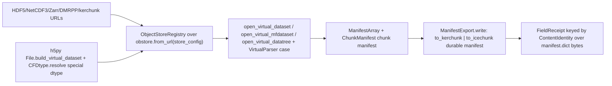

# [PY_DATA_FIELD]

The CF-conventioned labelled N-D field owner: one polymorphic owner over `xarray` reading, virtualizing, and writing CF-metadata field cubes through a `FieldEngine` reader-engine axis, with CF-aware coordinate selection, flox-vectorized grouped/binned/resampled reductions and grouped cumulative scans, byte-range virtual datacubes, and unit/coordinate-reference metadata, materializing to the content-keyed `pyarrow`/Zarr egress the `data:tabular/columnar#SCAN` and `data:gridded/store#STORE` owners already speak. `FieldDataset` is the one frozen field owner; `FieldEngine` the `StrEnum` whose member value IS the `xarray` engine string and whose `open`/`write` delegate selects `open_dataset(engine=)`/`open_zarr` against `to_netcdf(engine=)`/`to_zarr` — config as a domain value carrying behaviour, never an `engine=` flag set — and whose CF-time encode rides the `netcdf4` `date2num`/`num2date` calendar surface and whose write knobs ride the `netcdf4` `createVariable(zlib=, chunksizes=, least_significant_digit=, significant_digits=, quantize_mode=)` compression/quantization axis projected through the `xarray` netcdf4-backend encoding-key vocabulary. `FieldSelection` is the one closed `@tagged_union` CF-selection/reduction axis (`Sel`/`Isel`/`Interp`/`GroupBy`/`GroupByBins`/`Resample`/`Scan` folded by `match`/`case` closed with `assert_never`), the variants are cases not sibling methods; `ReductionPolicy` is the one frozen reduction-behaviour carrier every grouped/binned/resampled/scanned arm threads through one reduction lowering — one `Reduction` literal that IS the registered `flox.aggregations` `func` superset (`std`/`var`/`prod` and their `nan` forms are first-class flox aggregations, never a separate bare set), the `flox.Aggregation`/`flox.Scan` custom escapes on the same `func` slot, plus its `method`/`engine`/`expected_groups`/`reindex`/`skipna`/`min_count`/`fill_value` knobs collapsed onto one value, never a parallel per-reduction case or a bare reduction name, and never two lowering paths for the grouped versus resampled arm. The fallback is the `flox`-absent install band alone — `xarray`'s own `groupby`/`groupby_bins`/`resample`-then-reduction over one `_FALLBACK_CALL` grouper row plus the `_NAN_BASE` nan-prefix strip — never a per-reduction route. `FieldVirtual` folds the byte-range virtual-cube concern into this owner as a CF-native lazy datacube over `virtualizarr` `open_virtual_dataset`/`open_virtual_mfdataset`/`open_virtual_datatree` manifest construction, the one closed `VirtualParser` `@tagged_union` parser seam carrying each `virtualizarr.parsers` constructor payload, the `h5py` `File.build_virtual_dataset` HDF5-native composition, and the one `ManifestExport` `to_kerchunk`/`to_icechunk` durable-manifest export axis — the correct home for CF virtual cubes, never the dense `data:gridded/store#STORE` store. `FieldReceipt` folds content-keyed over the egress, mirroring `data:gridded/store#STORE` `TensorReceipt`, keyed by exactly one runtime `ContentIdentity` and wired through `ReceiptContributor`. This is the labelled-field counterpart of the dense chunk-grid `data:gridded/store#STORE` store — a distinct owner composing the existing Zarr egress and runtime content key, binding the admitted-but-unconsumed `netcdf4`/`h5py`, never a second labelled-array store inside `store`. `xarray` is on `banned-module-level-imports`, so every `xarray` call binds function-local under `# noqa: PLC0415`; `virtualizarr`/`obstore`/`zarr`/`pyarrow` are UNGATED and `netcdf4`/`h5py` are UNGATED Forge source-builds, so they import module-top, while `flox` is the `<3.15` scipy-gated companion arm whose `flox.xarray.xarray_reduce`/`flox.groupby_scan` lowering binds function-local under `# noqa: PLC0415` because `flox.xarray` touches the banned-module-level `xarray`, gated by the `policy.vectorizable` probe (the `flox` install conjoined with a string `func` or an `Aggregation` object) and falling back to the catalogued bare-`xarray` reduction only where `flox` is absent — there is no subprocess seam, and the resample grouper `xarray.groupers.TimeResampler` is an `xarray` symbol `xarray_reduce` accepts positionally, never a `flox` export, while the `ObjectStoreRegistry` the virtual arm threads imports from the canonical `obspec_utils.registry`, never the deprecation-flagged `virtualizarr` re-export.

## [01]-[INDEX]

- [01]-[FIELD]: the `FieldDataset` owner over the `FieldEngine` reader-engine axis — the CF open/read/write entrypoint over `netcdf4`/`h5netcdf`/`zarr` engines binding `xarray` function-local.
- [02]-[SELECT]: the `FieldSelection` CF-aware coordinate-selection and `ReductionPolicy`-threaded grouped/resampled-reduction-and-scan axis — label-indexed `sel`/`isel`/`interp`, flox-vectorized `groupby`/`groupby_bins`/`resample`, and the grouped cumulative `scan` (`cumsum`/`ffill`/`bfill`) folded by `match`/`case` and `assert_never` through one reduction lowering, with `flox.xarray.xarray_reduce` the vectorized reduce and `flox.groupby_scan` the vectorized scan under the `policy.vectorizable` probe, `xarray.groupers.TimeResampler` the resample grouper, one `Reduction` literal that IS the registered `flox` `func` superset (`std`/`var`/`prod` included), and the single `_FALLBACK_CALL` grouper row plus the `_NAN_BASE` nan-strip the bare-`xarray` fallback for the flox-absent install band alone.
- [03]-[VIRTUAL]: the `FieldVirtual` byte-range virtual-datacube arm — the `virtualizarr` `open_virtual_dataset`/`open_virtual_mfdataset`/`open_virtual_datatree` manifest path over the one closed `VirtualParser` `@tagged_union` (HDF/NetCDF3/Zarr/DMRPP/FITS/kerchunk-json/kerchunk-parquet/icechunk), the `h5py` `File.build_virtual_dataset` HDF5-native path, multi-source arity, the one `ManifestExport` `to_kerchunk`/`to_icechunk` export axis, and the `CFDtype` special-dtype seam, the CF-native home re-targeted from `data:gridded/store`.
- [04]-[EGRESS]: the `FieldReceipt` fold materializing to the content-keyed `pyarrow`/Zarr egress, keyed by one runtime `ContentIdentity`, wired through `ReceiptContributor`.

## [02]-[FIELD]

- Owner: `FieldDataset` — one frozen CF field owner carrying the source `ResourceRef`, the `FieldEngine` reader engine, and the CF dimension/coordinate/unit metadata recovered at open; `FieldEngine` the `StrEnum` whose member value is the `xarray` engine string (`netcdf4`/`h5netcdf`/`zarr`) and whose `open`/`write` delegate selects the IO surface that engine owns. The engine is recovered from the source shape (the `.nc`/`.h5`/`.zarr` suffix), never a parallel `open_netcdf`/`open_hdf`/`open_zarr` reader family.
- Cases: `FieldEngine` rows `NETCDF4` (`open_dataset(engine="netcdf4")` / `to_netcdf(engine="netcdf4")` over the Unidata netCDF-4 C library, the CF-compliant time/compound/group container) · `H5NETCDF` (`open_dataset(engine="h5netcdf")` / `to_netcdf(engine="h5netcdf")` over the pure-`h5py` HDF5 backend, the netCDF-4-as-HDF5 read path) · `ZARR` (`open_zarr` / `to_zarr` over the chunked Zarr store, the cloud-native CF carrier sharing the `gridded/store` Zarr chunk grid), matched by `match`/`case`, each binding the `xarray` IO surface that engine owns.
- Entry: `FieldEngine.from_ref` recovers the engine from the `ResourceRef` suffix; `FieldDataset.open` admits a `ResourceRef`, recovers the engine, opens the CF dataset (decoding CF metadata, `chunks="auto"` opting into the lazy dask path), and folds the recovered dimension/coordinate/unit metadata into the frozen owner returned in a `RuntimeRail`; `FieldDataset.read` re-opens the live `xarray.Dataset` for a selection or egress operation; `FieldDataset.write` emits the live dataset through the engine `write` delegate keyed by `ContentIdentity`. One `open`/`read`/`write` entrypoint owns all modalities by input shape, never a per-engine reader family.
- Auto: the `FieldEngine` member value IS the `xarray` `engine=` string, so `open` is one `engine.open(path)` delegate call and `write` one `engine.write(dataset, path)` delegate call — the conflated `engine=` flag set is the deleted form; `netcdf4`/`h5py` are UNGATED Forge source-builds and `zarr` is cp315-clean, so the gate is `xarray`'s banned-module-level import alone, bound function-local under `# noqa: PLC0415` exactly as the `gridded/store#STORE` virtual arm binds its `xarray` combine; CF time/units/calendar decode rides `xarray`'s `decode_cf=True` default through `open_dataset`/`open_zarr`, never a hand-decoded CF time string, and the `netcdf4` write path is the first consumer of the admitted-but-unconsumed `netcdf4` dist — `FieldEngine.NETCDF4.write` threads the `to_netcdf(engine="netcdf4", encoding=)` per-variable encoding map built from one `FieldEncoding` policy carrying the `xarray` netcdf4-backend encoding keys the `netcdf4` `createVariable` owns (`zlib`/`complevel`/`shuffle`/`fletcher32`/`chunksizes`/`least_significant_digit`/`significant_digits`/`quantize_mode`/`dtype`/`fill_value` — `zlib` the bool the netcdf4 backend reads, never a `compression="zlib"` key the backend does not recognize), the `for_vars` projection deriving the per-variable row from the struct field map through `asdict` so a new knob is one field with zero projection edit, and the CF time encode rides the `netcdf4` `date2num`/`num2date` calendar surface, so `netcdf4` is a mined capability not a bare engine string; the `h5netcdf` engine threads the SAME `FieldEncoding` through `for_vars(quantize=False)` so the shared `zlib`/`complevel`/`shuffle`/`fletcher32`/`chunksizes` compression band reaches the pure-`h5py` HDF5 backend while the `_QUANTIZE_KEYS` netCDF-C-only lossy band (`least_significant_digit`/`significant_digits`/`quantize_mode`) strips off, never an unencoded `h5netcdf` write that drops the cube's compression nor a quantization key the h5netcdf backend rejects, and the Zarr egress alone defers its codec pipeline to the `gridded/store#STORE` chunk grid; the recovered metadata (`dims`/`coords`/`attrs` unit/CRS) folds into the frozen owner so the interior never re-opens for a metadata accessor.
- Packages: `xarray` (`open_dataset(engine=, chunks=)`/`open_zarr`/`to_netcdf(engine=, encoding=)`/`to_zarr`/`Dataset.dims`/`Dataset.coords`/`Dataset.attrs`/`Dataset.variables`, banned-module-level, function-local), `netcdf4` (the `netcdf4` engine plus the mined write surface — `createVariable(zlib=, complevel=, shuffle=, fletcher32=, chunksizes=, least_significant_digit=, significant_digits=, quantize_mode=, fill_value=)` compression/quantization knobs threaded as the `to_netcdf` `encoding` map keyed by the `xarray` netcdf4-backend encoding-key vocabulary, `date2num`/`num2date` CF time, and the `__has_quantization_support__`/`__has_blosc_support__`/`__has_zstandard_support__` module-level build-capability flags gating the non-`zlib` quantization and compressor rows, the first consumer of the admitted-but-unconsumed dist, module-top), `h5py` (the `h5netcdf` HDF5 engine backend, second consumer beside the `[3]-[VIRTUAL]` native path, module-top), `beartype` (`@beartype(conf=FAULT_CONF)` the public domain-admission contract on the `FieldDataset.open` factory so a caller `ResourceRef` argument that violates the in-process annotation raises the canonical `BeartypeCallHintViolation` root the `runtime/faults#FAULT` `CLASSIFY` `api` row folds onto the rail at the caller's enclosing fence, the shared `FAULT_CONF` the sibling `gridded/store#STORE` admission seams bind; `read` over the owner's own held engine carries no decorator), runtime (`ResourceRef`/`ContentIdentity`/`ContentKey`/`RuntimeRail`/`boundary`/`FAULT_CONF` the shared beartype violation-redirect config/`ReceiptContributor`).
- Growth: a new CF engine (`pydap`/`scipy`/`zarr` v2) is one `FieldEngine` member carrying its `open`/`write` delegate; a new CF metadata facet (CRS/grid-mapping/cell-methods) is one field on `FieldDataset`; a new compression/quantization knob is one field on `FieldEncoding`; zero new surface.
- Boundary: no compute-package numeric trio (NumPy/SciPy labelled-array compute is `compute`), no production field session, no durable product store; `data` emits a portable content-addressed CF field cube and its selection/reduction plan, not a runtime compute graph. A second labelled-array store inside `store` (the `gridded/store#STORE` Growth forbids it), a parallel `NetcdfDataset`/`HdfDataset`/`ZarrDataset` family, an `engine=` flag set, a module-top `xarray` import on this banned-module-level page, an undecorated `FieldDataset.open` admitting a caller `ResourceRef` without the `@beartype(conf=FAULT_CONF)` public-seam contract the sibling `gridded/store#STORE` admission factories share, an unencoded `h5netcdf` write that drops the cube's compression where `for_vars(quantize=False)` threads the shared band, a netCDF-C-only `quantize_mode`/`significant_digits` key passed to the h5netcdf backend that rejects it, a module-level mutable `dict` dispatch/correspondence table where `frozendict` owns the row, and a hand-decoded CF time string are the deleted forms.

```python signature
from enum import StrEnum
from typing import TYPE_CHECKING, Final, Literal, assert_never

from beartype import beartype
from msgspec import Struct
from msgspec.structs import asdict

from rasm.runtime.content_identity import ContentIdentity, ContentKey
from rasm.runtime.faults import FAULT_CONF, RuntimeRail, boundary
from rasm.runtime.roots import ResourceRef

if TYPE_CHECKING:
    from collections.abc import Callable

    import xarray as xr


type FieldDims = tuple[str, ...]
type FieldCoords = tuple[str, ...]
type QuantizeMode = Literal["BitGroom", "BitRound", "GranularBitRound"]


# the netcdf4-only encoding keys the h5netcdf backend rejects: lossy quantization rides the netCDF-C
# `createVariable(least_significant_digit=, significant_digits=, quantize_mode=)` surface alone, so a
# `for_vars(quantize=False)` projection strips them and the shared compression band threads to both.
_QUANTIZE_KEYS: "Final[frozenset[str]]" = frozenset({"least_significant_digit", "significant_digits", "quantize_mode"})


class FieldEncoding(Struct, frozen=True):
    zlib: bool = True
    complevel: int = 4
    shuffle: bool = True
    fletcher32: bool = False
    chunksizes: tuple[int, ...] | None = None
    least_significant_digit: int | None = None
    significant_digits: int | None = None
    quantize_mode: QuantizeMode = "BitGroom"
    dtype: str | None = None
    fill_value: float | None = None

    def for_vars(self, names: "tuple[str, ...]", *, quantize: bool = True) -> dict[str, dict[str, object]]:
        row = {
            key: value
            for key, value in asdict(self).items()
            if value is not None and (quantize or key not in _QUANTIZE_KEYS)
        }
        return {name: row for name in names}


class FieldEngine(StrEnum):
    NETCDF4 = "netcdf4"
    H5NETCDF = "h5netcdf"
    ZARR = "zarr"

    @classmethod
    def from_ref(cls, ref: ResourceRef) -> "FieldEngine":
        match ref.path.suffix.lower():
            case ".zarr":
                return cls.ZARR
            case ".h5" | ".hdf5":
                return cls.H5NETCDF
            case _:
                return cls.NETCDF4

    def open(self, path: str) -> "Callable[[], xr.Dataset]":
        import xarray as xr  # noqa: PLC0415

        match self:
            case FieldEngine.ZARR:
                return lambda: xr.open_zarr(path, decode_cf=True)
            case FieldEngine.NETCDF4 | FieldEngine.H5NETCDF:
                return lambda: xr.open_dataset(path, engine=self.value, chunks="auto", decode_cf=True)
            case unreachable:
                assert_never(unreachable)

    def write(self, dataset: "xr.Dataset", path: str, encoding: FieldEncoding) -> "Callable[[], None]":
        names = tuple(dataset.data_vars)
        match self:
            case FieldEngine.ZARR:
                return lambda: dataset.to_zarr(path, mode="w")
            case FieldEngine.NETCDF4:
                return lambda: dataset.to_netcdf(path, engine="netcdf4", encoding=encoding.for_vars(names))
            case FieldEngine.H5NETCDF:
                return lambda: dataset.to_netcdf(path, engine="h5netcdf", encoding=encoding.for_vars(names, quantize=False))
            case unreachable:
                assert_never(unreachable)


class FieldDataset(Struct, frozen=True):
    ref: ResourceRef
    engine: FieldEngine
    dims: FieldDims
    coords: FieldCoords
    units: dict[str, str]

    @classmethod
    @beartype(conf=FAULT_CONF)
    def open(cls, ref: ResourceRef) -> "RuntimeRail[FieldDataset]":
        return boundary("field.open", lambda: _open(ref, FieldEngine.from_ref(ref)))

    def read(self) -> "RuntimeRail[xr.Dataset]":
        return boundary("field.read", self.engine.open(str(self.ref.path)))

    def write(
        self, dataset: "xr.Dataset", target: ResourceRef, encoding: FieldEncoding = FieldEncoding()
    ) -> "RuntimeRail[FieldReceipt]":
        return boundary("field.write", lambda: _write(self, dataset, target, encoding)).bind(lambda railed: railed)


def _open(ref: ResourceRef, engine: FieldEngine) -> FieldDataset:
    dataset = engine.open(str(ref.path))()
    units = {name: str(var.attrs.get("units", "")) for name, var in dataset.variables.items()}
    return FieldDataset(ref=ref, engine=engine, dims=tuple(dataset.dims), coords=tuple(dataset.coords), units=units)
```

## [03]-[SELECT]

- Owner: `FieldSelection` — one closed `@tagged_union` CF-selection/reduction-and-scan axis; the variants are cases the `apply` fold dispatches by `match`/`case` closed with `assert_never`, never a `sel`/`isel`/`groupby`/`resample` sibling-method family on `FieldDataset`. The selection runs against the live `xarray.Dataset` the owner re-opens and returns a transformed `xarray.Dataset`, keeping label-vs-position, point-vs-group, and reduce-vs-scan as one axis. `ReductionPolicy` is the one frozen reduction-behaviour carrier every grouped/binned/resampled/scanned arm threads — one `Reduction` literal that IS the registered `flox.aggregations` `func` superset (`all`/`any`/`count`/`sum`/`prod`/`mean`/`std`/`var`/`max`/`min`/`argmax`/`argmin`/`quantile`/`median`/`mode`/`first`/`last` and their `nan` forms, with `std`/`var`/`prod` first-class flox aggregations the kernel answers, never a separate `BareReduction` set), the `flox.Aggregation` custom-reduce escape on the `ReductionFunc` `func` slot and the `flox.Scan` custom-scan escape on the `ScanRail` `scan` slot (the reduce and scan slots are distinct because `xarray_reduce` and `groupby_scan` are distinct kernels), its parallelization `method` (`map-reduce`/`blockwise`/`cohorts`), vectorization `engine` (`flox`/`numpy`/`numba`/`numbagg`), declared `expected_groups`, the `ReindexStrategy(blockwise, array_type)` combine-reindex policy (the `flox` replacement for the bare-`bool` reindex, `array_type` selecting dense `NUMPY` against `SPARSE_COO` for high-cardinality groups), `skipna`, `min_count` sparse floor, `fill_value`, `sort`/`keep_attrs` combine knobs, resample `freq`, and bin-flag collapsed onto one policy value whose `kwargs` projection feeds the `flox.xarray.xarray_reduce` keyword set under the `policy.vectorizable` probe — the `_HAS_FLOX` install probe conjoined with a string `func` (any registered aggregation, including `std`/`var`/`prod`) or an `Aggregation`/`Scan` object — never a per-reduction case and never a bare reduction-name argument. The only fallback is the `flox`-absent install band: one `_FALLBACK_CALL` grouper row (`group`/`bins`/`resample`) carries one `xarray` `groupby`/`groupby_bins`/`resample` call each, the reduction-name then applied through the `_NAN_BASE` map that strips the `nan` prefix off the closed `Reduction` literal's own members (derived by comprehension over the whole literal, never a hand-listed dict that omits a member and never a stringly-typed `getattr(grouper, name.removeprefix("nan"))`), since bare `xarray` reduces through `.mean(skipna=)` rather than a `.nanmean()` member. The `skipna`/`min_count` pair threads only for the `_SKIPNA_BASE` set the bare reduction accepts — `count`/`all`/`any`/`argmax`/`argmin`/`first`/`last` reject it — and `mode`/`nanmode` is the one `flox`-registered aggregation with no `xarray` grouper member, so `policy.base` maps it to `reduce` (the slot the bare grouper rejects) and the `flox`-absent band raises on `mode` explicitly rather than calling a phantom `grouped.mode`; the band is total over every reduction the bare grouper natively exposes, with `mode` the documented flox-only narrowing rather than a silently-broken arm. The scan arm mirrors the reduction nan-strip through `_SCAN_BASE` derived by comprehension over the closed `ScanFunc` literal, so the bare-`xarray` fallback lowers `nancumsum` to the `cumsum(skipna=)` member and `ffill`/`bfill` to their nan-free members rather than calling a phantom `grouped.nancumsum`.
- Cases: `FieldSelection` rows `Sel(indexers, method, tolerance)` (label-indexed `Dataset.sel`, the CF-coordinate label selection — a `time`/`lat`/`lon` label dict, `method="nearest"` the inexact-match policy) · `Isel(indexers)` (positional `Dataset.isel`, integer-axis slicing) · `Interp(coords, method)` (coordinate interpolation `Dataset.interp`, the `"linear"`/`"cubic"` regridding onto new label positions) · `GroupBy(by, policy)` (grouping over one or more coordinates lowered through the one `_reduce(dataset, by, dim, policy, grouper)` lowering) · `GroupByBins(by, bins, policy)` (the same lowering with `isbin=True` and `expected_groups` carrying the bin edges, the binned-coordinate aggregation) · `Resample(indexer, policy)` (the CF-time frequency resample — `{"time": "1D"}` — lowered through the same `_reduce` path with the resample frequency carried on the policy, the `xarray.groupers.TimeResampler(freq)` grouper passed positionally to `xarray_reduce` on the vectorized arm, never a second reduction code path) · `Scan(by, policy)` (the grouped cumulative scan — `cumsum`/`nancumsum`/`ffill`/`bfill` — the one running-total/forward-fill modality the reduce family cannot express, lowered through the raw-array `flox.groupby_scan` lifted onto the cube by `xr.apply_ufunc` on the vectorized arm and the bare-`xarray` `groupby(...).cumsum()`/`.ffill()` fallback, returning one value per input element rather than one per group), matched by `match`/`case`, each binding the lowering that owns it.
- Entry: `apply(selection, dataset)` runs one `FieldSelection` against the live `xarray.Dataset` and returns a `RuntimeRail[xr.Dataset]`; the grouped, binned, and resampled arms route through the one `_reduce(dataset, by, dim, policy, grouper)` lowering and the scan arm through the one `_scan(dataset, by, policy, grouper)` lowering, both keyed by the `ReductionPolicy`, so a `mean`/`sum`/`std`/`cumsum` method family on the selection is collapsed to one frozen policy value and the grouped-versus-resampled-versus-scan split is the `by`/`dim`/`isbin` policy data plus the `_FALLBACK_CALL` grouper tag alone, never four reduction code paths.
- Auto: the label-vs-position split is the `Sel`/`Isel` case, never an `exact=`/`positional=` flag; `Sel` carries `method`/`tolerance` so the inexact CF-coordinate match is one knob on the case, not a parallel `sel_nearest` method; multi-array grouping is one `by: tuple[str, ...]` widening on the grouped arms feeding `xarray_reduce(obj, *by, ...)` directly, never a `groupby_multi` sibling; the policy carriers thread through one `replace(policy, ...)` `msgspec.structs` derivation (`isbin`/`expected_groups` on the bins arm, `freq` on the resample arm, the scan `func` default on the scan arm), never a `policy.__dict__` splat a frozen `msgspec.Struct` does not expose. The one `_reduce` lowering emits the vectorized `flox.xarray.xarray_reduce(obj, *by, func=, expected_groups=, isbin=, dim=, method=, engine=, fill_value=, min_count=, skipna=, sort=, reindex=, keep_attrs=)` call when `policy.vectorizable` holds — every member catalogue-settled against the folder `flox` `.api`, the full `Reduction` superset including `std`/`var`/`prod` admitted as a single `func` string — the `method` (`map-reduce`/`blockwise`/`cohorts`) and `engine` (`flox`/`numpy`/`numba`/`numbagg`) parallelization knobs plus the `sort`/`keep_attrs` combine knobs and the `ReindexStrategy` reindex policy riding straight onto the call through `policy.kwargs()`, the resample arm carrying the `xarray.groupers.TimeResampler(freq)` grouper `xarray_reduce` accepts positionally as a `by` argument — `flox` exports no `TimeResampler`, so the import binds from `xarray.groupers`; `flox.groupby_scan(array, *by, func=, axis=, method=, engine=)` is the raw-array cumulative kernel (`np.ndarray`/`DaskArray` in and out, raw `by` code arrays, no xarray-aware mirror the way `xarray_reduce` mirrors `groupby_reduce`), so the `_scan` lowering lifts it onto the labelled cube through `xr.apply_ufunc` over the `by[0]` scan dim — the cube data and each group-code coordinate enter as core-dim raw arrays and the one-value-per-element result re-wraps with the cube's own coords — never a `Dataset.map(lambda da: groupby_scan(da, ...))` whose mapper must return a `DataArray` the bare-ndarray kernel does not produce and whose `da`/coordinate-name `by` arguments the raw-array kernel cannot consume. On the band where `flox` is absent, the fallback indexes the `_FALLBACK_CALL` grouper tag — `dataset.groupby`/`groupby_bins`/`resample` then the `Reduction`-name reduction applied through the `_NAN_BASE` map (nan-prefix stripped off the closed literal's own members) over the `_SKIPNA_BASE`-gated `skipna`/`min_count`, or the grouped `.cumsum()`/`.ffill()`/`.bfill()` for the scan arm — so the fallback dispatch is total over the grouper kind and over every reduction the bare grouper natively exposes, never a stringly-typed `getattr` and never a partial hand-listed reduction dict, with `mode` the one flox-only reduction the band raises on rather than calling a phantom grouper member; `flox` is cp315-clean module-top yet the `flox.xarray`, `flox.groupby_scan`, and `xarray.groupers`/`xarray.apply_ufunc` members touch the banned-module-level `xarray` so the `_reduce`/`_scan` bodies bind function-local under `# noqa: PLC0415`; every arm returns a transformed `xarray.Dataset` the `[4]-[EGRESS]` fold then materializes.
- Receipt: the selection itself emits no receipt — it transforms the live dataset; the receipt folds once at egress through `[4]-[EGRESS]` `FieldReceipt`, never a per-selection rail.
- Packages: `xarray` (`Dataset.sel(method=, tolerance=)`/`isel`/`interp` and the bare-grouper `groupby`/`groupby_bins`/`resample` then the reduction-name family `mean`/`sum`/`std`/`var`/`min`/`max`/`median`/`quantile`/`count`/`prod` and the cumulative `cumsum`/`ffill`/`bfill` fallback, the `apply_ufunc(func, *args, input_core_dims=, output_core_dims=, dask=)` raw-kernel lift the vectorized scan arm rides, plus the `xarray.groupers.TimeResampler(freq, closed, label, origin, offset)` resample grouper object, banned-module-level, function-local), `flox` (`flox.xarray.xarray_reduce(obj, *by, func=, expected_groups=, isbin=, sort=, dim=, fill_value=, dtype=, method=, engine=, keep_attrs=, skipna=, min_count=, reindex=)` the vectorized grouped/binned/resampled reduce over the full registered `func` superset, `flox.groupby_scan(array, *by, func=, expected_groups=, axis=, dtype=, method=, engine=)` the vectorized grouped cumulative scan, `flox.Aggregation(name, numpy=, chunk=, combine=, finalize=, fill_value=, dtypes=, final_dtype=, reduction_type=, new_dims_func=)` the custom-reduce escape on the `func` slot and `flox.Scan(name, binary_op, scan, reduction, identity)` the custom-scan escape on the distinct `scan` slot, `flox.ReindexStrategy(blockwise, array_type=ReindexArrayType.AUTO)` the combine-reindex policy, and `flox.groupby_reduce` the raw-array reduce — every member catalogue-settled against the folder `flox` `.api`, cp315-clean module-top yet bound function-local because the `flox.xarray`/`flox.groupby_scan` members touch banned-module-level `xarray`), runtime (`RuntimeRail`/`boundary`).
- Growth: a new CF-selection intent is one `FieldSelection` case; a new flox reduction is one `Reduction` literal member and the `_NAN_BASE` fallback map derives it automatically through the `nan`-prefix comprehension with zero map edit; a custom reduction is one `flox.Aggregation` object on the `ReductionPolicy.func` slot and a custom scan one `flox.Scan` object on the distinct `ReductionPolicy.scan` slot; a new parallelization strategy or aggregation engine is one `ReductionMethod`/`ReductionEngine` literal member on `ReductionPolicy`; a new reindex intermediate is one `ReindexArrayType` member on the `ReductionPolicy.reindex` policy; a new scan func is one `ScanFunc` literal member the `_SCAN_BASE` fallback map derives automatically through the same `nan`-prefix comprehension; a new inexact-match policy is one field on the `Sel` case; zero new surface and never a `sel_*`/`group_*` method family.
- Boundary: no compute numeric kernel, no durable selection store; a `sel`/`isel`/`groupby`/`resample`/`cumsum` sibling-method family on `FieldDataset`, a per-reduction case, a bare reduction-name argument, two reduction lowering paths for the grouped versus resampled arm, a `FloxReduction`/`BareReduction` split routing `std`/`var`/`prod` to a slow bare path where flox registers them as `func` values, a stringly-typed `getattr(grouper, name.removeprefix("nan"))` reduction dispatch, a hand-listed `_BARE_REDUCE` dict that omits superset members, a `flox`-imported `TimeResampler` where the symbol lives in `xarray.groupers`, an erased `func: object`/`fill_value: object` slot where a precise `Reduction`/`float` type holds, a bare-`bool` `reindex` where `flox.ReindexStrategy` carries the dense/sparse intermediate, a scan smuggled onto `xarray_reduce` where `groupby_scan` is the one cumulative entrypoint, a `Dataset.map(lambda da: groupby_scan(da, *by, ...))` that hands the raw-array kernel a `DataArray` and coordinate-name `by` arguments and expects a `DataArray` back where `apply_ufunc` is the correct raw-kernel lift, an unconditional `skipna`/`min_count` on a bare `count`/`all`/`any`/`argmax`/`first` reduction that rejects the pair, a `mode` fallback calling a phantom `grouped.mode` where `mode` is flox-only and the band raises, a scan fallback calling a phantom `grouped.nancumsum` where `_SCAN_BASE` strips the `nan` prefix to `cumsum(skipna=)`, a `flox.Scan` custom-scan smuggled onto the `func` reduce slot where the distinct `scan` slot carries it, a `ScanFunc`-only `scan` slot that cannot carry the `flox.Scan` escape, a `policy.__dict__` splat over a slotted frozen `Struct`, the slow bare-`groupby` reduction path where `flox` vectorizes, and a positional/label flag are the deleted forms.

```python signature
from builtins import frozendict
from importlib.util import find_spec
from typing import TYPE_CHECKING, Final, Literal, assert_never

from expression import case, tag, tagged_union
from msgspec import Struct
from msgspec.structs import replace

from rasm.runtime.faults import RuntimeRail, boundary

if TYPE_CHECKING:
    from collections.abc import Callable

    import xarray as xr
    from flox import Aggregation, ReindexStrategy, Scan


# the full registered flox.aggregations func superset: std/var/prod (and nan forms) ARE
# first-class flox aggregations, so there is one Reduction set, never a bare-vs-flox split.
type Reduction = Literal[
    "all", "any", "count", "sum", "nansum", "prod", "nanprod", "mean", "nanmean", "std", "nanstd",
    "var", "nanvar", "max", "nanmax", "min", "nanmin", "argmax", "nanargmax", "argmin", "nanargmin",
    "quantile", "nanquantile", "median", "nanmedian", "mode", "nanmode", "first", "nanfirst", "last", "nanlast",
]
type ScanFunc = Literal["cumsum", "nancumsum", "ffill", "bfill"]
type ReductionMethod = Literal["map-reduce", "blockwise", "cohorts"]
type ReductionEngine = Literal["flox", "numpy", "numba", "numbagg"]
type GrouperKind = Literal["group", "bins", "resample"]
type ReductionFunc = "Reduction | Aggregation"
type ScanRail = "ScanFunc | Scan"
type ReindexPolicy = "ReindexStrategy | bool | None"

_HAS_FLOX = find_spec("flox") is not None
# the nan-prefix strip derived once over each closed scan/reduction literal: the bare-`xarray`
# grouper exposes `cumsum`/`ffill`/`bfill` and `mean(skipna=)`, never a `nan`-prefixed member,
# so the flox-only nan forms lower to the base member threading `skipna` on the fallback band.
_NAN_BASE: "Final[frozendict[str, str]]" = frozendict({name: name.removeprefix("nan") for name in Reduction.__value__.__args__})
_SCAN_BASE: "Final[frozendict[str, str]]" = frozendict({name: name.removeprefix("nan") for name in ScanFunc.__value__.__args__})
# the skipna/min_count-bearing bare reductions: count/all/any/argmax/argmin/first/last reject the
# pair, so the bare path threads it only for this set. `mode` has NO xarray grouper member and is
# flox-only — `policy.base` maps it to `reduce` so the flox-absent band raises explicitly here.
_SKIPNA_BASE: "Final[frozenset[str]]" = frozenset({"sum", "prod", "mean", "std", "var", "max", "min", "median", "quantile"})
_FALLBACK_CALL: "Final[frozendict[GrouperKind, Callable[[xr.Dataset, tuple[object, ...]], object]]]" = frozendict({
    "group": lambda ds, p: ds.groupby(list(p[0])),
    "bins": lambda ds, p: ds.groupby_bins(p[0], list(p[1])),
    "resample": lambda ds, p: ds.resample({p[0]: p[1]}),
})


class ReductionPolicy(Struct, frozen=True):
    func: ReductionFunc = "mean"
    scan: ScanRail = "cumsum"
    method: ReductionMethod = "map-reduce"
    engine: ReductionEngine = "flox"
    expected_groups: tuple[object, ...] | None = None
    isbin: bool = False
    min_count: int | None = None
    fill_value: float | None = None
    sort: bool = True
    reindex: ReindexPolicy = None
    keep_attrs: bool = True
    freq: str | None = None
    skipna: bool = True

    def kwargs(self) -> dict[str, object]:
        row = {
            "func": self.func, "expected_groups": self.expected_groups, "isbin": self.isbin, "skipna": self.skipna,
            "method": self.method, "engine": self.engine, "min_count": self.min_count, "fill_value": self.fill_value,
            "sort": self.sort, "reindex": self.reindex, "keep_attrs": self.keep_attrs,
        }
        return {key: value for key, value in row.items() if value is not None}

    @property
    def vectorizable(self) -> bool:
        return _HAS_FLOX

    @property
    def base(self) -> str:
        if not isinstance(self.func, str):
            return "reduce"
        # `mode`/`nanmode` are flox-only — no bare `xarray` grouper member — so they map to the
        # `reduce` slot the bare grouper rejects, making the flox-absent band raise explicitly
        # rather than calling a phantom `grouped.mode`.
        return "reduce" if _NAN_BASE[self.func] == "mode" else _NAN_BASE[self.func]

    def fallback_kwargs(self) -> dict[str, object]:
        if self.base not in _SKIPNA_BASE:
            return {}
        return {"skipna": self.skipna} | ({"min_count": self.min_count} if self.min_count is not None else {})


@tagged_union(frozen=True)
class FieldSelection:
    tag: Literal["sel", "isel", "interp", "groupby", "groupby_bins", "resample", "scan"] = tag()
    sel: tuple[dict[str, object], str | None, float | None] = case()
    isel: dict[str, int | slice] = case()
    interp: tuple[dict[str, object], str] = case()
    groupby: tuple[tuple[str, ...], ReductionPolicy] = case()
    groupby_bins: tuple[tuple[str, ...], tuple[object, ...], ReductionPolicy] = case()
    resample: tuple[dict[str, str], ReductionPolicy] = case()
    scan: tuple[tuple[str, ...], ReductionPolicy] = case()

    @staticmethod
    def Sel(indexers: dict[str, object], method: str | None = None, tolerance: float | None = None) -> "FieldSelection":
        return FieldSelection(sel=(indexers, method, tolerance))

    @staticmethod
    def Isel(indexers: dict[str, int | slice]) -> "FieldSelection":
        return FieldSelection(isel=indexers)

    @staticmethod
    def Interp(coords: dict[str, object], method: str = "linear") -> "FieldSelection":
        return FieldSelection(interp=(coords, method))

    @staticmethod
    def GroupBy(*by: str, policy: ReductionPolicy = ReductionPolicy()) -> "FieldSelection":
        return FieldSelection(groupby=(by, policy))

    @staticmethod
    def GroupByBins(*by: str, bins: tuple[object, ...], policy: ReductionPolicy = ReductionPolicy()) -> "FieldSelection":
        return FieldSelection(groupby_bins=(by, bins, replace(policy, isbin=True, expected_groups=bins)))

    @staticmethod
    def Resample(indexer: dict[str, str], policy: ReductionPolicy = ReductionPolicy()) -> "FieldSelection":
        ((dim, freq),) = indexer.items()
        return FieldSelection(resample=({dim: freq}, replace(policy, freq=freq)))

    @staticmethod
    def Scan(*by: str, func: "ScanRail" = "cumsum", policy: ReductionPolicy = ReductionPolicy()) -> "FieldSelection":
        return FieldSelection(scan=(by, replace(policy, scan=func)))


def apply(selection: FieldSelection, dataset: "xr.Dataset") -> "RuntimeRail[xr.Dataset]":
    return boundary(f"field.select.{selection.tag}", lambda: _select(selection, dataset))


def _select(selection: FieldSelection, dataset: "xr.Dataset") -> "xr.Dataset":
    match selection:
        case FieldSelection(tag="sel", sel=(indexers, method, tolerance)):
            return dataset.sel(indexers, method=method, tolerance=tolerance)
        case FieldSelection(tag="isel", isel=indexers):
            return dataset.isel(indexers)
        case FieldSelection(tag="interp", interp=(coords, method)):
            return dataset.interp(coords, method=method)
        case FieldSelection(tag="groupby", groupby=(by, policy)):
            return _reduce(dataset, by, by, policy, ("group", (by,)))
        case FieldSelection(tag="groupby_bins", groupby_bins=(by, edges, policy)):
            return _reduce(dataset, by, by, policy, ("bins", (by[0], edges)))
        case FieldSelection(tag="resample", resample=(indexer, policy)):
            ((dim, freq),) = indexer.items()
            return _reduce(dataset, (dim,), (dim,), policy, ("resample", (dim, freq)))
        case FieldSelection(tag="scan", scan=(by, policy)):
            return _scan(dataset, by, policy, ("group", (by,)))
        case unreachable:
            assert_never(unreachable)


def _grouper(by: tuple[str, ...], dim: tuple[str, ...], policy: ReductionPolicy) -> "tuple[object, ...]":
    from xarray.groupers import TimeResampler  # noqa: PLC0415

    return tuple(TimeResampler(policy.freq) if name == dim[0] and policy.freq else name for name in by)


def _reduce(
    dataset: "xr.Dataset", by: tuple[str, ...], dim: tuple[str, ...], policy: ReductionPolicy, fallback: "tuple[GrouperKind, tuple[object, ...]]"
) -> "xr.Dataset":
    if policy.vectorizable:
        from flox.xarray import xarray_reduce  # noqa: PLC0415

        return xarray_reduce(dataset, *_grouper(by, dim, policy), dim=dim, **policy.kwargs())
    grouped = _FALLBACK_CALL[fallback[0]](dataset, fallback[1])
    return getattr(grouped, policy.base)(**policy.fallback_kwargs())


def _scan(
    dataset: "xr.Dataset", by: tuple[str, ...], policy: ReductionPolicy, fallback: "tuple[GrouperKind, tuple[object, ...]]"
) -> "xr.Dataset":
    if policy.vectorizable:
        import xarray as xr  # noqa: PLC0415
        from flox import groupby_scan  # noqa: PLC0415

        # `groupby_scan` is the raw-array kernel (`np.ndarray`/`DaskArray` in and out, raw `by` code
        # arrays, no xarray-aware mirror), so `apply_ufunc` lifts it onto the labelled cube over the
        # `by[0]` scan dim: the data and each group-code coord enter as core-dim raw arrays and the
        # one-value-per-element result re-wraps with the cube's coords — never `Dataset.map`, whose
        # mapper must return a `DataArray` the bare-ndarray kernel does not.
        return xr.apply_ufunc(
            lambda arr, *codes: groupby_scan(arr, *codes, func=policy.scan, axis=-1, method=policy.method, engine=policy.engine),
            dataset,
            *(dataset[name] for name in by),
            input_core_dims=[[by[0]], *([by[0]] for _ in by)],
            output_core_dims=[[by[0]]],
            dask="parallelized",
        )
    grouped = _FALLBACK_CALL[fallback[0]](dataset, fallback[1])
    name = _SCAN_BASE[policy.scan] if isinstance(policy.scan, str) else "cumsum"
    return getattr(grouped, name)(skipna=policy.skipna) if name == "cumsum" else getattr(grouped, name)()
```

## [04]-[VIRTUAL]

- Owner: `FieldVirtual` — the byte-range virtual-datacube arm folded into the field owner as a CF-native lazy cube, never the dense `data:gridded/store#STORE` store; `FieldVirtual.aggregate` aggregates archival HDF5/NetCDF/Zarr/DMRPP/kerchunk/FITS/icechunk chunk byte ranges into one zero-copy virtual `xarray.Dataset` through `virtualizarr` `ManifestArray`/`ChunkManifest` manifest construction (chunk-reference dicts of `path`/`offset`/`length`, the actual bytes staying in the source files) and the `h5py` `VirtualLayout` HDF5-native composition, the arm consuming the frozen owner's own `sources`/`target`/`combine`/`export`/`store_config` fields rather than a staticmethod arg list. `VirtualParser` is the one closed `@tagged_union` `virtualizarr` parser axis carrying every parser's own full constructor payload (`hdf(group, drop_variables, reader_factory)` · `netcdf3(group, skip_variables, reader_options)` · `zarr(group, skip_variables)` · `dmrpp(group, skip_variables)` · `fits(group, skip_variables, reader_options)` · `kerchunk_json(group, fs_root, skip_variables)` · `kerchunk_parquet(group, fs_root, skip_variables, reader_options)` · `icechunk(branch, tag, snapshot_id, group, skip_variables, batch_size)`) whose `for_source` recovers the row from the source suffix and whose `build` fold returns the `virtualizarr.parsers` constructor that row owns one-to-one with the catalogue arity — the `HDFParser` `reader_factory` and the `NetCDF3Parser`/`FITSParser`/`KerchunkParquetParser` `reader_options` threaded so the per-parser read-tuning capability is captured rather than dropped — the format dimension a case not a parallel reader. `ManifestExport` is the one closed `@tagged_union` durable-manifest export axis collapsing the two accessor targets — `kerchunk(filepath, format, record_size, categorical_threshold)` the ungated `to_kerchunk` JSON/Parquet/dict target and `icechunk(store, group, append_dim, region, validate_containers, last_updated_at, write_inherited_coords)` the `<3.15` gated `to_icechunk` durable-snapshot escalation whose `write_inherited_coords` slot threads the hierarchical tree-accessor coord-inheritance control the dataset accessor lacks — whose `write` fold drives `cube.virtualize.to_kerchunk`/`to_icechunk` (the `isinstance(cube, DataTree)` discriminant routing the tree accessor's `write_inherited_coords` keyword against the dataset accessor's `group`/`append_dim`/`region` set) and whose `nbytes` reads the shared `virtualize.nbytes` accessor, never a bare `KerchunkFormat` flag beside a parallel accessor call, never a `write_inherited_coords` named in prose but absent from the case the tree arm threads. `CFDtype` is the one closed `@tagged_union` HDF5 type-metadata axis (`plain`/`string`/`vlen`/`enum`/`opaque`/`ref`) whose `resolve` fold returns the `h5py` `string_dtype`/`vlen_dtype`/`enum_dtype`/`opaque_dtype`/`ref_dtype` the raw NumPy dtype cannot describe and whose `inspect` static is the total inverse of `resolve` over all six cases, recovering a `CFDtype` from a live dtype through the `check_enum_dtype`/`check_string_dtype`/`check_vlen_dtype`/`check_opaque_dtype`/`check_ref_dtype` predicate ladder so an opaque or reference dtype round-trips to its own case rather than collapsing to `plain`, collapsing the special-dtype constructor and inspector families onto one case family rather than parallel call sites. Every `open_virtual_dataset`/`open_virtual_mfdataset`/`open_virtual_datatree` call carries an `ObjectStoreRegistry` mapping the source URL prefix to an `obstore` `from_url(url, config, client_options, retry_config)` backend threaded with the owner's `store_config` and the `VirtualParser`-selected parser; the registry is the mandatory positional, never an optional knob. The native HDF5 path composes a single virtual HDF5 file from constituent byte-range `VirtualSource` slabs through the context-managed `File.build_virtual_dataset` builder over `VirtualLayout`/`create_virtual_dataset` before the manifest aggregation, the capability the `virtualizarr` `HDFParser` path lacks; each `Slab` is the self-describing `(path, name, source_shape, region)` four-tuple so every `VirtualSource` carries its own concrete `source_shape` rather than the full layout shape every slab would otherwise inherit, the `CFDtype`-resolved special dtype threads onto both the layout and every source, the `maxshape` resizable axis rides the layout sink alone, and the `fillvalue` rides the `create_virtual_dataset` materializer.
- Cases: `FieldVirtual` aggregates over two manifest-construction paths recovered from the source kind, never a second virtual owner — the `virtualizarr` manifest path (one `open_virtual_dataset(url, registry=, parser=, drop_variables=, loadable_variables=, decode_times=)` for the single-source arity, one `open_virtual_mfdataset(urls, registry=, parser=, concat_dim=, combine=, parallel=, compat=, join=)` over the URL tuple for the multi-source arity, both landing `ManifestArray`-backed datasets) and the `h5py` native path (a single virtual HDF5 file composed from constituent HDF5 byte-range `VirtualSource` slabs assigned by slice into a `VirtualLayout(shape, dtype, maxshape)`, materialized through the `File.build_virtual_dataset(name, shape, dtype, maxshape, fillvalue)` context-manager builder, the HDF5-native virtual file feeding the manifest path as one source). Both paths land in the same `ManifestArray` chunk manifest; the parser is the `VirtualParser` case, the source-variable type the `CFDtype` case, the export target the `ManifestExport` case, never a per-format owner, a per-special-type constructor family, or a per-accessor export branch.
- Entry: `FieldVirtual.aggregate` builds one `ObjectStoreRegistry` over the owner's source URLs threaded with `store_config`, opens the single source through `open_virtual_dataset` or the source tuple through `open_virtual_mfdataset` with the `VirtualParser`-selected parser and the registry, exports the assembled manifest through the `ManifestExport.write` fold keyed by `ContentIdentity`, and folds one `FieldReceipt` over the real manifest chunk-reference count and reference byte span returned in a `RuntimeRail`; `FieldVirtual.tree` opens the hierarchical multi-group archive through `open_virtual_datatree` into one `xarray.DataTree` of `ManifestArray`-backed nodes and, for a full-tree export, drives the live `DataTree` through the `VirtualiZarrDataTreeAccessor.to_icechunk(write_inherited_coords=)` hierarchical export so the group hierarchy survives the snapshot rather than collapsing to one flat dataset; the `VirtualiZarrDataTreeAccessor` exposes no `to_kerchunk`, so a kerchunk export on a tree sink flattens through `DataTree.to_dataset` to the one reference document inside the `ManifestExport.write` fold (the `isinstance(cube, DataTree)` discriminant routing the tree-accessor icechunk keyword set against the dataset-accessor `append_dim`/`region` set), the group-scoped export folding back to the dataset accessor; the nested-group modality a `sources`-arity-and-`group` discriminant on the same entrypoint, never a parallel tree reader. One entrypoint family owns the single-source, multi-source, HDF5-native, and data-tree modalities by source-URL-tuple arity and suffix, never a per-source-count or per-format reader family.
- Auto: `open_virtual_dataset`/`open_virtual_mfdataset`/`open_virtual_datatree` mandate the `registry` keyword — an `ObjectStoreRegistry` mapping each source URL prefix onto an `obstore` `from_url(url, config=, client_options=, retry_config=)` backend — so the virtual path builds one registry over the source URLs threaded with the owner's `store_config` and passes it alongside the `VirtualParser`-selected parser on every call, the single-source arity calling `open_virtual_dataset` and the multi-source arity calling `open_virtual_mfdataset(..., concat_dim=, combine="by_coords", parallel=)` whose `parallel` rides the `MfParallel` literal (`False`/`"dask"`/`"lithops"`); a `registry`-less call is the catalogue-violating form the owner never emits; `virtualizarr`/`obstore` are UNGATED and import module-top, so only the `ObjectStoreRegistry`/`from_url` registry build binds function-local under `# noqa: PLC0415` (the `vz.open_virtual_*` constructors stay module-top, no banned `xarray` member touched); the native HDF5 path opens the sink through the context-managed `h5py.File.build_virtual_dataset` builder, resolves the source-variable type through the `CFDtype.resolve` fold to the `string_dtype`/`vlen_dtype`/`enum_dtype`/`opaque_dtype`/`ref_dtype` HDF5 metadata, assigns each `VirtualSource(path, name=, shape=source_shape, dtype=)` slab into the builder by its own `region` slice, and materializes through `create_virtual_dataset(name, layout, fillvalue)`; the assembled manifest exports through the one `ManifestExport.write` fold driving `virtualize.to_kerchunk(filepath, format=, record_size=, categorical_threshold=)` or the `<3.15` gated `virtualize.to_icechunk(store, group=, append_dim=, region=, validate_containers=, last_updated_at=)` escalation mining the full accessor keyword set, the durable snapshot identity carried to the wire as a `csharp:Rasm.Persistence/Version/Snapshots` content-key concern.
- Receipt: the `FieldVirtual` arm keys off every `ManifestArray`-backed variable's real manifest — the chunk-reference census folded across all `data_vars` carrying `ManifestArray.manifest.dict()` (the `hasattr(var.data, "manifest")` guard skipping any eagerly-materialized `loadable_variables` slot whose `.data` is a plain NumPy/dask array, never a first-variable-only read that undercounts a multi-variable cube), the reference byte span read off the `ManifestExport.nbytes` accessor over `virtualize.nbytes`, the dims off the combined `cube.sizes` — folded into the same `engine`/`dims`/`variables`/`bytes_stored`/`content_key` `FieldReceipt` the `[4]-[EGRESS]` fold owns, never a faked `chunks=()`/`codec="manifest"` placeholder; the content key derives from the per-variable manifest reference bytes through the same railed `ContentIdentity.of(...).map(lambda key: FieldReceipt(..., content_key=key))` thread the `[4]-[EGRESS]` write and Arrow paths share, here over the `Iterable[bytes]` per-variable-manifest `stream` modality (where the Arrow path keys the one coalesced-batch `Buffer` `whole` modality and the write path the on-disk byte span), the `_aggregate`/`_tree` rail propagating through the `aggregate`/`tree`/`from_native` `boundary(...).bind(...)` flatten so the railed key is never direct-assigned into the `ContentKey` slot.
- Packages: `virtualizarr` (`open_virtual_dataset(url, registry, parser, drop_variables, loadable_variables, decode_times)`/`open_virtual_mfdataset(urls, registry, parser, concat_dim, compat, preprocess, combine, parallel, join)`/`open_virtual_datatree(url, registry, parser, loadable_variables, decode_times)`/`parsers.{HDFParser,NetCDF3Parser,ZarrParser,DMRPPParser,FITSParser,KerchunkJSONParser,KerchunkParquetParser,IcechunkParser}`/`manifests.{ManifestArray,ChunkManifest}` with `ManifestArray.{manifest,metadata,chunks,dtype,shape,rename_paths}`/`VirtualiZarrDatasetAccessor.{to_kerchunk,to_icechunk,rename_paths,nbytes}`/`VirtualiZarrDataTreeAccessor.to_icechunk` the hierarchical tree export, UNGATED module-top), `h5py` (`File.build_virtual_dataset`/`VirtualLayout(shape, dtype, maxshape, filename)`/`VirtualSource(path_or_dataset, name, shape, dtype, maxshape)`/`Group.create_virtual_dataset(name, layout, fillvalue)`/`Dataset.virtual_sources`/`string_dtype(encoding, length)`/`vlen_dtype(basetype)`/`enum_dtype(values_dict, basetype)`/`opaque_dtype(np_dtype)`/`ref_dtype`/`check_string_dtype`/`check_vlen_dtype`/`check_enum_dtype`/`check_opaque_dtype`/`check_ref_dtype`, UNGATED Forge source-build), `xarray` (the `open_virtual_mfdataset`/`open_virtual_datatree` combine seam and `DataTree`, banned-module-level, function-local where touched), `obstore` (`store.from_url(url, config, client_options, retry_config)` backing the registry entries with `S3Config`/`GCSConfig`/`AzureConfig`/`ClientConfig`/`RetryConfig` `TypedDict` shapes, UNGATED, function-local at the registry build), `beartype` (`@beartype(conf=FAULT_CONF)` the public domain-admission contract on the `FieldVirtual.aggregate`/`tree`/`from_native` factories so a caller `Slab`/`CFDtype`/`ResourceRef` argument that violates the in-process annotation raises the canonical `BeartypeCallHintViolation` root the `runtime/faults#FAULT` `CLASSIFY` `api` row folds onto the rail, the shared `FAULT_CONF` the sibling `gridded/store#STORE`/`gridded/virtual#VIRTUAL` admission seams bind; the `_aggregate`/`_tree`/`_native_file` kernels over the owner's own composed cube carry no decorator), runtime (`ResourceRef`/`ContentIdentity`/`ContentKey`/`RuntimeRail`/`boundary`/`FAULT_CONF` the shared beartype violation-redirect config/`Receipt`/`ReceiptContributor`).
- Growth: a new source format (DMRPP/FITS/kerchunk-json/kerchunk-parquet/icechunk) is one `VirtualParser` case carrying that parser's constructor payload, never a parallel virtual owner; a new manifest-export target is one `ManifestExport` case threading its accessor keyword set; a new multi-source combine policy is the `open_virtual_mfdataset` `combine`/`concat_dim`/`parallel` field; a new CF special type is one `CFDtype` case; a new object-store backend is one `store_config` `TypedDict` threaded through `from_url`; zero new surface.
- Boundary: composes the `data:gridded/store#STORE` Zarr egress and the `tabular/columnar#SCAN` Arrow egress, never re-minting either; the durable version-control snapshot identity (icechunk `set_virtual_ref` content-key, branch/tag/ancestry) is a `csharp:Rasm.Persistence/Version/Snapshots` wire concern consumed at the boundary, never a data lineage or version page here. A data-copying ingest where virtual reference applies, a hand-rolled kerchunk reference builder, a `registry`-less `open_virtual_dataset` call, a parallel per-format virtual-store class, a per-accessor export branch beside the `ManifestExport` fold, a dead `VirtualSource` shape no path consumes, a manifest-export named in prose but absent from the fold, an undecorated `aggregate`/`tree`/`from_native` factory admitting a caller `Slab`/`CFDtype`/`ResourceRef` without the `@beartype(conf=FAULT_CONF)` public-seam contract the sibling `gridded/store#STORE` admission factories share, and the faked `chunks=()`/`codec="manifest"` receipt arm are the deleted forms.

```python signature
from typing import TYPE_CHECKING, Literal, assert_never

import virtualizarr as vz
from beartype import beartype
from expression import case, tag, tagged_union
from msgspec import Struct
from virtualizarr.parsers import (
    DMRPPParser,
    FITSParser,
    HDFParser,
    IcechunkParser,
    KerchunkJSONParser,
    KerchunkParquetParser,
    NetCDF3Parser,
    ZarrParser,
)

from rasm.runtime.content_identity import ContentIdentity
from rasm.runtime.faults import FAULT_CONF, RuntimeRail, boundary
from rasm.runtime.roots import ResourceRef

if TYPE_CHECKING:
    from collections.abc import Sequence

    import xarray as xr


type Combine = Literal["by_coords", "nested"]
type KerchunkFormat = Literal["dict", "json", "parquet"]
type MfParallel = Literal[False, "dask", "lithops"]
type MaxShape = tuple[int | None, ...]
type StoreConfig = dict[str, object]
type Slab = tuple[str, str, tuple[int, ...], tuple[slice, ...]]


@tagged_union(frozen=True)
class CFDtype:
    tag: Literal["plain", "string", "vlen", "enum", "opaque", "ref"] = tag()
    plain: str = case()
    string: int | None = case()
    vlen: str = case()
    enum: tuple[dict[str, int], str] = case()
    opaque: str = case()
    ref: bool = case()

    def resolve(self) -> object:
        import h5py  # noqa: PLC0415
        import numpy as np  # noqa: PLC0415

        match self:
            case CFDtype(tag="plain", plain=name):
                return name
            case CFDtype(tag="string", string=length):
                return h5py.string_dtype(encoding="utf-8", length=length)
            case CFDtype(tag="vlen", vlen=base):
                return h5py.vlen_dtype(base)
            case CFDtype(tag="enum", enum=(values, base)):
                return h5py.enum_dtype(values, basetype=base)
            case CFDtype(tag="opaque", opaque=descr):
                return h5py.opaque_dtype(np.dtype(descr))
            case CFDtype(tag="ref", ref=_):
                return h5py.ref_dtype
            case unreachable:
                assert_never(unreachable)

    @staticmethod
    def inspect(dtype: object) -> "CFDtype":
        import h5py  # noqa: PLC0415

        if (enum := h5py.check_enum_dtype(dtype)) is not None:
            return CFDtype(enum=(enum, "u1"))
        if (info := h5py.check_string_dtype(dtype)) is not None:
            return CFDtype(string=info.length)
        if (base := h5py.check_vlen_dtype(dtype)) is not None:
            return CFDtype(vlen=str(base))
        if (opaque := h5py.check_opaque_dtype(dtype)) is not None and opaque:
            return CFDtype(opaque=str(dtype))
        if h5py.check_ref_dtype(dtype) is not None:
            return CFDtype(ref=True)
        return CFDtype(plain=str(dtype))


@tagged_union(frozen=True)
class VirtualParser:
    tag: Literal["hdf", "netcdf3", "zarr", "dmrpp", "fits", "kerchunk_json", "kerchunk_parquet", "icechunk"] = tag()
    hdf: tuple[str | None, tuple[str, ...], object | None] = case()
    netcdf3: tuple[str | None, tuple[str, ...], dict[str, object] | None] = case()
    zarr: tuple[str | None, tuple[str, ...]] = case()
    dmrpp: tuple[str | None, tuple[str, ...]] = case()
    fits: tuple[str | None, tuple[str, ...], dict[str, object] | None] = case()
    kerchunk_json: tuple[str | None, str | None, tuple[str, ...]] = case()
    kerchunk_parquet: tuple[str | None, str | None, tuple[str, ...], dict[str, object] | None] = case()
    icechunk: tuple[str | None, str | None, str | None, str | None, tuple[str, ...], int | None] = case()

    @staticmethod
    def for_source(url: str) -> "VirtualParser":
        match url.rsplit(".", 1)[-1].lower():
            case "zarr":
                return VirtualParser(zarr=(None, ()))
            case "nc3" | "cdl":
                return VirtualParser(netcdf3=(None, (), None))
            case "dmrpp":
                return VirtualParser(dmrpp=(None, ()))
            case "fits":
                return VirtualParser(fits=(None, (), None))
            case "json":
                return VirtualParser(kerchunk_json=(None, None, ()))
            case "parq" | "parquet":
                return VirtualParser(kerchunk_parquet=(None, None, (), None))
            case _:
                return VirtualParser(hdf=(None, (), None))

    def build(self) -> object:
        match self:
            case VirtualParser(tag="hdf", hdf=(group, drop, reader_factory)):
                return HDFParser(group=group, drop_variables=list(drop), reader_factory=reader_factory)
            case VirtualParser(tag="netcdf3", netcdf3=(group, skip, reader_options)):
                return NetCDF3Parser(group=group, skip_variables=list(skip), reader_options=reader_options)
            case VirtualParser(tag="zarr", zarr=(group, skip)):
                return ZarrParser(group=group, skip_variables=list(skip))
            case VirtualParser(tag="dmrpp", dmrpp=(group, skip)):
                return DMRPPParser(group=group, skip_variables=list(skip))
            case VirtualParser(tag="fits", fits=(group, skip, reader_options)):
                return FITSParser(group=group, skip_variables=list(skip), reader_options=reader_options)
            case VirtualParser(tag="kerchunk_json", kerchunk_json=(group, fs_root, skip)):
                return KerchunkJSONParser(group=group, fs_root=fs_root, skip_variables=list(skip))
            case VirtualParser(tag="kerchunk_parquet", kerchunk_parquet=(group, fs_root, skip, reader_options)):
                return KerchunkParquetParser(
                    group=group, fs_root=fs_root, skip_variables=list(skip), reader_options=reader_options
                )
            case VirtualParser(tag="icechunk", icechunk=(branch, tag_, snapshot, group, skip, batch)):
                return IcechunkParser(
                    branch=branch, tag=tag_, snapshot_id=snapshot, group=group, skip_variables=list(skip), batch_size=batch
                )
            case unreachable:
                assert_never(unreachable)


@tagged_union(frozen=True)
class ManifestExport:
    tag: Literal["kerchunk", "icechunk"] = tag()
    kerchunk: tuple[KerchunkFormat, int | None, int | None] = case()
    icechunk: tuple[object, str | None, str | None, tuple[object, ...] | None, bool, str | None, bool] = case()

    def write(self, cube: "xr.Dataset | xr.DataTree", target: ResourceRef) -> None:
        from xarray import DataTree  # noqa: PLC0415

        is_tree = isinstance(cube, DataTree)
        match self:
            # the `VirtualiZarrDataTreeAccessor` exposes no `to_kerchunk`, so a tree sink flattens
            # to one `Dataset` for the kerchunk reference document; only `to_icechunk` survives the
            # group hierarchy, and its tree-accessor keyword set is `write_inherited_coords`, never
            # the dataset accessor's `append_dim`/`region`.
            case ManifestExport(tag="kerchunk", kerchunk=(fmt, record_size, threshold)):
                flat = cube.to_dataset() if is_tree else cube
                flat.virtualize.to_kerchunk(
                    str(target.path), format=fmt, record_size=record_size, categorical_threshold=threshold
                )
            case ManifestExport(tag="icechunk", icechunk=(store, _, _, _, validate, updated_at, inherited)) if is_tree:
                cube.virtualize.to_icechunk(
                    store, write_inherited_coords=inherited, validate_containers=validate, last_updated_at=updated_at
                )
            case ManifestExport(tag="icechunk", icechunk=(store, group, append_dim, region, validate, updated_at, _)):
                cube.virtualize.to_icechunk(
                    store, group=group, append_dim=append_dim, region=region,
                    validate_containers=validate, last_updated_at=updated_at,
                )
            case unreachable:
                assert_never(unreachable)

    @staticmethod
    def nbytes(cube: "xr.Dataset") -> int:
        return int(cube.virtualize.nbytes)


class FieldVirtual(Struct, frozen=True):
    sources: tuple[str, ...]
    target: ResourceRef
    concat_dim: str = "time"
    combine: Combine = "by_coords"
    parallel: MfParallel = False
    export: ManifestExport = ManifestExport(kerchunk=("parquet", None, None))
    store_config: StoreConfig | None = None

    @beartype(conf=FAULT_CONF)
    def aggregate(self) -> "RuntimeRail[FieldReceipt]":
        return boundary("field.virtual", lambda: _aggregate(self)).bind(lambda railed: railed)

    @beartype(conf=FAULT_CONF)
    def tree(self, group: str | None = None) -> "RuntimeRail[FieldReceipt]":
        return boundary("field.virtual.tree", lambda: _tree(self, group)).bind(lambda railed: railed)

    @staticmethod
    @beartype(conf=FAULT_CONF)
    def from_native(
        slabs: "tuple[Slab, ...]",
        shape: tuple[int, ...],
        dtype: CFDtype,
        target: ResourceRef,
        *,
        maxshape: MaxShape | None = None,
        fillvalue: object | None = None,
        export: ManifestExport = ManifestExport(kerchunk=("parquet", None, None)),
    ) -> "RuntimeRail[FieldReceipt]":
        return boundary(
            "field.virtual.native",
            lambda: _aggregate(
                FieldVirtual(
                    sources=(_native_file(slabs, shape, dtype, target, maxshape, fillvalue),),
                    target=target,
                    export=export,
                )
            ),
        ).bind(lambda railed: railed)


def _registry(sources: "Sequence[str]", config: StoreConfig | None) -> object:
    from obspec_utils.registry import ObjectStoreRegistry  # noqa: PLC0415
    from obstore.store import from_url  # noqa: PLC0415

    return ObjectStoreRegistry({url: from_url(url, config=config) for url in sources})


def _open_virtual(spec: FieldVirtual) -> "xr.Dataset":
    registry, parser = _registry(spec.sources, spec.store_config), VirtualParser.for_source(spec.sources[0]).build()
    if len(spec.sources) > 1:
        return vz.open_virtual_mfdataset(
            list(spec.sources),
            registry=registry,
            parser=parser,
            concat_dim=spec.concat_dim,
            combine=spec.combine,
            parallel=spec.parallel,
        )
    return vz.open_virtual_dataset(spec.sources[0], registry=registry, parser=parser)


def _receipt(
    sink: "xr.Dataset | xr.DataTree", stats: "xr.Dataset", export: ManifestExport, target: ResourceRef
) -> "RuntimeRail[FieldReceipt]":
    export.write(sink, target)
    manifests = [
        repr(var.data.manifest.dict()).encode() for var in stats.data_vars.values() if hasattr(var.data, "manifest")
    ]
    return ContentIdentity.of("field.virtual", manifests).map(
        lambda key: FieldReceipt(
            engine="virtual",
            dims=tuple(stats.sizes),
            variables=len(stats.data_vars),
            bytes_stored=ManifestExport.nbytes(stats),
            content_key=key,
        )
    )


def _aggregate(spec: FieldVirtual) -> "RuntimeRail[FieldReceipt]":
    cube = _open_virtual(spec)
    return _receipt(cube, cube, spec.export, spec.target)


def _tree(spec: FieldVirtual, group: str | None) -> "RuntimeRail[FieldReceipt]":
    registry, parser = _registry(spec.sources, spec.store_config), VirtualParser.for_source(spec.sources[0]).build()
    tree = vz.open_virtual_datatree(spec.sources[0], registry=registry, parser=parser)
    if group is not None:
        node = tree[group].dataset
        return _receipt(node, node, spec.export, spec.target)
    return _receipt(tree, tree.to_dataset(), spec.export, spec.target)


def _native_file(
    slabs: "Sequence[Slab]",
    shape: tuple[int, ...],
    dtype: CFDtype,
    target: ResourceRef,
    maxshape: MaxShape | None,
    fillvalue: object | None,
) -> str:
    import h5py  # noqa: PLC0415

    resolved = dtype.resolve()
    with h5py.File(str(target.path), "w") as sink, sink.build_virtual_dataset(
        name="data", shape=shape, dtype=resolved, maxshape=maxshape, fillvalue=fillvalue
    ) as layout:
        for path, name, source_shape, region in slabs:
            layout[region] = h5py.VirtualSource(path, name=name, shape=source_shape, dtype=resolved)
    return str(target.path)
```



## [05]-[EGRESS]

- Owner: `FieldReceipt` — one content-keyed typed field receipt mirroring `data:gridded/store#STORE` `TensorReceipt` (the `engine` slot the closed `FieldEngine | EgressTag` family exactly as `TensorReceipt.backend` is the typed `TensorBackend` enum, never a bare `str`), keyed by exactly one runtime `ContentIdentity` and wired through `ReceiptContributor`; `_write` the egress fold that emits the live `xarray.Dataset` through the `FieldEngine` `write` delegate threaded with the `FieldEncoding` policy (CF `to_netcdf(encoding=)`/`to_zarr`) and `to_arrow` the path that lowers a CF table slice into the same `pyarrow.Table` the `columnar`/`query` owners consume paired with a keyed `FieldReceipt`. The egress reuses the engine `write` delegate the owner already holds, and the `[3]-[VIRTUAL]` arm folds the same `FieldReceipt` family, never a second per-format or per-arm writer family.
- Entry: `FieldDataset.write` emits the live dataset through `engine.write` threaded with the `FieldEncoding` policy and keyed by `ContentIdentity` over the written bytes, folding one `FieldReceipt` over engine/dims/variable-count/byte size; `FieldReceipt.to_arrow` lowers the flattened dataset (`Dataset.to_dataframe().reset_index()` to a `pyarrow.Table` through `Table.from_pandas`) and returns the `pyarrow.Table` paired with a keyed `FieldReceipt` carrying the `engine="arrow"` row, so a CF field slice round-trips into the content-keyed `tabular/columnar#SCAN` egress with the canonical `ContentIdentity.of` retained, never computed-and-discarded.
- Auto: the egress byte path is the `FieldEngine` `write` delegate, so a Zarr field cube shares the `gridded/store` Zarr chunk grid and a netCDF cube rides the CF C-library writer threaded with the `FieldEncoding` quantization map — one delegate call, never a `write_netcdf`/`write_zarr` branch family; the content key derives from the written bytes through exactly one canonical `ContentIdentity.of` over the egress payload (the Zarr v3 store directory hashed through its `zarr.json` root-metadata bytes — `zarr_format=3` is the default the `gridded/store` Zarr grid writes, never the v2 `.zmetadata` consolidated file — the netCDF file hashed through its on-disk bytes); the Arrow lowering keys by `ContentIdentity.of` over the Arrow record-batch bytes and threads that key onto the returned `FieldReceipt` so the field slice carries the same content identity the `columnar` egress expects; `ContentIdentity.of` returns `RuntimeRail[ContentKey]` (the railed digest the `runtime/evidence/identity#IDENTITY` owner mints, not a bare key), so every receipt closes its `content_key` inside the `ContentIdentity.of(...).map(lambda key: FieldReceipt(..., content_key=key))` thread exactly as the `tabular/columnar#SCAN` `QueryReceipt.railed` fold does — never a `content_key=ContentIdentity.of(...)` direct assign of a rail into the `ContentKey` slot — and the write path's `boundary(...).bind(...)` flattens the resulting nested rail; the Arrow `boundary("field.to_arrow", ...)` fences the `to_dataframe`/`from_pandas` lowering then `.bind`s the `ContentIdentity.of` content-key rail onto the `(table, FieldReceipt)` pair; `xarray` is banned-module-level so the Arrow lowering binds `xarray`/`pyarrow` function-local.
- Receipt: the egress folds exactly one `FieldReceipt` and contributes an emitted-phase `Receipt.of` row through `ReceiptContributor`, never a generic receipt or a parallel rail; this is the one receipt family for the package, shared by the `[1]-[FIELD]` write path and the `[3]-[VIRTUAL]` aggregation.
- Packages: `xarray` (`Dataset.to_netcdf(encoding=)`/`to_zarr`/`to_dataframe`/`sizes`/`data_vars`/`nbytes`, banned-module-level, function-local), `pyarrow` (`Table.from_pandas`/`Table.combine_chunks`/`Table.to_batches`/`RecordBatch.serialize`/`bytes(Buffer)` the Arrow lowering target — the content key and byte span read the one `bytes(combine_chunks().to_batches()[0].serialize())` coalesced-batch payload the folder `pyarrow` `.api` names the canonical whole-table source, an empty table keying off the `b""` contract the same row fixes, not an unverified `Table.nbytes` and not a chunk-boundary-unstable per-`to_batches()` stream), `beartype` (`@beartype(conf=FAULT_CONF)` the public domain-admission contract on the `FieldReceipt.to_arrow` Arrow-lowering seam so a caller `xr.Dataset` argument that violates the in-process annotation raises the canonical `BeartypeCallHintViolation` root the `runtime/faults#FAULT` `CLASSIFY` `api` row folds onto the rail, the shared `FAULT_CONF` the sibling `gridded/store#STORE` egress seams bind; `contribute` over the receipt's own produced facts carries no decorator), runtime (`ContentIdentity`/`ContentKey`/`RuntimeRail`/`boundary`/`FAULT_CONF` the shared beartype violation-redirect config/`Receipt`/`ReceiptContributor`).
- Growth: a new egress engine is one `FieldEngine` `write` delegate; the Arrow lowering target is the existing `columnar` egress with zero change here; a new receipt fact is one entry on the `FieldReceipt` fact dict; zero new surface.
- Boundary: composes the `gridded/store#STORE` Zarr egress and the `tabular/columnar#SCAN` Arrow egress, never re-minting either; a per-format writer family, a parallel `FieldEgress` tagged union restating the engine tag, a generic receipt abstraction, a `content_key=ContentIdentity.of(...)` direct assign of a `RuntimeRail[ContentKey]` into the `ContentKey` slot where the `.map`/`.bind` thread unwraps the railed key, a four-positional `Receipt.of(phase, owner, subject, facts)` where the owner exposes the two-argument `Receipt.of(owner, (phase, subject, facts))` shape, a single-`Receipt` `contribute` where the `ReceiptContributor` Protocol yields an `Iterable[Receipt]`, a `str()`-coerced fact map where the receipts `Encoder(enc_hook=repr)` carries native `int`, an undecorated `to_arrow` admitting a caller `xr.Dataset` without the `@beartype(conf=FAULT_CONF)` public-seam contract the sibling `gridded/store#STORE` egress factories share, a bare-`str` `FieldReceipt.engine` slot where the closed `FieldEngine | EgressTag` family discriminates the three real engines from the two egress-source tags, a chunk-boundary-unstable per-`to_batches()` Arrow content-key stream where the catalogued `combine_chunks().to_batches()[0].serialize()` coalesced-batch payload is the canonical chunk-stable whole-table source, a phantom `Table.nbytes`/`allocate_buffer` member absent from the folder `pyarrow` `.api`, and a second `ContentIdentity` mint are the deleted forms.

```python signature
from collections.abc import Iterable
from typing import TYPE_CHECKING, Literal

from beartype import beartype
from msgspec import Struct

from rasm.runtime.content_identity import ContentIdentity, ContentKey
from rasm.runtime.faults import FAULT_CONF, RuntimeRail, boundary
from rasm.runtime.receipts import Receipt
from rasm.runtime.roots import ResourceRef

if TYPE_CHECKING:
    import pyarrow as pa
    import xarray as xr


# the two egress-source tags beside the three real module-scoped `FieldEngine` members: the receipt
# engine slot is the closed `FieldEngine | EgressTag` family, never a bare `str`.
type EgressTag = Literal["virtual", "arrow"]


class FieldReceipt(Struct, frozen=True):
    engine: "FieldEngine | EgressTag"
    dims: tuple[str, ...]
    variables: int
    bytes_stored: int
    content_key: ContentKey

    @beartype(conf=FAULT_CONF)
    def to_arrow(self, dataset: "xr.Dataset") -> "RuntimeRail[tuple[pa.Table, FieldReceipt]]":
        return boundary("field.to_arrow", lambda: _to_arrow(dataset)).bind(lambda lowered: _arrow_receipt(*lowered))

    def contribute(self) -> Iterable[Receipt]:
        yield Receipt.of(
            "field", ("emitted", str(self.engine), {"dims": ",".join(self.dims), "variables": self.variables, "stored": self.bytes_stored})
        )


def _write(field: "FieldDataset", dataset: "xr.Dataset", target: ResourceRef, encoding: "FieldEncoding") -> "RuntimeRail[FieldReceipt]":
    path = str(target.path)
    field.engine.write(dataset, path, encoding)()
    source = target.path.read_bytes() if target.path.is_file() else (target.path / "zarr.json").read_bytes()
    return ContentIdentity.of("field", source).map(
        lambda key: FieldReceipt(
            engine=field.engine, dims=tuple(dataset.sizes), variables=len(dataset.data_vars), bytes_stored=int(dataset.nbytes), content_key=key
        )
    )


def _to_arrow(dataset: "xr.Dataset") -> "tuple[pa.Table, tuple[str, ...], int, bytes]":
    import pyarrow as pa  # noqa: PLC0415

    table = pa.Table.from_pandas(dataset.to_dataframe().reset_index())
    # `combine_chunks().to_batches()[0]` coalesces every chunk into one contiguous batch so the
    # content key folds a chunk-boundary-stable byte span — the canonical whole-table source, never
    # a per-`to_batches()` digest whose partition drifts across xarray/pandas versions for one cube;
    # an empty table keys off `b""` per the catalogue contract.
    payload = bytes(table.combine_chunks().to_batches()[0].serialize()) if table.num_rows else b""
    return table, tuple(dataset.sizes), len(dataset.data_vars), payload


def _arrow_receipt(
    table: "pa.Table", dims: tuple[str, ...], variables: int, payload: bytes
) -> "RuntimeRail[tuple[pa.Table, FieldReceipt]]":
    return ContentIdentity.of("field.arrow", payload).map(
        lambda key: (
            table,
            FieldReceipt(engine="arrow", dims=dims, variables=variables, bytes_stored=len(payload), content_key=key),
        )
    )
```

## [06]-[RESEARCH]

- [CF_IO_SURFACE]: the `xarray` `open_dataset(engine=, chunks=, decode_cf=)`/`open_zarr(decode_cf=)`/`to_netcdf(engine=, encoding=)`/`to_zarr(mode=)` IO arity and the `Dataset.sel(method=, tolerance=)`/`isel`/`interp`/`groupby`/`groupby_bins`/`resample` selection surface the owner transcribes are catalogue-confirmed against the folder `xarray` `.api` (`open_dataset`/`open_zarr`/`to_netcdf`/`to_zarr` L50-57, `sel`/`isel` L34, `interp` L39, `groupby`/`groupby_bins`/`resample` L37, the reduction family `mean`/`sum`/`std` L38, the `to_netcdf`/`to_zarr`/`to_dataframe`/`to_pandas` egress L41); the `netcdf4` write surface binds the folder `netcdf4` `.api` as its first consumer — `createVariable(zlib=, complevel=, shuffle=, fletcher32=, chunksizes=, least_significant_digit=, significant_digits=, quantize_mode=, fill_value=)` L99 threaded as the `FieldEncoding` `to_netcdf(encoding=)` map through the `xarray` netcdf4-backend encoding-key vocabulary (`zlib` the bool the backend reads, never the `createVariable` `compression=` value-string the xarray encoding layer does not forward) and `date2num`/`num2date` CF time L142-143, plus the `__has_quantization_support__`/`__has_blosc_support__`/`__has_zstandard_support__` module-level build-capability flags L163 gating the non-`zlib` rows — and `h5py` backs the `h5netcdf` engine and the `[3]-[VIRTUAL]` native path (folder `h5py` `.api`). The `QuantizeMode` value vocabulary (`BitGroom` catalogue-confirmed L99 as the `createVariable` `quantize_mode` default, `BitRound`/`GranularBitRound` the netCDF-C quantization modes) confirms against the live `netcdf4` distribution before the encoding rows treat the non-`BitGroom` values as settled. `xarray` is on `banned-module-level-imports`, so every `xarray` call binds function-local under `# noqa: PLC0415`; `netcdf4`/`h5py`/`zarr`/`virtualizarr`/`obstore`/`pyarrow` are UNGATED on this path while `flox` is the `python_version<'3.15'` scipy-gated companion, so the only gated dependency is `flox`, its `flox.xarray.xarray_reduce` members catalogue-settled against the folder `flox` `.api` and bound function-local through the `policy.vectorizable` probe with the bare-`xarray` reduction the fallback — there is no subprocess seam, and a module-top `xarray` import is the floor-violating deleted form.
- [FLOX_REDUCE]: the `[2]-[SELECT]` `_reduce` lowering emits `flox.xarray.xarray_reduce(obj, *by, func=, expected_groups=, isbin=, sort=, dim=, fill_value=, dtype=, method=, engine=, keep_attrs=, skipna=, min_count=, reindex=)` directly when `policy.vectorizable` holds, with the `xarray.groupers.TimeResampler(freq)` grouper passed positionally as a `by` argument for the resample arm, and the `_scan` lowering lifts the raw-array `flox.groupby_scan(array, *by, func=, axis=, method=, engine=)` onto the labelled cube through `xr.apply_ufunc` for the cumulative arm; the one `Reduction` literal IS the registered `flox.aggregations` `func` superset — `all`/`any`/`count`/`sum`/`nansum`/`prod`/`nanprod`/`mean`/`nanmean`/`std`/`nanstd`/`var`/`nanvar`/`max`/`nanmax`/`min`/`nanmin`/`argmax`/`nanargmax`/`argmin`/`nanargmin`/`quantile`/`nanquantile`/`median`/`nanmedian`/`mode`/`nanmode`/`first`/`nanfirst`/`last`/`nanlast` — the folder `flox` `.api` [04]-[REDUCTION_TOPOLOGY] recording that `std`/`var`/`prod` (and their `nan` forms) ARE first-class `flox` `func` values registered in `flox.aggregations` (passed as `xarray_reduce(func="std", ...)` directly, `std`/`var` taking `ddof` through `finalize_kwargs`), so there is one `Reduction` set and no `BareReduction` split, and the only fallback is the `flox`-absent install band. That band indexes the `GrouperKind` tag into the `_FALLBACK_CALL` data table to the catalogue-confirmed bare-`xarray` grouper (`dataset.groupby`/`groupby_bins`/`resample`, `xarray` `.api` L37) then applies the `Reduction` name through the `_NAN_BASE` map derived by comprehension from the single literal's own members (`nan`-prefix stripped) onto the catalogue-confirmed reduction family (`mean`/`sum`/`std`/`var`/`min`/`max`/`median`/`quantile`/`count`/`prod`, `xarray` `.api` L38) with the `_SKIPNA_BASE`-gated `skipna`/`min_count` (threaded only for the reductions xarray accepts it on — `count`/`all`/`any`/`argmax`/`argmin`/`first`/`last` reject the pair), or the grouped `.cumsum(skipna=)`/`.ffill()`/`.bfill()` for the scan arm routed through the `_SCAN_BASE` nan-strip (derived by the same comprehension over the closed `ScanFunc` literal so `nancumsum` lowers to the `cumsum(skipna=)` member rather than a phantom `grouped.nancumsum`), so the fallback name map is derived by comprehension over the whole `Reduction` literal (never a hand-listed dict omitting a member) and is total over every reduction the bare grouper natively exposes, with `mode`/`nanmode` the one `flox`-registered aggregation with no `xarray` grouper member — `policy.base` maps it to `reduce` so the band raises explicitly rather than calling a phantom `grouped.mode` — and the stringly-typed `getattr(grouper, name.removeprefix("nan"))`, the unconditional-`skipna` bare reduction, and the `BareReduction`-routed-to-bare path are the deleted forms. The `xarray.apply_ufunc(func, *args, input_core_dims=, output_core_dims=, dask="parallelized")` raw-kernel lift the vectorized `_scan` arm rides is the catalogue-confirmed boundary for raw NumPy functions over labelled cubes (`xarray` `.api` `apply_ufunc` ENTRYPOINTS combination/computation, `dask="parallelized"` LOCAL_ADMISSION), so the `groupby_scan` lift is settled rather than a `Dataset.map`-per-`DataArray` form the raw-array kernel breaks. The `flox.xarray.xarray_reduce`/`flox.groupby_scan`/`flox.groupby_reduce` keyword arity, the `ScanFunc` scan vocabulary (`cumsum`/`nancumsum`/`ffill`/`bfill`, `.api` L76), the `method`/`engine` strategy and kernel vocabularies, the `flox.Aggregation(name, numpy=, chunk=, combine=, finalize=, fill_value=, dtypes=, final_dtype=, reduction_type=, new_dims_func=)` custom-reduce constructor on the `ReductionPolicy.func` slot and the `flox.Scan(name, binary_op, scan, reduction, identity)` custom-scan constructor on the distinct `ReductionPolicy.scan` slot, and the `flox.ReindexStrategy(blockwise, array_type=ReindexArrayType.AUTO)` combine-reindex policy (the `.api` L27 replacement for the bare-`bool` reindex) are catalogue-settled against the folder `flox` `.api` ([01]-[PACKAGE_SURFACE], [02]-[PUBLIC_TYPES], [03]-[ENTRYPOINTS], [04]-[REDUCTION_TOPOLOGY]/[AGGREGATION_TOPOLOGY]); the catalogue records that `TimeResampler` is an `xarray.groupers` symbol never a `flox` export, so the `xarray.groupers` import is settled rather than RESEARCH. `flox` is in the manifest as the `python_version<'3.15'` scipy-gated companion (provisioned ungated at execution) resolving to numpy-groupies for pure-NumPy arrays and the map-reduce/blockwise/cohorts strategies for dask arrays with dask never required; `groupby_scan` is a raw-array kernel with no xarray-aware mirror, so the `_scan` arm lifts it through `xr.apply_ufunc(func, dataset, *codes, input_core_dims=[[by[0]], ...], output_core_dims=[[by[0]]], dask="parallelized")` over the `by[0]` scan dim rather than a `Dataset.map`-per-`DataArray` form the bare-ndarray kernel breaks. The `apply_ufunc` core-dim contract for the multi-`by` scan (each group-code coordinate as a core-dim input array beside the data, the `axis=-1` scan over the moved core dim), and the `cftime`-calendar resample edge where `xarray.groupers.TimeResampler` handles a non-standard calendar over the `netcdf4` `num2date` decode, confirm against the live distribution before the scan and non-standard-calendar paths treat themselves as settled.
- [CF_KEYWORD_ARITY]: the inexact-match `Dataset.sel(method="nearest", tolerance=...)` keyword pair, the `Dataset.interp(method="linear"|"cubic")` regridding-method spelling, the `groupby_bins(group, bins)` bin-edge arity, and the `resample(**{"time": "1D"})` frequency-indexer spelling confirm against the live `xarray` distribution before the selection arms treat them as settled — the folder `xarray` `.api` enumerates `sel`/`isel`/`interp`/`groupby`/`groupby_bins`/`resample` (L34/37/39) and the grouped cumulative `cumsum`/`cumprod` (reduction L47) plus `ffill`/`bfill` (alignment L49) the scan fallback calls, but truncates their keyword arity. The `decode_cf=True` default and the `skipna`/`min_count` keywords the fallback threads only through `ReductionPolicy.fallback_kwargs` (the `min_count` slot dropped when unset so a default-`mean` fallback never raises on a `mean(min_count=None)` call the named reduction rejects) confirm against the live distribution, mirroring the `data:gridded/store#STORE` virtual-arm open seam.
- [VIRTUAL_REFERENCE]: the `virtualizarr` `open_virtual_dataset(url, registry, parser, drop_variables, loadable_variables, decode_times)`/`open_virtual_mfdataset(urls, registry, parser, concat_dim, compat, preprocess, combine, parallel, join)`/`open_virtual_datatree(url, registry, parser, loadable_variables, decode_times)`/`parsers.{HDFParser,NetCDF3Parser,ZarrParser,DMRPPParser,FITSParser,KerchunkJSONParser,KerchunkParquetParser,IcechunkParser}`/`manifests.{ManifestArray,ChunkManifest}` with `ManifestArray.{manifest,metadata,chunks,dtype,shape,rename_paths}`/`VirtualiZarrDatasetAccessor.{to_kerchunk,to_icechunk,rename_paths,nbytes}`/`VirtualiZarrDataTreeAccessor.to_icechunk` surface is catalogue-confirmed against the folder `virtualizarr` `.api` (`open_virtual_dataset` L57, `open_virtual_datatree` L58, `open_virtual_mfdataset` L59, the eight parsers L29-36 with their full arity — `HDFParser(group, drop_variables, reader_factory)` L29, the `NetCDF3Parser`/`FITSParser` `reader_options` L30/33, `KerchunkParquetParser(group, fs_root, skip_variables, reader_options)` L35, `IcechunkParser` keyword-only L36 — `ManifestArray`/`ChunkManifest` types L21-22, `ManifestArray` properties L43-48, `to_icechunk`/`to_kerchunk`/`rename_paths`/`nbytes` dataset accessor L66-69, the `VirtualiZarrDataTreeAccessor.to_icechunk` tree accessor L70, `to_kerchunk` `format` values `"dict"`/`"json"`/`"parquet"` L79, `to_icechunk(store, group, append_dim, region, validate_containers, last_updated_at)` L66, `open_virtual_mfdataset` `parallel` ∈ `False`/`"dask"`/`"lithops"`/`Executor` L78); the `VirtualParser` `@tagged_union` carries each parser's constructor payload one-to-one with these rows including the `reader_factory`/`reader_options` read-tuning slots, the `ManifestExport` `@tagged_union` collapses the two accessor exports L66-67 onto one `write` fold, and `open_virtual_dataset` requires the `registry` argument — an `ObjectStoreRegistry` mapping URL prefix to an `obstore` `from_url(url, config, client_options, retry_config)` backend (folder `obstore` `.api` L91, the `store_config` threaded as `config`) — a `registry`-less call is the catalogue-violating form the owner never emits. The `ObjectStoreRegistry` import is catalogue-settled at `obspec_utils.registry` (`virtualizarr` `.api` L84/L88/L127/L142, the `virtualizarr` re-export deprecation-flagged), and the `ChunkManifest.dict()` chunk-reference count accessor (L58) and the `ds.virtualize.nbytes` reference-byte accessor (L121) are catalogue-confirmed. The accessor surface is verified against the live `virtualizarr` `2.6.2` distribution: `open_virtual_mfdataset`'s `combine` default IS `"by_coords"`, `open_virtual_datatree(...) -> xr.DataTree` with `tree[group]` (`DataTree.__getitem__`) returning a node whose `.dataset` is a `property -> xr.Dataset` and `tree.to_dataset()` the full-tree flatten, and `VirtualiZarrDatasetAccessor.nbytes` is a `property` returning `int` — so the `_tree` node-access (`tree[group].dataset` versus `tree.to_dataset()`) and the `ManifestExport.nbytes` `int(cube.virtualize.nbytes)` read are settled. The export accessors are verified one-to-one: `VirtualiZarrDatasetAccessor.to_kerchunk(filepath=None, format='dict', record_size=100000, categorical_threshold=10) -> KerchunkStoreRefs | None` the ungated JSON/Parquet/dict export and `VirtualiZarrDatasetAccessor.to_icechunk(store, *, group=None, append_dim=None, region=None, validate_containers=True, last_updated_at=None) -> None` the `<3.15` gated `icechunk`-store escalation beside it, with `VirtualiZarrDataTreeAccessor.to_icechunk(store, *, write_inherited_coords=False, validate_containers=True, last_updated_at=None, **kwargs) -> None` the hierarchical tree export — the `ManifestExport.kerchunk`/`icechunk` tuple arities match these signatures field-for-field, mirroring the `gridded/virtual#VIRTUAL` icechunk arm.
- [H5PY_NATIVE_VIRTUAL]: the `h5py` `File.build_virtual_dataset` context-manager builder, `VirtualLayout(shape, dtype, maxshape, filename)`/`VirtualSource(path_or_dataset, name, shape, dtype, maxshape)`/`Group.create_virtual_dataset(name, layout, fillvalue)`/`Dataset.virtual_sources()` native virtual-dataset surface composing a single virtual HDF5 file from constituent HDF5 byte-range slabs, and the CF special-dtype constructors `string_dtype(encoding, length)`/`vlen_dtype(basetype)`/`enum_dtype(values_dict, basetype)`/`opaque_dtype(np_dtype)`/`ref_dtype` with the full `check_string_dtype`/`check_vlen_dtype`/`check_enum_dtype`/`check_opaque_dtype`/`check_ref_dtype` inspection-predicate ladder the `inspect` inverse consumes, are catalogue-confirmed against the folder `h5py` `.api` (`VirtualLayout` L25, `VirtualSource` L26, `build_virtual_dataset`/`create_virtual_dataset`/`virtual_sources` L36, special dtypes `string_dtype`/`vlen_dtype`/`enum_dtype`/`opaque_dtype`/`ref_dtype` L41, the `check_string_dtype`/`check_vlen_dtype`/`check_enum_dtype`/`check_opaque_dtype`/`check_ref_dtype` predicates L42); `File` is context-managed (L53) so the native path opens the sink in a `with` block and materializes through the `build_virtual_dataset` builder before feeding the virtual file into the manifest path, the `CFDtype.resolve` fold returns each special dtype constructor and the `CFDtype.inspect` static recovers a `CFDtype` from a live dtype through the `check_*` predicates where the raw NumPy dtype carries no HDF5 type metadata. The native-builder surface is verified against the live `h5py` `3.16.0` distribution: `Group.build_virtual_dataset(name, shape, dtype, maxshape=None, fillvalue=None)` is the context-manager builder whose keyword arity matches the `_native_file` call field-for-field, `create_virtual_dataset(name, layout, fillvalue=None)` the materializer, `VirtualSource(path_or_dataset, name=None, shape=None, dtype=None, maxshape=None)` and `VirtualLayout(shape, dtype, maxshape=None, filename=None)` the slab and sink constructors, `enum_dtype(values_dict, basetype=numpy.uint8)` the enum constructor whose `numpy.uint8` default is the `"u1"` literal the `inspect` fold re-supplies since `check_enum_dtype` returns only the values dict, never the base, and `check_string_dtype(dt)` returns a `string_info` carrying `.length` the string inverse arm reads while `check_opaque_dtype(dt)`/`check_ref_dtype(dt)` carry the truthy-return contract the opaque/ref inverse arms read — `opaque_dtype`/`check_opaque_dtype` live on the distribution and are catalogue-backed by the folder `h5py` `.api` (`opaque_dtype` in the L41 constructor list, `check_opaque_dtype` in the L42 inspector ladder), so the native builder, the special-dtype constructors, and the `inspect` inverse are settled fence code.
- [ARROW_LOWERING]: the `Dataset.to_dataframe().reset_index()` flatten and the `pyarrow.Table.from_pandas` lowering the `_to_arrow` egress uses are catalogue members (`to_dataframe`/`to_pandas` `xarray` `.api` L41, `pyarrow.Table.from_pandas` L85, `combine_chunks`/`to_batches` L111/L112, `RecordBatch.serialize -> Buffer` L113, `Buffer.size`/`bytes(buffer)` L114); the Arrow byte span and content key both read the one `Table.combine_chunks().to_batches()[0].serialize()` coalesced `Buffer` the folder `pyarrow` `.api` `[ARROW_TOPOLOGY]` L166 names the canonical whole-table content-key source (`combine_chunks` collapses every column to one chunk so `to_batches()` returns exactly one schema-less encapsulated IPC batch over all rows, a chunk-boundary-stable span where a per-`to_batches()` stream drifts its partition across xarray/pandas versions for one logical cube), an empty table keying off the `b""` contract the same row fixes, rather than the unverified `pyarrow.Table.nbytes` property absent from the folder `pyarrow` `.api`; the `Dataset.nbytes` byte-count accessor the write-path `FieldReceipt` reads confirms against the live `xarray` distribution, and the directory content-key hashes the Zarr v3 `zarr.json` root metadata (`zarr_format=3` default per the folder `zarr` `.api` `[04]-[ARRAY_STORE_TOPOLOGY]`), not the v2 `.zmetadata`.
