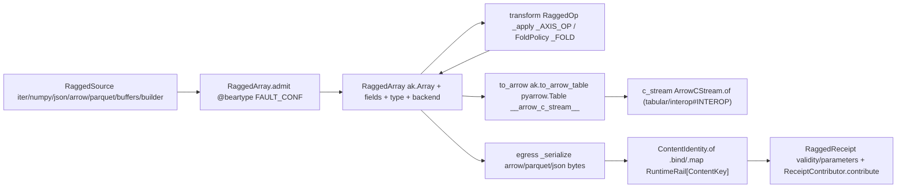

# [PY_DATA_RAGGED]

The variable-length nested-array owner over `awkward`, bridged to the Arrow carrier through the Arrow C Data Interface. `RaggedArray` owns the irregular row — variable-length lists, option types, record and union arrays over columnar memory — admitting any nested payload through one `RaggedSource` admission union (Python iterable, NumPy array, JSON, Arrow C-stream, Parquet file, or a form-plus-buffers pair) and lowering through `ak.to_arrow_table` into the same Arrow C Data Interface stream capsule the `data:tabular/interop#INTEROP` `ArrowCStream` carrier and the `data:tabular/columnar#SCAN` egress already speak. `ak.to_arrow_table` materializes a `pyarrow.Table` — pyarrow is the awkward-to-Arrow lowering provider — whose native `__arrow_c_stream__` capsule the interop carrier consumes through `ArrowCStream.of`, the one construction entrypoint the `data:tabular/interop#INTEROP` owner exposes over any `__arrow_c_stream__`-exporting object, so the layout crosses without re-materializing and without an inline carrier re-mint; the `Table` lowering is load-bearing over the array lowering because a `pyarrow.Table` exports the stream capsule natively while the `ak.to_arrow` `pyarrow.Array` exports only `__arrow_c_array__` (no native stream), and `ak.to_arrow_table` folds a fieldless ragged array into a struct-top schema so the stream is a canonical RecordBatch the carrier and the IPC serializer both read without a manual `ak.zip` re-wrap. `ak.from_arrow` is the reverse ingest, so a ragged event-data payload round-trips into the Arrow ecosystem over the protocol every PyCapsule-exporting backend speaks; the carrier stays pyarrow-free because the capsule, not pyarrow's compute, crosses the interop seam. The full transform axis — structure, reshape, statistical fold, option, combine, select, order, project, annotate — folds into one `RaggedOp` closed family under one `transform` dispatch, never a per-operation method, with the single-array reducer, the paired-array statistic, and the order kind collapsed onto one `FoldPolicy` value whose `apply` reads one `_FOLD` closure row that owns its member's call-head and folds exactly the `axis`/`keepdims`/`mask_identity`/`weight`/`ddof`/`operand`/`n`/`ascending`/`stable` knobs that member admits, never three parallel policy carriers, never a per-arm dict re-mint, never a bare axis-only call; `ak.ArrayBuilder` is the incremental ingest arm and `from_buffers`/`to_layout` the form-algebra round-trip. Egress dispatches one `RaggedSink` union — the Arrow-carrier IPC serialization, the `ak.to_parquet` file, or the `ak.to_json` UTF-8 text — and `RaggedReceipt` content-keys over the chosen sink's bytes through exactly one runtime `ContentIdentity`, wired through `ReceiptContributor`, carrying the `ak.validity_error` layout-soundness witness and the `ak.parameters` behavior map as typed evidence; `RaggedArray.metadata` reads the `ak.metadata_from_parquet` descriptor as the no-copy pre-ingest probe on the same entrypoint family. This is the irregular counterpart of the dense `data:gridded/store#STORE` chunk-grid store — a distinct owner composing the existing Arrow carrier and runtime content key, never a ragged backend tag on `TensorBackend`.

## [01]-[INDEX]

- [01]-[RAGGED]: the `RaggedArray` variable-length nested-array owner over `awkward` — the one `RaggedSource` admission union (`from_iter`/`from_numpy`/`from_json`/`from_arrow`/`from_parquet`/`from_buffers`/`ArrayBuilder`), the one `RaggedOp` structure/reshape/fold/option/combine/select/project/annotate transform axis whose seven single-axis `member(array, axis=)` arms collapse onto the one `_AXIS_OP` member table and whose `fold` case carries one `FoldPolicy` reading the single `_FOLD` closure-row table that unifies the twelve single-array reducers, the three paired statistics, and the two order kinds, the `to_arrow`/`c_stream` Arrow C Data Interface bridge lowering through `ak.to_arrow_table` into a `pyarrow.Table` natively exporting `__arrow_c_stream__` and crossing to the `data:tabular/interop#INTEROP` carrier through `ArrowCStream.of`, the `to_layout`/`from_buffers` form round-trip, the `metadata` `ak.metadata_from_parquet` no-copy probe, and the `RaggedReceipt` content-keyed over the `RaggedSink` (`arrow`/`parquet`/`json`) egress bytes carrying the `validity_error`/`parameters` evidence.

## [02]-[RAGGED]

- Owner: `RaggedArray` — one frozen variable-length nested-array owner carrying the live `ak.Array`, its field names, its type descriptor, and the recovered backend; the irregular payload enters through one `RaggedSource` admission union whose case shape selects the ingest arm — `iter` (Python nested iterable through `ak.from_iter`), `numpy` (regular array through `ak.from_numpy`), `json` (UTF-8 source through `ak.from_json`), `arrow` (zero-copy Arrow C-stream through `ak.from_arrow`), `parquet` (a `ResourceRef` file through `ak.from_parquet`), `buffers` (a `(form, length, container)` triple through `ak.from_buffers` with no data copy), and `builder` (a finished `ak.ArrayBuilder` snapshot). The array dispatches NumPy-like ufunc and indexing behavior over typed layouts in `ak.contents`; field access uses `fields` and named indexing, keeping the record structure self-describing, never positional-only access. The backend is the `awkward` `"cpu"`/`"cuda"`/`"jax"` axis recovered through `ak.backend`, moved through `ak.to_backend`, never a parallel ragged-list class per backend.
- Cases: `RaggedSource` rows admit one ingest each — `iter` (`Sequence[Sequence[object]]` to `ak.from_iter`) · `numpy` (`np.ndarray` to `ak.from_numpy`, regular array becoming a `RegularArray` layout) · `json` (`str` to `ak.from_json`, the line-delimited/schema knobs riding the case payload) · `arrow` (an `__arrow_c_stream__`-exporting object to `ak.from_arrow`, the reverse of the `to_arrow` lowering) · `parquet` (`ResourceRef` to `ak.from_parquet`, the columnar-file ingest) · `buffers` (`tuple[ak.forms.Form, int, dict[str, bytes]]` to `ak.from_buffers`, the zero-copy form-plus-buffers reconstruction) · `builder` (`ak.ArrayBuilder` whose `.snapshot()` materializes the appended layout). One admission union owns every ingest shape; the modality is recovered from the case, never a `from_iter`/`from_json`/`from_arrow`/`from_parquet` method family. `RaggedOp` rows own the transform axis — `flatten`/`unflatten`/`ravel` reshape, `num`/`firsts`/`local_index`/`run_lengths`/`singletons` structure, `zip`/`cartesian`/`combinations` (the `replacement` with-replacement-n-tuple knob riding the case payload)/`concat` combine, `where` element-select, `fold` carrying one `FoldPolicy` over the single seventeen-row `_FOLD` closure table, `fill`/`drop`/`pad` (the `clip` exact-length knob riding the case payload)/`is_none`/`masked` option, `project` single-field extraction, `cast`/`enforce`/`packed`/`with_field`/`without_field`/`with_name`/`with_parameter` annotation — one closed family under one total `match`, a new transform one case. The seven `flatten`/`num`/`firsts`/`local_index`/`singletons`/`drop`/`is_none` arms whose shared call-head is `member(array, axis=)` collapse onto the single `_AXIS_OP` member-table row read by one guarded `_apply` arm — `_AXIS_OP[kind](array, axis=getattr(op, kind))` over the `case RaggedOp(tag=kind) if kind in _AXIS_OP` guard, the `kind in _AXIS_OP` membership over the `frozendict[AxisOp, ...]` literal-keyed table narrowing the residual union so the trailing `assert_never` stays total — rather than seven near-identical switch arms differing only by the `ak` member name, the same member-table dispatch the `data:gridded/store#STORE` `_COMPRESSOR`/`_FILTER` tables apply, so a new single-axis structure op is one `_AXIS_OP` row plus one `RaggedOp` case, never a parallel arm. Six arms carry a concrete `int` operating axis; the `drop` arm's `int | None` payload threads the catalogued `ak.drop_none(axis=None)` all-levels modality through the same `axis=` call-head, so the collapse drops no `drop_none` capability to a per-list-only axis. The `_FOLD` table binds every statistical and order member once — the twelve single-array reducers `sum`/`mean`/`count`/`prod`/`min`/`max`/`any`/`all`/`count_nonzero`/`std`/`var`/`ptp`, the three paired statistics `corr`/`linear_fit`/`moment` (the paired-array and moment-order reducers the single-array callable shape cannot admit), and the two order kinds `sort`/`argsort` — each as one closure row owning its call-head: `_reduce` threads `axis`/`keepdims`/`mask_identity` on every member plus `weight` only on the `_WEIGHTED` rows and `ddof` only on the sample-deviation rows, `_paired` heads the call with `(array, policy.n)` for `moment` and `(array, policy.operand)` for the correlation pair before the shared `weight`/`axis`/`keepdims`/`mask_identity` knobs, and `_ordered` threads `axis`/`ascending`/`stable`. One `FoldPolicy` value carries the full knob union and `FoldPolicy.apply` reads exactly one `_FOLD` row, so the dispatch arm never rebuilds a dict, never branches on member family, and never drops a knob to an axis-only call.
- Entry: `RaggedArray.admit` is the one polymorphic ingest discriminating on the `RaggedSource` case — folding the recovered fields, type descriptor, and backend into the frozen owner returned in a `RuntimeRail`; `RaggedArray.transform` applies one `RaggedOp` case against the live array through one total `_apply` `match` and re-admits the transformed `ak.Array`, the singular owning every structure/fold/option/select/order modality by case, never a per-operation method; `RaggedArray.to_arrow` lowers the array through `ak.to_arrow_table` into a `pyarrow.Table` natively exporting the `__arrow_c_stream__` capsule (the `ak.to_arrow` `pyarrow.Array` exports only `__arrow_c_array__`, so the `Table` lowering is the one that hands a native stream to the carrier and folds a fieldless ragged array into a struct-top schema); `RaggedArray.c_stream` hands that pyarrow Table — an `__arrow_c_stream__` exporter — to `ArrowCStream.of`, the `data:tabular/interop#INTEROP` carrier's one construction entrypoint, never an inline capsule-plus-schema re-mint; `RaggedArray.to_layout` descends through `ak.to_layout`/`ak.to_buffers` to the `(ak.forms.Form, length, container)` `Buffers` triple for the zero-copy `buffers` admission round-trip, the form-algebra interchange whose `Buffers[0]` is the recovered `ak.forms.Form`; `RaggedArray.metadata` reads the `ak.metadata_from_parquet` schema-plus-row-group descriptor off a parquet `ResourceRef` without materializing a single column, the no-copy pre-ingest probe; `RaggedArray.egress` discriminates one `RaggedSink` case and materializes one `RaggedReceipt` keyed by `ContentIdentity` over the chosen sink's bytes — the Arrow-carrier IPC serialization, the `ak.to_parquet` file, or the `ak.to_json` UTF-8 text. One `admit`/`transform`/`to_backend`/`to_arrow`/`c_stream`/`to_layout`/`metadata`/`egress` entrypoint family owns all modalities by input shape, never a per-operation method family.
- Receipt: the `RaggedReceipt` keys off the egressed sink bytes — the row count read off `len`, the field names off `ak.fields`, the nesting depth off `Array.ndim`, the byte footprint off `Array.nbytes`, the type descriptor off `ak.type`, the layout-soundness witness off `ak.validity_error(array, exception=False)` (the empty-string-on-valid descriptor folded to `"valid"`), and the layout `ak.parameters` map carried as the behavior-mixin evidence. `RaggedArray.egress` binds the `boundary(...)` `_serialize` rail into the `ContentIdentity.of(f"ragged.{sink.tag}", payload)` rail through `.bind` and `.map`s the resolved `ContentKey` into the receipt — the railed key is two railed hops the consumer resolves once, never a `RuntimeRail[ContentKey]` smuggled into the `content_key` `ContentKey` slot and never a re-mint per egress, the same content-identity shape and `.bind`/`.map` thread the `tabular/interop#INTEROP` `translate` and the `columnar#SCAN` egress carry. `RaggedReceipt` satisfies the runtime `ReceiptContributor` Protocol through `contribute`, which `yield`s one emitted-phase `Receipt.of("ragged", ("emitted", type_repr, facts))` — the two-argument `Receipt.of(owner, evidence)` factory routing the `(phase, subject, facts)` triple the receipts owner's `of` match decomposes, never the four-positional `Receipt.of(phase, owner, subject, facts)` shape the owner does not expose, the native `rows`/`ndim`/`nbytes` ints and `fields` tuple riding the `dict[str, object]` facts without a `str()` coerce because the receipts `Encoder(enc_hook=repr)` serializes scalars natively, and the `Iterable[Receipt]` stream the Protocol's `contribute` returns rather than one forced fact. The `validity` field is structural evidence the irregular layout admits no broken offset or option mismatch, the irregular counterpart of the dense store's residual witness, never a generic reported value; the structlog trace context and the OTLP span ride the runtime `boundary`/`Receipt` owners — the `faults#FAULT` `_convert` records the terminal raise on the active span and the `receipts#RECEIPT` chain injects `trace_id`/`span_id` — so the ragged egress carries the full observability stack without minting a second tracer or logger.
- Growth: a new irregular-array transform is one `RaggedOp` case on the existing transform axis; a new single-axis `member(array, axis=)` structure op is one `_AXIS_OP` member-table row plus one `RaggedOp` case, never a parallel `_apply` arm; a new single-array reducer is one `_FOLD` closure row built by `_reduce` plus one `Reduction` literal, a new paired-array statistic one `_FOLD` row built by `_paired` plus one `Paired` literal, a new order kind one `_FOLD` row built by `_ordered` plus one `Order` literal, all read by the one `FoldPolicy`; a new fold knob is one field on `FoldPolicy` and one read in the owning closure builder, never a new arm; a new ingest format is one `RaggedSource` case (`from_rdataframe`, the ROOT RDataFrame columnar ingest); a new egress target is one `RaggedSink` case on the existing union (`dataframe` over `ak.to_dataframe`); a new backend is one `ak.to_backend` move on the recovered axis, never a parallel ragged class.
- Boundary: no compute-package numeric trio, no production tensor session, no durable product store; `data` emits a portable content-addressed irregular array bridged to the Arrow carrier, not a runtime compute graph. A hand-rolled ragged list structure, a per-operation `flatten`/`num`/`zip` method family where one `transform` dispatch owns the axis, seven near-identical `member(array, axis=)` switch arms where the one `_AXIS_OP` member table dispatches the `flatten`/`num`/`firsts`/`local_index`/`singletons`/`drop`/`is_none` collapse, parallel `ReducePolicy`/`PairedPolicy`/`OrderPolicy` carriers or parallel `_PAIRED`/`_ORDER` dispatch tables where the one `FoldPolicy` reads the single `_FOLD` closure table the `_REDUCE` member map seeds, a per-call `{...}[kind]` fold dict re-mint where the `_FOLD` row is read, a per-reducer `sum`/`mean`/`prod`/`std` method family where one `fold` case carrying a `FoldPolicy` owns the axis, a bare axis-only reducer call dropping the catalogued `weight`/`ddof`/`keepdims`/`mask_identity` knobs the `_FOLD` closure folds off the `_WEIGHTED`/`_SAMPLE` membership sets, a paired-array `corr`/`linear_fit`/`moment` smuggled onto a single-array call shape its second-array or order argument cannot satisfy, a member-family branch inside `FoldPolicy.apply` where the closure row owns its call-head, a degenerate `unzip` arm re-zipping its own split into an identity no-op, parallel `from_iter`/`from_json`/`from_arrow`/`from_parquet` ingest methods where one `RaggedSource` union discriminates, a parallel `to_arrow_egress`/`to_parquet_egress`/`to_json_egress` trio where one `RaggedSink` union discriminates, a separate parquet-metadata reader class where the `RaggedArray.metadata` `ak.metadata_from_parquet` probe rides the one entrypoint family, a generic reported-value receipt where the `validity`/`parameters` typed evidence belongs, a `RuntimeRail[ContentKey]` smuggled into the `RaggedReceipt.content_key` `ContentKey` slot where `egress` `.bind`s the `_serialize` rail into `ContentIdentity.of` and `.map`s the resolved `ContentKey` in, a four-positional `Receipt.of(phase, owner, subject, facts)` where the receipts owner exposes only the two-argument `Receipt.of(owner, (phase, subject, facts))` triple, a single-`Receipt`-returning `contribute` where the `ReceiptContributor` Protocol yields an `Iterable[Receipt]`, an `@override`-decorated `contribute` where the method structurally implements the `@runtime_checkable` `ReceiptContributor` Protocol rather than overriding a base, a `str()`-coerced facts map where the receipts `Encoder(enc_hook=repr)` serializes the native ints and tuple, an untyped `RaggedSource` admission where `@beartype(conf=FAULT_CONF)` on `RaggedArray.admit` rails the `BeartypeCallHintViolation` root, positional-only field access where the `project` arm and `fields` apply, a NumPy array for irregular data awkward owns, a re-materialization through NumPy where `ak.from_arrow`/`ak.from_buffers` bridge without a buffer copy, an inline `ArrowCStream(capsule=, schema_repr=)` re-mint where the `data:tabular/interop#INTEROP` carrier owns the construction through `ArrowCStream.of`, an `ak.to_arrow` `pyarrow.Array` lowering at the carrier or IPC seam where the `Array` exports only `__arrow_c_array__` and `ak.to_arrow_table` is the native `__arrow_c_stream__`-exporting `pyarrow.Table` source, a manual `ak.zip({"value": array})` struct-top re-wrap of a fieldless ragged array where `ak.to_arrow_table` folds it into a struct-top schema natively, a second `pyarrow` import at the carrier seam where the `__arrow_c_stream__` capsule the `ak.to_arrow_table` `pyarrow.Table` exports is what crosses, a module-level mutable `dict` dispatch table for `_AXIS_OP`/`_REDUCE`/`_FOLD` where `Final[frozendict[...]]` over `from builtins import frozendict` owns the row exactly as the sibling `gridded/store#STORE` `_COMPRESSOR`/`_FILTER` and `gridded/field#FIELD` `_NAN_BASE`/`_FALLBACK_CALL` tables do, a `frozendict` coerce of the `parameters`/facts runtime-evidence carriers where those arbitrary layout-behavior and receipt-fact maps stay the plain `dict[str, object]` the sibling receipt evidence carries, a `tag`-capturing `case RaggedOp(tag=tag)` guard shadowing the `expression.tag` discriminant where the `tag=kind` capture keeps the import live, and an `awkward` backend tag smuggled onto `data:gridded/store#STORE` `TensorBackend` are the deleted forms.

```python signature
from builtins import frozendict
from typing import TYPE_CHECKING, Final, Literal, assert_never

import awkward as ak
import nanoarrow
from beartype import beartype
from expression import case, tag, tagged_union
from msgspec import Struct

from rasm.data.tabular.interop import ArrowCStream
from rasm.runtime.content_identity import ContentIdentity, ContentKey
from rasm.runtime.faults import FAULT_CONF, RuntimeRail, boundary
from rasm.runtime.receipts import Receipt
from rasm.runtime.roots import ResourceRef

if TYPE_CHECKING:
    from collections.abc import Callable, Iterable, Sequence

    import numpy as np


type Backend = Literal["cpu", "cuda", "jax"]
type AxisOp = Literal["flatten", "num", "firsts", "local_index", "singletons", "drop", "is_none"]
type Reduction = Literal[
    "sum", "mean", "count", "prod", "min", "max",
    "any", "all", "count_nonzero", "std", "var", "ptp",
]
type Paired = Literal["corr", "linear_fit", "moment"]
type Order = Literal["sort", "argsort"]
type Fold = Reduction | Paired | Order
type FoldArm = Callable[[FoldPolicy, ak.Array], ak.Array]
type Buffers = tuple[ak.forms.Form, int, dict[str, bytes]]

# the seven RaggedOp arms whose call-head is `member(array, axis=<int>)` — one data row per
# tag binding its `ak` member, dispatched by one `_apply` arm reading `_AXIS_OP[op.tag]`
# rather than seven near-identical switch arms differing only by the member name.
_AXIS_OP: "Final[frozendict[AxisOp, Callable[..., ak.Array]]]" = frozendict({
    "flatten": ak.flatten, "num": ak.num, "firsts": ak.firsts, "local_index": ak.local_index,
    "singletons": ak.singletons, "drop": ak.drop_none, "is_none": ak.is_none,
})

_WEIGHTED: frozenset[Fold] = frozenset({"mean", "std", "var"})
_SAMPLE: frozenset[Fold] = frozenset({"std", "var"})


def _reduce(key: Reduction, member: "Callable[..., ak.Array]") -> FoldArm:
    def arm(policy: "FoldPolicy", array: ak.Array) -> ak.Array:
        knobs: dict[str, object] = {"axis": policy.axis, "keepdims": policy.keepdims, "mask_identity": policy.mask_identity}
        if key in _WEIGHTED and policy.weight is not None:
            knobs["weight"] = policy.weight
        if key in _SAMPLE:
            knobs["ddof"] = policy.ddof
        return member(array, **knobs)
    return arm


def _paired(key: Paired, member: "Callable[..., ak.Array]") -> FoldArm:
    def arm(policy: "FoldPolicy", array: ak.Array) -> ak.Array:
        knobs: dict[str, object] = {"weight": policy.weight, "axis": policy.axis, "keepdims": policy.keepdims, "mask_identity": policy.mask_identity}
        return member(array, policy.n if key == "moment" else policy.operand, **knobs)
    return arm


def _ordered(member: "Callable[..., ak.Array]") -> FoldArm:
    return lambda policy, array: member(array, axis=policy.axis if policy.axis is not None else -1, ascending=policy.ascending, stable=policy.stable)


_REDUCE: "Final[frozendict[Reduction, Callable[..., ak.Array]]]" = frozendict({
    "sum": ak.sum, "mean": ak.mean, "count": ak.count, "prod": ak.prod, "min": ak.min, "max": ak.max,
    "any": ak.any, "all": ak.all, "count_nonzero": ak.count_nonzero, "std": ak.std, "var": ak.var, "ptp": ak.ptp,
})
_FOLD: "Final[frozendict[Fold, FoldArm]]" = frozendict({
    **{key: _reduce(key, member) for key, member in _REDUCE.items()},
    "corr": _paired("corr", ak.corr), "linear_fit": _paired("linear_fit", ak.linear_fit), "moment": _paired("moment", ak.moment),
    "sort": _ordered(ak.sort), "argsort": _ordered(ak.argsort),
})


class FoldPolicy(Struct, frozen=True):
    func: Fold = "sum"
    operand: "ak.Array | None" = None
    n: int = 1
    axis: int | None = None
    keepdims: bool = False
    mask_identity: bool = True
    weight: "ak.Array | None" = None
    ddof: int = 0
    ascending: bool = True
    stable: bool = True

    def apply(self, array: ak.Array) -> ak.Array:
        return _FOLD[self.func](self, array)


@tagged_union(frozen=True)
class RaggedSource:
    tag: Literal["iter", "numpy", "json", "arrow", "parquet", "buffers", "builder"] = tag()
    iter: "Sequence[Sequence[object]]" = case()
    numpy: "np.ndarray" = case()
    json: str = case()
    arrow: object = case()
    parquet: ResourceRef = case()
    buffers: Buffers = case()
    builder: ak.ArrayBuilder = case()


@tagged_union(frozen=True)
class RaggedOp:
    tag: Literal[
        "flatten", "unflatten", "ravel", "num", "firsts", "local_index", "run_lengths", "singletons",
        "zip", "cartesian", "combinations", "concat", "where", "fold", "fill", "drop", "pad",
        "is_none", "masked", "cast", "enforce", "packed", "project",
        "with_field", "without_field", "with_name", "with_parameter",
    ] = tag()
    flatten: int = case()
    unflatten: tuple["ak.Array", int] = case()
    ravel: None = case()
    num: int = case()
    firsts: int = case()
    local_index: int = case()
    run_lengths: None = case()
    singletons: int = case()
    zip: dict[str, "ak.Array"] = case()
    cartesian: tuple[dict[str, "ak.Array"], int] = case()
    combinations: tuple[int, int, bool] = case()
    concat: tuple["ak.Array", int] = case()
    where: tuple["ak.Array", "ak.Array"] = case()
    fold: FoldPolicy = case()
    fill: tuple[object, int] = case()
    drop: int | None = case()
    pad: tuple[int, int, bool] = case()
    is_none: int = case()
    masked: tuple["ak.Array", bool] = case()
    cast: str = case()
    enforce: str = case()
    packed: None = case()
    project: str = case()
    with_field: tuple[str, "ak.Array"] = case()
    without_field: str = case()
    with_name: str = case()
    with_parameter: tuple[str, object] = case()


@tagged_union(frozen=True)
class RaggedSink:
    tag: Literal["arrow", "parquet", "json"] = tag()
    arrow: None = case()
    parquet: ResourceRef = case()
    json: bool = case()


class RaggedReceipt(Struct, frozen=True):
    rows: int
    fields: tuple[str, ...]
    ndim: int
    nbytes: int
    type_repr: str
    validity: str
    parameters: dict[str, object]
    content_key: ContentKey

    def contribute(self) -> "Iterable[Receipt]":
        yield Receipt.of(
            "ragged",
            (
                "emitted",
                self.type_repr,
                {
                    "rows": self.rows,
                    "fields": self.fields,
                    "ndim": self.ndim,
                    "nbytes": self.nbytes,
                    "validity": self.validity,
                    "key": self.content_key.hex,
                },
            ),
        )


class RaggedArray(Struct, frozen=True):
    array: ak.Array
    fields: tuple[str, ...]
    type_repr: str
    backend: Backend

    @staticmethod
    @beartype(conf=FAULT_CONF)
    def admit(source: RaggedSource) -> "RuntimeRail[RaggedArray]":
        return boundary(f"ragged.admit.{source.tag}", lambda: _admit(_ingest(source)))

    def transform(self, op: RaggedOp) -> "RuntimeRail[RaggedArray]":
        return boundary(f"ragged.transform.{op.tag}", lambda: _admit(_apply(self.array, op)))

    def to_backend(self, backend: Backend) -> "RuntimeRail[RaggedArray]":
        return boundary(f"ragged.to_backend.{backend}", lambda: _admit(ak.to_backend(self.array, backend)))

    def to_arrow(self) -> "RuntimeRail[object]":
        return boundary("ragged.to_arrow", lambda: _arrow(self.array))

    def c_stream(self) -> "RuntimeRail[ArrowCStream]":
        return boundary("ragged.c_stream", lambda: _c_stream(self.array))

    def to_layout(self) -> "RuntimeRail[Buffers]":
        return boundary("ragged.to_layout", lambda: _to_buffers(self.array))

    def egress(self, sink: RaggedSink) -> "RuntimeRail[RaggedReceipt]":
        return boundary(f"ragged.egress.{sink.tag}", lambda: _serialize(self.array, sink)).bind(
            lambda payload: ContentIdentity.of(f"ragged.{sink.tag}", payload).map(lambda key: _receipt(self, key))
        )

    @staticmethod
    def metadata(ref: ResourceRef) -> "RuntimeRail[dict[str, object]]":
        return boundary("ragged.metadata", lambda: dict(ak.metadata_from_parquet(str(ref.path))))


def _ingest(source: RaggedSource) -> ak.Array:
    match source:
        case RaggedSource(tag="iter", iter=values):
            return ak.from_iter(values)
        case RaggedSource(tag="numpy", numpy=values):
            return ak.from_numpy(values, regulararray=True)
        case RaggedSource(tag="json", json=text):
            return ak.from_json(text)
        case RaggedSource(tag="arrow", arrow=stream):
            return ak.from_arrow(stream, generate_bitmasks=True)
        case RaggedSource(tag="parquet", parquet=ref):
            return ak.from_parquet(str(ref.path))
        case RaggedSource(tag="buffers", buffers=(form, length, container)):
            return ak.from_buffers(form, length, container)
        case RaggedSource(tag="builder", builder=builder):
            return builder.snapshot()
        case unreachable:
            assert_never(unreachable)


def _apply(array: ak.Array, op: RaggedOp) -> ak.Array:
    match op:
        case RaggedOp(tag=kind) if kind in _AXIS_OP:
            return _AXIS_OP[kind](array, axis=getattr(op, kind))
        case RaggedOp(tag="unflatten", unflatten=(counts, axis)):
            return ak.unflatten(array, counts, axis=axis)
        case RaggedOp(tag="ravel"):
            return ak.ravel(array)
        case RaggedOp(tag="run_lengths"):
            return ak.run_lengths(array)
        case RaggedOp(tag="zip", zip=arrays):
            return ak.zip(arrays)
        case RaggedOp(tag="cartesian", cartesian=(arrays, axis)):
            return ak.cartesian(arrays, axis=axis)
        case RaggedOp(tag="combinations", combinations=(n, axis, replacement)):
            return ak.combinations(array, n, axis=axis, replacement=replacement)
        case RaggedOp(tag="concat", concat=(other, axis)):
            return ak.concatenate((array, other), axis=axis)
        case RaggedOp(tag="where", where=(condition, otherwise)):
            return ak.where(condition, array, otherwise)
        case RaggedOp(tag="fold", fold=policy):
            return policy.apply(array)
        case RaggedOp(tag="fill", fill=(value, axis)):
            return ak.fill_none(array, value, axis=axis)
        case RaggedOp(tag="pad", pad=(target, axis, clip)):
            return ak.pad_none(array, target, axis=axis, clip=clip)
        case RaggedOp(tag="masked", masked=(mask, valid_when)):
            return ak.mask(array, mask, valid_when=valid_when)
        case RaggedOp(tag="cast", cast=to):
            return ak.values_astype(array, to)
        case RaggedOp(tag="enforce", enforce=to):
            return ak.enforce_type(array, to)
        case RaggedOp(tag="packed"):
            return ak.to_packed(array)
        case RaggedOp(tag="project", project=field):
            return array[field]
        case RaggedOp(tag="with_field", with_field=(where, what)):
            return ak.with_field(array, what, where)
        case RaggedOp(tag="without_field", without_field=where):
            return ak.without_field(array, where)
        case RaggedOp(tag="with_name", with_name=name):
            return ak.with_name(array, name)
        case RaggedOp(tag="with_parameter", with_parameter=(key, value)):
            return ak.with_parameter(array, key, value)
        case unreachable:
            assert_never(unreachable)


def _admit(array: ak.Array) -> RaggedArray:
    return RaggedArray(array=array, fields=tuple(ak.fields(array)), type_repr=str(ak.type(array)), backend=ak.backend(array))


def _arrow(array: ak.Array) -> object:
    return ak.to_arrow_table(array, extensionarray=False)


def _c_stream(array: ak.Array) -> ArrowCStream:
    return ArrowCStream.of(_arrow(array))


def _to_buffers(array: ak.Array) -> Buffers:
    form, length, container = ak.to_buffers(ak.to_layout(array))
    return (form, length, {key: bytes(buffer) for key, buffer in container.items()})


def _serialize(array: ak.Array, sink: RaggedSink) -> bytes:
    match sink:
        case RaggedSink(tag="arrow"):
            return nanoarrow.ArrayStream(_arrow(array)).read_all().serialize()
        case RaggedSink(tag="parquet", parquet=ref):
            ak.to_parquet(array, str(ref.path))
            return ref.path.read_bytes()
        case RaggedSink(tag="json", json=line_delimited):
            return ak.to_json(array, line_delimited=line_delimited).encode()
        case unreachable:
            assert_never(unreachable)


def _receipt(ragged: RaggedArray, key: ContentKey) -> RaggedReceipt:
    return RaggedReceipt(
        rows=len(ragged.array),
        fields=ragged.fields,
        ndim=ragged.array.ndim,
        nbytes=ragged.array.nbytes,
        type_repr=ragged.type_repr,
        validity=ak.validity_error(ragged.array, exception=False) or "valid",
        parameters=dict(ak.parameters(ragged.array)),
        content_key=key,
    )
```



## [03]-[RESEARCH]

- [ARRAY_BUILDER_METHODS]: the `ak.ArrayBuilder` type, its terminal `.snapshot()` materialization, and the per-record append surface (`begin_list`/`end_list`/`list`, `begin_record`/`field`/`end_record`/`record`, `begin_tuple`/`index`/`end_tuple`/`tuple`, `append`/`extend`, `integer`/`real`/`complex`/`boolean`/`string`/`bytestring`/`datetime`/`timedelta`/`null`, `type`/`typestr`) are catalogue-confirmed against the folder `awkward` `.api` (PUBLIC_TYPES `ak.ArrayBuilder` members). The `builder` admission arm consumes a caller-finished `ak.ArrayBuilder` and admits its `.snapshot()`, so the owner never authors the incremental append sequence; the `.snapshot()` boundary is the settled seam and the append surface is the caller-side construction the seam admits. Settled fence code.
- [TO_BUFFERS_SPELLING]: the `ak.to_layout` descent, the `ak.to_buffers(array) -> (form, length, container)` decomposition, and the `ak.from_buffers(form, length, container)` reconstruction the `_to_buffers` form round-trip composes are catalogue-confirmed against the folder `awkward` `.api` (ENTRYPOINTS export `to_layout`/`to_buffers`, construction `from_buffers`); `ak.to_buffers` accepts the `ak.Array` or the descended `ak.contents` layout and returns the `(form, length, container)` triple `from_buffers` re-admits with no data copy. The `ak.forms.Form` and `ak.contents` layout types annotating the `Buffers` alias are the catalogued form-algebra namespace (IMPLEMENTATION_LAW: `ak.forms` carries the form algebra, `ak.contents` the typed layouts). Settled fence code.
- [ARROW_BRIDGE]: `ak.to_arrow_table(extensionarray=False)` lowers through `pyarrow` — the awkward-to-Arrow provider declared in the manifest — and materializes a `pyarrow.Table` natively exporting the `__arrow_c_stream__` PyCapsule, and `ak.from_arrow(generate_bitmasks=True)` is the reverse ingest, both catalogue-confirmed against the folder `awkward` `.api` (the `extensionarray`/`generate_bitmasks` knobs the export/ingest signatures carry, `to_arrow_table`/`from_arrow_table` the whole-record-array Arrow-table round-trip the `[INTEGRATION_RAILS]` row names). The lowering target is the `Table`, not the `ak.to_arrow` `pyarrow.Array`: a `pyarrow.Array` exports only `__arrow_c_array__` and carries no native stream capsule, while `ak.to_arrow_table` returns a `pyarrow.Table` whose `__arrow_c_stream__` the carrier consumes directly and which folds a fieldless ragged array into a struct-top schema, so the manual `ak.zip({"value": array})` struct-wrap collapses out. The `extensionarray=False` lowering emits plain Arrow list/struct layouts rather than awkward extension types so the carrier reads canonical Arrow without an extension-type registration; `_c_stream` hands that lowered `pyarrow.Table` to `ArrowCStream.of`, the one construction entrypoint the `data:tabular/interop#INTEROP` carrier owns over any `__arrow_c_stream__`-exporting object — the same `pyarrow.Table` shape `FrameInterop.c_stream` hands it through its own `to_arrow()` lowering — never an inline `ArrowCStream(capsule=, schema_repr=)` re-mint and never a second `nanoarrow.ArrayStream` wrap at the ragged seam. The construction stays interop-owned so the carrier reads the capsule and schema over `arro3-core`/`nanoarrow` without importing pyarrow's compute and the wire stays pyarrow-free. Settled fence code.
- [INTEROP_CONSTRUCTION]: `ArrowCStream.of(exporter)` is the `data:tabular/interop#INTEROP` `CARRIER` owner's one public construction classmethod — it wraps any `__arrow_c_stream__`-exporting object through `nanoarrow.ArrayStream` and reads the `.schema` the C-level `nanoarrow.c_array_stream` does not, the `ArrowCStream(Struct, frozen=True)` owner the interop `[03]-[CARRIER]` section realizes (`of` returning `cls(capsule=stream.__arrow_c_stream__(), schema_repr=repr(stream.schema))`) and catalogue-confirmed against the folder `nanoarrow` `.api` (`ArrayStream`/`__arrow_c_stream__`/`.schema`). This page composes that one entrypoint and authors no carrier construction; the `INTEROP_STREAM` ripple seam is one construction shape both `FrameInterop.c_stream` and `RaggedArray.c_stream` compose over the realized classmethod, never a per-folder re-mint. Settled fence code.
- [FOLD_FAMILY]: the one `_FOLD` frozen closure table binds every statistical and order member against the folder `awkward` `.api` reduce/order rows (L96, L102) — the twelve single-array reducers the `_REDUCE` member map seeds (`ak.sum`/`ak.mean`/`ak.count`/`ak.prod`/`ak.min`/`ak.max`/`ak.any`/`ak.all`/`ak.count_nonzero`/`ak.std`/`ak.var`/`ak.ptp`), the three paired statistics `ak.corr`/`ak.linear_fit`/`ak.moment`, and the two order kinds `ak.sort`/`ak.argsort` — each as one `FoldArm` closure read once by the single `FoldPolicy.apply`, never three parallel carriers and never an inline dispatch branch. The `_REDUCE` map is the twelve-member literal-to-callable seed the `_FOLD` dict comprehension projects into `_reduce` closures, not a second dispatch table; the weighted and sample knob policy lives once in the `_WEIGHTED` (`mean`/`std`/`var`) and `_SAMPLE` (`std`/`var`) membership sets the `_reduce` closure tests by key, never re-encoded as a per-row boolean. The knob surface each closure folds is catalogue-confirmed on the same rows: `axis` and the `keepdims`/`mask_identity` knobs ride every reducer (`sum(array, axis, *, keepdims, mask_identity, ...)`), `weight` rides the `_WEIGHTED` members (`mean(x, weight, axis, ...)`, `std(x, weight, ddof, axis, ...)`, `var(x, weight, ddof, axis, ...)`), and `ddof` rides `std`/`var` only — so `_reduce` forwards `weight` only when `key in _WEIGHTED` and the policy weight is not `None`, and `ddof` only when `key in _SAMPLE`, so a no-weight `sum` never forwards a keyword the catalogued signature rejects. The paired statistics carry a second-array or order argument the single-array call shape cannot admit, so `_paired` heads the call with `(array, policy.n)` for `moment` and `(array, policy.operand)` for the correlation pair before threading the shared `weight`/`axis`/`keepdims`/`mask_identity` knobs (`corr(x, y, weight, axis, ...)`, `linear_fit(x, y, weight, axis, ...)`, `moment(x, n, weight, axis, ...)`); the order kinds carry `axis`/`ascending`/`stable` (default `axis=-1` when the shared `FoldPolicy.axis` is `None`), so `_ordered` threads exactly those. Each `_FOLD` row owns its member's call-head, so `FoldPolicy.apply` reads one row and never branches on member family, never smuggles a paired statistic onto a single-array shape, and never drops a catalogued knob. Settled fence code.
- [ARROW_IPC_SERIALIZE]: the `arrow`-sink content key derives from `nanoarrow.ArrayStream(...).read_all().serialize()` IPC bytes — `nanoarrow.ArrayStream`, `ArrayStream.read_all()` (nanoarrow `.api` L84/L88), and `Array.serialize(dst=None) -> bytes | None` (the no-`dst` bytes-return overload, nanoarrow `.api` L111) are catalogue-confirmed against the folder `nanoarrow` `.api`; `read_all` collects the chunks into one `Array` whose no-`dst` `serialize` returns the canonical IPC `bytes` the content key reads. Arrow IPC RecordBatch serialization requires a struct top level, which `ak.to_arrow_table` produces natively — `_arrow` lowers a fieldless `var * float64` ragged array into a struct-top `pyarrow.Table` with no manual `ak.zip({"value": array})` wrap, a record-typed array lowering to its named-column struct unchanged, the same struct-top-level RecordBatch shape the `tabular/columnar#SCAN` egress serializes; the `to_arrow_table` lowering is the one struct-safe Arrow source `to_arrow`/`c_stream`/`egress` share, and `nanoarrow.ArrayStream` reads its native `__arrow_c_stream__` directly. The `parquet`-sink key over `ResourceRef.path.read_bytes()` is the settled durable-file seam; the `json`-sink key over `ak.to_json(array, line_delimited=...).encode()` UTF-8 bytes binds the catalogued in-memory `ak.to_json(array, file, *, line_delimited, nan_string, num_indent_spaces, ...)` export (awkward `.api` L80, `file` defaulted so the no-`file` call returns the JSON `str`), the `RaggedSink.json` `bool` case payload threading the `line_delimited` NDJSON-versus-array knob, the portable text egress on the same `RaggedSink` union. Settled fence code.
- [INSPECT_EVIDENCE]: the `RaggedReceipt` `validity`/`parameters` evidence fields and the `RaggedArray.metadata` probe bind the catalogued `awkward` inspect family `validity_error(array, *, exception)`/`parameters(array)`/`metadata_from_parquet(path, *, storage_options, row_groups, ignore_metadata, scan_files)` against the folder `awkward` `.api` (ENTRYPOINTS inspect L106). `ak.validity_error(array, exception=False)` returns the empty-string-on-valid layout-soundness descriptor (a non-empty string names the first broken offset, option, or union mismatch) folded to `"valid"` on the empty case, the structural witness the irregular layout owes the receipt; `ak.parameters(array)` returns the layout behavior-mixin parameter map carried as the `dict[str, object]` evidence the `RaggedReceipt` re-binds through `dict(...)`; `ak.metadata_from_parquet(str(ref.path))` reads the parquet schema-plus-row-group descriptor with no column materialization, the no-copy pre-ingest probe `RaggedArray.metadata` re-binds through one `dict(...)`. Both carriers stay the plain runtime-evidence `dict[str, object]` the sibling `gridded/field#FIELD` `units` schema map carries — an arbitrary materialized payload, never a fixed dispatch row — distinct from the closed `_AXIS_OP`/`_REDUCE`/`_FOLD` dispatch tables which take `Final[frozendict[...]]` over `from builtins import frozendict` exactly as the sibling `gridded/store#STORE` `_COMPRESSOR`/`_FILTER` and `gridded/field#FIELD` `_NAN_BASE`/`_FALLBACK_CALL` tables do. Settled fence code.
