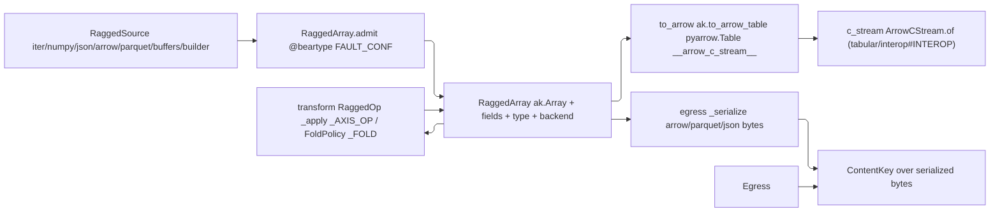

# [PY_DATA_RAGGED]

The variable-length nested-array owner over `awkward`: `RaggedArray` owns the irregular row — variable-length lists, option types, record and union arrays over columnar memory — through one `RaggedSource` admission union, one `RaggedOp` transform axis, and one `RaggedSink` egress. It is the irregular counterpart of the dense `gridded/store#STORE` chunk-grid store — a distinct owner composing the existing Arrow carrier and runtime content key, never a ragged backend tag on `TensorBackend`.

The Arrow bridge is the Arrow C Data Interface: `ak.to_arrow_table` materializes a `pyarrow.Table` whose native `__arrow_c_stream__` capsule crosses to the `tabular/interop#INTEROP` carrier through `ArrowCStream.of`, the carrier staying pyarrow-free because the capsule, not pyarrow's compute, crosses the seam. The `Table` lowering is load-bearing over `ak.to_arrow` — the `pyarrow.Array` it returns exports only `__arrow_c_array__`, no native stream — and it folds a fieldless ragged array into a struct-top schema without a manual `ak.zip` re-wrap. The `arrow` sink serializes through the folder's ONE `arrow_bytes` IPC fold imported from `tabular/interop#INTEROP`, and `egress` returns the `ContentKey` minted over the chosen sink's bytes.

## [01]-[INDEX]

- [02]-[RAGGED]: the `RaggedArray` owner — one `RaggedSource` admission union, one `RaggedOp` transform axis over the `_AXIS_OP`/`_FOLD` tables, one `RaggedSink` egress keyed by `ContentIdentity`.

## [02]-[RAGGED]

- Owner: `RaggedArray` — one frozen owner carrying the live `ak.Array`, its field names, its type descriptor, and the recovered backend. The backend is the `awkward` `"cpu"`/`"cuda"`/`"jax"` axis recovered through `ak.backend` and moved through `ak.to_backend`, never a parallel ragged-list class per backend; field access is named, never positional-only.
- Cases: `RaggedSource.raises` and `RaggedSink.raises` are DERIVED columns pairing each arm's `FaultRow` with its provider catch set, so the one store-reading arm of each union declares the posture a re-issue may clear while the in-memory arms declare terminal, and neither entrypoint grows a per-tag branch. The `drop` arm's `int | None` payload threads the catalogued `ak.drop_none(axis=None)` all-levels modality through the same `axis=` call-head, so the `_AXIS_OP` collapse drops no capability to a per-list-only axis. One `FoldPolicy` carries the full knob union and `apply` reads exactly one `_FOLD` closure row owning its member's call-head, so the dispatch never rebuilds a dict, never branches on member family, and never drops a knob to an axis-only call.
- Entry: one `admit`/`transform`/`to_backend`/`to_arrow`/`c_stream`/`to_layout`/`metadata`/`egress` family owns every modality by input shape, never a per-operation method family; `metadata` reads the parquet descriptor without materializing a single column.
- Law: admission owns structural validity through `_admit`; egress serializes the admitted array once and returns its content key without a second evidence projection.
- Growth: a new transform is one `RaggedOp` case; a new single-axis structure op is one `_AXIS_OP` row plus one case; a new reducer, paired statistic, or order kind is one `_FOLD` row plus one literal; a new fold knob is one `FoldPolicy` field plus one read in its closure builder; a new ingest is one `RaggedSource` case (`from_rdataframe` the ROOT columnar ingest); a new egress is one `RaggedSink` case (`dataframe` over `ak.to_dataframe`); a new backend is one `ak.to_backend` move; a new fenced leg or refusal law is one `FaultRow` row under `DataLeg.RAGGED` in this module's one `RAISES` table.
- Boundary: no compute-package numeric trio, no production tensor session, no durable product store — `data` emits a portable content-addressed irregular array bridged to the Arrow carrier, not a runtime compute graph; the carrier constructs only through `ArrowCStream.of`, never an inline capsule-plus-schema re-mint.

```python
from typing import TYPE_CHECKING, Final, Literal, assert_never

import awkward as ak
from beartype import beartype
from expression import case, tag, tagged_union
from expression.collections import Block, Map
from msgspec import Struct
from opentelemetry import trace

lazy import pyarrow as pa

from rasm.data.tabular.interop import ArrowCStream, DataLeg, arrow_bytes
from rasm.runtime.faults import FAULT_CONF, TERMINAL, TRANSIENT, Catch, FaultRow, RuntimeRail, boundary, rostered, scoped
from rasm.runtime.identity import ContentIdentity, ContentKey
from rasm.runtime.roots import ResourceRef

if TYPE_CHECKING:
    from collections.abc import Callable, Sequence

    import numpy as np


_TRACER: Final = scoped(trace.get_tracer, "rasm.data.gridded.ragged")

type Backend = Literal["cpu", "cuda", "jax"]
type AxisOp = Literal["flatten", "num", "firsts", "local_index", "singletons", "drop", "is_none"]
type Reduction = Literal["sum", "mean", "count", "prod", "min", "max", "any", "all", "count_nonzero", "std", "var", "ptp"]
type Paired = Literal["corr", "linear_fit", "moment"]
type Order = Literal["sort", "argsort"]
type Fold = Reduction | Paired | Order
type FoldArm = Callable[[FoldPolicy, ak.Array], ak.Array]
type Buffers = tuple[ak.forms.Form, int, dict[str, bytes]]

_RAGGED_RAISES: Final[Catch] = (
    ImportError,
    AttributeError,
    IndexError,
    KeyError,
    NotImplementedError,
    RuntimeError,
    TypeError,
    ValueError,
)


def _parquet_raises() -> Catch:
    return (pa.ArrowException, *_RAGGED_RAISES, OSError)


RAGGED_ADMIT: Final[FaultRow[DataLeg]] = FaultRow(
    leg=DataLeg.RAGGED, point="admit", arm="boundary", defect="admit-refused", retriability=TERMINAL
)
RAGGED_INGEST: Final[FaultRow[DataLeg]] = FaultRow(
    leg=DataLeg.RAGGED, point="ingest", arm="boundary", defect="source-read", retriability=TRANSIENT
)
RAGGED_TRANSFORM: Final[FaultRow[DataLeg]] = FaultRow(
    leg=DataLeg.RAGGED, point="transform", arm="boundary", defect="transform-refused", retriability=TERMINAL
)
RAGGED_BACKEND: Final[FaultRow[DataLeg]] = FaultRow(
    leg=DataLeg.RAGGED, point="backend", arm="boundary", defect="backend-move", retriability=TERMINAL
)
RAGGED_ARROW: Final[FaultRow[DataLeg]] = FaultRow(
    leg=DataLeg.RAGGED, point="arrow", arm="boundary", defect="arrow-lowering", retriability=TERMINAL
)
RAGGED_LAYOUT: Final[FaultRow[DataLeg]] = FaultRow(
    leg=DataLeg.RAGGED, point="layout", arm="boundary", defect="buffer-lowering", retriability=TERMINAL
)
RAGGED_EGRESS: Final[FaultRow[DataLeg]] = FaultRow(
    leg=DataLeg.RAGGED, point="egress", arm="boundary", defect="egress-refused", retriability=TERMINAL
)
RAGGED_SINK: Final[FaultRow[DataLeg]] = FaultRow(
    leg=DataLeg.RAGGED, point="sink", arm="boundary", defect="sink-write", retriability=TRANSIENT
)
RAGGED_METADATA: Final[FaultRow[DataLeg]] = FaultRow(
    leg=DataLeg.RAGGED, point="metadata", arm="boundary", defect="metadata-read", retriability=TRANSIENT
)
RAISES: Final[Block[FaultRow[DataLeg]]] = rostered(Block.of_seq([
    RAGGED_ADMIT,
    RAGGED_INGEST,
    RAGGED_TRANSFORM,
    RAGGED_BACKEND,
    RAGGED_ARROW,
    RAGGED_LAYOUT,
    RAGGED_EGRESS,
    RAGGED_SINK,
    RAGGED_METADATA,
]))

_AXIS_OP: "Final[Map[AxisOp, Callable[..., ak.Array]]]" = Map.of_seq([
    ("flatten", ak.flatten),
    ("num", ak.num),
    ("firsts", ak.firsts),
    ("local_index", ak.local_index),
    ("singletons", ak.singletons),
    ("drop", ak.drop_none),
    ("is_none", ak.is_none),
])

_WEIGHTED: frozenset[Fold] = frozenset({"mean", "std", "var"})
_SAMPLE: frozenset[Fold] = frozenset({"std", "var"})


def _reduce(key: Reduction, member: "Callable[..., ak.Array]") -> FoldArm:
    def arm(policy: "FoldPolicy", array: ak.Array) -> ak.Array:
        knobs: dict[str, object] = {"axis": policy.axis, "keepdims": policy.keepdims, "mask_identity": policy.mask_identity}
        if key in _WEIGHTED and policy.weight is not None:
            knobs["weight"] = policy.weight
        if key in _SAMPLE:
            knobs["ddof"] = policy.ddof
        return member(array, **knobs)

    return arm


def _paired(key: Paired, member: "Callable[..., ak.Array]") -> FoldArm:
    def arm(policy: "FoldPolicy", array: ak.Array) -> ak.Array:
        knobs: dict[str, object] = {"weight": policy.weight, "axis": policy.axis, "keepdims": policy.keepdims, "mask_identity": policy.mask_identity}
        return member(array, policy.n if key == "moment" else policy.operand, **knobs)

    return arm


def _ordered(member: "Callable[..., ak.Array]") -> FoldArm:
    return lambda policy, array: member(array, axis=policy.axis if policy.axis is not None else -1, ascending=policy.ascending, stable=policy.stable)


_REDUCE: "Final[Map[Reduction, Callable[..., ak.Array]]]" = Map.of_seq([
    ("sum", ak.sum),
    ("mean", ak.mean),
    ("count", ak.count),
    ("prod", ak.prod),
    ("min", ak.min),
    ("max", ak.max),
    ("any", ak.any),
    ("all", ak.all),
    ("count_nonzero", ak.count_nonzero),
    ("std", ak.std),
    ("var", ak.var),
    ("ptp", ak.ptp),
])
_FOLD: "Final[Map[Fold, FoldArm]]" = Map.of_seq([
    *((key, _reduce(key, member)) for key, member in _REDUCE.items()),
    ("corr", _paired("corr", ak.corr)),
    ("linear_fit", _paired("linear_fit", ak.linear_fit)),
    ("moment", _paired("moment", ak.moment)),
    ("sort", _ordered(ak.sort)),
    ("argsort", _ordered(ak.argsort)),
])


class FoldPolicy(Struct, frozen=True):
    func: Fold = "sum"
    operand: "ak.Array | None" = None
    n: int = 1
    axis: int | None = None
    keepdims: bool = False
    mask_identity: bool = True
    weight: "ak.Array | None" = None
    ddof: int = 0
    ascending: bool = True
    stable: bool = True

    def apply(self, array: ak.Array) -> ak.Array:
        return _FOLD[self.func](self, array)


@tagged_union(frozen=True)
class RaggedSource:
    tag: Literal["iter", "numpy", "json", "arrow", "parquet", "buffers", "builder"] = tag()
    iter: "Sequence[Sequence[object]]" = case()
    numpy: "np.ndarray" = case()
    json: str = case()
    arrow: object = case()
    parquet: ResourceRef = case()
    buffers: Buffers = case()
    builder: ak.ArrayBuilder = case()

    @property
    def raises(self) -> "tuple[FaultRow[DataLeg], Catch]":
        return (RAGGED_INGEST, _parquet_raises()) if self.tag == "parquet" else (RAGGED_ADMIT, _RAGGED_RAISES)


@tagged_union(frozen=True)
class RaggedOp:
    tag: Literal[
        "flatten",
        "unflatten",
        "ravel",
        "num",
        "firsts",
        "local_index",
        "run_lengths",
        "singletons",
        "zip",
        "cartesian",
        "combinations",
        "concat",
        "where",
        "fold",
        "fill",
        "drop",
        "pad",
        "is_none",
        "masked",
        "cast",
        "enforce",
        "packed",
        "project",
        "with_field",
        "without_field",
        "with_name",
        "with_parameter",
    ] = tag()
    flatten: int = case()
    unflatten: tuple["ak.Array", int] = case()
    ravel: None = case()
    num: int = case()
    firsts: int = case()
    local_index: int = case()
    run_lengths: None = case()
    singletons: int = case()
    zip: dict[str, "ak.Array"] = case()
    cartesian: tuple[dict[str, "ak.Array"], int] = case()
    combinations: tuple[int, int, bool] = case()
    concat: tuple["ak.Array", int] = case()
    where: tuple["ak.Array", "ak.Array"] = case()
    fold: FoldPolicy = case()
    fill: tuple[object, int] = case()
    drop: int | None = case()
    pad: tuple[int, int, bool] = case()
    is_none: int = case()
    masked: tuple["ak.Array", bool] = case()
    cast: str = case()
    enforce: str = case()
    packed: None = case()
    project: str = case()
    with_field: tuple[str, "ak.Array"] = case()
    without_field: str = case()
    with_name: str = case()
    with_parameter: tuple[str, object] = case()


@tagged_union(frozen=True)
class RaggedSink:
    tag: Literal["arrow", "parquet", "json"] = tag()
    arrow: None = case()
    parquet: ResourceRef = case()
    json: bool = case()

    @property
    def raises(self) -> "tuple[FaultRow[DataLeg], Catch]":
        return (RAGGED_SINK, _parquet_raises()) if self.tag == "parquet" else (RAGGED_EGRESS, _RAGGED_RAISES)


class RaggedArray(Struct, frozen=True):
    array: ak.Array
    fields: tuple[str, ...]
    type_repr: str
    backend: Backend

    @staticmethod
    @beartype(conf=FAULT_CONF)
    def admit(source: RaggedSource) -> "RuntimeRail[RaggedArray]":
        at, catch = source.raises
        with _TRACER.start_as_current_span(f"ragged.admit.{source.tag}", attributes={"rasm.ragged.source": source.tag}):
            return boundary(at, lambda: _admit(_ingest(source)), catch=catch)

    def transform(self, op: RaggedOp) -> "RuntimeRail[RaggedArray]":
        return boundary(RAGGED_TRANSFORM, lambda: _admit(_apply(self.array, op)), catch=_RAGGED_RAISES)

    def to_backend(self, backend: Backend) -> "RuntimeRail[RaggedArray]":
        return boundary(RAGGED_BACKEND, lambda: _admit(ak.to_backend(self.array, backend)), catch=_RAGGED_RAISES)

    def to_arrow(self) -> "RuntimeRail[object]":
        return boundary(RAGGED_ARROW, lambda: _arrow(self.array), catch=_parquet_raises())

    def c_stream(self) -> "RuntimeRail[ArrowCStream]":
        return boundary(RAGGED_ARROW, lambda: _c_stream(self.array), catch=_parquet_raises())

    def to_layout(self) -> "RuntimeRail[Buffers]":
        return boundary(RAGGED_LAYOUT, lambda: _to_buffers(self.array), catch=_RAGGED_RAISES)

    def egress(self, sink: RaggedSink) -> "RuntimeRail[ContentKey]":
        at, catch = sink.raises
        with _TRACER.start_as_current_span(f"ragged.egress.{sink.tag}", attributes={"rasm.ragged.rows": len(self.array)}):
            return boundary(at, lambda: _serialize(self.array, sink), catch=catch).bind(
                lambda payload: ContentIdentity.of(f"ragged.{sink.tag}", payload)
            )

    @staticmethod
    def metadata(ref: ResourceRef) -> "RuntimeRail[dict[str, object]]":
        return boundary(RAGGED_METADATA, lambda: dict(ak.metadata_from_parquet(str(ref.path))), catch=_parquet_raises())


def _ingest(source: RaggedSource) -> ak.Array:
    match source:
        case RaggedSource(tag="iter", iter=values):
            return ak.from_iter(values)
        case RaggedSource(tag="numpy", numpy=values):
            return ak.from_numpy(values, regulararray=True)
        case RaggedSource(tag="json", json=text):
            return ak.from_json(text)
        case RaggedSource(tag="arrow", arrow=stream):
            return ak.from_arrow(stream, generate_bitmasks=True)
        case RaggedSource(tag="parquet", parquet=ref):
            return ak.from_parquet(str(ref.path))
        case RaggedSource(tag="buffers", buffers=(form, length, container)):
            return ak.from_buffers(form, length, container)
        case RaggedSource(tag="builder", builder=builder):
            return builder.snapshot()
        case unreachable:
            assert_never(unreachable)


def _apply(array: ak.Array, op: RaggedOp) -> ak.Array:
    match op:
        case RaggedOp(tag=kind) if _AXIS_OP.contains_key(kind):
            return _AXIS_OP[kind](array, axis=getattr(op, kind))
        case RaggedOp(tag="unflatten", unflatten=(counts, axis)):
            return ak.unflatten(array, counts, axis=axis)
        case RaggedOp(tag="ravel"):
            return ak.ravel(array)
        case RaggedOp(tag="run_lengths"):
            return ak.run_lengths(array)
        case RaggedOp(tag="zip", zip=arrays):
            return ak.zip(arrays)
        case RaggedOp(tag="cartesian", cartesian=(arrays, axis)):
            return ak.cartesian(arrays, axis=axis)
        case RaggedOp(tag="combinations", combinations=(n, axis, replacement)):
            return ak.combinations(array, n, axis=axis, replacement=replacement)
        case RaggedOp(tag="concat", concat=(other, axis)):
            return ak.concatenate((array, other), axis=axis)
        case RaggedOp(tag="where", where=(condition, otherwise)):
            return ak.where(condition, array, otherwise)
        case RaggedOp(tag="fold", fold=policy):
            return policy.apply(array)
        case RaggedOp(tag="fill", fill=(value, axis)):
            return ak.fill_none(array, value, axis=axis)
        case RaggedOp(tag="pad", pad=(target, axis, clip)):
            return ak.pad_none(array, target, axis=axis, clip=clip)
        case RaggedOp(tag="masked", masked=(mask, valid_when)):
            return ak.mask(array, mask, valid_when=valid_when)
        case RaggedOp(tag="cast", cast=to):
            return ak.values_astype(array, to)
        case RaggedOp(tag="enforce", enforce=to):
            return ak.enforce_type(array, to)
        case RaggedOp(tag="packed"):
            return ak.to_packed(array)
        case RaggedOp(tag="project", project=field):
            return array[field]
        case RaggedOp(tag="with_field", with_field=(where, what)):
            return ak.with_field(array, what, where)
        case RaggedOp(tag="without_field", without_field=where):
            return ak.without_field(array, where)
        case RaggedOp(tag="with_name", with_name=name):
            return ak.with_name(array, name)
        case RaggedOp(tag="with_parameter", with_parameter=(key, value)):
            return ak.with_parameter(array, key, value)
        case unreachable:
            assert_never(unreachable)


def _admit(array: ak.Array) -> RaggedArray:
    return RaggedArray(array=array, fields=tuple(ak.fields(array)), type_repr=str(ak.type(array)), backend=ak.backend(array))


def _arrow(array: ak.Array) -> object:
    return ak.to_arrow_table(array, extensionarray=False)


def _c_stream(array: ak.Array) -> ArrowCStream:
    return ArrowCStream.of(_arrow(array))


def _to_buffers(array: ak.Array) -> Buffers:
    form, length, container = ak.to_buffers(ak.to_layout(array))
    return (form, length, {key: bytes(buffer) for key, buffer in container.items()})


def _serialize(array: ak.Array, sink: RaggedSink) -> bytes:
    match sink:
        case RaggedSink(tag="arrow"):
            return bytes(arrow_bytes(_arrow(array)))
        case RaggedSink(tag="parquet", parquet=ref):
            ak.to_parquet(array, str(ref.path))
            return ref.path.read_bytes()
        case RaggedSink(tag="json", json=line_delimited):
            return ak.to_json(array, line_delimited=line_delimited).encode()
        case unreachable:
            assert_never(unreachable)


```


```mermaid
---
config:
  layout: elk
  flowchart:
    curve: linear
    padding: 25
---
flowchart LR
    accTitle: Ragged array flow
    accDescr: RaggedSource admission into the RaggedArray owner, transform dispatch over the op tables, Arrow carrier crossing, and content-keyed egress.
    Source["RaggedSource iter/numpy/json/arrow/parquet/buffers/builder"] --> Admit["RaggedArray.admit @beartype FAULT_CONF"]
    Admit --> Owner["RaggedArray ak.Array + fields + type + backend"]
    Owner --> Transform["transform RaggedOp _apply _AXIS_OP / FoldPolicy _FOLD"]
    Transform --> Owner
    Owner --> Arrow["to_arrow ak.to_arrow_table pyarrow.Table __arrow_c_stream__"]
    Arrow --> Stream["c_stream ArrowCStream.of (tabular/interop#INTEROP)"]
    Owner --> Serialize["egress _serialize arrow/parquet/json bytes"]
    Serialize --> Key["ContentIdentity.of .bind/.map RuntimeRail[ContentKey]"]
    Egress --> Key["ContentKey over serialized bytes"]
```

## [03]-[RESEARCH]

<!-- source-only: research row template:
[TOKEN]-[OPEN|BLOCKED]: <exact question>; <verification route>.
-->

(none)
