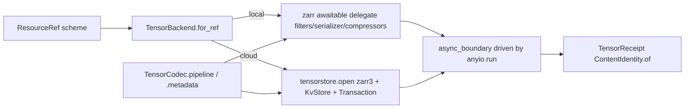
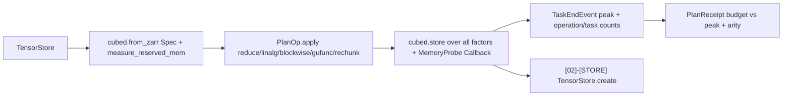

# [PY_DATA_STORE]

The dense chunked N-D array store over one `TensorBackend` engine axis: `TensorStore` owns the `zarr` v3 array — chunk grid, three-slot codec pipeline, orthogonal region write — with `ZARR` the pure-Python sync engine and `TENSORSTORE` the async engine opening the IDENTICAL Zarr v3 chunk grid over a native `KvStore` backend. Out-of-core is not a backend but the `cubed` plan over either store, and the versioned and ragged dimensions live on their own `gridded/virtual` and `gridded/ragged` owners, never as backend tags here.

The backend is recovered from the store URL scheme through the `runtime/roots#RESOURCE`-owned `OBJECT_STORE_SCHEMES` vocabulary — config as a domain value carrying its `create`/`write`/`read` behaviour, never an `engine=` flag set and never a parallel store class per engine. `TensorReceipt` and `PlanReceipt` key by one runtime `ContentIdentity`; the plan receipt carries the `allowed_mem` budget beside the measured peak the `cubed` executor records.

## [01]-[INDEX]

- [01]-[STORE]: the `TensorStore` dense store over the `TensorBackend` axis — create/region-write/read, the `TensorChunking` grid, the `TensorCodec` pipeline, the content-keyed `TensorReceipt`.
- [02]-[PLAN]: the bounded-memory `cubed` plan over the same store — one `PlanOp` dispatch, the `PlanReceipt` budget-vs-peak evidence.

## [02]-[STORE]

- Owner: `TensorStore` — one frozen store; one `create`/`write_region`/`read_region` entrypoint family owns all modalities by the recovered backend and the `Indexing`/arity axes the value carries, never a per-engine reader family and never a per-arm sync portal.
- Growth: a new filter is one `_FILTER` row plus one `TensorFilter` case; a new compressor one `_COMPRESSOR` row under the existing `compress` case; a new selection mode one `Indexing` literal plus one `_ZARR_WRITE`/`_ZARR_READ` row; a new engine one `TensorBackend` member plus one delegate row; a new cloud backend one `_KVSTORE_DRIVER` scheme row; a stored-domain resize one `TensorStore.resize` entry over the catalogued `tensorstore` `resize`/`zarr` `Array.resize`; zero new surface.
- Boundary: no compute-package numeric trio (labelled-array compute is `compute`), no production tensor session, no durable product store, and no `xarray` re-derivation of the dense store — `data` emits a portable content-addressed chunked store. `zarr.codecs.numcodecs` is the absorbed live home for the numcodecs-named rows; `numcodecs.zarr3` is the deprecated spelling emitting a `DeprecationWarning`, a rejected import.

```python signature
import functools
from collections.abc import Awaitable, Callable, Iterable
from enum import StrEnum
from typing import TYPE_CHECKING, Any, Final, Literal, assert_never

import anyio
import zarr
import zarr.codecs.numcodecs as nc
from beartype import beartype
from expression import Error, case, tag, tagged_union
from expression.collections import Map
from msgspec import Struct
from zarr import codecs as zc

from rasm.runtime.identity import ContentIdentity, ContentKey
from rasm.runtime.faults import FAULT_CONF, BoundaryFault, RuntimeRail, async_boundary
from rasm.runtime.receipts import Receipt
from rasm.runtime.roots import OBJECT_STORE_SCHEMES, ResourceRef

if TYPE_CHECKING:
    import numpy as np
    from zarr.abc.codec import ArrayArrayCodec, ArrayBytesCodec, BytesBytesCodec


type Shape = tuple[int, ...]
type ChunkGrid = tuple[int, ...]
type DType = str
type Pipeline = tuple[tuple["ArrayArrayCodec", ...], "ArrayBytesCodec", tuple["BytesBytesCodec", ...]]
type JsonSpec = dict[str, Any]


class TensorChunking(Struct, frozen=True):
    chunks: ChunkGrid
    shards: ChunkGrid | None = None

    @property
    def grid(self) -> ChunkGrid:
        # the array-level grid: the outer `shards` when sharding, else `chunks` — tensorstore's `chunk_grid` reads this
        # while the `sharding_indexed` inner `chunk_shape` reads `chunks`.
        return self.shards or self.chunks


type Compressor = Literal["blosc", "zstd", "gzip", "lz4", "lzma", "bz2", "zlib"]

_COMPRESSOR: "Final[Map[Compressor, tuple[Callable[..., BytesBytesCodec], str, tuple[str, ...]]]]" = Map.of_seq([
    ("blosc", (lambda cname, clevel: zc.BloscCodec(cname=cname, clevel=clevel), "blosc", ("cname", "clevel"))),
    ("zstd", (lambda level: zc.ZstdCodec(level=level), "zstd", ("level",))),
    ("gzip", (lambda level: zc.GzipCodec(level=level), "gzip", ("level",))),
    ("lz4", (lambda level: nc.LZ4(level=level), "numcodecs.lz4", ("level",))),
    ("lzma", (lambda preset: nc.LZMA(preset=preset), "numcodecs.lzma", ("preset",))),
    ("bz2", (lambda level: nc.BZ2(level=level), "numcodecs.bz2", ("level",))),
    ("zlib", (lambda level: nc.Zlib(level=level), "numcodecs.zlib", ("level",))),
])


# the serializer slot is the compressor-presence axis ONLY. Sharding is NOT a serializer case: `TensorChunking.shards` is
# its sole owner, and the native `create_array(shards=)` wrap keeps the whole inner pipeline, so a sharded store never drops
# its compressor/filter choice to a hardcoded `ShardingCodec`.
@tagged_union(frozen=True)
class Serializer:
    tag: Literal["compress", "raw"] = tag()
    compress: "tuple[Compressor, tuple[Any, ...]]" = case()
    raw: None = case()

    def slot(self, pre: "tuple[ArrayArrayCodec, ...]") -> Pipeline:
        match self:
            case Serializer(tag="compress"):
                name, args = self.compress
                build, _, _ = _COMPRESSOR[name]
                return (pre, zc.BytesCodec(), (build(*args),))
            case Serializer(tag="raw"):
                return (pre, zc.BytesCodec(), ())
            case unreachable:
                assert_never(unreachable)

    def slot_json(self, pre: list[JsonSpec]) -> list[JsonSpec]:
        match self:
            case Serializer(tag="compress"):
                name, args = self.compress
                _, codec_name, keys = _COMPRESSOR[name]
                return [*pre, {"name": "bytes"}, {"name": codec_name, "configuration": dict(zip(keys, args, strict=True))}]
            case Serializer(tag="raw"):
                return [*pre, {"name": "bytes"}]
            case unreachable:
                assert_never(unreachable)

    @property
    def name(self) -> str:
        return self.compress[0] if self.tag == "compress" else self.tag


class TensorCodec(Struct, frozen=True):
    serializer: Serializer = Serializer(raw=None)
    filters: "tuple[TensorFilter, ...]" = ()

    def pipeline(self) -> Pipeline:
        return self.serializer.slot(tuple(f.codec() for f in self.filters))

    def metadata(self, chunking: "TensorChunking") -> list[JsonSpec]:
        # tensorstore carries no native `shards=`, so the `sharding_indexed` wrap is explicit here.
        inner = self.serializer.slot_json([f.json() for f in self.filters])
        return [{"name": "sharding_indexed", "configuration": {"chunk_shape": list(chunking.chunks), "codecs": inner}}] if chunking.shards else inner

    @property
    def name(self) -> str:
        return self.serializer.name


type Filter = Literal["transpose", "scale_offset", "delta", "fixed_scale_offset", "quantize", "bitround", "packbits"]

# `zc.ScaleOffset` is keyword-only `(*, offset=0, scale=1)` — the `dtype`/`astype` slots belong to `nc.FixedScaleOffset` alone.
_FILTER: "Final[Map[Filter, tuple[Callable[..., ArrayArrayCodec], str, tuple[str, ...]]]]" = Map.of_seq([
    ("transpose", (lambda order: zc.TransposeCodec(order=order), "transpose", ("order",))),
    ("scale_offset", (lambda scale, offset: zc.ScaleOffset(offset=offset, scale=scale), "scaleoffset", ("scale", "offset"))),
    ("delta", (lambda dtype: nc.Delta(dtype=dtype), "numcodecs.delta", ("dtype",))),
    (
        "fixed_scale_offset",
        (lambda scale, offset, dtype: nc.FixedScaleOffset(scale=scale, offset=offset, dtype=dtype), "numcodecs.fixedscaleoffset", ("scale", "offset", "dtype")),
    ),
    ("quantize", (lambda digits, dtype: nc.Quantize(digits=digits, dtype=dtype), "numcodecs.quantize", ("digits", "dtype"))),
    ("bitround", (lambda keepbits: nc.BitRound(keepbits=keepbits), "numcodecs.bitround", ("keepbits",))),
    ("packbits", (lambda: nc.PackBits(), "numcodecs.packbits", ())),
])


@tagged_union(frozen=True)
class TensorFilter:
    tag: Filter = tag()
    transpose: ChunkGrid = case()
    scale_offset: tuple[float, float] = case()
    delta: DType = case()
    fixed_scale_offset: tuple[float, float, DType] = case()
    quantize: tuple[int, DType] = case()
    bitround: int = case()
    packbits: None = case()

    def _args(self) -> tuple[Any, ...]:
        match self:
            case TensorFilter(tag="transpose"):
                return (list(self.transpose),)
            case TensorFilter(tag="scale_offset"):
                return self.scale_offset
            case TensorFilter(tag="delta"):
                return (self.delta,)
            case TensorFilter(tag="fixed_scale_offset"):
                return self.fixed_scale_offset
            case TensorFilter(tag="quantize"):
                return self.quantize
            case TensorFilter(tag="bitround"):
                return (self.bitround,)
            case TensorFilter(tag="packbits"):
                return ()
            case unreachable:
                assert_never(unreachable)

    def codec(self) -> "ArrayArrayCodec":
        build, _, _ = _FILTER[self.tag]
        return build(*self._args())

    def json(self) -> JsonSpec:
        _, name, keys = _FILTER[self.tag]
        return {"name": name, "configuration": dict(zip(keys, self._args(), strict=True))} if keys else {"name": name}


type Indexing = Literal["orthogonal", "vectorized"]


class TensorRegion(Struct, frozen=True):
    bounds: tuple[tuple[int, int], ...]
    indexing: Indexing = "orthogonal"

    def selection(self) -> tuple[slice, ...]:
        return tuple(slice(lo, hi) for lo, hi in self.bounds)


type Write = "tuple[TensorRegion, np.ndarray]"


class TensorBackend(StrEnum):
    ZARR = "zarr"
    TENSORSTORE = "tensorstore"

    @staticmethod
    def for_ref(ref: ResourceRef) -> "TensorBackend":
        return TensorBackend.TENSORSTORE if ref.scheme in OBJECT_STORE_SCHEMES else TensorBackend.ZARR

    @property
    def create(self) -> "Callable[[ResourceRef, Shape, DType, TensorChunking, TensorCodec], Awaitable[None]]":
        return _CREATE[self]

    @property
    def write(self) -> "Callable[[ResourceRef, TensorRegion, np.ndarray], Awaitable[int]]":
        return _WRITE[self]

    @property
    def write_many(self) -> "Callable[[ResourceRef, tuple[Write, ...]], Awaitable[int]]":
        return _WRITE_MANY[self]

    @property
    def read(self) -> "Callable[[ResourceRef, TensorRegion], Awaitable[np.ndarray]]":
        return _READ[self]


class TensorReceipt(Struct, frozen=True):
    backend: TensorBackend
    shape: Shape
    chunks: ChunkGrid
    dtype: DType
    codec: str
    filters: tuple[str, ...]
    bytes_stored: int
    content_key: ContentKey
    shards: ChunkGrid | None = None

    def contribute(self) -> Iterable[Receipt]:
        return (
            Receipt.of(
                "tensor",
                (
                    "emitted",
                    self.backend.value,
                    {
                        "shape": "x".join(map(str, self.shape)),
                        "codec": self.codec,
                        "filters": ",".join(self.filters),
                        "stored": self.bytes_stored,
                        **({"shards": "x".join(map(str, self.shards))} if self.shards else {}),
                    },
                ),
            ),
        )


class TensorStore(Struct, frozen=True):
    backend: TensorBackend
    ref: ResourceRef
    shape: Shape
    chunking: TensorChunking
    dtype: DType
    codec: TensorCodec

    @classmethod
    @beartype(conf=FAULT_CONF)
    def create(
        cls, ref: ResourceRef, shape: Shape, dtype: DType, chunking: TensorChunking, codec: TensorCodec = TensorCodec()
    ) -> "RuntimeRail[TensorStore]":
        backend = TensorBackend.for_ref(ref)

        async def _open() -> TensorStore:
            await backend.create(ref, shape, dtype, chunking, codec)
            return TensorStore(backend, ref, shape, chunking, dtype, codec)

        return anyio.run(async_boundary, "tensor.create", _open)

    def write_region(self, writes: "Write | Iterable[Write]") -> "RuntimeRail[TensorReceipt]":
        # the `(TensorRegion(), _)` arm keeps a lone pair whole before the `Iterable` arm can shatter it; an empty snapshot
        # is a typed `Error`, never a `writes[0]` `IndexError` escaping the rail.
        match writes:
            case (TensorRegion(), _) as lone:
                staged: tuple[Write, ...] = (lone,)
            case Iterable() as many:
                staged = tuple(many)
            case _ as unreachable:
                assert_never(unreachable)
        if not staged:
            return Error(BoundaryFault(config=("tensor.write_region", "empty-writes")))

        async def _write() -> int:
            head = staged[0]
            return await self.backend.write(self.ref, *head) if len(staged) == 1 else await self.backend.write_many(self.ref, staged)

        # the content key folds the `stream` modality over every written region in write order, so a plural snapshot never
        # collapses onto the last block; the atomic-vs-sequential disposition is the normalized count, never a flag.
        return anyio.run(async_boundary, "tensor.write_region", _write).bind(
            lambda stored: ContentIdentity.of("tensor", tuple(block.tobytes() for _, block in staged)).map(lambda key: _receipt(self, stored, key))
        )

    def read_region(self, region: TensorRegion) -> "RuntimeRail[np.ndarray]":
        return anyio.run(async_boundary, "tensor.read_region", lambda: self.backend.read(self.ref, region))


_ZARR_WRITE: "Final[Map[Indexing, str]]" = Map.of_seq([("orthogonal", "set_orthogonal_selection"), ("vectorized", "set_coordinate_selection")])
_ZARR_READ: "Final[Map[Indexing, str]]" = Map.of_seq([("orthogonal", "get_orthogonal_selection"), ("vectorized", "get_coordinate_selection")])


async def _zarr_create(ref: ResourceRef, shape: Shape, dtype: DType, chunking: TensorChunking, codec: TensorCodec) -> None:
    filters, serializer, compressors = codec.pipeline()
    zarr.create_array(
        store=zarr.storage.LocalStore(str(ref.path)),
        shape=shape,
        dtype=dtype,
        chunks=chunking.chunks,
        shards=chunking.shards,
        filters=filters,
        serializer=serializer,
        compressors=compressors,
        overwrite=True,
    )


async def _zarr_write(ref: ResourceRef, region: TensorRegion, data: "np.ndarray") -> int:
    arr = zarr.open_array(store=zarr.storage.LocalStore(str(ref.path)), mode="r+")
    getattr(arr, _ZARR_WRITE[region.indexing])(region.selection(), data)
    return int(data.nbytes)


async def _zarr_read(ref: ResourceRef, region: TensorRegion) -> "np.ndarray":
    arr = zarr.open_array(store=zarr.storage.LocalStore(str(ref.path)), mode="r")
    return getattr(arr, _ZARR_READ[region.indexing])(region.selection())


async def _zarr_write_many(ref: ResourceRef, regions: "tuple[Write, ...]") -> int:
    arr = zarr.open_array(store=zarr.storage.LocalStore(str(ref.path)), mode="r+")
    for region, data in regions:
        getattr(arr, _ZARR_WRITE[region.indexing])(region.selection(), data)
    return sum(int(data.nbytes) for _, data in regions)


# NO azure row — the source-verified kvstore root drivers are exactly file/gcs/http/memory/s3/tsgrpc_kvstore, so an
# `az`/`abfs` ref raises the typed reader-absence error the boundary converts, never a phantom driver.
_KVSTORE_DRIVER: "Final[Map[str, str]]" = Map.of_seq([("s3", "s3"), ("gs", "gcs")])


def _ts_kvstore(ref: ResourceRef) -> JsonSpec:
    if ref.scheme in OBJECT_STORE_SCHEMES:
        driver = _KVSTORE_DRIVER.get(ref.scheme)
        if driver is None:
            raise ValueError(f"tensorstore carries no {ref.scheme} kvstore driver (roots: file/gcs/http/memory/s3/tsgrpc_kvstore)")
        return {"driver": driver, "path": str(ref.path)}
    return {"driver": "file", "path": str(ref.path)}


def _ts_spec(
    ref: ResourceRef, *, codec: TensorCodec | None = None, shape: Shape = (), chunking: TensorChunking | None = None, dtype: DType = ""
) -> JsonSpec:
    # CAPABILITY ASYMMETRY: the tensorstore zarr3 `metadata.codecs` chain admits transpose/bytes/sharding_indexed/gzip/
    # blosc/zstd/crc32c; the `numcodecs.<id>`-named rows and `scaleoffset` are `zarr`-engine-only, so a TENSORSTORE store
    # selecting one is the typed engine-capability reject, never a silent both-engine claim.
    metadata: JsonSpec = (
        {}
        if codec is None or chunking is None
        else {
            "shape": list(shape),
            "data_type": dtype,
            "chunk_grid": {"name": "regular", "configuration": {"chunk_shape": list(chunking.grid)}},
            "codecs": codec.metadata(chunking),
        }
    )
    return {"driver": "zarr3", "kvstore": _ts_kvstore(ref), **({"metadata": metadata} if metadata else {})}


@functools.cache
def _ts_context() -> "Any":
    import tensorstore as ts  # noqa: PLC0415

    return ts.Context()


async def _ts_open(spec: JsonSpec, *, create: bool) -> "Any":
    import tensorstore as ts  # noqa: PLC0415

    return await ts.open(spec, create=create, delete_existing=create, context=_ts_context())


async def _ts_create(ref: ResourceRef, shape: Shape, dtype: DType, chunking: TensorChunking, codec: TensorCodec) -> None:
    await _ts_open(_ts_spec(ref, codec=codec, shape=shape, chunking=chunking, dtype=dtype), create=True)


def _ts_view(store: "Any", region: TensorRegion) -> "Any":
    return (store.vindex if region.indexing == "vectorized" else store.oindex)[region.selection()]


async def _ts_write(ref: ResourceRef, region: TensorRegion, data: "np.ndarray") -> int:
    store = await _ts_open(_ts_spec(ref), create=False)
    await _ts_view(store, region).write(data).commit
    return int(data.nbytes)


async def _ts_write_atomic(ref: ResourceRef, regions: "tuple[Write, ...]") -> int:
    import tensorstore as ts  # noqa: PLC0415

    txn = ts.Transaction(atomic=True)
    store = await ts.open(_ts_spec(ref), create=False, context=_ts_context(), transaction=txn)
    for region, data in regions:
        await _ts_view(store, region).write(data).commit
    await txn.commit_async()
    return sum(int(data.nbytes) for _, data in regions)


async def _ts_read(ref: ResourceRef, region: TensorRegion) -> "np.ndarray":
    store = await _ts_open(_ts_spec(ref), create=False)
    return await _ts_view(store, region).read()


_CREATE: "Final[Map[TensorBackend, Callable[[ResourceRef, Shape, DType, TensorChunking, TensorCodec], Awaitable[None]]]]" = Map.of_seq([
    (TensorBackend.ZARR, _zarr_create),
    (TensorBackend.TENSORSTORE, _ts_create),
])
_WRITE: "Final[Map[TensorBackend, Callable[[ResourceRef, TensorRegion, np.ndarray], Awaitable[int]]]]" = Map.of_seq([
    (TensorBackend.ZARR, _zarr_write),
    (TensorBackend.TENSORSTORE, _ts_write),
])
_WRITE_MANY: "Final[Map[TensorBackend, Callable[[ResourceRef, tuple[Write, ...]], Awaitable[int]]]]" = Map.of_seq([
    (TensorBackend.ZARR, _zarr_write_many),
    (TensorBackend.TENSORSTORE, _ts_write_atomic),
])
_READ: "Final[Map[TensorBackend, Callable[[ResourceRef, TensorRegion], Awaitable[np.ndarray]]]]" = Map.of_seq([
    (TensorBackend.ZARR, _zarr_read),
    (TensorBackend.TENSORSTORE, _ts_read),
])


def _receipt(store: TensorStore, bytes_stored: int, key: ContentKey) -> TensorReceipt:
    return TensorReceipt(
        backend=store.backend,
        shape=store.shape,
        chunks=store.chunking.chunks,
        dtype=store.dtype,
        codec=store.codec.name,
        filters=tuple(f.tag for f in store.codec.filters),
        bytes_stored=bytes_stored,
        content_key=key,
        shards=store.chunking.shards,
    )
```



## [03]-[PLAN]

- Owner: the bounded-memory `cubed` plan over the same `TensorStore` module — the out-of-core dimension of the store, not a fifth backend tag; one owner module carries the dense store and its plan, never a parallel `CubedStore` class.
- Cases: the `linalg` arm's factor tuple persists whole at materialization, so a `svd`/`qr` never drops a factor.
- Receipt: the plan emits no receipt while lazy — it builds a graph; materialization folds one `PlanReceipt` as budget-vs-peak evidence, and the materialized store re-enters through `[02]-[STORE]` as a fresh content-keyed `TensorReceipt`.
- Growth: a new reduction is one `Reduction` literal the Array API namespace answers; a new factorization one `_LINALG` row; a new executor one `Executor` literal; a new execution dimension (`executor_options`, `zarr_compressor`) is one `PlanBudget` field with `plan`'s signature untouched; a new measured fact is one field off the `Callback` lifecycle; zero new surface and never a `cubed` backend tag on `TensorBackend`.
- Boundary: cubed execution is offline study evidence — production substrate selection stays in the C# `csharp:Rasm.Compute` owner; `data` emits a bounded-memory plan plus its typed peak-memory receipt, never a runtime compute graph.

```python signature
from collections.abc import Callable, Iterable
from typing import TYPE_CHECKING, Final, Literal, assert_never

import cubed
from beartype import beartype
from cubed.array_api import linalg as cla
from expression import case, tag, tagged_union
from expression.collections import Map
from msgspec import Struct

from rasm.runtime.faults import FAULT_CONF, RuntimeRail, boundary
from rasm.runtime.receipts import Receipt

if TYPE_CHECKING:
    import numpy as np

    from rasm.runtime.roots import ResourceRef

# `ChunkGrid`/`DType`/`TensorStore` are the [02]-[STORE] owners in this same module.

type Op = Literal["reduce", "linalg", "blockwise", "gufunc", "rechunk"]
type Executor = Literal["single-threaded", "threads", "processes", "dask", "lithops", "modal", "coiled", "ray", "spark"]
type Reduction = Literal["nanmean", "sum", "mean", "nansum", "std", "var", "prod", "max", "min"]
type Factorization = Literal["matmul", "svd", "qr", "svdvals", "tensordot", "outer", "vecdot", "matrix_transpose"]


class PlanBudget(Struct, frozen=True):
    # the one execution policy `plan` folds into `cubed.Spec`, never three loose scalars the body re-derives;
    # `reserved_mem=None` is the genuine "calibrate via `measure_reserved_mem`" value, distinct from a budget int.
    allowed_mem: str = "2GB"
    reserved_mem: str | None = None
    executor: Executor = "single-threaded"


DEFAULT_BUDGET: Final[PlanBudget] = PlanBudget()

# the NaN-aware reductions live at `cubed.<name>` top-level, not the Array-API standard namespace, so the `reduce` arm
# resolves these off the `cubed` module and the rest off `__array_namespace__()`.
_NAN_REDUCTIONS: Final[frozenset[Reduction]] = frozenset({"nanmean", "nansum"})

_LINALG: "Final[Map[Factorization, Callable[..., cubed.Array | tuple[cubed.Array, ...]]]]" = Map.of_seq([
    ("matmul", cla.matmul),
    ("svd", cla.svd),
    ("qr", cla.qr),
    ("svdvals", cla.svdvals),
    ("tensordot", cla.tensordot),
    ("outer", cla.outer),
    ("vecdot", cla.vecdot),
    ("matrix_transpose", cla.matrix_transpose),
])


@tagged_union(frozen=True)
class PlanOp:
    tag: Op = tag()
    reduce: "tuple[Reduction, int | tuple[int, ...] | None, bool]" = case()
    linalg: "tuple[Factorization, cubed.Array | int | tuple[int, ...] | None]" = case()
    blockwise: "tuple[Callable[..., np.ndarray], DType, int | None, int | None]" = case()
    gufunc: "tuple[Callable[..., np.ndarray], str, tuple[DType, ...], bool, bool]" = case()
    rechunk: "tuple[ChunkGrid, str | None]" = case()

    def apply(self, plan: "cubed.Array") -> "cubed.Array | tuple[cubed.Array, ...]":
        match self:
            case PlanOp(tag="reduce"):
                op, axis, keepdims = self.reduce
                source = cubed if op in _NAN_REDUCTIONS else plan.__array_namespace__()
                return getattr(source, op)(plan, axis=axis, keepdims=keepdims)
            case PlanOp(tag="linalg"):
                op, operand = self.linalg
                return _LINALG[op](plan, operand) if operand is not None else _LINALG[op](plan)
            case PlanOp(tag="blockwise"):
                func, dtype, drop_axis, new_axis = self.blockwise
                return cubed.map_blocks(func, plan, dtype=dtype, drop_axis=drop_axis, new_axis=new_axis)
            case PlanOp(tag="gufunc"):
                func, signature, output_dtypes, vectorize, allow_rechunk = self.gufunc
                return cubed.apply_gufunc(func, signature, plan, output_dtypes=output_dtypes, vectorize=vectorize, allow_rechunk=allow_rechunk)
            case PlanOp(tag="rechunk"):
                chunks, min_mem = self.rechunk
                return cubed.rechunk(plan, chunks, min_mem=min_mem)
            case unreachable:
                assert_never(unreachable)


class MemoryProbe(cubed.Callback):
    def __init__(self) -> None:
        super().__init__()
        self.peak_mem = 0
        self.tasks = 0
        self.operations = 0

    def on_operation_start(self, event: "cubed.OperationStartEvent") -> None:
        self.operations += 1

    def on_task_end(self, event: "cubed.TaskEndEvent") -> None:
        self.peak_mem = max(self.peak_mem, int(event.peak_measured_mem_end or 0))
        self.tasks += 1


class PlanReceipt(Struct, frozen=True):
    op: Op
    executor: Executor
    allowed_mem: int
    reserved_mem: int
    npartitions: int
    arity: int
    operations: int
    tasks: int
    peak_mem: int
    target: str

    def contribute(self) -> Iterable[Receipt]:
        return (
            Receipt.of(
                "tensor",
                (
                    "planned",
                    self.op,
                    {
                        "executor": self.executor,
                        "allowed_mem": self.allowed_mem,
                        "reserved_mem": self.reserved_mem,
                        "peak_mem": self.peak_mem,
                        "npartitions": self.npartitions,
                        "arity": self.arity,
                        "operations": self.operations,
                        "tasks": self.tasks,
                    },
                ),
            ),
        )


@beartype(conf=FAULT_CONF)
def plan(store: "TensorStore", work_dir: "ResourceRef", *, budget: PlanBudget = DEFAULT_BUDGET) -> "RuntimeRail[cubed.Array]":
    def _open() -> "cubed.Array":
        reserved = cubed.measure_reserved_mem(budget.executor) if budget.reserved_mem is None else budget.reserved_mem
        spec = cubed.Spec(str(work_dir.path), allowed_mem=budget.allowed_mem, reserved_mem=reserved, executor_name=budget.executor)
        return cubed.from_zarr(str(store.ref.path), spec=spec)

    return boundary("tensor.plan", _open)


def materialize(graph: "cubed.Array", op: PlanOp, target: "ResourceRef") -> "RuntimeRail[PlanReceipt]":
    def _run() -> PlanReceipt:
        result = op.apply(graph)
        outputs = result if isinstance(result, tuple) else (result,)
        spec = outputs[0].spec
        probe = MemoryProbe()
        targets = [f"{target.path}/{op.tag}.{index}" for index in range(len(outputs))]
        cubed.store(list(outputs), targets, callbacks=[probe])
        return PlanReceipt(
            op=op.tag,
            executor=spec.executor_name,
            allowed_mem=int(spec.allowed_mem),
            reserved_mem=int(spec.reserved_mem),
            npartitions=sum(int(array.npartitions) for array in outputs),
            arity=len(outputs),
            operations=probe.operations,
            tasks=probe.tasks,
            peak_mem=probe.peak_mem,
            target=str(target.path),
        )

    return boundary("tensor.materialize", _run)
```



## [04]-[RESEARCH]

<!-- source-only: research row template:
[TOKEN]-[OPEN|BLOCKED]: <exact question>; <verification route>.
-->

(none)
