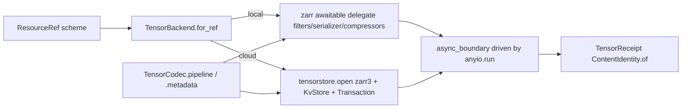

# [PY_DATA_STORE]

The dense chunked N-D array store over one `TensorBackend` engine axis. `TensorStore` owns the dense `zarr` v3 array — chunk grid plus three-slot codec pipeline plus orthogonal region write — and lifts the same store into a bounded-memory `cubed` plan that streams blockwise within an `allowed_mem` budget and materializes back through `cubed.to_zarr`. `TensorBackend` is the `StrEnum` whose member value IS the engine tag and whose `create`/`write`/`read` delegate selects the engine — `ZARR` the pure-Python sync `zarr` v3 store over a `zarr.storage.LocalStore`, `TENSORSTORE` the high-throughput async `tensorstore` engine opening the IDENTICAL Zarr v3 chunk grid through `tensorstore.open({"driver": "zarr3", "kvstore": ..., "metadata": {"codecs": [...]}})` over a native `KvStore` JSON backend with native concurrency, micro-caching, `oindex`/`vindex` read-selection, and `Transaction`-staged atomic multi-region writes — config as a domain value carrying behavior, never an `engine=` flag set, never a parallel `open_zarr`/`open_tensorstore` reader family. `TensorChunking` carries the chunk grid plus shard tuple; `TensorCodec` the Zarr v3 `(filters, serializer, compressors)` array-to-array filter / array-to-bytes serializer / bytes-to-bytes compressor pipeline; `TensorRegion` the orthogonal slice; `TensorReceipt` the typed write receipt keyed by exactly one runtime `ContentIdentity`; `PlanReceipt` the typed chunked-compute receipt carrying the `allowed_mem` budget and the measured peak memory the `cubed` executor already records. The backend is recovered from the store URL scheme, never a parallel `ZarrStore`/`TensorStoreStore` family per engine; out-of-core is not a backend but the `cubed` plan over either store, and the versioned and ragged dimensions live on their own `gridded/virtual` and `gridded/ragged` owners, never as backend tags here.

## [01]-[INDEX]

- [01]-[STORE]: the `TensorStore` dense chunked N-D store over a `TensorBackend` engine axis — the `zarr` v3 / `tensorstore` create / region-write / read entrypoint, the `TensorChunking` grid, the `TensorCodec` three-slot serializer pipeline, and the `TensorReceipt` content-keyed write receipt.
- [02]-[PLAN]: the bounded-memory `cubed` plan over the same store — `from_zarr` under a `Spec(work_dir, *, allowed_mem=...)`, the one `PlanOp` named-operation lookup over reductions / linalg / blockwise transforms, the `cubed.to_zarr` materialization, and the `PlanReceipt` carrying the memory budget plus the `TaskEndEvent`-measured peak, never a parallel out-of-core backend.

## [02]-[STORE]

- Owner: `TensorStore` — one frozen dense chunked N-D store carrying the `TensorBackend` engine row, the source `ResourceRef`, the shape, the `TensorChunking` grid, the dtype, and the `TensorCodec` pipeline; `TensorBackend` the `StrEnum` two-engine axis whose member value is the engine tag and whose `create`/`write`/`read` delegate selects the driver (`ZARR` the pure-Python sync `zarr` v3 store over `zarr.storage.LocalStore`, `TENSORSTORE` the async `tensorstore` engine over a `KvStore` backend reading the identical Zarr v3 chunk grid). `TensorChunking` carries the chunk grid plus optional outer `shards` grid and is the SOLE owner of sub-chunk sharding — the native `create_array(shards=)` path wraps the whole inner pipeline, never a second `Serializer` sharding case duplicating the concept; `TensorCodec` the Zarr v3 codec product pairing the orthogonal `filters` array-to-array pre-pipeline with a `Serializer` discriminated union over the `compress`/`raw` array-to-bytes-plus-compressor slot (the compressor-presence axis only — one `BytesCodec` plus a bytes-to-bytes compressor, or the bare `BytesCodec`), so the per-instance `filters` axis never conflates with the serializer-shape discriminant and sharding never splits across two owners; `TensorRegion` the orthogonal slice the region write addresses. The backend is recovered from the store URL scheme through `TensorBackend.for_ref`, never a parallel store class per engine.
- Cases: `TensorBackend` members `ZARR` (the chunk-grid plus codec-pipeline dense store over a `zarr.storage.LocalStore`, the cp315-clean module-top engine; the `Indexing` axis routes `set_orthogonal_selection`/`get_orthogonal_selection` versus `set_coordinate_selection`/`get_coordinate_selection` through the `_ZARR_WRITE`/`_ZARR_READ` row, never a second selection method family) · `TENSORSTORE` (the `tensorstore.open` async store opening the same Zarr v3 chunk grid and codec metadata through a JSON `Spec` under the `@functools.cache`-memoized `_ts_context`, the `KvStore` backend selected by a native `kvstore` JSON row — `file`/`s3`/`gcs`/`memory`/`ocdbt` — the `await store.oindex[selection].write(data).commit` durable-visibility gate, `await store.oindex[selection].read()` read, and `store.vindex` the vectorized read-selection the `Indexing` axis selects; the `<3.15` companion-band native dist function-local imported). Both members write and read one Zarr v3 chunk grid through one `Indexing` selection axis; the engine row selects the driver, never a second array shape, and the async arms lift through one `async_boundary` driven once at the sync edge by `anyio.run`, never a per-arm `_ts_run` portal re-minting the fault conversion the `reliability/faults#FAULT` owner holds.
- Entry: `TensorStore.create` opens a store rooted at a `ResourceRef` with a `TensorChunking` grid and `TensorCodec` pipeline, lifting the engine's awaitable `create` delegate through `async_boundary` driven by `anyio.run` and folding the recovered shape/chunks/dtype into the frozen owner returned in a `RuntimeRail`; `TensorStore.write_region` absorbs arity over one `writes: Write | Iterable[Write]` parameter normalized once at the head — a lone `(TensorRegion(), array)` pair keeps whole through the closed-owner match arm before the `Iterable` arm can shatter it, an empty snapshot rails as a typed `config` `Error` rather than an `IndexError` escaping the rail, a singular write routes the engine `write` delegate, and a plural write routes `write_many` (`tensorstore` one `Transaction(atomic=True)` staged commit, `zarr` sequential region writes) so the atomic-versus-sequential disposition is the normalized count, never a `*writes` unpack the snapshot caller never asked for and never a flag — and folds one `TensorReceipt` whose `bytes_stored` carries the summed written `data.nbytes` and whose `content_key` folds the `ContentIdentity.of` `stream` modality over every written region's bytes in write order, so a multi-region snapshot keys distinctly rather than collapsing onto the last block alone; `TensorStore.read_region` reads a `TensorRegion` through the engine's selection delegate routed by the region `Indexing` axis (`zarr` `get_orthogonal_selection`/`get_coordinate_selection`, `tensorstore` `await store.oindex[selection].read()`/`store.vindex`) into a NumPy array. One `create`/`write_region`/`read_region` entrypoint family owns all modalities by the `TensorBackend` member the `ResourceRef` scheme recovers and the `Indexing`/arity axes the value carries, never a per-engine reader family and never a per-arm sync portal.
- Auto: the `zarr` v3 pipeline splits into three role-typed slots — `filters=` takes an `ArrayArrayCodec` tuple (`TransposeCodec`/`ScaleOffset` off `zarr.codecs` plus `Delta`/`FixedScaleOffset`/`Quantize`/`BitRound`/`PackBits` off `numcodecs.zarr3`, the climate byte-reduction pre-pipeline applied before serialization), `serializer=` takes the one canonical `BytesCodec` `ArrayBytesCodec`, `compressors=` takes a `BytesBytesCodec` tuple (`BloscCodec`/`ZstdCodec`/`GzipCodec` off `zarr.codecs` plus `LZ4`/`LZMA`/`BZ2`/`Zlib` off `numcodecs.zarr3`); `TensorCodec.pipeline` returns the `(filters, serializer, compressors)` inner triple fed straight into `create_array` alongside the native `shards=chunking.shards`, which wraps that whole inner triple in a `ShardingCodec` itself — so a sharded store keeps every inner compressor/filter choice rather than the hardcoded-zstd hand-built `ShardingCodec` that dropped them, and conflating the slots fails the per-slot codec type check. The seven compressors collapse onto one `compress` case dispatched through the `_COMPRESSOR` data table — each row carrying its constructor (`zc.*` for the three `zarr.codecs` compressors, `nc.*` for the four `numcodecs.zarr3` ones), its zarr-v3 registry codec name, and its keyword order — rather than seven near-identical switch arms, so a new compressor is one row not a parallel arm; the seven filters collapse identically onto the `_FILTER` table feeding both `codec()` and `json()` from one `_args` projection, with the `numcodecs.zarr3` codecs resolved through the `zarr` `config['codecs']` registry exactly as the `zarr` `.api` mandates, never as phantom `zarr.codecs` names, so the `ScaleOffset`/`PackBits` capability is captured as two rows, never dropped. Sharding is the `TensorChunking.shards` grid, never a `Serializer` case: the `zarr` arm sets the native `create_array(shards=)` and the `tensorstore` arm — carrying no native `shards=` — wraps the inner `(filters, serializer, compressor)` chain in one `sharding_indexed` codec via `TensorCodec.metadata(chunking)` whose outer `chunk_grid` reads `chunking.grid` (the `shards` grid) and inner `chunk_shape` reads `chunking.chunks`, so both engines shard the same store with any inner compressor and the concept stays single-owner. The `tensorstore` arm projects the pipeline into the JSON `metadata.codecs` chain whose `transpose`/`bytes`/`sharding_indexed`/`blosc`/`zstd`/`gzip`/`crc32c` names the catalogued `zarr3` driver answers, so one `TensorCodec` value drives the `zarr` engine fully and the `tensorstore` engine over that catalogued name set, the `numcodecs.zarr3` filter and `lz4`/`lzma`/`bz2`/`zlib` compressor rows staying `zarr`-engine-only per the `[04]-[RESEARCH]` `[TENSORSTORE_KVSTORE]` gate. The receipt byte footprint is the written-region `data.nbytes` for both engines — the canonical NumPy byte count, engine-symmetric — never a per-engine `Array.nbytes_stored()`/`store.nbytes_valid` accessor the folder `.api` catalogue does not enumerate, and the receipt codec name reads `TensorCodec.name` (the compressor name on a `compress` value, else the tag) so the `blosc`-versus-`zstd` evidence survives the case collapse. The `tensorstore` async arms are awaitable engine delegates lifted through the one `reliability/faults#FAULT` `async_boundary` rail and driven once at the synchronous entrypoint edge by `anyio.run`, so a single fault conversion owns every arm and no `_ts_run` portal re-implements the rail the faults owner holds; the shared `ts.Context` is the `@functools.cache`-memoized `_ts_context` process singleton reused across every open per the `tensorstore` `.api` context axis, never a `global`-mutated sentinel and never re-minted per store. The cloud `kvstore` is a native `tensorstore` JSON spec built by the `_KVSTORE_DRIVER` scheme row (`s3`/`gcs`/`azure` plus the local `file` driver), never an `obstore` store object smuggled into the JSON `kvstore` slot the driver cannot consume. `zarr`/`numcodecs`/`cubed` are cp315-clean and import module-top (`numcodecs.zarr3` resolving the filter/extra-compressor v3 wrappers through the `zarr` `config['codecs']` registry); `tensorstore` is the `<3.15` companion-band native dist whose `open`/`Spec`/`KvStore`/`Context`/`Transaction` arm binds function-local under `# noqa: PLC0415`; the content key derives from every written region's bytes through exactly one canonical `ContentIdentity.of` `stream` fold in write order — the same Merkle/stream materialized-source idiom the `gridded/field#EGRESS` `FieldReceipt` and `gridded/ragged#RAGGED` `RaggedReceipt` content keys ride — so a plural write keys over the full region set rather than `writes[-1].tobytes()` alone, never a re-mint per write and never a last-region-only key dropping every prior block from the identity.
- Packages: `zarr` (`create_array(store=, shape=, dtype=, chunks=, shards=, filters=, serializer=, compressors=)`/`open_array`/`storage.LocalStore`/`Array.{set_orthogonal_selection,get_orthogonal_selection,set_coordinate_selection,get_coordinate_selection,oindex,vindex}`/`codecs.{BytesCodec,ShardingCodec,TransposeCodec,ScaleOffset,BloscCodec,ZstdCodec,GzipCodec,Crc32cCodec}` — the `zarr.codecs.__all__` serializer/transform/compressor set, the native `create_array(shards=)` the SOLE sharding wrap), `numcodecs` (`zarr3.{Delta,FixedScaleOffset,Quantize,BitRound,PackBits,LZ4,LZMA,BZ2,Zlib}` — the filter and extra-compressor v3 wrappers the `zarr` `config['codecs']` registry resolves for the names `zarr.codecs` does not carry, admitted only where `zarr.codecs` lacks the equivalent, `zarr>=3.1.3`, cp315-clean module-top), `tensorstore` (`open({"driver":"zarr3","kvstore":...,"metadata":{"codecs":[...]}}, create=, delete_existing=, context=, transaction=)`/`TensorStore.{read,write,oindex,vindex,resize,spec,chunk_layout,codec,kvstore}`/`Spec`/`KvStore`/`Context`/`Transaction.commit_async`/`Future`/`WriteFutures.commit` — the async engine row, function-local), `anyio` (`run` driving the `async_boundary` awaitable at the synchronous entrypoint edge), `beartype` (`@beartype(conf=FAULT_CONF)` the public domain-admission contract on the `create` factory so a caller `ResourceRef`/`TensorChunking`/`TensorCodec` argument that violates the in-process annotation raises the canonical `BeartypeCallHintViolation` root the `reliability/faults#FAULT` `CLASSIFY` `api` row folds onto the rail at the caller's enclosing fence, the shared `FAULT_CONF` the sibling `interop`/`egress`/`ragged` admission seams bind; the receipt classmethods `_receipt`/`TensorReceipt` over the owner's own produced values carry no decorator), runtime (`ResourceRef`/`ContentIdentity`/`ContentKey`/`RuntimeRail`/`async_boundary`/`FAULT_CONF` the shared beartype violation-redirect config/`Receipt`, the `TensorReceipt`/`PlanReceipt` `contribute` streams satisfying the `ReceiptContributor` Protocol structurally). The cloud `kvstore` URL resolution is the `pkg/transport/roots#TRANSPORT` `obstore` counterpart the runtime pass authors; this owner emits the native `tensorstore` `kvstore` JSON spec, not an `obstore` store object.
- Growth: a new filter is one `_FILTER` table row plus one `TensorFilter` case carrying its `zarr.codecs` or `numcodecs.zarr3` constructor and its registry codec name; a new compressor is one `_COMPRESSOR` table row under the existing `compress` case, never a parallel arm; a new chunk or shard strategy is one `TensorChunking` field the native `create_array(shards=)`/`sharding_indexed` wrap already threads, never a `Serializer` case; a new read/write selection mode is one `Indexing` literal plus one `_ZARR_WRITE`/`_ZARR_READ` row the `tensorstore` `oindex`/`vindex` views already answer; a new store engine (`n5`, an object-store-backed Zarr) is one `TensorBackend` member plus one `create`/`write`/`write_many`/`read` delegate row; a new `KvStore` cloud backend is one `_KVSTORE_DRIVER` scheme row; a stored-domain resize is one `TensorStore.resize` entry over the catalogued `tensorstore` `resize`/`zarr` `Array.resize`; the bounded-memory plan is the `[2]-[PLAN]` `cubed` row on this same owner; the versioned-store dimension is the `gridded/virtual` owner and the ragged dimension the `gridded/ragged` owner, never a backend tag here.
- Boundary: no compute-package numeric trio (NumPy/SciPy/labelled-array compute is `compute`), no production tensor session, no durable product store; `data` emits a portable content-addressed chunked store, not a runtime compute graph. A parallel `ZarrStore`/`CubedStore`/`TensorStoreStore` family per engine, an `open_zarr`/`open_tensorstore` reader family where one `TensorBackend` delegate dispatches, a `_ts_run` sync portal re-minting the `async_boundary` fault rail per arm, a blocking `Future.result()` inside the async rail where `anyio.run` drives the `async_boundary`, an `obstore` store object passed into the JSON `kvstore` slot where the native `kvstore` JSON spec is the contract, a re-minted `ts.Context()` per open where the `@functools.cache`-memoized `_ts_context` singleton is reused, a `global`-mutated `Any | None` context sentinel where `functools.cache` owns the memoization, an `oindex`-only read dropping the catalogued `vindex` selection, an `xarray` re-derivation of the dense store, a hand-rolled chunk codec / sharding / cache layer `tensorstore` owns, a hand-rolled filter pre-pipeline `zarr.codecs`/`numcodecs.zarr3` already provide, a phantom `zarr.codecs.Delta`/`Quantize`/`LZ4`/`LZMA`/`BZ2`/`Zlib` reference where those names live in `numcodecs.zarr3`, a `numcodecs.zarr3` admission for a name `zarr.codecs` already carries (`BytesCodec`/`ShardingCodec`/`TransposeCodec`/`ScaleOffset`/`BloscCodec`/`ZstdCodec`/`GzipCodec`/`Crc32cCodec`), a `virtual`/`icechunk`/`awkward` backend tag smuggled onto `TensorBackend`, a `writes[-1].tobytes()` last-region-only content key dropping every prior region from a plural write's identity where the `ContentIdentity.of` `stream` fold keys over all written blocks, a `Serializer.sharding` case duplicating the `TensorChunking.shards` grid where sharding is single-owned by the chunking and wrapped through the native `create_array(shards=)`/`sharding_indexed` projection, a hardcoded-zstd hand-built `ShardingCodec` dropping the inner compressor/filter choice where the native `shards=` wrap keeps the whole inner pipeline, a `shards=`-plus-hand-built-`ShardingCodec` double-sharding where the chunking owns the one wrap, a `*writes` variadic forcing the snapshot caller to unpack where one `Write | Iterable[Write]` parameter normalizes at the head, a `writes[0]` index on an empty call raising `IndexError` past the rail where the empty snapshot is a typed `config` `Error`, and an undecorated `create` admitting a caller `ResourceRef`/`TensorChunking`/`TensorCodec` argument without the `@beartype(conf=FAULT_CONF)` public-seam contract the sibling `interop`/`egress`/`ragged` admission factories share are the deleted forms.

```python signature
import functools
from builtins import frozendict
from collections.abc import Awaitable, Callable, Iterable
from enum import StrEnum
from typing import TYPE_CHECKING, Any, Final, Literal, assert_never

import anyio
import zarr
from beartype import beartype
from expression import Error, case, tag, tagged_union
from msgspec import Struct
from numcodecs import zarr3 as nc
from zarr import codecs as zc

from rasm.runtime.content_identity import ContentIdentity, ContentKey
from rasm.runtime.faults import FAULT_CONF, BoundaryFault, RuntimeRail, async_boundary
from rasm.runtime.receipts import Receipt
from rasm.runtime.roots import OBJECT_STORE_SCHEMES, ResourceRef

if TYPE_CHECKING:
    import numpy as np
    from zarr.abc.codec import ArrayArrayCodec, ArrayBytesCodec, BytesBytesCodec


type Shape = tuple[int, ...]
type ChunkGrid = tuple[int, ...]
type DType = str
type Pipeline = tuple[tuple["ArrayArrayCodec", ...], "ArrayBytesCodec", tuple["BytesBytesCodec", ...]]
type JsonSpec = dict[str, Any]

# `OBJECT_STORE_SCHEMES` is the one `runtime/roots#RESOURCE`-owned scheme vocabulary (`s3`/`gs`/`az`/
# `abfs`), imported not re-declared, so the engine-routing membership test never diverges from the
# `ResourceRef.scheme` authority that mints the refs this owner reads.


class TensorChunking(Struct, frozen=True):
    chunks: ChunkGrid
    shards: ChunkGrid | None = None

    @property
    def grid(self) -> ChunkGrid:
        # the array-level chunk grid: the outer `shards` when sharding, else `chunks`. `tensorstore`'s
        # `chunk_grid` reads this while the `sharding_indexed` inner `chunk_shape` reads `chunks`; the
        # `zarr` native `chunks=`/`shards=` pair encodes the same inner/outer split directly.
        return self.shards or self.chunks


type Compressor = Literal["blosc", "zstd", "gzip", "lz4", "lzma", "bz2", "zlib"]

_COMPRESSOR: "Final[frozendict[Compressor, tuple[Callable[..., BytesBytesCodec], str, tuple[str, ...]]]]" = frozendict({
    "blosc": (lambda cname, clevel: zc.BloscCodec(cname=cname, clevel=clevel), "blosc", ("cname", "clevel")),
    "zstd": (lambda level: zc.ZstdCodec(level=level), "zstd", ("level",)),
    "gzip": (lambda level: zc.GzipCodec(level=level), "gzip", ("level",)),
    "lz4": (lambda level: nc.LZ4(level=level), "numcodecs.lz4", ("level",)),
    "lzma": (lambda preset: nc.LZMA(preset=preset), "numcodecs.lzma", ("preset",)),
    "bz2": (lambda level: nc.BZ2(level=level), "numcodecs.bz2", ("level",)),
    "zlib": (lambda level: nc.Zlib(level=level), "numcodecs.zlib", ("level",)),
})


# the serializer slot is the compressor-presence axis ONLY — `compress` (one `BytesCodec` + one
# bytes->bytes compressor) versus `raw` (the bare `BytesCodec`). Sharding is NOT a serializer case:
# it is the `TensorChunking.shards` grid the native `create_array(shards=)` path wraps the WHOLE
# `(filters, serializer, compressors)` inner pipeline in, so a sharded store keeps every inner
# compressor/filter choice rather than the prior hardcoded-zstd `ShardingCodec` that dropped them.
@tagged_union(frozen=True)
class Serializer:
    tag: Literal["compress", "raw"] = tag()
    compress: "tuple[Compressor, tuple[Any, ...]]" = case()
    raw: None = case()

    def slot(self, pre: "tuple[ArrayArrayCodec, ...]") -> Pipeline:
        match self:
            case Serializer(tag="compress"):
                name, args = self.compress
                build, _, _ = _COMPRESSOR[name]
                return (pre, zc.BytesCodec(), (build(*args),))
            case Serializer(tag="raw"):
                return (pre, zc.BytesCodec(), ())
            case unreachable:
                assert_never(unreachable)

    def slot_json(self, pre: list[JsonSpec]) -> list[JsonSpec]:
        match self:
            case Serializer(tag="compress"):
                name, args = self.compress
                _, codec_name, keys = _COMPRESSOR[name]
                return [*pre, {"name": "bytes"}, {"name": codec_name, "configuration": dict(zip(keys, args, strict=True))}]
            case Serializer(tag="raw"):
                return [*pre, {"name": "bytes"}]
            case unreachable:
                assert_never(unreachable)

    @property
    def name(self) -> str:
        return self.compress[0] if self.tag == "compress" else self.tag


class TensorCodec(Struct, frozen=True):
    serializer: Serializer = Serializer(raw=None)
    filters: "tuple[TensorFilter, ...]" = ()

    def pipeline(self) -> Pipeline:
        # the inner `(filters, serializer, compressors)` triple; the native `create_array(shards=)`
        # path wraps it in the `ShardingCodec` itself when `TensorChunking.shards` is set.
        return self.serializer.slot(tuple(f.codec() for f in self.filters))

    def metadata(self, chunking: "TensorChunking") -> list[JsonSpec]:
        # `tensorstore` carries no native `shards=`, so the `sharding_indexed` wrap is explicit here:
        # a sharded store's outer chunk grid is `shards`, the inner `chunk_shape` is `chunks`.
        inner = self.serializer.slot_json([f.json() for f in self.filters])
        return [{"name": "sharding_indexed", "configuration": {"chunk_shape": list(chunking.chunks), "codecs": inner}}] if chunking.shards else inner

    @property
    def name(self) -> str:
        return self.serializer.name


type Filter = Literal["transpose", "scale_offset", "delta", "fixed_scale_offset", "quantize", "bitround", "packbits"]

_FILTER: "Final[frozendict[Filter, tuple[Callable[..., ArrayArrayCodec], str, tuple[str, ...]]]]" = frozendict({
    "transpose": (lambda order: zc.TransposeCodec(order=order), "transpose", ("order",)),
    "scale_offset": (lambda scale, offset, dtype: zc.ScaleOffset(scale=scale, offset=offset, dtype=dtype), "scaleoffset", ("scale", "offset", "dtype")),
    "delta": (lambda dtype: nc.Delta(dtype=dtype), "numcodecs.delta", ("dtype",)),
    "fixed_scale_offset": (lambda scale, offset, dtype: nc.FixedScaleOffset(scale=scale, offset=offset, dtype=dtype), "numcodecs.fixedscaleoffset", ("scale", "offset", "dtype")),
    "quantize": (lambda digits, dtype: nc.Quantize(digits=digits, dtype=dtype), "numcodecs.quantize", ("digits", "dtype")),
    "bitround": (lambda keepbits: nc.BitRound(keepbits=keepbits), "numcodecs.bitround", ("keepbits",)),
    "packbits": (lambda: nc.PackBits(), "numcodecs.packbits", ()),
})


@tagged_union(frozen=True)
class TensorFilter:
    tag: Filter = tag()
    transpose: ChunkGrid = case()
    scale_offset: tuple[float, float, DType] = case()
    delta: DType = case()
    fixed_scale_offset: tuple[float, float, DType] = case()
    quantize: tuple[int, DType] = case()
    bitround: int = case()
    packbits: None = case()

    def _args(self) -> tuple[Any, ...]:
        match self:
            case TensorFilter(tag="transpose"):
                return (list(self.transpose),)
            case TensorFilter(tag="scale_offset"):
                return self.scale_offset
            case TensorFilter(tag="delta"):
                return (self.delta,)
            case TensorFilter(tag="fixed_scale_offset"):
                return self.fixed_scale_offset
            case TensorFilter(tag="quantize"):
                return self.quantize
            case TensorFilter(tag="bitround"):
                return (self.bitround,)
            case TensorFilter(tag="packbits"):
                return ()
            case unreachable:
                assert_never(unreachable)

    def codec(self) -> "ArrayArrayCodec":
        build, _, _ = _FILTER[self.tag]
        return build(*self._args())

    def json(self) -> JsonSpec:
        _, name, keys = _FILTER[self.tag]
        return {"name": name, "configuration": dict(zip(keys, self._args(), strict=True))} if keys else {"name": name}


type Indexing = Literal["orthogonal", "vectorized"]


class TensorRegion(Struct, frozen=True):
    bounds: tuple[tuple[int, int], ...]
    indexing: Indexing = "orthogonal"

    def selection(self) -> tuple[slice, ...]:
        return tuple(slice(lo, hi) for lo, hi in self.bounds)


type Write = "tuple[TensorRegion, np.ndarray]"


class TensorBackend(StrEnum):
    ZARR = "zarr"
    TENSORSTORE = "tensorstore"

    @staticmethod
    def for_ref(ref: ResourceRef) -> "TensorBackend":
        return TensorBackend.TENSORSTORE if ref.scheme in OBJECT_STORE_SCHEMES else TensorBackend.ZARR

    @property
    def create(self) -> "Callable[[ResourceRef, Shape, DType, TensorChunking, TensorCodec], Awaitable[None]]":
        return _CREATE[self]

    @property
    def write(self) -> "Callable[[ResourceRef, TensorRegion, np.ndarray], Awaitable[int]]":
        return _WRITE[self]

    @property
    def write_many(self) -> "Callable[[ResourceRef, tuple[Write, ...]], Awaitable[int]]":
        return _WRITE_MANY[self]

    @property
    def read(self) -> "Callable[[ResourceRef, TensorRegion], Awaitable[np.ndarray]]":
        return _READ[self]


class TensorReceipt(Struct, frozen=True):
    backend: TensorBackend
    shape: Shape
    chunks: ChunkGrid
    dtype: DType
    codec: str
    filters: tuple[str, ...]
    bytes_stored: int
    content_key: ContentKey
    shards: ChunkGrid | None = None

    def contribute(self) -> Iterable[Receipt]:
        return (
            Receipt.of(
                "tensor",
                (
                    "emitted",
                    self.backend.value,
                    {
                        "shape": "x".join(map(str, self.shape)),
                        "codec": self.codec,
                        "filters": ",".join(self.filters),
                        "stored": self.bytes_stored,
                        **({"shards": "x".join(map(str, self.shards))} if self.shards else {}),
                    },
                ),
            ),
        )


class TensorStore(Struct, frozen=True):
    backend: TensorBackend
    ref: ResourceRef
    shape: Shape
    chunking: TensorChunking
    dtype: DType
    codec: TensorCodec

    @classmethod
    @beartype(conf=FAULT_CONF)
    def create(
        cls, ref: ResourceRef, shape: Shape, dtype: DType, chunking: TensorChunking, codec: TensorCodec = TensorCodec()
    ) -> "RuntimeRail[TensorStore]":
        backend = TensorBackend.for_ref(ref)

        async def _open() -> TensorStore:
            await backend.create(ref, shape, dtype, chunking, codec)
            return TensorStore(backend, ref, shape, chunking, dtype, codec)

        return anyio.run(async_boundary, "tensor.create", _open)

    def write_region(self, writes: "Write | Iterable[Write]") -> "RuntimeRail[TensorReceipt]":
        # one `T | Iterable[T]` parameter the head normalizes once: a lone `(region, array)` pair is
        # a 2-tuple whose `[0]` is a `TensorRegion`, so the `(TensorRegion(), _)` arm keeps it whole
        # before the `Iterable` arm can shatter the pair — the closed-owner analog of the `str`/`bytes`
        # seam. An empty snapshot is a typed `Error`, never the `writes[0]` `IndexError` escaping the rail.
        match writes:
            case (TensorRegion(), _) as lone:
                staged: tuple[Write, ...] = (lone,)
            case Iterable() as many:
                staged = tuple(many)
            case _ as unreachable:
                assert_never(unreachable)
        if not staged:
            return Error(BoundaryFault(config=("tensor.write_region", "empty-writes")))

        async def _write() -> int:
            head = staged[0]
            return await self.backend.write(self.ref, *head) if len(staged) == 1 else await self.backend.write_many(self.ref, staged)

        # the content key folds the `stream` modality over every written region in write order, so a
        # plural snapshot keys distinctly rather than collapsing onto the last block alone; the
        # singular/plural atomic-vs-sequential disposition is the normalized count, never a flag.
        return anyio.run(async_boundary, "tensor.write_region", _write).bind(
            lambda stored: ContentIdentity.of("tensor", tuple(block.tobytes() for _, block in staged)).map(
                lambda key: _receipt(self, stored, key)
            )
        )

    def read_region(self, region: TensorRegion) -> "RuntimeRail[np.ndarray]":
        return anyio.run(async_boundary, "tensor.read_region", lambda: self.backend.read(self.ref, region))


_ZARR_WRITE: "Final[frozendict[Indexing, str]]" = frozendict({"orthogonal": "set_orthogonal_selection", "vectorized": "set_coordinate_selection"})
_ZARR_READ: "Final[frozendict[Indexing, str]]" = frozendict({"orthogonal": "get_orthogonal_selection", "vectorized": "get_coordinate_selection"})


async def _zarr_create(ref: ResourceRef, shape: Shape, dtype: DType, chunking: TensorChunking, codec: TensorCodec) -> None:
    filters, serializer, compressors = codec.pipeline()
    zarr.create_array(
        store=zarr.storage.LocalStore(str(ref.path)),
        shape=shape,
        dtype=dtype,
        chunks=chunking.chunks,
        shards=chunking.shards,
        filters=filters,
        serializer=serializer,
        compressors=compressors,
        overwrite=True,
    )


async def _zarr_write(ref: ResourceRef, region: TensorRegion, data: "np.ndarray") -> int:
    arr = zarr.open_array(store=zarr.storage.LocalStore(str(ref.path)), mode="r+")
    getattr(arr, _ZARR_WRITE[region.indexing])(region.selection(), data)
    return int(data.nbytes)


async def _zarr_read(ref: ResourceRef, region: TensorRegion) -> "np.ndarray":
    arr = zarr.open_array(store=zarr.storage.LocalStore(str(ref.path)), mode="r")
    return getattr(arr, _ZARR_READ[region.indexing])(region.selection())


async def _zarr_write_many(ref: ResourceRef, regions: "tuple[Write, ...]") -> int:
    arr = zarr.open_array(store=zarr.storage.LocalStore(str(ref.path)), mode="r+")
    for region, data in regions:
        getattr(arr, _ZARR_WRITE[region.indexing])(region.selection(), data)
    return sum(int(data.nbytes) for _, data in regions)


# maps the `runtime/roots#RESOURCE` `OBJECT_STORE_SCHEMES` vocabulary to the `tensorstore` `kvstore`
# driver names; no `gcs` scheme row, since `gs` is the one GCS scheme the roots owner mints.
_KVSTORE_DRIVER: "Final[frozendict[str, str]]" = frozendict({"s3": "s3", "gs": "gcs", "az": "azure", "abfs": "azure"})


def _ts_kvstore(ref: ResourceRef) -> JsonSpec:
    return (
        {"driver": _KVSTORE_DRIVER[ref.scheme], "path": str(ref.path)}
        if ref.scheme in OBJECT_STORE_SCHEMES
        else {"driver": "file", "path": str(ref.path)}
    )


def _ts_spec(ref: ResourceRef, *, codec: TensorCodec | None = None, shape: Shape = (), chunking: TensorChunking | None = None, dtype: DType = "") -> JsonSpec:
    # the array-level `chunk_grid` reads `chunking.grid` (the outer `shards` when sharding, else
    # `chunks`); `codec.metadata(chunking)` wraps the inner pipeline in `sharding_indexed` to match.
    metadata: JsonSpec = {} if codec is None or chunking is None else {
        "shape": list(shape),
        "data_type": dtype,
        "chunk_grid": {"name": "regular", "configuration": {"chunk_shape": list(chunking.grid)}},
        "codecs": codec.metadata(chunking),
    }
    return {"driver": "zarr3", "kvstore": _ts_kvstore(ref), **({"metadata": metadata} if metadata else {})}


@functools.cache
def _ts_context() -> "Any":
    import tensorstore as ts  # noqa: PLC0415

    return ts.Context()


async def _ts_open(spec: JsonSpec, *, create: bool) -> "Any":
    import tensorstore as ts  # noqa: PLC0415

    return await ts.open(spec, create=create, delete_existing=create, context=_ts_context())


async def _ts_create(ref: ResourceRef, shape: Shape, dtype: DType, chunking: TensorChunking, codec: TensorCodec) -> None:
    await _ts_open(_ts_spec(ref, codec=codec, shape=shape, chunking=chunking, dtype=dtype), create=True)


def _ts_view(store: "Any", region: TensorRegion) -> "Any":
    return (store.vindex if region.indexing == "vectorized" else store.oindex)[region.selection()]


async def _ts_write(ref: ResourceRef, region: TensorRegion, data: "np.ndarray") -> int:
    store = await _ts_open(_ts_spec(ref), create=False)
    await _ts_view(store, region).write(data).commit
    return int(data.nbytes)


async def _ts_write_atomic(ref: ResourceRef, regions: "tuple[Write, ...]") -> int:
    import tensorstore as ts  # noqa: PLC0415

    txn = ts.Transaction(atomic=True)
    store = await ts.open(_ts_spec(ref), create=False, context=_ts_context(), transaction=txn)
    for region, data in regions:
        await _ts_view(store, region).write(data).commit
    await txn.commit_async()
    return sum(int(data.nbytes) for _, data in regions)


async def _ts_read(ref: ResourceRef, region: TensorRegion) -> "np.ndarray":
    store = await _ts_open(_ts_spec(ref), create=False)
    return await _ts_view(store, region).read()


_CREATE: "Final[frozendict[TensorBackend, Callable[[ResourceRef, Shape, DType, TensorChunking, TensorCodec], Awaitable[None]]]]" = frozendict({
    TensorBackend.ZARR: _zarr_create,
    TensorBackend.TENSORSTORE: _ts_create,
})
_WRITE: "Final[frozendict[TensorBackend, Callable[[ResourceRef, TensorRegion, np.ndarray], Awaitable[int]]]]" = frozendict({
    TensorBackend.ZARR: _zarr_write,
    TensorBackend.TENSORSTORE: _ts_write,
})
_WRITE_MANY: "Final[frozendict[TensorBackend, Callable[[ResourceRef, tuple[Write, ...]], Awaitable[int]]]]" = frozendict({
    TensorBackend.ZARR: _zarr_write_many,
    TensorBackend.TENSORSTORE: _ts_write_atomic,
})
_READ: "Final[frozendict[TensorBackend, Callable[[ResourceRef, TensorRegion], Awaitable[np.ndarray]]]]" = frozendict({
    TensorBackend.ZARR: _zarr_read,
    TensorBackend.TENSORSTORE: _ts_read,
})


def _receipt(store: TensorStore, bytes_stored: int, key: ContentKey) -> TensorReceipt:
    return TensorReceipt(
        backend=store.backend,
        shape=store.shape,
        chunks=store.chunking.chunks,
        dtype=store.dtype,
        codec=store.codec.name,
        filters=tuple(f.tag for f in store.codec.filters),
        bytes_stored=bytes_stored,
        content_key=key,
        shards=store.chunking.shards,
    )
```



## [03]-[PLAN]

- Owner: the bounded-memory `cubed` plan over the same `TensorStore` module — `plan` lifts the dense Zarr store into a `cubed.Array` under a `Spec(allowed_mem=...)` for blockwise reductions, out-of-core linear algebra, and per-chunk maps that never exceed the per-task memory budget, and `PlanOp` is the one closed named-operation family folded over the lazy graph. The plan is the out-of-core dimension of the store, not a fifth backend tag — one owner module carries the dense store and its bounded-memory plan, never a parallel `CubedStore` class.
- Cases: `PlanOp` collapses every named lazy-graph operation onto one `@tagged_union` `apply` fold — `reduce` (the Array API reduction resolved off `cubed.Array.__array_namespace__()` over an `axis`/`keepdims` pair — the catalogue-settled `nanmean` plus the `Reduction`-literal `sum`/`mean`/`nansum`/`std`/`var`/`prod`/`max`/`min` members the Array API standard mandates, the bounded-memory aggregation), `linalg` (the `cubed.array_api.linalg` out-of-core `matmul`/`svd`/`qr`/`svdvals`/`tensordot`/`outer`/`vecdot`/`matrix_transpose` over an optional operand, the headline TSQR/SVD bounded-memory capability returning a tuple of factors the multi-output materialization persists whole), `blockwise` (one `cubed.map_blocks` per-chunk callable carrying its `dtype`/`drop_axis`/`new_axis`), `gufunc` (one `cubed.apply_gufunc` generalized ufunc carrying its `signature`/`output_dtypes`/`vectorize`/`allow_rechunk`), and `rechunk` (one `cubed.rechunk` boundary realignment carrying its `chunks`/`min_mem` per the catalogued `rechunk(x, chunks, *, min_mem)` arity, the chunk-boundary realignment that recomputes no values) — the operation dimension a case the `apply` fold dispatches by `match`/`case` closed with `assert_never`, never a `sum_plan`/`svd_plan`/`map_blocks_plan`/`rechunk_plan` sibling family.
- Entry: `plan` opens the store as a `cubed.Array` through `cubed.from_zarr(str(store.ref.path), spec=cubed.Spec(str(work_dir.path), allowed_mem=, reserved_mem=, executor_name=))`, the required `work_dir` scratch root a caller `ResourceRef` (the catalogued `Spec(work_dir, *, ...)` first positional that routes intermediate Zarr writes) and the `allowed_mem`/`reserved_mem`/`executor` triple a ONE `PlanBudget` policy value the entrypoint folds into the `Spec`, never three loose scalars the body re-derives, returning the lazy array in a `RuntimeRail` with the executor declared on the `Spec` at the one graph boundary and the `reserved_mem` headroom calibrated per executor by `cubed.measure_reserved_mem` when the budget's `reserved_mem` is `None` rather than a hardcoded literal; `PlanOp.apply` folds the named operation over the lazy graph, never a per-operation method; `materialize` runs `cubed.store` over every output array of the operation (one array for a reduction, the full factor tuple for a `svd`/`qr` so no factor is dropped) against a target `ResourceRef` under a `MemoryProbe` `Callback` whose `on_operation_start`/`on_task_end` accumulate the operation count, task count, and `TaskEndEvent` peak, reading the budget and executor name off the lazy array's own `array.spec` rather than re-passing them, folding one `PlanReceipt` carrying the `allowed_mem`/`reserved_mem` budget plus the observed peak and arity, and the materialized result re-enters through `[1]-[STORE]` `TensorStore.create`/`write_region` as a fresh content-keyed `TensorReceipt`. The operation is one named-operation lookup over `PlanOp`, so a `sum_plan`/`mean_plan`/`svd_plan` family collapses to one closed dispatch.
- Auto: the memory budget (`allowed_mem`, `reserved_mem`) and executor are the chunked-compute receipt fact, declared on the `Spec` once at the graph boundary and read back off `array.spec` — the executor binds at `from_zarr` time on the `Spec(executor_name=)` field, never re-passed as a `to_zarr(executor_name=)` keyword the catalogued `to_zarr(executor=)` signature does not carry; the lazy graph runs only when `compute()`/`to_zarr()` triggers the executor, never an eager full-materialization; the `single-threaded` executor is the default synchronous backend (the local-concurrency `threads`/`processes` executors and the distributed `dask`/`lithops`/`modal`/`coiled`/`ray`/`spark` executors select through the one `Spec(executor_name=)` field over the closed `Executor` `Literal`), never a hand-rolled chunk iteration loop; `cubed.Array` implements the Python Array API standard, so the `reduce` arm resolves its STANDARD member (`sum`/`mean`/`std`/`var`/`prod`/`max`/`min`) off the array's own `__array_namespace__()` (the conformance surface) and its NaN-aware member (`nanmean`/`nansum`, the `_NAN_REDUCTIONS` set) off the `cubed` module top-level where the catalogue places them — never one blanket `__array_namespace__()` `getattr` that `AttributeError`s on a nan-family member the standard namespace does not carry — and the `linalg` arm binds the `cubed.array_api.linalg` members directly; the peak memory the `Callback`/`TaskEndEvent` already measures is read off `on_task_end` into the typed `PlanReceipt`, and the operation and task counts ride the same `Callback` lifecycle (`on_operation_start`/`on_task_end`) rather than a second observer, never re-derived from process facts; the `reserved_mem` headroom is calibrated once per executor through `cubed.measure_reserved_mem` when the caller omits it, never a hand-tuned literal that misreads a distributed executor's overhead; a tuple-returning factorization persists every factor through `cubed.store` rather than dropping all but the first array; `cubed` is cp315-clean and imports module-top.
- Receipt: the plan emits no receipt while lazy — it builds a graph; the `cubed.store` materialization folds one `PlanReceipt` carrying the `allowed_mem`/`reserved_mem` budget, the `PlanOp` tag, the executor name, the summed `npartitions` chunk count over every output, the output `arity`, the `on_operation_start`-counted operation count, the `TaskEndEvent`-counted task count, and the `TaskEndEvent`-measured peak memory as typed chunked-compute evidence, and the materialized store re-enters through `[1]-[STORE]` `TensorStore.create`/`write_region` folding the one `TensorReceipt`, never a parallel plan rail and never a generic reported-value receipt where the budget-versus-peak evidence belongs.
- Packages: `cubed` (`from_zarr`/`to_zarr`/`store`/`Spec(work_dir, *, allowed_mem=, reserved_mem=, executor_name=)`/`measure_reserved_mem`/`compute`/`nanmean`/`map_blocks`/`apply_gufunc`/`rechunk`/`Callback`/`TaskEndEvent`/`npartitions`/`Array.__array_namespace__`/`array_api.linalg.{matmul,svd,qr,svdvals,tensordot,outer,vecdot,matrix_transpose}`), `zarr` (the backing store the plan reads and writes), `beartype` (`@beartype(conf=FAULT_CONF)` the public domain-admission contract on the `plan` entrypoint so a caller `TensorStore`/budget argument that violates the in-process annotation raises the canonical `BeartypeCallHintViolation` root the `reliability/faults#FAULT` `CLASSIFY` `api` row folds onto the rail, the shared `FAULT_CONF` the sibling data admission seams bind; `materialize` folds over the `cubed.Array` graph the owner already produced and carries no decorator), runtime (`RuntimeRail`/`boundary`/`FAULT_CONF` the shared beartype violation-redirect config/`Receipt`, the `PlanReceipt` `contribute` stream satisfying the `ReceiptContributor` Protocol structurally).
- Growth: a new bounded-memory reduction is one `Reduction` literal member the Array API namespace already answers; a new out-of-core factorization is one `cubed.array_api.linalg` member on the `linalg` arm; a new blockwise transform is one `PlanOp.blockwise` callable; a new chunk-boundary realignment is one `PlanOp.rechunk` row; a new executor is one `Executor` literal the `PlanBudget` carries; a new execution dimension (`executor_options`, `zarr_compressor`) is one `PlanBudget` field the `plan` `Spec` fold threads, never a fresh signature param; a new measured fact is one field off the `Callback` lifecycle (`on_operation_start`/`on_operation_end`/`on_task_end`); zero new surface and never a `cubed` backend tag on `TensorBackend`.
- Boundary: cubed execution is offline study evidence; production substrate selection stays in the C# `csharp:Rasm.Compute` owner; `data` emits a bounded-memory plan plus its typed peak-memory receipt, not a runtime compute graph. A `CubedStore` parallel class, an eager full-materialization where the lazy graph applies, a hand-rolled chunked execution loop / TSQR / blockwise map cubed owns, a per-operation `*_plan` method family where `PlanOp` dispatches, an in-memory NumPy linalg for an out-of-core payload, a generic ledger over the typed `PlanReceipt`, a loose `allowed_mem`/`reserved_mem`/`executor` scalar tail on `plan` where the one `PlanBudget` policy value carries the execution spec, and an undecorated `plan` entrypoint admitting a caller `TensorStore`/budget argument without the `@beartype(conf=FAULT_CONF)` public-seam contract the sibling data admission entrypoints share are the deleted forms.

```python signature
from builtins import frozendict
from collections.abc import Callable, Iterable
from typing import TYPE_CHECKING, Final, Literal, assert_never

import cubed
from beartype import beartype
from cubed.array_api import linalg as cla
from expression import case, tag, tagged_union
from msgspec import Struct

from rasm.runtime.faults import FAULT_CONF, RuntimeRail, boundary
from rasm.runtime.receipts import Receipt

if TYPE_CHECKING:
    import numpy as np

    from rasm.runtime.roots import ResourceRef

# `ChunkGrid`/`DType`/`TensorStore` are the [02]-[STORE] owners in this same module.

type Op = Literal["reduce", "linalg", "blockwise", "gufunc", "rechunk"]
type Executor = Literal["single-threaded", "threads", "processes", "dask", "lithops", "modal", "coiled", "ray", "spark"]
type Reduction = Literal["nanmean", "sum", "mean", "nansum", "std", "var", "prod", "max", "min"]
type Factorization = Literal["matmul", "svd", "qr", "svdvals", "tensordot", "outer", "vecdot", "matrix_transpose"]


class PlanBudget(Struct, frozen=True):
    # the one behavior-carrying execution policy `plan` folds into `cubed.Spec`, never three loose
    # `allowed_mem`/`reserved_mem`/`executor` scalars the body re-derives — a new `Spec` dimension
    # (`executor_options`) lands as one field here with `plan`'s signature untouched. `reserved_mem`
    # `None` is the genuine "calibrate via `measure_reserved_mem`" value, distinct from a budget int.
    allowed_mem: str = "2GB"
    reserved_mem: str | None = None
    executor: Executor = "single-threaded"


DEFAULT_BUDGET: Final[PlanBudget] = PlanBudget()

# the NaN-aware reductions live at `cubed.<name>` top-level, not the Array-API standard namespace, so
# the `reduce` arm resolves these off the `cubed` module and the rest off `__array_namespace__()`.
_NAN_REDUCTIONS: Final[frozenset[Reduction]] = frozenset({"nanmean", "nansum"})

_LINALG: "Final[frozendict[Factorization, Callable[..., cubed.Array | tuple[cubed.Array, ...]]]]" = frozendict({
    "matmul": cla.matmul,
    "svd": cla.svd,
    "qr": cla.qr,
    "svdvals": cla.svdvals,
    "tensordot": cla.tensordot,
    "outer": cla.outer,
    "vecdot": cla.vecdot,
    "matrix_transpose": cla.matrix_transpose,
})


@tagged_union(frozen=True)
class PlanOp:
    tag: Op = tag()
    reduce: "tuple[Reduction, int | tuple[int, ...] | None, bool]" = case()
    linalg: "tuple[Factorization, cubed.Array | int | tuple[int, ...] | None]" = case()
    blockwise: "tuple[Callable[..., np.ndarray], DType, int | None, int | None]" = case()
    gufunc: "tuple[Callable[..., np.ndarray], str, tuple[DType, ...], bool, bool]" = case()
    rechunk: "tuple[ChunkGrid, str | None]" = case()

    def apply(self, plan: "cubed.Array") -> "cubed.Array | tuple[cubed.Array, ...]":
        match self:
            case PlanOp(tag="reduce"):
                op, axis, keepdims = self.reduce
                # the NaN-aware family is catalogued as `cubed.<name>` top-level (`.api` L88), NOT in the
                # Array-API standard namespace; only the standard reductions (`sum`/`mean`/`std`/`var`/
                # `prod`/`max`/`min`) ride `__array_namespace__()` (the conformance surface, `.api` L112).
                source = cubed if op in _NAN_REDUCTIONS else plan.__array_namespace__()
                return getattr(source, op)(plan, axis=axis, keepdims=keepdims)
            case PlanOp(tag="linalg"):
                op, operand = self.linalg
                return _LINALG[op](plan, operand) if operand is not None else _LINALG[op](plan)
            case PlanOp(tag="blockwise"):
                func, dtype, drop_axis, new_axis = self.blockwise
                return cubed.map_blocks(func, plan, dtype=dtype, drop_axis=drop_axis, new_axis=new_axis)
            case PlanOp(tag="gufunc"):
                func, signature, output_dtypes, vectorize, allow_rechunk = self.gufunc
                return cubed.apply_gufunc(
                    func, signature, plan, output_dtypes=output_dtypes, vectorize=vectorize, allow_rechunk=allow_rechunk
                )
            case PlanOp(tag="rechunk"):
                chunks, min_mem = self.rechunk
                return cubed.rechunk(plan, chunks, min_mem=min_mem)
            case unreachable:
                assert_never(unreachable)


class MemoryProbe(cubed.Callback):
    def __init__(self) -> None:
        super().__init__()
        self.peak_mem = 0
        self.tasks = 0
        self.operations = 0

    def on_operation_start(self, event: "cubed.OperationStartEvent") -> None:
        self.operations += 1

    def on_task_end(self, event: "cubed.TaskEndEvent") -> None:
        self.peak_mem = max(self.peak_mem, int(event.peak_measured_mem_end or 0))
        self.tasks += 1


class PlanReceipt(Struct, frozen=True):
    op: Op
    executor: Executor
    allowed_mem: int
    reserved_mem: int
    npartitions: int
    arity: int
    operations: int
    tasks: int
    peak_mem: int
    target: str

    def contribute(self) -> Iterable[Receipt]:
        return (
            Receipt.of(
                "tensor",
                (
                    "planned",
                    self.op,
                    {
                        "executor": self.executor,
                        "allowed_mem": self.allowed_mem,
                        "reserved_mem": self.reserved_mem,
                        "peak_mem": self.peak_mem,
                        "npartitions": self.npartitions,
                        "arity": self.arity,
                        "operations": self.operations,
                        "tasks": self.tasks,
                    },
                ),
            ),
        )


@beartype(conf=FAULT_CONF)
def plan(store: "TensorStore", work_dir: "ResourceRef", *, budget: PlanBudget = DEFAULT_BUDGET) -> "RuntimeRail[cubed.Array]":
    def _open() -> "cubed.Array":
        reserved = cubed.measure_reserved_mem(budget.executor) if budget.reserved_mem is None else budget.reserved_mem
        spec = cubed.Spec(str(work_dir.path), allowed_mem=budget.allowed_mem, reserved_mem=reserved, executor_name=budget.executor)
        return cubed.from_zarr(str(store.ref.path), spec=spec)

    return boundary("tensor.plan", _open)


def materialize(graph: "cubed.Array", op: PlanOp, target: "ResourceRef") -> "RuntimeRail[PlanReceipt]":
    def _run() -> PlanReceipt:
        result = op.apply(graph)
        outputs = result if isinstance(result, tuple) else (result,)
        spec = outputs[0].spec
        probe = MemoryProbe()
        targets = [f"{target.path}/{op.tag}.{index}" for index in range(len(outputs))]
        cubed.store(list(outputs), targets, callbacks=[probe])
        return PlanReceipt(
            op=op.tag,
            executor=spec.executor_name,
            allowed_mem=int(spec.allowed_mem),
            reserved_mem=int(spec.reserved_mem),
            npartitions=sum(int(array.npartitions) for array in outputs),
            arity=len(outputs),
            operations=probe.operations,
            tasks=probe.tasks,
            peak_mem=probe.peak_mem,
            target=str(target.path),
        )

    return boundary("tensor.materialize", _run)
```


## [04]-[RESEARCH]

- [ZARR_PIPELINE]: the `zarr` v3 `create_array(store=, shape=, dtype=, chunks=, shards=, filters=, serializer=, compressors=)` slot arity (`.api` L88), the `codecs.{BytesCodec,ShardingCodec,TransposeCodec,ScaleOffset,BloscCodec,ZstdCodec,GzipCodec,Crc32cCodec}` constructor names (the full `zarr.codecs.__all__` serializer/transform/compressor/checksum set, L54/L57-67), and the `Array.set_orthogonal_selection`/`get_orthogonal_selection`/`set_coordinate_selection`/`get_coordinate_selection`/`oindex`/`vindex`/`storage.LocalStore`/`open_array` surface (selection family L131-132, `oindex`/`vindex` L128-129, `LocalStore` L39, `open_array` L106) are catalogue-confirmed against the folder `zarr` `.api`. The `ArrayArrayCodec`/`ArrayBytesCodec`/`BytesBytesCodec` ABC split the `pipeline()` triple annotates is the `zarr.abc.codec` codec-role hierarchy the three slots type against (L157). The receipt byte footprint reads the written-region `data.nbytes` rather than the catalogued `Array.nbytes_stored()` accessor (L136) — `nbytes_stored()` IS enumerated but returns a coroutine-or-sync compressed-on-disk count whose exact return shape and engine asymmetry confirm against the live v3 distribution before any receipt field reads it; `data.nbytes` is the engine-symmetric canonical NumPy count the receipt settles on. The native `create_array(shards=)` (L88) is the SOLE sharding wrap — passing both `shards=` and a hand-built `ShardingCodec` serializer is the double-sharding the per-slot type check rejects, so `Serializer` carries only the `compress`/`raw` compressor-presence axis and the `ShardingCodec`/`sharding_indexed` wrap rides the `TensorChunking.shards` grid.
- [ZARR_FILTERS]: the filter family splits by owning module against the folder `zarr` `.api` — `TransposeCodec` (the `transpose` case, L61) and `ScaleOffset` (the `scale_offset` case, L62) are the real `zarr.codecs.__all__` array-to-array transforms, while `Delta`/`FixedScaleOffset`/`Quantize`/`BitRound`/`PackBits` (the `TensorFilter.delta`/`fixed_scale_offset`/`quantize`/`bitround`/`packbits` cases) are NOT `zarr.codecs` members and resolve from `numcodecs.zarr3` (L54 names them explicitly as living in `numcodecs.zarr3`, NOT `zarr.codecs`; L69-77 catalogue the `numcodecs.zarr3` wrappers; L185 rejects them as phantom `zarr.codecs` names), so the `_FILTER` table binds `zc.TransposeCodec`/`zc.ScaleOffset` and `nc.Delta`/`nc.FixedScaleOffset`/`nc.Quantize`/`nc.BitRound`/`nc.PackBits`, the `numcodecs.zarr3` codecs resolved through the `zarr` `config['codecs']` registry (`zarr>=3.1.3`, L72), admitted only where `zarr.codecs` lacks the equivalent. The seven compressors `BloscCodec`/`ZstdCodec`/`GzipCodec`/`LZ4`/`LZMA`/`BZ2`/`Zlib` ride the `_COMPRESSOR` table under the one `compress` case, the first three the real `zarr.codecs` compressors (L64-66) and `LZ4`/`LZMA`/`BZ2`/`Zlib` the `numcodecs.zarr3` alternate compressors (L54, L76) bound `nc.*`. The Zarr v3 filter-slot ordering — array-to-array transforms before the array-to-bytes serializer, expressed as `filters=` ahead of `serializer=` on `create_array` and as the transform entries ahead of the `bytes` entry in the `metadata.codecs` chain — and each constructor's exact keyword arity (`TransposeCodec(order=)`, `zc.ScaleOffset(scale=, offset=, dtype=, astype=)` L62, `nc.Delta(dtype=)`, `nc.FixedScaleOffset(scale=, offset=, dtype=)`, `nc.Quantize(digits=, dtype=)`, `nc.BitRound(keepbits=)`, `nc.PackBits()`) plus each codec's zarr-v3 registry `name` string (the `numcodecs.<id>` form the registry assigns the wrapped codecs) confirm against the live `zarr` v3 / `numcodecs` distribution before the cases settle — RESEARCH item. `numcodecs.zarr3` is upstream-deprecated (L72) yet remains the only v3 home for the filter family until `zarr.codecs` absorbs it.
- [CUBED_PLAN]: the `cubed` `from_zarr`/`to_zarr`/`store`/`Spec(work_dir, *, allowed_mem=, reserved_mem=, executor_name=)`/`measure_reserved_mem`/`compute`/`nanmean`/`map_blocks`/`apply_gufunc`/`rechunk`/`npartitions` bounded-plan surface is catalogue-confirmed against the folder `cubed` `.api` (`from_zarr` L60, `to_zarr` L77, `store` L76, `measure_reserved_mem` L79, `compute` L75, `Spec` L26/L110, `nanmean` L88, `map_blocks` L81, `apply_gufunc` L83, `rechunk` L84, `npartitions` property L42); `Spec(work_dir, *, ...)` carries `work_dir` as the required first positional scratch root the `plan` entry threads from a caller `ResourceRef` (L110), never an `allowed_mem`-only `Spec` missing the intermediate-store root. The `rechunk(x, chunks, *, min_mem)` keyword arity (L84) is the `PlanOp.rechunk` row's signature — the catalogue enumerates only `min_mem`, so a phantom `allow_irregular` keyword the `zarr3` driver never answers is the deleted form — and the `measure_reserved_mem(executor, work_dir, ...)` calibration (L79) the per-executor `reserved_mem` headroom the `plan` entry reads when the caller omits it. `Spec.executor_name` is the executor field (L110) the `plan` `Spec` carries, distinct from the catalogued `to_zarr(executor=)` keyword (L77) — `to_zarr` carries no `executor_name`, so the executor binds once on the `Spec` at `from_zarr` and `materialize` reads it back off `array.spec`. `cubed` is cp315-clean and imports module-top, the `single-threaded` executor the default (L111) and the local `threads`/`processes` plus distributed `dask`/`lithops`/`modal`/`coiled`/`ray`/`spark` executors (L111) selected through `Spec.executor_name` over the closed `Executor` `Literal`, never a phantom `local` executor name the catalogue does not enumerate. The `reduce` arm splits its resolution by source: the standard members (`sum`/`mean`/`std`/`var`/`prod`/`max`/`min`) are NOT enumerated in the catalogue — they are Python Array API standard reductions the catalogue confirms `cubed.Array` implements (L112), resolved off `cubed.Array.__array_namespace__()` (the conformance surface) — while the NaN-aware members (`nanmean`/`nansum`, the `_NAN_REDUCTIONS` set) are catalogued `cubed.<name>` top-level functions (L88) NOT in the Array-API standard namespace, so they resolve off the `cubed` module, never one blanket `__array_namespace__()` `getattr` that `AttributeError`s on `nanmean`; each member spelling plus the `axis`/`keepdims` signature confirms against the live `cubed` distribution before the `reduce` literal settles — RESEARCH item. The `cubed.store(sources, targets, ...)` (L76) multi-array persist over auto-created Zarr path targets the multi-factor `materialize` writes, and the `array.spec.{allowed_mem,reserved_mem,executor_name}` accessor spellings the `materialize` receipt reads, confirm against the live `cubed` distribution before the multi-output `store` target shape and the budget read settle — RESEARCH item.
- [CUBED_LINALG]: the `cubed.array_api.linalg` out-of-core `matmul`/`svd`/`qr`/`svdvals`/`tensordot`/`outer`/`vecdot`/`matrix_transpose` family is catalogue-confirmed against the folder `cubed` `.api` (linalg family L80-89, namespace `cubed.array_api.linalg` L93), and the `Callback`/`TaskEndEvent` event observer with its `on_task_end` peak-memory channel is catalogue-named (`Callback` L24, `TaskEndEvent` L25, the `on_task_end` `TaskEndEvent` carrying peak measured memory L99, the `Callback` lifecycle `on_operation_start`/`on_operation_end`/`on_task_end` L99); the exact `TaskEndEvent` peak-memory accessor field name (`peak_measured_mem_end` versus a sibling), the `on_operation_start` `OperationStartEvent` payload type the operation count reads, and the `qr`/`svd` tuple-arity return whose every factor the `cubed.store` multi-output persist writes confirm against the live `cubed` distribution before the `MemoryProbe` operation channel and the `linalg` tuple-handling settle — RESEARCH item. The receipt stays algorithm-specific (`allowed_mem`/`reserved_mem`/`npartitions`/`arity`/`operations`/`tasks`/`peak_mem`), never a generic reported value; production substrate selection stays in the `csharp:Rasm.Compute` owner.
- [TENSORSTORE_ENGINE]: the `TENSORSTORE` `TensorBackend` member opens the identical Zarr v3 chunk grid through `tensorstore.open({"driver": "zarr3", "kvstore": ..., "metadata": {"codecs": [...]}}, create=, delete_existing=, context=)` and is catalogue-named against the folder `tensorstore` `.api` — `open` the single async entrypoint returning `Future[TensorStore]` (L59), `TensorStore.read`/`write` the async I/O rail (L76-77), `TensorStore.oindex`/`vindex` the orthogonal and vectorized read-selection views the `Indexing` axis selects (L86-87), `KvStore` the byte-keyed backend selected by `kvstore` over `file`/`gcs`/`s3`/`memory`/`ocdbt` (L32, IMPLEMENTATION_LAW storage axis), `CodecSpec` the zarr3 codec chain (`transpose`/`bytes`/`sharding_indexed`/`gzip`/`blosc`/`zstd`/`crc32c`, L29 + codec axis), `Context` the shared-resource pool the `@functools.cache`-memoized `_ts_context` reuses across opens (L34, IMPLEMENTATION_LAW context axis), `WriteFutures.copy`/`commit` the source-release / durable-visibility gates (L121-122). The catalogue records `tensorstore` as `0.1.84` docs-derived with live reflection pending env provisioning, and `tensorstore` is NOT abi3 — `0.1.84` ceilings at cp314 with no cp315 wheel — so the `TENSORSTORE` arm rides the `python_version<'3.15'` companion band, function-local imported under `# noqa: PLC0415`, never a module-top import on this page; `tensorstore` provisions through `pyproject` plus `uv sync` and probes through `uv run python -m tools.assay api` before the open/read/write member spellings settle from docs-derived to live-reflected — the JSON `Spec` codec-chain `metadata.codecs` projection, the `await store.oindex[selection].write(data).commit` region-write-plus-commit shape, the `store.vindex[selection].write`/`.read` vectorized-selection write-and-read shape, and the `create=`/`delete_existing=`/`context=` `open` keyword arity stay RESEARCH items until the live reflection lands; the written-region byte count is the catalogue-clean `data.nbytes`, never a `store.nbytes_valid` accessor the `.api` catalogue does not enumerate.
- [TENSORSTORE_TRANSACTION]: the atomic multi-region write binds `ts.Transaction(atomic=True)` through the catalogued `open(..., transaction=txn)` path (IMPLEMENTATION_LAW transaction axis) and gates on `Transaction.commit_async()` (L127); the `Transaction(atomic=True)` constructor keyword, whether a per-region `await store.oindex[sel].write(data).commit` under a bound transaction stages without committing until the outer `commit_async`, and the `atomic`/`repeatable_read` flag spelling the IMPLEMENTATION_LAW transaction axis names confirm against the live `tensorstore` distribution before `_ts_write_atomic` settles — RESEARCH item. The `zarr` `_zarr_write_many` arm is sequential region writes with no atomic guarantee, the documented capability asymmetry the `write_many` delegate row carries.
- [TENSORSTORE_KVSTORE]: the native `kvstore` JSON spec `{"driver": "s3"|"gcs"|"azure"|"file", "path": ...}` the `_KVSTORE_DRIVER` row builds is the catalogued backend-selection shape (IMPLEMENTATION_LAW storage axis); the exact `kvstore` JSON driver names (`s3`/`gcs`/`azure` versus a sibling) and the cloud-credential and bucket/path key arity for each driver confirm against the live `tensorstore` distribution before the cloud rows settle — RESEARCH item. The `pkg/transport/roots#TRANSPORT` `obstore` `from_url` resolution is the URL-parsing counterpart the runtime pass authors; this owner never passes an `obstore` store object into the JSON `kvstore` slot. The transient-fault retry locus for the cloud `kvstore` I/O is the `tensorstore` engine's own native `ts.Context` retry over the `s3`/`gcs`/`azure` kvstore driver (the engine owns its retry/concurrency/micro-cache exactly as the `obstore` Rust-core `RetryConfig` is the inner layer the `transport/roots#RESOURCE`/`tabular/egress#EGRESS` `RetryClass.OBJECT_STORE` stamina row wraps), so this data-side owner mints no second `stamina` retry envelope around `_ts_open`/`_ts_write`/`_ts_read` — its `async_boundary` lift owns fault conversion and the OTel span only, and the cloud-store retry stays the engine's native `Context` config, never a hand-rolled loop and never a duplicate resilience surface the store page is forbidden to own. The `zarr3` `metadata.codecs` chain admits only the catalogued `transpose`/`bytes`/`sharding_indexed`/`gzip`/`blosc`/`zstd`/`crc32c` codec names (codec axis L137), so every `numcodecs.<id>`-named row — the four `lz4`/`lzma`/`bz2`/`zlib` `_COMPRESSOR` rows and the five `delta`/`fixed_scale_offset`/`quantize`/`bitround`/`packbits` `_FILTER` rows whose `metadata()` projection emits the `numcodecs.<id>` registry name — is `zarr`-engine-only until the live `tensorstore` zarr3 driver confirms the numcodecs-codec names on its `metadata.codecs` chain; a `TENSORSTORE`-engine store selecting one of those nine codecs — or the native-`zarr.codecs` `scale_offset` filter whose `scaleoffset` name the catalogued `zarr3` chain also omits — is a RESEARCH-gated path, not a settled both-engine value, while the `transpose` filter, the `blosc`/`zstd`/`gzip` compressors, and the `bytes`/`sharding_indexed`/`crc32c` serializer-and-checksum names drive both engines. The Zarr v3 on-disk format (chunk grid plus `(filters, serializer, compressors)` pipeline) is the shared contract both engines read, never a second array shape.
