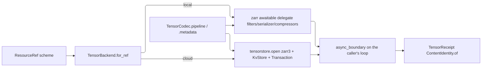
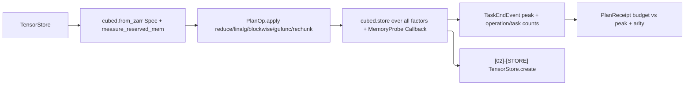

# [PY_DATA_STORE]

One dense chunked N-D array store over one `TensorBackend` engine axis: `TensorStore` owns the `zarr` v3 array — chunk grid, three-slot codec pipeline, orthogonal region write — with `ZARR` the pure-Python sync engine and `TENSORSTORE` the async engine opening the IDENTICAL Zarr v3 chunk grid over a native `KvStore` backend. Out-of-core is not a backend but the `cubed` plan over either store, and the versioned and ragged dimensions live on their own `gridded/virtual` and `gridded/ragged` owners, never as backend tags here.

Its backend is recovered from the store URL scheme through the `runtime/transport/roots#STORE`-owned `StoreBackend` row family — `OBJECT_STORE_SCHEMES` names the remote residence and the row's own `kvstore` column names the native driver the async engine opens under it, so config is a domain value carrying its `create`/`write`/`read` behaviour and this page holds no second scheme roster, driver map, or `engine=` flag set. BOTH engines address a cloud residence: the async one through its kvstore driver, the sync one through `zarr.storage.ObjectStore` over the branch `store_handle` fold, so residence names the preference and reach decides the engine rather than a floor marker on one distribution refusing the whole remote plane. `TensorReceipt` and `PlanReceipt` key by one runtime `ContentIdentity`; the plan receipt carries the `allowed_mem` budget beside the measured peak the `cubed` executor records.

## [01]-[INDEX]

- [02]-[STORE]: the `TensorStore` dense store over the `TensorBackend` axis — create/region-write/read, the `TensorChunking` grid, the `TensorCodec` pipeline, the content-keyed `TensorReceipt`.
- [03]-[PLAN]: the bounded-memory `cubed` plan over the same store — one `PlanOp` dispatch, the `PlanReceipt` budget-vs-peak evidence.

## [02]-[STORE]

- Owner: `TensorStore` — one frozen store; one `create`/`write_region`/`read_region` entrypoint family owns all modalities by the recovered backend and the `Indexing`/arity axes the value carries, never a per-engine reader family and never a per-arm sync portal. Every I/O leg opens its `_TRACER` span — trace parity with the sibling spatial and egress I/O legs, the runtime fence marking a failed leg's span — off the faults-owned `scoped` stamp carrying the version and semconv triple, its `kind` reading residence off `TensorBackend.span_kind(ref)` so an object-store leg publishes the client boundary a distributed trace joins on and a local-path leg stays `INTERNAL` whichever engine serves it.
- Law: `TensorBackend.reached` is the ONE gate `create` crosses and it proves TWO conditions in one read — `_UNREACHED`, the import-time `find_spec` row over `_ENGINE_MODULE`, so an engine the manifest holds below the interpreter floor answers `BoundaryFault(import_=)` naming the absent module instead of raising `ModuleNotFoundError` from a lazy provider import mid-leg; then `_TS_DRIVER`, so a residence the async engine addresses no kvstore driver for answers `BoundaryFault(resource=)` naming the missing driver by scheme instead of raising mid-leg from a spec builder. `for_ref` reads residence for the PREFERENCE and reach for the engine, so an unnamed remote ref lands on whichever engine this floor resolves while a caller-NAMED engine below the floor still refuses by module name — the verbatim-selection law holds exactly where a caller made a selection to honour. `write_region`/`read_region` ride the `self.backend` construction already proved, which is exactly what makes the driver read total below the gate.
- Growth: a new filter is one `_FILTER` row plus one `TensorFilter` case; a new compressor one `_COMPRESSOR` row under the existing `compress` case; a new selection mode one `Indexing` literal plus one `_ZARR_WRITE`/`_ZARR_READ` row; a new engine one `TensorBackend` member plus one delegate row and one `_ENGINE_MODULE` floor row, `span_kind` deriving from residence with no per-engine arm at all; a new cloud backend is one `StoreBackend` row at the runtime owner that `_TS_DRIVER` picks up with zero edits here; a stored-domain resize one `TensorStore.resize` entry over the catalogued `tensorstore` `resize`/`zarr` `Array.resize`; zero new surface.
- Boundary: no compute-package numeric trio (labelled-array compute is `compute`), no production tensor session, no durable product store, and no `xarray` re-derivation of the dense store — `data` emits a portable content-addressed chunked store. `zarr.codecs.numcodecs` is the absorbed live home for the numcodecs-named rows; `numcodecs.zarr3` is the deprecated spelling emitting a `DeprecationWarning`, a rejected import. Deleted forms: an engine selected with no floor gate ahead of its lazy import; a hardcoded `LocalStore` on the sync arm, which wrote a local directory for a cloud residence and left the async distribution as the only remote path; a `span_kind` keyed on the engine, which mislabels a sync-engine cloud leg `INTERNAL`; and a bare `trace.get_tracer(scope)` beside the faults-owned `scoped` stamp.

```python signature
import functools
from collections.abc import Awaitable, Callable, Iterable
from enum import StrEnum
from importlib.util import find_spec
from typing import TYPE_CHECKING, Any, Final, Literal, assert_never

import zarr
import zarr.codecs.numcodecs as nc
from beartype import beartype
from expression import Error, Ok, Result, case, tag, tagged_union
from expression.collections import Map
from msgspec import Struct
from opentelemetry import trace
from opentelemetry.trace import SpanKind
from zarr import codecs as zc

from rasm.runtime.identity import ContentIdentity, ContentKey
from rasm.runtime.faults import FAULT_CONF, BoundaryFault, RuntimeRail, async_boundary, scoped
from rasm.runtime.metrics import Metrics
from rasm.runtime.receipts import Receipt
from rasm.runtime.roots import OBJECT_STORE_SCHEMES, STORE_BACKENDS, ResourceRef, store_handle

if TYPE_CHECKING:
    import numpy as np
    from zarr.abc.codec import ArrayArrayCodec, ArrayBytesCodec, BytesBytesCodec
    from zarr.abc.store import Store


# faults-owned scope stamp: `scoped` binds the version and semconv triple, so no page re-spells the pin.
_TRACER: Final = scoped(trace.get_tracer, "rasm.data.gridded.store")

type Shape = tuple[int, ...]
type ChunkGrid = tuple[int, ...]
type DType = str
type Pipeline = tuple[tuple["ArrayArrayCodec", ...], "ArrayBytesCodec", tuple["BytesBytesCodec", ...]]
type JsonSpec = dict[str, Any]


class TensorChunking(Struct, frozen=True):
    chunks: ChunkGrid
    shards: ChunkGrid | None = None

    @property
    def grid(self) -> ChunkGrid:
        # array-level grid: the outer `shards` when sharding, else `chunks` — tensorstore's `chunk_grid` reads this
        # while the `sharding_indexed` inner `chunk_shape` reads `chunks`.
        return self.shards or self.chunks


type Compressor = Literal["blosc", "zstd", "gzip", "lz4", "lzma", "bz2", "zlib"]

_COMPRESSOR: "Final[Map[Compressor, tuple[Callable[..., BytesBytesCodec], str, tuple[str, ...]]]]" = Map.of_seq([
    ("blosc", (lambda cname, clevel: zc.BloscCodec(cname=cname, clevel=clevel), "blosc", ("cname", "clevel"))),
    ("zstd", (lambda level: zc.ZstdCodec(level=level), "zstd", ("level",))),
    ("gzip", (lambda level: zc.GzipCodec(level=level), "gzip", ("level",))),
    ("lz4", (lambda level: nc.LZ4(level=level), "numcodecs.lz4", ("level",))),
    ("lzma", (lambda preset: nc.LZMA(preset=preset), "numcodecs.lzma", ("preset",))),
    ("bz2", (lambda level: nc.BZ2(level=level), "numcodecs.bz2", ("level",))),
    ("zlib", (lambda level: nc.Zlib(level=level), "numcodecs.zlib", ("level",))),
])


# serializer slot is the compressor-presence axis ONLY. Sharding is NOT a serializer case: `TensorChunking.shards` is
# its sole owner, and the native `create_array(shards=)` wrap keeps the whole inner pipeline, so a sharded store never drops
# its compressor/filter choice to a hardcoded `ShardingCodec`.
@tagged_union(frozen=True)
class Serializer:
    tag: Literal["compress", "raw"] = tag()
    compress: "tuple[Compressor, tuple[Any, ...]]" = case()
    raw: None = case()

    def slot(self, pre: "tuple[ArrayArrayCodec, ...]") -> Pipeline:
        match self:
            case Serializer(tag="compress"):
                name, args = self.compress
                build, _, _ = _COMPRESSOR[name]
                return (pre, zc.BytesCodec(), (build(*args),))
            case Serializer(tag="raw"):
                return (pre, zc.BytesCodec(), ())
            case unreachable:
                assert_never(unreachable)

    def slot_json(self, pre: list[JsonSpec]) -> list[JsonSpec]:
        match self:
            case Serializer(tag="compress"):
                name, args = self.compress
                _, codec_name, keys = _COMPRESSOR[name]
                return [*pre, {"name": "bytes"}, {"name": codec_name, "configuration": dict(zip(keys, args, strict=True))}]
            case Serializer(tag="raw"):
                return [*pre, {"name": "bytes"}]
            case unreachable:
                assert_never(unreachable)

    @property
    def name(self) -> str:
        return self.compress[0] if self.tag == "compress" else self.tag


class TensorCodec(Struct, frozen=True):
    serializer: Serializer = Serializer(raw=None)
    filters: "tuple[TensorFilter, ...]" = ()

    def pipeline(self) -> Pipeline:
        return self.serializer.slot(tuple(f.codec() for f in self.filters))

    def metadata(self, chunking: "TensorChunking") -> list[JsonSpec]:
        # tensorstore carries no native `shards=`, so the `sharding_indexed` wrap is explicit here.
        inner = self.serializer.slot_json([f.json() for f in self.filters])
        return [{"name": "sharding_indexed", "configuration": {"chunk_shape": list(chunking.chunks), "codecs": inner}}] if chunking.shards else inner

    @property
    def name(self) -> str:
        return self.serializer.name


type Filter = Literal["transpose", "scale_offset", "delta", "fixed_scale_offset", "quantize", "bitround", "packbits"]

# `zc.ScaleOffset` is keyword-only `(*, offset=0, scale=1)` — the `dtype`/`astype` slots belong to `nc.FixedScaleOffset` alone.
_FILTER: "Final[Map[Filter, tuple[Callable[..., ArrayArrayCodec], str, tuple[str, ...]]]]" = Map.of_seq([
    ("transpose", (lambda order: zc.TransposeCodec(order=order), "transpose", ("order",))),
    ("scale_offset", (lambda scale, offset: zc.ScaleOffset(offset=offset, scale=scale), "scaleoffset", ("scale", "offset"))),
    ("delta", (lambda dtype: nc.Delta(dtype=dtype), "numcodecs.delta", ("dtype",))),
    (
        "fixed_scale_offset",
        (lambda scale, offset, dtype: nc.FixedScaleOffset(scale=scale, offset=offset, dtype=dtype), "numcodecs.fixedscaleoffset", ("scale", "offset", "dtype")),
    ),
    ("quantize", (lambda digits, dtype: nc.Quantize(digits=digits, dtype=dtype), "numcodecs.quantize", ("digits", "dtype"))),
    ("bitround", (lambda keepbits: nc.BitRound(keepbits=keepbits), "numcodecs.bitround", ("keepbits",))),
    ("packbits", (lambda: nc.PackBits(), "numcodecs.packbits", ())),
])


@tagged_union(frozen=True)
class TensorFilter:
    tag: Filter = tag()
    transpose: ChunkGrid = case()
    scale_offset: tuple[float, float] = case()
    delta: DType = case()
    fixed_scale_offset: tuple[float, float, DType] = case()
    quantize: tuple[int, DType] = case()
    bitround: int = case()
    packbits: None = case()

    def _args(self) -> tuple[Any, ...]:
        match self:
            case TensorFilter(tag="transpose"):
                return (list(self.transpose),)
            case TensorFilter(tag="scale_offset"):
                return self.scale_offset
            case TensorFilter(tag="delta"):
                return (self.delta,)
            case TensorFilter(tag="fixed_scale_offset"):
                return self.fixed_scale_offset
            case TensorFilter(tag="quantize"):
                return self.quantize
            case TensorFilter(tag="bitround"):
                return (self.bitround,)
            case TensorFilter(tag="packbits"):
                return ()
            case unreachable:
                assert_never(unreachable)

    def codec(self) -> "ArrayArrayCodec":
        build, _, _ = _FILTER[self.tag]
        return build(*self._args())

    def json(self) -> JsonSpec:
        _, name, keys = _FILTER[self.tag]
        return {"name": name, "configuration": dict(zip(keys, self._args(), strict=True))} if keys else {"name": name}


type Indexing = Literal["orthogonal", "vectorized"]


class TensorRegion(Struct, frozen=True):
    bounds: tuple[tuple[int, int], ...]
    indexing: Indexing = "orthogonal"

    def selection(self) -> tuple[slice, ...]:
        return tuple(slice(lo, hi) for lo, hi in self.bounds)


type Write = "tuple[TensorRegion, np.ndarray]"


class TensorBackend(StrEnum):
    ZARR = "zarr"
    TENSORSTORE = "tensorstore"

    @staticmethod
    def for_ref(ref: ResourceRef) -> "TensorBackend":
        # residence names the PREFERENCE, reach decides the engine: an object-store ref prefers the async engine and
        # falls to the sync one when that distribution sits below the interpreter floor, because BOTH engines now
        # address a cloud residence — the sync arm through `zarr.storage.ObjectStore` over the branch `store_handle`.
        # Deriving the engine from residence ALONE tied every remote dense tensor to one distribution, so a manifest
        # marker holding `tensorstore` refused the whole object-store plane while the reachable path sat unmined. A
        # caller naming its engine still rides through verbatim — this derivation answers only an unnamed one.
        remote = ref.scheme in OBJECT_STORE_SCHEMES
        preferred = TensorBackend.TENSORSTORE if remote else TensorBackend.ZARR
        return TensorBackend.ZARR if remote and _UNREACHED.try_find(preferred).is_some() else preferred

    def reached(self, subject: str, ref: ResourceRef) -> "RuntimeRail[TensorBackend]":
        # ONE gate, two proofs, both refusing BY NAME before any provider import or spec build. Floor first: a
        # manifest marker holding a provider below the running floor leaves its module unresolvable, so the selected
        # engine answers `BoundaryFault(import_=)` naming the absent module at `create` rather than raising
        # `ModuleNotFoundError` from a lazy import deep inside an open leg. Driver second, on the async engine alone:
        # the residence must resolve a kvstore driver, so an admitted-but-unaddressable scheme answers
        # `BoundaryFault(resource=)` naming it instead of a `ValueError` raised mid-leg out of the spec builder.
        # a refusal here stays honest for a NAMED engine — a caller selecting the async arm below the floor reads its
        # absent module rather than a silent swap onto the sync one, the verbatim-selection law — while `for_ref`
        # already routed an UNNAMED remote ref onto whichever engine this floor resolves.
        return _UNREACHED.try_find(self).map(lambda module: Error(BoundaryFault(import_=(subject, module)))).default_value(self._driven(subject, ref))

    def _driven(self, subject: str, ref: ResourceRef) -> "RuntimeRail[TensorBackend]":
        # the sync engine addresses its residence through an `obstore` handle rather than a kvstore driver, so the
        # driver proof binds the async arm alone.
        return Ok(self) if self is TensorBackend.ZARR else _driver(ref, subject).map(lambda _name: self)

    @staticmethod
    def span_kind(ref: ResourceRef) -> SpanKind:
        # the client boundary follows RESIDENCE, never the engine — the store span-kind law — so a remote leg
        # publishes CLIENT and a local leg stays INTERNAL whichever engine serves it, and a distributed trace joins
        # this hop against the egress legs beside it instead of losing an outbound call inside one process-local
        # span. Keying it on the engine mislabelled every sync-engine cloud leg INTERNAL the moment the sync arm
        # gained one.
        return SpanKind.CLIENT if ref.scheme in OBJECT_STORE_SCHEMES else SpanKind.INTERNAL

    @property
    def create(self) -> "Callable[[ResourceRef, Shape, DType, TensorChunking, TensorCodec], Awaitable[None]]":
        return _CREATE[self]

    @property
    def write(self) -> "Callable[[ResourceRef, TensorRegion, np.ndarray], Awaitable[int]]":
        return _WRITE[self]

    @property
    def write_many(self) -> "Callable[[ResourceRef, tuple[Write, ...]], Awaitable[int]]":
        return _WRITE_MANY[self]

    @property
    def read(self) -> "Callable[[ResourceRef, TensorRegion], Awaitable[np.ndarray]]":
        return _READ[self]


class TensorReceipt(Struct, frozen=True):
    backend: TensorBackend
    shape: Shape
    chunks: ChunkGrid
    dtype: DType
    codec: str
    filters: tuple[str, ...]
    bytes_stored: int
    content_key: ContentKey
    shards: ChunkGrid | None = None

    def contribute(self) -> Iterable[Receipt]:
        # `domain`/`kind`/`key` are the lifted evidence contract the `tabular/lakehouse#LAKEHOUSE` residence reads —
        # the SAME pair handed `Metrics.record` beside the identity this store minted — so the durable row lands in
        # the `tensor` partition a predicate prunes and rejoins the live series its twin emitted. A contributor
        # omitting them writes every row it ever produces into one nameless partition.
        Metrics.record({"rasm.tensor.byte_volume": float(self.bytes_stored)}, domain="tensor", kind=self.backend.value)
        return (
            Receipt.of(
                "tensor",
                (
                    "emitted",
                    self.backend.value,
                    {
                        "domain": "tensor",
                        "kind": self.backend.value,
                        "key": self.content_key.hex,
                        "shape": "x".join(map(str, self.shape)),
                        "codec": self.codec,
                        "filters": ",".join(self.filters),
                        "stored": self.bytes_stored,
                        **({"shards": "x".join(map(str, self.shards))} if self.shards else {}),
                    },
                ),
            ),
        )


class TensorStore(Struct, frozen=True):
    backend: TensorBackend
    ref: ResourceRef
    shape: Shape
    chunking: TensorChunking
    dtype: DType
    codec: TensorCodec

    @classmethod
    @beartype(conf=FAULT_CONF)
    async def create(
        cls, ref: ResourceRef, shape: Shape, dtype: DType, chunking: TensorChunking, codec: TensorCodec = TensorCodec()
    ) -> "RuntimeRail[TensorStore]":
        # async on the caller's loop — a per-call `anyio.run` mints a fresh loop and refuses to start inside a running one.
        backend = TensorBackend.for_ref(ref)

        async def _open() -> TensorStore:
            await backend.create(ref, shape, dtype, chunking, codec)
            return TensorStore(backend, ref, shape, chunking, dtype, codec)

        # object-store tensor I/O carries a span per leg — the trace-parity law with the sibling spatial/egress I/O legs;
        # the fence inside marks the span ERROR + record_exception on a failed leg. Reach gates inside the span so an
        # unreachable engine is a recorded refusal, and `create` is the one gate — `write_region`/`read_region` reuse
        # whatever `self.backend` this construction already proved.
        with _TRACER.start_as_current_span("tensor.create", kind=TensorBackend.span_kind(ref), attributes={"rasm.tensor.backend": backend.value}):
            match backend.reached("tensor.create", ref):
                case Result(tag="error", error=refused):
                    return Error(refused)
                case Result(tag="ok"):
                    return await async_boundary("tensor.create", _open)
                case unreachable:
                    assert_never(unreachable)

    async def write_region(self, writes: "Write | Iterable[Write]") -> "RuntimeRail[TensorReceipt]":
        # `(TensorRegion(), _)` keeps a lone pair whole before the `Iterable` arm can shatter it; an empty snapshot
        # is a typed `Error`, never a `writes[0]` `IndexError` escaping the rail.
        match writes:
            case (TensorRegion(), _) as lone:
                staged: tuple[Write, ...] = (lone,)
            case Iterable() as many:
                staged = tuple(many)
            case _ as unreachable:
                assert_never(unreachable)
        if not staged:
            return Error(BoundaryFault(config=("tensor.write_region", "empty-writes")))

        async def _write() -> int:
            head = staged[0]
            return await self.backend.write(self.ref, *head) if len(staged) == 1 else await self.backend.write_many(self.ref, staged)

        # content key folds the `stream` modality over every written region in write order, so a plural snapshot never
        # collapses onto the last block; the atomic-vs-sequential disposition is the normalized count, never a flag.
        with _TRACER.start_as_current_span(
            "tensor.write_region",
            kind=TensorBackend.span_kind(self.ref),
            attributes={"rasm.tensor.backend": self.backend.value, "rasm.tensor.regions": len(staged)},
        ):
            return (await async_boundary("tensor.write_region", _write)).bind(
                lambda stored: ContentIdentity.of("tensor", tuple(block.tobytes() for _, block in staged)).map(
                    lambda key: _receipt(self, stored, key)
                )
            )

    async def read_region(self, region: TensorRegion) -> "RuntimeRail[np.ndarray]":
        with _TRACER.start_as_current_span(
            "tensor.read_region", kind=TensorBackend.span_kind(self.ref), attributes={"rasm.tensor.backend": self.backend.value}
        ):
            return await async_boundary("tensor.read_region", lambda: self.backend.read(self.ref, region))


# module each engine imports, and the floor probe over it: `pyproject.toml` gates `tensorstore` behind
# `python_version<'3.15'`, so the distribution resolves on no supported floor and every TENSORSTORE selection
# refuses typed at `create`. The row derives ONCE at import through `find_spec`, never a probe per call.
_ENGINE_MODULE: "Final[Map[TensorBackend, str]]" = Map.of_seq([(TensorBackend.ZARR, "zarr"), (TensorBackend.TENSORSTORE, "tensorstore")])

_UNREACHED: "Final[Map[TensorBackend, str]]" = Map.of_seq(
    (engine, module) for engine, module in _ENGINE_MODULE.items() if find_spec(module) is None
)

_ZARR_WRITE: "Final[Map[Indexing, str]]" = Map.of_seq([("orthogonal", "set_orthogonal_selection"), ("vectorized", "set_coordinate_selection")])
_ZARR_READ: "Final[Map[Indexing, str]]" = Map.of_seq([("orthogonal", "get_orthogonal_selection"), ("vectorized", "get_coordinate_selection")])


def _zarr_store(ref: ResourceRef, *, read_only: bool = False) -> "Store":
    # residence-polymorphic store for the SYNC engine, root-scoped so the node name is `ref.relative` on BOTH arms.
    # `zarr.storage.ObjectStore` wraps the very `obstore` handle the branch `store_handle` fold builds, so a cloud
    # residence reaches this engine under the same retry envelope and credential provider every other remote read in
    # the branch carries — never a second construction spelling. A hardcoded `LocalStore` here made the async engine
    # the ONLY cloud arm, so the interpreter-floor marker holding `tensorstore` took the whole object-store dense
    # plane down with it. `zarr.storage.ObjectStore` is marked experimental upstream, so its churn rides this ONE
    # construction rather than four call sites. The credential rides the ref's own column, so a private or
    # requester-pays residence authenticates off the coordinate it arrived on and this page grows no second field.
    return (
        zarr.storage.ObjectStore(store_handle(ref), read_only=read_only)
        if ref.scheme in OBJECT_STORE_SCHEMES
        else zarr.storage.LocalStore(ref.root)
    )


async def _zarr_create(ref: ResourceRef, shape: Shape, dtype: DType, chunking: TensorChunking, codec: TensorCodec) -> None:
    # `create_array` names the node `name=` where `open_array` names it `path=` — two spellings of one coordinate,
    # so the store stays root-scoped and each call spells the keyword its own member takes.
    filters, serializer, compressors = codec.pipeline()
    zarr.create_array(
        store=_zarr_store(ref),
        name=ref.relative,
        shape=shape,
        dtype=dtype,
        chunks=chunking.chunks,
        shards=chunking.shards,
        filters=filters,
        serializer=serializer,
        compressors=compressors,
        overwrite=True,
    )


async def _zarr_write(ref: ResourceRef, region: TensorRegion, data: "np.ndarray") -> int:
    arr = zarr.open_array(store=_zarr_store(ref), path=ref.relative, mode="r+")
    getattr(arr, _ZARR_WRITE[region.indexing])(region.selection(), data)
    return int(data.nbytes)


async def _zarr_read(ref: ResourceRef, region: TensorRegion) -> "np.ndarray":
    arr = zarr.open_array(store=_zarr_store(ref, read_only=True), path=ref.relative, mode="r")
    return getattr(arr, _ZARR_READ[region.indexing])(region.selection())


async def _zarr_write_many(ref: ResourceRef, regions: "tuple[Write, ...]") -> int:
    arr = zarr.open_array(store=_zarr_store(ref), path=ref.relative, mode="r+")
    for region, data in regions:
        getattr(arr, _ZARR_WRITE[region.indexing])(region.selection(), data)
    return sum(int(data.nbytes) for _, data in regions)


# scheme -> kvstore driver, DERIVED off the runtime row family's own `kvstore` column: a backend whose column is
# `None` filters itself out, so the Azure hole is one absent key the gate names rather than a comment beside a
# two-row hand map, and the deleted forms are that map, the `raise ValueError` it guarded, and the hardcoded `"file"`
# tail that wrote a local kvstore for every http and memory residence the driver roster actually serves.
_TS_DRIVER: "Final[Map[str, str]]" = Map.of_seq(
    (alias, row.kvstore) for row in STORE_BACKENDS if row.kvstore is not None for alias in row.aliases
)


def _driver(ref: ResourceRef, subject: str) -> "RuntimeRail[str]":
    return _TS_DRIVER.try_find(ref.scheme).to_result_with(lambda: BoundaryFault(resource=(subject, f"tensorstore.kvstore.{ref.scheme}")))


def _ts_kvstore(ref: ResourceRef) -> JsonSpec:
    # total below the gate: `reached` proved this scheme's driver at `create`, so the read carries a `str` and no
    # arm re-derives absence the gate already refused by name.
    return {"driver": _TS_DRIVER[ref.scheme], "path": str(ref.path)}


def _ts_spec(
    ref: ResourceRef, *, codec: TensorCodec | None = None, shape: Shape = (), chunking: TensorChunking | None = None, dtype: DType = ""
) -> JsonSpec:
    # CAPABILITY ASYMMETRY: the tensorstore zarr3 `metadata.codecs` chain admits transpose/bytes/sharding_indexed/gzip/
    # blosc/zstd/crc32c; the `numcodecs.<id>`-named rows and `scaleoffset` are `zarr`-engine-only, so a TENSORSTORE store
    # selecting one is the typed engine-capability reject, never a silent both-engine claim.
    metadata: JsonSpec = (
        {}
        if codec is None or chunking is None
        else {
            "shape": list(shape),
            "data_type": dtype,
            "chunk_grid": {"name": "regular", "configuration": {"chunk_shape": list(chunking.grid)}},
            "codecs": codec.metadata(chunking),
        }
    )
    return {"driver": "zarr3", "kvstore": _ts_kvstore(ref), **({"metadata": metadata} if metadata else {})}


@functools.cache
def _ts_context() -> "Any":
    import tensorstore as ts  # ruff:ignore[import-outside-top-level]

    return ts.Context()


async def _ts_open(spec: JsonSpec, *, create: bool) -> "Any":
    import tensorstore as ts  # ruff:ignore[import-outside-top-level]

    return await ts.open(spec, create=create, delete_existing=create, context=_ts_context())


async def _ts_create(ref: ResourceRef, shape: Shape, dtype: DType, chunking: TensorChunking, codec: TensorCodec) -> None:
    await _ts_open(_ts_spec(ref, codec=codec, shape=shape, chunking=chunking, dtype=dtype), create=True)


def _ts_view(store: "Any", region: TensorRegion) -> "Any":
    return (store.vindex if region.indexing == "vectorized" else store.oindex)[region.selection()]


async def _ts_write(ref: ResourceRef, region: TensorRegion, data: "np.ndarray") -> int:
    store = await _ts_open(_ts_spec(ref), create=False)
    await _ts_view(store, region).write(data).commit
    return int(data.nbytes)


async def _ts_write_atomic(ref: ResourceRef, regions: "tuple[Write, ...]") -> int:
    import tensorstore as ts  # ruff:ignore[import-outside-top-level]

    txn = ts.Transaction(atomic=True)
    store = await ts.open(_ts_spec(ref), create=False, context=_ts_context(), transaction=txn)
    for region, data in regions:
        await _ts_view(store, region).write(data).commit
    await txn.commit_async()
    return sum(int(data.nbytes) for _, data in regions)


async def _ts_read(ref: ResourceRef, region: TensorRegion) -> "np.ndarray":
    store = await _ts_open(_ts_spec(ref), create=False)
    return await _ts_view(store, region).read()


_CREATE: "Final[Map[TensorBackend, Callable[[ResourceRef, Shape, DType, TensorChunking, TensorCodec], Awaitable[None]]]]" = Map.of_seq([
    (TensorBackend.ZARR, _zarr_create),
    (TensorBackend.TENSORSTORE, _ts_create),
])
_WRITE: "Final[Map[TensorBackend, Callable[[ResourceRef, TensorRegion, np.ndarray], Awaitable[int]]]]" = Map.of_seq([
    (TensorBackend.ZARR, _zarr_write),
    (TensorBackend.TENSORSTORE, _ts_write),
])
_WRITE_MANY: "Final[Map[TensorBackend, Callable[[ResourceRef, tuple[Write, ...]], Awaitable[int]]]]" = Map.of_seq([
    (TensorBackend.ZARR, _zarr_write_many),
    (TensorBackend.TENSORSTORE, _ts_write_atomic),
])
_READ: "Final[Map[TensorBackend, Callable[[ResourceRef, TensorRegion], Awaitable[np.ndarray]]]]" = Map.of_seq([
    (TensorBackend.ZARR, _zarr_read),
    (TensorBackend.TENSORSTORE, _ts_read),
])


def _receipt(store: TensorStore, bytes_stored: int, key: ContentKey) -> TensorReceipt:
    return TensorReceipt(
        backend=store.backend,
        shape=store.shape,
        chunks=store.chunking.chunks,
        dtype=store.dtype,
        codec=store.codec.name,
        filters=tuple(f.tag for f in store.codec.filters),
        bytes_stored=bytes_stored,
        content_key=key,
        shards=store.chunking.shards,
    )
```


```mermaid
---
config:
  layout: elk
  flowchart:
    curve: linear
    padding: 25
---
flowchart LR
    accTitle: Tensor store engine flow
    accDescr: ResourceRef scheme recovery into the backend delegates, codec pipeline lowering, the async rail, and the content-keyed receipt.
    Ref["ResourceRef scheme"] --> Backend["TensorBackend.for_ref"]
    Backend -->|local| Zarr["zarr awaitable delegate filters/serializer/compressors"]
    Backend -->|cloud| TS["tensorstore.open zarr3 + KvStore + Transaction"]
    Codec["TensorCodec.pipeline / .metadata"] --> Zarr
    Codec --> TS
    Zarr --> Rail["async_boundary on the caller's loop"]
    TS --> Rail
    Rail --> Receipt["TensorReceipt ContentIdentity.of"]
```

## [03]-[PLAN]

- Owner: the bounded-memory `cubed` plan over the same `TensorStore` module — the out-of-core dimension of the store, not a fifth backend tag; one owner module carries the dense store and its plan, never a parallel `CubedStore` class.
- Cases: the `linalg` arm's factor tuple persists whole at materialization, so a `svd`/`qr` never drops a factor.
- Receipt: the plan emits no receipt while lazy — it builds a graph; materialization folds one `PlanReceipt` as budget-vs-peak evidence, and the materialized store re-enters through `[02]-[STORE]` as a fresh content-keyed `TensorReceipt`. The materialize span carries the whole flat receipt as attributes through the `to_builtins` projection — one lowering serving wire and span alike.
- Growth: a new reduction is one `Reduction` literal the Array API namespace answers; a new factorization one `_LINALG` row; a new executor one `Executor` literal; a new execution dimension (`executor_options`, `zarr_compressor`) is one `PlanBudget` field with `plan`'s signature untouched; a new measured fact is one field off the `Callback` lifecycle; zero new surface and never a `cubed` backend tag on `TensorBackend`.
- Boundary: `data` emits a bounded-memory plan plus its typed peak-memory receipt, never a runtime compute graph, and a consumer selects its own substrate off that receipt.

```python signature
from collections.abc import Callable, Iterable
from typing import TYPE_CHECKING, Final, Literal, assert_never

import cubed
from beartype import beartype
from cubed.array_api import linalg as cla
from expression import case, tag, tagged_union
from expression.collections import Map
from msgspec import Struct, to_builtins

from rasm.runtime.faults import FAULT_CONF, RuntimeRail, boundary
from rasm.runtime.receipts import Receipt

if TYPE_CHECKING:
    import numpy as np

    from rasm.runtime.roots import ResourceRef

# `ChunkGrid`/`DType`/`TensorStore` are the [02]-[STORE] owners in this same module.

type Op = Literal["reduce", "linalg", "blockwise", "gufunc", "rechunk"]
type Executor = Literal["single-threaded", "threads", "processes", "dask", "lithops", "modal", "coiled", "ray", "spark"]
type Reduction = Literal["nanmean", "sum", "mean", "nansum", "std", "var", "prod", "max", "min"]
type Factorization = Literal["matmul", "svd", "qr", "svdvals", "tensordot", "outer", "vecdot", "matrix_transpose"]


class PlanBudget(Struct, frozen=True):
    # one execution policy `plan` folds into `cubed.Spec`, never three loose scalars the body re-derives;
    # `reserved_mem=None` is the genuine "calibrate via `measure_reserved_mem`" value, distinct from a budget int.
    allowed_mem: str = "2GB"
    reserved_mem: str | None = None
    executor: Executor = "single-threaded"


DEFAULT_BUDGET: Final[PlanBudget] = PlanBudget()

# NaN-aware reductions live at `cubed.<name>` top-level, not the Array-API standard namespace, so the `reduce` arm
# resolves these off the `cubed` module and the rest off `__array_namespace__()`.
_NAN_REDUCTIONS: Final[frozenset[Reduction]] = frozenset({"nanmean", "nansum"})

_LINALG: "Final[Map[Factorization, Callable[..., cubed.Array | tuple[cubed.Array, ...]]]]" = Map.of_seq([
    ("matmul", cla.matmul),
    ("svd", cla.svd),
    ("qr", cla.qr),
    ("svdvals", cla.svdvals),
    ("tensordot", cla.tensordot),
    ("outer", cla.outer),
    ("vecdot", cla.vecdot),
    ("matrix_transpose", cla.matrix_transpose),
])


@tagged_union(frozen=True)
class PlanOp:
    tag: Op = tag()
    reduce: "tuple[Reduction, int | tuple[int, ...] | None, bool]" = case()
    linalg: "tuple[Factorization, cubed.Array | int | tuple[int, ...] | None]" = case()
    blockwise: "tuple[Callable[..., np.ndarray], DType, int | None, int | None]" = case()
    gufunc: "tuple[Callable[..., np.ndarray], str, tuple[DType, ...], bool, bool]" = case()
    rechunk: "tuple[ChunkGrid, str | None]" = case()

    def apply(self, plan: "cubed.Array") -> "cubed.Array | tuple[cubed.Array, ...]":
        match self:
            case PlanOp(tag="reduce"):
                op, axis, keepdims = self.reduce
                source = cubed if op in _NAN_REDUCTIONS else plan.__array_namespace__()
                return getattr(source, op)(plan, axis=axis, keepdims=keepdims)
            case PlanOp(tag="linalg"):
                op, operand = self.linalg
                return _LINALG[op](plan, operand) if operand is not None else _LINALG[op](plan)
            case PlanOp(tag="blockwise"):
                func, dtype, drop_axis, new_axis = self.blockwise
                return cubed.map_blocks(func, plan, dtype=dtype, drop_axis=drop_axis, new_axis=new_axis)
            case PlanOp(tag="gufunc"):
                func, signature, output_dtypes, vectorize, allow_rechunk = self.gufunc
                return cubed.apply_gufunc(func, signature, plan, output_dtypes=output_dtypes, vectorize=vectorize, allow_rechunk=allow_rechunk)
            case PlanOp(tag="rechunk"):
                chunks, min_mem = self.rechunk
                return cubed.rechunk(plan, chunks, min_mem=min_mem)
            case unreachable:
                assert_never(unreachable)


class MemoryProbe(cubed.Callback):
    def __init__(self) -> None:
        super().__init__()
        self.peak_mem = 0
        self.tasks = 0
        self.operations = 0

    def on_operation_start(self, event: "cubed.OperationStartEvent") -> None:
        self.operations += 1

    def on_task_end(self, event: "cubed.TaskEndEvent") -> None:
        self.peak_mem = max(self.peak_mem, int(event.peak_measured_mem_end or 0))
        self.tasks += 1


class PlanReceipt(Struct, frozen=True):
    op: Op
    executor: Executor
    allowed_mem: int
    reserved_mem: int
    npartitions: int
    arity: int
    operations: int
    tasks: int
    peak_mem: int
    target: str

    def contribute(self) -> Iterable[Receipt]:
        # the plan shares the `tensor` partition with the store it plans over and keys its row by the op that ran,
        # so budget-versus-peak history prunes on the same predicate. It contributes NO `key` and records NO measure:
        # a lazy graph mints no content identity, and a null key would land at the residence as the literal `"None"`
        # while a fabricated instrument would meter a byte volume no leg moved.
        return (
            Receipt.of(
                "tensor",
                (
                    "planned",
                    self.op,
                    {
                        "domain": "tensor",
                        "kind": self.op,
                        "executor": self.executor,
                        "allowed_mem": self.allowed_mem,
                        "reserved_mem": self.reserved_mem,
                        "peak_mem": self.peak_mem,
                        "npartitions": self.npartitions,
                        "arity": self.arity,
                        "operations": self.operations,
                        "tasks": self.tasks,
                    },
                ),
            ),
        )


@beartype(conf=FAULT_CONF)
def plan(store: "TensorStore", work_dir: "ResourceRef", *, budget: PlanBudget = DEFAULT_BUDGET) -> "RuntimeRail[cubed.Array]":
    def _open() -> "cubed.Array":
        reserved = cubed.measure_reserved_mem(budget.executor) if budget.reserved_mem is None else budget.reserved_mem
        spec = cubed.Spec(str(work_dir.path), allowed_mem=budget.allowed_mem, reserved_mem=reserved, executor_name=budget.executor)
        return cubed.from_zarr(str(store.ref.path), spec=spec)

    return boundary("tensor.plan", _open)


def materialize(graph: "cubed.Array", op: PlanOp, target: "ResourceRef") -> "RuntimeRail[PlanReceipt]":
    def _run() -> PlanReceipt:
        result = op.apply(graph)
        outputs = result if isinstance(result, tuple) else (result,)
        spec = outputs[0].spec
        probe = MemoryProbe()
        targets = [f"{target.path}/{op.tag}.{index}" for index in range(len(outputs))]
        cubed.store(list(outputs), targets, callbacks=[probe])
        receipt = PlanReceipt(
            op=op.tag,
            executor=spec.executor_name,
            allowed_mem=int(spec.allowed_mem),
            reserved_mem=int(spec.reserved_mem),
            npartitions=sum(int(array.npartitions) for array in outputs),
            arity=len(outputs),
            operations=probe.operations,
            tasks=probe.tasks,
            peak_mem=probe.peak_mem,
            target=str(target.path),
        )
        # PlanReceipt is flat int/str, so the msgspec lowering IS the span-attribute mapping — budget-vs-peak
        # evidence lands on the span with zero manual flattening, the catalog struct-to-attributes projection.
        trace.get_current_span().set_attributes(to_builtins(receipt, str_keys=True))
        return receipt

    with _TRACER.start_as_current_span(f"tensor.materialize.{op.tag}"):
        return boundary("tensor.materialize", _run)
```


```mermaid
---
config:
  layout: elk
  flowchart:
    curve: linear
    padding: 25
---
flowchart LR
    accTitle: Bounded-memory plan flow
    accDescr: The dense store lifted into a cubed plan, the PlanOp dispatch, materialization under the memory probe, and the budget-versus-peak receipt.
    Store["TensorStore"] --> From["cubed.from_zarr Spec + measure_reserved_mem"]
    From --> Op["PlanOp.apply reduce/linalg/blockwise/gufunc/rechunk"]
    Op --> Mat["cubed.store over all factors + MemoryProbe Callback"]
    Mat --> Peak["TaskEndEvent peak + operation/task counts"]
    Peak --> Receipt["PlanReceipt budget vs peak + arity"]
    Mat --> Restore["[02]-[STORE] TensorStore.create"]
```

## [04]-[RESEARCH]

<!-- source-only: research row template:
[TOKEN]-[OPEN|BLOCKED]: <exact question>; <verification route>.
-->

(none)
