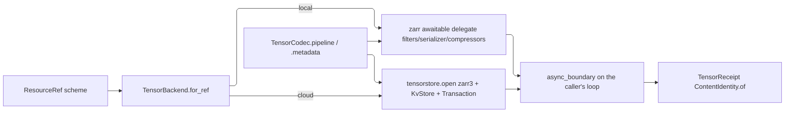
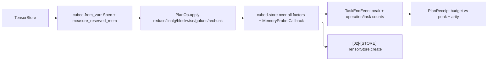

# [PY_DATA_STORE]

One dense chunked N-D array store over one `TensorBackend` engine axis: `TensorStore` owns the `zarr` v3 array — chunk grid, three-slot codec pipeline, orthogonal region write — with `ZARR` the pure-Python sync engine and `TENSORSTORE` the async engine opening the IDENTICAL Zarr v3 chunk grid over a native `KvStore` backend. Out-of-core is not a backend but the `cubed` plan over either store, and the versioned and ragged dimensions live on their own `gridded/virtual` and `gridded/ragged` owners, never as backend tags here.

Its backend is recovered from the store URL scheme through the `runtime/transport/roots#STORE`-owned `StoreBackend` row family — `OBJECT_STORE_SCHEMES` names the remote residence and the row's own `kvstore` column names the native driver the async engine opens under it, so config is a domain value carrying its `create`/`write`/`read` behaviour and this page holds no second scheme roster, driver map, or `engine=` flag set. BOTH engines address a cloud residence: the async one through its kvstore driver, the sync one through `zarr.storage.ObjectStore` over the branch `store_handle` fold, so residence names the preference and reach decides the engine rather than a floor marker on one distribution refusing the whole remote plane. `TensorReceipt` and `PlanReceipt` key by one runtime `ContentIdentity`; the plan receipt carries the `allowed_mem` budget beside the peak its executor measured, absent where the executor measured none.

## [01]-[INDEX]

- [02]-[STORE]: the `TensorStore` dense store over the `TensorBackend` axis — create/region-write/read, the `TensorChunking` grid, the `TensorCodec` pipeline, the content-keyed `TensorReceipt`.
- [03]-[PLAN]: the bounded-memory `cubed` plan over the same store — one `PlanOp` dispatch, the `PlanReceipt` budget-vs-peak evidence.

## [02]-[STORE]

- Owner: `TensorStore` — one frozen store; one `create`/`write_region`/`read_region` entrypoint family owns all modalities by the recovered backend and the `Indexing`/arity axes the value carries, never a per-engine reader family and never a per-arm sync portal. Every I/O leg opens its `_TRACER` span — trace parity with the sibling spatial and egress I/O legs, the runtime fence marking a failed leg's span — off the faults-owned `scoped` stamp carrying the version and semconv triple, its `kind` reading residence off `TensorBackend.span_kind(ref)` so an object-store leg publishes the client boundary a distributed trace joins on and a local-path leg stays `INTERNAL` whichever engine serves it.
- Law: `TensorBackend.reached` is the ONE gate `create` crosses and it proves TWO conditions in one read — `_UNREACHED`, the import-time `find_spec` row over `_ENGINE_MODULE`, so an engine the manifest holds below the interpreter floor answers `TENSOR_FLOOR` naming the absent module instead of raising `ModuleNotFoundError` from a lazy provider import mid-leg; then `_TS_DRIVER`, so a residence the async engine addresses no kvstore driver for answers `TENSOR_DRIVER` naming the missing driver by scheme instead of raising mid-leg from a spec builder. Both rows carry their own subject, so the `subject: str` the gate once threaded across three hops deletes. `for_ref` reads residence for the PREFERENCE and reach for the engine, so an unnamed remote ref lands on whichever engine this floor resolves while a caller-NAMED engine below the floor still refuses by module name — the verbatim-selection law holds exactly where a caller made a selection to honour. `write_region`/`read_region` ride the `self.backend` construction already proved, which is exactly what makes the driver read total below the gate.
- Law: `write_region` crosses the owner's `ResourceGuard` before any region lands — one guard per opened store, composition-bound — so two same-process apps racing one array refuse typed at the guard as `concurrent-write` instead of interleaving regions mid-snapshot; the guard spans the whole staged write, nothing queues behind it, and cross-process coordination stays the chunk grid's own per-chunk atomicity, which the guard never substitutes for.
- Law: both mutation legs land durable evidence on the `python:runtime/observability/journal#LEDGER` plane and the read leg lands none — an operational `AuditFact` carrying the coordinate that leg moved, plus a `STORAGE` `MeterFact` where bytes landed, so arming records without metering and a region write records both. Both legs are already awaitable, which is what makes them the seat under the runtime producer-seam law; the facts mint off the settled outcome so none names a write the store refused, and the record rail binds into each verdict. The receipt fan keeps the series and the journal keeps the fact — neither re-mints the other's number.
- Growth: a new filter is one `_FILTER` row plus one `TensorFilter` case; a new compressor, digest, or byte reordering is one `_BYTES` row and its `BytesStage` case, reachable at any position of any tail with no other edit; a new selection mode one `Indexing` literal plus one `_ZARR_WRITE`/`_ZARR_READ` row; a new engine one `TensorBackend` member plus one delegate row and one `_ENGINE_MODULE` floor row, `span_kind` deriving from residence with no per-engine arm at all; a new cloud backend is one `StoreBackend` row at the runtime owner that `_TS_DRIVER` picks up with zero edits here; a stored-domain resize one `TensorStore.resize` entry over the catalogued `tensorstore` `resize`/`zarr` `Array.resize`; a new fenced leg or refusal law is one `FaultRow` row under `DataLeg.STORE` in this module's one `RAISES` table, which both sections anchor on; zero new surface.
- Boundary: no compute-package numeric trio (labelled-array compute is `compute`), no production tensor session, no durable product store, and no `xarray` re-derivation of the dense store — `data` emits a portable content-addressed chunked store. `zarr.codecs.numcodecs` is the absorbed live home for the numcodecs-named rows; `numcodecs.zarr3` is the deprecated spelling emitting a `DeprecationWarning`, a rejected import. Deleted forms: a codec row spelling a knob its provider does not carry, which arms the store and then raises from inside the codec at the first chunk write while the same unreadable key already sits in the metadata document; a two-case `compress|raw` serializer, which spells compression or a digest and never both, and reaches only the two knobs its positional pair carries; an engine selected with no floor gate ahead of its lazy import; a hardcoded `LocalStore` on the sync arm, which wrote a local directory for a cloud residence and left the async distribution as the only remote path; a `span_kind` keyed on the engine, which mislabels a sync-engine cloud leg `INTERNAL`; and a bare `trace.get_tracer(scope)` beside the faults-owned `scoped` stamp.

```python
import functools
from collections.abc import Awaitable, Callable, Iterable
from enum import StrEnum
from importlib.util import find_spec
from typing import TYPE_CHECKING, Any, Final, Literal, assert_never

import zarr
import zarr.codecs.numcodecs as nc
from anyio import BusyResourceError, ResourceGuard
from beartype import beartype
from expression import Error, Ok, Result, case, tag, tagged_union
from expression.collections import Block, Map
from msgspec import Struct, field
from obstore.exceptions import BaseError
from opentelemetry import trace
from opentelemetry.trace import SpanKind
from zarr import codecs as zc

lazy import tensorstore as ts

from rasm.data.tabular.interop import DataLeg
from rasm.runtime.faults import FAULT_CONF, TERMINAL, TRANSIENT, Catch, FaultRow, RuntimeRail, async_boundary, rostered, scoped
from rasm.runtime.identity import ContentIdentity, ContentKey
from rasm.runtime.journal import Actor, Assigned, AuditFact, Fact, Journal, MeterFact, Party, Resource, Retain
from rasm.runtime.metrics import Metrics
from rasm.runtime.receipts import DEFAULT_SCOPE, Receipt, ScopeKey
from rasm.runtime.roots import OBJECT_STORE_SCHEMES, STORE_BACKENDS, ResourceRef, store_handle

if TYPE_CHECKING:
    import numpy as np
    from zarr.abc.codec import ArrayArrayCodec, ArrayBytesCodec, BytesBytesCodec
    from zarr.abc.store import Store


_TRACER: Final = scoped(trace.get_tracer, "rasm.data.gridded.store")

DOMAIN: Final[str] = "tensor"

_STORE_RAISES: Final[Catch] = (BaseError, IndexError, KeyError, TypeError, ValueError, OSError)

TENSOR_FLOOR: Final[FaultRow[DataLeg]] = FaultRow(
    leg=DataLeg.STORE, point="floor", arm="import_", defect="engine-unreached", retriability=TERMINAL, slots=("module",)
)
TENSOR_DRIVER: Final[FaultRow[DataLeg]] = FaultRow(
    leg=DataLeg.STORE, point="driver", arm="resource", defect="kvstore-unaddressed", retriability=TERMINAL, slots=("scheme",)
)
TENSOR_CREATE: Final[FaultRow[DataLeg]] = FaultRow(
    leg=DataLeg.STORE, point="create", arm="boundary", defect="store-create", retriability=TRANSIENT
)
TENSOR_EMPTY: Final[FaultRow[DataLeg]] = FaultRow(
    leg=DataLeg.STORE, point="write.staged", arm="config", defect="empty-writes", retriability=TERMINAL
)
TENSOR_CONCURRENT: Final[FaultRow[DataLeg]] = FaultRow(
    leg=DataLeg.STORE, point="write.guard", arm="boundary", defect="concurrent-write", retriability=TRANSIENT
)
TENSOR_WRITE: Final[FaultRow[DataLeg]] = FaultRow(
    leg=DataLeg.STORE, point="write", arm="boundary", defect="region-write", retriability=TRANSIENT
)
TENSOR_READ: Final[FaultRow[DataLeg]] = FaultRow(
    leg=DataLeg.STORE, point="read", arm="boundary", defect="region-read", retriability=TRANSIENT
)
TENSOR_PLAN: Final[FaultRow[DataLeg]] = FaultRow(
    leg=DataLeg.STORE, point="plan", arm="boundary", defect="plan-open", retriability=TERMINAL
)
TENSOR_MATERIALIZE: Final[FaultRow[DataLeg]] = FaultRow(
    leg=DataLeg.STORE, point="materialize", arm="boundary", defect="plan-run", retriability=TRANSIENT
)
RAISES: Final[Block[FaultRow[DataLeg]]] = rostered(Block.of_seq([
    TENSOR_FLOOR,
    TENSOR_DRIVER,
    TENSOR_CREATE,
    TENSOR_EMPTY,
    TENSOR_CONCURRENT,
    TENSOR_WRITE,
    TENSOR_READ,
    TENSOR_PLAN,
    TENSOR_MATERIALIZE,
]))

type Shape = tuple[int, ...]
type ChunkGrid = tuple[int, ...]
type DType = str
type Pipeline = tuple[tuple["ArrayArrayCodec", ...], "ArrayBytesCodec", tuple["BytesBytesCodec", ...]]
type JsonSpec = dict[str, Any]


class TensorChunking(Struct, frozen=True):
    chunks: ChunkGrid
    shards: ChunkGrid | None = None

    @property
    def grid(self) -> ChunkGrid:
        return self.shards or self.chunks


type Compressor = Literal["blosc", "zstd", "gzip", "lz4", "lzma", "bz2", "zlib"]
type Checksum = Literal["crc32c", "crc32", "adler32", "fletcher32", "jenkins"]
type Reorder = Literal["shuffle"]
type BytesTag = Compressor | Checksum | Reorder
type Digest = Literal["start", "end"]

def _blosc(cname: str, clevel: int, shuffle: "str | None", typesize: "int | None", blocksize: int) -> "BytesBytesCodec":
    return zc.BloscCodec(cname=cname, clevel=clevel, shuffle=shuffle, typesize=typesize, blocksize=blocksize)


_BYTES: "Final[Map[BytesTag, tuple[Callable[..., BytesBytesCodec], str, tuple[str, ...]]]]" = Map.of_seq([
    ("blosc", (_blosc, "blosc", ("cname", "clevel", "shuffle", "typesize", "blocksize"))),
    ("zstd", (lambda level, checksum: zc.ZstdCodec(level=level, checksum=checksum), "zstd", ("level", "checksum"))),
    ("gzip", (lambda level: zc.GzipCodec(level=level), "gzip", ("level",))),
    ("lz4", (lambda acceleration: nc.LZ4(acceleration=acceleration), "numcodecs.lz4", ("acceleration",))),
    ("lzma", (lambda format_, check, preset: nc.LZMA(format=format_, check=check, preset=preset), "numcodecs.lzma", ("format", "check", "preset"))),
    ("bz2", (lambda level: nc.BZ2(level=level), "numcodecs.bz2", ("level",))),
    ("zlib", (lambda level: nc.Zlib(level=level), "numcodecs.zlib", ("level",))),
    ("crc32c", (lambda: zc.Crc32cCodec(), "crc32c", ())),
    ("crc32", (lambda location: nc.CRC32(location=location), "numcodecs.crc32", ("location",))),
    ("adler32", (lambda location: nc.Adler32(location=location), "numcodecs.adler32", ("location",))),
    ("fletcher32", (lambda: nc.Fletcher32(), "numcodecs.fletcher32", ())),
    ("jenkins", (lambda initval: nc.JenkinsLookup3(initval=initval), "numcodecs.jenkins_lookup3", ("initval",))),
    ("shuffle", (lambda elementsize: nc.Shuffle(elementsize=elementsize), "numcodecs.shuffle", ("elementsize",))),
])


@tagged_union(frozen=True)
class BytesStage:
    tag: BytesTag = tag()
    blosc: "tuple[str, int, str | None, int | None, int]" = case()
    zstd: tuple[int, bool] = case()
    gzip: int = case()
    lz4: int = case()
    lzma: "tuple[int, int, int | None]" = case()
    bz2: int = case()
    zlib: int = case()
    crc32c: None = case()
    crc32: Digest = case()
    adler32: Digest = case()
    fletcher32: None = case()
    jenkins: int = case()
    shuffle: int = case()

    def _args(self) -> tuple[Any, ...]:
        match self:
            case BytesStage(tag="blosc") | BytesStage(tag="zstd") | BytesStage(tag="lzma"):
                return getattr(self, self.tag)
            case BytesStage(tag="crc32c") | BytesStage(tag="fletcher32"):
                return ()
            case BytesStage():
                return (getattr(self, self.tag),)

    def codec(self) -> "BytesBytesCodec":
        build, _, _ = _BYTES[self.tag]
        return build(*self._args())

    def json(self) -> JsonSpec:
        _, name, keys = _BYTES[self.tag]
        return {"name": name, "configuration": dict(zip(keys, self._args(), strict=True))} if keys else {"name": name}


class TensorCodec(Struct, frozen=True):
    tail: "tuple[BytesStage, ...]" = ()
    filters: "tuple[TensorFilter, ...]" = ()

    def pipeline(self) -> Pipeline:
        return (tuple(f.codec() for f in self.filters), zc.BytesCodec(), tuple(stage.codec() for stage in self.tail))

    def metadata(self, chunking: "TensorChunking") -> list[JsonSpec]:
        inner = [*(f.json() for f in self.filters), {"name": "bytes"}, *(stage.json() for stage in self.tail)]
        return [{"name": "sharding_indexed", "configuration": {"chunk_shape": list(chunking.chunks), "codecs": inner}}] if chunking.shards else inner

    @property
    def name(self) -> str:
        return "+".join(stage.tag for stage in self.tail) or "raw"


type Filter = Literal["transpose", "scale_offset", "delta", "fixed_scale_offset", "quantize", "bitround", "packbits", "astype"]

_FILTER: "Final[Map[Filter, tuple[Callable[..., ArrayArrayCodec], str, tuple[str, ...]]]]" = Map.of_seq([
    ("transpose", (lambda order: zc.TransposeCodec(order=order), "transpose", ("order",))),
    ("scale_offset", (lambda scale, offset: zc.ScaleOffset(offset=offset, scale=scale), "scaleoffset", ("scale", "offset"))),
    ("delta", (lambda dtype: nc.Delta(dtype=dtype), "numcodecs.delta", ("dtype",))),
    (
        "fixed_scale_offset",
        (lambda scale, offset, dtype: nc.FixedScaleOffset(scale=scale, offset=offset, dtype=dtype), "numcodecs.fixedscaleoffset", ("scale", "offset", "dtype")),
    ),
    ("quantize", (lambda digits, dtype: nc.Quantize(digits=digits, dtype=dtype), "numcodecs.quantize", ("digits", "dtype"))),
    ("bitround", (lambda keepbits: nc.BitRound(keepbits=keepbits), "numcodecs.bitround", ("keepbits",))),
    ("packbits", (lambda: nc.PackBits(), "numcodecs.packbits", ())),
    ("astype", (lambda encode_dtype, decode_dtype: nc.AsType(encode_dtype=encode_dtype, decode_dtype=decode_dtype), "numcodecs.astype", ("encode_dtype", "decode_dtype"))),
])


@tagged_union(frozen=True)
class TensorFilter:
    tag: Filter = tag()
    transpose: ChunkGrid = case()
    scale_offset: tuple[float, float] = case()
    delta: DType = case()
    fixed_scale_offset: tuple[float, float, DType] = case()
    quantize: tuple[int, DType] = case()
    bitround: int = case()
    packbits: None = case()
    astype: tuple[DType, DType] = case()

    def _args(self) -> tuple[Any, ...]:
        match self:
            case TensorFilter(tag="transpose"):
                return (list(self.transpose),)
            case TensorFilter(tag="scale_offset"):
                return self.scale_offset
            case TensorFilter(tag="delta"):
                return (self.delta,)
            case TensorFilter(tag="fixed_scale_offset"):
                return self.fixed_scale_offset
            case TensorFilter(tag="quantize"):
                return self.quantize
            case TensorFilter(tag="bitround"):
                return (self.bitround,)
            case TensorFilter(tag="packbits"):
                return ()
            case TensorFilter(tag="astype"):
                return self.astype
            case unreachable:
                assert_never(unreachable)

    def codec(self) -> "ArrayArrayCodec":
        build, _, _ = _FILTER[self.tag]
        return build(*self._args())

    def json(self) -> JsonSpec:
        _, name, keys = _FILTER[self.tag]
        return {"name": name, "configuration": dict(zip(keys, self._args(), strict=True))} if keys else {"name": name}


type Indexing = Literal["orthogonal", "vectorized"]


class TensorRegion(Struct, frozen=True):
    bounds: tuple[tuple[int, int], ...]
    indexing: Indexing = "orthogonal"

    def selection(self) -> tuple[slice, ...]:
        return tuple(slice(lo, hi) for lo, hi in self.bounds)


type Write = "tuple[TensorRegion, np.ndarray]"


class TensorBackend(StrEnum):
    ZARR = "zarr"
    TENSORSTORE = "tensorstore"

    @staticmethod
    def for_ref(ref: ResourceRef) -> "TensorBackend":
        remote = ref.scheme in OBJECT_STORE_SCHEMES
        preferred = TensorBackend.TENSORSTORE if remote else TensorBackend.ZARR
        return TensorBackend.ZARR if remote and _UNREACHED.try_find(preferred).is_some() else preferred

    def reached(self, ref: ResourceRef) -> "RuntimeRail[TensorBackend]":
        return _UNREACHED.try_find(self).map(lambda module: Error(TENSOR_FLOOR.raised(module))).default_value(self._driven(ref))

    def _driven(self, ref: ResourceRef) -> "RuntimeRail[TensorBackend]":
        return Ok(self) if self is TensorBackend.ZARR else _driver(ref).map(lambda _name: self)

    @staticmethod
    def span_kind(ref: ResourceRef) -> SpanKind:
        return SpanKind.CLIENT if ref.scheme in OBJECT_STORE_SCHEMES else SpanKind.INTERNAL

    @property
    def create(self) -> "Callable[[ResourceRef, Shape, DType, TensorChunking, TensorCodec], Awaitable[None]]":
        return _CREATE[self]

    @property
    def write(self) -> "Callable[[ResourceRef, TensorRegion, np.ndarray], Awaitable[int]]":
        return _WRITE[self]

    @property
    def write_many(self) -> "Callable[[ResourceRef, tuple[Write, ...]], Awaitable[int]]":
        return _WRITE_MANY[self]

    @property
    def read(self) -> "Callable[[ResourceRef, TensorRegion], Awaitable[np.ndarray]]":
        return _READ[self]


class TensorReceipt(Struct, frozen=True):
    backend: TensorBackend
    shape: Shape
    chunks: ChunkGrid
    dtype: DType
    codec: str
    filters: tuple[str, ...]
    bytes_stored: int
    content_key: ContentKey
    shards: ChunkGrid | None = None

    def contribute(self) -> Iterable[Receipt]:
        Metrics.record({"rasm.tensor.byte_volume": float(self.bytes_stored)}, domain=DOMAIN, kind=self.backend.value)
        return (
            Receipt.of(
                DOMAIN,
                (
                    "emitted",
                    self.backend.value,
                    {
                        "domain": DOMAIN,
                        "kind": self.backend.value,
                        "key": self.content_key.hex,
                        "shape": "x".join(map(str, self.shape)),
                        "codec": self.codec,
                        "filters": ",".join(self.filters),
                        "stored": self.bytes_stored,
                        **({"shards": "x".join(map(str, self.shards))} if self.shards else {}),
                    },
                ),
            ),
        )


class TensorStore(Struct, frozen=True):
    backend: TensorBackend
    ref: ResourceRef
    shape: Shape
    chunking: TensorChunking
    dtype: DType
    codec: TensorCodec
    scope: ScopeKey = DEFAULT_SCOPE
    guard: ResourceGuard = field(default_factory=lambda: ResourceGuard("writing"))

    @classmethod
    @beartype(conf=FAULT_CONF)
    async def create(
        cls,
        ref: ResourceRef,
        shape: Shape,
        dtype: DType,
        chunking: TensorChunking,
        codec: TensorCodec = TensorCodec(),
        *,
        scope: ScopeKey = DEFAULT_SCOPE,
    ) -> "RuntimeRail[TensorStore]":
        backend = TensorBackend.for_ref(ref)

        async def _open() -> TensorStore:
            await backend.create(ref, shape, dtype, chunking, codec)
            return TensorStore(backend, ref, shape, chunking, dtype, codec, scope=scope)

        with _TRACER.start_as_current_span("tensor.create", kind=TensorBackend.span_kind(ref), attributes={"rasm.tensor.backend": backend.value}):
            match backend.reached(ref):
                case Result(tag="error", error=refused):
                    return Error(refused)
                case Result(tag="ok"):
                    match await async_boundary(TENSOR_CREATE, _open, catch=_STORE_RAISES):
                        case Result(tag="ok", ok=store):
                            armed = _evidence(store, "create", (Assigned(path="/shape", next="x".join(map(str, shape))),), 0)
                            return (await Journal.record(armed, scope=scope)).map(lambda _landed: store)
                        case refused:
                            return Error(refused.error)
                case unreachable:
                    assert_never(unreachable)

    async def write_region(self, writes: "Write | Iterable[Write]") -> "RuntimeRail[TensorReceipt]":
        match writes:
            case (TensorRegion(), _) as lone:
                staged: tuple[Write, ...] = (lone,)
            case Iterable() as many:
                staged = tuple(many)
            case _ as unreachable:
                assert_never(unreachable)
        if not staged:
            return Error(TENSOR_EMPTY.raised())

        async def _write() -> int:
            head = staged[0]
            return await self.backend.write(self.ref, *head) if len(staged) == 1 else await self.backend.write_many(self.ref, staged)

        with _TRACER.start_as_current_span(
            "tensor.write_region",
            kind=TensorBackend.span_kind(self.ref),
            attributes={"rasm.tensor.backend": self.backend.value, "rasm.tensor.regions": len(staged)},
        ):
            try:
                with self.guard:
                    written = await async_boundary(TENSOR_WRITE, _write, catch=_STORE_RAISES)
            except BusyResourceError:
                return Error(TENSOR_CONCURRENT.raised())
            match written.bind(
                lambda stored: ContentIdentity.of(DOMAIN, tuple(block.tobytes() for _, block in staged)).map(
                    lambda key: _receipt(self, stored, key)
                )
            ):
                case Result(tag="ok", ok=receipt):
                    landed = _evidence(self, "write", (Assigned(path="/content", next=receipt.content_key.hex),), receipt.bytes_stored)
                    return (await Journal.record(landed, scope=self.scope)).map(lambda _landed: receipt)
                case refused:
                    return Error(refused.error)

    async def read_region(self, region: TensorRegion) -> "RuntimeRail[np.ndarray]":
        with _TRACER.start_as_current_span(
            "tensor.read_region", kind=TensorBackend.span_kind(self.ref), attributes={"rasm.tensor.backend": self.backend.value}
        ):
            return await async_boundary(TENSOR_READ, lambda: self.backend.read(self.ref, region), catch=_STORE_RAISES)


_ENGINE_MODULE: "Final[Map[TensorBackend, str]]" = Map.of_seq([(TensorBackend.ZARR, "zarr"), (TensorBackend.TENSORSTORE, "tensorstore")])

_UNREACHED: "Final[Map[TensorBackend, str]]" = Map.of_seq(
    (engine, module) for engine, module in _ENGINE_MODULE.items() if find_spec(module) is None
)

_ZARR_WRITE: "Final[Map[Indexing, str]]" = Map.of_seq([("orthogonal", "set_orthogonal_selection"), ("vectorized", "set_coordinate_selection")])
_ZARR_READ: "Final[Map[Indexing, str]]" = Map.of_seq([("orthogonal", "get_orthogonal_selection"), ("vectorized", "get_coordinate_selection")])


def _zarr_store(ref: ResourceRef, *, read_only: bool = False) -> "Store":
    return (
        zarr.storage.ObjectStore(store_handle(ref), read_only=read_only)
        if ref.scheme in OBJECT_STORE_SCHEMES
        else zarr.storage.LocalStore(ref.root)
    )


async def _zarr_create(ref: ResourceRef, shape: Shape, dtype: DType, chunking: TensorChunking, codec: TensorCodec) -> None:
    filters, serializer, compressors = codec.pipeline()
    zarr.create_array(
        store=_zarr_store(ref),
        name=ref.relative,
        shape=shape,
        dtype=dtype,
        chunks=chunking.chunks,
        shards=chunking.shards,
        filters=filters,
        serializer=serializer,
        compressors=compressors,
        overwrite=True,
    )


async def _zarr_write(ref: ResourceRef, region: TensorRegion, data: "np.ndarray") -> int:
    arr = zarr.open_array(store=_zarr_store(ref), path=ref.relative, mode="r+")
    getattr(arr, _ZARR_WRITE[region.indexing])(region.selection(), data)
    return int(data.nbytes)


async def _zarr_read(ref: ResourceRef, region: TensorRegion) -> "np.ndarray":
    arr = zarr.open_array(store=_zarr_store(ref, read_only=True), path=ref.relative, mode="r")
    return getattr(arr, _ZARR_READ[region.indexing])(region.selection())


async def _zarr_write_many(ref: ResourceRef, regions: "tuple[Write, ...]") -> int:
    arr = zarr.open_array(store=_zarr_store(ref), path=ref.relative, mode="r+")
    for region, data in regions:
        getattr(arr, _ZARR_WRITE[region.indexing])(region.selection(), data)
    return sum(int(data.nbytes) for _, data in regions)


_TS_DRIVER: "Final[Map[str, str]]" = Map.of_seq(
    (alias, row.kvstore) for row in STORE_BACKENDS if row.kvstore is not None for alias in row.aliases
)


def _driver(ref: ResourceRef) -> "RuntimeRail[str]":
    return _TS_DRIVER.try_find(ref.scheme).to_result_with(lambda: TENSOR_DRIVER.raised(ref.scheme))


def _ts_kvstore(ref: ResourceRef) -> JsonSpec:
    return {"driver": _TS_DRIVER[ref.scheme], "path": str(ref.path)}


def _ts_spec(
    ref: ResourceRef, *, codec: TensorCodec | None = None, shape: Shape = (), chunking: TensorChunking | None = None, dtype: DType = ""
) -> JsonSpec:
    metadata: JsonSpec = (
        {}
        if codec is None or chunking is None
        else {
            "shape": list(shape),
            "data_type": dtype,
            "chunk_grid": {"name": "regular", "configuration": {"chunk_shape": list(chunking.grid)}},
            "codecs": codec.metadata(chunking),
        }
    )
    return {"driver": "zarr3", "kvstore": _ts_kvstore(ref), **({"metadata": metadata} if metadata else {})}


@functools.cache
def _ts_context() -> "Any":
    return ts.Context()


async def _ts_open(spec: JsonSpec, *, create: bool) -> "Any":
    return await ts.open(spec, create=create, delete_existing=create, context=_ts_context())


async def _ts_create(ref: ResourceRef, shape: Shape, dtype: DType, chunking: TensorChunking, codec: TensorCodec) -> None:
    await _ts_open(_ts_spec(ref, codec=codec, shape=shape, chunking=chunking, dtype=dtype), create=True)


def _ts_view(store: "Any", region: TensorRegion) -> "Any":
    return (store.vindex if region.indexing == "vectorized" else store.oindex)[region.selection()]


async def _ts_write(ref: ResourceRef, region: TensorRegion, data: "np.ndarray") -> int:
    store = await _ts_open(_ts_spec(ref), create=False)
    await _ts_view(store, region).write(data).commit
    return int(data.nbytes)


async def _ts_write_atomic(ref: ResourceRef, regions: "tuple[Write, ...]") -> int:
    txn = ts.Transaction(atomic=True)
    store = await ts.open(_ts_spec(ref), create=False, context=_ts_context(), transaction=txn)
    for region, data in regions:
        await _ts_view(store, region).write(data).commit
    await txn.commit_async()
    return sum(int(data.nbytes) for _, data in regions)


async def _ts_read(ref: ResourceRef, region: TensorRegion) -> "np.ndarray":
    store = await _ts_open(_ts_spec(ref), create=False)
    return await _ts_view(store, region).read()


_CREATE: "Final[Map[TensorBackend, Callable[[ResourceRef, Shape, DType, TensorChunking, TensorCodec], Awaitable[None]]]]" = Map.of_seq([
    (TensorBackend.ZARR, _zarr_create),
    (TensorBackend.TENSORSTORE, _ts_create),
])
_WRITE: "Final[Map[TensorBackend, Callable[[ResourceRef, TensorRegion, np.ndarray], Awaitable[int]]]]" = Map.of_seq([
    (TensorBackend.ZARR, _zarr_write),
    (TensorBackend.TENSORSTORE, _ts_write),
])
_WRITE_MANY: "Final[Map[TensorBackend, Callable[[ResourceRef, tuple[Write, ...]], Awaitable[int]]]]" = Map.of_seq([
    (TensorBackend.ZARR, _zarr_write_many),
    (TensorBackend.TENSORSTORE, _ts_write_atomic),
])
_READ: "Final[Map[TensorBackend, Callable[[ResourceRef, TensorRegion], Awaitable[np.ndarray]]]]" = Map.of_seq([
    (TensorBackend.ZARR, _zarr_read),
    (TensorBackend.TENSORSTORE, _ts_read),
])


def _evidence(store: "TensorStore", operation: str, change: "tuple[Assigned, ...]", stored: int) -> "Block[Fact]":
    audited = AuditFact(
        action=f"{DOMAIN}.{operation}",
        actor=Party(kind=Actor.SERVICE, key=DOMAIN),
        target=Party(kind="array", key=str(store.ref.path)),
        retention=Retain.OPERATIONAL,
        change=change,
    )
    metered = MeterFact(resource=Resource.STORAGE, quantity=stored, surface=str(store.ref.path))
    return Block.of_seq((audited, metered) if stored else (audited,))


def _receipt(store: TensorStore, bytes_stored: int, key: ContentKey) -> TensorReceipt:
    return TensorReceipt(
        backend=store.backend,
        shape=store.shape,
        chunks=store.chunking.chunks,
        dtype=store.dtype,
        codec=store.codec.name,
        filters=tuple(f.tag for f in store.codec.filters),
        bytes_stored=bytes_stored,
        content_key=key,
        shards=store.chunking.shards,
    )
```


```mermaid
---
config:
  layout: elk
  flowchart:
    curve: linear
    padding: 25
---
flowchart LR
    accTitle: Tensor store engine flow
    accDescr: ResourceRef scheme recovery into the backend delegates, codec pipeline lowering, the async rail, and the content-keyed receipt.
    Ref["ResourceRef scheme"] --> Backend["TensorBackend.for_ref"]
    Backend -->|local| Zarr["zarr awaitable delegate filters/serializer/compressors"]
    Backend -->|cloud| TS["tensorstore.open zarr3 + KvStore + Transaction"]
    Codec["TensorCodec.pipeline / .metadata"] --> Zarr
    Codec --> TS
    Zarr --> Rail["async_boundary on the caller's loop"]
    TS --> Rail
    Rail --> Receipt["TensorReceipt ContentIdentity.of"]
```

## [03]-[PLAN]

- Owner: the bounded-memory `cubed` plan over the same `TensorStore` module — the out-of-core dimension of the store, not a fifth backend tag; one owner module carries the dense store and its plan, never a parallel `CubedStore` class.
- Cases: the `linalg` arm's factor tuple persists whole at materialization, so a `svd`/`qr` never drops a factor.
- Receipt: the plan emits no receipt while lazy — it builds a graph; materialization folds one `PlanReceipt` as budget-vs-peak evidence, and the materialized store re-enters through `[02]-[STORE]` as a fresh content-keyed `TensorReceipt`. `facts` is the one flat projection the materialize span and the durable row both read, and the measured peak rides `Posture` because an executor that fills no `peak_measured_mem_end` leaves a run with no measurement rather than a zero-byte one.
- Growth: a new reduction is one `Reduction` literal the Array API namespace answers; a new factorization one `_LINALG` row; a new executor one `Executor` literal; a new execution dimension (`executor_options`, `zarr_compressor`) is one `PlanBudget` field with `plan`'s signature untouched; a new measured fact is one field off the `Callback` lifecycle plus one `facts` column; zero new surface and never a `cubed` backend tag on `TensorBackend`.
- Boundary: `data` emits a bounded-memory plan plus its typed peak-memory receipt, never a runtime compute graph, and a consumer selects its own substrate off that receipt.

```python
from collections.abc import Callable, Iterable
from typing import TYPE_CHECKING, Final, Literal, assert_never

import cubed
from beartype import beartype
from cubed.array_api import linalg as cla
from expression import case, tag, tagged_union
from expression.collections import Map
from msgspec import Struct

from rasm.runtime.faults import FAULT_CONF, Catch, Posture, RuntimeRail, boundary
from rasm.runtime.receipts import Receipt

if TYPE_CHECKING:
    import numpy as np

    from rasm.runtime.roots import ResourceRef


type Op = Literal["reduce", "linalg", "blockwise", "gufunc", "rechunk"]
type Executor = Literal["single-threaded", "threads", "processes", "dask", "lithops", "modal", "coiled", "ray", "spark"]
type Reduction = Literal["nanmean", "sum", "mean", "nansum", "std", "var", "prod", "max", "min"]
type Factorization = Literal["matmul", "svd", "qr", "svdvals", "tensordot", "outer", "vecdot", "matrix_transpose"]

_PLAN_RAISES: Final[Catch] = (*_STORE_RAISES, NotImplementedError)


class PlanBudget(Struct, frozen=True):
    allowed_mem: str = "2GB"
    reserved_mem: str | None = None
    executor: Executor = "single-threaded"


DEFAULT_BUDGET: Final[PlanBudget] = PlanBudget()

_NAN_REDUCTIONS: Final[frozenset[Reduction]] = frozenset({"nanmean", "nansum"})

_LINALG: "Final[Map[Factorization, Callable[..., cubed.Array | tuple[cubed.Array, ...]]]]" = Map.of_seq([
    ("matmul", cla.matmul),
    ("svd", cla.svd),
    ("qr", cla.qr),
    ("svdvals", cla.svdvals),
    ("tensordot", cla.tensordot),
    ("outer", cla.outer),
    ("vecdot", cla.vecdot),
    ("matrix_transpose", cla.matrix_transpose),
])


@tagged_union(frozen=True)
class PlanOp:
    tag: Op = tag()
    reduce: "tuple[Reduction, int | tuple[int, ...] | None, bool]" = case()
    linalg: "tuple[Factorization, cubed.Array | int | tuple[int, ...] | None]" = case()
    blockwise: "tuple[Callable[..., np.ndarray], DType, int | None, int | None]" = case()
    gufunc: "tuple[Callable[..., np.ndarray], str, tuple[DType, ...], bool, bool]" = case()
    rechunk: "tuple[ChunkGrid, str | None]" = case()

    def apply(self, plan: "cubed.Array") -> "cubed.Array | tuple[cubed.Array, ...]":
        match self:
            case PlanOp(tag="reduce"):
                op, axis, keepdims = self.reduce
                source = cubed if op in _NAN_REDUCTIONS else plan.__array_namespace__()
                return getattr(source, op)(plan, axis=axis, keepdims=keepdims)
            case PlanOp(tag="linalg"):
                op, operand = self.linalg
                return _LINALG[op](plan, operand) if operand is not None else _LINALG[op](plan)
            case PlanOp(tag="blockwise"):
                func, dtype, drop_axis, new_axis = self.blockwise
                return cubed.map_blocks(func, plan, dtype=dtype, drop_axis=drop_axis, new_axis=new_axis)
            case PlanOp(tag="gufunc"):
                func, signature, output_dtypes, vectorize, allow_rechunk = self.gufunc
                return cubed.apply_gufunc(func, signature, plan, output_dtypes=output_dtypes, vectorize=vectorize, allow_rechunk=allow_rechunk)
            case PlanOp(tag="rechunk"):
                chunks, min_mem = self.rechunk
                return cubed.rechunk(plan, chunks, min_mem=min_mem)
            case unreachable:
                assert_never(unreachable)


class MemoryProbe(cubed.Callback):
    def __init__(self) -> None:
        super().__init__()
        self.peak: "Posture[int]" = Posture(absent=None)
        self.tasks = 0
        self.operations = 0

    def on_operation_start(self, event: "cubed.OperationStartEvent") -> None:
        self.operations += 1

    def on_task_end(self, event: "cubed.TaskEndEvent") -> None:
        self.tasks += 1
        if event.peak_measured_mem_end is None:
            return
        self.peak = Posture(declared=max(self.peak.option().default_value(0), int(event.peak_measured_mem_end)))


class PlanReceipt(Struct, frozen=True):
    op: Op
    executor: Executor
    allowed_mem: int
    reserved_mem: int
    npartitions: int
    arity: int
    operations: int
    tasks: int
    target: str
    peak_mem: "Posture[int]" = Posture(absent=None)

    def facts(self) -> dict[str, object]:
        columns: dict[str, object] = {
            "domain": DOMAIN,
            "kind": self.op,
            "executor": self.executor,
            "allowed_mem": self.allowed_mem,
            "reserved_mem": self.reserved_mem,
            "npartitions": self.npartitions,
            "arity": self.arity,
            "operations": self.operations,
            "tasks": self.tasks,
            "target": self.target,
        }
        return columns | self.peak_mem.option().map(lambda peak: {"peak_mem": peak}).default_value({})

    def contribute(self) -> Iterable[Receipt]:
        return (Receipt.of(DOMAIN, ("planned", self.op, self.facts())),)


@beartype(conf=FAULT_CONF)
def plan(store: "TensorStore", work_dir: "ResourceRef", *, budget: PlanBudget = DEFAULT_BUDGET) -> "RuntimeRail[cubed.Array]":
    def _open() -> "cubed.Array":
        reserved = cubed.measure_reserved_mem(budget.executor) if budget.reserved_mem is None else budget.reserved_mem
        spec = cubed.Spec(str(work_dir.path), allowed_mem=budget.allowed_mem, reserved_mem=reserved, executor_name=budget.executor)
        return cubed.from_zarr(str(store.ref.path), spec=spec)

    return boundary(TENSOR_PLAN, _open, catch=_PLAN_RAISES)


def materialize(graph: "cubed.Array", op: PlanOp, target: "ResourceRef") -> "RuntimeRail[PlanReceipt]":
    def _run() -> PlanReceipt:
        result = op.apply(graph)
        outputs = result if isinstance(result, tuple) else (result,)
        spec = outputs[0].spec
        probe = MemoryProbe()
        targets = [f"{target.path}/{op.tag}.{index}" for index in range(len(outputs))]
        cubed.store(list(outputs), targets, callbacks=[probe])
        receipt = PlanReceipt(
            op=op.tag,
            executor=spec.executor_name,
            allowed_mem=int(spec.allowed_mem),
            reserved_mem=int(spec.reserved_mem),
            npartitions=sum(int(array.npartitions) for array in outputs),
            arity=len(outputs),
            operations=probe.operations,
            tasks=probe.tasks,
            peak_mem=probe.peak,
            target=str(target.path),
        )
        trace.get_current_span().set_attributes(receipt.facts())
        return receipt

    with _TRACER.start_as_current_span(f"tensor.materialize.{op.tag}"):
        return boundary(TENSOR_MATERIALIZE, _run, catch=_PLAN_RAISES)
```


```mermaid
---
config:
  layout: elk
  flowchart:
    curve: linear
    padding: 25
---
flowchart LR
    accTitle: Bounded-memory plan flow
    accDescr: The dense store lifted into a cubed plan, the PlanOp dispatch, materialization under the memory probe, and the budget-versus-peak receipt.
    Store["TensorStore"] --> From["cubed.from_zarr Spec + measure_reserved_mem"]
    From --> Op["PlanOp.apply reduce/linalg/blockwise/gufunc/rechunk"]
    Op --> Mat["cubed.store over all factors + MemoryProbe Callback"]
    Mat --> Peak["TaskEndEvent peak + operation/task counts"]
    Peak --> Receipt["PlanReceipt budget vs peak + arity"]
    Mat --> Restore["[02]-[STORE] TensorStore.create"]
```

## [04]-[RESEARCH]

<!-- source-only: research row template:
[TOKEN]-[OPEN|BLOCKED]: <exact question>; <verification route>.
-->

(none)
