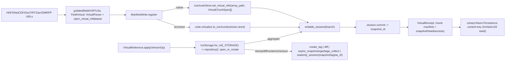

# [PY_DATA_VIRTUAL]

The icechunk native virtual-chunk addressing owner over byte-range chunk manifests. `VirtualReference` registers archival HDF5/NetCDF/GeoTIFF/Zarr/DMRPP/FITS/kerchunk byte ranges as external virtual chunks inside one transactional versioned `icechunk` `Repository` through the native `IcechunkStore.set_virtual_refs` chunk-addressing surface, never copying a byte and never re-deriving the `virtualizarr` manifest the `gridded/field#VIRTUAL` owner already constructs. The concurrent-write modality rides the native `Session.commit(rebase_with=ConflictSolver)` auto-rebase rather than a serialized retry loop, the snapshot-reclaim modality folds `expire_snapshots` and `garbage_collect` onto one `Reclaim` sub-axis, and the time-travel read folds `snapshot_id`/`tag`/`as_of`-datetime onto one `ReadAt` sub-axis over the single `readonly_session` call. The manifest leg composes `FieldVirtual` — its 8-row `VirtualParser` suffix-recovered parser axis and its `open_virtual_mfdataset` multi-source aggregation are consumed as the upstream chunk-reference source, never duplicated here. `ManifestWrite` is the one closed write-path axis collapsing the icechunk/virtualizarr overlap onto two registration modalities of the same store: the `virtualizarr` `VirtualiZarrDatasetAccessor.to_icechunk` accessor path that lowers a `ManifestArray`-backed `xarray.Dataset` onto the session store in one call, and the native `IcechunkStore.set_virtual_refs(array_path, chunks)` `VirtualChunkSpec` path that registers each external chunk byte-range directly when no labelled cube exists — both landing virtual `ChunkType.virtual` chunks in the same `icechunk` session, the path recovered from whether a manifest cube or a raw byte-range slab tuple is supplied. `IceStorage` is the one closed storage-backend axis collapsing the eight `icechunk` storage factories onto one suffix/scheme-recovered row. The committed snapshot's branch/tag/ancestry identity and the `set_virtual_ref` content-key are consumed at the wire by `csharp:Rasm.Persistence/Version/Snapshots` as the durable version-control content-addressing concern — the snapshot identity is a Persistence wire concern reproduced from the C#-owned `XxHash128` seed, never a data lineage or version page here.

## [01]-[INDEX]

- [01]-[VIRTUAL]: the `VirtualReference` icechunk native virtual-chunk addressing owner — the `VersionOp` request axis collapsing registration and version control (`aggregate`/`stamp`/`diff`/`reclaim`/`checkout`) onto one `apply` total dispatch, the nested `Reclaim` (`expire_snapshots`/`garbage_collect`) and `ReadAt` (`snapshot`/`tag`/`as_of`) read/maintenance sub-axes, the `IceStorage` storage-backend axis with its `_STORAGE` scheme table, the nested `ManifestWrite` accessor-versus-native registration sub-axis collapsing the icechunk/virtualizarr overlap, the composed `gridded/field#VIRTUAL` `FieldVirtual` manifest leg (8-parser `VirtualParser` + `open_virtual_mfdataset`, never duplicated), the `ConflictSolver` auto-rebase commit, the branch-head/tag/diff/ancestry version surface, and the `VirtualReceipt` keyed off the real chunk manifest and the icechunk snapshot the Persistence wire reproduces through one Merkle `ContentIdentity.of`.

## [02]-[VIRTUAL]

- Owner: `VirtualReference` — one frozen virtual-reference owner carrying the source URL tuple, the destination `ResourceRef`, and the target branch; the destination `IceStorage` backend is recovered per call from the `ResourceRef` scheme rather than stored, and the version modality rides the `VersionOp` case the `apply` entrypoint takes rather than a stored write field. The manifest leg is the composed `gridded/field#VIRTUAL` `FieldVirtual` whose `VirtualParser` suffix-recovered 8-row parser axis (`hdf`/`netcdf3`/`zarr`/`dmrpp`/`fits`/`kerchunk_json`/`kerchunk_parquet`/`icechunk`) and `open_virtual_mfdataset` multi-source aggregation produce the `ManifestArray`-backed `xarray.Dataset` of chunk-reference dicts (`path`/`offset`/`length`, the actual bytes staying in the source files), never a data-copying ingest and never a second parser axis re-declared on this page. `VersionOp` is the one closed `@tagged_union` request axis collapsing the registration and version-control modalities — `aggregate`/`stamp`/`diff`/`reclaim`/`checkout` — onto one `run` total dispatch, never a sibling-method family; the nested `Reclaim` sub-axis folds the `expire_snapshots` snapshot-mark and the `garbage_collect` object-reclaim onto one `run` over the two `icechunk` maintenance members, and the nested `ReadAt` sub-axis folds the `snapshot_id`/`tag`/`as_of`-datetime time-travel triple onto one `readonly_session` call, never a parallel `checkout_snapshot`/`checkout_tag`/`as_of` reader family. `IceStorage` is the one closed `@tagged_union` storage-backend axis collapsing the eight `icechunk` storage factories — `local`/`s3`/`gcs`/`azure`/`r2`/`tigris`/`http`/`memory` — onto one `build` fold and one `_STORAGE` scheme table feeding `for_ref`, never eight parallel construction call sites and never a nine-arm `match`. `ManifestWrite` is the one closed `@tagged_union` registration sub-axis over the two paths to the same icechunk session store. `VirtualChunkSlab` carries one external chunk byte-range descriptor (`array_path`/`coordinates`/`location`/`offset`/`length`) the native registration scatters.
- Cases: `VersionOp` collapses the registration and version-control surface onto one transactional repository, the modality recovered from the case, never a sibling-method family — `aggregate(ManifestWrite, CommitMeta, ConflictSolver | None)` registers and commits one snapshot through the `rebase_with=` auto-rebase under the supplied solver, `stamp(name, snapshot)` stamps an immutable `create_tag` reference, `diff(base, head)` walks the snapshot changeset, `reclaim(Reclaim)` runs the `expire_snapshots` snapshot-mark or the `garbage_collect` object-reclaim recovered from the `Reclaim` case, and `checkout(ReadAt)` time-travels to a read-only cube at the `snapshot_id`/`tag`/`as_of`-datetime the `ReadAt` case recovers. The nested `ManifestWrite` collapses the icechunk/virtualizarr overlap onto two registration modalities of one session, the path recovered from the supplied source, never a second virtual owner — the `accessor` case (the composed `FieldVirtual`-built `ManifestArray`-backed `xarray.Dataset` lowered onto `session.store` through `cube.virtualize.to_icechunk(store, group=, append_dim=, region=, validate_containers=, last_updated_at=)`, the headline path when a labelled manifest cube exists, reusing the upstream `VirtualParser`/`open_virtual_mfdataset` aggregation verbatim) and the `native` case (each `VirtualChunkSlab` external byte-range registered directly through `IcechunkStore.set_virtual_refs(array_path, chunks, validate_containers=)` over a `VirtualChunkSpec` tuple — or `set_virtual_ref(key, location, offset=, length=, checksum=, validate_container=)` for the single-chunk arity — the path when raw archival byte-ranges register without a `virtualizarr` cube, the native surface `virtualizarr` itself drives under the hood). Both paths land `ChunkType.virtual` chunks in the same `icechunk` session and commit one snapshot; the modality is the `ManifestWrite` case the supplied source recovers, never a parallel accessor-only or native-only owner. `IceStorage` cases map one-to-one onto the eight `icechunk` storage factories, the row recovered from the `ResourceRef` scheme through the `_STORAGE` table backing `for_ref`.
- Entry: `VirtualReference.apply` is the one entrypoint over the `VersionOp` request `@tagged_union`, recovering the `IceStorage` backend from the destination `ResourceRef`, opening one `icechunk` `Repository` through `IceStorage.repository` (`Repository.open_or_create`), and driving the supplied `VersionOp` case through one `op.run(repo, self)` total dispatch closed with `assert_never` returned in one `boundary(f"virtual.{op.tag}")` `RuntimeRail` — never an `aggregate`/`stamp`/`as_of` sibling-method family sharing a boundary prefix and never a per-op free function. `VersionOp` cases own every modality: `aggregate` opens a `writable_session(branch)`, drives the supplied `ManifestWrite` case against `session.store` (the `accessor` case composing `FieldVirtual.aggregate`'s manifest cube through `virtualize.to_icechunk`, the `native` case scattering the `VirtualChunkSlab` tuple through `set_virtual_refs`), commits one snapshot through `session.commit("virtual-reference", metadata=, rebase_with=)` under the supplied `ConflictSolver` so a concurrent branch write auto-rebases rather than failing the transaction, and folds one `VirtualReceipt` over the real manifest chunk count, the reference byte span, the committed snapshot, the `lookup_branch` head, and the `ancestry` depth; `stamp` stamps a durable `Repository.create_tag(name, snapshot_id)` immutable reference; `diff` walks `Repository.diff(from_snapshot_id=, to_snapshot_id=)` into one `Diff` changeset; `reclaim` runs the nested `Reclaim.run` over `Repository.expire_snapshots(older_than)` or `Repository.garbage_collect(older_than)` returning the reclaimed snapshot-id `set[str]` or the `GCSummary` census; `checkout` opens the `ReadAt`-selected `readonly_session(snapshot_id=)`/`readonly_session(tag=)`/`readonly_session(as_of=)` time-travel read for an as-of virtual-cube query. The heterogeneous per-case return collapses onto one named `VirtualOutcome = VirtualReceipt | str | Diff | set[str] | GCSummary | xr.Dataset` union alias — the corpus request-dispatch idiom mirroring `tabular/contract#COVENANT` `CovenantOutcome`, never a bare `object` erasure. One `apply`/`VersionOp` entrypoint family owns the single-source, multi-source, accessor, native, stamp, diff, reclaim, and checkout modalities by the `VersionOp` case, the `ManifestWrite`/`Reclaim`/`ReadAt` sub-case, and the source-URL-tuple arity, never a per-source-count, per-op, or per-path reader family.
- Auto: `IceStorage.repository` is the idempotent lifecycle entry — `Repository.open_or_create` over an `IceStorage`-built `Storage` — folding the deleted single-call `_repository` helper onto the storage owner that already holds `build`, every write flowing through `writable_session(branch)` and reaching the Zarr-compatible `IcechunkStore` only through `session.store`, the one handle that crosses into chunk registration, the commit landing through `session.commit("virtual-reference", metadata=, rebase_with=)` so the optional `ConflictSolver` auto-rebases a concurrent branch write at commit time rather than out-of-band, matching the `icechunk` `rebase_with`-at-commit law; the native `set_virtual_refs(array_path, chunks)` registers many external chunks in one call over a `VirtualChunkSpec` tuple and `set_virtual_ref(key, location, offset=, length=)` the single-chunk arity, both gated by `authorize_virtual_chunk_access` credentials and validated by `validate_containers=`; the accessor path reuses the composed `FieldVirtual` aggregation through one `msgspec.structs.asdict` field-for-field rebind that strips the `export` key before the splat and re-supplies the icechunk `ManifestExport` so the destination store overrides only that slot — the corpus rebind idiom rather than a hand-listed field copy, and never a double-`export` splat — so the `virtualizarr` `to_icechunk` accessor and the native `set_virtual_refs` are stated as the two registration paths of the same store rather than two owners; the `for_ref` scheme dispatch rides the `_STORAGE` callable table rather than a nine-arm `match`, so a new scheme is one row; `icechunk` is the native Rust pyo3 extension with CPython floor `<3.15`, so its `Repository`/`Storage`/`Session`/`IcechunkStore` arm binds function-local under `# noqa: PLC0415`, never a module-top import on this page; `field.md` `FieldVirtual` is the composed in-package manifest owner imported function-local at the accessor case (its `xarray` touch is banned-module-level); the content key derives from the committed snapshot identity and the manifest reference bytes through exactly one canonical `ContentIdentity.of`, never a faked `chunks=()`/`codec="manifest"` placeholder and never a path-string source.
- Receipt: the `VirtualReceipt` keys off the real registration — the registered-chunk census read uniformly off the materialized `tuple(Session.all_virtual_chunk_locations())` for both arms (the same tuple feeding the count and the referenced-location content key, never a double walk of the lazy iterator), the reference byte span and CF dims/engine read off the composed `FieldVirtual.aggregate` `FieldReceipt` (`bytes_stored`/`dims`/`engine`, themselves folded off `VirtualiZarrDatasetAccessor.nbytes` and the `ManifestArray` manifest at the `field.md` owner) for the accessor case or the summed `VirtualChunkSlab` lengths for the native case, the committed snapshot id off `session.commit`, the branch head off `Repository.lookup_branch`, and the ancestry depth off `Repository.ancestry` — never the faked placeholder the deleted hand-loop emitted; the content key Merkle-folds the committed snapshot-identity key and the registered-location key through the one `ContentIdentity.of` `tuple[ContentKey, ...]` source, so a snapshot rewrite that preserves the registered locations and a relocation that preserves the snapshot id are distinct keys, the icechunk branch/head/tag/ancestry carried to the wire as the `csharp:Rasm.Persistence/Version/Snapshots` content-key concern reproduced from the `XxHash128` seed. The `stamp`/`diff`/`reclaim`/`checkout` cases emit no `VirtualReceipt` — `stamp` returns the stamped name, `diff` the `Diff` changeset, `reclaim` the reclaimed snapshot-id `set[str]` or the `GCSummary` census, and `checkout` the time-travel `xarray.Dataset` — so the typed receipt fold stays the `aggregate` case alone, never a generic per-op receipt rail.
- Packages: `icechunk` (`Repository.{open_or_create,writable_session,readonly_session,create_tag,lookup_branch,ancestry,diff,expire_snapshots,garbage_collect}`/`local_filesystem_storage`/`in_memory_storage`/`s3_storage`/`gcs_storage`/`azure_storage`/`r2_storage`/`tigris_storage`/`http_storage`/`Session.{store,commit,all_virtual_chunk_locations}`/`IcechunkStore.{set_virtual_ref,set_virtual_refs}`/`ConflictSolver`/`BasicConflictSolver`/`ConflictDetector`/`VirtualChunkSpec`/`Diff`/`GCSummary`/`ChunkType.virtual` — the native virtual-chunk addressing and version-control surface, `<3.15` gated, function-local), `gridded/field#VIRTUAL` `FieldVirtual` (the composed manifest leg — `FieldReceipt`/`VirtualParser`/`open_virtual_mfdataset`/`ManifestArray`/`VirtualiZarrDatasetAccessor.{to_icechunk,nbytes}`, the in-package owner of `virtualizarr` manifest construction, never re-declared here), `obstore` (`store.from_url` backing the `IceStorage` cloud-scheme `config`, function-local at the storage build), runtime (`ResourceRef`/`ContentIdentity`/`ContentKey`/`RuntimeRail`/`boundary`/`Receipt`/`ReceiptContributor`).
- Growth: a new storage backend is one `IceStorage` case plus one `build` row and one `_STORAGE` scheme entry mapping the `ResourceRef` scheme onto the matching `icechunk` factory, never a parallel store class; a new registration path is one `ManifestWrite` case on the existing sub-axis; a new source format is the existing `FieldVirtual` `VirtualParser` case upstream, never a parser re-declared here; a new version operation (branch reset through `reset_branch`, snapshot rewrite through `rewrite_manifests`) is one `VersionOp` case on the existing `apply` entrypoint composing the matching `Repository` member, never a sibling method; a new reclaim modality is one `Reclaim` case, a new time-travel anchor one `ReadAt` case; a new credential backend is one `obstore` `config` value on the `IceStorage` case; zero new surface.
- Boundary: composes the `gridded/field#VIRTUAL` `FieldVirtual` manifest owner rather than re-deriving the `virtualizarr` parser/manifest surface, and the runtime `boundary`/`ContentIdentity`/`ResourceRef`, never a second manifest or fault owner; no compute-package numeric trio, no production tensor session, no durable product store; `data` emits a portable content-addressed virtual-reference manifest registered in a versioned icechunk store, not a runtime compute graph. The icechunk version-control snapshot identity (`set_virtual_ref` content-key, branch/tag/ancestry) is the `csharp:Rasm.Persistence/Version/Snapshots` wire concern consumed at the boundary, never a data lineage or durable version-control ledger owned here; the `VersionOp.diff`/`reclaim` cases expose only `icechunk`'s native changeset-read and snapshot-reclaim surface (`Repository.diff`, `expire_snapshots`, `garbage_collect`) over this page's own virtual store, and the `ConflictSolver` threaded into `commit` is the native commit-time auto-rebase, never the branch-merge/rebase/conflict-resolution *engine* — the `BasicConflictSolver`/`ConflictDetector` are passed as a commit-time policy value, while the durable `reset_branch`/`rewrite_manifests` retention engine and cross-runtime content-key reproduction stay the C# Persistence concern. A data-copying ingest where virtual reference applies, a hand-rolled kerchunk reference builder, a re-declared `VirtualParser`/`open_virtual_dataset` manifest surface the `field.md` owner already owns, a module-top `icechunk` import on this gated page, an `aggregate`/`stamp`/`as_of` sibling-method family or per-op `_aggregate`/`_stamp` free function where the `VersionOp` request union and one `apply` dispatch own the modality, a serialized commit-retry loop where `commit(rebase_with=)` auto-rebases, a parallel `expire`/`gc` op-family where the `Reclaim` sub-axis discriminates, a snapshot-id-only `checkout` where the `ReadAt` sub-axis carries the `tag`/`as_of` time-travel triple, a single-call `_repository` helper where `IceStorage.repository` already holds the lifecycle, a nine-arm `for_ref` `match` where the `_STORAGE` table dispatches, a hand-listed `FieldVirtual` field copy where `asdict` rebinds, a bare-`object` erased dispatch return where `VirtualOutcome` names the union, a faked `chunks=()`/`codec="manifest"` receipt arm, a snapshot-id-only content key where the Merkle `ContentIdentity.of` folds the snapshot identity and the registered-location census, a path-string `ContentIdentity.of` key, and a `git`-like branch-merge/rebase/conflict-solver/durable-ledger version-control engine realized in `data` rather than consumed from C# Persistence at the wire are the deleted forms.

```python signature
from typing import TYPE_CHECKING, Literal, assert_never

from expression import case, tag, tagged_union
from msgspec import Struct
from msgspec.structs import asdict

from rasm.data.gridded.field import FieldReceipt, FieldVirtual, ManifestExport
from rasm.runtime.content_identity import ContentIdentity, ContentKey
from rasm.runtime.faults import RuntimeRail, boundary
from rasm.runtime.receipts import Receipt
from rasm.runtime.roots import ResourceRef

if TYPE_CHECKING:
    import datetime as dt
    from collections.abc import Callable

    import xarray as xr
    from icechunk import ConflictSolver, Diff, GCSummary, Repository, Session, Storage, VirtualChunkSpec


type Coordinates = tuple[int, ...]
type CommitMeta = dict[str, str]
type VirtualOutcome = "VirtualReceipt | str | Diff | set[str] | GCSummary | xr.Dataset"

_STORAGE: "dict[str, Callable[[ResourceRef], IceStorage]]" = {
    "s3": lambda r: IceStorage(s3=(r.root, r.relative, None)),
    "gs": lambda r: IceStorage(gcs=(r.root, r.relative)),
    "gcs": lambda r: IceStorage(gcs=(r.root, r.relative)),
    "az": lambda r: IceStorage(azure=(r.root, r.root, r.relative)),
    "abfs": lambda r: IceStorage(azure=(r.root, r.root, r.relative)),
    "r2": lambda r: IceStorage(r2=(r.root, r.relative, r.root)),
    "tigris": lambda r: IceStorage(tigris=(r.root, r.relative)),
    "http": lambda r: IceStorage(http=r.root),
    "https": lambda r: IceStorage(http=r.root),
    "memory": lambda r: IceStorage(memory=None),
}


class VirtualChunkSlab(Struct, frozen=True):
    array_path: str
    coordinates: Coordinates
    location: str
    offset: int
    length: int

    def spec(self) -> "VirtualChunkSpec":
        from icechunk import VirtualChunkSpec  # noqa: PLC0415

        return VirtualChunkSpec(
            index=list(self.coordinates), location=self.location, offset=self.offset, length=self.length
        )


@tagged_union(frozen=True)
class IceStorage:
    tag: Literal["local", "s3", "gcs", "azure", "r2", "tigris", "http", "memory"] = tag()
    local: str = case()
    s3: tuple[str, str, str | None] = case()
    gcs: tuple[str, str] = case()
    azure: tuple[str, str, str] = case()
    r2: tuple[str, str, str] = case()
    tigris: tuple[str, str] = case()
    http: str = case()
    memory: None = case()

    @staticmethod
    def for_ref(ref: ResourceRef) -> "IceStorage":
        return _STORAGE.get(ref.scheme, lambda r: IceStorage(local=str(r.path)))(ref)

    def build(self) -> "Storage":
        import icechunk as ic  # noqa: PLC0415

        match self:
            case IceStorage(tag="local", local=path):
                return ic.local_filesystem_storage(path)
            case IceStorage(tag="s3", s3=(bucket, prefix, region)):
                return ic.s3_storage(bucket=bucket, prefix=prefix, region=region, from_env=True)
            case IceStorage(tag="gcs", gcs=(bucket, prefix)):
                return ic.gcs_storage(bucket=bucket, prefix=prefix, from_env=True)
            case IceStorage(tag="azure", azure=(account, container, prefix)):
                return ic.azure_storage(account=account, container=container, prefix=prefix, from_env=True)
            case IceStorage(tag="r2", r2=(bucket, prefix, account_id)):
                return ic.r2_storage(bucket=bucket, prefix=prefix, account_id=account_id)
            case IceStorage(tag="tigris", tigris=(bucket, prefix)):
                return ic.tigris_storage(bucket=bucket, prefix=prefix, from_env=True)
            case IceStorage(tag="http", http=base_url):
                return ic.http_storage(base_url)
            case IceStorage(tag="memory"):
                return ic.in_memory_storage()
            case unreachable:
                assert_never(unreachable)

    def repository(self) -> "Repository":
        import icechunk as ic  # noqa: PLC0415

        return ic.Repository.open_or_create(self.build())


@tagged_union(frozen=True)
class ManifestWrite:
    tag: Literal["accessor", "native"] = tag()
    accessor: "FieldVirtual" = case()
    native: tuple[str, tuple[VirtualChunkSlab, ...]] = case()

    def register(self, session: "Session", ref: ResourceRef) -> "tuple[tuple[str, ...], str, int]":
        match self:
            case ManifestWrite(tag="accessor", accessor=spec):
                fields = {key: value for key, value in asdict(spec).items() if key != "export"}
                lowered: FieldReceipt = FieldVirtual(
                    **fields, export=ManifestExport(icechunk=(session.store, None, None, None, True, None))
                ).aggregate()()
                return tuple(lowered.dims), lowered.engine, lowered.bytes_stored
            case ManifestWrite(tag="native", native=(array_path, slabs)):
                session.store.set_virtual_refs(array_path, [slab.spec() for slab in slabs], validate_containers=True)
                return (array_path,), "native", sum(slab.length for slab in slabs)
            case unreachable:
                assert_never(unreachable)


@tagged_union(frozen=True)
class ReadAt:
    tag: Literal["snapshot", "tag", "as_of"] = tag()
    snapshot: str = case()
    tag_: str = case()
    as_of: "dt.datetime" = case()

    def session(self, repo: "Repository") -> "Session":
        match self:
            case ReadAt(tag="snapshot", snapshot=snapshot_id):
                return repo.readonly_session(snapshot_id=snapshot_id)
            case ReadAt(tag="tag", tag_=name):
                return repo.readonly_session(tag=name)
            case ReadAt(tag="as_of", as_of=moment):
                return repo.readonly_session(branch=None, as_of=moment)
            case unreachable:
                assert_never(unreachable)


@tagged_union(frozen=True)
class Reclaim:
    tag: Literal["expire", "collect"] = tag()
    expire: "dt.datetime" = case()
    collect: "dt.datetime" = case()

    def run(self, repo: "Repository") -> "set[str] | GCSummary":
        match self:
            case Reclaim(tag="expire", expire=older_than):
                return repo.expire_snapshots(older_than)
            case Reclaim(tag="collect", collect=older_than):
                return repo.garbage_collect(older_than)
            case unreachable:
                assert_never(unreachable)


@tagged_union(frozen=True)
class VersionOp:
    tag: Literal["aggregate", "stamp", "diff", "reclaim", "checkout"] = tag()
    aggregate: tuple[ManifestWrite, CommitMeta, "ConflictSolver | None"] = case()
    stamp: tuple[str, str] = case()
    diff: tuple[str, str] = case()
    reclaim: Reclaim = case()
    checkout: ReadAt = case()

    def run(self, repo: "Repository", spec: "VirtualReference") -> VirtualOutcome:
        import xarray as xr  # noqa: PLC0415

        match self:
            case VersionOp(tag="aggregate", aggregate=(write, meta, solver)):
                session = repo.writable_session(spec.branch)
                dims, engine, referenced = write.register(session, spec.ref)
                refs = tuple(session.all_virtual_chunk_locations())
                snapshot = session.commit("virtual-reference", metadata=meta, rebase_with=solver)
                return VirtualReceipt(
                    sources=len(spec.sources), dims=dims, engine=engine, chunk_refs=len(refs),
                    bytes_referenced=referenced, snapshot_id=snapshot, branch=spec.branch,
                    head=repo.lookup_branch(spec.branch),
                    ancestry_depth=sum(1 for _ in repo.ancestry(branch=spec.branch)),
                    content_key=ContentIdentity.of("virtual", (
                        ContentIdentity.of("virtual.snapshot", snapshot.encode()),
                        ContentIdentity.of("virtual.refs", "\n".join(refs).encode()),
                    )),
                )
            case VersionOp(tag="stamp", stamp=(name, snapshot)):
                repo.create_tag(name, snapshot)
                return name
            case VersionOp(tag="diff", diff=(base, head)):
                return repo.diff(from_snapshot_id=base, to_snapshot_id=head)
            case VersionOp(tag="reclaim", reclaim=reclaim):
                return reclaim.run(repo)
            case VersionOp(tag="checkout", checkout=at):
                return xr.open_zarr(at.session(repo).store, consolidated=False)
            case unreachable:
                assert_never(unreachable)


class VirtualReceipt(Struct, frozen=True):
    sources: int
    dims: tuple[str, ...]
    engine: str
    chunk_refs: int
    bytes_referenced: int
    snapshot_id: str
    branch: str
    head: str
    ancestry_depth: int
    content_key: ContentKey

    def contribute(self) -> Receipt:
        return Receipt.of(
            "emitted",
            "virtual",
            "icechunk",
            {
                "sources": str(self.sources),
                "chunk_refs": str(self.chunk_refs),
                "referenced": str(self.bytes_referenced),
                "snapshot": self.snapshot_id,
                "branch": self.branch,
                "ancestry": str(self.ancestry_depth),
            },
        )


class VirtualReference(Struct, frozen=True):
    sources: tuple[str, ...]
    ref: ResourceRef
    branch: str = "main"

    def apply(self, op: VersionOp) -> "RuntimeRail[VirtualOutcome]":
        return boundary(f"virtual.{op.tag}", lambda: op.run(IceStorage.for_ref(self.ref).repository(), self))
```



## [03]-[RESEARCH]

- [ICECHUNK_VIRTUAL_NATIVE]: the `icechunk` native virtual-chunk addressing and version-control surface — `Repository.open_or_create(storage, config=, authorize_virtual_chunk_access=)`/`writable_session(branch)`/`readonly_session(branch=, *, tag=, snapshot_id=, as_of=)`/`create_tag(tag, snapshot_id)`/`lookup_branch(branch)`/`ancestry(*, branch=, tag=, snapshot_id=)`/`diff(*, from_snapshot_id=, to_snapshot_id=)`/`expire_snapshots(older_than, *, delete_expired_branches=, delete_expired_tags=)`/`garbage_collect(delete_object_older_than, *, dry_run=)`, `Session.{store,commit(message, metadata=, *, rebase_with=, rebase_tries=),all_virtual_chunk_locations()}`, `IcechunkStore.set_virtual_ref(key, location, *, offset, length, checksum=None, validate_container=True)`/`set_virtual_refs(array_path, chunks, *, validate_containers=True)`, the eight storage factories `local_filesystem_storage(path)`/`in_memory_storage()`/`s3_storage(*, bucket, prefix, region, from_env, ...)`/`gcs_storage(*, bucket, prefix, from_env, ...)`/`azure_storage(*, account, container, prefix, from_env, ...)`/`r2_storage(*, bucket, prefix, account_id, ...)`/`tigris_storage(*, bucket, prefix, ...)`/`http_storage(base_url, opts)`, and `ConflictSolver`/`BasicConflictSolver`/`ConflictDetector`/`Diff`/`GCSummary`/`ChunkType.virtual` — is catalogue-confirmed against the folder `icechunk` `.api` (`open_or_create` L82, `writable_session` L87, `readonly_session(branch=, *, tag=, snapshot_id=, as_of=)` L88, `create_tag` L86, `lookup_branch` L85, `ancestry` L91, `diff` L92, `expire_snapshots(older_than, *, delete_expired_branches=False, delete_expired_tags=False) -> set[str]` L93, `garbage_collect(delete_object_older_than, *, dry_run=False, ...) -> GCSummary` L94, `Session.commit(message, metadata=None, *, rebase_with=None, rebase_tries=1000)` L102, `Session.store` L107, `all_virtual_chunk_locations` L113, `set_virtual_ref` L111, `set_virtual_refs` L112, the storage factories L63-69, `BasicConflictSolver`/`ConflictDetector` as `ConflictSolver` implementations L38, the `rebase_with` commit-time auto-rebase law L122/L129, `Diff` L34, `GCSummary` L36, `ChunkType.virtual` L49, `VirtualChunkContainer`/`VirtualChunkSpec` L40, IMPLEMENTATION_LAW virtual-chunk law L124); `icechunk` is the native Rust pyo3 extension with CPython floor `<3.15` (PACKAGE_SURFACE asset row), so the whole arm binds function-local under `# noqa: PLC0415`, never a module-top import on this page. The `readonly_session` keyword set (`branch=`, `tag=`, `snapshot_id=`, `as_of=`), the `expire_snapshots`/`garbage_collect` first-positional datetime, and the `commit(rebase_with=)` solver slot are catalogue-settled at L88/L93/L94/L102. The `Repository.diff` keyword spelling — whether the snapshot endpoints are `from_snapshot_id=`/`to_snapshot_id=` against the `from_branch=`/`to_branch=` ref variants the catalogue truncates at L92 — and whether `readonly_session(as_of=)` resolves against the head of a supplied `branch` (the `ReadAt.as_of` arm passing `branch=None` against a branch-coupled `as_of`) confirm against the live `icechunk` distribution before the `VersionOp.diff` and `ReadAt.as_of` arms settle — RESEARCH item. The `VirtualChunkSpec` constructor field arity — whether the chunk index is `index=` taking a coordinate list against the `location`/`offset`/`length` external descriptor versus an alternate keyword spelling — and whether `set_virtual_refs(array_path, chunks)` takes a `Sequence[VirtualChunkSpec]` or a `VirtualChunkContainer`-wrapped batch confirm against the live `icechunk` distribution before the `VirtualChunkSlab.spec` and `ManifestWrite.native` arms settle; the catalogue names the descriptor types and the two registration entrypoints but truncates the `VirtualChunkSpec` field list — RESEARCH item. The `set_virtual_ref`/`set_virtual_refs` registration is gated by `authorize_virtual_chunk_access` credentials (IMPLEMENTATION_LAW L124), the credential build threaded through the `Repository.open_or_create(storage, config=, authorize_virtual_chunk_access=)` lifecycle keyword the `csharp:Rasm.Persistence/Version/Snapshots` wire owns.
- [ICECHUNK_VIRTUALIZARR_OVERLAP]: the `ManifestWrite.accessor` path lowers a `gridded/field#VIRTUAL` `FieldVirtual`-built `ManifestArray`-backed `xarray.Dataset` onto `session.store` through `VirtualiZarrDatasetAccessor.to_icechunk(store, *, group, append_dim, region, validate_containers, last_updated_at)` (catalogue-confirmed against the folder `virtualizarr` `.api` `to_icechunk` accessor L66), and the `ManifestWrite.native` path registers the same external byte-ranges directly through `IcechunkStore.set_virtual_refs` — the two are the two registration paths of the same icechunk session store, the `virtualizarr` accessor driving the native `set_virtual_refs` surface under the hood, so the page owns the native path and composes the accessor path rather than declaring a second manifest owner. The `cube.virtualize.nbytes` accessor return shape (`virtualizarr` `.api` L69) and the `ManifestArray.manifest.dict()` chunk-reference count (`.api` L43, `field.md#VIRTUAL` `[VIRTUAL_REFERENCE]` RESEARCH) confirm against the live `virtualizarr` distribution at the `field.md` owner before the accessor receipt settles — the count and byte-span accessors are the composed `field.md` owner's RESEARCH items, never re-confirmed here.
- [FIELD_VIRTUAL_COMPOSITION]: the composed manifest leg is the in-package `gridded/field#VIRTUAL` `FieldVirtual` owner — its 8-row `VirtualParser` `@tagged_union` (`hdf`/`netcdf3`/`zarr`/`dmrpp`/`fits`/`kerchunk_json`/`kerchunk_parquet`/`icechunk`, suffix-recovered through `VirtualParser.for_source`), its `_open` driving `open_virtual_dataset` for single-source and `open_virtual_mfdataset(urls, registry=, parser=, concat_dim=, combine=, parallel=)` for multi-source arity, its `ObjectStoreRegistry` over `obstore` `from_url`, and its `ManifestExport` accessor axis — all owned and catalogue-confirmed at `field.md#VIRTUAL` against the folder `virtualizarr` `.api` (the 8 parsers L29-36, `open_virtual_mfdataset` L59); the `accessor` case composes the public `FieldVirtual.aggregate` after rebinding the owner's `export` to `ManifestExport(icechunk=(session.store, ...))` — the same `ManifestExport.icechunk` case `field.md` already drives — so the cube-open, the parser dispatch, and the `to_icechunk` lowering stay the `field.md` owner's, never re-declared here and never reached through a private `_open`. The kerchunk-supersession rationale — `virtualizarr` reads legacy kerchunk JSON/Parquet references through its `KerchunkJSONParser`/`KerchunkParquetParser` parser rows without admitting `kerchunk` as a dependency, so no `kerchunk` package enters the manifest — is the `field.md#VIRTUAL` `VirtualParser` law, stated once there. The `FieldVirtual` frozen-`Struct` field-for-field rebind strips the `export` key off `asdict(spec)` before the splat and re-supplies the icechunk `ManifestExport` so only that slot overrides while `target`/`concat_dim`/`combine`/`parallel`/`store_config` ride through — the `msgspec.structs.asdict` strip idiom rather than a double-`export` splat or a hand-listed copy — and the `FieldReceipt` `dims`/`engine`/`bytes_stored` slot spellings the accessor receipt reads confirm against the `field.md` module before the accessor arm settles; the nested `lowered.aggregate()()` extraction is the corpus rail-thunk-call idiom (`field.md` `engine.open(...)()`, `_write`'s `engine.write(...)()`), the inner `RuntimeRail` evaluated inside the parent `virtual.aggregate` boundary — RESEARCH item.
- [PERSISTENCE_VERSION_WIRE]: the committed `Session.commit` snapshot id, the `Repository.lookup_branch` branch head, the `Repository.create_tag` immutable reference, and the `Repository.ancestry` snapshot DAG depth are the `csharp:Rasm.Persistence/Version/Snapshots` durable version-control content-addressing concern consumed at the wire and reproduced from the C#-owned `XxHash128` content-key seed (the `gridded/virtual -> Rasm.Persistence [CONTENT_KEY]` seam, the `ICECHUNK_ASOF_CONTENT_KEY` counterpart task on `Rasm.Persistence/Version/Snapshots`); the durable `git`-like version-control *engine* — branch-merge policy, rebase orchestration, cross-runtime content-key reproduction, and the retention/provenance ledger — is realized in C# Persistence, never in `data`, so this page emits the snapshot identity as the receipt content key and owns no branch-merge or durable-ledger surface; the `BasicConflictSolver`/`ConflictDetector` threaded into `commit(rebase_with=)` is the native `icechunk` commit-time auto-rebase policy value the data-side write consumes, not a merge engine, while `Repository.rebase`/`merge`/`reset_branch` orchestration stays the Persistence concern. The `VersionOp.diff`/`reclaim` cases expose only `icechunk`'s native read-and-maintenance surface (`Repository.diff` changeset read, `expire_snapshots`/`garbage_collect` reclaim) over this page's own virtual store, the data-side query the Persistence engine consumes rather than re-derives. The `XxHash128` seed reproduction of the icechunk snapshot content-key bit-identically across the C#/Python runtimes confirms against the `Rasm.Persistence/Version/Snapshots` owner before the Merkle `ContentIdentity.of("virtual", (snapshot_key, refs_key))` key derivation settles its seed against the C# owner — RESEARCH item.
