```mermaid
flowchart LR
    Sources["HDF5/NetCDF3/Zarr/DMRPP/FITS/kerchunk URLs"] --> Registry["ObjectStoreRegistry over obstore.from_url(store_config)"]
    Native["h5py File.build_virtual_dataset + CFDtype.resolve special dtype"] --> Registry
    Registry --> Open["open_virtual_dataset / open_virtual_mfdataset / open_virtual_datatree + VirtualParser case"]
    Open --> Manifest["ManifestArray + ChunkManifest chunk manifest"]
    Manifest --> Export["ManifestWrite.write: kerchunk | icechunk export"]
    Export --> FReceipt["FieldReceipt keyed by canonical _manifest_wire stream"]
    Manifest --> Cube["ManifestWrite.register cube: asdict rebind onto session.store"]
    Slabs["VirtualChunkSlab byte ranges"] --> Nat["ManifestWrite.register native: set_virtual_ref(s)"]
    Cube --> Session["writable_session(branch)"]
    Nat --> Session
    Session --> Commit["session.commit(rebase_with=solver) -> snapshot_id"]
    Commit --> VReceipt["VirtualReceipt: merkle(snapshot_key, refs_key)"]
    VReceipt --> Wire["csharp:Rasm.Persistence/Version/Snapshots (XxHash128 seed; runtime ParityReceipt rail)"]
    Repo["IceStorage.for_ref(_STORAGE) -> repository()"] -->|stamp/diff/reclaim/checkout| Version["create_tag | diff | expire_snapshots/garbage_collect | readonly_session(snapshot/tag/as_of)"]
```

# [PY_DATA_VIRTUAL]

The SOLE manifest-cube owner: virtualizarr byte-range manifest construction AND icechunk native virtual-chunk addressing on one page, the double charter dead. `FieldVirtual` aggregates archival HDF5/NetCDF/Zarr/DMRPP/FITS/kerchunk/icechunk chunk byte ranges into one zero-copy virtual `xarray.Dataset` through `virtualizarr` `ManifestArray`/`ChunkManifest` manifest construction (chunk-reference dicts of `path`/`offset`/`length`, the actual bytes staying in the source files), the one closed `VirtualParser` `@tagged_union` parser seam carrying each `virtualizarr.parsers` constructor payload, the `h5py` `File.build_virtual_dataset` HDF5-native composition, and the `CFDtype` special-dtype seam. `VirtualReference` registers those external byte ranges as virtual chunks inside one transactional versioned `icechunk` `Repository` through the native `IcechunkStore.set_virtual_refs` chunk-addressing surface, never copying a byte. `ManifestWrite` is the ONE export/registration axis — the former field-side `ManifestExport` export targets (`kerchunk`/`icechunk`) and the former registration modalities (`cube`/`native`) collapsed onto one four-case union with two direction folds (`write` the export direction, `register` the session-registration direction) — so one manifest vocabulary spans the reference-document export, the session-store lowering, and the raw-slab registration. The concurrent-write modality rides the native `Session.commit(rebase_with=ConflictSolver)` auto-rebase rather than a serialized retry loop, the snapshot-reclaim modality folds `expire_snapshots` and `garbage_collect` onto one `Reclaim` sub-axis, and the time-travel read folds `snapshot_id`/`tag`/`as_of`-datetime onto one `ReadAt` sub-axis over the single `readonly_session` call. `IceStorage` is the one closed storage-backend axis collapsing the eight `icechunk` storage factories onto one suffix/scheme-recovered row. Every content key is CANONICAL bytes — the per-variable chunk-reference rows serialized deterministically (sorted `path`/`offset`/`length` lines), `snapshot.encode()`, and the joined-refs stream — a `repr()`/`str()` byte source the folder-law deleted form. The committed snapshot's branch/tag/ancestry identity and the `set_virtual_ref` content-key are consumed at the wire by `csharp:Rasm.Persistence/Version/Snapshots` as the durable version-control content-addressing concern; the cross-runtime snapshot-seed reproduction records against the LANDED runtime `evidence/reproduction` `ParityReceipt` rail — data reproduces from the C#-pinned `XxHash128` seed and the parity grade folds on the runtime rail, never hand-proven here.

## [01]-[INDEX]

- [01]-[MANIFEST]: the absorbed `FieldVirtual` byte-range virtual-datacube owner — the `virtualizarr` `open_virtual_dataset`/`open_virtual_mfdataset`/`open_virtual_datatree` manifest path over the one closed `VirtualParser` `@tagged_union` (HDF/NetCDF3/Zarr/DMRPP/FITS/kerchunk-json/kerchunk-parquet/icechunk), the `h5py` `File.build_virtual_dataset` HDF5-native path, multi-source arity, the `CFDtype` special-dtype seam, and the canonical per-variable manifest wire keying the `FieldReceipt`.
- [02]-[VIRTUAL]: the `VirtualReference` icechunk native virtual-chunk addressing owner — the `VersionOp` request axis (`aggregate`/`stamp`/`diff`/`reclaim`/`checkout`) on one `apply` total dispatch, the nested `Reclaim`/`ReadAt` sub-axes, the `IceStorage` storage axis with its `_STORAGE` `Map` scheme table, the ONE `ManifestWrite` export/registration axis, the `ConflictSolver` auto-rebase commit, and the `VirtualReceipt` Merkle-keyed off the snapshot identity plus the registered-location census.

## [02]-[MANIFEST]

- Owner: `FieldVirtual` — the byte-range virtual-datacube owner, absorbed here so ONE page owns the manifest cube (the CF read/select/egress plane stays `gridded/field`, which this module imports strictly downward for the `FieldReceipt` family it mints); `FieldVirtual.aggregate` aggregates archival chunk byte ranges into one zero-copy virtual `xarray.Dataset` through `virtualizarr` manifest construction and the `h5py` `VirtualLayout` native composition, the arm consuming the frozen owner's own `sources`/`target`/`concat_dim`/`combine`/`parallel`/`export`/`store_config` fields rather than a staticmethod arg list. `VirtualParser` is the one closed `@tagged_union` `virtualizarr` parser axis carrying every parser's own full constructor payload (`hdf(group, drop_variables, reader_factory)` · `netcdf3(group, skip_variables, reader_options)` · `zarr(group, skip_variables)` · `dmrpp(group, skip_variables)` · `fits(group, skip_variables, reader_options)` · `kerchunk_json(group, fs_root, skip_variables)` · `kerchunk_parquet(group, fs_root, skip_variables, reader_options)` · `icechunk(branch, tag, snapshot_id, group, skip_variables, batch_size)`) whose `for_source` recovers the row from the source suffix and whose `build` fold returns the `virtualizarr.parsers` constructor that row owns one-to-one with the catalogue arity — the `HDFParser` `reader_factory` and the `NetCDF3Parser`/`FITSParser`/`KerchunkParquetParser` `reader_options` threaded so the per-parser read-tuning capability is captured rather than dropped — the format dimension a case not a parallel reader; the legacy kerchunk JSON/Parquet references read through the `KerchunkJSONParser`/`KerchunkParquetParser` rows, so no `kerchunk` admission enters the manifest. `CFDtype` is the one closed `@tagged_union` HDF5 type-metadata axis (`plain`/`string`/`vlen`/`enum`/`opaque`/`ref`) whose `resolve` fold returns the `h5py` `string_dtype`/`vlen_dtype`/`enum_dtype`/`opaque_dtype`/`ref_dtype` the raw NumPy dtype cannot describe and whose `inspect` static is the total inverse of `resolve` over all six cases through the `check_enum_dtype`/`check_string_dtype`/`check_vlen_dtype`/`check_opaque_dtype`/`check_ref_dtype` predicate ladder, so an opaque or reference dtype round-trips to its own case rather than collapsing to `plain`. Every `open_virtual_*` call carries an `ObjectStoreRegistry` mapping the source URL prefix to an `obstore` `from_url(url, config, client_options, retry_config)` backend threaded with the owner's `store_config` — the registry is the mandatory positional, never an optional knob, and the import is the canonical `obspec_utils.registry`, never the deprecation-flagged `virtualizarr` re-export.
- Cases: `FieldVirtual` aggregates over two manifest-construction paths recovered from the source kind, never a second virtual owner — the `virtualizarr` manifest path (one `open_virtual_dataset(url, registry=, parser=, drop_variables=, loadable_variables=, decode_times=)` for the single-source arity, one `open_virtual_mfdataset(urls, registry=, parser=, concat_dim=, combine=, parallel=, compat=, join=)` over the URL tuple for the multi-source arity, `combine="by_coords"` the default and `parallel` the `MfParallel` literal `False`/`"dask"`/`"lithops"`, both landing `ManifestArray`-backed datasets) and the `h5py` native path (a single virtual HDF5 file composed from constituent byte-range `VirtualSource` slabs assigned by slice into a `VirtualLayout(shape, dtype, maxshape)`, materialized through the context-managed `File.build_virtual_dataset(name, shape, dtype, maxshape, fillvalue)` builder, the HDF5-native virtual file feeding the manifest path as one source; each `Slab` is the self-describing `(path, name, source_shape, region)` four-tuple so every `VirtualSource` carries its own concrete `source_shape`, the `CFDtype`-resolved special dtype threads onto both the layout and every source, the `maxshape` resizable axis rides the layout sink alone, and the `fillvalue` rides the `create_virtual_dataset` materializer). Both paths land in the same `ManifestArray` chunk manifest; the parser is the `VirtualParser` case, the source-variable type the `CFDtype` case, the export target the `ManifestWrite` case, never a per-format owner, a per-special-type constructor family, or a per-accessor export branch.
- Entry: `FieldVirtual.aggregate` builds one `ObjectStoreRegistry` over the owner's source URLs threaded with `store_config`, opens the single source through `open_virtual_dataset` or the source tuple through `open_virtual_mfdataset` with the `VirtualParser`-selected parser and the registry, exports the assembled manifest through the `ManifestWrite.write` export fold, and folds one `FieldReceipt` over the real manifest chunk-reference census and reference byte span returned in a `RuntimeRail`; `FieldVirtual.tree` opens the hierarchical multi-group archive through `open_virtual_datatree` into one `xarray.DataTree` of `ManifestArray`-backed nodes — the `VirtualiZarrDataTreeAccessor` exposes no `to_kerchunk`, so a kerchunk export on a tree sink flattens through `DataTree.to_dataset` while the icechunk export drives the tree accessor's `write_inherited_coords` keyword set so the group hierarchy survives the snapshot, the nested-group modality a `sources`-arity-and-`group` discriminant on the same entrypoint, never a parallel tree reader; `FieldVirtual.from_native` composes the h5py native file then aggregates it as one source. One entrypoint family owns the single-source, multi-source, HDF5-native, and data-tree modalities by source-URL-tuple arity and suffix, never a per-source-count or per-format reader family.
- Receipt: the manifest fold keys off EVERY `ManifestArray`-backed variable's real manifest — the chunk-reference census folded across all `data_vars` carrying `ManifestArray.manifest.dict()` (the `hasattr(var.data, "manifest")` guard skipping any eagerly-materialized `loadable_variables` slot whose `.data` is a plain NumPy/dask array, never a first-variable-only read that undercounts a multi-variable cube), the reference byte span read off the `virtualize.nbytes` accessor, the dims off the combined `cube.sizes` — folded into the same `engine`/`dims`/`variables`/`bytes_stored`/`content_key` `FieldReceipt` the `gridded/field#EGRESS` owner declares (imported downward, the one labelled-plane receipt family), the `engine="virtual"` stamp the invariant this fold mints so the icechunk registration path asserts the provable `Literal["virtual"]`; the content key derives from the CANONICAL per-variable manifest wire — `_manifest_wire` serializing each variable's chunk-reference rows deterministically as sorted `key path offset length` lines — keyed through the `Iterable[bytes]` `stream` modality of the one railed `ContentIdentity.of`, the `.map(lambda key: FieldReceipt(...))` thread the sibling egress paths share; a `repr(dict)` byte source and a faked `chunks=()`/`codec="manifest"` placeholder are the deleted forms the folder key-law names.
- Packages: `virtualizarr` (`open_virtual_dataset(url, registry, parser, drop_variables, loadable_variables, decode_times)`/`open_virtual_mfdataset(urls, registry, parser, concat_dim, compat, preprocess, combine, parallel, join)`/`open_virtual_datatree(url, registry, parser, loadable_variables, decode_times)`/`parsers.{HDFParser,NetCDF3Parser,ZarrParser,DMRPPParser,FITSParser,KerchunkJSONParser,KerchunkParquetParser,IcechunkParser}`/`manifests.{ManifestArray,ChunkManifest}` with `ManifestArray.manifest` the `ChunkManifest` property and `ChunkManifest.dict()` the chunk-reference map/`VirtualiZarrDatasetAccessor.{to_kerchunk(filepath, format=, record_size=, categorical_threshold=), to_icechunk(store, *, group=, append_dim=, region=, validate_containers=, last_updated_at=), nbytes}` (`nbytes` a `property -> int`)/`VirtualiZarrDataTreeAccessor.to_icechunk(store, *, write_inherited_coords=, validate_containers=, last_updated_at=)` the hierarchical tree export, UNGATED module-top), `h5py` (`File.build_virtual_dataset(name, shape, dtype, maxshape=, fillvalue=)`/`VirtualLayout(shape, dtype, maxshape, filename)`/`VirtualSource(path_or_dataset, name, shape, dtype, maxshape)`/`Group.create_virtual_dataset(name, layout, fillvalue)`/`Dataset.virtual_sources`/`string_dtype(encoding, length)`/`vlen_dtype(basetype)`/`enum_dtype(values_dict, basetype)` (`numpy.uint8` the default base the `inspect` inverse re-supplies as `"u1"` since `check_enum_dtype` returns only the values map)/`opaque_dtype(np_dtype)`/`ref_dtype`/`check_string_dtype` (returning `string_info` with `.length`)/`check_vlen_dtype`/`check_enum_dtype`/`check_opaque_dtype`/`check_ref_dtype`, UNGATED Forge source build), `xarray` (the combine seam and `DataTree`, banned-module-level, function-local where touched), `obstore` (`store.from_url(url, config, client_options, retry_config)` backing the registry entries, function-local at the registry build), `obspec-utils` (`registry.ObjectStoreRegistry` the canonical import home), `gridded/field` (`FieldReceipt` the one labelled-plane receipt family, imported strictly downward), `beartype` (`@beartype(conf=FAULT_CONF)` on the `aggregate`/`tree`/`from_native` public entries), runtime (`ResourceRef`/`ContentIdentity`/`ContentKey`/`RuntimeRail`/`boundary`/`FAULT_CONF`).
- Growth: a new source format is one `VirtualParser` case carrying that parser's constructor payload; a new manifest-export target is one `ManifestWrite` case threading its accessor keyword set; a new multi-source combine policy is the `open_virtual_mfdataset` `combine`/`concat_dim`/`parallel` field; a new CF special type is one `CFDtype` case; a new object-store backend is one `store_config` `TypedDict` threaded through `from_url`; zero new surface.
- Boundary: this page is the ONE virtualizarr home — a `FieldVirtual`/`VirtualParser`/`ManifestExport` declaration surviving on `gridded/field` is the dead double charter; composes the `gridded/field#EGRESS` `FieldReceipt` family downward and the `data:gridded/store#STORE` Zarr egress, never re-minting either. A data-copying ingest where virtual reference applies · a hand-rolled kerchunk reference builder · a `registry`-less `open_virtual_dataset` call · a parallel per-format virtual-store class · a per-accessor export branch beside the `ManifestWrite` fold · a `repr(var.data.manifest.dict())` content-key byte source where `_manifest_wire` serializes the sorted rows deterministically · a first-variable-only manifest census undercounting a multi-variable cube · a dead `VirtualSource` shape no path consumes · a faked `chunks=()`/`codec="manifest"` receipt arm · an undecorated public factory — each is a deleted form.

```python signature
from typing import TYPE_CHECKING, Literal, assert_never

import virtualizarr as vz
from beartype import beartype
from expression import Ok, case, tag, tagged_union
from icechunk import VirtualChunkSpec
from msgspec import Struct, structs

from rasm.data.gridded.field import FieldReceipt
from rasm.runtime.faults import FAULT_CONF, RuntimeRail, boundary
from rasm.runtime.identity import ContentIdentity
from rasm.runtime.roots import ResourceRef
from virtualizarr.parsers import (
    DMRPPParser,
    FITSParser,
    HDFParser,
    IcechunkParser,
    KerchunkJSONParser,
    KerchunkParquetParser,
    NetCDF3Parser,
    ZarrParser,
)

if TYPE_CHECKING:
    from collections.abc import Sequence

    import xarray as xr
    from icechunk import Session


type Combine = Literal["by_coords", "nested"]
type KerchunkFormat = Literal["dict", "json", "parquet"]
type MfParallel = Literal[False, "dask", "lithops"]
type MaxShape = tuple[int | None, ...]
type StoreConfig = dict[str, object]
type Slab = tuple[str, str, tuple[int, ...], tuple[slice, ...]]


@tagged_union(frozen=True)
class CFDtype:
    tag: Literal["plain", "string", "vlen", "enum", "opaque", "ref"] = tag()
    plain: str = case()
    string: int | None = case()
    vlen: str = case()
    enum: tuple[dict[str, int], str] = case()
    opaque: str = case()
    ref: bool = case()

    def resolve(self) -> object:
        import h5py  # noqa: PLC0415
        import numpy as np  # noqa: PLC0415

        match self:
            case CFDtype(tag="plain", plain=name):
                return name
            case CFDtype(tag="string", string=length):
                return h5py.string_dtype(encoding="utf-8", length=length)
            case CFDtype(tag="vlen", vlen=base):
                return h5py.vlen_dtype(base)
            case CFDtype(tag="enum", enum=(values, base)):
                return h5py.enum_dtype(values, basetype=base)
            case CFDtype(tag="opaque", opaque=descr):
                return h5py.opaque_dtype(np.dtype(descr))
            case CFDtype(tag="ref", ref=_):
                return h5py.ref_dtype
            case unreachable:
                assert_never(unreachable)

    @staticmethod
    def inspect(dtype: object) -> "CFDtype":
        import h5py  # noqa: PLC0415

        if (enum := h5py.check_enum_dtype(dtype)) is not None:
            return CFDtype(enum=(enum, "u1"))
        if (info := h5py.check_string_dtype(dtype)) is not None:
            return CFDtype(string=info.length)
        if (base := h5py.check_vlen_dtype(dtype)) is not None:
            return CFDtype(vlen=str(base))
        if (opaque := h5py.check_opaque_dtype(dtype)) is not None and opaque:
            return CFDtype(opaque=str(dtype))
        if h5py.check_ref_dtype(dtype) is not None:
            return CFDtype(ref=True)
        return CFDtype(plain=str(dtype))


@tagged_union(frozen=True)
class VirtualParser:
    tag: Literal["hdf", "netcdf3", "zarr", "dmrpp", "fits", "kerchunk_json", "kerchunk_parquet", "icechunk"] = tag()
    hdf: tuple[str | None, tuple[str, ...], object | None] = case()
    netcdf3: tuple[str | None, tuple[str, ...], dict[str, object] | None] = case()
    zarr: tuple[str | None, tuple[str, ...]] = case()
    dmrpp: tuple[str | None, tuple[str, ...]] = case()
    fits: tuple[str | None, tuple[str, ...], dict[str, object] | None] = case()
    kerchunk_json: tuple[str | None, str | None, tuple[str, ...]] = case()
    kerchunk_parquet: tuple[str | None, str | None, tuple[str, ...], dict[str, object] | None] = case()
    icechunk: tuple[str | None, str | None, str | None, str | None, tuple[str, ...], int | None] = case()

    @staticmethod
    def for_source(url: str) -> "VirtualParser":
        match url.rsplit(".", 1)[-1].lower():
            case "zarr":
                return VirtualParser(zarr=(None, ()))
            case "nc3" | "cdl":
                return VirtualParser(netcdf3=(None, (), None))
            case "dmrpp":
                return VirtualParser(dmrpp=(None, ()))
            case "fits":
                return VirtualParser(fits=(None, (), None))
            case "json":
                return VirtualParser(kerchunk_json=(None, None, ()))
            case "parq" | "parquet":
                return VirtualParser(kerchunk_parquet=(None, None, (), None))
            case _:
                return VirtualParser(hdf=(None, (), None))

    def build(self) -> object:
        match self:
            case VirtualParser(tag="hdf", hdf=(group, drop, reader_factory)):
                return HDFParser(group=group, drop_variables=list(drop), reader_factory=reader_factory)
            case VirtualParser(tag="netcdf3", netcdf3=(group, skip, reader_options)):
                return NetCDF3Parser(group=group, skip_variables=list(skip), reader_options=reader_options)
            case VirtualParser(tag="zarr", zarr=(group, skip)):
                return ZarrParser(group=group, skip_variables=list(skip))
            case VirtualParser(tag="dmrpp", dmrpp=(group, skip)):
                return DMRPPParser(group=group, skip_variables=list(skip))
            case VirtualParser(tag="fits", fits=(group, skip, reader_options)):
                return FITSParser(group=group, skip_variables=list(skip), reader_options=reader_options)
            case VirtualParser(tag="kerchunk_json", kerchunk_json=(group, fs_root, skip)):
                return KerchunkJSONParser(group=group, fs_root=fs_root, skip_variables=list(skip))
            case VirtualParser(tag="kerchunk_parquet", kerchunk_parquet=(group, fs_root, skip, reader_options)):
                return KerchunkParquetParser(group=group, fs_root=fs_root, skip_variables=list(skip), reader_options=reader_options)
            case VirtualParser(tag="icechunk", icechunk=(branch, tag_, snapshot, group, skip, batch)):
                return IcechunkParser(branch=branch, tag=tag_, snapshot_id=snapshot, group=group, skip_variables=list(skip), batch_size=batch)
            case unreachable:
                assert_never(unreachable)


class VirtualChunkSlab(Struct, frozen=True):
    array_path: str
    coordinates: Coordinates
    location: str
    offset: int
    length: int
    checksum: str | None = None

    def spec(self) -> VirtualChunkSpec:
        return VirtualChunkSpec(
            index=list(self.coordinates), location=self.location, offset=self.offset, length=self.length, etag_checksum=self.checksum
        )

    def key(self) -> str:
        return "/".join((self.array_path, "c", *(str(c) for c in self.coordinates)))


@tagged_union(frozen=True)
class ManifestWrite:
    # the ONE export/registration axis: `kerchunk`/`icechunk` the EXPORT direction (the `write`
    # fold over the virtualize accessors), `cube`/`native` the REGISTRATION direction (the
    # `register` fold onto the icechunk session store) — one manifest vocabulary, two folds.
    tag: Literal["kerchunk", "icechunk", "cube", "native"] = tag()
    kerchunk: tuple[KerchunkFormat, int | None, int | None] = case()
    icechunk: tuple[object, str | None, str | None, tuple[object, ...] | None, bool, str | None, bool] = case()
    cube: "FieldVirtual" = case()
    native: tuple[str, tuple[VirtualChunkSlab, ...]] = case()

    def write(self, cube: "xr.Dataset | xr.DataTree", target: ResourceRef) -> None:
        from xarray import DataTree  # noqa: PLC0415

        is_tree = isinstance(cube, DataTree)
        match self:
            # the `VirtualiZarrDataTreeAccessor` exposes no `to_kerchunk`, so a tree sink flattens
            # to one `Dataset` for the kerchunk reference document; only `to_icechunk` survives the
            # group hierarchy, its tree-accessor keyword `write_inherited_coords`, never the
            # dataset accessor's `append_dim`/`region`.
            case ManifestWrite(tag="kerchunk", kerchunk=(fmt, record_size, threshold)):
                flat = cube.to_dataset() if is_tree else cube
                flat.virtualize.to_kerchunk(str(target.path), format=fmt, record_size=record_size, categorical_threshold=threshold)
            case ManifestWrite(tag="icechunk", icechunk=(store, _, _, _, validate, updated_at, inherited)) if is_tree:
                cube.virtualize.to_icechunk(store, write_inherited_coords=inherited, validate_containers=validate, last_updated_at=updated_at)
            case ManifestWrite(tag="icechunk", icechunk=(store, group, append_dim, region, validate, updated_at, _)):
                cube.virtualize.to_icechunk(
                    store, group=group, append_dim=append_dim, region=region, validate_containers=validate, last_updated_at=updated_at
                )
            case ManifestWrite(tag="cube" | "native"):
                raise ValueError(f"{self.tag} is a registration case; export targets are kerchunk|icechunk")
            case unreachable:
                assert_never(unreachable)

    def register(self, session: "Session") -> "RuntimeRail[tuple[tuple[str, ...], VirtualEngine, int]]":
        match self:
            case ManifestWrite(tag="cube", cube=spec):
                # the asdict strip-and-rebind: only the `export` slot overrides (to the icechunk
                # case over THIS session's store); every other field rides through unchanged.
                fields = {key: value for key, value in structs.asdict(spec).items() if key != "export"}
                lowered = FieldVirtual(**fields, export=ManifestWrite(icechunk=(session.store, None, None, None, True, None, False))).aggregate()
                return lowered.map(lambda r: (tuple(r.dims), "virtual", r.bytes_stored))
            case ManifestWrite(tag="native", native=(array_path, (slab,))):
                session.store.set_virtual_ref(
                    slab.key(), slab.location, offset=slab.offset, length=slab.length, checksum=slab.checksum, validate_container=True
                )
                return Ok(((array_path,), "native", slab.length))
            case ManifestWrite(tag="native", native=(array_path, slabs)):
                session.store.set_virtual_refs(array_path, [slab.spec() for slab in slabs], validate_containers=True)
                return Ok(((array_path,), "native", sum(slab.length for slab in slabs)))
            case ManifestWrite(tag="kerchunk" | "icechunk"):
                raise ValueError(f"{self.tag} is an export target; registration cases are cube|native")
            case unreachable:
                assert_never(unreachable)

    @staticmethod
    def nbytes(cube: "xr.Dataset") -> int:
        return int(cube.virtualize.nbytes)


class FieldVirtual(Struct, frozen=True):
    sources: tuple[str, ...]
    target: ResourceRef
    concat_dim: str = "time"
    combine: Combine = "by_coords"
    parallel: MfParallel = False
    export: ManifestWrite = ManifestWrite(kerchunk=("parquet", None, None))
    store_config: StoreConfig | None = None

    @beartype(conf=FAULT_CONF)
    def aggregate(self) -> "RuntimeRail[FieldReceipt]":
        return boundary("virtual.manifest", lambda: _aggregate(self)).bind(lambda railed: railed)

    @beartype(conf=FAULT_CONF)
    def tree(self, group: str | None = None) -> "RuntimeRail[FieldReceipt]":
        return boundary("virtual.manifest.tree", lambda: _tree(self, group)).bind(lambda railed: railed)

    @staticmethod
    @beartype(conf=FAULT_CONF)
    def from_native(
        slabs: "tuple[Slab, ...]",
        shape: tuple[int, ...],
        dtype: CFDtype,
        target: ResourceRef,
        *,
        maxshape: MaxShape | None = None,
        fillvalue: object | None = None,
        export: ManifestWrite = ManifestWrite(kerchunk=("parquet", None, None)),
    ) -> "RuntimeRail[FieldReceipt]":
        return boundary(
            "virtual.manifest.native",
            lambda: _aggregate(FieldVirtual(sources=(_native_file(slabs, shape, dtype, target, maxshape, fillvalue),), target=target, export=export)),
        ).bind(lambda railed: railed)


def _registry(sources: "Sequence[str]", config: StoreConfig | None) -> object:
    from obspec_utils.registry import ObjectStoreRegistry  # noqa: PLC0415
    from obstore.store import from_url  # noqa: PLC0415

    return ObjectStoreRegistry({url: from_url(url, config=config) for url in sources})


def _open_virtual(spec: FieldVirtual) -> "xr.Dataset":
    registry, parser = _registry(spec.sources, spec.store_config), VirtualParser.for_source(spec.sources[0]).build()
    if len(spec.sources) > 1:
        return vz.open_virtual_mfdataset(
            list(spec.sources), registry=registry, parser=parser, concat_dim=spec.concat_dim, combine=spec.combine, parallel=spec.parallel
        )
    return vz.open_virtual_dataset(spec.sources[0], registry=registry, parser=parser)


def _manifest_wire(name: str, manifest: dict[str, dict[str, object]]) -> bytes:
    # the CANONICAL per-variable manifest bytes: sorted chunk-key rows of `path offset length`,
    # one line each — a deterministic wire the `stream` identity modality folds; `repr(dict)` is
    # the deleted byte source (non-canonical ordering and quoting), the folder key-law.
    rows = (f"{name}/{key} {entry['path']} {entry['offset']} {entry['length']}" for key, entry in sorted(manifest.items()))
    return "\n".join(rows).encode()


def _receipt(sink: "xr.Dataset | xr.DataTree", stats: "xr.Dataset", export: "ManifestWrite", target: ResourceRef) -> "RuntimeRail[FieldReceipt]":
    export.write(sink, target)
    manifests = [
        _manifest_wire(str(name), var.data.manifest.dict()) for name, var in stats.data_vars.items() if hasattr(var.data, "manifest")
    ]
    return ContentIdentity.of("virtual.manifest", manifests).map(
        lambda key: FieldReceipt(
            engine="virtual", dims=tuple(stats.sizes), variables=len(stats.data_vars), bytes_stored=ManifestWrite.nbytes(stats), content_key=key
        )
    )


def _aggregate(spec: FieldVirtual) -> "RuntimeRail[FieldReceipt]":
    cube = _open_virtual(spec)
    return _receipt(cube, cube, spec.export, spec.target)


def _tree(spec: FieldVirtual, group: str | None) -> "RuntimeRail[FieldReceipt]":
    registry, parser = _registry(spec.sources, spec.store_config), VirtualParser.for_source(spec.sources[0]).build()
    tree = vz.open_virtual_datatree(spec.sources[0], registry=registry, parser=parser)
    if group is not None:
        node = tree[group].dataset
        return _receipt(node, node, spec.export, spec.target)
    return _receipt(tree, tree.to_dataset(), spec.export, spec.target)


def _native_file(
    slabs: "Sequence[Slab]", shape: tuple[int, ...], dtype: CFDtype, target: ResourceRef, maxshape: MaxShape | None, fillvalue: object | None
) -> str:
    import h5py  # noqa: PLC0415

    resolved = dtype.resolve()
    with (
        h5py.File(str(target.path), "w") as sink,
        sink.build_virtual_dataset(name="data", shape=shape, dtype=resolved, maxshape=maxshape, fillvalue=fillvalue) as layout,
    ):
        for path, name, source_shape, region in slabs:
            layout[region] = h5py.VirtualSource(path, name=name, shape=source_shape, dtype=resolved)
    return str(target.path)
```

## [03]-[VIRTUAL]

- Owner: `VirtualReference` — one frozen virtual-reference owner carrying the source URL tuple, the destination `ResourceRef`, the target branch, and the optional `containers` virtual-chunk credential map; the destination `IceStorage` backend is recovered per call from the `ResourceRef` scheme rather than stored, the credential threads through `IceStorage.repository(containers)` into the `open_or_create(authorize_virtual_chunk_access=)` lifecycle keyword, and the version modality rides the `VersionOp` case the `apply` entrypoint takes rather than a stored write field. `VersionOp` is the one closed `@tagged_union` request axis collapsing the registration and version-control modalities — `aggregate`/`stamp`/`diff`/`reclaim`/`checkout` — onto one `run` total dispatch, never a sibling-method family; the nested `Reclaim` sub-axis folds the `expire_snapshots` snapshot-mark and the `garbage_collect` object-reclaim onto one `run` over the two `icechunk` maintenance members, and the nested `ReadAt` sub-axis folds the `snapshot_id`/`tag`/`as_of`-datetime time-travel triple onto one `readonly_session` call, never a parallel `checkout_snapshot`/`checkout_tag`/`as_of` reader family. `IceStorage` is the one closed `@tagged_union` storage-backend axis collapsing the eight `icechunk` storage factories — `local`/`s3`/`gcs`/`azure`/`r2`/`tigris`/`http`/`memory` — onto one `build` fold and one immutable `_STORAGE` `Map` scheme table feeding `for_ref`, never eight parallel construction call sites and never a nine-arm `match`. `ManifestWrite` is the ONE export/registration axis of the whole manifest plane: the `kerchunk`/`icechunk` EXPORT cases (the former field-side `ManifestExport`, driven by the `write` fold over the virtualize accessors) and the `cube`/`native` REGISTRATION cases (driven by the `register` fold onto the icechunk session store) on one four-case union — the `cube` case composing the co-located `FieldVirtual` with its `export` rebound to the `icechunk` case over `session.store` through the `msgspec.structs.asdict` strip-and-rebind idiom, the `native` case routing raw `VirtualChunkSlab` byte-range descriptors by slab count. `VirtualChunkSlab` carries one external chunk byte-range descriptor (`array_path`/`coordinates`/`location`/`offset`/`length`/`checksum`) the native registration routes — `spec` lowering the batch `VirtualChunkSpec(index=, location=, offset=, length=, etag_checksum=)` and `key` lowering the single-chunk Zarr-v3 `<array>/c/<coord>/...` chunk key.
- Cases: `VersionOp` collapses the registration and version-control surface onto one transactional repository, the modality recovered from the case, never a sibling-method family — `aggregate(ManifestWrite, CommitMeta, ConflictSolver | None)` registers and commits one snapshot through the `rebase_with=` auto-rebase under the supplied solver (an export-target `kerchunk`/`icechunk` case handed to `aggregate` is a typed reject — an export target is not a registration source), `stamp(name, snapshot)` stamps an immutable `create_tag` reference, `diff(base, head)` walks the snapshot changeset, `reclaim(Reclaim)` runs the `expire_snapshots` snapshot-mark or the `garbage_collect` object-reclaim recovered from the `Reclaim` case, and `checkout(ReadAt)` time-travels to a read-only cube at the `snapshot_id`/`tag`/`as_of`-datetime the `ReadAt` case recovers. Both registration paths land `ChunkType.virtual` chunks in the same `icechunk` session and commit one snapshot; the modality is the `ManifestWrite` case the supplied source recovers, never a parallel accessor-only or native-only owner. `IceStorage` cases map one-to-one onto the eight `icechunk` storage factories, the row recovered from the `ResourceRef` scheme through the `_STORAGE` table backing `for_ref`.
- Entry: `VirtualReference.apply` is the one entrypoint over the `VersionOp` request `@tagged_union`, recovering the `IceStorage` backend from the destination `ResourceRef`, opening one `icechunk` `Repository` through `IceStorage.repository(self.containers)` (`Repository.open_or_create(..., authorize_virtual_chunk_access=)`), and driving the supplied `VersionOp` case through one `op.run(repo, self)` total dispatch closed with `assert_never`; `run` itself returns a `RuntimeRail[VirtualOutcome]` (the `aggregate` arm threading its content-key rails through `railed`, the eager `stamp`/`diff`/`reclaim`/`checkout` arms `Ok`-lifting), so `apply` fences the raising `icechunk` calls in one `boundary(f"virtual.{op.tag}")` and `.bind`s away the doubled rail — never an `aggregate`/`stamp`/`as_of` sibling-method family sharing a boundary prefix and never a per-op free function. `VersionOp` cases own every modality: `aggregate` opens a `writable_session(branch)`, drives the supplied `ManifestWrite` registration case against `session.store` (the `cube` case composing `FieldVirtual.aggregate` through `virtualize.to_icechunk`, the `native` case routing a one-slab payload through `set_virtual_ref(checksum=)` and a many-slab payload through `set_virtual_refs` by the slab count), commits one snapshot through `session.commit("virtual-reference", metadata=, rebase_with=)` under the supplied `ConflictSolver` so a concurrent branch write auto-rebases rather than failing the transaction, and folds one `VirtualReceipt` over the real manifest chunk count, the reference byte span, the committed snapshot, the `lookup_branch` head, and the `ancestry` depth; `stamp` stamps a durable `Repository.create_tag(name, snapshot_id)` immutable reference; `diff` walks `Repository.diff(from_snapshot_id=, to_snapshot_id=)` into one `Diff` changeset; `reclaim` runs the nested `Reclaim.run` over `Repository.expire_snapshots(older_than)` or `Repository.garbage_collect(older_than)` returning the reclaimed snapshot-id `set[str]` or the `GCSummary` census; `checkout` opens the `ReadAt`-selected `readonly_session(snapshot_id=)`/`readonly_session(tag=)`/`readonly_session(as_of=)` time-travel read for an as-of virtual-cube query. The per-case return is a named closed `VirtualOutcome = VirtualReceipt | str | Diff | set[str] | GCSummary | xr.Dataset` union alias, the five verbs producing genuinely irreducible outcomes no fold collapses to one shape, so the `RuntimeRail[VirtualOutcome]` names the union the caller `match`es rather than a bare `object` erasure. One `apply`/`VersionOp` entrypoint family owns the single-source, multi-source, cube, native, stamp, diff, reclaim, and checkout modalities by the `VersionOp` case, the `ManifestWrite`/`Reclaim`/`ReadAt` sub-case, and the source-URL-tuple arity, never a per-source-count, per-op, or per-path reader family.
- Auto: `IceStorage.repository(containers)` is the idempotent lifecycle entry — `Repository.open_or_create(self.build(), authorize_virtual_chunk_access=)` over an `IceStorage`-built `Storage`, the optional per-virtual-container credential map the `VirtualReference.containers` owner field threads and lowers via `containers_credentials(dict(containers))` (the value type the `AnyCredential` factory-return union, never a raw token tuple) so a credentialed archival source authorizes its external byte-range reads at the lifecycle keyword rather than a per-`set_virtual_ref` argument; every write flows through `writable_session(branch)` and reaches the Zarr-compatible `IcechunkStore` only through `session.store`, the commit landing through `session.commit("virtual-reference", metadata=, rebase_with=)` so the optional `ConflictSolver` auto-rebases a concurrent branch write at commit time, matching the `icechunk` `rebase_with`-at-commit law; the native registration is one arity-discriminated `register` arm carrying the per-chunk integrity checksum on both paths — a one-slab payload routes `set_virtual_ref(slab.key(), location, offset=, length=, checksum=, validate_container=True)`, a many-slab payload routes `set_virtual_refs(array_path, chunks, validate_containers=True)` over the `VirtualChunkSpec` tuple whose `spec()` projection threads the same `slab.checksum` into the batch `etag_checksum=` integrity slot — the single-versus-batch disposition recovered from the slab count alone, never an integrity asymmetry where the batch path silently drops the checksum, mirroring the `gridded/store#STORE` `write_region`/`write_many` arity collapse; the `cube` path reuses the co-located `FieldVirtual` aggregation through one `msgspec.structs.asdict` field-for-field rebind that strips the `export` key before the splat and re-supplies the `icechunk` export case so the destination store overrides only that slot — the corpus rebind idiom, never a double-`export` splat and never a hand-listed field copy — then `.map`s the `FieldVirtual.aggregate()` `RuntimeRail[FieldReceipt]` into the `(dims, "virtual", bytes_stored)` triple, the registration-path discriminant the provable `Literal["virtual"]` the manifest `_receipt` invariantly stamps; the `for_ref` scheme dispatch rides the immutable `_STORAGE` `Map` callable table, so a new scheme is one row; `icechunk` is the native Rust pyo3 extension shipping cp312-abi3 stable-ABI wheels, so the former `<3.15` band is NARROWED on wheel evidence and the import lifts to module-top — the function-local gate posture is the deleted form; the content key binds the committed-snapshot `snapshot_key` and the registered-location `refs_key` component `ContentIdentity.of` rails through the `railed` `effect.result` builder's `yield from`, then folds the two resolved `ContentKey` values into one Merkle `tuple[ContentKey, ...]` source — the materialized-component idiom the `tabular/materialize#MATERIALIZE` `snapshot_key` and `tabular/contract#COLLECTION` covenant fold share — never a nested `tuple[RuntimeRail[ContentKey], ...]` the merkle arm cannot key, never a smuggled rail in a `ContentKey` slot, and never a path-string source.
- Receipt: the `VirtualReceipt` keys off the real registration — the registered-chunk census read uniformly off the materialized `tuple(Session.all_virtual_chunk_locations())` for both arms (the same tuple feeding the count and the referenced-location content key, never a double walk of the lazy iterator), the reference byte span and CF dims read off the composed manifest `FieldReceipt` (`bytes_stored`/`dims`) under the provable `"virtual"` engine tag for the cube case or the summed `VirtualChunkSlab` lengths under the `"native"` tag, the committed snapshot id off `session.commit`, the branch head off `Repository.lookup_branch`, and the ancestry depth off `Repository.ancestry`; the content key Merkle-folds the snapshot-identity key (`snapshot.encode()`, canonical bytes) and the registered-location key (`"\n".join(refs).encode()`, the sorted-join discipline) through the one `ContentIdentity.of` `tuple[ContentKey, ...]` source, so a snapshot rewrite that preserves the registered locations and a relocation that preserves the snapshot id are distinct keys. `VirtualReceipt.contribute` `yield`s one emitted-phase `Receipt.of("virtual", ("emitted", self.engine, facts))` — the two-argument `(owner, evidence)` factory, the `VirtualEngine` `Literal["virtual", "native"]` registration-path discriminant riding the subject slot so the cube-versus-native path survives onto the log line, the native ints riding the facts map uncoerced, the `Iterable[Receipt]` stream the Protocol declares. The `stamp`/`diff`/`reclaim`/`checkout` cases emit no `VirtualReceipt` — `stamp` returns the stamped name, `diff` the `Diff` changeset, `reclaim` the reclaimed `set[str]`/`GCSummary`, `checkout` the time-travel `xarray.Dataset` — so the typed receipt fold stays the `aggregate` case alone. The cross-runtime PARITY obligation is recorded against the landed rail: the icechunk as-of snapshot identity reproduces from the C#-pinned `XxHash128` seed and the reproduction grade folds through the runtime `evidence/reproduction` `ParityReceipt` rail — the consumer seam this page composes, never a hand-proven equality here.
- Packages: `icechunk` (`Repository.{open_or_create(storage, config=, authorize_virtual_chunk_access=),writable_session,readonly_session(branch=, *, tag=, snapshot_id=, as_of=),create_tag,lookup_branch,ancestry,diff(*, from_snapshot_id=, to_snapshot_id=),expire_snapshots(older_than) -> set[str],garbage_collect(older_than) -> GCSummary}`/`Session.{store,commit(message, metadata=, *, rebase_with=, rebase_tries=),all_virtual_chunk_locations()}`/`IcechunkStore.{set_virtual_ref(key, location, *, offset, length, checksum=, validate_container=),set_virtual_refs(array_path, chunks, *, validate_containers=)}`/the eight storage factories `local_filesystem_storage`/`in_memory_storage`/`s3_storage`/`gcs_storage`/`azure_storage`/`r2_storage`/`tigris_storage`/`http_storage` (the S3-family rows carrying `from_env=` credential resolution — the `azure` `account` and `r2` `account_id` secondary identities resolve from the environment under `from_env=True`, never an `r.root` aliased twice)/`containers_credentials`/`ConflictSolver`/`BasicConflictSolver`/`ConflictDetector`/`VirtualChunkSpec(index, location, offset, length, etag_checksum=, last_updated_at_checksum=)`/`Diff`/`GCSummary`/`ChunkType.virtual` — cp312-abi3 stable-ABI, module-top; the former `<3.15` gate narrowed on wheel evidence), the co-located `[02]-[MANIFEST]` `FieldVirtual` owner (same module, zero import), `gridded/field` (`FieldReceipt` the downward vocabulary import), `expression` (`railed` the `effect.result` `yield from`-bind builder, `Ok` the eager-arm lift, `Map`/`Map.of_seq` the `_STORAGE` scheme table), runtime (`ResourceRef`/`ContentIdentity`/`ContentKey`/`RuntimeRail`/`boundary`/`railed`/`Receipt`/`ReceiptContributor`; `evidence/reproduction` `ParityReceipt` the parity-grade rail the snapshot-seed reproduction folds through).
- Growth: a new storage backend is one `IceStorage` case plus one `build` row and one `_STORAGE` scheme entry; a new export or registration path is one `ManifestWrite` case on the one axis; a new source format is one `VirtualParser` case on the co-located manifest owner; a new version operation (branch reset through `reset_branch`, snapshot rewrite through `rewrite_manifests(commit_method=)` under a `CompressionAlgorithm` row, the conflict rail through `Session.rebase`) is one `VersionOp` case composing the matching `Repository` member, never a sibling method; a new reclaim modality is one `Reclaim` case, a new time-travel anchor one `ReadAt` case; a new virtual-chunk credential is one `(container, credential)` entry on the owner field; zero new surface.
- Boundary: composes the co-located manifest owner and the runtime `boundary`/`ContentIdentity`/`ResourceRef`, never a second manifest or fault owner; no compute-package numeric trio, no production tensor session, no durable product store; the icechunk version-control snapshot identity (branch/tag/ancestry, the `set_virtual_ref` content-key) is the `csharp:Rasm.Persistence/Version/Snapshots` wire concern consumed at the boundary — the durable git-like version-control ENGINE (branch-merge policy, `reset_branch`/`rewrite_manifests` retention orchestration, the durable reuse ledger) stays C# Persistence, this page emitting only the snapshot identity as receipt key and consuming icechunk's native diff/reclaim/rebase-at-commit; the `ConflictSolver` threaded into `commit` is a commit-time policy value, never a merge engine. Deleted forms, one clause each: a data-copying ingest where virtual reference applies · a module-top `icechunk` import on this gated page · an `aggregate`/`stamp`/`as_of` sibling-method family or per-op free function where the `VersionOp` union and one `apply` dispatch own the modality · a serialized commit-retry loop where `commit(rebase_with=)` auto-rebases · a parallel `expire`/`gc` op-family where the `Reclaim` sub-axis discriminates · a snapshot-id-only `checkout` where the `ReadAt` sub-axis carries the triple · a `set_virtual_refs`-only native fold dropping the single-chunk `set_virtual_ref(checksum=)` arity where the slab count discriminates · a batch `VirtualChunkSpec` omitting `etag_checksum=` where the one-slab path preserves the checksum · a per-`set_virtual_ref` credential argument where `containers` threads at the lifecycle keyword · a nine-arm `for_ref` `match` or a frozendict-typed `_STORAGE` table where the one `Map` scheme table dispatches · an `r.root` aliased onto two distinct identity slots where the secondary identity resolves under `from_env=True` · a hand-listed `FieldVirtual` field copy where `asdict` rebinds · a bare-`str` `engine` slot where the `VirtualEngine` literal proves the vocabulary closed · a `tag_`-suffix-mangled `ReadAt` case where the `label` semantic name avoids the `expression.tag()` reserved discriminant · a constant `"icechunk"` `contribute` subject dropping the registration-path discriminant · a bare-`object` dispatch return where `VirtualOutcome` names the union · a snapshot-id-only content key where the Merkle fold spans snapshot identity AND registered-location census · a nested `tuple[RuntimeRail[ContentKey], ...]` merkle source where the components materialize first · a path-string key · a hand-proven cross-runtime seed equality where the runtime `ParityReceipt` rail owns the grade · a `git`-like merge/rebase/durable-ledger engine realized in `data` rather than consumed from C# Persistence at the wire.

```python signature
from typing import TYPE_CHECKING, Final, Literal, assert_never

import icechunk as ic
from expression import Ok, case, tag, tagged_union
from expression.collections import Map
from icechunk import VirtualChunkSpec
from msgspec import Struct

from rasm.runtime.faults import RuntimeRail, boundary, railed
from rasm.runtime.identity import ContentIdentity, ContentKey
from rasm.runtime.receipts import Receipt
from rasm.runtime.roots import ResourceRef

if TYPE_CHECKING:
    import datetime as dt
    from collections.abc import Callable, Iterable

    import xarray as xr
    from icechunk import AnyCredential, ConflictSolver, Diff, GCSummary, Repository, Session, Storage


type Coordinates = tuple[int, ...]
type CommitMeta = dict[str, str]
type ContainerAuth = "tuple[tuple[str, AnyCredential], ...]"
type VirtualEngine = Literal["virtual", "native"]
type VirtualOutcome = "VirtualReceipt | str | Diff | set[str] | GCSummary | xr.Dataset"

_STORAGE: "Final[Map[str, Callable[[ResourceRef], IceStorage]]]" = Map.of_seq([
    ("s3", lambda r: IceStorage(s3=(r.root, r.relative, None))),
    ("gs", lambda r: IceStorage(gcs=(r.root, r.relative))),
    ("gcs", lambda r: IceStorage(gcs=(r.root, r.relative))),
    ("az", lambda r: IceStorage(azure=(r.root, r.relative, None))),
    ("abfs", lambda r: IceStorage(azure=(r.root, r.relative, None))),
    ("r2", lambda r: IceStorage(r2=(r.root, r.relative, None))),
    ("tigris", lambda r: IceStorage(tigris=(r.root, r.relative))),
    ("http", lambda r: IceStorage(http=r.root)),
    ("https", lambda r: IceStorage(http=r.root)),
    ("memory", lambda r: IceStorage(memory=None)),
])


@tagged_union(frozen=True)
class IceStorage:
    tag: Literal["local", "s3", "gcs", "azure", "r2", "tigris", "http", "memory"] = tag()
    local: str = case()
    s3: tuple[str, str, str | None] = case()
    gcs: tuple[str, str] = case()
    azure: tuple[str, str, str | None] = case()
    r2: tuple[str, str, str | None] = case()
    tigris: tuple[str, str] = case()
    http: str = case()
    memory: None = case()

    @staticmethod
    def for_ref(ref: ResourceRef) -> "IceStorage":
        return _STORAGE.try_find(ref.scheme).default_value(lambda r: IceStorage(local=str(r.path)))(ref)

    def build(self) -> "Storage":
        match self:
            case IceStorage(tag="local", local=path):
                return ic.local_filesystem_storage(path)
            case IceStorage(tag="s3", s3=(bucket, prefix, region)):
                return ic.s3_storage(bucket=bucket, prefix=prefix, region=region, from_env=True)
            case IceStorage(tag="gcs", gcs=(bucket, prefix)):
                return ic.gcs_storage(bucket=bucket, prefix=prefix, from_env=True)
            case IceStorage(tag="azure", azure=(container, prefix, account)):
                return ic.azure_storage(account=account, container=container, prefix=prefix, from_env=True)
            case IceStorage(tag="r2", r2=(bucket, prefix, account_id)):
                return ic.r2_storage(bucket=bucket, prefix=prefix, account_id=account_id, from_env=True)
            case IceStorage(tag="tigris", tigris=(bucket, prefix)):
                return ic.tigris_storage(bucket=bucket, prefix=prefix, from_env=True)
            case IceStorage(tag="http", http=base_url):
                return ic.http_storage(base_url)
            case IceStorage(tag="memory"):
                return ic.in_memory_storage()
            case unreachable:
                assert_never(unreachable)

    def repository(self, containers: ContainerAuth = ()) -> "Repository":
        access = ic.containers_credentials(dict(containers)) if containers else None
        return ic.Repository.open_or_create(self.build(), authorize_virtual_chunk_access=access)


@tagged_union(frozen=True)
class ReadAt:
    tag: Literal["snapshot", "label", "as_of"] = tag()
    snapshot: str = case()
    label: str = case()
    as_of: "dt.datetime" = case()

    def session(self, repo: "Repository") -> "Session":
        match self:
            case ReadAt(tag="snapshot", snapshot=snapshot_id):
                return repo.readonly_session(snapshot_id=snapshot_id)
            case ReadAt(tag="label", label=name):
                return repo.readonly_session(tag=name)
            case ReadAt(tag="as_of", as_of=moment):
                return repo.readonly_session(branch=None, as_of=moment)
            case unreachable:
                assert_never(unreachable)


@tagged_union(frozen=True)
class Reclaim:
    tag: Literal["expire", "collect"] = tag()
    expire: "dt.datetime" = case()
    collect: "dt.datetime" = case()

    def run(self, repo: "Repository") -> "set[str] | GCSummary":
        match self:
            case Reclaim(tag="expire", expire=older_than):
                return repo.expire_snapshots(older_than)
            case Reclaim(tag="collect", collect=older_than):
                return repo.garbage_collect(older_than)
            case unreachable:
                assert_never(unreachable)


@tagged_union(frozen=True)
class VersionOp:
    tag: Literal["aggregate", "stamp", "diff", "reclaim", "checkout"] = tag()
    aggregate: tuple[ManifestWrite, CommitMeta, "ConflictSolver | None"] = case()
    stamp: tuple[str, str] = case()
    diff: tuple[str, str] = case()
    reclaim: Reclaim = case()
    checkout: ReadAt = case()

    def run(self, repo: "Repository", spec: "VirtualReference") -> "RuntimeRail[VirtualOutcome]":
        match self:
            case VersionOp(tag="aggregate", aggregate=(write, meta, solver)):
                session = repo.writable_session(spec.branch)

                @railed
                def _commit():  # noqa: ANN202
                    dims, engine, referenced = yield from write.register(session)
                    refs = tuple(session.all_virtual_chunk_locations())
                    snapshot = session.commit("virtual-reference", metadata=meta, rebase_with=solver)
                    snapshot_key = yield from ContentIdentity.of("virtual.snapshot", snapshot.encode())
                    refs_key = yield from ContentIdentity.of("virtual.refs", "\n".join(refs).encode())
                    content_key = yield from ContentIdentity.of("virtual", (snapshot_key, refs_key))
                    return VirtualReceipt(
                        sources=len(spec.sources),
                        dims=dims,
                        engine=engine,
                        chunk_refs=len(refs),
                        bytes_referenced=referenced,
                        snapshot_id=snapshot,
                        branch=spec.branch,
                        head=repo.lookup_branch(spec.branch),
                        ancestry_depth=sum(1 for _ in repo.ancestry(branch=spec.branch)),
                        content_key=content_key,
                    )

                return _commit()
            case VersionOp(tag="stamp", stamp=(name, snapshot)):
                repo.create_tag(name, snapshot)
                return Ok(name)
            case VersionOp(tag="diff", diff=(base, head)):
                return Ok(repo.diff(from_snapshot_id=base, to_snapshot_id=head))
            case VersionOp(tag="reclaim", reclaim=reclaim):
                return Ok(reclaim.run(repo))
            case VersionOp(tag="checkout", checkout=at):
                import xarray as xr  # noqa: PLC0415

                return Ok(xr.open_zarr(at.session(repo).store, consolidated=False))
            case unreachable:
                assert_never(unreachable)


class VirtualReceipt(Struct, frozen=True):
    sources: int
    dims: tuple[str, ...]
    engine: VirtualEngine
    chunk_refs: int
    bytes_referenced: int
    snapshot_id: str
    branch: str
    head: str
    ancestry_depth: int
    content_key: ContentKey

    def contribute(self) -> "Iterable[Receipt]":
        yield Receipt.of(
            "virtual",
            (
                "emitted",
                self.engine,
                {
                    "sources": self.sources,
                    "chunk_refs": self.chunk_refs,
                    "referenced": self.bytes_referenced,
                    "snapshot": self.snapshot_id,
                    "branch": self.branch,
                    "ancestry": self.ancestry_depth,
                },
            ),
        )


class VirtualReference(Struct, frozen=True):
    sources: tuple[str, ...]
    ref: ResourceRef
    branch: str = "main"
    containers: ContainerAuth = ()

    def apply(self, op: VersionOp) -> "RuntimeRail[VirtualOutcome]":
        return boundary(f"virtual.{op.tag}", lambda: op.run(IceStorage.for_ref(self.ref).repository(self.containers), self)).bind(lambda rail: rail)
```


