```mermaid
flowchart LR
    Sources["HDF5/NetCDF3/Zarr/DMRPP/FITS/kerchunk URLs"] --> Registry["ObjectStoreRegistry over obstore.from_url(store_config)"]
    Native["h5py File.build_virtual_dataset + CFDtype.resolve special dtype"] --> Registry
    Registry --> Open["open_virtual_dataset / open_virtual_mfdataset / open_virtual_datatree + VirtualParser case"]
    Open --> Manifest["ManifestArray + ChunkManifest chunk manifest"]
    Manifest --> Export["ManifestWrite.write: kerchunk | icechunk export"]
    Export --> FReceipt["FieldReceipt keyed by canonical _manifest_wire stream"]
    Manifest --> Cube["ManifestWrite.register cube: asdict rebind onto session.store"]
    Slabs["VirtualChunkSlab byte ranges"] --> Nat["ManifestWrite.register native: set_virtual_ref(s)"]
    Cube --> Session["writable_session(branch)"]
    Nat --> Session
    Session --> Commit["session.commit(rebase_with=solver) -> snapshot_id"]
    Commit --> VReceipt["VirtualReceipt: merkle(snapshot_key, refs_key)"]
    VReceipt --> Wire["csharp:Rasm.Persistence/Version/Snapshots (XxHash128 seed; runtime ParityReceipt rail)"]
    Repo["IceStorage.for_ref(_STORAGE) -> repository()"] -->|stamp/diff/reclaim/checkout| Version["create_tag | diff | expire_snapshots/garbage_collect | readonly_session(snapshot/tag/as_of)"]
```

# [PY_DATA_VIRTUAL]

The sole manifest-cube owner: virtualizarr byte-range manifest construction AND icechunk native virtual-chunk addressing on one page. `FieldVirtual` aggregates archival chunk byte ranges into one zero-copy virtual `xarray.Dataset` — the actual bytes stay in the source files — and `VirtualReference` registers those external byte ranges as virtual chunks inside one transactional versioned `icechunk` `Repository`, never copying a byte. `ManifestWrite` is the one export/registration axis: one manifest vocabulary spanning the reference-document export, the session-store lowering, and the raw-slab registration.

Every content key is canonical bytes per the folder key-law — sorted per-variable `path offset length` rows, `snapshot.encode()`, the joined-refs stream — never a `repr()`/`str()` source. The committed snapshot's branch/tag/ancestry identity and the `set_virtual_ref` content-key cross at the wire to `csharp:Rasm.Persistence/Version/Snapshots` as the durable version-control concern, and the cross-runtime snapshot-seed reproduction grades through the runtime `evidence/reproduction` `ParityReceipt` rail from the C#-pinned `XxHash128` seed, never hand-proven here. `icechunk` ships cp312-abi3 stable-ABI wheels, so it imports module-top — the function-local gate posture is the rejected form.

## [01]-[INDEX]

- [01]-[MANIFEST]: the absorbed `FieldVirtual` byte-range virtual-datacube owner — the `VirtualParser` seam, the `h5py` native path, the `CFDtype` seam, the canonical manifest wire keying the `FieldReceipt`.
- [02]-[VIRTUAL]: the `VirtualReference` icechunk owner — the `VersionOp` request axis over one `apply` dispatch, the `IceStorage` scheme table, the `ConflictSolver` auto-rebase commit, the Merkle-keyed `VirtualReceipt`.

## [02]-[MANIFEST]

- Owner: `FieldVirtual` — the byte-range virtual-datacube owner; the CF read/select/egress plane stays `gridded/field`, imported strictly downward for the `FieldReceipt` family this fold mints. Every `open_virtual_*` call carries an `ObjectStoreRegistry` — the mandatory positional, never an optional knob — imported from the canonical `obspec_utils.registry`, never the deprecation-flagged `virtualizarr` re-export.
- Cases: two manifest-construction paths recovered from the source kind — the `virtualizarr` manifest path and the `h5py` native path — both landing in the same `ManifestArray` chunk manifest; the parser is a `VirtualParser` case, the source-variable type a `CFDtype` case, the export target a `ManifestWrite` case, never a per-format owner or a per-accessor export branch. `CFDtype.inspect` is the total inverse of `resolve` over every case, so an opaque or reference dtype round-trips to its own case rather than collapsing to `plain`.
- Entry: one entrypoint family owns the single-source, multi-source, HDF5-native, and data-tree modalities by source-URL-tuple arity and suffix, never a per-source-count or per-format reader family.
- Receipt: the census folds EVERY `ManifestArray`-backed variable — the `hasattr(var.data, "manifest")` guard skips eagerly-materialized `loadable_variables` slots, never a first-variable-only read that undercounts a multi-variable cube; the `engine="virtual"` stamp is the invariant the icechunk registration path asserts as the provable `Literal["virtual"]`.
- Packages: `virtualizarr` and `h5py` import module-top (both ungated); `check_enum_dtype` returns only the values map, so the `inspect` inverse re-supplies the `"u1"` base.
- Growth: a new source format is one `VirtualParser` case carrying that parser's constructor payload; a new export target one `ManifestWrite` case; a new CF special type one `CFDtype` case; zero new surface.
- Boundary: this page is the one virtualizarr home — no manifest owner survives on `gridded/field`; composes the `gridded/field#EGRESS` `FieldReceipt` family downward and the `data:gridded/store#STORE` Zarr egress, never re-minting either; a data-copying ingest where virtual reference applies is the rejected form.

```python signature
from typing import TYPE_CHECKING, Literal, assert_never

import virtualizarr as vz
from beartype import beartype
from expression import Ok, case, tag, tagged_union
from icechunk import VirtualChunkSpec
from msgspec import Struct, structs

from rasm.data.gridded.field import FieldReceipt
from rasm.runtime.faults import FAULT_CONF, RuntimeRail, boundary
from rasm.runtime.identity import ContentIdentity
from rasm.runtime.roots import ResourceRef
from virtualizarr.parsers import (
    DMRPPParser,
    FITSParser,
    HDFParser,
    IcechunkParser,
    KerchunkJSONParser,
    KerchunkParquetParser,
    NetCDF3Parser,
    ZarrParser,
)

if TYPE_CHECKING:
    from collections.abc import Sequence

    import xarray as xr
    from icechunk import Session


type Combine = Literal["by_coords", "nested"]
type KerchunkFormat = Literal["dict", "json", "parquet"]
type MfParallel = Literal[False, "dask", "lithops"]
type MaxShape = tuple[int | None, ...]
type StoreConfig = dict[str, object]
type Slab = tuple[str, str, tuple[int, ...], tuple[slice, ...]]


@tagged_union(frozen=True)
class CFDtype:
    tag: Literal["plain", "string", "vlen", "enum", "opaque", "ref"] = tag()
    plain: str = case()
    string: int | None = case()
    vlen: str = case()
    enum: tuple[dict[str, int], str] = case()
    opaque: str = case()
    ref: bool = case()

    def resolve(self) -> object:
        import h5py  # noqa: PLC0415
        import numpy as np  # noqa: PLC0415

        match self:
            case CFDtype(tag="plain", plain=name):
                return name
            case CFDtype(tag="string", string=length):
                return h5py.string_dtype(encoding="utf-8", length=length)
            case CFDtype(tag="vlen", vlen=base):
                return h5py.vlen_dtype(base)
            case CFDtype(tag="enum", enum=(values, base)):
                return h5py.enum_dtype(values, basetype=base)
            case CFDtype(tag="opaque", opaque=descr):
                return h5py.opaque_dtype(np.dtype(descr))
            case CFDtype(tag="ref", ref=_):
                return h5py.ref_dtype
            case unreachable:
                assert_never(unreachable)

    @staticmethod
    def inspect(dtype: object) -> "CFDtype":
        import h5py  # noqa: PLC0415

        if (enum := h5py.check_enum_dtype(dtype)) is not None:
            return CFDtype(enum=(enum, "u1"))
        if (info := h5py.check_string_dtype(dtype)) is not None:
            return CFDtype(string=info.length)
        if (base := h5py.check_vlen_dtype(dtype)) is not None:
            return CFDtype(vlen=str(base))
        if (opaque := h5py.check_opaque_dtype(dtype)) is not None and opaque:
            return CFDtype(opaque=str(dtype))
        if h5py.check_ref_dtype(dtype) is not None:
            return CFDtype(ref=True)
        return CFDtype(plain=str(dtype))


@tagged_union(frozen=True)
class VirtualParser:
    tag: Literal["hdf", "netcdf3", "zarr", "dmrpp", "fits", "kerchunk_json", "kerchunk_parquet", "icechunk"] = tag()
    hdf: tuple[str | None, tuple[str, ...], object | None] = case()
    netcdf3: tuple[str | None, tuple[str, ...], dict[str, object] | None] = case()
    zarr: tuple[str | None, tuple[str, ...]] = case()
    dmrpp: tuple[str | None, tuple[str, ...]] = case()
    fits: tuple[str | None, tuple[str, ...], dict[str, object] | None] = case()
    kerchunk_json: tuple[str | None, str | None, tuple[str, ...]] = case()
    kerchunk_parquet: tuple[str | None, str | None, tuple[str, ...], dict[str, object] | None] = case()
    icechunk: tuple[str | None, str | None, str | None, str | None, tuple[str, ...], int | None] = case()

    @staticmethod
    def for_source(url: str) -> "VirtualParser":
        match url.rsplit(".", 1)[-1].lower():
            case "zarr":
                return VirtualParser(zarr=(None, ()))
            case "nc3" | "cdl":
                return VirtualParser(netcdf3=(None, (), None))
            case "dmrpp":
                return VirtualParser(dmrpp=(None, ()))
            case "fits":
                return VirtualParser(fits=(None, (), None))
            case "json":
                return VirtualParser(kerchunk_json=(None, None, ()))
            case "parq" | "parquet":
                return VirtualParser(kerchunk_parquet=(None, None, (), None))
            case _:
                return VirtualParser(hdf=(None, (), None))

    def build(self) -> object:
        match self:
            case VirtualParser(tag="hdf", hdf=(group, drop, reader_factory)):
                return HDFParser(group=group, drop_variables=list(drop), reader_factory=reader_factory)
            case VirtualParser(tag="netcdf3", netcdf3=(group, skip, reader_options)):
                return NetCDF3Parser(group=group, skip_variables=list(skip), reader_options=reader_options)
            case VirtualParser(tag="zarr", zarr=(group, skip)):
                return ZarrParser(group=group, skip_variables=list(skip))
            case VirtualParser(tag="dmrpp", dmrpp=(group, skip)):
                return DMRPPParser(group=group, skip_variables=list(skip))
            case VirtualParser(tag="fits", fits=(group, skip, reader_options)):
                return FITSParser(group=group, skip_variables=list(skip), reader_options=reader_options)
            case VirtualParser(tag="kerchunk_json", kerchunk_json=(group, fs_root, skip)):
                return KerchunkJSONParser(group=group, fs_root=fs_root, skip_variables=list(skip))
            case VirtualParser(tag="kerchunk_parquet", kerchunk_parquet=(group, fs_root, skip, reader_options)):
                return KerchunkParquetParser(group=group, fs_root=fs_root, skip_variables=list(skip), reader_options=reader_options)
            case VirtualParser(tag="icechunk", icechunk=(branch, tag_, snapshot, group, skip, batch)):
                return IcechunkParser(branch=branch, tag=tag_, snapshot_id=snapshot, group=group, skip_variables=list(skip), batch_size=batch)
            case unreachable:
                assert_never(unreachable)


class VirtualChunkSlab(Struct, frozen=True):
    array_path: str
    coordinates: Coordinates
    location: str
    offset: int
    length: int
    checksum: str | None = None

    def spec(self) -> VirtualChunkSpec:
        return VirtualChunkSpec(
            index=list(self.coordinates), location=self.location, offset=self.offset, length=self.length, etag_checksum=self.checksum
        )

    def key(self) -> str:
        return "/".join((self.array_path, "c", *(str(c) for c in self.coordinates)))


@tagged_union(frozen=True)
class ManifestWrite:
    # the ONE export/registration axis: `kerchunk`/`icechunk` the EXPORT direction (the `write`
    # fold over the virtualize accessors), `cube`/`native` the REGISTRATION direction (the
    # `register` fold onto the icechunk session store) — one manifest vocabulary, two folds.
    tag: Literal["kerchunk", "icechunk", "cube", "native"] = tag()
    kerchunk: tuple[KerchunkFormat, int | None, int | None] = case()
    icechunk: tuple[object, str | None, str | None, tuple[object, ...] | None, bool, str | None, bool] = case()
    cube: "FieldVirtual" = case()
    native: tuple[str, tuple[VirtualChunkSlab, ...]] = case()

    def write(self, cube: "xr.Dataset | xr.DataTree", target: ResourceRef) -> None:
        from xarray import DataTree  # noqa: PLC0415

        is_tree = isinstance(cube, DataTree)
        match self:
            # the `VirtualiZarrDataTreeAccessor` exposes no `to_kerchunk`, so a tree sink flattens
            # to one `Dataset` for the kerchunk reference document; only `to_icechunk` survives the
            # group hierarchy, its tree-accessor keyword `write_inherited_coords`, never the
            # dataset accessor's `append_dim`/`region`.
            case ManifestWrite(tag="kerchunk", kerchunk=(fmt, record_size, threshold)):
                flat = cube.to_dataset() if is_tree else cube
                flat.virtualize.to_kerchunk(str(target.path), format=fmt, record_size=record_size, categorical_threshold=threshold)
            case ManifestWrite(tag="icechunk", icechunk=(store, _, _, _, validate, updated_at, inherited)) if is_tree:
                cube.virtualize.to_icechunk(store, write_inherited_coords=inherited, validate_containers=validate, last_updated_at=updated_at)
            case ManifestWrite(tag="icechunk", icechunk=(store, group, append_dim, region, validate, updated_at, _)):
                cube.virtualize.to_icechunk(
                    store, group=group, append_dim=append_dim, region=region, validate_containers=validate, last_updated_at=updated_at
                )
            case ManifestWrite(tag="cube" | "native"):
                raise ValueError(f"{self.tag} is a registration case; export targets are kerchunk|icechunk")
            case unreachable:
                assert_never(unreachable)

    def register(self, session: "Session") -> "RuntimeRail[tuple[tuple[str, ...], VirtualEngine, int]]":
        match self:
            case ManifestWrite(tag="cube", cube=spec):
                # the asdict strip-and-rebind: only the `export` slot overrides (to the icechunk
                # case over THIS session's store); every other field rides through unchanged.
                fields = {key: value for key, value in structs.asdict(spec).items() if key != "export"}
                lowered = FieldVirtual(**fields, export=ManifestWrite(icechunk=(session.store, None, None, None, True, None, False))).aggregate()
                return lowered.map(lambda r: (tuple(r.dims), "virtual", r.bytes_stored))
            case ManifestWrite(tag="native", native=(array_path, (slab,))):
                session.store.set_virtual_ref(
                    slab.key(), slab.location, offset=slab.offset, length=slab.length, checksum=slab.checksum, validate_container=True
                )
                return Ok(((array_path,), "native", slab.length))
            case ManifestWrite(tag="native", native=(array_path, slabs)):
                session.store.set_virtual_refs(array_path, [slab.spec() for slab in slabs], validate_containers=True)
                return Ok(((array_path,), "native", sum(slab.length for slab in slabs)))
            case ManifestWrite(tag="kerchunk" | "icechunk"):
                raise ValueError(f"{self.tag} is an export target; registration cases are cube|native")
            case unreachable:
                assert_never(unreachable)

    @staticmethod
    def nbytes(cube: "xr.Dataset") -> int:
        return int(cube.virtualize.nbytes)


class FieldVirtual(Struct, frozen=True):
    sources: tuple[str, ...]
    target: ResourceRef
    concat_dim: str = "time"
    combine: Combine = "by_coords"
    parallel: MfParallel = False
    export: ManifestWrite = ManifestWrite(kerchunk=("parquet", None, None))
    store_config: StoreConfig | None = None

    @beartype(conf=FAULT_CONF)
    def aggregate(self) -> "RuntimeRail[FieldReceipt]":
        return boundary("virtual.manifest", lambda: _aggregate(self)).bind(lambda railed: railed)

    @beartype(conf=FAULT_CONF)
    def tree(self, group: str | None = None) -> "RuntimeRail[FieldReceipt]":
        return boundary("virtual.manifest.tree", lambda: _tree(self, group)).bind(lambda railed: railed)

    @staticmethod
    @beartype(conf=FAULT_CONF)
    def from_native(
        slabs: "tuple[Slab, ...]",
        shape: tuple[int, ...],
        dtype: CFDtype,
        target: ResourceRef,
        *,
        maxshape: MaxShape | None = None,
        fillvalue: object | None = None,
        export: ManifestWrite = ManifestWrite(kerchunk=("parquet", None, None)),
    ) -> "RuntimeRail[FieldReceipt]":
        return boundary(
            "virtual.manifest.native",
            lambda: _aggregate(FieldVirtual(sources=(_native_file(slabs, shape, dtype, target, maxshape, fillvalue),), target=target, export=export)),
        ).bind(lambda railed: railed)


def _registry(sources: "Sequence[str]", config: StoreConfig | None) -> object:
    from obspec_utils.registry import ObjectStoreRegistry  # noqa: PLC0415
    from obstore.store import from_url  # noqa: PLC0415

    return ObjectStoreRegistry({url: from_url(url, config=config) for url in sources})


def _open_virtual(spec: FieldVirtual) -> "xr.Dataset":
    registry, parser = _registry(spec.sources, spec.store_config), VirtualParser.for_source(spec.sources[0]).build()
    if len(spec.sources) > 1:
        return vz.open_virtual_mfdataset(
            list(spec.sources), registry=registry, parser=parser, concat_dim=spec.concat_dim, combine=spec.combine, parallel=spec.parallel
        )
    return vz.open_virtual_dataset(spec.sources[0], registry=registry, parser=parser)


def _manifest_wire(name: str, manifest: dict[str, dict[str, object]]) -> bytes:
    # the CANONICAL per-variable manifest bytes: sorted chunk-key rows of `path offset length`,
    # one line each — a deterministic wire the `stream` identity modality folds; `repr(dict)` is
    # the deleted byte source (non-canonical ordering and quoting), the folder key-law.
    rows = (f"{name}/{key} {entry['path']} {entry['offset']} {entry['length']}" for key, entry in sorted(manifest.items()))
    return "\n".join(rows).encode()


def _receipt(sink: "xr.Dataset | xr.DataTree", stats: "xr.Dataset", export: "ManifestWrite", target: ResourceRef) -> "RuntimeRail[FieldReceipt]":
    export.write(sink, target)
    manifests = [
        _manifest_wire(str(name), var.data.manifest.dict()) for name, var in stats.data_vars.items() if hasattr(var.data, "manifest")
    ]
    return ContentIdentity.of("virtual.manifest", manifests).map(
        lambda key: FieldReceipt(
            engine="virtual", dims=tuple(stats.sizes), variables=len(stats.data_vars), bytes_stored=ManifestWrite.nbytes(stats), content_key=key
        )
    )


def _aggregate(spec: FieldVirtual) -> "RuntimeRail[FieldReceipt]":
    cube = _open_virtual(spec)
    return _receipt(cube, cube, spec.export, spec.target)


def _tree(spec: FieldVirtual, group: str | None) -> "RuntimeRail[FieldReceipt]":
    registry, parser = _registry(spec.sources, spec.store_config), VirtualParser.for_source(spec.sources[0]).build()
    tree = vz.open_virtual_datatree(spec.sources[0], registry=registry, parser=parser)
    if group is not None:
        node = tree[group].dataset
        return _receipt(node, node, spec.export, spec.target)
    return _receipt(tree, tree.to_dataset(), spec.export, spec.target)


def _native_file(
    slabs: "Sequence[Slab]", shape: tuple[int, ...], dtype: CFDtype, target: ResourceRef, maxshape: MaxShape | None, fillvalue: object | None
) -> str:
    import h5py  # noqa: PLC0415

    resolved = dtype.resolve()
    with (
        h5py.File(str(target.path), "w") as sink,
        sink.build_virtual_dataset(name="data", shape=shape, dtype=resolved, maxshape=maxshape, fillvalue=fillvalue) as layout,
    ):
        for path, name, source_shape, region in slabs:
            layout[region] = h5py.VirtualSource(path, name=name, shape=source_shape, dtype=resolved)
    return str(target.path)
```

## [03]-[VIRTUAL]

- Owner: `VirtualReference` — one frozen owner; the destination `IceStorage` backend is recovered per call from the `ResourceRef` scheme rather than stored, the virtual-chunk credential map threads once at the `open_or_create(authorize_virtual_chunk_access=)` lifecycle keyword rather than per `set_virtual_ref` call, and the version modality rides the `VersionOp` case the `apply` entrypoint takes rather than a stored write field.
- Entry: `run` returns `RuntimeRail[VirtualOutcome]` — the verbs produce genuinely irreducible outcomes no fold collapses to one shape, so the named union is what the caller `match`es, never a bare `object` erasure; `apply` fences the raising `icechunk` calls in one boundary and `.bind`s away the doubled rail.
- Auto: a concurrent branch write auto-rebases at commit through `session.commit(rebase_with=)` under the supplied `ConflictSolver`, never a serialized retry loop; the content key materializes the snapshot-identity and registered-location component keys first, then Merkle-folds the resolved pair — the materialized-component idiom — never a nested rail the fold cannot key.
- Receipt: the Merkle fold spans snapshot identity AND registered-location census, so a snapshot rewrite preserving the locations and a relocation preserving the snapshot id are distinct keys; the census tuple materializes once and feeds both the count and the location key, never a double walk of the lazy iterator. The `stamp`/`diff`/`reclaim`/`checkout` cases emit no `VirtualReceipt` — the typed receipt fold is the `aggregate` case alone, and the `VirtualEngine` discriminant rides the receipt subject so the cube-versus-native path survives onto the log line.
- Packages: the icechunk S3-family storage rows carry `from_env=` credential resolution — the `azure` `account` and `r2` `account_id` secondary identities resolve from the environment under `from_env=True`, never an `r.root` aliased onto two identity slots; `containers_credentials` values are the `AnyCredential` factory-return union, never a raw token tuple.
- Growth: a new storage backend is one `IceStorage` case plus one `_STORAGE` scheme row; a new export or registration path one `ManifestWrite` case; a new version operation (branch reset through `reset_branch`, snapshot rewrite through `rewrite_manifests`, the conflict rail through `Session.rebase`) is one `VersionOp` case composing the matching `Repository` member; a new reclaim modality one `Reclaim` case, a new time-travel anchor one `ReadAt` case; zero new surface.
- Boundary: the durable git-like version-control ENGINE — branch-merge policy, retention orchestration, the reuse ledger — stays C# Persistence; this page emits only the snapshot identity as receipt key and consumes icechunk's native diff/reclaim/rebase-at-commit, the `ConflictSolver` a commit-time policy value, never a merge engine. The `ReadAt` case named `label` avoids the `expression.tag()` reserved discriminant, never a `tag_`-suffix mangle.

```python signature
from typing import TYPE_CHECKING, Final, Literal, assert_never

import icechunk as ic
from expression import Ok, case, tag, tagged_union
from expression.collections import Map
from icechunk import VirtualChunkSpec
from msgspec import Struct

from rasm.runtime.faults import RuntimeRail, boundary, railed
from rasm.runtime.identity import ContentIdentity, ContentKey
from rasm.runtime.receipts import Receipt
from rasm.runtime.roots import ResourceRef

if TYPE_CHECKING:
    import datetime as dt
    from collections.abc import Callable, Iterable

    import xarray as xr
    from icechunk import AnyCredential, ConflictSolver, Diff, GCSummary, Repository, Session, Storage


type Coordinates = tuple[int, ...]
type CommitMeta = dict[str, str]
type ContainerAuth = "tuple[tuple[str, AnyCredential], ...]"
type VirtualEngine = Literal["virtual", "native"]
type VirtualOutcome = "VirtualReceipt | str | Diff | set[str] | GCSummary | xr.Dataset"

_STORAGE: "Final[Map[str, Callable[[ResourceRef], IceStorage]]]" = Map.of_seq([
    ("s3", lambda r: IceStorage(s3=(r.root, r.relative, None))),
    ("gs", lambda r: IceStorage(gcs=(r.root, r.relative))),
    ("gcs", lambda r: IceStorage(gcs=(r.root, r.relative))),
    ("az", lambda r: IceStorage(azure=(r.root, r.relative, None))),
    ("abfs", lambda r: IceStorage(azure=(r.root, r.relative, None))),
    ("r2", lambda r: IceStorage(r2=(r.root, r.relative, None))),
    ("tigris", lambda r: IceStorage(tigris=(r.root, r.relative))),
    ("http", lambda r: IceStorage(http=r.root)),
    ("https", lambda r: IceStorage(http=r.root)),
    ("memory", lambda r: IceStorage(memory=None)),
])


@tagged_union(frozen=True)
class IceStorage:
    tag: Literal["local", "s3", "gcs", "azure", "r2", "tigris", "http", "memory"] = tag()
    local: str = case()
    s3: tuple[str, str, str | None] = case()
    gcs: tuple[str, str] = case()
    azure: tuple[str, str, str | None] = case()
    r2: tuple[str, str, str | None] = case()
    tigris: tuple[str, str] = case()
    http: str = case()
    memory: None = case()

    @staticmethod
    def for_ref(ref: ResourceRef) -> "IceStorage":
        return _STORAGE.try_find(ref.scheme).default_value(lambda r: IceStorage(local=str(r.path)))(ref)

    def build(self) -> "Storage":
        match self:
            case IceStorage(tag="local", local=path):
                return ic.local_filesystem_storage(path)
            case IceStorage(tag="s3", s3=(bucket, prefix, region)):
                return ic.s3_storage(bucket=bucket, prefix=prefix, region=region, from_env=True)
            case IceStorage(tag="gcs", gcs=(bucket, prefix)):
                return ic.gcs_storage(bucket=bucket, prefix=prefix, from_env=True)
            case IceStorage(tag="azure", azure=(container, prefix, account)):
                return ic.azure_storage(account=account, container=container, prefix=prefix, from_env=True)
            case IceStorage(tag="r2", r2=(bucket, prefix, account_id)):
                return ic.r2_storage(bucket=bucket, prefix=prefix, account_id=account_id, from_env=True)
            case IceStorage(tag="tigris", tigris=(bucket, prefix)):
                return ic.tigris_storage(bucket=bucket, prefix=prefix, from_env=True)
            case IceStorage(tag="http", http=base_url):
                return ic.http_storage(base_url)
            case IceStorage(tag="memory"):
                return ic.in_memory_storage()
            case unreachable:
                assert_never(unreachable)

    def repository(self, containers: ContainerAuth = ()) -> "Repository":
        access = ic.containers_credentials(dict(containers)) if containers else None
        return ic.Repository.open_or_create(self.build(), authorize_virtual_chunk_access=access)


@tagged_union(frozen=True)
class ReadAt:
    tag: Literal["snapshot", "label", "as_of"] = tag()
    snapshot: str = case()
    label: str = case()
    as_of: "dt.datetime" = case()

    def session(self, repo: "Repository") -> "Session":
        match self:
            case ReadAt(tag="snapshot", snapshot=snapshot_id):
                return repo.readonly_session(snapshot_id=snapshot_id)
            case ReadAt(tag="label", label=name):
                return repo.readonly_session(tag=name)
            case ReadAt(tag="as_of", as_of=moment):
                return repo.readonly_session(branch=None, as_of=moment)
            case unreachable:
                assert_never(unreachable)


@tagged_union(frozen=True)
class Reclaim:
    tag: Literal["expire", "collect"] = tag()
    expire: "dt.datetime" = case()
    collect: "dt.datetime" = case()

    def run(self, repo: "Repository") -> "set[str] | GCSummary":
        match self:
            case Reclaim(tag="expire", expire=older_than):
                return repo.expire_snapshots(older_than)
            case Reclaim(tag="collect", collect=older_than):
                return repo.garbage_collect(older_than)
            case unreachable:
                assert_never(unreachable)


@tagged_union(frozen=True)
class VersionOp:
    tag: Literal["aggregate", "stamp", "diff", "reclaim", "checkout"] = tag()
    aggregate: tuple[ManifestWrite, CommitMeta, "ConflictSolver | None"] = case()
    stamp: tuple[str, str] = case()
    diff: tuple[str, str] = case()
    reclaim: Reclaim = case()
    checkout: ReadAt = case()

    def run(self, repo: "Repository", spec: "VirtualReference") -> "RuntimeRail[VirtualOutcome]":
        match self:
            case VersionOp(tag="aggregate", aggregate=(write, meta, solver)):
                session = repo.writable_session(spec.branch)

                @railed
                def _commit():  # noqa: ANN202
                    dims, engine, referenced = yield from write.register(session)
                    refs = tuple(session.all_virtual_chunk_locations())
                    snapshot = session.commit("virtual-reference", metadata=meta, rebase_with=solver)
                    snapshot_key = yield from ContentIdentity.of("virtual.snapshot", snapshot.encode())
                    refs_key = yield from ContentIdentity.of("virtual.refs", "\n".join(refs).encode())
                    content_key = yield from ContentIdentity.of("virtual", (snapshot_key, refs_key))
                    return VirtualReceipt(
                        sources=len(spec.sources),
                        dims=dims,
                        engine=engine,
                        chunk_refs=len(refs),
                        bytes_referenced=referenced,
                        snapshot_id=snapshot,
                        branch=spec.branch,
                        head=repo.lookup_branch(spec.branch),
                        ancestry_depth=sum(1 for _ in repo.ancestry(branch=spec.branch)),
                        content_key=content_key,
                    )

                return _commit()
            case VersionOp(tag="stamp", stamp=(name, snapshot)):
                repo.create_tag(name, snapshot)
                return Ok(name)
            case VersionOp(tag="diff", diff=(base, head)):
                return Ok(repo.diff(from_snapshot_id=base, to_snapshot_id=head))
            case VersionOp(tag="reclaim", reclaim=reclaim):
                return Ok(reclaim.run(repo))
            case VersionOp(tag="checkout", checkout=at):
                import xarray as xr  # noqa: PLC0415

                return Ok(xr.open_zarr(at.session(repo).store, consolidated=False))
            case unreachable:
                assert_never(unreachable)


class VirtualReceipt(Struct, frozen=True):
    sources: int
    dims: tuple[str, ...]
    engine: VirtualEngine
    chunk_refs: int
    bytes_referenced: int
    snapshot_id: str
    branch: str
    head: str
    ancestry_depth: int
    content_key: ContentKey

    def contribute(self) -> "Iterable[Receipt]":
        yield Receipt.of(
            "virtual",
            (
                "emitted",
                self.engine,
                {
                    "sources": self.sources,
                    "chunk_refs": self.chunk_refs,
                    "referenced": self.bytes_referenced,
                    "snapshot": self.snapshot_id,
                    "branch": self.branch,
                    "ancestry": self.ancestry_depth,
                },
            ),
        )


class VirtualReference(Struct, frozen=True):
    sources: tuple[str, ...]
    ref: ResourceRef
    branch: str = "main"
    containers: ContainerAuth = ()

    def apply(self, op: VersionOp) -> "RuntimeRail[VirtualOutcome]":
        return boundary(f"virtual.{op.tag}", lambda: op.run(IceStorage.for_ref(self.ref).repository(self.containers), self)).bind(lambda rail: rail)
```



## [04]-[RESEARCH]

<!-- source-only: research row template:
[TOKEN]-[OPEN|BLOCKED]: <exact question>; <verification route>.
-->

(none)
