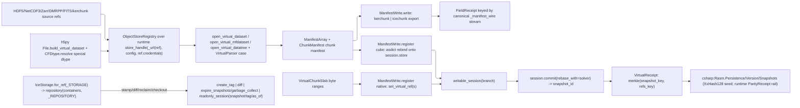

# [PY_DATA_VIRTUAL]

The sole manifest-cube owner: virtualizarr byte-range manifest construction AND icechunk native virtual-chunk addressing on one page. `FieldVirtual` aggregates archival chunk byte ranges into one zero-copy virtual `xarray.Dataset` — the actual bytes stay in the source files — and `VirtualReference` registers those external byte ranges as virtual chunks inside one transactional versioned `icechunk` `Repository`, never copying a byte. `ManifestWrite` is the one export/registration axis: one manifest vocabulary spanning the reference-document export, the session-store lowering, and the raw-slab registration, both folds returning the rail so an arm handed the direction it does not serve refuses typed rather than raising into the enclosing lift.

Every content key is canonical bytes per the folder key-law — sorted per-variable `path offset length` rows, `snapshot.encode()`, the joined-refs stream — never a `repr()`/`str()` source. The committed snapshot's branch/tag/ancestry identity and the `set_virtual_ref` content-key cross at the wire to `csharp:Rasm.Persistence/Version/Snapshots` as the durable version-control concern, and the cross-runtime snapshot-seed reproduction grades through the runtime `evidence/reproduction` `ParityReceipt` rail from the C#-pinned `XxHash128` seed, never hand-proven here. `icechunk` ships cp312-abi3 stable-ABI wheels, so it imports module-top — the function-local gate posture is the rejected form.

## [01]-[INDEX]

- [02]-[MANIFEST]: the absorbed `FieldVirtual` byte-range virtual-datacube owner — the `VirtualParser` seam, the `h5py` native path, the `CFDtype` seam, the canonical manifest wire keying the `FieldReceipt`.
- [03]-[VIRTUAL]: the `VirtualReference` icechunk owner — the `VersionOp` request axis over one `apply` dispatch and its awaitable twin, the `IceStorage` scheme table, the `ConflictSolver` auto-rebase commit, the Merkle-keyed `VirtualReceipt`.

## [02]-[MANIFEST]

- Owner: `FieldVirtual` — the byte-range virtual-datacube owner; the CF read/select/egress plane stays `gridded/field`, imported strictly downward for the `FieldReceipt` family this fold mints. Every `open_virtual_*` call carries an `ObjectStoreRegistry` — the mandatory positional, never an optional knob — imported from the canonical `obspec_utils.registry`, never the deprecation-flagged `virtualizarr` re-export, and every handle inside it is built by the runtime `store_handle` fold off each SOURCE ref's own `credentials` column, so the registry inherits the branch retry envelope and per-source credential custody rather than opening a second bare construction spelling or crediting a mixed manifest with one page-level provider.
- Cases: two manifest-construction paths recovered from the source kind — the `virtualizarr` manifest path and the `h5py` native path — both landing in the same `ManifestArray` chunk manifest; the parser is a `VirtualParser` case, the source-variable type a `CFDtype` case, the export target a `ManifestWrite` case, never a per-format owner or a per-accessor export branch. `CFDtype.inspect` is the total inverse of `resolve` over every case, so an opaque or reference dtype round-trips to its own case rather than collapsing to `plain`.
- Entry: one entrypoint family owns the single-source, multi-source, HDF5-native, and data-tree modalities by source-URL-tuple arity and suffix, never a per-source-count or per-format reader family.
- Receipt: the census folds EVERY `ManifestArray`-backed variable — the `hasattr(var.data, "manifest")` guard skips eagerly-materialized `loadable_variables` slots, never a first-variable-only read that undercounts a multi-variable cube; the `engine="virtual"` stamp is the invariant the icechunk registration path asserts as the provable `Literal["virtual"]`.
- Packages: `virtualizarr` and `h5py` import module-top (both ungated); `check_enum_dtype` returns only the values map, so the `inspect` inverse re-supplies the `"u1"` base.
- Growth: a new source format is one `VirtualParser` case carrying that parser's constructor payload; a new export target one `ManifestWrite` case; a new CF special type one `CFDtype` case; a new fenced leg or refusal law is one `FaultRow` row under `DataLeg.VIRTUAL` in this module's one `RAISES` table, which both sections anchor on; zero new surface.
- Boundary: this page is the one virtualizarr home — no manifest owner survives on `gridded/field`; composes the `gridded/field#EGRESS` `FieldReceipt` family downward and the `gridded/store#STORE` Zarr egress, never re-minting either; a data-copying ingest where virtual reference applies is the rejected form. The `tests/contracts/manifest.json` `hdf5-exchange/field` raw-container case virtualizes through the existing `hdf` parser arm with zero new case — the parser names the scale-less axes phony, so the case's `python:data/gridded/virtual#MANIFEST` consumer actor already owns this byte-range leg.

```python signature
from typing import TYPE_CHECKING, Final, Literal, assert_never

import numpy as np
import virtualizarr as vz
from beartype import beartype
from expression import Error, Ok, case, tag, tagged_union
from expression.collections import Block
from icechunk import VirtualChunkSpec
from msgspec import Struct, structs
from obspec_utils.registry import ObjectStoreRegistry
from obstore.exceptions import BaseError
from opentelemetry import trace

lazy import h5py
lazy import xarray as xr

from rasm.data.gridded.field import FieldReceipt
from rasm.data.tabular.interop import DataLeg
from rasm.runtime.faults import FAULT_CONF, TERMINAL, TRANSIENT, Catch, FaultRow, RuntimeRail, boundary, rostered, scoped
from rasm.runtime.identity import ContentIdentity
from rasm.runtime.roots import ResourceRef, store_handle
from virtualizarr.parsers import (
    DMRPPParser,
    FITSParser,
    HDFParser,
    IcechunkParser,
    KerchunkJSONParser,
    KerchunkParquetParser,
    NetCDF3Parser,
    ZarrParser,
)

if TYPE_CHECKING:
    from collections.abc import Sequence

    from icechunk import Session


_TRACER: Final = scoped(trace.get_tracer, "rasm.data.gridded.virtual")

type Combine = Literal["by_coords", "nested"]
type Coordinates = tuple[int, ...]
type KerchunkFormat = Literal["dict", "json", "parquet"]
type MfParallel = Literal[False, "dask", "lithops"]
type MaxShape = tuple[int | None, ...]
type StoreConfig = dict[str, object]
type Slab = tuple[str, str, tuple[int, ...], tuple[slice, ...]]

# the manifest plane's raise surface. `obstore`'s `BaseError` is NAMED because every leaf under it roots at bare
# `Exception` — the registry walks archival sources over object-store handles, so a not-found, permission, or
# precondition refusal on a signed href reaches no builtin ancestor and `transport/roots#RESOURCE` states none is a
# `CLASSIFY` row either. `virtualizarr` mints ONE class of its own, `SubChunkIndexingError`, a `ValueError` refinement
# the ancestor admits; the rest of its refusals are `ValueError`/`TypeError`/`NotImplementedError` over an unlowerable
# chunk pattern, `ImportError` where an optional parser dependency is absent, and `RuntimeError`/`OSError` from the
# reader beneath. `h5py` answers `OSError` for a library or driver fault, `KeyError` for an absent name, and
# `TypeError`/`ValueError` for a dtype or layout mismatch, exactly as its catalogue documents, so the native mint
# rides the same set. `obspec_utils` raises `ValueError` on an unresolvable or schemeless url.
_MANIFEST_RAISES: Final[Catch] = (
    BaseError,
    ImportError,
    IndexError,
    KeyError,
    NotImplementedError,
    RuntimeError,
    TypeError,
    ValueError,
    OSError,
)

# this module's whole raise roster, seated once for both sections: every fenced leg and every explicit refusal on this
# page resolves ONE anchor here, so no call site spells a subject and `FaultRow.seated` proves the leg against a real
# module at import. The manifest walks and the version verbs declare TRANSIENT — a store, driver, or repository fault
# a re-issue may clear — while the fold-direction refusal is caller-repairable and TERMINAL.
MANIFEST_WALK: Final[FaultRow[DataLeg]] = FaultRow(
    leg=DataLeg.VIRTUAL, point="manifest", arm="boundary", defect="manifest-walk", retriability=TRANSIENT
)
MANIFEST_TREE: Final[FaultRow[DataLeg]] = FaultRow(
    leg=DataLeg.VIRTUAL, point="manifest.tree", arm="boundary", defect="tree-walk", retriability=TRANSIENT
)
MANIFEST_NATIVE: Final[FaultRow[DataLeg]] = FaultRow(
    leg=DataLeg.VIRTUAL, point="manifest.native", arm="boundary", defect="native-mint", retriability=TRANSIENT
)
# ONE parameterized row for both halves of the same law — a `ManifestWrite` arm handed the fold its own direction does
# not serve — because an export case reaching `register` and a registration case reaching `write` are one defect
# reading two coordinates. The deleted pair of `raise ValueError`s crossed the enclosing lift as unclassified
# `boundary` faults, so a caller's own composition error arrived wearing a provider's classification.
MANIFEST_DIRECTION: Final[FaultRow[DataLeg]] = FaultRow(
    leg=DataLeg.VIRTUAL, point="manifest.fold", arm="config", defect="wrong-fold", retriability=TERMINAL, slots=("case", "fold")
)
VERSION_APPLY: Final[FaultRow[DataLeg]] = FaultRow(
    leg=DataLeg.VIRTUAL, point="version", arm="boundary", defect="version-refused", retriability=TRANSIENT
)
RAISES: Final[Block[FaultRow[DataLeg]]] = rostered(Block.of_seq([
    MANIFEST_WALK,
    MANIFEST_TREE,
    MANIFEST_NATIVE,
    MANIFEST_DIRECTION,
    VERSION_APPLY,
]))


@tagged_union(frozen=True)
class CFDtype:
    tag: Literal["plain", "string", "vlen", "enum", "opaque", "ref"] = tag()
    plain: str = case()
    string: int | None = case()
    vlen: str = case()
    enum: tuple[dict[str, int], str] = case()
    opaque: str = case()
    ref: bool = case()

    def resolve(self) -> object:
        match self:
            case CFDtype(tag="plain", plain=name):
                return name
            case CFDtype(tag="string", string=length):
                return h5py.string_dtype(encoding="utf-8", length=length)
            case CFDtype(tag="vlen", vlen=base):
                return h5py.vlen_dtype(base)
            case CFDtype(tag="enum", enum=(values, base)):
                return h5py.enum_dtype(values, basetype=base)
            case CFDtype(tag="opaque", opaque=descr):
                return h5py.opaque_dtype(np.dtype(descr))
            case CFDtype(tag="ref", ref=_):
                return h5py.ref_dtype
            case unreachable:
                assert_never(unreachable)

    @staticmethod
    def inspect(dtype: object) -> "CFDtype":
        if (enum := h5py.check_enum_dtype(dtype)) is not None:
            return CFDtype(enum=(enum, "u1"))
        if (info := h5py.check_string_dtype(dtype)) is not None:
            return CFDtype(string=info.length)
        if (base := h5py.check_vlen_dtype(dtype)) is not None:
            return CFDtype(vlen=str(base))
        if (opaque := h5py.check_opaque_dtype(dtype)) is not None and opaque:
            return CFDtype(opaque=str(dtype))
        if h5py.check_ref_dtype(dtype) is not None:
            return CFDtype(ref=True)
        return CFDtype(plain=str(dtype))


@tagged_union(frozen=True)
class VirtualParser:
    tag: Literal["hdf", "netcdf3", "zarr", "dmrpp", "fits", "kerchunk_json", "kerchunk_parquet", "icechunk"] = tag()
    hdf: tuple[str | None, tuple[str, ...]] = case()
    netcdf3: tuple[str | None, tuple[str, ...], dict[str, object] | None] = case()
    zarr: tuple[str | None, tuple[str, ...]] = case()
    dmrpp: tuple[str | None, tuple[str, ...]] = case()
    fits: tuple[str | None, tuple[str, ...], dict[str, object] | None] = case()
    kerchunk_json: tuple[str | None, str | None, tuple[str, ...]] = case()
    kerchunk_parquet: tuple[str | None, str | None, tuple[str, ...], dict[str, object] | None] = case()
    icechunk: tuple[str | None, str | None, str | None, str | None, tuple[str, ...], int | None] = case()

    @staticmethod
    def for_source(url: str) -> "VirtualParser":
        match url.rsplit(".", 1)[-1].lower():
            case "zarr":
                return VirtualParser(zarr=(None, ()))
            case "nc3" | "cdl":
                return VirtualParser(netcdf3=(None, (), None))
            case "dmrpp":
                return VirtualParser(dmrpp=(None, ()))
            case "fits":
                return VirtualParser(fits=(None, (), None))
            case "json":
                return VirtualParser(kerchunk_json=(None, None, ()))
            case "parq" | "parquet":
                return VirtualParser(kerchunk_parquet=(None, None, (), None))
            case _:
                return VirtualParser(hdf=(None, ()))

    def build(self) -> object:
        match self:
            case VirtualParser(tag="hdf", hdf=(group, drop)):
                # Omission is load-bearing: VirtualiZarr supplies `BlockStoreReader`; an explicit `None` replaces the
                # callable default and fails only when the parser first opens a source.
                return HDFParser(group=group, drop_variables=list(drop))
            case VirtualParser(tag="netcdf3", netcdf3=(group, skip, reader_options)):
                return NetCDF3Parser(group=group, skip_variables=list(skip), reader_options=reader_options)
            case VirtualParser(tag="zarr", zarr=(group, skip)):
                return ZarrParser(group=group, skip_variables=list(skip))
            case VirtualParser(tag="dmrpp", dmrpp=(group, skip)):
                return DMRPPParser(group=group, skip_variables=list(skip))
            case VirtualParser(tag="fits", fits=(group, skip, reader_options)):
                return FITSParser(group=group, skip_variables=list(skip), reader_options=reader_options)
            case VirtualParser(tag="kerchunk_json", kerchunk_json=(group, fs_root, skip)):
                return KerchunkJSONParser(group=group, fs_root=fs_root, skip_variables=list(skip))
            case VirtualParser(tag="kerchunk_parquet", kerchunk_parquet=(group, fs_root, skip, reader_options)):
                return KerchunkParquetParser(group=group, fs_root=fs_root, skip_variables=list(skip), reader_options=reader_options)
            case VirtualParser(tag="icechunk", icechunk=(branch, tag_, snapshot, group, skip, batch)):
                return IcechunkParser(branch=branch, tag=tag_, snapshot_id=snapshot, group=group, skip_variables=list(skip), batch_size=batch)
            case unreachable:
                assert_never(unreachable)


class VirtualChunkSlab(Struct, frozen=True):
    array_path: str
    coordinates: Coordinates
    location: str
    offset: int
    length: int
    checksum: str | None = None

    def spec(self) -> VirtualChunkSpec:
        return VirtualChunkSpec(
            index=list(self.coordinates), location=self.location, offset=self.offset, length=self.length, etag_checksum=self.checksum
        )

    def key(self) -> str:
        return "/".join((self.array_path, "c", *(str(c) for c in self.coordinates)))


@tagged_union(frozen=True)
class ManifestWrite:
    # the ONE export/registration axis: `kerchunk`/`icechunk` the EXPORT direction (the `write`
    # fold over the vz accessors), `cube`/`native` the REGISTRATION direction (the
    # `register` fold onto the icechunk session store) — one manifest vocabulary, two folds.
    tag: Literal["kerchunk", "icechunk", "cube", "native"] = tag()
    kerchunk: tuple[KerchunkFormat, int | None, int | None] = case()
    icechunk: tuple[object, str | None, str | None, str | None, tuple[object, ...] | None, bool, str | None, bool] = case()
    cube: "FieldVirtual" = case()
    native: tuple[str, tuple[VirtualChunkSlab, ...]] = case()

    def write(self, cube: "xr.Dataset | xr.DataTree", target: ResourceRef) -> "RuntimeRail[None]":
        # the fold returns the rail so its ONE wrong-direction arm answers the roster row rather than raising into the
        # enclosing lift; `_receipt` binds it ahead of the identity fold, so a misrouted arm never keys bytes it
        # refused to write.
        is_tree = isinstance(cube, xr.DataTree)
        match self:
            # the `VirtualiZarrDataTreeAccessor` exposes no `to_kerchunk`, so a tree sink flattens
            # to one `Dataset` for the kerchunk reference document; only `to_icechunk` survives the
            # group hierarchy, its tree-accessor keyword `write_inherited_coords`, never the
            # dataset accessor's `append_dim`/`region`.
            case ManifestWrite(tag="kerchunk", kerchunk=(fmt, record_size, threshold)):
                flat = cube.to_dataset() if is_tree else cube
                flat.vz.to_kerchunk(str(target.path), format=fmt, record_size=record_size, categorical_threshold=threshold)
                return Ok(None)
            case ManifestWrite(tag="icechunk", icechunk=(store, _, mode, _, _, validate, updated_at, inherited)) if is_tree:
                cube.vz.to_icechunk(store, mode=mode, write_inherited_coords=inherited, validate_containers=validate, last_updated_at=updated_at)
                return Ok(None)
            case ManifestWrite(tag="icechunk", icechunk=(store, group, mode, append_dim, region, validate, updated_at, _)):
                cube.vz.to_icechunk(
                    store, group=group, mode=mode, append_dim=append_dim, region=region, validate_containers=validate, last_updated_at=updated_at
                )
                return Ok(None)
            case ManifestWrite(tag="cube" | "native"):
                return Error(MANIFEST_DIRECTION.raised(self.tag, "write"))
            case unreachable:
                assert_never(unreachable)

    def register(self, session: "Session") -> "RuntimeRail[tuple[tuple[str, ...], VirtualEngine, int]]":
        match self:
            case ManifestWrite(tag="cube", cube=spec):
                # the asdict strip-and-rebind: only the `export` slot overrides (to the icechunk
                # case over THIS session's store); every other field rides through unchanged.
                fields = {key: value for key, value in structs.asdict(spec).items() if key != "export"}
                lowered = FieldVirtual(**fields, export=ManifestWrite(icechunk=(session.store, None, None, None, None, True, None, False))).aggregate()
                return lowered.map(lambda r: (tuple(r.dims), "virtual", r.bytes_stored))
            case ManifestWrite(tag="native", native=(array_path, (slab,))):
                session.store.set_virtual_ref(
                    slab.key(), slab.location, offset=slab.offset, length=slab.length, checksum=slab.checksum, validate_container=True
                )
                return Ok(((array_path,), "native", slab.length))
            case ManifestWrite(tag="native", native=(array_path, slabs)):
                session.store.set_virtual_refs(array_path, [slab.spec() for slab in slabs], validate_containers=True)
                return Ok(((array_path,), "native", sum(slab.length for slab in slabs)))
            case ManifestWrite(tag="kerchunk" | "icechunk"):
                return Error(MANIFEST_DIRECTION.raised(self.tag, "register"))
            case unreachable:
                assert_never(unreachable)

    @staticmethod
    def nbytes(cube: "xr.Dataset") -> int:
        return int(cube.vz.nbytes)


class FieldVirtual(Struct, frozen=True):
    # `sources` are credential-bearing REFS, never bare URLs: a manifest over signed archival assets walks their
    # headers under the same token custody that signed each href, refreshing inside the handle rather than expiring
    # mid-walk. The credential rides each source's own coordinate because a manifest spans MANY residences — a page
    # field would credential every source with one provider, and `target` credentials the egress residence, which is
    # a different store entirely. Both survive the `asdict` rebind, so a registration lowering carries them unchanged.
    sources: tuple[ResourceRef, ...]
    target: ResourceRef
    concat_dim: str = "time"
    combine: Combine = "by_coords"
    parallel: MfParallel = False
    export: ManifestWrite = ManifestWrite(kerchunk=("parquet", None, None))
    store_config: StoreConfig | None = None

    @beartype(conf=FAULT_CONF)
    def aggregate(self) -> "RuntimeRail[FieldReceipt]":
        # manifest construction walks archival headers over the object store — a spanned I/O leg, trace parity with the
        # sibling gridded/spatial legs; the fence inside marks the span ERROR + record_exception on a failed leg.
        with _TRACER.start_as_current_span("virtual.manifest", attributes={"rasm.virtual.sources": len(self.sources)}):
            return boundary(MANIFEST_WALK, lambda: _aggregate(self), catch=_MANIFEST_RAISES).bind(lambda railed: railed)

    @beartype(conf=FAULT_CONF)
    def tree(self, group: str | None = None) -> "RuntimeRail[FieldReceipt]":
        with _TRACER.start_as_current_span("virtual.manifest.tree", attributes={"rasm.virtual.sources": len(self.sources)}):
            return boundary(MANIFEST_TREE, lambda: _tree(self, group), catch=_MANIFEST_RAISES).bind(lambda railed: railed)

    @staticmethod
    @beartype(conf=FAULT_CONF)
    def from_native(
        slabs: "tuple[Slab, ...]",
        shape: tuple[int, ...],
        dtype: CFDtype,
        target: ResourceRef,
        *,
        maxshape: MaxShape | None = None,
        fillvalue: object | None = None,
        export: ManifestWrite = ManifestWrite(kerchunk=("parquet", None, None)),
    ) -> "RuntimeRail[FieldReceipt]":
        # `_native_file` writes the HDF5 virtual dataset AT the target, so the written file IS the target residence:
        # the source ref is `target` itself, carrying whatever credential the caller stamped on that coordinate.
        def _built() -> "RuntimeRail[FieldReceipt]":
            _native_file(slabs, shape, dtype, target, maxshape, fillvalue)
            return _aggregate(FieldVirtual(sources=(target,), target=target, export=export))

        return boundary(MANIFEST_NATIVE, _built, catch=_MANIFEST_RAISES).bind(lambda railed: railed)


def _url(ref: ResourceRef) -> str:
    # the registry, the parsers, and every `open_virtual_*` positional take a URL string; the ref is what CARRIES it
    # plus its credential, so one projection serves all three and no call site re-joins two values. `as_uri()` is
    # load-bearing: obspec rejects a bare local path because every registry key requires an explicit scheme.
    return ref.path.as_uri()


def _registry(sources: "Sequence[ResourceRef]", config: StoreConfig | None) -> object:
    # Registry keys are STORE prefixes while parser URLs are OBJECT coordinates. Registering `_url(ref)` against a
    # handle opened at that same full object makes longest-prefix resolution return the empty object key. The ref's
    # own root/relative split is the one authority for both sides, and `store_handle(ref)` retains its credential.
    roots = tuple((ref.root, ref) for ref in sources)
    if any(left == right and first.credentials is not second.credentials for index, (left, first) in enumerate(roots) for right, second in roots[index + 1 :]):
        raise ValueError("one store root cannot carry multiple credential providers inside one ObjectStoreRegistry")
    unique = {root: ref for root, ref in roots}
    return ObjectStoreRegistry({root: store_handle(ref, config=config) for root, ref in unique.items()})


def _open_virtual(spec: FieldVirtual) -> "xr.Dataset":
    registry = _registry(spec.sources, spec.store_config)
    urls = [_url(ref) for ref in spec.sources]
    parser = VirtualParser.for_source(urls[0]).build()
    if len(urls) > 1:
        return vz.open_virtual_mfdataset(
            urls, registry=registry, parser=parser, concat_dim=spec.concat_dim, combine=spec.combine, parallel=spec.parallel
        )
    return vz.open_virtual_dataset(urls[0], registry=registry, parser=parser)


def _manifest_wire(name: str, manifest: dict[str, dict[str, object]]) -> bytes:
    # the CANONICAL per-variable manifest bytes: sorted chunk-key rows of `path offset length`,
    # one line each — a deterministic wire the `stream` identity modality folds; `repr(dict)` is
    # the deleted byte source (non-canonical ordering and quoting), the folder key-law.
    rows = (f"{name}/{key} {entry['path']} {entry['offset']} {entry['length']}" for key, entry in sorted(manifest.items()))
    return "\n".join(rows).encode()


def _receipt(sink: "xr.Dataset | xr.DataTree", stats: "xr.Dataset", export: "ManifestWrite", target: ResourceRef) -> "RuntimeRail[FieldReceipt]":
    # the export rail binds AHEAD of the census, so a refused direction sheds the identity fold instead of keying a
    # manifest whose bytes never landed.
    def _keyed(_landed: None) -> "RuntimeRail[FieldReceipt]":
        manifests = [
            _manifest_wire(str(name), var.data.manifest.dict()) for name, var in stats.data_vars.items() if hasattr(var.data, "manifest")
        ]
        return ContentIdentity.of("virtual.manifest", manifests).map(
            lambda key: FieldReceipt(
                engine="virtual", dims=tuple(stats.sizes), variables=len(stats.data_vars), bytes_stored=ManifestWrite.nbytes(stats), content_key=key
            )
        )

    return export.write(sink, target).bind(_keyed)


def _aggregate(spec: FieldVirtual) -> "RuntimeRail[FieldReceipt]":
    cube = _open_virtual(spec)
    return _receipt(cube, cube, spec.export, spec.target)


def _tree(spec: FieldVirtual, group: str | None) -> "RuntimeRail[FieldReceipt]":
    registry = _registry(spec.sources, spec.store_config)
    head = _url(spec.sources[0])
    parser = VirtualParser.for_source(head).build()
    tree = vz.open_virtual_datatree(head, registry=registry, parser=parser)
    if group is not None:
        node = tree[group].dataset
        return _receipt(node, node, spec.export, spec.target)
    return _receipt(tree, tree.to_dataset(), spec.export, spec.target)


def _native_file(
    slabs: "Sequence[Slab]", shape: tuple[int, ...], dtype: CFDtype, target: ResourceRef, maxshape: MaxShape | None, fillvalue: object | None
) -> str:
    resolved = dtype.resolve()
    with (
        h5py.File(str(target.path), "w") as sink,
        sink.build_virtual_dataset(name="data", shape=shape, dtype=resolved, maxshape=maxshape, fillvalue=fillvalue) as layout,
    ):
        for path, name, source_shape, region in slabs:
            layout[region] = h5py.VirtualSource(path, name=name, shape=source_shape, dtype=resolved)
    return str(target.path)
```

## [03]-[VIRTUAL]

- Owner: `VirtualReference` — one frozen owner; the destination `IceStorage` backend is recovered per call from the `ResourceRef` scheme rather than stored, the virtual-chunk credential map threads once at the `open_or_create(authorize_virtual_chunk_access=)` lifecycle keyword rather than per `set_virtual_ref` call, and the version modality rides the `VersionOp` case the `apply` entrypoint takes rather than a stored write field.
- Entry: `run` returns `RuntimeRail[VirtualOutcome]` — the verbs produce genuinely irreducible outcomes no fold collapses to one shape, so the named union is what the caller `match`es, never a bare `object` erasure; `apply` fences the raising `icechunk` calls in one boundary and `.bind`s away the doubled rail, and `apply_async` is its awaitable twin over one `on_thread` band hop — a blocking repository call never runs inline on a caller's loop, and it is the one seat this owner lands durable evidence from, since recording suspends by law where a synchronous entry cannot.
- Law: the committing outcome lands durable evidence on the `python:runtime/observability/journal#LEDGER` plane — one operational `AuditFact` carrying the snapshot and branch arrival as a typed diff, plus a `STORAGE` `MeterFact` over the bytes this commit made addressable. It identifies itself by the receipt shape it alone answers rather than a re-derived tag, and the read verbs evidence nothing because they mutate nothing. Referenced bytes are the storage fact precisely because a manifest copies none of them, which is also why the live series meters the reference COUNT instead — the two report different quantities of one commit by design, and neither re-mints the other.
- Auto: a concurrent branch write auto-rebases at commit through `session.commit(rebase_with=)` under the supplied `ConflictSolver`, never a serialized retry loop; the content key materializes the snapshot-identity and registered-location component keys first, then Merkle-folds the resolved pair — the materialized-component idiom — never a nested rail the fold cannot key.
- Receipt: the Merkle fold spans snapshot identity AND registered-location census, so a snapshot rewrite preserving the locations and a relocation preserving the snapshot id are distinct keys; the census tuple materializes once and feeds both the count and the location key, never a double walk of the lazy iterator. The `stamp`/`diff`/`reclaim`/`checkout` cases emit no `VirtualReceipt` — the typed receipt fold is the `aggregate` case alone, and the `VirtualEngine` discriminant rides the receipt subject so the cube-versus-native path survives onto the log line.
- Packages: `_REPOSITORY` is the one `RepositoryConfig` every `open_or_create` binds — the repository's Rust-core store I/O is the one leg the runtime `store_handle` envelope cannot reach, so its `StorageRetriesSettings`/`StorageTimeoutSettings` derive from the branch `STORE_RETRIES`/`STORE_TIMEOUT` constants rather than running provider defaults beside a manifest walk that carries them, and `ManifestSplittingConfig`/`ManifestPreloadConfig` shard and bound the ref table one session open otherwise pays whole. Its `split_sizes` is a SEQUENCE of `(node-condition, sequence-of-(dim-condition, size))` pairs, never the mapping its shape reads as. The icechunk S3-family storage rows carry `from_env=` credential resolution — the `azure` `account` and `r2` `account_id` secondary identities resolve from the environment under `from_env=True`, never an `r.root` aliased onto two identity slots; `containers_credentials` values are the `AnyCredential` factory-return union, never a raw token tuple.
- Growth: a new manifest shard axis is one `split_sizes` row narrowing `ManifestSplitCondition.PathMatches`/`NameMatches` against `ManifestSplitDimCondition.DimensionName`/`Axis`, and every other repository axis (caching budget, inline-chunk threshold, virtual-chunk containers, compression level) is a caller-supplied `RepositoryConfig` replacing the value whole with zero owner edits; a new storage backend is one `IceStorage` case plus one `_STORAGE` scheme row; a new export or registration path one `ManifestWrite` case; a new version operation (branch reset through `reset_branch`, snapshot rewrite through `rewrite_manifests`, the conflict rail through `Session.rebase`) is one `VersionOp` case composing the matching `Repository` member; a new reclaim modality one `Reclaim` case, a new time-travel anchor one `ReadAt` case; a new repository refusal law one `FaultRow` row beside `VERSION_APPLY`; zero new surface.
- Boundary: an `open_or_create` binding no `config` is the deleted form — the repository then re-dials and times out under provider defaults while the manifest walk against the same bucket carries the branch envelope, and the ref table shards nowhere. The durable git-like version-control ENGINE — branch-merge policy, retention orchestration, the reuse ledger — stays C# Persistence; this page emits only the snapshot identity as receipt key and consumes icechunk's native diff/reclaim/rebase-at-commit, the `ConflictSolver` a commit-time policy value, never a merge engine. The `ReadAt` case named `label` avoids the `expression.tag()` reserved discriminant, never a `tag_`-suffix mangle.

```python signature
from typing import TYPE_CHECKING, Final, Literal, assert_never

import icechunk as ic
from expression import Error, Ok, Result, case, tag, tagged_union
from expression.collections import Block, Map
from icechunk import VirtualChunkSpec
from msgspec import Struct

lazy import xarray as xr

from rasm.runtime.faults import Catch, RuntimeRail, async_boundary, boundary, railed, scoped
from rasm.runtime.identity import ContentIdentity, ContentKey
from rasm.runtime.journal import Actor, Assigned, AuditFact, Fact, Journal, MeterFact, Party, Resource, Retain
from rasm.runtime.lanes import on_thread
from rasm.runtime.metrics import Metrics
from rasm.runtime.receipts import DEFAULT_SCOPE, Receipt, ScopeKey
from rasm.runtime.roots import STORE_BACKENDS, STORE_RETRIES, STORE_TIMEOUT, Backend, ResourceRef

if TYPE_CHECKING:
    import datetime as dt
    from collections.abc import Callable, Iterable

    from icechunk import AnyCredential, ConflictSolver, Diff, GCSummary, Repository, RepositoryConfig, Session, Storage


type CommitMeta = dict[str, str]
type ContainerAuth = "tuple[tuple[str, AnyCredential], ...]"
type VirtualEngine = Literal["virtual", "native"]

# the repository plane's raise surface: `IcechunkError` is NAMED because it roots at bare `Exception` and every
# refusal the verbs reach descends from it — `ConflictError`/`RebaseFailedError` at commit, `SessionStateError` on a
# spent session, `StorageError`/`ReadOnlyError`/`AlreadyExistsError` at the store, and the `NotFoundError` family for
# an absent snapshot, ref, or repository. Two of its leaves DO refine a builtin (`InvalidInputError` a `ValueError`,
# `NotFoundError` a `KeyError`), which is exactly why the root and not the builtins carries the set. The Rust core
# owns its own store I/O, so no object-store root crosses this fence the way it does the manifest walk above.
_VERSION_RAISES: Final[Catch] = (ic.IcechunkError, KeyError, TypeError, ValueError, OSError)

# this owner's metric segment and receipt owner label, spelled once. It shares a SPELLING with the `virtual` member
# of `VirtualEngine` and nothing else: the engine names which registration path built a cube, this names the
# partition and series every commit here reports under, and a reader conflating them mistakes a native-slab commit
# for one under a foreign owner.
DOMAIN: Final[str] = "virtual"
type VirtualOutcome = "VirtualReceipt | str | Diff | set[str] | GCSummary | xr.Dataset"

# chunk-refs per manifest shard, a DECLARED tuning a deployment reads and a tuning pass edits, never a measurement:
# one manifest per array grows linear in chunk count, so an unsplit petabyte-scale cube pays the whole ref table on
# every session open. The same number gates preload, so a shard small enough to load is exactly a shard preloaded.
_SPLIT_CHUNKS: Final[int] = 65_536

# the icechunk repository's OWN store policy. `Storage` is icechunk's Rust core rather than an `obstore` handle, so
# the runtime `store_handle` envelope every other remote leg in this branch carries never reaches it — an
# unconfigured repository re-dials and times out under provider defaults no page states, diverging from the manifest
# walk running beside it against the same bucket. `RepositoryConfig` IS the vocabulary and a branch-local mirror of
# its nested settings would be the rename wrapper, so this is ONE module-level VALUE a caller takes or replaces
# whole, its retry and timeout axes DERIVED from the branch constants rather than re-asserted here. Manifest
# splitting is the load-bearing axis at cube scale: `split_sizes` is a SEQUENCE of `(node-condition,
# sequence-of-(dim-condition, size))` pairs — a mapping raises `TypeError: 'dict' object is not an instance of
# 'Sequence'` — so a cube sharded along the axis its readers predicate on is one row, `AnyArray()`/`Any()` the
# whole-repository default and `PathMatches`/`DimensionName` the narrowing this row family grows by.
_REPOSITORY: "Final[RepositoryConfig]" = ic.RepositoryConfig(
    storage=ic.StorageSettings(
        retries=ic.StorageRetriesSettings(max_tries=STORE_RETRIES),
        timeouts=ic.StorageTimeoutSettings(read_timeout_ms=int(STORE_TIMEOUT * 1000), operation_timeout_ms=int(STORE_TIMEOUT * 1000)),
    ),
    manifest=ic.ManifestConfig(
        splitting=ic.ManifestSplittingConfig(
            split_sizes=[(ic.ManifestSplitCondition.AnyArray(), [(ic.ManifestSplitDimCondition.Any(), _SPLIT_CHUNKS)])]
        ),
        preload=ic.ManifestPreloadConfig(preload_if=ic.ManifestPreloadCondition.num_refs(0, _SPLIT_CHUNKS)),
    ),
)

# icechunk constructor per BRANCH BACKEND, keyed by the `StoreBackend` row family's own classification column so
# this page states one constructor per residence class and no scheme at all.
_ICE_BACKEND: "Final[Map[Backend, Callable[[ResourceRef], IceStorage]]]" = Map.of_seq([
    ("s3", lambda r: IceStorage(s3=(r.root, r.relative, None))),
    ("gcs", lambda r: IceStorage(gcs=(r.root, r.relative))),
    ("azure", lambda r: IceStorage(azure=(r.root, r.relative, None))),
    ("http", lambda r: IceStorage(http=r.root)),
    ("local", lambda r: IceStorage(local=str(r.path))),
    ("memory", lambda r: IceStorage(memory=None)),
])

# scheme -> constructor, DERIVED off the row family's own alias sets exactly as the sibling `gridded/store` derives
# its kvstore drivers. A hand-listed roster beside that family is the second scheme roster the runtime owner's
# boundary rejects, and it silently dropped `s3a`, `abfss`, and `azure` — every one of which the family classifies as
# a remote residence and every one of which then fell through to the local row, opening a LOCAL FILESYSTEM
# repository for a cloud residence. `r2` and `tigris` are icechunk's own S3-compatible vendors that the family
# carries no row for, so they seat as explicit rows beside the derivation rather than forcing it flat.
_STORAGE: "Final[Map[str, Callable[[ResourceRef], IceStorage]]]" = Map.of_seq([
    *((alias, _ICE_BACKEND[row.backend]) for row in STORE_BACKENDS for alias in row.aliases),
    ("r2", lambda r: IceStorage(r2=(r.root, r.relative, None))),
    ("tigris", lambda r: IceStorage(tigris=(r.root, r.relative))),
])


@tagged_union(frozen=True)
class IceStorage:
    tag: Literal["local", "s3", "gcs", "azure", "r2", "tigris", "http", "memory"] = tag()
    local: str = case()
    s3: tuple[str, str, str | None] = case()
    gcs: tuple[str, str] = case()
    azure: tuple[str, str, str | None] = case()
    r2: tuple[str, str, str | None] = case()
    tigris: tuple[str, str] = case()
    http: str = case()
    memory: None = case()

    @staticmethod
    def for_ref(ref: ResourceRef) -> "IceStorage":
        # an unclassified scheme falls to the local row through the SAME spelling the derivation uses, since a path
        # this branch cannot classify is a filesystem path; what makes that fallback safe is the derivation above
        # carrying every classified cloud alias, rather than a hand roster leaving three of them to reach it.
        return _STORAGE.try_find(ref.scheme).default_value(_ICE_BACKEND["local"])(ref)

    def build(self) -> "Storage":
        match self:
            case IceStorage(tag="local", local=path):
                return ic.local_filesystem_storage(path)
            case IceStorage(tag="s3", s3=(bucket, prefix, region)):
                return ic.s3_storage(bucket=bucket, prefix=prefix, region=region, from_env=True)
            case IceStorage(tag="gcs", gcs=(bucket, prefix)):
                return ic.gcs_storage(bucket=bucket, prefix=prefix, from_env=True)
            case IceStorage(tag="azure", azure=(container, prefix, account)):
                return ic.azure_storage(account=account, container=container, prefix=prefix, from_env=True)
            case IceStorage(tag="r2", r2=(bucket, prefix, account_id)):
                return ic.r2_storage(bucket=bucket, prefix=prefix, account_id=account_id, from_env=True)
            case IceStorage(tag="tigris", tigris=(bucket, prefix)):
                return ic.tigris_storage(bucket=bucket, prefix=prefix, from_env=True)
            case IceStorage(tag="http", http=base_url):
                return ic.http_storage(base_url)
            case IceStorage(tag="memory"):
                return ic.in_memory_storage()
            case unreachable:
                assert_never(unreachable)

    def repository(self, containers: ContainerAuth = (), config: "RepositoryConfig" = _REPOSITORY) -> "Repository":
        access = ic.containers_credentials(dict(containers)) if containers else None
        return ic.Repository.open_or_create(self.build(), config=config, authorize_virtual_chunk_access=access)


@tagged_union(frozen=True)
class ReadAt:
    tag: Literal["snapshot", "label", "as_of"] = tag()
    snapshot: str = case()
    label: str = case()
    as_of: "dt.datetime" = case()

    def session(self, repo: "Repository") -> "Session":
        match self:
            case ReadAt(tag="snapshot", snapshot=snapshot_id):
                return repo.readonly_session(snapshot_id=snapshot_id)
            case ReadAt(tag="label", label=name):
                return repo.readonly_session(tag=name)
            case ReadAt(tag="as_of", as_of=moment):
                return repo.readonly_session(branch=None, as_of=moment)
            case unreachable:
                assert_never(unreachable)


@tagged_union(frozen=True)
class Reclaim:
    tag: Literal["expire", "collect"] = tag()
    expire: "dt.datetime" = case()
    collect: "dt.datetime" = case()

    def run(self, repo: "Repository") -> "set[str] | GCSummary":
        match self:
            case Reclaim(tag="expire", expire=older_than):
                return repo.expire_snapshots(older_than)
            case Reclaim(tag="collect", collect=older_than):
                return repo.garbage_collect(older_than)
            case unreachable:
                assert_never(unreachable)


@tagged_union(frozen=True)
class VersionOp:
    tag: Literal["aggregate", "stamp", "diff", "reclaim", "checkout"] = tag()
    aggregate: tuple[ManifestWrite, CommitMeta, "ConflictSolver | None"] = case()
    stamp: tuple[str, str] = case()
    diff: tuple[str, str] = case()
    reclaim: Reclaim = case()
    checkout: ReadAt = case()

    def run(self, repo: "Repository", spec: "VirtualReference") -> "RuntimeRail[VirtualOutcome]":
        match self:
            case VersionOp(tag="aggregate", aggregate=(write, meta, solver)):
                session = repo.writable_session(spec.branch)

                @railed
                def _commit():  # ruff:ignore[missing-return-type-private-function]
                    dims, engine, referenced = yield from write.register(session)
                    refs = tuple(session.all_virtual_chunk_locations())
                    snapshot = session.commit("virtual-reference", metadata=meta, rebase_with=solver)
                    snapshot_key = yield from ContentIdentity.of("virtual.snapshot", snapshot.encode())
                    refs_key = yield from ContentIdentity.of("virtual.refs", "\n".join(refs).encode())
                    content_key = yield from ContentIdentity.of(DOMAIN, (snapshot_key, refs_key))
                    return VirtualReceipt(
                        sources=len(spec.sources),
                        dims=dims,
                        engine=engine,
                        chunk_refs=len(refs),
                        bytes_referenced=referenced,
                        snapshot_id=snapshot,
                        branch=spec.branch,
                        head=repo.lookup_branch(spec.branch),
                        ancestry_depth=sum(1 for _ in repo.ancestry(branch=spec.branch)),
                        content_key=content_key,
                    )

                return _commit()
            case VersionOp(tag="stamp", stamp=(name, snapshot)):
                repo.create_tag(name, snapshot)
                return Ok(name)
            case VersionOp(tag="diff", diff=(base, head)):
                return Ok(repo.diff(from_snapshot_id=base, to_snapshot_id=head))
            case VersionOp(tag="reclaim", reclaim=reclaim):
                return Ok(reclaim.run(repo))
            case VersionOp(tag="checkout", checkout=at):
                return Ok(xr.open_zarr(at.session(repo).store, consolidated=False))
            case unreachable:
                assert_never(unreachable)


class VirtualReceipt(Struct, frozen=True):
    sources: int
    dims: tuple[str, ...]
    engine: VirtualEngine
    chunk_refs: int
    bytes_referenced: int
    snapshot_id: str
    branch: str
    head: str
    ancestry_depth: int
    content_key: ContentKey

    def contribute(self) -> "Iterable[Receipt]":
        # `domain`/`kind`/`key` are the lifted evidence contract the `tabular/lakehouse#LAKEHOUSE` residence reads —
        # the SAME pair handed `Metrics.record` beside the Merkle identity this commit minted — so the durable row
        # lands in the `virtual` partition a predicate prunes and rejoins the live series its twin emitted. The
        # metered quantity is REFERENCES rather than referenced bytes: a manifest copies nothing, so its own volume
        # is the count of byte ranges it addressed, and the bytes column stays receipt evidence the cost fold prices.
        Metrics.record({"rasm.virtual.references": float(self.chunk_refs)}, domain=DOMAIN, kind=self.engine)
        yield Receipt.of(
            DOMAIN,
            (
                "emitted",
                self.engine,
                {
                    "domain": DOMAIN,
                    "kind": self.engine,
                    "key": self.content_key.hex,
                    "sources": self.sources,
                    "chunk_refs": self.chunk_refs,
                    "referenced": self.bytes_referenced,
                    "snapshot": self.snapshot_id,
                    "branch": self.branch,
                    "ancestry": self.ancestry_depth,
                },
            ),
        )


class VirtualReference(Struct, frozen=True):
    # the SAME credential-bearing source refs `FieldVirtual` walks — one caller threads one tuple into both, so the
    # census count and the manifest walk can never disagree about what this commit referenced.
    sources: tuple[ResourceRef, ...]
    ref: ResourceRef
    branch: str = "main"
    containers: ContainerAuth = ()
    # the repository policy as ONE pre-constructed value: a caller tuning a cube's manifest shards, its cache
    # budget, or its inline-chunk threshold replaces the whole `RepositoryConfig` rather than growing a knob tail
    # here, and every axis this page does not decide keeps icechunk's own default rather than a re-asserted number.
    config: "RepositoryConfig" = _REPOSITORY
    # the composition this owner's evidence and signals partition under, taken exactly as every sibling data owner
    # takes it, so an embedded composition's commits never land under its host's scope.
    scope: ScopeKey = DEFAULT_SCOPE

    def apply(self, op: VersionOp) -> "RuntimeRail[VirtualOutcome]":
        # snapshot commit/diff/reclaim run store I/O against the icechunk repository — spanned per verb, the branch a dimension.
        with _TRACER.start_as_current_span(f"{DOMAIN}.{op.tag}", attributes={"rasm.virtual.branch": self.branch}):
            return boundary(
                VERSION_APPLY,
                lambda: op.run(IceStorage.for_ref(self.ref).repository(self.containers, self.config), self),
                catch=_VERSION_RAISES,
            ).bind(lambda rail: rail)

    async def apply_async(self, op: VersionOp) -> "RuntimeRail[VirtualOutcome]":
        # the awaitable twin the sibling `tabular/lakehouse#LAKEHOUSE` and `tabular/egress#EGRESS` owners already
        # split off one body, over one `on_thread` band hop: every verb below is a blocking native repository call,
        # so an async composition reaching `apply` stalls its loop for a whole commit. It is also the ONE seat this
        # owner lands durable evidence from, because recording SUSPENDS by the never-shed law and no synchronous
        # entry can. The record rail binds into the verdict, so an armed evidence plane refusing a commit fact
        # surfaces here and a composition that installed none folds to the lawful no-op.
        railed = await async_boundary(VERSION_APPLY, lambda: on_thread(self.apply, op), catch=_VERSION_RAISES)
        match railed.bind(lambda rail: rail):
            case Result(tag="ok", ok=outcome):
                return (await Journal.record(_evidence(self, outcome), scope=self.scope)).map(lambda _landed: outcome)
            case refused:
                return Error(refused.error)


def _evidence(spec: VirtualReference, outcome: VirtualOutcome) -> "Block[Fact]":
    # only the COMMITTING outcome carries durable evidence, and it identifies itself by the receipt shape it alone
    # answers — a tag test would re-derive a discriminant the outcome already is, and the read verbs (`diff`,
    # `checkout`) mutate nothing to evidence. The meter carries REFERENCED bytes: a manifest copies nothing, so the
    # volume this commit made addressable is the storage fact, exactly as the live series meters its reference
    # count rather than those bytes. The verb spells `<domain>.<operation>` under the runtime producer grammar.
    if not isinstance(outcome, VirtualReceipt):
        return Block.empty()
    audited = AuditFact(
        action=f"{DOMAIN}.aggregate",
        actor=Party(kind=Actor.SERVICE, key=DOMAIN),
        target=Party(kind="repository", key=str(spec.ref.path)),
        retention=Retain.OPERATIONAL,
        change=(
            Assigned(path="/snapshot", next=outcome.snapshot_id),
            Assigned(path="/branch", next=outcome.branch),
        ),
    )
    metered = MeterFact(resource=Resource.STORAGE, quantity=outcome.bytes_referenced, surface=str(spec.ref.path))
    return Block.of_seq((audited, metered) if outcome.bytes_referenced else (audited,))
```


```mermaid
---
config:
  layout: elk
  flowchart:
    curve: linear
    padding: 25
---
flowchart LR
    accTitle: Virtual manifest and reference flow
    accDescr: Manifest aggregation and icechunk registration folding into the version operations and the Merkle-keyed receipt.
    Sources["HDF5/NetCDF3/Zarr/DMRPP/FITS/kerchunk source refs"] --> Registry["ObjectStoreRegistry over runtime store_handle(_url(ref), config, ref.credentials)"]
    Native["h5py File.build_virtual_dataset + CFDtype.resolve special dtype"] --> Registry
    Registry --> Open["open_virtual_dataset / open_virtual_mfdataset / open_virtual_datatree + VirtualParser case"]
    Open --> Manifest["ManifestArray + ChunkManifest chunk manifest"]
    Manifest --> Export["ManifestWrite.write: kerchunk | icechunk export"]
    Export --> FReceipt["FieldReceipt keyed by canonical _manifest_wire stream"]
    Manifest --> Cube["ManifestWrite.register cube: asdict rebind onto session.store"]
    Slabs["VirtualChunkSlab byte ranges"] --> Nat["ManifestWrite.register native: set_virtual_ref(s)"]
    Cube --> Session["writable_session(branch)"]
    Nat --> Session
    Session --> Commit["session.commit(rebase_with=solver) -> snapshot_id"]
    Commit --> VReceipt["VirtualReceipt: merkle(snapshot_key, refs_key)"]
    VReceipt --> Wire["csharp:Rasm.Persistence/Version/Snapshots (XxHash128 seed; runtime ParityReceipt rail)"]
    Repo["IceStorage.for_ref(_STORAGE) -> repository(containers, _REPOSITORY)"] -->|stamp/diff/reclaim/checkout| Version["create_tag | diff | expire_snapshots/garbage_collect | readonly_session(snapshot/tag/as_of)"]
```

## [04]-[RESEARCH]

<!-- source-only: research row template:
[TOKEN]-[OPEN|BLOCKED]: <exact question>; <verification route>.
-->

(none)
