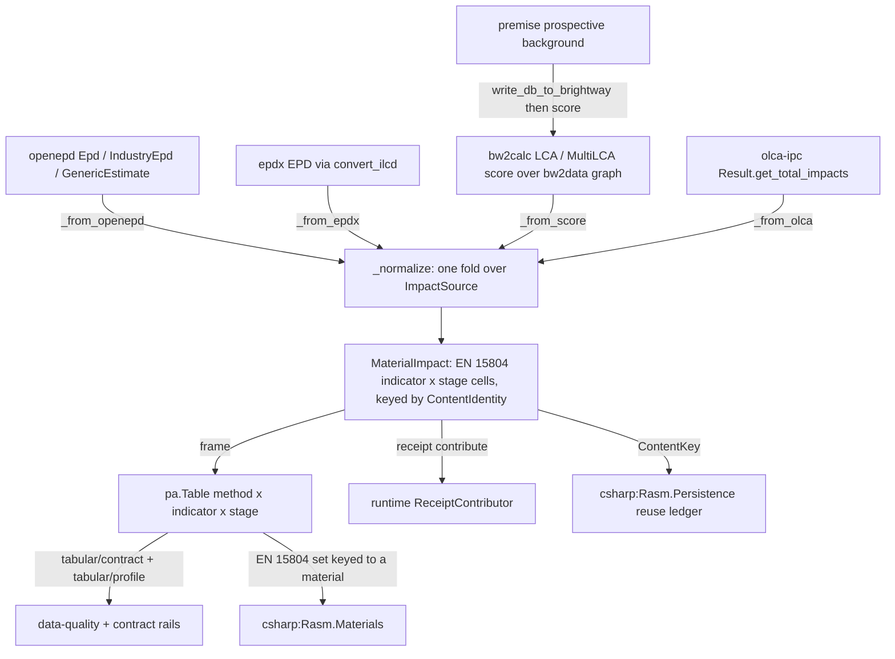

# [PY_DATA_IMPACT]

The material environmental-impact owner — the EPD/LCA normalization plane of `data`, and the composing owner of the `openepd`/`epdx`/`brightway2`/`bw2data`/`bw2calc`/`bw2io`/`bw-processing`/`olca-ipc`/`premise` catalogs. It folds two external EPD declaration formats (`openepd` OpenEPD/EC3 payloads, `epdx` ILCD+EPD documents) and three life-cycle-assessment compute legs (the Brightway solver `bw2calc` over the `bw2data` graph and `bw-processing` matrix datapackages, the live openLCA engine `olca-ipc`, and `premise`-shifted prospective backgrounds) into ONE `MaterialImpact` carrier: an EN 15804 indicator × life-cycle-stage matrix keyed by `ContentIdentity`. The owner is the single normalization seam — it discriminates on the source payload shape (never a provider knob), maps each provider's native impact shape (`openepd` `ScopeSet`, `epdx` `ImpactCategory`, a `bw2calc` per-method `score`, an `olca_schema` `ImpactValue` row) onto one `(indicator, stage) → amount` cell stream, contributes a typed `ImpactReceipt` on the runtime receipt rail, and lowers to a method × indicator × stage `pa.Table` the `tabular/contract` and `tabular/profile` rails consume and the C# `Rasm.Materials` domain reads keyed to a material profile. It never re-implements the LCA solver (`bw2calc`/openLCA own it), never re-mints the project graph (`bw2data` is the system of record), never authors EPD wire parsing (`openepd`/`epdx` own it), and never holds the model as the system of record — it owns the normalization to the common carrier, the identity, the receipt, and the tabular egress. The whole cluster is companion-gated (`python_version < '3.15'`); the heavy LCA stack loads lazily so the cp315 lane stays clean until the scientific stack ships cp315 wheels.

## [01]-[INDEX]

- [01]-[IMPACT]: the material environmental-impact owner — the `ImpactSource` provider axis, the normalized EN 15804 indicator × stage `MaterialImpact` carrier, the one `_normalize` fold, the typed `ImpactReceipt`, and the tabular egress frame.

## [02]-[IMPACT]

- Owner: `MaterialImpact` — the normalized EN 15804 indicator × life-cycle-stage carrier the `openepd` `ScopeSet`, `epdx` `ImpactCategory`, a `bw2calc` per-method `score`, and an `olca_schema` `ImpactValue` row all fold into; it carries the recovered source tag, the `LciaMethod` (the `openepd` `LCIAMethod` value vocabulary), the declared unit, the `(indicator, stage) → amount+unit` `ImpactCell` stream, and the `ContentKey`. `ImpactSource` is the closed provider tagged-union; `Indicator`/`Stage` are the closed EN 15804 vocabularies; `ImpactReceipt` is the typed `ReceiptContributor` evidence keyed by `ContentIdentity`. A new EPD format or compute engine is one `ImpactSource` case plus one `_normalize` arm, a new indicator one `Indicator` row, a new egress one `_lower` arm — never a per-provider `EpdImpact`/`LcaImpact` carrier split, never a `from_openepd`/`from_brightway` ingest family, never a second normalization kernel.
- Cases: `ImpactSource` is the one provider axis closed by `assert_never` — `openepd` (an `openepd` `Epd`/`IndustryEpd`/`GenericEstimate` declaration), `ilcd_epd` (an `epdx` `EPD` from `convert_ilcd`), `brightway` (a `bw2calc` `LCA`/`MultiLCA` score over a `bw2data` functional unit), `openlca` (an `olca-ipc` `Result.get_total_impacts()` row set), `premise_background` (a `premise`-shifted prospective background scored through the `brightway` leg). The provider is recovered from the payload shape, never a `provider=` knob; arity (lone vs `Block`) is recovered from the payload value, never an `of_many` sibling.
- Entry: `MaterialImpact.of` is the one modality-polymorphic ingest — it absorbs a lone `ImpactSource` or a `Block[ImpactSource]` over one `match` head, threads the private `_normalize` fold through the `boundary` fence, and returns `RuntimeRail[MaterialImpact]` (lone) or `RuntimeRail[Block[MaterialImpact]]` (batch, the `Disposition` selecting `ABORT`/`ACCUMULATE`/`PARTITION` exactly as the `graph/graph#GRAPH` `analyze` and `gridded/store#STORE` `write_region` arms do), because the content-key seam is fallible. `frame` lowers the carrier to a `pa.Table`; `receipt` mints the typed `ImpactReceipt`.
- Auto: the normalization axis is ONE fold — `_normalize` discriminates on the `ImpactSource` case and maps each provider's native shape onto the cell stream: `openepd` `Impacts.get_impact_set(method).get_scopeset_by_name(ind)` over the EN 15804 module values; `epdx` `EPD.<indicator>.<stage>` (the `ImpactCategory` `a1a3`/`a4`/`a5`/`b*`/`c*`/`d` fields); a `bw2calc` `LCA(demand, method).lci(); .lcia(); .score` per characterization method as the aggregate `a1a3` cell (`MultiLCA` spreads many demand×method scores); an `olca_schema` `ImpactValue` row set keyed by `impact_category`. The method axis reuses `openepd`'s `LCIAMethod` value vocabulary as the canonical `LciaMethod` rather than re-declaring it. The `premise_background` case scores a `premise`-shifted prospective database through the same `brightway` arm — `premise` supplies the future-year background LCI, never an LCIA of its own.
- Receipt: `ImpactReceipt.contribute` emits one `emitted`-phase `Receipt.of("impact", ("emitted", source, {...}))` keyed by `ContentIdentity` over the source identity — `openepd` `open_xpd_uuid`+version, `epdx` `id`+`published_date`+`version`, a `bw2calc` `CalculationSetup`/demand fingerprint, a `premise` `(model, pathway, year, ecoinvent version, system_model)` tuple — so re-ingestion or recompute of the same declaration or setup dedupes in the `Rasm.Persistence` reuse ledger rather than recomputing. The receipt is structured evidence on the one runtime receipt rail, never product LCA state.
- Packages: `openepd` (`Epd`/`IndustryEpd`/`GenericEstimate`, `RootDocumentFactory.from_dict`, `Impacts.available_methods`/`get_impact_set`, `ImpactSet.get_scopeset_by_name`, `ScopeSet` + per-indicator subclasses, `LCIAMethod`, `OpenEpdApiClientSync(...).epds.find`, `DefaultBundleReader`), `epdx` (`convert_ilcd(data, as_type=EPD)`, `EPD`, `ImpactCategory`, `ParsingException`), `bw2data` (`projects.set_current`, `Database`, `Method`, `prepare_lca_inputs`, `get_multilca_data_objs`), `bw2calc` (`LCA`, `MultiLCA`, `.lci()`, `.lcia()`, `.score`), `bw2io` (`ExcelImporter`, `SimaProCSVImporter`, `SingleOutputEcospold2Importer`, `Migration`, `activity_hash`), `bw-processing` (`Datapackage` over `INDICES_DTYPE`/`data`/`flip` COO triples), `brightway2` (`bw2setup`, `import_ecoinvent_release`, `useeio20` — bootstrap only), `olca-ipc` (`Client`/`RestClient`/`ProtoClient`, `calculate(setup)`, `Result.wait_until_ready`/`get_total_impacts`/`dispose`; `olca_schema` `new_*`/`as_ref`/`to_dict`), `premise` (`NewDatabase(...).update().write_db_to_brightway(...)`, `IncrementalDatabase`, `PathwaysDataPackage`), runtime (`ContentIdentity`/`ContentKey`/`RuntimeRail`/`boundary`/`traversed`/`Disposition`/`TransportResource`/`Receipt`/`ReceiptContributor`), `pyarrow` (`Table.from_pydict` the frame lift, banned at module level).
- Growth: a new EPD format is one `ImpactSource` case + one `_normalize`/`_from_*` arm; a new compute engine the same; a new indicator one `Indicator` row; a new stage one `Stage` row; a new egress shape one `_lower` arm; an admitted contribution-analysis surface (`bw2analyzer`) lands as one arm on the `brightway` leg — never a per-provider carrier, never a second normalization kernel, never a `provider=` knob where the payload shape recovers it.
- Boundary: `openepd`/`epdx` own EPD wire parsing; `bw2data` owns the project graph (system of record); `bw2calc`/openLCA own the solver; `bw-processing` owns the matrix datapackage; `bw2io` owns ingestion; `premise` owns the prospective transform; this owner owns ONLY the normalization to the common carrier, the identity, the receipt, and the tabular egress. The transport endpoints (EC3 for `openepd`, the openLCA server for `olca-ipc`) are supplied by the runtime `TransportResource` at the boundary, never re-minted here. The deleted forms: a per-provider `EpdImpact`/`LcaImpact` model split; a hand-rolled ILCD/OpenEPD parser where the catalogs own it; a re-implemented LCA solver or sparse-matrix assembly where `bw2calc`/`scipy` own it; a `provider=`/`mode=` knob where the payload shape recovers the case; treating `MaterialImpact` as the system of record; a `content_key=ContentIdentity.of(...)` field assignment ignoring the returned rail; a `from builtins import frozendict` dispatch table where the `expression` `Map` rows own the fold; wrapping `premise.update()` in an outer process pool where it self-parallelizes; skipping `olca-ipc` `Result.dispose()`.

```python signature
from collections.abc import Iterable
from enum import StrEnum
from typing import TYPE_CHECKING, Literal, assert_never

from expression import Block, case, tag, tagged_union
from msgspec import Struct

from rasm.runtime.content_identity import ContentIdentity, ContentKey
from rasm.runtime.faults import Disposition, RuntimeRail, boundary, traversed
from rasm.runtime.receipts import Receipt

if TYPE_CHECKING:
    import pyarrow as pa
    from epdx.pydantic import EPD as IlcdEpd
    from olca_schema import ImpactValue
    from openepd.model.epd import Epd
    from openepd.model.generic_estimate import GenericEstimate
    from openepd.model.industry_epd import IndustryEpd


# --- [TYPES] ----------------------------------------------------------------------------

type Score = tuple[float, str]  # (characterized amount, LCIAMethod value) — the bw2calc/premise leg


class Stage(StrEnum):  # EN 15804 life-cycle modules (epdx ImpactCategory / openepd ScopeSet stage axis)
    A1A3 = "a1a3"
    A4 = "a4"
    A5 = "a5"
    B1 = "b1"
    B2 = "b2"
    B3 = "b3"
    B4 = "b4"
    B5 = "b5"
    B6 = "b6"
    B7 = "b7"
    C1 = "c1"
    C2 = "c2"
    C3 = "c3"
    C4 = "c4"
    D = "d"


class Indicator(StrEnum):  # EN 15804 impact + primary-energy + resource + waste indicators (epdx EPD fields)
    GWP = "gwp"
    ODP = "odp"
    AP = "ap"
    EP = "ep"
    POCP = "pocp"
    ADPE = "adpe"
    ADPF = "adpf"
    PENRE = "penre"
    PENRM = "penrm"
    PENRT = "penrt"
    PERE = "pere"
    PERM = "perm"
    PERT = "pert"
    SM = "sm"
    RSF = "rsf"
    NRSF = "nrsf"
    FW = "fw"
    HWD = "hwd"
    NHWD = "nhwd"
    RWD = "rwd"
    CRU = "cru"
    MFR = "mfr"
    MER = "mer"
    EEE = "eee"
    EET = "eet"


# --- [MODELS] ---------------------------------------------------------------------------

class ImpactCell(Struct, frozen=True, gc=False):
    indicator: Indicator
    stage: Stage
    amount: float
    unit: str


@tagged_union(frozen=True)
class ImpactSource:
    tag: Literal["openepd", "ilcd_epd", "brightway", "openlca", "premise_background"] = tag()
    openepd: "Epd | IndustryEpd | GenericEstimate" = case()
    ilcd_epd: "IlcdEpd" = case()
    brightway: Score = case()                       # a bw2calc LCA/MultiLCA score keyed by characterization method
    openlca: "tuple[ImpactValue, ...]" = case()
    premise_background: Score = case()              # a premise-shifted background scored through the brightway leg


class ImpactReceipt(Struct, frozen=True, gc=False):
    source: str
    method: str
    cell_count: int
    content_key: ContentKey

    def contribute(self) -> Iterable[Receipt]:
        yield Receipt.of("impact", ("emitted", self.source, {"method": self.method, "cells": self.cell_count}))


class MaterialImpact(Struct, frozen=True, gc=False):
    source: str               # the recovered ImpactSource tag
    method: str               # the LciaMethod — the openepd LCIAMethod value vocabulary (EN_15804/TRACI/EF/...)
    declared_unit: str
    cells: tuple[ImpactCell, ...]
    content_key: ContentKey

    @classmethod
    def of(
        cls, payload: "ImpactSource | Block[ImpactSource]", *, by: Disposition = Disposition.ABORT
    ) -> "RuntimeRail[MaterialImpact] | RuntimeRail[Block[MaterialImpact]]":
        # one modality-polymorphic ingest: arity recovers from the payload shape, the provider from
        # the ImpactSource case — never a from_openepd/from_brightway family, never a provider= knob.
        match payload:
            case Block() as many:
                return traversed(many.map(cls._one), by=by)
            case lone:
                return cls._one(lone)

    @classmethod
    def _one(cls, payload: "ImpactSource") -> "RuntimeRail[MaterialImpact]":
        return boundary(f"impact.normalize.{payload.tag}", lambda: _normalize(payload))

    def frame(self) -> "RuntimeRail[pa.Table]":
        # method × indicator × stage flatten for tabular/contract + tabular/profile and the Rasm.Materials wire.
        return boundary("impact.frame", lambda: _lower(self))

    def receipt(self) -> ImpactReceipt:
        return ImpactReceipt(source=self.source, method=self.method, cell_count=len(self.cells), content_key=self.content_key)


# --- [OPERATIONS] -----------------------------------------------------------------------

def _normalize(src: "ImpactSource") -> "RuntimeRail[MaterialImpact]":
    # ONE fold: each provider's native impact shape maps onto the (indicator, stage) cell stream; the
    # per-provider extraction is owned by the cited catalogs, so each arm is one thin adapter, not a
    # re-parse of the wire format the front-door package already owns.
    match src:
        case ImpactSource(tag="openepd", openepd=decl):
            return _from_openepd(decl)
        case ImpactSource(tag="ilcd_epd", ilcd_epd=epd):
            return _from_epdx(epd)
        case ImpactSource(tag="brightway" | "premise_background"):
            return _from_score(src)
        case ImpactSource(tag="openlca", openlca=rows):
            return _from_olca(rows)
        case unreachable:
            assert_never(unreachable)


def _from_epdx(epd: "IlcdEpd") -> "RuntimeRail[MaterialImpact]":
    # epdx EPD: each EN 15804 indicator is an Optional[ImpactCategory] whose a1a3/a4/.../d fields are
    # the per-stage values; read `epd.standard` to know which indicator subset an A1-vs-A2 declaration
    # populates. (epdx.md [02]-[PUBLIC_TYPES] / [04]-[IMPLEMENTATION_LAW])
    cells = tuple(
        ImpactCell(indicator=ind, stage=stg, amount=val, unit="")
        for ind in Indicator
        if (category := getattr(epd, ind.value, None)) is not None
        for stg in Stage
        if (val := getattr(category, stg.value, None)) is not None
    )
    return ContentIdentity.of("impact", f"{epd.id}:{epd.published_date}:{epd.version}".encode()).map(
        lambda key: MaterialImpact(
            source="ilcd_epd", method=str(epd.standard), declared_unit=str(epd.declared_unit), cells=cells, content_key=key
        )
    )


def _from_openepd(decl: "Epd | IndustryEpd | GenericEstimate") -> "RuntimeRail[MaterialImpact]":
    # decl.impacts: Impacts (RootModel[dict[LCIAMethod, ImpactSet]]). For the chosen method,
    # ImpactSet.get_scopeset_by_name(ind) yields the per-indicator ScopeSet whose EN 15804 module
    # fields are the stage cells; key by decl.open_xpd_uuid + version. (openepd.md [03]-[LCIA_PAYLOAD])
    ...


def _from_score(src: "ImpactSource") -> "RuntimeRail[MaterialImpact]":
    # bw2calc LCA(demand, method).lci(); .lcia(); .score is the characterized total per method -> one
    # aggregate a1a3 cell; MultiLCA spreads many (demand × method) scores. premise_background is the
    # same score over a premise-shifted prospective database. (bw2calc.md solver; premise.md export)
    ...


def _from_olca(rows: "tuple[ImpactValue, ...]") -> "RuntimeRail[MaterialImpact]":
    # olca-ipc Result.get_total_impacts() -> list[o.ImpactValue]; each row's impact_category + amount
    # is one indicator cell (openLCA returns method-level totals, so the stage is the aggregate). Key
    # by the CalculationSetup identity. (olca-ipc.md [03]-[ENTRYPOINTS] result queries)
    ...


def _lower(impact: MaterialImpact) -> "pa.Table":
    # pyarrow is module-level-import-banned; the deferred import rides the boundary the columnar/interop
    # owners bind pl/read_excel under. The flat frame drops into tabular/contract (pydantic/pandera gate)
    # and tabular/profile (pointblank quality), and is the Rasm.Materials cross-language wire.
    import pyarrow as pa  # noqa: PLC0415

    return pa.Table.from_pydict({
        "method": [impact.method] * len(impact.cells),
        "indicator": [c.indicator.value for c in impact.cells],
        "stage": [c.stage.value for c in impact.cells],
        "amount": [c.amount for c in impact.cells],
        "unit": [c.unit for c in impact.cells],
    })
```



## [03]-[RESEARCH]

- [SOURCE_AXIS]: `ImpactSource` is the five-provider tagged union recovered from the payload shape, never a knob — `openepd`/`ilcd_epd` are the two declaration front doors, `brightway`/`openlca` the two compute engines, `premise_background` the prospective overlay that routes through `brightway`. The `of` entrypoint is the same input-and-arity-polymorphic surface the `graph/graph#GRAPH` `analyze` and `gridded/store#STORE` `write_region` arms run: a lone source resolves `RuntimeRail[MaterialImpact]`, a `Block` resolves the `Disposition`-keyed batch, and `_normalize`/`_from_*` is one arm per provider so growth is one case + one adapter.
- [OPENEPD_FOLD]: `openepd.md` [03]-[LCIA_PAYLOAD] — `Impacts` is `RootModel[dict[LCIAMethod, ImpactSet]]`; `available_methods()` enumerates the methods, `get_impact_set(method)` selects one, and `ImpactSet.get_scopeset_by_name(ind)` yields the per-indicator `ScopeSet` whose per-indicator subclass fixes the unit and whose EN 15804 module fields are the stage cells. The doctype is parsed once through `RootDocumentFactory.from_dict` (one entrypoint for `Epd`/`IndustryEpd`/`GenericEstimate`), and the EC3 sync client (`OpenEpdApiClientSync(...).epds.find(omf)`) fetches live declarations under the runtime `TransportResource` + `stamina` retry + OTel span. NOTE the `openepd` import-time `patch_pydantic` side-effect in a shared-`pydantic` process.
- [EPDX_FOLD]: `epdx.md` [02]/[04] — `convert_ilcd(data, as_type=EPD)` is the typed ingest of an ECO Platform / Ökobau / soda4LCA ILCD+EPD document; the `EPD` model carries every indicator as an `Optional[ImpactCategory]` whose `a1a3`/`a4`/`a5`/`b*`/`c*`/`d` fields are the per-module values, so the fold is a direct indicator × stage walk. `epdx` is frozen at `1.2.2` (archived upstream); `ParsingException` is the only typed parse failure, railed by the `boundary` fence.
- [BRIGHTWAY_FOLD]: the Brightway cluster is four owners plus a facade — `bw2data` (`4.7`, the project + node/edge graph store, system of record), `bw2calc` (`2.5.0`, the sparse solver assembling technosphere/biosphere/characterization matrices and returning `.score`), `bw-processing` (`1.5`, the COO matrix-datapackage substrate `bw2data` writes and `bw2calc` reads), `bw2io` (`0.9.17`, the ecospold/SimaPro/Excel/JSON-LD ingestion into a `bw2data.Database`), and `brightway2` (`2.3`, the `import *` umbrella admitted only for `bw2setup`/`import_ecoinvent_release` bootstrap). The `brightway` arm runs `LCA(demand, method).lci(); .lcia(); .score` (or `MultiLCA` for the demand×method batch) and folds the characterized total to the aggregate `a1a3` cell; new code composes the owning catalogs directly, never the facade's `import *` or its stale floor pins.
- [OPENLCA_FOLD]: `olca-ipc.md` — `Client`/`RestClient` satisfy the transport-agnostic `ProtoClient` contract; the lifecycle is `setup → calculate → wait_until_ready → query → dispose` with the `Result` released in a `finally`. `get_total_impacts() -> list[o.ImpactValue]` is the LCIA row set the `_from_olca` arm folds; the `olca_schema` `new_*` factories + `to_dict`/`from_dict` codecs author and serialize the model offline, and openLCA 2.x models EPDs as a first-class entity (`o.RefType.Epd`) so an `openepd`/`epdx` declaration can round-trip onto a native openLCA process/flow.
- [PREMISE_BACKGROUND]: `premise.md` — `NewDatabase(scenarios, source_type='brightway', source_db=..., key=...).update().write_db_to_brightway(name)` builds a prospective ecoinvent database for one or many `{model, pathway, year}` scenarios; `IncrementalDatabase` stacks per-sector increments and `PathwaysDataPackage` spans a year grid. `premise` computes no LCIA — it supplies the future-year background LCI that the `brightway` leg scores, which is why `premise_background` routes through the `brightway` arm. Admit `premise[bw25]` so the Brightway store aligns with the cluster (`bw2data 4.x`).
- [IDENTITY_RECEIPT_EGRESS]: every source folds to one `ContentIdentity`-keyed `MaterialImpact` — `openepd` `open_xpd_uuid`+version, `epdx` `id`+`published_date`+`version`, a `bw2calc` `CalculationSetup`/demand fingerprint, a `premise` `(model, pathway, year, ecoinvent version, system_model)` tuple — so the `Rasm.Persistence` reuse ledger dedupes re-ingestion and recompute (the `tabular/* ⇄ csharp:Rasm.Persistence [CONTENT_KEY]` seam). `ImpactReceipt.contribute` mints one `emitted`-phase `Receipt.of` on the runtime rail, and `frame` lowers the carrier to a method × indicator × stage `pa.Table` (`pyarrow.Table.from_pydict`) that drops into `tabular/contract` (pydantic/pandera gate) and `tabular/profile` (pointblank quality) and is the EN 15804 indicator-set wire the C# `Rasm.Materials` domain keys to a material profile.
