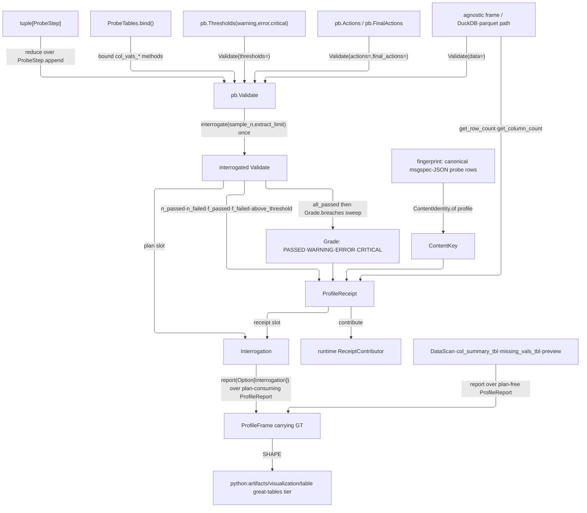

# [PY_DATA_PROFILE]

The graded data-quality observability owner — the data-plane analogue of the runtime receipt-sink, sitting above the `tabular/contract#QUALITY` pass/fail gate: `QualityProfile` folds `ProbeStep` rows into one chained `pointblank.Validate` plan, interrogates it once, grades every step at warning/error/critical severity, fires the bound severity actions, and emits one `great_tables.GT` frame the `python:artifacts/visualization/table` tier renders through its `TablePlan.rendered` opaque-GT egress. The contract gate and the profile are two planes over one agnostic frame — the gate proves the schema contract and records its breach, the profile grades the live data and fires actions above that gate — never one owner, and neither raises.

The plan rides the agnostic `tabular/interop#INTEROP` frame and the DuckDB/parquet paths from `tabular/query#QUERY` and `tabular/columnar#SCAN` straight into pointblank's own Narwhals `data` admission, never a second frame translator. `FieldShape` imports downward from its `tabular/interop#INTEROP` minter for the `schema` probe's `pb.Schema` projection — the same structural declaration the contract gate reads. One interrogated `Validate` is the shared artifact every grade rail, receipt fold, and plan-consuming report reads: `interrogate` returns that plan as the `Interrogation` carrier beside its receipt, and `report` takes the carrier, so a caller holding a run spends one interrogation across the grade, the receipt, and every report it drives. `ProfileReceipt` keys by runtime `ContentIdentity` over the plan-content fingerprint and contributes through `ReceiptContributor`; the identity, the receipt rail, and the LLM/host seam are runtime-owned.

## [01]-[INDEX]

- [02]-[PROFILE]: the graded data-quality observability owner over `pointblank` — the `ProbeStep` plan axis, the `Thresholds`/`Actions`-graded single interrogation carried out as `Interrogation`, the `ProfileReport` `GT`/wire axis through one `report` entrypoint, and the plan-content-keyed `ProfileReceipt`.

## [02]-[PROFILE]

- Owner: `QualityProfile` over `pointblank.Validate` — the one graded data-quality observability owner. Closed types: `StepKind` the step-payload union; `ProbeStep` the `Struct` row pairing one `StepKind` with the per-step policy override its `policy` projection splats into every arm; `Grade` the ordered `PASSED`/`WARNING`/`ERROR`/`CRITICAL` severity axis; `ProfileReport` the report axis over the `GT`/wire frames; `ProfileReceipt` the grade receipt keyed by `ContentIdentity` over the plan-content fingerprint; `Interrogation` the run carrier pairing the interrogated plan with that receipt.
- Cases: `StepKind` collapses the entire pointblank step family into one tagged union dispatched over the boundary-bound `ProbeTables` method maps and matched by `match`/`case` closed by `assert_never`, never a per-comparison step type and never a `lambda` forwarding a renamed step. Each step's `thresholds`/`actions`/`brief`/`active` override — the four knobs pointblank exposes on every step method alike, `pre` and `segments` declining because the provider carries them on a subset only — rides the `ProbeStep` `Struct` wrapper, not a union field: `@tagged_union.__init__` treats every keyword as a case candidate and raises `TypeError("One and only one case can be specified")` the moment a construction passes a case plus a policy field, so the override is unconstructible on the union. Every `columns` slot resolves through one `ProbeTables.cols` fold — a name, a `Sequence[str]`, or a `(Selector, args)` pair whose selector name resolves against the `_SELECTORS` set derived from the closed `Selector` vocabulary, minting the matching `pb.starts_with`/`ends_with`/… selector — so a column set is a row, never a name loop, never an attribute probe over the whole provider namespace, and never a per-step import.
  - `compare` folds `gt`/`ge`/`lt`/`le`/`eq`/`ne` through `ProbeTables.compare` (the unbound `Validate.col_vals_*` off the class), `value` a literal, a `pb.col(...)`, or a `pb.ref(...)` cross-column reference — one comparison surface, never six step types.
  - `span`/`member`/`nullity`/`distinct` each fold a two-way polarity through their `ProbeTables` map (`col_vals_between`/`outside`, `in_set`/`not_in_set`, `not_null`/`null`, `rows_distinct`/`rows_complete`); `span` threads the `_INCLUSIVE` `(bool, bool)` endpoint pair and `distinct` the optional `columns_subset`.
  - `pattern`/`spec`/`present`/`schema`/`expr`/`joint`/`twin`/`bespoke` are one surface each — `col_vals_regex(inverse=)` (no second `not_regex`), `col_vals_within_spec`, `col_exists`, `col_schema_match` fed the `tabular/interop#INTEROP` `FieldShape` tuple projected to `pb.Schema` (the contract's structural declaration, never re-listed), `col_vals_expr`, `conjointly`, `tbl_match`, and `specially` the escape hatch. The AI-driven `prompt` step stays outside this axis — an LLM-graded per-row assertion is a runtime/host concern, never a data-plane probe.
  - `ordered` dispatches two inline arms, not a table row, because the tolerance kwarg mirrors the direction: `col_vals_increasing` owns `decreasing_tol=` (permitted backward slack), `col_vals_decreasing` owns `increasing_tol=`, so each arm threads the single `tol` into its own asymmetric kwarg.
  - `aggregate` folds one comprehension over `_STATS × _AGG_OPS` keyed by `(stat, op)`, resolving each `col_{stat}_{op}` off the class, never a fifteen-method family; `AggOp` is `Operator` minus `ne` because pointblank exposes no `col_{stat}_ne`.
  - `shape`/`nullfrac` — `shape` dispatches two inline arms because only `row_count_match` owns `tol=` while `col_count_match` rejects it; `nullfrac` threads the null-fraction bound into `col_pct_null(p=, tol=)`.
- Entry: `QualityProfile.of` folds the `ProbeStep` tuple plus the `pb.Thresholds` grade policy, the optional `pb.Actions`/`pb.FinalActions` severity-callback policy, and the `label`/`tbl_name`/`brief` plan metadata into one profile. `interrogate` opens `pb.Validate(data, thresholds=, actions=, final_actions=, …)` over the agnostic frame or the DuckDB/parquet path, folds every `ProbeStep` onto the plan through one `reduce` over `ProbeStep.append` (never a mutable loop), runs `plan.interrogate(sample_n=, sample_frac=, get_first_n=, extract_limit=)` once inside one `async_boundary` over the banded `on_thread` hop — interrogation drives every step to completion against the backend, a blocking leg that never rides the loop — then `.bind`s the railed `fingerprint(sampling)` key and `.map`s the resolved `ContentKey` into `ProfileReceipt.of`, returning a `RuntimeRail[Interrogation]` whose carrier holds the interrogated plan beside that receipt. The rail is `Ok` even when steps breach because the profile records and grades but never enforces, exactly as the sibling `ContractClaim`. The single `interrogate()` is the one execution surface; sampling and the `extract_limit` failing-row cap are call rows, never a separate runner. `Thresholds`/`Actions` ride owner fields threaded into `Validate` at plan open, the per-step `ProbeStep.thresholds`/`actions`/`brief`/`active` override threaded into every builder alike so a step tightens its grade, documents itself, or retires from evaluation without a parallel plan — a retired step keeps its index, so per-step receipt keys survive a policy flip; `highest_only=True` collapses a multi-level breach to its top severity, and the threshold limit is an `int` failing-unit count or a `float ∈ [0, 1]` fraction, the one shape pointblank grades. `report` is the one report entrypoint folding the nine-case `ProfileReport` to a `ProfileFrame` through one total `match` closed by `assert_never`, taking the run as `Option[Interrogation]` — the settled optional-context form, never a `reuse: bool` beside a plan argument: the plan-consuming `tabular`/`step`/`json`/`dataframe`/`sundered` cases read a `cache`-memoized `graded()` closure resolving the threaded plan first and interrogating lazily only when none arrives, while the plan-free `probe`/`summary`/`missing`/`preview` cases read `pb.DataScan`/`col_summary_tbl`/`missing_vals_tbl`/`preview` over the raw table and never touch `graded()` — the interrogated-plan-versus-raw-table boundary recovered structurally from the matched arm, never a `render`/`scan` sibling split, and a plan-free report never pays for an interrogation it does not read.
- Auto: a passing interrogation yields an `Interrogation` whose `ProfileReceipt.of` grades `PASSED` with `all_passed()` true; a breach grades through `Grade.of` and folds per-step evidence into the receipt. `Grade` is ordered by severity rank so the overall grade is the maximum breached level; `_LEVELS` is the ascending breach ladder both the breach sweep and the breach-set projection read, DERIVED from the member roster in definition order rather than hand-spelled beside it, so a fifth severity is one enum member and no parallel tuple drifts. `Grade.breaches` sweeps `_LEVELS` through `plan.above_threshold(level=, i=)` (`i=None` plan-wide, an `int` per-step) and `Grade.of` reads `plan.all_passed()` then returns the max breached level or `PASSED` — one fold, never a per-level boolean tail. The receipt carries the graded `(rows, columns)` off `pb.get_row_count`/`get_column_count` (never a degenerate step-count tuple), the step count, per-step `n_passed`/`n_failed`/`f_passed`/`f_failed` off `plan.*(scalar=False)` as a `dict` keyed by step index, and the per-severity breach set — one typed evidence stream, never re-derived from the raw frame. Each step pushes its own predicate into the backend scan on the polars/DuckDB/ibis path, so pointblank's Narwhals engine grades without pulling the frame into Python; the interrogation still drives every step to completion against that backend, which is the blocking leg the banded hop exists for.
- Output: `report` emits one `ProfileFrame` carrying the `great_tables.GT` on its `frame` slot as opaque `Any` plus the `kind` discriminant and the `grade` — `None` exactly where nothing was interrogated, so a plan-free report reached with no run threaded in publishes no verdict rather than a fabricated `PASSED`, and one reached WITH a run reports that run's already-graded level for free — data never imports `great_tables`, never re-renders to HTML, never reaches into `GT` internals; the `python:artifacts/visualization/table` tier renders it through its `TablePlan.rendered` opaque-GT egress and reads the `[SHAPE]` value, exactly as the `tabular/columnar#SCAN` corpus wire hands a flat record to the documents tier. The `json`/`dataframe`/`sundered` cases carry the `str`/native-frame wire value on the same slot, so the publication report, the machine-readable JSON, the grade frame, and the passing/failing row split all leave through one `ProfileFrame` rail, never four emitters.
- Receipt: `ProfileReceipt.contribute` yields one emitted-phase row through the two-argument `Receipt.of(owner, evidence)` factory decomposing the `(phase, subject, facts)` triple — never the four-positional form the owner does not expose — satisfying the `ReceiptContributor.contribute -> Iterable[Receipt]` Protocol, never a bare single `Receipt`; the `rows`/`columns`/`steps` counts ride as native `int` scalars. The receipt keys by `ContentIdentity` over the plan-content fingerprint: `QualityProfile.fingerprint` folds one deterministic msgspec-JSON row per `ProbeStep` (tag, payload, and every override field) plus one plan-level row over the sampling bound and every policy field — both field rosters DERIVED from the owning `Struct` through `msgspec.structs.fields`, so a fifth knob lands in the key with zero edits where a hand-listed subset had silently dropped `final_actions`, `tbl_name`, and `brief` — a callable projected to its stable code identity `(module, qualname, marshalled bytecode)` so two distinct `<lambda>` predicates never collide, returning the railed `RuntimeRail[ContentKey]` the `interrogate` rail threads through `.bind`/`.map` rather than collapsing into a field. An unchanged probe set, threshold policy, and sampling bound reuses its key byte-stable; a changed threshold, a tightened override, an added probe, or a widened sampling bound flips it — the graded-evidence identity a bare `(label, step-count, grade)` string cannot carry, since a changed threshold leaves all three untouched while the counts and grade shift. `contribute` projects the worst per-step failed fraction onto the runtime `Metrics.record` arm under `domain="quality"` keyed by grade, and a ZERO-step interrogation records NOTHING rather than a `0.0` perfect reading indistinguishable from a fully-passing many-step run, and `interrogate` opens the one profile span around its blocking materialization — the "observability owner" claim realized as instrument and trace, never receipt-only.
- Packages: `pointblank` — the two `get_tabular_report` surfaces are DISTINCT classes with disjoint keyword sets, `Validate.get_tabular_report(title=, incl_header=, incl_footer=, incl_footer_timings=, incl_footer_notes=) -> GT` over the interrogated plan and `DataScan(data, tbl_name=).get_tabular_report(show_sample_data=) -> GT` over the raw table, so the two report arms bind two members and neither roster entry covers the other — (`Validate(data, thresholds=, actions=, final_actions=, label=, tbl_name=, brief=)`/`col_vals_gt`/`ge`/`lt`/`le`/`eq`/`ne`/`col_vals_between(left=, right=, inclusive=)`/`col_vals_outside`/`col_vals_in_set(set=)`/`col_vals_not_in_set`/`col_vals_not_null`/`col_vals_null`/`col_vals_regex(pattern=, inverse=)`/`col_vals_within_spec(spec=)`/`col_vals_increasing(allow_stationary=, decreasing_tol=)`/`col_vals_decreasing(allow_stationary=, increasing_tol=)`/`col_{avg,sum,sd}_{gt,ge,lt,le,eq}`/`col_vals_expr(expr=)`/`col_exists`/`col_schema_match(schema=, complete=, in_order=)`/`col_count_match(count=, inverse=)`/`row_count_match(count=, tol=, inverse=)`/`col_pct_null(p=, tol=)`/`rows_distinct(columns_subset=)`/`rows_complete`/`conjointly`/`tbl_match(tbl_compare=)`/`specially(expr=)`/the `thresholds=`/`actions=`/`brief=`/`active=` policy tail every step method carries against the `pre=`/`segments=` pair only some do/`interrogate(sample_n=, sample_frac=, get_first_n=, extract_limit=)`/`all_passed()`/`above_threshold(level=, i=)`/`n_passed`/`n_failed`/`f_passed`/`f_failed(i=, scalar=)`/`get_step_report(i=, columns_subset=, limit=) -> GT`/`get_json_report(use_fields=, exclude_fields=) -> str`/`get_dataframe_report(tbl_type=)`/`get_sundered_data(type=)`/`Thresholds(warning=, error=, critical=)`/`Actions(warning=, error=, critical=, default=, highest_only=)`/`FinalActions`/`Schema`/`col`/`ref`/`starts_with`/`ends_with`/`contains`/`matches`/`everything`/`first_n`/`last_n`/`get_row_count`/`get_column_count`/`col_summary_tbl(data, tbl_name=)`/`missing_vals_tbl(data)`/`preview(data, columns_subset=, n_head=, n_tail=, limit=)`, bound at module scope through `lazy import pointblank as pb
lazy import polars as pl` — the deferral IS the heavy-engine gate the transitive `polars`/`great_tables` load earns, so the cost falls on first use with no function-local import and no suppression, and every table row and policy value here stays free of a provider dereference that reifies the proxy at import), `tabular/interop#INTEROP` (`FieldShape` projected to a `pb.Schema` for the `schema` probe and `DataLeg` this page anchors its `RAISES` table on, both imported downward; the agnostic `nw.DataFrame`/`nw.LazyFrame` passes through unmodified into pointblank's own Narwhals `data` admission, never lowered through `FrameInterop.translate`), `polars` (`exceptions.PolarsError` alone — the engine root beneath pointblank that a fence names, bound through the same module-scope `lazy` deferral so no probe reifies it), `beartype` (`@beartype(conf=FAULT_CONF)` on the public `of`/`interrogate`/`report` seams so a malformed `ProbeStep`/`ProfileReport`/`data` argument raises the `BeartypeCallHintViolation` root the `runtime/reliability/faults#FAULT` `api` row folds onto the rail; the internal folds and kernels over already-admitted values carry none), runtime (`RuntimeRail`/`boundary`/`async_boundary`/`on_thread`/`FAULT_CONF`/`ContentIdentity`/`ContentKey`/`ReceiptContributor`/`Receipt`).
- Growth: a new comparison/range/membership/uniqueness check is one `ProbeStep` threading its `ProbeTables` polarity map; a new column-aggregate stat is one `_STATS` row the `aggregate` comprehension folds; a new column selector is one `Selector` literal, `_SELECTORS` and the `cols` fold both deriving from it; a new report kind is one `ProfileReport` case (plan-consuming reads `graded()`, plan-free reads the raw table), its payload the knobs its own provider member offers and a unit `None` where that member offers none; a new run-scoped fact is one `Interrogation` field beside the plan and the receipt; a new plan-level policy or per-step override lands in the content key free, both fingerprint rosters deriving from their owning `Struct`; a new severity level is one `Grade` member plus one `Thresholds`/`Actions` field, the breach ladder deriving; a per-step threshold, action, brief, or activation override is the existing `ProbeStep` field, and a knob the provider spells on only some step methods stays off that wrapper and lands on its own arms; a post-interrogation summary callback is the existing `final_actions` field; a sampling or extract-limit knob is a call row on `interrogate`; the AI-driven `prompt` step is admitted as a `ProbeStep` only when an LLM handle arrives through the runtime host seam, never a module-top dependency; a second backend `data` path is admitted free by pointblank's Narwhals engine.
- Boundary: pointblank owns the validation plan, the warning/error/critical threshold grading, the severity-action callbacks, and the `great_tables.GT` emission; `great_tables` owns the renderable frame downstream and stays `python:artifacts/visualization/table`-owned; Narwhals owns the frame normalization inside pointblank; runtime owns the identity, the receipt rail, and the LLM/host seam. No raising in domain logic — the profile records and grades, never enforces; `assert_below_threshold` is pointblank's raising gate and stays unbound on this page. No second frame translator beside pointblank's Narwhals admission, no `great_tables` import here, no HTML re-render where the `GT` frame needs none, no function-local provider import carrying a lint suppression where the module-scope `lazy` form states the same deferral as law, no hand-spelled roster beside a closed vocabulary or a `Struct` field set that already holds it, no bare `trace.get_tracer(scope)` beside the faults-owned `scoped` stamp that binds the version and semconv triple, and no re-interrogation of a plan the caller already holds — a `report` that discards a threaded `Interrogation` and re-runs the backend is the deleted form the carrier exists to foreclose.

```python signature
import marshal
from collections.abc import Callable, Iterable, Sequence
from enum import IntEnum
from functools import cache, partial, reduce
from typing import TYPE_CHECKING, Any, Final, Literal, assert_never, cast, get_args

from beartype import beartype
from expression import Nothing, Option, Some, case, tag, tagged_union
from expression.collections import Block, Map
from msgspec import Struct
from msgspec import json as msgjson
from msgspec.structs import fields as struct_fields
from opentelemetry import trace

lazy import pointblank as pb

from rasm.runtime.identity import ContentIdentity, ContentKey
from rasm.data.tabular.interop import DataLeg
from rasm.runtime.faults import FAULT_CONF, TERMINAL, TRANSIENT, Catch, FaultRow, RuntimeRail, async_boundary, rostered, scoped
from rasm.runtime.lanes import on_thread
from rasm.runtime.metrics import Metrics
from rasm.runtime.receipts import Receipt

if TYPE_CHECKING:
    from pointblank.column import Column, ReferenceColumn

    from rasm.data.tabular.interop import FieldShape

# faults-owned scope stamp: `scoped` binds the version and semconv triple, so no page re-spells the pin.
_TRACER: Final = scoped(trace.get_tracer, "rasm.data.tabular.profile")


def _probe_raises() -> Catch:
    # reified at the CALL so the `lazy pointblank` proxy stays deferred for a composition that never interrogates.
    # pointblank publishes no exception namespace of its own: a malformed step surfaces as the builtin its validation
    # raises and a plan failure as the polars rail beneath it (probed against the installed distribution), so the
    # engine root beneath it is what a fence names. `OSError` covers the thread band the interrogation offloads onto.
    return (pl.exceptions.PolarsError, TypeError, ValueError, KeyError, OSError)


# this module's whole raise roster: the interrogation and the report share one refusal LAW each, parameterized on the
# plan label and the report tag rather than split per call site. Both declare TRANSIENT — a blocking materialization
# over a live frame is an engine hop a re-issue may clear.
PROFILE_INTERROGATE: Final[FaultRow[DataLeg]] = FaultRow(
    leg=DataLeg.PROFILE, point="interrogate", arm="boundary", defect="interrogation", retriability=TRANSIENT
)
PROFILE_REPORT: Final[FaultRow[DataLeg]] = FaultRow(
    leg=DataLeg.PROFILE, point="report", arm="boundary", defect="report-render", retriability=TRANSIENT
)
RAISES: Final[Block[FaultRow[DataLeg]]] = rostered(Block.of_seq([PROFILE_INTERROGATE, PROFILE_REPORT]))

# --- [TYPES] ----------------------------------------------------------------------------

type Selector = Literal["starts_with", "ends_with", "contains", "matches", "everything", "first_n", "last_n"]
type Columns = str | Sequence[str] | tuple[Selector, tuple[Any, ...]] | "Column"
type Comparand = float | int | str | "Column" | "ReferenceColumn"
type Grades = Literal["warning", "error", "critical"]
type Operator = Literal["gt", "ge", "lt", "le", "eq", "ne"]
type AggOp = Literal["gt", "ge", "lt", "le", "eq"]
type Stat = Literal["avg", "sum", "sd"]
type ReportKind = Literal["tabular", "step", "json", "dataframe", "sundered", "probe", "summary", "missing", "preview"]
type Inclusive = Literal["both", "neither", "left", "right"]

# --- [CONSTANTS] ------------------------------------------------------------------------

_INCLUSIVE: Final[Map[Inclusive, tuple[bool, bool]]] = Map.of_seq([
    ("both", (True, True)),
    ("neither", (False, False)),
    ("left", (True, False)),
    ("right", (False, True)),
])

# failing-row extract cap, read by BOTH the declared `interrogate` default and the lazy `graded()` fallback a
# plan-free `report` forces, so a report that had to interrogate for itself grades on the same evidence bound.
_EXTRACT_LIMIT: Final[int] = 500

# --- [MODELS] ---------------------------------------------------------------------------


class Grade(IntEnum):
    PASSED = 0
    WARNING = 1
    ERROR = 2
    CRITICAL = 3

    @property
    def label(self) -> Grades:
        return cast(Grades, self.name.lower())

    @classmethod
    def breaches(cls, plan: "pb.Validate", i: int | None = None) -> "tuple[Grade, ...]":
        return tuple(level for level in _LEVELS if plan.above_threshold(level=level.label, i=i))

    @classmethod
    def of(cls, plan: "pb.Validate") -> "Grade":
        return max(cls.breaches(plan), default=cls.PASSED) if not plan.all_passed() else cls.PASSED


# `_LEVELS` DERIVES from the member roster in definition order, so a fifth severity is one enum member and
# zero table edits; a hand-spelled tuple is the parallel secondary the primary already holds.
_LEVELS: Final[tuple[Grade, ...]] = tuple(level for level in Grade if level is not Grade.PASSED)


@tagged_union(frozen=True)
class StepKind:
    tag: Literal[
        "compare",
        "span",
        "member",
        "nullity",
        "pattern",
        "spec",
        "ordered",
        "aggregate",
        "shape",
        "nullfrac",
        "distinct",
        "present",
        "schema",
        "expr",
        "joint",
        "twin",
        "bespoke",
    ] = tag()
    compare: tuple[Columns, Operator, Comparand, bool] = case()
    span: tuple[Columns, Comparand, Comparand, Inclusive, bool, bool] = case()
    member: tuple[Columns, bool, tuple[Any, ...]] = case()
    nullity: tuple[Columns, bool] = case()
    pattern: tuple[Columns, str, bool, bool] = case()
    spec: tuple[Columns, str, bool] = case()
    ordered: tuple[Columns, bool, bool, float | None, bool] = case()
    aggregate: tuple[Columns, Stat, AggOp, float, float] = case()
    shape: tuple[Literal["row", "col"], int, float, bool] = case()
    nullfrac: tuple[Columns, float, float] = case()
    distinct: tuple[tuple[str, ...] | None, bool] = case()
    present: Columns = case()
    schema: tuple[tuple[FieldShape, ...], bool, bool] = case()
    expr: Any = case()
    joint: tuple[Any, ...] = case()
    twin: Any = case()
    bespoke: Callable[[Any], Any] = case()


class ProbeStep(Struct, frozen=True):
    # pointblank exposes these four policy knobs on EVERY step method, so one wrapper threads them uniformly:
    # `brief` documents the step on the report, and `active` retires a step from evaluation without unseating
    # it — plans still number a retired step, so per-step receipt indices survive a policy flip. `pre` and
    # `segments` stay off this wrapper because the provider carries them on a subset of steps only, and a knob
    # threaded where its method rejects it fails the whole plan on an unrelated step.
    kind: StepKind
    thresholds: "pb.Thresholds | None" = None
    actions: "pb.Actions | None" = None
    brief: "str | bool | None" = None
    active: bool = True

    @property
    def policy(self) -> dict[str, Any]:
        # one splat carries the whole uniform tail into every arm, so a fifth knob pointblank adds to every step
        # method is one entry here and zero arm edits — and no arm can drift by threading three of four.
        return {"thresholds": self.thresholds, "actions": self.actions, "brief": self.brief, "active": self.active}

    def append(self, plan: "pb.Validate", tables: "ProbeTables") -> "pb.Validate":
        policy = self.policy
        match self.kind:
            case StepKind(tag="compare", compare=(columns, op, value, na_pass)):
                return tables.compare[op](plan, tables.cols(columns), value=value, na_pass=na_pass, **policy)
            case StepKind(tag="span", span=(columns, left, right, inclusive, outside, na_pass)):
                return tables.span[outside](
                    plan, tables.cols(columns), left=left, right=right, inclusive=_INCLUSIVE[inclusive], na_pass=na_pass, **policy
                )
            case StepKind(tag="member", member=(columns, present, values)):
                return tables.member[present](plan, tables.cols(columns), set=list(values), **policy)
            case StepKind(tag="nullity", nullity=(columns, present)):
                return tables.nullity[present](plan, tables.cols(columns), **policy)
            case StepKind(tag="pattern", pattern=(columns, regex, inverse, na_pass)):
                return plan.col_vals_regex(tables.cols(columns), pattern=regex, inverse=inverse, na_pass=na_pass, **policy)
            case StepKind(tag="spec", spec=(columns, named, na_pass)):
                return plan.col_vals_within_spec(tables.cols(columns), spec=named, na_pass=na_pass, **policy)
            case StepKind(tag="ordered", ordered=(columns, True, allow_stationary, tol, na_pass)):
                return plan.col_vals_increasing(
                    tables.cols(columns), allow_stationary=allow_stationary, decreasing_tol=tol, na_pass=na_pass, **policy
                )
            case StepKind(tag="ordered", ordered=(columns, False, allow_stationary, tol, na_pass)):
                return plan.col_vals_decreasing(
                    tables.cols(columns), allow_stationary=allow_stationary, increasing_tol=tol, na_pass=na_pass, **policy
                )
            case StepKind(tag="aggregate", aggregate=(columns, stat, op, value, tol)):
                return tables.aggregate[(stat, op)](plan, tables.cols(columns), value=value, tol=tol, **policy)
            case StepKind(tag="shape", shape=("row", count, tol, inverse)):
                return plan.row_count_match(count=count, tol=tol, inverse=inverse, **policy)
            case StepKind(tag="shape", shape=("col", count, _, inverse)):
                return plan.col_count_match(count=count, inverse=inverse, **policy)
            case StepKind(tag="nullfrac", nullfrac=(columns, p, tol)):
                return plan.col_pct_null(tables.cols(columns), p=p, tol=tol, **policy)
            case StepKind(tag="distinct", distinct=(subset, complete)):
                return tables.distinct[complete](plan, columns_subset=subset, **policy)
            case StepKind(tag="present", present=columns):
                return plan.col_exists(tables.cols(columns), **policy)
            case StepKind(tag="schema", schema=(declared, complete, in_order)):
                return plan.col_schema_match(schema=tables.schema(declared), complete=complete, in_order=in_order, **policy)
            case StepKind(tag="expr", expr=expression):
                return plan.col_vals_expr(expr=expression, **policy)
            case StepKind(tag="joint", joint=expressions):
                return plan.conjointly(*expressions, **policy)
            case StepKind(tag="twin", twin=other):
                return plan.tbl_match(tbl_compare=other, **policy)
            case StepKind(tag="bespoke", bespoke=callable_):
                return plan.specially(expr=callable_, **policy)
            case unreachable:
                assert_never(unreachable)


@tagged_union(frozen=True)
class ProfileReport:
    tag: ReportKind = tag()
    # the publication report's whole knob set: `Validate.get_tabular_report` carries the header/footer pair AND the
    # two footer sub-knobs (`incl_footer_timings`/`incl_footer_notes`), so the case threads all four rather than
    # stopping at the pair — a knob the provider offers and the case drops is capability this plane cannot reach.
    tabular: tuple[str, bool | None, bool | None, bool | None, bool | None] = case()
    step: tuple[int, tuple[str, ...] | None, int] = case()
    json: tuple[tuple[str, ...] | None, tuple[str, ...] | None] = case()
    dataframe: Literal["polars", "pandas", "duckdb"] = case()
    sundered: Literal["pass", "fail"] = case()
    probe: bool = case()
    # UNIT cases: `col_summary_tbl(data, tbl_name=)` and `missing_vals_tbl(data)` take no report knob at all, so a
    # `bool` payload here was settable to either value with identical behavior — a knob with no effect on a public
    # union. `probe` keeps its `bool` because `show_sample_data=` reads it; a knob these two gain lands as their own
    # payload then.
    summary: None = case()
    missing: None = case()
    preview: tuple[tuple[str, ...] | None, int, int, int] = case()


class ProfileFrame(Struct, frozen=True):
    kind: ReportKind
    # `None` where nothing was interrogated: a plan-free report reached over the raw table with no run threaded
    # in reaches no verdict, and stamping `PASSED` there publishes a grade the profile never graded.
    grade: Grade | None
    frame: Any


class ProfileReceipt(Struct, frozen=True):
    label: str
    shape: tuple[int, int]
    steps: int
    grade: Grade
    passed: Map[int, int]
    failed: Map[int, int]
    passed_fraction: Map[int, float]
    failed_fraction: Map[int, float]
    breached: tuple[Grades, ...]
    content_key: ContentKey

    @classmethod
    def of(cls, label: str, plan: "pb.Validate", data: Any, steps: int, key: ContentKey) -> "ProfileReceipt":
        return cls(
            label=label,
            shape=(pb.get_row_count(data), pb.get_column_count(data)),
            steps=steps,
            grade=Grade.of(plan),
            passed=Map.of_seq(plan.n_passed(scalar=False).items()),
            failed=Map.of_seq(plan.n_failed(scalar=False).items()),
            passed_fraction=Map.of_seq(plan.f_passed(scalar=False).items()),
            failed_fraction=Map.of_seq(plan.f_failed(scalar=False).items()),
            breached=tuple(level.label for level in Grade.breaches(plan)),
            content_key=key,
        )

    def contribute(self) -> Iterable[Receipt]:
        # receipts stay truth, instruments stay projections: the worst per-step failed fraction lands on the metric
        # spine under domain="quality" keyed by the overall grade, so a dashboard grades data health without log parsing.
        # `domain`/`kind`/`key` are the lifted evidence contract the `tabular/lakehouse#LAKEHOUSE` residence reads — the
        # SAME pair handed `Metrics.record` beside the minted key — and `domain` is that plane's partition column, so a
        # contributor omitting it lands every quality row in one nameless partition no predicate ever prunes.
        # a ZERO-step interrogation measures no breach fraction, so it records NONE: the `default=0.0` this deletes
        # published a perfect data-health reading indistinguishable from a fully-passing many-step run, which
        # `libs/.planning/RULINGS.md` `[02]` rules out by name — an unmeasured instrument reads UNMEASURED, never
        # zero. The same abstention `tabular/columnar#SCAN` already holds for an unprofiled receipt and
        # `tabular/materialize#MATERIALIZE` for a drain that recomputed nothing.
        rows, cols = self.shape
        match Block.of_seq(self.failed_fraction.values()).sort(reverse=True).try_head():
            case Option(tag="some", some=worst):
                Metrics.record({"rasm.quality.breach_fraction": worst}, domain="quality", kind=self.grade.name)
            case Option(tag="none"):
                pass
        yield Receipt.of(
            "quality-profile",
            (
                "emitted",
                self.label,
                {
                    "domain": "quality",
                    "kind": self.grade.name,
                    "key": self.content_key.hex,
                    "rows": rows,
                    "columns": cols,
                    "steps": self.steps,
                    "breached": "|".join(self.breached),
                },
            ),
        )


class Interrogation(Struct, frozen=True):
    # `plan` IS the shared artifact and `receipt` its evidence projection, so a grade, a receipt, and every
    # plan-consuming report answer off ONE interrogation. `plan` stays `Any` because `pointblank` is banned at
    # module scope, exactly as `ProfileFrame.frame` holds its `GT` opaquely.
    plan: Any
    receipt: ProfileReceipt


# --- [SERVICES] -------------------------------------------------------------------------


class QualityProfile(Struct, frozen=True):
    steps: tuple[ProbeStep, ...]
    thresholds: "pb.Thresholds | None" = None
    actions: "pb.Actions | None" = None
    final_actions: "pb.FinalActions | None" = None
    label: str = "profile"
    tbl_name: str | None = None
    brief: bool | str = False

    @classmethod
    @beartype(conf=FAULT_CONF)
    def of(
        cls,
        *steps: ProbeStep,
        thresholds: "pb.Thresholds | None" = None,
        actions: "pb.Actions | None" = None,
        final_actions: "pb.FinalActions | None" = None,
        label: str = "profile",
        tbl_name: str | None = None,
        brief: bool | str = False,
    ) -> "QualityProfile":
        return cls(steps=steps, thresholds=thresholds, actions=actions, final_actions=final_actions, label=label, tbl_name=tbl_name, brief=brief)

    @beartype(conf=FAULT_CONF)
    async def interrogate(
        self,
        data: Any,
        *,
        sample_n: int | None = None,
        sample_frac: float | None = None,
        get_first_n: int | None = None,
        extract_limit: int = _EXTRACT_LIMIT,
    ) -> "RuntimeRail[Interrogation]":
        # sampling folds into the fingerprint, so a re-sampled run — same probes, different grade and counts — never reuses a byte-stable key.
        # interrogation drives every step to completion against the backend — a blocking leg riding the banded thread hop, never the loop.
        # `Interrogation` rides the plan out beside its receipt, so a caller threading it into `report` spends ONE
        # interrogation across the grade, the receipt, and every plan-consuming report.
        sampling = (sample_n, sample_frac, get_first_n, extract_limit)
        with _TRACER.start_as_current_span(
            f"profile.interrogate.{self.label}", attributes={"rasm.quality.label": self.label, "rasm.quality.steps": len(self.steps)}
        ):
            interrogated = await async_boundary(
                PROFILE_INTERROGATE,
                lambda: on_thread(
                    lambda: self._plan(data).interrogate(
                        sample_n=sample_n, sample_frac=sample_frac, get_first_n=get_first_n, extract_limit=extract_limit
                    )
                ),
                catch=_probe_raises(),
            )
            return interrogated.bind(
                lambda plan: self.fingerprint(sampling).map(
                    lambda key: Interrogation(plan=plan, receipt=ProfileReceipt.of(self.label, plan, data, len(self.steps), key))
                )
            )

    @beartype(conf=FAULT_CONF)
    async def report(self, data: Any, report: ProfileReport, interrogated: "Option[Interrogation]" = Nothing) -> "RuntimeRail[ProfileFrame]":
        # one report entrypoint over both report classes: a caller holding its `Interrogation` threads it here and
        # never re-runs the plan, an absent one lets plan-consuming arms interrogate lazily off `graded()`, and
        # plan-free arms read the raw table either way — same blocking materialization, same banded hop.
        return await async_boundary(PROFILE_REPORT, lambda: on_thread(self._report, data, report, interrogated), catch=_probe_raises())

    def fingerprint(self, sampling: tuple[int | None, float | None, int | None, int]) -> "RuntimeRail[ContentKey]":
        # `leaf` renders a callable to its stable code identity (module, qualname, marshalled bytecode) so two `<lambda>`
        # predicates never collide on a bare qualname; a `repr`-of-callable carries a run-varying memory address.
        def leaf(value: object) -> object:
            code = getattr(value, "__code__", None)
            if code is not None:
                return (getattr(value, "__module__", ""), getattr(value, "__qualname__", ""), marshal.dumps(code))
            return getattr(value, "__qualname__", None) or str(value)

        # both rows DERIVE their field set from the owning `Struct`, so a fifth plan-level policy field or a fifth
        # per-step override lands in the key with zero edits here. A hand-listed subset silently dropped
        # `final_actions`, `tbl_name`, and `brief` — two profiles differing only in their post-interrogation callback
        # keyed IDENTICALLY, which is the graded-evidence collision the content key exists to foreclose.
        spine = (
            msgjson.encode((sampling, *(leaf(getattr(self, name)) for name in _PLAN_FIELDS)), enc_hook=leaf, order="deterministic"),
            *(
                msgjson.encode(
                    (step.kind.tag, getattr(step.kind, step.kind.tag), *(leaf(getattr(step, name)) for name in _STEP_FIELDS)),
                    enc_hook=leaf,
                    order="deterministic",
                )
                for step in self.steps
            ),
        )
        return ContentIdentity.of("profile", spine)

    def _report(self, data: Any, report: ProfileReport, interrogated: "Option[Interrogation]") -> ProfileFrame:
        # threaded interrogation wins; absent, `cache` keeps the lazy fallback to exactly one run per report call,
        # and the plan-free arms below never force the thunk at all. `carried` is the grade a threaded run ALREADY
        # holds on its receipt, so a plan-free report reports the real verdict when one exists and `None` when the
        # caller never interrogated — never a fabricated `PASSED` and never an interrogation to answer a preview.
        graded = cache(lambda: interrogated.map(lambda run: run.plan).default_with(partial(self._lazily, data)))
        carried = interrogated.map(lambda run: run.receipt.grade).default_value(None)
        match report:
            case ProfileReport(tag="tabular", tabular=(title, header, footer, timings, notes)):
                return ProfileFrame(
                    report.tag,
                    Grade.of(graded()),
                    graded().get_tabular_report(
                        title=title, incl_header=header, incl_footer=footer, incl_footer_timings=timings, incl_footer_notes=notes
                    ),
                )
            case ProfileReport(tag="step", step=(i, subset, limit)):
                return ProfileFrame(report.tag, Grade.of(graded()), graded().get_step_report(i=i, columns_subset=subset, limit=limit))
            case ProfileReport(tag="json", json=(use_fields, exclude_fields)):
                return ProfileFrame(report.tag, Grade.of(graded()), graded().get_json_report(use_fields=use_fields, exclude_fields=exclude_fields))
            case ProfileReport(tag="dataframe", dataframe=tbl_type):
                return ProfileFrame(report.tag, Grade.of(graded()), graded().get_dataframe_report(tbl_type=tbl_type))
            case ProfileReport(tag="sundered", sundered=side):
                return ProfileFrame(report.tag, Grade.of(graded()), graded().get_sundered_data(type=side))
            case ProfileReport(tag="probe", probe=show_sample):
                return ProfileFrame(
                    report.tag, carried, pb.DataScan(data, tbl_name=self.tbl_name).get_tabular_report(show_sample_data=show_sample)
                )
            case ProfileReport(tag="summary"):
                return ProfileFrame(report.tag, carried, pb.col_summary_tbl(data, tbl_name=self.tbl_name))
            case ProfileReport(tag="missing"):
                return ProfileFrame(report.tag, carried, pb.missing_vals_tbl(data))
            case ProfileReport(tag="preview", preview=(subset, n_head, n_tail, limit)):
                return ProfileFrame(report.tag, carried, pb.preview(data, columns_subset=subset, n_head=n_head, n_tail=n_tail, limit=limit))
            case unreachable:
                assert_never(unreachable)

    def _lazily(self, data: Any) -> "pb.Validate":
        # `_lazily` reads the SAME failing-row cap `interrogate` declares, so a report forced to
        # interrogate for itself grades on the identical evidence bound a threaded run carries.
        return self._plan(data).interrogate(extract_limit=_EXTRACT_LIMIT)

    def _plan(self, data: Any) -> "pb.Validate":
        tables = ProbeTables.bind()
        root = pb.Validate(
            data,
            thresholds=self.thresholds,
            actions=self.actions,
            final_actions=self.final_actions,
            label=self.label,
            tbl_name=self.tbl_name,
            brief=self.brief,
        )
        return reduce(lambda plan, step: step.append(plan, tables), self.steps, root)


# --- [TABLES] ---------------------------------------------------------------------------

# fingerprint field rosters DERIVED from the owning `Struct` declarations: a fifth plan-level policy field or a
# fifth per-step override lands in the content key with zero edits, where a hand-listed subset drifts silently
# once the owner grows. `steps` and `kind` stay excluded because each folds through its own row.
_PLAN_FIELDS: Final[tuple[str, ...]] = tuple(row.name for row in struct_fields(QualityProfile) if row.name != "steps")
_STEP_FIELDS: Final[tuple[str, ...]] = tuple(row.name for row in struct_fields(ProbeStep) if row.name != "kind")
```

`ProbeTables.bind` resolves each closed polarity onto the unbound `pb.Validate` step method once per plan — `compare["gt"]` is `Validate.col_vals_gt` invoked as `(plan, columns, value=, **policy)`, threading `plan` as `self` and the shared per-step policy kwargs, exactly as the sibling `tabular/contract#QUALITY` `_CMP` binds `Check.ge`, so no `lambda` forwards a rename. It reads the module-scope `lazy import pointblank as pb` name directly: the deferral IS the heavy-engine gate, so the bind carries no namespace field and no call site re-imports. `cols` resolves a selector against the `_SELECTORS` set derived from the closed `Selector` vocabulary — a `hasattr` probe over the whole provider namespace admits any public attribute as a column selector — `schema` projects the `FieldShape` tuple to a `pb.Schema`, and the `aggregate` cross-product is one comprehension over `_STATS × _AGG_OPS` resolving each `col_{stat}_{op}` off the class.

```python signature
# --- [TABLES] ---------------------------------------------------------------------------

_STATS: Final[tuple[Stat, ...]] = ("avg", "sum", "sd")
_OPS: Final[tuple[Operator, ...]] = ("gt", "ge", "lt", "le", "eq", "ne")
_AGG_OPS: Final[tuple[AggOp, ...]] = ("gt", "ge", "lt", "le", "eq")
# `_SELECTORS` DERIVES from the closed `Selector` vocabulary, so a new selector is one `Literal`
# member; membership decided by `hasattr` over the provider namespace instead admits `("Validate", ())` as a
# column spec and calls it, and an unknown name falls silently through to the passthrough arm.
_SELECTORS: Final[frozenset[str]] = frozenset(get_args(Selector))


class ProbeTables(Struct, frozen=True):
    compare: Map[Operator, Callable[..., "pb.Validate"]]
    span: Map[bool, Callable[..., "pb.Validate"]]
    member: Map[bool, Callable[..., "pb.Validate"]]
    nullity: Map[bool, Callable[..., "pb.Validate"]]
    aggregate: Map[tuple[Stat, AggOp], Callable[..., "pb.Validate"]]
    distinct: Map[bool, Callable[..., "pb.Validate"]]

    def cols(self, spec: Columns) -> Any:
        match spec:
            case (str() as name, tuple() as args) if name in _SELECTORS:
                return getattr(pb, name)(*args)
            case resolved:
                return resolved

    def schema(self, declared: "tuple[FieldShape, ...]") -> "pb.Schema":
        return pb.Schema(columns=[(shape.field, shape.logical_type) for shape in declared])

    @classmethod
    def bind(cls) -> "ProbeTables":
        v = pb.Validate
        return cls(
            compare=Map.of_seq((op, getattr(v, f"col_vals_{op}")) for op in _OPS),
            span=Map.of_seq([(False, v.col_vals_between), (True, v.col_vals_outside)]),
            member=Map.of_seq([(True, v.col_vals_in_set), (False, v.col_vals_not_in_set)]),
            nullity=Map.of_seq([(True, v.col_vals_not_null), (False, v.col_vals_null)]),
            aggregate=Map.of_seq(((stat, op), getattr(v, f"col_{stat}_{op}")) for stat in _STATS for op in _AGG_OPS),
            distinct=Map.of_seq([(True, v.rows_complete), (False, v.rows_distinct)]),
        )
```



## [03]-[RESEARCH]

<!-- source-only: research row template:
[TOKEN]-[OPEN|BLOCKED]: <exact question>; <verification route>.
-->

(none)
