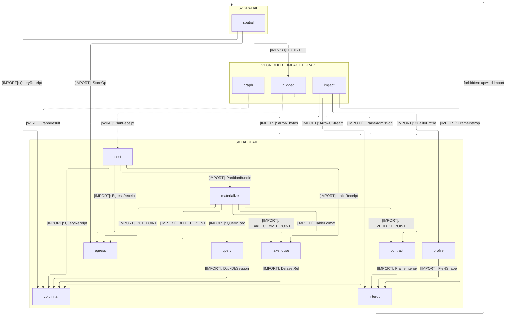
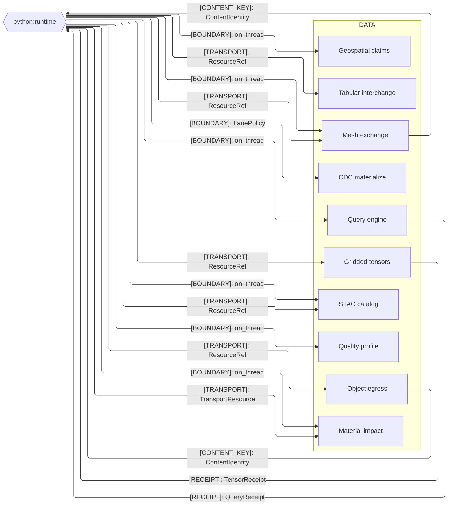
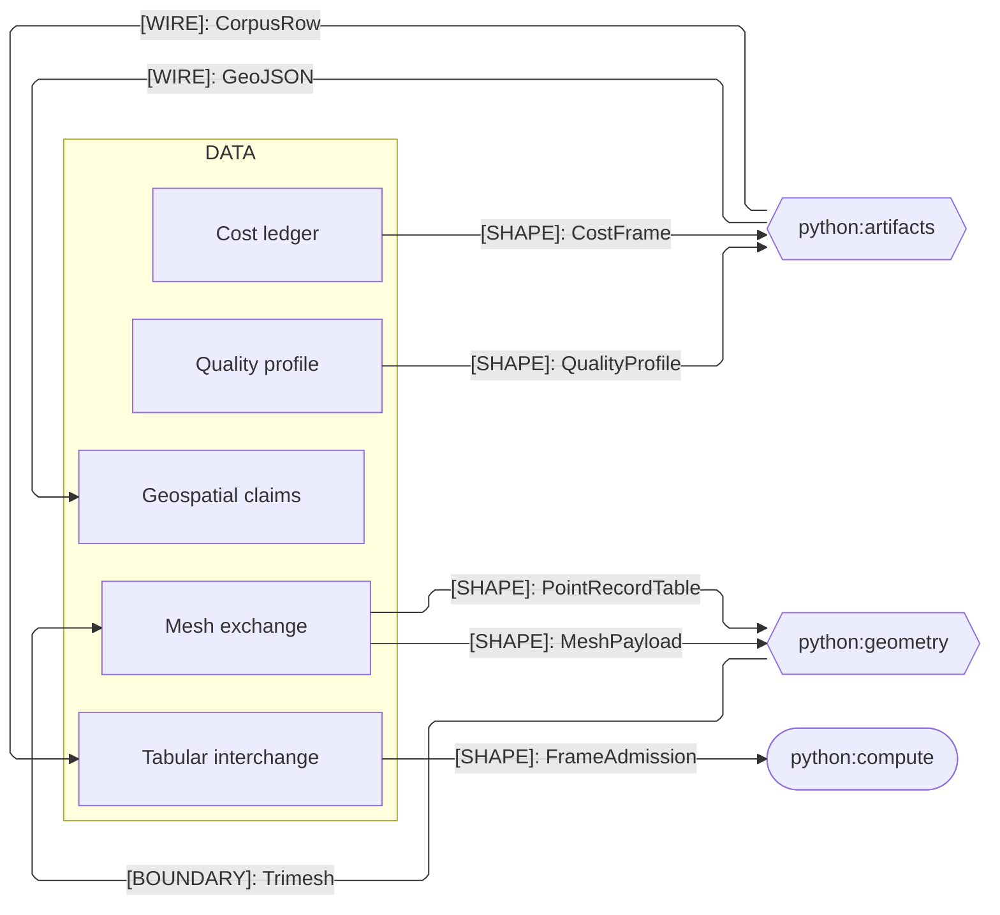
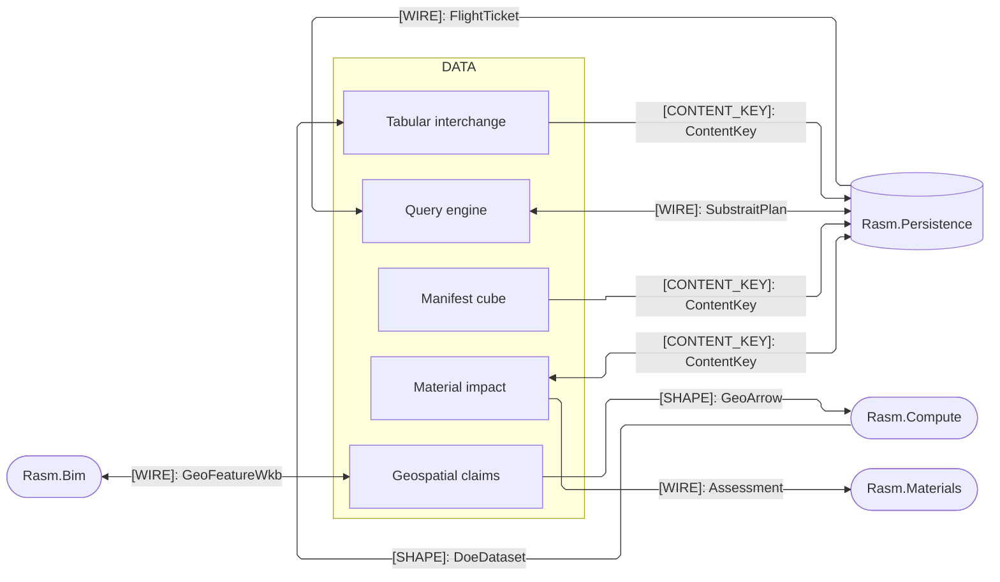

# [PY_DATA_ARCHITECTURE]

`data` maps host-free data interchange onto one module per domain concept, each closing its whole concern behind a single polymorphic owner. A `tabular` interchange core carries the columnar, lakehouse, query, materialize, contract, interop, and egress spine, and the `spatial`, `gridded`, `graph`, and `impact` planes each own a distinct domain. Every `from rasm.data.*` import binds a strictly-earlier module, so the module set is a provable acyclic DAG; `[03]-[SEAMS]` records only the cross-`libs/` and cross-language crossings, never an intra-`data` composition.

## [01]-[DOMAIN_MAP]

```text codemap
data/
├── tabular/              # Columnar, relational, and lakehouse interchange plane and its object-store egress
│   ├── interop.py        # Backend-agnostic frame owner, FieldShape minter, and Arrow zero-copy carrier
│   ├── columnar.py       # Dataset-ref owner and the one request-scoped DuckDbSession scan rail
│   ├── lakehouse.py      # Lakehouse owner over the LakeOp lifecycle and table-format bindings
│   ├── query.py          # Query engine folding every QuerySpec frontend to uniform Arrow
│   ├── materialize.py    # CDC materialization composing lakehouse, query, and columnar downward
│   ├── contract.py       # Structural admission, covenant, and quality gate folded on one ContractClaim
│   ├── profile.py        # Quality-profile owner grading a frame the artifacts renderer renders
│   ├── egress.py         # Object-store egress owner over one StoreOp axis keyed by content identity
│   └── cost.py           # Cost ledger folding the receipt families into the priced tenant-attributed frame
├── spatial/              # Vector and raster claims, the DuckDB-spatial engine, the DGG plane, STAC catalog, mesh exchange
│   ├── geospatial.py     # Vector and raster geo claims over the VectorOp and RasterOp axes
│   ├── query.py          # DuckDB-spatial join, transform, and H3 engine on the shared session rail
│   ├── grid.py           # GridSystem DGG plane and frame-native geometry algebra
│   ├── catalog.py        # StacCatalog owner over search, item table, and asset-href egress
│   └── mesh.py           # Mesh-file exchange owner over the backend axis and point-cloud row
├── gridded/              # Chunked N-D dense, virtual, and ragged tensor stores with the CF labelled-field store
│   ├── store.py          # Dense chunked N-D tensor store over the TensorBackend engines and the bounded-memory cubed plan
│   ├── virtual.py        # Sole manifest-cube owner over manifest write, registration, and the icechunk version-operation axis
│   ├── ragged.py         # Ragged N-D store over awkward with a zero-copy Arrow bridge
│   └── field.py          # CF field-dataset owner over the CF engines and grouped reductions
├── graph/                # Rustworkx graph payloads with a networkx codec lane and typed receipts
│   └── graph.py          # Graph-payload owner over the run kernel and the community-detection split
└── impact/               # Material environmental impact: EPD ingest and LCA compute on one EN 15804 carrier
    └── impact.py         # MaterialImpact owner folding the ImpactSource axis into one EN 15804 matrix
```

## [02]-[STRATA]

Strata rank the data interior; seating rows carry only the law the fence cannot show.



- S0 `tabular` — `interop` and `columnar` form the floor; `contract`, `profile`, `query`, `lakehouse`, and `egress` own independent branches.
- S0 `materialize` closes the operational apex, folding every hook point through one scope-keyed registration rail.
- S0 `cost` closes the evidence apex, folding sibling receipt families into the priced frame.
- S1 `gridded` + `impact` — both compose the tabular floor alone; the fence carries impact's floor imports.
- S1 `gridded` rides the interop `ArrowCStream` carrier for its ragged Arrow bridge; `virtual` mints the field `FieldReceipt` family in-folder.
- S1 tensor `PlanReceipt` lowering crosses into the tabular cost ledger as wire data, never an import.
- S1 `graph` — import-isolated, composing runtime alone; its `GraphResult.frame` node table crosses into columnar as wire data, never an import.
- S2 `spatial` — apex consumer composing columnar, the object egress (`ObjectEgress`/`StoreOp`), and the gridded virtual plane (`VirtualReference`).

## [03]-[SEAMS]







Fences split by peer plane — host runtime, Python siblings, C# peers. Each collapsed edge stands for every contract at that kind between the two owners, and the owning pages enumerate the rest. `GeoFeatureWkb` spells from its Rasm.Bim owner; the crossing carries raw WKB — `GeoDataFrame.to_wkb` outbound, `ST_GeomFromWKB` on admission — and no data-interior type re-mints the label.

An intra-`data` relation is composition, never a seam; `[02]-[STRATA]` renders the acyclic import DAG this registry excludes.

Every `[CONTENT_KEY]` edge derives one typed identity through the runtime `ContentIdentity` primitive over the public `arrow_bytes` fold, never a per-page hash, and each crossing agrees with its counterpart page verbatim. A single-sided edge is declared on the producing side and binds its counterpart when that page lands its mirror row.
