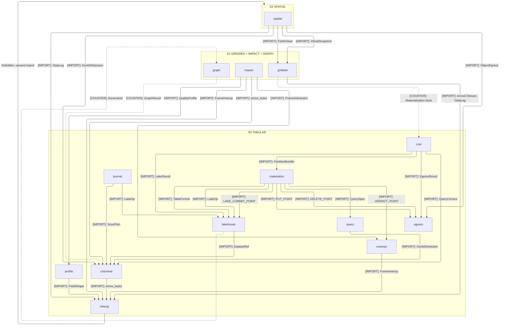
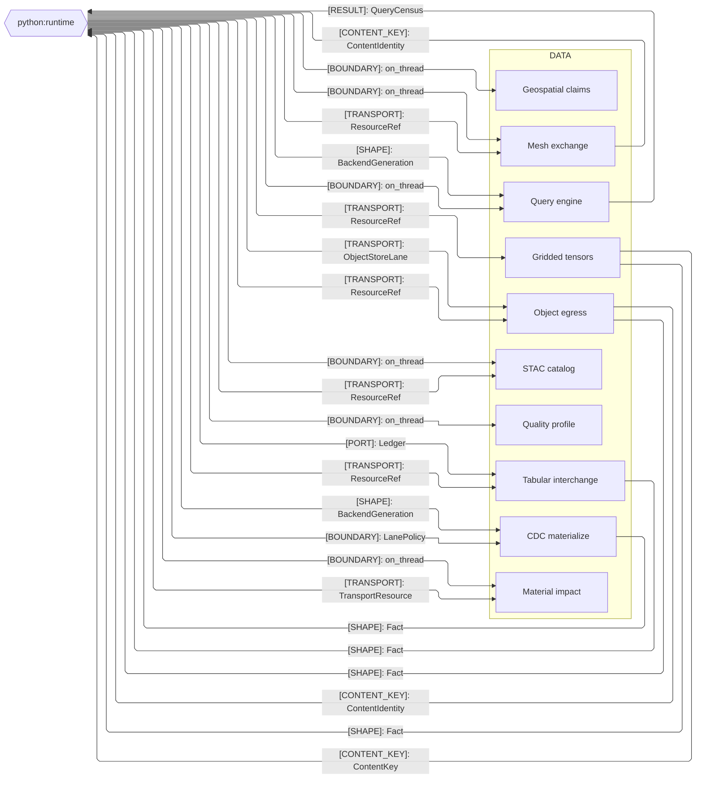
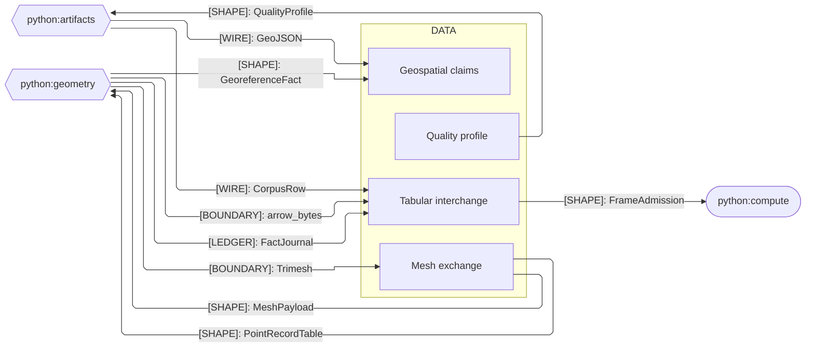
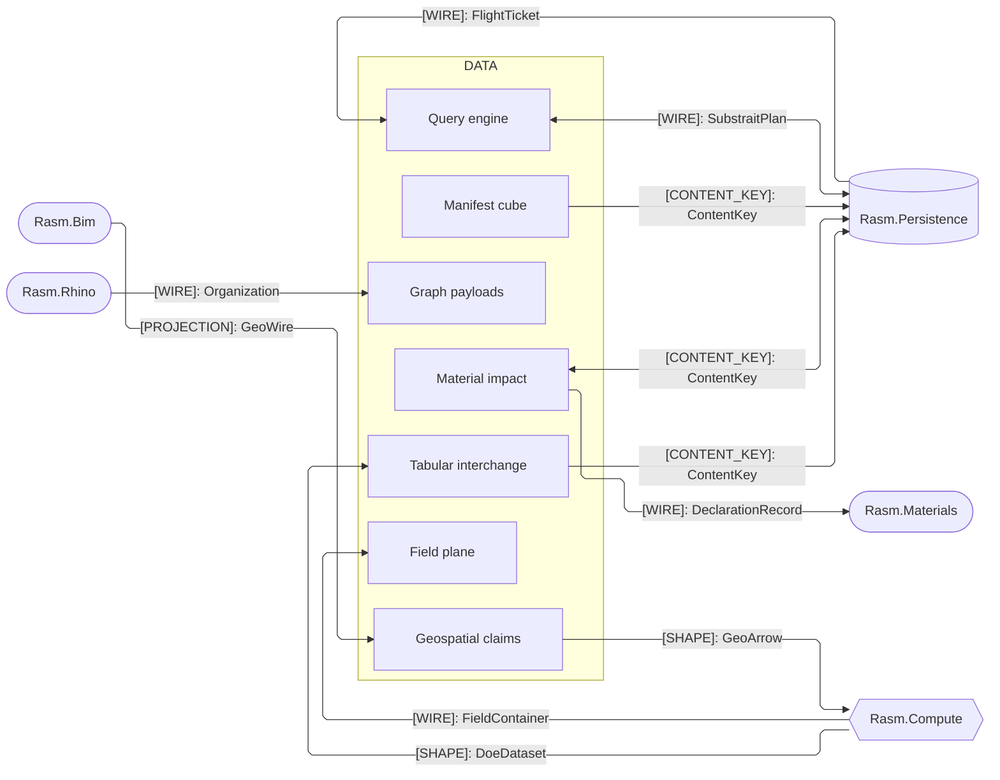
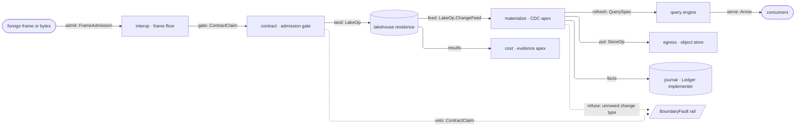

# [PY_DATA_ARCHITECTURE]

`data` maps host-free data interchange onto one module per domain concept, each closing its whole concern behind a single polymorphic owner. `tabular` carries the columnar, lakehouse, query, materialize, contract, interop, and egress interchange spine; the `spatial`, `gridded`, `graph`, and `impact` planes each own a distinct domain. Every `from rasm.data.*` import binds a strictly-earlier module, so the module set is a provable acyclic DAG.

## [01]-[DOMAIN_MAP]

```text
data/
├── tabular/              # Columnar, relational, and lakehouse interchange plane and its object-store egress
│   ├── interop.py        # FrameInterop Backend axis; ArrowCStream C-Data hops; DataLeg/DataHook rosters, ColumnSpec, FieldShape
│   ├── columnar.py       # DatasetRef source-shape discriminant; the scan base over interop alone, zero back-edges
│   ├── lakehouse.py      # Lakehouse owner over the LakeOp lifecycle and table-format bindings; Capability, Fence, the Generation roster
│   ├── query.py          # QuerySpec tagged union: sqlglot-gated SQL, relational, narwhals, Ibis IR, the RemoteOp leg
│   ├── materialize.py    # DerivedSnapshot partition-delta recompute; PartitionBundle Merkle-folds child content keys
│   ├── contract.py       # Structural admission, covenant, and quality gate folded on one ContractClaim
│   ├── profile.py        # Quality-profile owner grading a frame the artifacts renderer renders
│   ├── egress.py         # ObjectEgress result-and-governance surface composing the runtime store lane whole
│   ├── cost.py           # CostFact.of polymorphic result harvest; CostLedger.frame group-fold under a rate policy
│   └── journal.py        # FactJournal over the lakehouse commit matrix and the columnar reader; composed, not widened
├── spatial/              # Vector and raster claims, the DuckDB-spatial engine, the DGG plane, STAC catalog, mesh exchange
│   ├── geospatial.py     # VectorGeoClaim and RasterGeoClaim carriers; pyproj axis-order-aware reproject prelude
│   ├── query.py          # ST_GeomFromWKB geometry-view admission; one capability past the generic relational dispatch
│   ├── grid.py           # GridSystem DGG plane and frame-native geometry algebra
│   ├── catalog.py        # StacCatalog owner over search, item table, and asset-href egress
│   ├── mesh.py           # Mesh-file exchange owner over the backend axis and point-cloud row
│   └── cube.py           # GeometryIndex zone dimension joining field cubes to vector claims; no zone-id join table
├── gridded/              # Chunked N-D dense, virtual, and ragged tensor stores with the CF labelled-field store
│   ├── store.py          # TensorStore zarr v3 chunk grid; ZARR sync and TENSORSTORE async engines over one grid
│   ├── virtual.py        # FieldVirtual byte-range aggregation and VirtualReference chunk registration, copying no byte
│   ├── ragged.py         # RaggedSource admission, RaggedOp transforms, RaggedSink egress over columnar option rows
│   ├── field.py          # FieldEngine axis, flox-vectorized FieldSelection folds, and content-keyed egress
│   └── ensemble.py       # DataTree leaves stay field-plane cubes; cross-scenario map, reduce, and difference in one call
├── graph/                # Rustworkx graph payloads with a networkx codec lane and canonical results
│   ├── graph.py          # License-split backend triangle; analysis collapses onto the rustworkx kernel, stable int ids
│   └── network.py        # FlowAlgorithm arms over the networkx flow kernels alone; results lower onto GraphResult
└── impact/               # Material environmental impact: EPD ingest and LCA compute on one EN 15804 carrier
    ├── impact.py         # MaterialImpact owner folding the ImpactSource axis into one EN 15804 matrix
    ├── declaration.py    # Dated identity-bearing record per verified declaration: issuer, dates, coverage census
    ├── inventory.py      # bw2data project scope, the bw2io ingestion pipeline, and MatrixPackage for the solver
    ├── solve.py          # LcaBatch one-factorization sweeps; Contribution top-process, emission, and chain mining
    └── scenario.py       # IAM (model, pathway, year) transform registered back into the Brightway project, proved
```

## [02]-[STRATA]

Strata rank the data interior; seating rows carry only the law the fence cannot show. S0 seats module-grain nodes and S1-S2 folder-grain ones, so the tabular floor's interior edges draw while the upper folders compose whole.


```mermaid
---
config:
  layout: elk
  flowchart:
    curve: linear
    padding: 25
---
flowchart TB
    accTitle: Data interior import strata
    accDescr: How the data interior ranks over the tabular floor, the dashed GraphResult and Materialization counter-edges carrying wire data downward.
    subgraph D2["S2 SPATIAL"]
        Spatial[spatial]
    end
    subgraph D1["S1 GRIDDED + IMPACT + GRAPH"]
        Graph[graph]
        Impact[impact]
        Gridded[gridded]
    end
    subgraph D0["S0 TABULAR"]
        Journal[journal]
        Cost[cost]
        Egress[egress]
        Materialize[materialize]
        Query[query]
        Lakehouse[lakehouse]
        Columnar[columnar]
        Contract[contract]
        Profile[profile]
        Interop[interop]
    end
    Spatial e1@-->|"[IMPORT]: DuckDbSession"| Columnar
    Spatial e30@-->|"[IMPORT]: DataLeg"| Interop
    Spatial e2@-->|"[IMPORT]: ObjectEgress"| Egress
    Spatial e3@-->|"[IMPORT]: FieldVirtual"| Gridded
    Spatial e4@-->|"[IMPORT]: VirtualSnapshot"| Gridded
    Gridded e5@-->|"[IMPORT]: ArrowCStream, DataLeg"| Interop
    Impact e6@-->|"[IMPORT]: FrameAdmission"| Contract
    Impact e7@-->|"[IMPORT]: QualityProfile"| Profile
    Impact e8@-->|"[IMPORT]: FrameInterop"| Interop
    Impact e9@-->|"[IMPORT]: arrow_bytes"| Columnar
    Graph e10@-.->|"[COUNTER]: GraphResult"| Columnar
    Lakehouse e31@-.->|"[COUNTER]: Generation"| Graph
    Journal e11@-->|"[IMPORT]: LakeOp"| Lakehouse
    Journal e12@-->|"[IMPORT]: ScanPlan"| Columnar
    Materialize e13@-->|"[IMPORT]: QuerySpec"| Query
    Materialize e14@-->|"[IMPORT]: TableFormat"| Lakehouse
    Materialize e15@-->|"[IMPORT]: LakeOp"| Lakehouse
    Materialize e16@-->|"[IMPORT]: LAKE_COMMIT_POINT"| Lakehouse
    Materialize e17@-->|"[IMPORT]: VERDICT_POINT"| Contract
    Materialize e18@-->|"[IMPORT]: PUT_POINT"| Egress
    Materialize e19@-->|"[IMPORT]: DELETE_POINT"| Egress
    Query e20@-->|"[IMPORT]: DuckDbSession"| Columnar
    Lakehouse e21@-->|"[IMPORT]: DatasetRef"| Columnar
    Contract e22@-->|"[IMPORT]: FrameInterop"| Interop
    Columnar e23@-->|"[IMPORT]: arrow_bytes"| Interop
    Profile e24@-->|"[IMPORT]: FieldShape"| Interop
    Cost e25@-->|"[IMPORT]: QueryCensus"| Columnar
    Cost e26@-->|"[IMPORT]: LakeResult"| Lakehouse
    Cost e27@-->|"[IMPORT]: PartitionBundle"| Materialize
    Cost e28@-->|"[IMPORT]: EgressResult"| Egress
    Gridded e29@-.->|"[COUNTER]: Materialization facts"| Cost
    Interop f1@-->|"forbidden: upward import"| D2
```

- S0 `tabular` — `interop` the floor, `columnar` the scan base above it; `contract`, `profile`, `query`, `lakehouse`, `egress` branch independently.
- S0 `materialize` closes the operational apex, folding every hook point through one scope-keyed registration rail.
- S0 `materialize` threads the root-bound `BackendGeneration` into every per-partition query, so one refresh reads one contract generation.
- S0 `materialize` reads the change feed through the `lakehouse` `LakeOp.ChangeFeed` result payload, never a CDF provider of its own.
- S0 `cost` prices canonical results it never produces, so the fold imports result families one-way.
- S1 `gridded` + `impact` — both compose the tabular floor alone, holding no edge between themselves or to `graph`.
- S1 `virtual` returns the manifest `ContentKey`, and `field`'s raw read leg decodes the corpus container without a tabular hop.
- S1→S0 `gridded -> cost` — `Materialization.facts()` crosses as wire DATA on the counter-edge, never an import, so the price fold adds no cycle.
- S1→S0 `graph -> columnar` — `GraphResult` crosses as wire DATA on the counter-edge; `graph` stays import-isolated, composing runtime alone.
- S0→S1 `lakehouse -> graph` — `LakeOp.Ancestry` projects a `Generation` edge frame as wire DATA, so version-lineage walks stay the rustworkx kernel.
- S1 `network` composes `graph` strictly downward inside the subfolder; the flow family adds no new stratum edge.
- S1 `impact` siblings — `inventory`, `solve`, and `scenario` compose runtime alone and feed the carrier's cases, never a second matrix.
- S1 `declaration` composes `impact` strictly downward for the `ImpactRegime` method order alone — a local preference forks edition policy.
- S2 `spatial` — apex consumer composing columnar, the `ObjectEgress` result owner, and the gridded `VirtualReference` plane.
- S2 `spatial` store operations cross from the runtime lane, never from `tabular`; `cube` egresses with the gridded content key.

## [03]-[SEAMS]


```mermaid
---
config:
  layout: elk
  flowchart:
    curve: linear
    padding: 25
---
flowchart LR
    accTitle: Data package Python host-runtime seam registry
    accDescr: Which kinded contracts cross between the data owners and the Python host runtime, the evidence port and facts among them.
    subgraph data[DATA]
        Tabular[Tabular interchange]
        Egress[Object egress]
        Query[Query engine]
        Materialize[CDC materialize]
        Catalog[STAC catalog]
        Gridded[Gridded tensors]
        Impact[Material impact]
        Profile[Quality profile]
        Geospatial[Geospatial claims]
        Mesh[Mesh exchange]
    end
    Runtime{{python:runtime}}
    Egress e1@-->|"[CONTENT_KEY]: ContentIdentity"| Runtime
    Query e2@-->|"[RESULT]: QueryCensus"| Runtime
    Gridded e3@-->|"[CONTENT_KEY]: ContentKey"| Runtime
    Mesh e4@-->|"[CONTENT_KEY]: ContentIdentity"| Runtime
    Tabular e5@-->|"[SHAPE]: Fact"| Runtime
    Egress e6@-->|"[SHAPE]: Fact"| Runtime
    Materialize e7@-->|"[SHAPE]: Fact"| Runtime
    Gridded e8@-->|"[SHAPE]: Fact"| Runtime
    Runtime e9@-->|"[TRANSPORT]: ResourceRef"| Tabular
    Runtime e10@-->|"[PORT]: Ledger"| Tabular
    Runtime e11@-->|"[TRANSPORT]: ResourceRef"| Egress
    Runtime e12@-->|"[TRANSPORT]: ObjectStoreLane"| Egress
    Runtime e13@-->|"[BOUNDARY]: on_thread"| Query
    Runtime e14@-->|"[SHAPE]: BackendGeneration"| Query
    Runtime e15@-->|"[BOUNDARY]: LanePolicy"| Materialize
    Runtime e16@-->|"[SHAPE]: BackendGeneration"| Materialize
    Runtime e17@-->|"[TRANSPORT]: ResourceRef"| Catalog
    Runtime e18@-->|"[BOUNDARY]: on_thread"| Catalog
    Runtime e19@-->|"[TRANSPORT]: ResourceRef"| Gridded
    Runtime e20@-->|"[TRANSPORT]: TransportResource"| Impact
    Runtime e21@-->|"[BOUNDARY]: on_thread"| Impact
    Runtime e22@-->|"[BOUNDARY]: on_thread"| Profile
    Runtime e23@-->|"[BOUNDARY]: on_thread"| Geospatial
    Runtime e24@-->|"[TRANSPORT]: ResourceRef"| Mesh
    Runtime e25@-->|"[BOUNDARY]: on_thread"| Mesh
```


```mermaid
---
config:
  layout: elk
  flowchart:
    curve: linear
    padding: 25
---
flowchart LR
    accTitle: Data package Python domain-peer seam registry
    accDescr: Which kinded contracts cross between the data owners and the Python sibling packages.
    subgraph data[DATA]
        Tabular[Tabular interchange]
        Profile[Quality profile]
        Geospatial[Geospatial claims]
        Mesh[Mesh exchange]
    end
    Artifacts{{python:artifacts}}
    Geometry{{python:geometry}}
    Compute([python:compute])
    Artifacts e1@-->|"[WIRE]: CorpusRow"| Tabular
    Geometry e2@-->|"[BOUNDARY]: arrow_bytes"| Tabular
    Geometry e3@-->|"[LEDGER]: FactJournal"| Tabular
    Profile e4@-->|"[SHAPE]: QualityProfile"| Artifacts
    Artifacts e5@-->|"[WIRE]: GeoJSON"| Geospatial
    Geometry e6@-->|"[SHAPE]: GeoreferenceFact"| Geospatial
    Mesh e7@-->|"[SHAPE]: MeshPayload"| Geometry
    Mesh e8@-->|"[SHAPE]: PointRecordTable"| Geometry
    Geometry e9@-->|"[BOUNDARY]: Trimesh"| Mesh
    Tabular e10@-->|"[SHAPE]: FrameAdmission"| Compute
```


```mermaid
---
config:
  layout: elk
  flowchart:
    curve: linear
    padding: 25
---
flowchart LR
    accTitle: Data package .NET-peer seam registry
    accDescr: Data sub-domain owners exchanging frame shapes, content keys, plan wires, and the environmental set with the .NET peers.
    subgraph data[DATA]
        Tabular[Tabular interchange]
        Query[Query engine]
        Geospatial[Geospatial claims]
        Virtual[Manifest cube]
        Field[Field plane]
        Impact[Material impact]
        Graph[Graph payloads]
    end
    Persistence[(Rasm.Persistence)]
    Materials([Rasm.Materials])
    Compute{{Rasm.Compute}}
    Bim([Rasm.Bim])
    Rhino([Rasm.Rhino])
    Compute e1@-->|"[SHAPE]: DoeDataset"| Tabular
    Compute e2@-->|"[WIRE]: FieldContainer"| Field
    Geospatial e3@-->|"[SHAPE]: GeoArrow"| Compute
    Tabular e4@-->|"[CONTENT_KEY]: ContentKey"| Persistence
    Query e5@<-->|"[WIRE]: SubstraitPlan"| Persistence
    Virtual e6@-->|"[CONTENT_KEY]: ContentKey"| Persistence
    Impact e7@<-->|"[CONTENT_KEY]: ContentKey"| Persistence
    Bim e8@-->|"[PROJECTION]: GeoWire"| Geospatial
    Rhino e9@-->|"[WIRE]: Organization"| Graph
    Persistence e10@-->|"[WIRE]: FlightTicket"| Query
    Impact e11@-->|"[WIRE]: DeclarationRecord"| Materials
```

Fences split by peer plane: host runtime, Python siblings, .NET peers. Each collapsed edge stands for every contract at that kind between the two owners, and the owning pages enumerate the rest.

`[PORT]` and `[SHAPE]: Fact` run one evidence spine in opposite directions: runtime declares the `Ledger` a data owner implements, and every data mutation leg records its own facts back through that port's writer. Geometry's mesh census lands its `FactJournal` rows through the same ledger leg. Producing legs are awaitable by law, so a synchronous entrypoint carries no such edge.

Intra-`data` relations are composition, never seams; `[02]-[STRATA]` renders the acyclic import DAG this registry excludes.

Every `[CONTENT_KEY]` edge derives one typed identity through the runtime `ContentIdentity` primitive over the public `arrow_bytes` fold, never a per-page hash, and each crossing agrees with its counterpart page verbatim. Single-sided edges declare on the producing side and bind their counterpart when that page lands its mirror row.

## [04]-[INTERNAL]

One interchange spine runs the tabular floor: frames admit once at `interop`, gate through `contract`, land on the lakehouse residence, and serve through `query`; `materialize` closes the operational apex while `cost` and `journal` close the evidence apex. Exact per-stage wiring lives on the owning implementation pages.


```mermaid
---
config:
  layout: elk
  flowchart:
    curve: linear
    padding: 25
---
flowchart LR
    accTitle: Data tabular interchange spine
    accDescr: How a foreign frame admits, gates, lands, refreshes, and serves, with results and facts closing on the evidence apex.
    Foreign([foreign frame or bytes]) e1@-->|"admit: FrameAdmission"| Interop[interop · frame floor]
    Interop e2@-->|"gate: ContractClaim"| Contract[contract · admission gate]
    Contract e3@-->|"land: LakeOp"| Lakehouse[(lakehouse residence)]
    Lakehouse e4@-->|"feed: LakeOp.ChangeFeed"| Materialize[materialize · CDC apex]
    Materialize e5@-->|"refresh: QuerySpec"| Query[query engine]
    Materialize e6@-->|"put: StoreOp"| Egress[egress · object store]
    Query e7@-->|"serve: Arrow"| Consumers([consumers])
    Lakehouse e8@-->|"results"| Cost[cost · evidence apex]
    Materialize e9@-->|"facts"| Journal[(journal · Ledger implementer)]
    Contract f1@-.->|"veto: ContractClaim"| Fault[/BoundaryFault rail/]
    Materialize f2@-.->|"refuse: unrowed change type"| Fault
```

- Admission runs once at `interop` — every keyer imports the one whole-table `arrow_bytes` serialization, so no second preimage spelling exists.
- `spatial` persists through `egress`'s `ObjectEgress` results — no spatial page opens a store lane of its own.
- `gridded` decodes once — the ragged bridge crosses the interop carrier and `virtual` registers byte ranges, copying none.
- `graph` and `impact` lift at the seam — results lower onto `GraphResult` frames and the EN 15804 carrier before any tabular hop.

## [05]-[BOUNDARIES]

- `data` owns host-free interchange and residence — admission, movement, query, and evidence over its own planes.
- Engine selection stays interior: `EngineProfile` meets compute's jit band at `FrameAdmission` alone, neither folder re-owning the peer's decoder.
- Graph-analytic reduction splits by analytic family — data answers flow and payload analysis; mesh-feature analytics stay geometry's.
- `trimesh` crosses as the mesh-exchange boundary value; geometry keeps its own registration and topology.
- Wire structs stay runtime-minted, and store state past the emitted `ContentKey` stays `Rasm.Persistence`'s.
- `Ledger` binds at the composition root as the runtime port `journal` implements; no data page opens a durable plane of its own.
