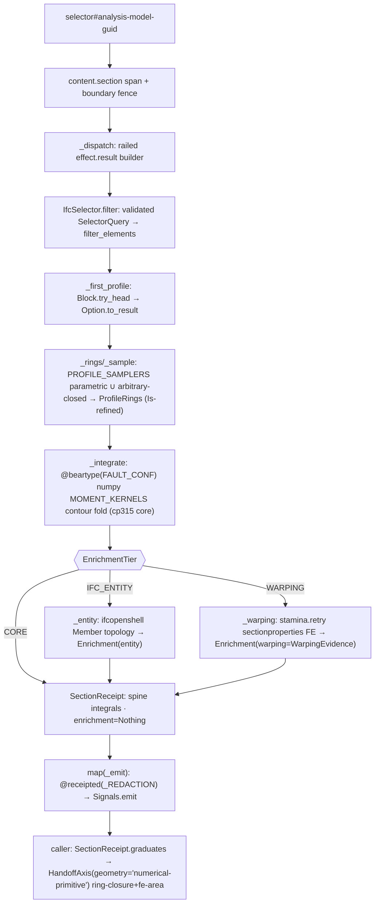

# [PY_GEOMETRY_IFC_STRUCTURAL]

The cross-section structural-property owner — the section-integral and structural-member verbs the analysis and lifecycle hops drop. `IfcStructural` resolves a closed-form section-property receipt from a profile polygon's ring coordinates by one `numpy` Green's-theorem contour fold over a `MOMENT_KERNELS` polynomial-weight table (area, first and second area moments, centroid, principal second moments and principal-axis rotation, polar moment, the centroid-relative elastic section moduli, and the thin-walled Bredt torsion constant) and tiers that cp315-clean spine with two gated enrichment layers selected by one `EnrichmentTier` policy vocabulary: the `ifcopenshell` structural-analysis-model layer reading `IfcStructuralAnalysisModel`/`IfcStructuralMember` topology onto the member, and the `sectionproperties` warping/plastic/shear layer meshing the same rings into a triangular FE section for the warping, plastic, and shear receipts no closed-form integral derives. The two enrichments are not six parallel optional slots and a loose member tuple — they are one `Enrichment` `@tagged_union` riding a single `SectionReceipt.enrichment` field, the `entity` case carrying the structural-member GlobalIds and the `warping` case carrying the FE `WarpingEvidence` value object, so the tier discriminant and the evidence shape are the same union and a `CORE` receipt carries `Nothing` rather than nine `None` slots racing the tier.

The owner is the same woven rail every evidence owner rides, not a flat per-library call sequence. `numpy` folds the spine; `expression` carries it — the dispatch is a `RuntimeRail`-returning `effect.result` builder over the validated selector rail, `Block`/`Option` traversals own the ring extraction and the member fold, and no arm raises in domain flow. `beartype.vale.Is` refines `ProfileRings` to finite non-degenerate coordinates at the `@beartype(conf=FAULT_CONF)` spine boundary so a `NaN`/empty ring rails through the `CLASSIFY` `api` row before the contour fold reads it; `stamina.retry` wraps the `sectionproperties` `cytriangle` mesh-and-solve as the one transient-native-failure boundary; the whole admission runs inside one `content.section` OTel span weaving the runtime `boundary` fault fence and the `@receipted(_REDACTION)` egress aspect, so a provider exception, a degenerate ring, and an FE divergence each fold onto one `RuntimeRail[SectionReceipt]` and the receipt streams through the canonical `Signals.emit` decorator rail rather than an inline emit. The selector never threads raw into `filter_elements`: the `spec` is admitted once through `IfcSelector.filter`/`IfcSelector.parse` from `geometry:ifc/selector.md#SELECTOR`, so a malformed profile selector is a typed `Error(BoundaryFault)` at admission and the validated `SelectorQuery.filter_string` re-serializes to the grammar `ifcopenshell` consumes.

The receipt graduates through the compute `HandoffAxis` geometry case as the `numerical-primitive` subject the literal `python:compute/graduation/handoff.md#HANDOFF` owns — the same case the sibling `geometry:ifc/analysis.md#ANALYSIS` and `geometry:ifc/costing.md#LIFECYCLE` evidence crosses on, carried by the module `STRUCTURAL_SUBJECT` constant typed as that imported union, never a per-receipt `subject: str` field racing the discriminant. The spine rides the cp315 core (`numpy`) and never depends on either gated layer: the IFC-entity layer rides the `ifcopenshell` companion lane and the warping layer rides the `python_version<'3.15'` gated band (`sectionproperties`, native mesh backend `cytriangle` LGPLv3), so a `CORE` run computes the full section-integral receipt on the bare cp315 interpreter and the two upper tiers add evidence only where their interpreter resolves. The C# `IfcSemanticModel` projects the spatial hierarchy in-process; this owner adds the numerical section dimension the managed projection does not produce.

## [01]-[INDEX]

- [01]-[STRUCTURAL]: the section-integral spine and the two gated enrichment tiers under one `EnrichmentTier`-discriminated owner folding the per-tier evidence into one `Enrichment` tagged union, woven through the `effect.result` rail with `beartype`/`stamina`/OTel/`@receipted`, emitting the `numerical-primitive` graduation subject.

## [02]-[STRUCTURAL]

- Owner: `IfcStructural` — the `@staticmethod` boundary capsule mirroring `IfcAnalysis` and `IfcLifecycle`, dispatching the enrichment tiers over the section-integral spine and the two gated layers as one `RuntimeRail`-returning `effect.result` fold; `EnrichmentTier` the closed `IntEnum` ordering the tiers by interpreter floor (`CORE=0` on bare cp315, `IFC_ENTITY=1` on the `ifcopenshell` companion lane, `WARPING=2` on the gated `<'3.15'` `cytriangle` band) so the ordinal encodes the rising resolution floor — `CORE` ⊂ each upper tier on the spine, but `IFC_ENTITY` and `WARPING` are PARALLEL enrichments the single-slot `Option[Enrichment]` admits one of, never a `IFC_ENTITY` ⊂ `WARPING` set-inclusion the `WARPING` arm (spine + FE only, no entity topology) does not honour — and a single policy value selects which enrichment a run carries over the shared spine rather than three sibling entry functions; `Enrichment` the `@tagged_union` of per-tier evidence (`entity` carrying the `tuple[str, ...]` structural-member GlobalIds, `warping` carrying the `WarpingEvidence` value object), collapsing the prior nine `None`-absent slots into one discriminated field whose case IS the tier evidence; `WarpingEvidence` the frozen FE value object holding the `fe_torsion_constant`/`fe_area`/`shear_center`/`shear_areas`/`plastic_moduli`/`mesh_elements` `sectionproperties` scalars so the warping payload is one cohesive shape, never six parallel optionals; `SectionReceipt` the typed `ReceiptContributor` carrying the spine integrals plus the `Option[Enrichment]` slot, owning its own `measured` ledger, `contribute` (the two-argument `Receipt.of(owner, evidence)` row), and `graduates` (the one `GraduationReceipt.graduates` admission) like the sibling `AnalysisResult`; `ProfileRings` the `beartype.vale.Is`-refined value object holding the outer ring and the interior void rings as `float64` `(n, 2)` coordinate arrays the spine integrates and the warping layer meshes; `MOMENT_KERNELS` the moment-weight policy table the one contour fold reads, collapsing the six near-identical shoelace integrals into one data-driven projection; `PROFILE_SAMPLERS` the parametric-subtype sampling table mapping each parameterized `IfcProfileDef` (rectangle, hollow rectangle, circle, hollow circle, I-shape) to the ring-tuple closure so a parametric profile is the same ring input as the arbitrary-closed-profile coordinate read, never a per-shape integral family.
- Spine: `_integrate` is the cp315-clean `@beartype(conf=FAULT_CONF)`-fenced kernel — the `Is`-refined `ProfileRings` reach it already finite and non-degenerate, so a `NaN`/empty/zero-area ring raises the canonical `BeartypeCallHintViolation` the `CLASSIFY` `api` row folds onto the rail before the fold reads it rather than dividing by a zero area three lines deep. It folds Green's-theorem contour integrals over each closed ring with `numpy` `roll` shoelace cross-products, signs the void rings opposite the outer ring through the `ProfileRings.signed` projection, and reads each moment off the `MOMENT_KERNELS` table rather than six hand-unrolled accumulator lines: every row carries its polynomial vertex-weight closure and its divisor, so area, first moments `Qx`/`Qy`, and origin second moments `Ixx`/`Iyy`/`Ixy` are one `sum(weight(x, y, xn, yn) * cross) / divisor` projection over the table, vectorized per ring as `numpy` ufuncs. It derives the centroid `(cx, cy)`, the centroidal second moments via the parallel-axis shift, the polar moment `Ip = Ixx_c + Iyy_c`, and the principal second moments and principal-axis rotation `phi` from the closed-form eigen-solution of the 2×2 centroidal inertia tensor through `numpy` `linalg.eigh`/`argmax`/`arctan2` — `eigh` returns ascending eigenvalues with column-aligned eigenvectors, so the fold indexes the major axis off `argmax(principal)` and reads `phi` from that same column, pairing `principal_moments[0]` and `principal_angle` to one axis rather than racing the `eigh` ordering; the thin-walled Bredt torsion constant derives from the enclosed area and the ring perimeter over `vstack`/`diff`/`linalg.norm`. No spine field touches `ifcopenshell` or `sectionproperties`; the spine is a pure `numpy` fold over the ring arrays, and a new section integral is one `MOMENT_KERNELS` row plus one `SectionReceipt` field — never a per-integral function.
- Cases: `EnrichmentTier` rows `CORE` (the `numpy` section-integral spine only — area, centroid, second moments, principal axes, polar moment, thin-walled torsion, on the bare cp315 interpreter, `enrichment` `Nothing`) · `IFC_ENTITY` (the spine plus the `ifcopenshell` structural-analysis-model layer reading `IfcStructuralAnalysisModel`/`IfcStructuralMember` member topology onto an `Enrichment(entity=...)` case) · `WARPING` (the spine plus the `sectionproperties` triangular-FE warping/plastic/shear layer over the same rings onto an `Enrichment(warping=WarpingEvidence(...))` case, gated `<'3.15'`, `cytriangle` LGPLv3) — matched by `match`/`assert_never` inside the `effect.result` builder, each arm `yield from`-binding its layer's `RuntimeRail[Enrichment]` so the selector parse fault and the provider exception compose on one rail, each upper tier running the shared spine then folding ITS one layer's evidence onto the receipt — `IFC_ENTITY` and `WARPING` parallel over the common spine, not nested, since the single-slot `Option[Enrichment]` carries one case. A new enrichment layer is one `EnrichmentTier` row plus one `Enrichment` case plus one builder arm and breaks every dispatch site at type-check time under `ty`/`py_analyzer`.
- Selector gate: every tier's profile-bearing query is admitted through `IfcSelector.filter(model, selector)` — `IfcSelector.parse(selector).map(filter_elements)` — never threaded raw into `util.selector.filter_elements`, so a malformed profile selector is an `UnexpectedInput`-derived `Error(BoundaryFault)` lifted onto the rail at admission and the validated `SelectorQuery.filter_string` re-serializes to the `ifcopenshell` grammar. The selector is the one selection engine the dispatch composes; `IFC_ENTITY` resolves its `IfcStructuralAnalysisModel` by the `#`-suffixed guid off the same `spec`, the selector half feeding the member's profile rings and the guid half the structural-model topology.
- Entry: `IfcStructural.run` takes an `ifcopenshell.file`, an `EnrichmentTier`, and a `spec` whose meaning is fixed by the tier — a `<selector>` profile-bearing element query for `CORE`/`WARPING` resolving the `IfcProfileDef` rings off each selected element's material-profile assignment, a `<selector>#<analysis-model-guid>` query for `IFC_ENTITY` joining the selected members to their structural-analysis model — and returns a `RuntimeRail[SectionReceipt]` through one self-owned `content.section` span the `boundary(f"structural.{tier.name.lower()}", _dispatch)` fence runs INSIDE so the runtime `_convert` records a provider exception on the live span and sets ERROR, mirroring the `runtime:evidence/identity.md#IDENTITY` `content.derive` and `compute:graduation/handoff.md#GRADUATION` `content.graduate` span-owning shape — the faults owner annotates whatever span is current and never mints one, so the measured operation owns the span lifecycle. The rail weaves `.bind(identity)` flattening the railed `_dispatch`, `.map(_emit)` the `@receipted(_REDACTION)` egress, and `.map(_ok)` the clean-exit OK-status close-out the conversion never re-annotates, so a provider exception (a missing profile, a degenerate ring, a non-resolving structural model) converts to a `BoundaryFault` exactly once at the seam, a selector parse fault arrives already typed on the rail, and the `Ok`-arm receipt streams through the canonical `Signals.emit` fold before `_ok` sets `Status(StatusCode.OK)`. Graduation stays the caller's own step on the returned `SectionReceipt.graduates(evidence_key, ceiling)`, mirroring `IfcAnalysis.run`/`IfcLifecycle.run`, so `run` owns span-fence-emit and the receipt owns graduate-contribute. The `subjects` field derives from the tier's true subject set: profile-bearing element GlobalIds for `CORE`/`WARPING`, structural-member GlobalIds for `IFC_ENTITY` — so the subject field never carries a meaningless run.
- Auto: `_dispatch` is one `effect.result` builder, not a value-mapping ladder — it `yield from`-binds `IfcSelector.filter(model, selector)` so a malformed selector short-circuits the whole block to its typed `BoundaryFault`, binds `_first_profile(selector, elements)` (the `Block.try_head`-over-the-selected-set `Option.to_result(BoundaryFault(boundary=(subject, "no-profile-element")))` that replaces the prior `if not elements: raise LookupError` index fault, the `selector` threaded as the fault subject), folds the profile through `_rings`, and `yield from`-binds `_integrate(rings, subjects)` for the spine `SectionReceipt`. `_rings`/`_sample` is `get_psets`-independent ring extraction whose `_sample` projection dispatches the parametric subtypes through the `PROFILE_SAMPLERS` table (`IfcRectangleProfileDef`/`IfcRectangleHollowProfileDef`/`IfcCircleProfileDef`/`IfcCircleHollowProfileDef`/`IfcIShapeProfileDef` each folding their parametric attribute set into the closed `(outer, voids)` ring tuple, the hollow rows ordered ahead of their solid supertypes so the `is_a` `Block.choose`/`try_head` first-match lands an `IfcRectangleHollowProfileDef`/`IfcCircleHollowProfileDef` on its own hollow sampler rather than the solid base it also satisfies) and falls through to the `IfcArbitraryClosedProfileDef.OuterCurve`/`InnerCurves` `CoordList` direct coordinate read, so both paths hand the shape-agnostic contour integral the same ring tuple. The tier then selects the enrichment: `CORE` binds `Ok(spine)`, `IFC_ENTITY` binds `_entity(model, selector, model_guid)` and the `WARPING` arm binds `_warping(selector, rings, spine.area)` — each carrying the `selector` as its own fault subject — each a `RuntimeRail[Enrichment]` the builder folds onto the receipt through `replace(spine, tier=tier, subjects=..., enrichment=Some(enrichment))`. `_entity` resolves the `IfcStructuralAnalysisModel` by guid and folds its `IfcRelAssignsToGroup`-guarded `IsGroupedBy` `IfcStructuralMember` set through one `Block.choose` comprehension into an `Enrichment(entity=members)` — entity topology only, never re-deriving a section property, because the centroid-relative elastic section moduli (`I / c` over `_extreme_fibers`, the larger centroid-to-extreme-fibre reach per axis, never half the bounding-box span exact only for a doubly-symmetric profile) are a closed-form spine field every tier carries. `_warping` weaves three `sectionproperties` capabilities into one `stamina.retry`-wrapped rail: it builds the `pre.Geometry.from_points` region from the same `ProfileRings` by emitting one closed facet loop per ring through a `Block.fold` over `(points, facets)` with a per-ring index offset so the void rings are real meshed boundaries the triangulator carves out — not unbounded hole markers in a solid mesh — passes each void's guaranteed-interior `_interior_point` through the `holes` argument, runs `create_mesh(mesh_sizes)`, binds a `Section`, runs `calculate_geometric_properties` then `calculate_warping_properties` then `calculate_plastic_properties` in the one prerequisite order, folds the FE torsion constant `j`, the shear-center coordinates, the shear areas, and the plastic moduli off the `Section.get_*` accessors into the `WarpingEvidence`, AND reads the FE-derived geometric area back through `get_area` to cross-check the `numpy` spine area — the relative discrepancy is the `fe-area` convergence residual the graduation ledger keys against its ceiling. The closed-form spine fields stay `numpy`: the FE torsion lands on `WarpingEvidence.fe_torsion_constant`, never overwriting the spine's thin-walled `torsion_constant`, so the receipt carries both. No tier carries an `if/else` value ladder and no tier mints a sibling per-tier class — one builder arm per row, the layer that owns the tier bound directly.
- Receipt: `SectionReceipt` is the `ReceiptContributor` — `contribute` emits one `Receipt.of("rasm.geometry.ifc.structural", ("emitted", subject, facts))` row through the canonical two-argument contract carrying the tier tag and the tier-specific facts (the section integrals for every tier, plus the `Enrichment.facts` projection folding the structural-member count for the `entity` case and the FE mesh element count and torsion/shear/plastic scalars for the `warping` case), and `graduates` folds the tier-aware `measured` residual ledger through the one `GraduationReceipt.graduates(source_package, HandoffAxis(geometry=subject), evidence_key, measured, ceiling)` admission rather than inlining a ceiling comparison — the `STRUCTURAL_SUBJECT` `numerical-primitive` literal carried by the constant, never a per-receipt field. The `measured` ledger is data-driven by tier: the spine's `ring-closure` residual (the polar-moment-versus-principal-sum consistency) for every tier, plus the `WARPING` tier's `fe-area` FE-mesh convergence residual folded off the `Enrichment.warping` case when present, so a degenerate profile whose ring-closure residual exceeds tolerance or an FE mesh whose area diverges from the closed-form spine is an `Error(BoundaryFault)` rather than a graduated section receipt.
- Packages: `numpy` (the `roll`-shoelace contour fold over `asarray`/`array`/`sum`/`float64` driven by the `MOMENT_KERNELS` weight table, `linalg.eigh`/`argmax` for the major-axis-indexed principal-axis eigen-solution, `linalg.norm` over `vstack`/`diff` for the perimeter, `arctan2` for the principal-angle resolution, `isfinite` for the `ProfileRings` `Is` refinement, `linspace`/`cos`/`sin`/`stack` for the `PROFILE_SAMPLERS` curved-subtype polylines, `argsort` for the `_interior_point` widest-x-extent marker), `expression` (`Ok`/`Error`/`Some`/`Nothing`/`Option`, `tagged_union`/`case`/`tag` the `Enrichment` union, the shared `railed` `effect.result` builder the runtime owner re-exports as the `_dispatch` rail, `Block`/`Block.of_seq`/`Block.choose`/`Block.try_head`/`Block.fold` the member fold and the facet-loop accumulation, `Map.empty` the keep-all `Redaction`, `Option.to_result`/`Option.of_optional` the empty-match and optional-wall rail lifts), `beartype` (`@beartype(conf=FAULT_CONF)` on `_integrate`, `vale.Is` the `ProfileRings` finiteness/non-degeneracy refinement), `stamina` (`retry` on the `sectionproperties` `cytriangle` mesh-and-solve as the transient-native-failure boundary), `opentelemetry-api` (`trace.get_tracer`/`start_as_current_span`/`Span.is_recording`/`Span.set_attributes`/`Span.set_status`/`Status`/`StatusCode` for the one `content.section` span), `geometry:ifc/selector.md#SELECTOR` (`IfcSelector.filter`/`IfcSelector.parse` — the validated selection engine, the only `filter_elements` caller), `ifcopenshell` (`by_guid`/`by_type`, `IfcProfileDef`/`IfcStructuralAnalysisModel`/`IfcStructuralMember` entity attributes over the in-process model only — `CORE` reads only the profile, `IFC_ENTITY` adds the structural-model topology), `sectionproperties` (`pre.Geometry`/`from_points`/`create_mesh`, `analysis.Section`/`calculate_geometric_properties`/`calculate_warping_properties`/`calculate_plastic_properties`/`get_area`/`get_j`/`get_sc`/`get_as`/`get_s`, `WARPING` tier only), runtime (`RuntimeRail`/`boundary`/`railed`/`FAULT_CONF`/`BoundaryFault`/`ContentKey`/`Receipt`/`ReceiptContributor`/`Redaction`/`@receipted`), compute (`HandoffAxis`/`GeometrySubject`/`GraduationReceipt` over the graduation wire).
- Growth: a new section integral is one `MOMENT_KERNELS` row plus one `SectionReceipt` field, never a per-integral function; a new parametric profile subtype is one `PROFILE_SAMPLERS` row plus its ring constructor, never a new integral path — the rings stay the universal input and the contour fold stays profile-shape-agnostic; a new enrichment tier is one `EnrichmentTier` row plus one `Enrichment` case plus one builder arm; a new warping/plastic measure is one `WarpingEvidence` field plus one `Section.get_*` accessor in `_warping`; a stricter section-property residual bar is one tighter ceiling row the caller supplies; a new selection axis is one `IfcSelector` grammar alternative, never a local query-parse fold here; zero new surface, no parallel per-tier class, no per-profile-shape integral family, no parallel optional-slot proliferation.
- Boundary: no re-derivation of the C# `IfcSemanticModel` spatial hierarchy (projected in-process); no durable store; no Rhino/GH mutation; no mesh-file or GLB write (the `WARPING` tier's FE section mesh is an in-memory `sectionproperties` artifact consumed for its scalars, never a `mesh/repair.md` payload write); no raw `spec` string threaded past admission into `filter_elements` (the deleted stringly-typed passthrough — the selecting arms enter through `IfcSelector` and the raw query never reaches `ifcopenshell.util.selector` unvalidated); the `ifcopenshell.file` model is the only foreign object held, and `ifcopenshell`/`sectionproperties` import function-local under `# noqa: PLC0415` at the tier-gated boundary scope per the manifest import policy, never module-top — the `numpy`/`expression`/`beartype`/`stamina`/`opentelemetry` core imports are the only module-top dependencies, so a `CORE` run never touches a gated wheel. The deleted forms: a `raise LookupError` empty-match or unresolved-profile fault where the `Block.try_head`/`Option.to_result` rail lifts it as a typed `BoundaryFault`; a mutable `points`/`facets` `list.extend` loop where the `Block.fold` accumulates the facet loops immutably; nine `None`-absent slots and a loose `members` tuple where the `Enrichment` union discriminates the tier evidence and `WarpingEvidence` carries the FE payload as one shape; an `if/else` value ladder where the `effect.result` builder `yield from`-binds the enrichment rail; a four-positional `Receipt.of("emitted", owner, subject, facts)` against the two-argument `of(owner, evidence)` contract; a hand-rolled warping/plastic/shear-area solver where `sectionproperties` is admitted on the gated interpreter; a closed-form section integral re-routed to `sectionproperties` where `numpy` owns the spine path; an FE torsion overwriting the closed-form spine torsion rather than landing on `WarpingEvidence`; a hand-coded retry-and-sleep around the `cytriangle` mesh where `stamina.retry` owns the schedule; a second selection engine where `IfcSelector` re-serializes the validated query; a per-profile-shape (I/T/L/box/circle) integral function family where the ring contour integral is shape-agnostic and the parametric subtypes fold through `PROFILE_SAMPLERS` rows; a bespoke `IfcStructuralMember` topology walk where `ifcopenshell` owns the entity model; an inlined residual-vs-ceiling comparison where `GraduationReceipt.graduates` owns the admission; an inline `Signals.emit` threaded through the body where the fenced `@receipted` aspect owns egress; a post-hoc `match rail: case Ok(_): span.set_status(...)` re-annotation of the rail outside the span weave where the `_ok` `.map` close-out sets the OK status on the clean exit and the `boundary` `_convert` already owns the ERROR status on the live span (`runtime:evidence/identity.md#IDENTITY` `derived` shape); a `# noqa: ANN205`-suppressed untyped `_dispatch` generator where the `@railed` body annotates its computed `SectionReceipt` return like the `compute:numerics/quantity.md` cohort `@railed` body; a `Struct(frozen=True)` leaf value object without `gc=False` where `WarpingEvidence`/`ProfileRings`/`SectionReceipt` opt the per-element-allocated frozen receipts out of the cyclic GC set like the sibling `geometry:ifc/selector.md#SELECTOR` `SelectorQuery`; a parallel `subject: str` field racing the `HandoffAxis(geometry=...)` discriminant; a boolean-chain `and`/`or` profile resolution that can return `False` where a total `is_a()` match owns the dispatch; an FE region passing void hole-markers without their bounding facet loops so the mesh never carves the void; a principal-moment/principal-angle pair racing the `eigh` ascending order; and a section modulus taken as `I` over half the bounding-box span where the centroid-relative extreme fibre `_extreme_fibers` is exact — the `numpy` contour integral, the `ifcopenshell` entity model, and the `sectionproperties` FE solver compose end-to-end at their respective tiers under one woven rail.

```python signature
from collections.abc import Callable
from enum import IntEnum
from typing import TYPE_CHECKING, Annotated, Final, Literal, assert_never

import numpy as np
import stamina
from beartype import beartype
from beartype.vale import Is
from expression import Error, Nothing, Ok, Option, Some, case, tag, tagged_union
from expression.collections import Block, Map
from msgspec import Struct
from msgspec.structs import replace
from numpy.typing import NDArray
from opentelemetry import trace
from opentelemetry.trace import Span, Status, StatusCode

from rasm.compute.graduation.handoff import GeometrySubject, GraduationReceipt, HandoffAxis
from rasm.geometry.ifc.selector import IfcSelector
from rasm.runtime.content_identity import ContentKey
from rasm.runtime.faults import FAULT_CONF, BoundaryFault, RuntimeRail, boundary, railed
from rasm.runtime.receipts import Receipt, ReceiptContributor, Redaction, receipted

if TYPE_CHECKING:  # companion-band: every runtime ifcopenshell access is a method on the passed `model`/entity or a function-local `import sectionproperties`/`ifcopenshell` at the tier boundary, so the cp315 CORE spine loads clean and the import-policy ban on module-level companion imports holds (the page's own [TIER_INTERPRETER_FLOOR] contract)
    import ifcopenshell

# --- [TYPES] ---------------------------------------------------------------------------


class EnrichmentTier(IntEnum):
    CORE = 0
    IFC_ENTITY = 1
    WARPING = 2


type Ring = NDArray[np.float64]
type RingTuple = tuple[Ring, tuple[Ring, ...]]
type _Moment = Callable[[Ring, Ring, Ring, Ring], Ring]
type _Sampler = Callable[["ifcopenshell.entity_instance"], RingTuple]

# the closed-ring contract the `@beartype(conf=FAULT_CONF)` _integrate boundary checks: a 2-D
# array of at least three finite vertices, mirroring the handoff Ledger/Ceiling refinement
# pattern — a NaN/empty/two-point outer ring raises the canonical BeartypeCallHintViolation the
# CLASSIFY `api` row folds onto the rail before the contour fold divides by a zero area.
type ClosedRing = Annotated[Ring, Is[lambda r: r.ndim == 2 and r.shape[0] >= 3 and bool(np.isfinite(r).all())]]

# --- [CONSTANTS] -----------------------------------------------------------------------

# The section-integral evidence crosses the geometry graduation case as a numerical
# primitive, the same GeometrySubject literal the sibling ifc/analysis and ifc/costing
# owners cross on; typed as the imported union so an unlisted literal fails at the boundary.
STRUCTURAL_SUBJECT: Final[GeometrySubject] = "numerical-primitive"

# section facts carry no secret field, so the @receipted egress aspect rides the keep-all policy.
_REDACTION: Final[Redaction] = Redaction(classified=Map.empty())
_TRACER: Final[trace.Tracer] = trace.get_tracer("geometry.ifc.structural")

# CIRCLE_SEGMENTS fixes the polyline fidelity of the curved parametric subtypes — the one
# tessellation policy a caller may sharpen; the closed-form spine reads the polyline directly.
CIRCLE_SEGMENTS: Final[int] = 64

# denormal floor for the unit-bearing section-modulus and relative-residual denominators: a
# `max(x, 1.0)` clamp corrupts a sub-unit-magnitude section (a 0.3 m fibre reads as 1.0), so the
# floor guards the genuine zero alone — the `Is`-refined non-degenerate rings make it unreachable.
_EPS: Final[float] = 1e-12

# the sectionproperties cytriangle mesh-and-solve is the one transient-native-failure boundary:
# stamina owns the bounded exponential backoff, never a hand-coded sleep loop. RuntimeError is the
# triangulation family the native backend raises on a transient mesh failure.
_FE_RETRY: Final[Callable[..., object]] = stamina.retry(on=RuntimeError, attempts=3, wait_initial=0.05, wait_max=1.0)

# Green's-theorem contour-moment table: each row maps a closed ring to one origin moment
# as `sum(weight(x, y, xn, yn) * cross) / divisor`, the six section integrals folded as
# one data-driven projection rather than six hand-unrolled accumulator lines.
MOMENT_KERNELS: Final[tuple[tuple[str, _Moment, float], ...]] = (
    ("a", lambda x, y, xn, yn: np.ones_like(x), 2.0),
    ("qx", lambda x, y, xn, yn: y + yn, 6.0),
    ("qy", lambda x, y, xn, yn: x + xn, 6.0),
    ("ixx", lambda x, y, xn, yn: y * y + y * yn + yn * yn, 12.0),
    ("iyy", lambda x, y, xn, yn: x * x + x * xn + xn * xn, 12.0),
    ("ixy", lambda x, y, xn, yn: x * yn + 2.0 * x * y + 2.0 * xn * yn + xn * y, 24.0),
)

# Parametric-profile sampling table: each row maps an IfcProfileDef parametric subtype to
# the closure folding its attribute set into the (outer, voids) ring tuple the universal
# contour integral consumes, so a parametric I/T/L/box/circle is the same ring input as the
# arbitrary-closed-profile path rather than a per-shape integral family. The arbitrary-
# closed-profile direct coordinate read is the table's default fall-through, not a row.
PROFILE_SAMPLERS: Final[tuple[tuple[str, _Sampler], ...]] = (
    ("IfcRectangleHollowProfileDef", lambda p: _box_rings(p.XDim, p.YDim, p.WallThickness)),
    ("IfcRectangleProfileDef", lambda p: (_rect(p.XDim, p.YDim), ())),
    ("IfcCircleHollowProfileDef", lambda p: (_circle(p.Radius), (_circle(p.Radius - p.WallThickness),))),
    ("IfcCircleProfileDef", lambda p: (_circle(p.Radius), ())),
    ("IfcIShapeProfileDef", lambda p: (_i_section(p.OverallWidth, p.OverallDepth, p.WebThickness, p.FlangeThickness), ())),
)

# --- [MODELS] --------------------------------------------------------------------------


# the FE value object: one cohesive sectionproperties payload rather than six parallel optional
# slots racing the tier. Carried only by the Enrichment.warping case, so a CORE/IFC_ENTITY
# receipt never holds a half-populated warping shape.
class WarpingEvidence(Struct, frozen=True, gc=False):
    fe_torsion_constant: float
    fe_area: float
    shear_center: tuple[float, float]
    shear_areas: tuple[float, float]
    plastic_moduli: tuple[float, float]
    mesh_elements: int


# the per-tier enrichment as one discriminated union: the `entity` case carries the structural-
# member GlobalIds, the `warping` case the FE evidence — the tier discriminant and the evidence
# shape are the same union, replacing the prior nine None-absent slots plus a loose member tuple.
@tagged_union(frozen=True)
class Enrichment:
    tag: Literal["entity", "warping"] = tag()
    entity: tuple[str, ...] = case()
    warping: WarpingEvidence = case()

    def facts(self) -> dict[str, object]:
        match self:
            case Enrichment(tag="entity", entity=members):
                return {"members": len(members)}
            case Enrichment(tag="warping", warping=fe):
                return {
                    "mesh_elements": fe.mesh_elements,
                    "fe_torsion_constant": fe.fe_torsion_constant,
                    "fe_area": fe.fe_area,
                }
            case _ as unreachable:
                assert_never(unreachable)


class ProfileRings(Struct, frozen=True, gc=False):
    outer: ClosedRing
    voids: tuple[Ring, ...]

    @property
    def signed(self) -> tuple[tuple[Ring, float], ...]:
        return ((self.outer, 1.0), *((v, -1.0) for v in self.voids))

    @property
    def rings(self) -> tuple[Ring, ...]:
        return (self.outer, *self.voids)


class SectionReceipt(Struct, frozen=True, gc=False):
    tier: EnrichmentTier
    subjects: tuple[str, ...]
    area: float
    centroid: tuple[float, float]
    second_moments: tuple[float, float, float]
    principal_moments: tuple[float, float]
    principal_angle: float
    polar_moment: float
    torsion_constant: float
    section_moduli: tuple[float, float]
    enrichment: Option[Enrichment] = Nothing

    @property
    def measured(self) -> dict[str, float]:
        # the ring-closure invariant (polar moment == sum of principal moments) for every tier,
        # plus the WARPING fe-area convergence residual folded off the Enrichment.warping case.
        # Both are RELATIVE residuals, so the denominator floors at the denormal guard `_EPS`, never
        # `1.0`: a metre-scale section's polar moment / area is sub-unit, and a `max(x, 1.0)` clamp
        # would shrink every residual into trivially clearing any ceiling regardless of real drift.
        ledger = {"ring-closure": abs(self.polar_moment - sum(self.principal_moments)) / max(abs(self.polar_moment), _EPS)}
        match self.enrichment:
            case Some(Enrichment(tag="warping", warping=fe)):
                return ledger | {"fe-area": abs(fe.fe_area - self.area) / max(self.area, _EPS)}
            case _:
                return ledger

    def contribute(self) -> "Block[Receipt]":
        # the canonical two-argument Receipt.of(owner, (phase, subject, facts)) contract — native
        # floats ride the EventDict dict[str, object] the enc_hook=repr renderer serializes raw.
        facts: dict[str, object] = {
            "tier": self.tier.name,
            "area": self.area,
            "polar_moment": self.polar_moment,
            "principal_angle": self.principal_angle,
            **self.enrichment.map(lambda e: e.facts()).default_value({}),
            **self.measured,
        }
        return Block.singleton(Receipt.of("rasm.geometry.ifc.structural", ("emitted", STRUCTURAL_SUBJECT, facts)))

    def graduates(self, evidence_key: ContentKey, ceiling: dict[str, float]) -> "RuntimeRail[GraduationReceipt]":
        return GraduationReceipt.graduates(
            "rasm.geometry.ifc.structural",
            HandoffAxis(geometry=STRUCTURAL_SUBJECT),
            evidence_key,
            self.measured,
            ceiling,
        )


# --- [OPERATIONS] ----------------------------------------------------------------------

# Parametric-profile ring constructors the PROFILE_SAMPLERS closures fold over. Each returns
# closed-ring float64 coordinates in profile-local axes (centred on the profile origin per the
# IfcParameterizedProfileDef convention) so the universal contour integral reads them with no
# shape-specific branch.


def _rect(xdim: float, ydim: float) -> Ring:
    hx, hy = xdim / 2.0, ydim / 2.0
    return np.array([(-hx, -hy), (hx, -hy), (hx, hy), (-hx, hy)], dtype=np.float64)


def _circle(radius: float) -> Ring:
    theta = np.linspace(0.0, 2.0 * np.pi, CIRCLE_SEGMENTS, endpoint=False)
    return np.stack([radius * np.cos(theta), radius * np.sin(theta)], axis=1).astype(np.float64)


def _box_rings(xdim: float, ydim: float, wall: float | None) -> RingTuple:
    # IfcRectangleHollowProfileDef.WallThickness is an optional schema attribute: an absent wall
    # is a solid rectangle, never a stringly getattr default; the Option fold owns the absence.
    return Option.of_optional(wall).map(lambda w: (_rect(xdim, ydim), (_rect(xdim - 2.0 * w, ydim - 2.0 * w),))).default_value((_rect(xdim, ydim), ()))


def _i_section(width: float, depth: float, web: float, flange: float) -> Ring:
    hw, hd, hwe = width / 2.0, depth / 2.0, web / 2.0
    yf = hd - flange
    return np.array(
        [
            (-hw, -hd), (hw, -hd), (hw, -yf), (hwe, -yf), (hwe, yf),
            (hw, yf), (hw, hd), (-hw, hd), (-hw, yf), (-hwe, yf),
            (-hwe, -yf), (-hw, -yf),
        ],
        dtype=np.float64,
    )


class IfcStructural:
    @staticmethod
    def run(model: "ifcopenshell.file", tier: EnrichmentTier, spec: str) -> "RuntimeRail[SectionReceipt]":
        # one woven rail INSIDE one content.section span (the identity/graduation span-owning shape):
        # boundary fences _dispatch on the live span so _convert records a provider exception on it and
        # sets ERROR, identity-bind flattens the railed generator, and the @receipted aspect on _emit
        # streams the receipt through Signals.emit on the Ok arm. The clean exit sets OK once through the
        # `_ok` close-out the conversion never re-annotates; the ERROR status is the fence's _convert.
        # Graduation stays the caller's own step on the returned receipt (mirroring IfcAnalysis.run /
        # IfcLifecycle.run), so a consumer supplies its evidence_key/ceiling to SectionReceipt.graduates.
        with _TRACER.start_as_current_span("content.section") as span:
            if span.is_recording():
                span.set_attributes({"tier": tier.name, "subject": STRUCTURAL_SUBJECT})
            return (
                boundary(f"structural.{tier.name.lower()}", lambda: IfcStructural._dispatch(model, tier, spec))
                .bind(lambda nested: nested)
                .map(IfcStructural._emit)
                .map(lambda receipt: IfcStructural._ok(span, receipt))
            )

    @staticmethod
    def _ok(span: Span, receipt: SectionReceipt) -> SectionReceipt:
        # the clean-exit close-out: the measured operation owns the OK status on its own span, the same
        # status the identity `content.derive` and graduation `content.graduate` spans set on success.
        span.set_status(Status(StatusCode.OK))
        return receipt

    @staticmethod
    @receipted(_REDACTION)
    def _emit(receipt: SectionReceipt) -> SectionReceipt:
        return receipt

    @staticmethod
    @railed
    def _dispatch(model: "ifcopenshell.file", tier: EnrichmentTier, spec: str) -> "SectionReceipt":
        # the shared runtime `railed = effect.result[Any, BoundaryFault]()` builder over a free-form
        # generator: each `yield from` binds a rail and short-circuits the block to its first Error —
        # a malformed selector, an empty match, a degenerate ring, or an FE divergence all leave here
        # as one typed BoundaryFault. The per-bind element erases through the builder's `Any` while
        # this generator's return type names the computed SectionReceipt the `railed` builder lifts to
        # Ok, the same annotated-return shape the compute `numerics/quantity.md` cohort `@railed` body
        # carries rather than a `# noqa: ANN205` suppression.
        selector, _, model_guid = spec.partition("#")
        elements = yield from IfcSelector.filter(model, selector)
        subjects = tuple(e.GlobalId for e in elements)
        profile = yield from IfcStructural._first_profile(selector, elements)
        rings = IfcStructural._rings(profile)
        spine: SectionReceipt = yield from IfcStructural._integrate(rings, subjects)
        match tier:
            case EnrichmentTier.CORE:
                return spine
            case EnrichmentTier.IFC_ENTITY:
                enrichment = yield from IfcStructural._entity(model, selector, model_guid)
                return replace(spine, tier=tier, subjects=enrichment.entity, enrichment=Some(enrichment))
            case EnrichmentTier.WARPING:
                enrichment = yield from IfcStructural._warping(selector, rings, spine.area)
                return replace(spine, tier=tier, enrichment=Some(enrichment))
            case _ as unreachable:
                assert_never(unreachable)

    @staticmethod
    def _first_profile(
        subject: str, elements: tuple["ifcopenshell.entity_instance", ...]
    ) -> "RuntimeRail[ifcopenshell.entity_instance]":
        # the empty match is a typed BoundaryFault on the rail, never a silent elements[0] index
        # fault: Block.try_head reads the first selected element as an Option lowered to the rail.
        return Block.of_seq(elements).try_head().to_result(BoundaryFault(boundary=(subject, "no-profile-element")))

    @staticmethod
    def _entity(model: "ifcopenshell.file", subject: str, model_guid: str) -> "RuntimeRail[Enrichment]":
        # the structural-member set folds off IsGroupedBy through one Block.choose comprehension,
        # guarding each inverse with is_a("IfcRelAssignsToGroup") so a non-grouping inverse never
        # raises on a missing RelatedObjects; an empty topology is a typed fault, not a silent ().
        model_node = model.by_guid(model_guid)
        members = Block.of_seq(
            member.GlobalId
            for rel in (model_node.IsGroupedBy or ())
            if rel.is_a("IfcRelAssignsToGroup")
            for member in rel.RelatedObjects
            if member.is_a("IfcStructuralMember")
        )
        return Ok(Enrichment(entity=tuple(members))) if members else Error(BoundaryFault(boundary=(subject, "no-structural-member")))

    @staticmethod
    def _warping(subject: str, rings: ProfileRings, area: float) -> "RuntimeRail[Enrichment]":
        # three sectionproperties capabilities woven as one stamina-retried rail; the cytriangle
        # mesh-and-solve folds onto the rail through the boundary fence rather than escaping raw.
        def solve() -> Enrichment:
            import sectionproperties.analysis as spa  # noqa: PLC0415
            import sectionproperties.pre as spp  # noqa: PLC0415

            # each ring (outer + each void) folds its own closed facet loop with a per-ring index
            # offset, so the void rings are real meshed boundaries the triangulator carves out — not
            # unbounded hole markers in a solid mesh. Block.fold threads (points, facets) immutably.
            seed: tuple[Block[tuple[float, float]], Block[tuple[int, int]]] = (Block.empty(), Block.empty())
            points, facets = Block.of_seq(rings.rings).fold(_facet_loop, seed)
            holes = [IfcStructural._interior_point(v) for v in rings.voids]
            geom = spp.Geometry.from_points(list(points), list(facets), [IfcStructural._interior_point(rings.outer)], holes or None)
            section = spa.Section(geom.create_mesh([area / 100.0]))
            section.calculate_geometric_properties()
            section.calculate_warping_properties()
            section.calculate_plastic_properties()
            return Enrichment(
                warping=WarpingEvidence(
                    fe_torsion_constant=float(section.get_j()),
                    fe_area=float(section.get_area()),
                    shear_center=tuple(section.get_sc()),
                    shear_areas=tuple(section.get_as()),
                    plastic_moduli=tuple(section.get_s()),
                    mesh_elements=int(section.num_elements),
                )
            )

        return boundary(f"structural.warping.{subject}", lambda: _FE_RETRY(solve)())

    @staticmethod
    def _rings(element: "ifcopenshell.entity_instance") -> ProfileRings:
        outer, voids = IfcStructural._sample(IfcStructural._profile(element))
        return ProfileRings(outer=outer, voids=voids)

    @staticmethod
    def _sample(profile: "ifcopenshell.entity_instance") -> RingTuple:
        # the parametric subtypes sample through the PROFILE_SAMPLERS table; the arbitrary-closed
        # path is the table's fall-through, reading the IfcIndexedPolyCurve CoordList directly. One
        # ring tuple feeds the shape-agnostic contour integral either way. Block.choose returns the
        # first matching sampler's rings as an Option; the fall-through is the default_with thunk.
        return (
            Block.of_seq(PROFILE_SAMPLERS)
            .choose(lambda row: Some(row[1](profile)) if profile.is_a(row[0]) else Nothing)
            .try_head()
            .default_with(lambda: IfcStructural._arbitrary(profile))
        )

    @staticmethod
    def _arbitrary(profile: "ifcopenshell.entity_instance") -> RingTuple:
        outer = np.asarray(profile.OuterCurve.Points.CoordList, dtype=np.float64)
        voids = tuple(np.asarray(c.Points.CoordList, dtype=np.float64) for c in (profile.InnerCurves or ()))
        return outer, voids

    @staticmethod
    def _profile(element: "ifcopenshell.entity_instance") -> "ifcopenshell.entity_instance":
        # the element is its own profile when it is one; otherwise the material-profile chain
        # resolves through a total is_a() match, falling back to the arbitrary-closed read upstream.
        if element.is_a("IfcProfileDef"):
            return element
        return (
            Block.of_seq(element.HasAssociations or ())
            .choose(lambda d: Some(d.RelatingMaterial) if d.is_a("IfcRelAssociatesMaterial") else Nothing)
            .choose(IfcStructural._profile_of_material)
            .try_head()
            .default_with(lambda: element)
        )

    @staticmethod
    def _profile_of_material(material: "ifcopenshell.entity_instance") -> "Option[ifcopenshell.entity_instance]":
        match material.is_a():
            case "IfcMaterialProfileSet":
                return Some(material.MaterialProfiles[0].Profile)
            case "IfcMaterialProfileSetUsage":
                return Some(material.ForProfileSet.MaterialProfiles[0].Profile)
            case _:
                return Nothing

    @staticmethod
    @beartype(conf=FAULT_CONF)
    def _integrate(rings: ProfileRings, subjects: tuple[str, ...]) -> "RuntimeRail[SectionReceipt]":
        # the Is-refined ProfileRings reach here finite and non-degenerate, so the area divisor is
        # never zero; the @beartype fence rails a malformed ring through the CLASSIFY `api` row.
        # Each signed ring lowers ONCE to its `(sign, x, y, xn, yn, cross)` edge cell, then the
        # six section integrals are an immutable dict-comprehension over MOMENT_KERNELS summing each
        # weight*cross projection across the cells — never a `moments[name] +=` mutable accumulator.
        edges = tuple(
            (sign, x, y, np.roll(x, -1), np.roll(y, -1), x * np.roll(y, -1) - np.roll(x, -1) * y)
            for ring, sign in rings.signed
            for x, y in ((ring[:, 0], ring[:, 1]),)
        )
        moments = {
            name: sum(sign * float(np.sum(weight(x, y, xn, yn) * cross)) / divisor for sign, x, y, xn, yn, cross in edges)
            for name, weight, divisor in MOMENT_KERNELS
        }
        a, qx, qy, ixx, iyy, ixy = (moments[k] for k in ("a", "qx", "qy", "ixx", "iyy", "ixy"))
        cx, cy = qy / a, qx / a
        ixx_c, iyy_c, ixy_c = ixx - a * cy * cy, iyy - a * cx * cx, ixy - a * cx * cy
        # eigh returns ascending eigenvalues with column-aligned eigenvectors; index the major axis
        # (largest principal second moment) so principal_moments[0] and principal_angle name the SAME
        # axis rather than racing the eigh ordering.
        principal, vectors = np.linalg.eigh(np.array([[ixx_c, -ixy_c], [-ixy_c, iyy_c]], dtype=np.float64))
        major = int(np.argmax(principal))
        phi = float(np.arctan2(vectors[1, major], vectors[0, major]))
        perimeter = sum(
            float(np.sum(np.linalg.norm(np.diff(np.vstack([r, r[:1]]), axis=0), axis=1))) for r, _ in rings.signed
        )
        cx_fibre, cy_fibre = IfcStructural._extreme_fibers(rings, (cx, cy))
        return Ok(
            SectionReceipt(
                tier=EnrichmentTier.CORE,
                subjects=subjects,
                area=abs(a),
                centroid=(cx, cy),
                second_moments=(ixx_c, iyy_c, ixy_c),
                principal_moments=(float(principal[major]), float(principal[1 - major])),
                principal_angle=phi,
                polar_moment=ixx_c + iyy_c,
                torsion_constant=4.0 * abs(a) * abs(a) / max(perimeter, _EPS),
                # S = I / c over the centroid-to-extreme-fibre reach; floor the denominator at the
                # denormal guard, NOT 1.0 — a sub-unit reach (a 0.3 m fibre) is a true modulus, not a
                # divide-by-zero, so a magnitude clamp would corrupt every metre-scale section.
                section_moduli=(ixx_c / max(cy_fibre, _EPS), iyy_c / max(cx_fibre, _EPS)),
            )
        )

    @staticmethod
    def _extreme_fibers(rings: ProfileRings, centroid: tuple[float, float]) -> tuple[float, float]:
        # section modulus is I / c where c is the centroid-to-extreme-fibre distance, NOT half the
        # bounding-box span (correct only for a doubly-symmetric profile); take the larger of the
        # two centroid-relative reaches per axis so an asymmetric section is exact.
        cx, cy = centroid
        lo, hi = rings.outer.min(axis=0), rings.outer.max(axis=0)
        return (
            max(abs(float(hi[0]) - cx), abs(cx - float(lo[0]))),
            max(abs(float(hi[1]) - cy), abs(cy - float(lo[1]))),
        )

    @staticmethod
    def _interior_point(ring: Ring) -> tuple[float, float]:
        # a guaranteed-interior marker for the FE region/hole list: the mean of the two vertices
        # spanning the ring's widest x-extent lands inside even a non-convex ring, where the bare
        # centroid can fall outside and orphan the region.
        order = np.argsort(ring[:, 0])
        midpoint = (ring[order[0]] + ring[order[-1]]) / 2.0
        return float(midpoint[0]), float(midpoint[1])


def _facet_loop(
    acc: tuple["Block[tuple[float, float]]", "Block[tuple[int, int]]"], ring: Ring
) -> tuple["Block[tuple[float, float]]", "Block[tuple[int, int]]"]:
    points, facets = acc
    start, count = len(points), len(ring)
    coords = Block.of_seq(tuple(p) for p in ring.tolist())
    loop = Block.of_seq((start + i, start + (i + 1) % count) for i in range(count))
    return points.append(coords), facets.append(loop)
```



## [03]-[RESEARCH]

- [PROFILE_RING_EXTRACTION]: the validated selection enters through `IfcSelector.filter`/`IfcSelector.parse` from `geometry:ifc/selector.md#SELECTOR` — the one `util.selector.filter_elements` caller (confirmed `ifcopenshell.md#120`), so the profile selector is admitted and re-serialized before the filter runs, never threaded raw; the branch `ifcopenshell` catalogue further confirms `by_guid`/`by_type` and the `util.shape.get_vertices` shape-vertex array (`ifcopenshell.md#124`). The `IfcProfileDef` ring access the `_rings`/`_sample`/`_profile` fold reads splits two ways under one `(outer, voids)` ring tuple: the `IfcArbitraryClosedProfileDef.OuterCurve`/`InnerCurves` `IfcIndexedPolyCurve.Points.CoordList` coordinate-list direct read is the `_arbitrary` table fall-through (the `Block.choose(...).try_head().default_with(_arbitrary)` default thunk), and the `PROFILE_SAMPLERS` parametric rows fold each parameterized subtype's attribute set into rings — `IfcRectangleProfileDef.XDim`/`YDim`, `IfcRectangleHollowProfileDef.WallThickness` (the optional wall the `_box_rings` `Option.of_optional` fold reads — an absent wall is a solid rectangle, never a stringly `getattr` default), `IfcCircleProfileDef.Radius`, `IfcCircleHollowProfileDef.WallThickness`, and `IfcIShapeProfileDef.OverallWidth`/`OverallDepth`/`WebThickness`/`FlangeThickness`. The `_profile` association resolution folds the `IfcRelAssociatesMaterial.RelatingMaterial` `IfcMaterialProfileSet.MaterialProfiles[i].Profile` / `IfcMaterialProfileSetUsage.ForProfileSet` chain through two `Block.choose` passes (the relating-material filter then the `_profile_of_material` total `material.is_a()` match returning `Some`/`Nothing`), returning the element itself when it is already an `IfcProfileDef`; an unresolved profile falls through to the non-profile element whose `_arbitrary` `OuterCurve` read raises and folds onto the rail through the one `run` `boundary` fence, never the prior `for ... continue` loop short-circuit that could return `False`. The exact parametric attribute spellings per subtype confirm by introspection against the installed companion distribution's `IfcProfileDef` subtypes; the `CIRCLE_SEGMENTS` polyline fidelity for the curved subtypes is the one tessellation policy the caller may sharpen.
- [STRUCTURAL_MODEL_TOPOLOGY]: the `IFC_ENTITY` arm's `_entity` helper folds the `IfcStructuralMember` set off `IfcStructuralAnalysisModel.IsGroupedBy` through one `Block.choose` comprehension, guarding each inverse relationship with `rel.is_a("IfcRelAssignsToGroup")` before reading `RelatedObjects` so a non-grouping inverse (`OrientationOf2DPlane`/`LoadedBy`/`HasResults`) never raises on a missing `RelatedObjects` attribute, and filtering the related objects to `IfcStructuralMember` (the `IfcStructuralCurveMember`/`IfcStructuralSurfaceMember` subtypes). An empty member set is an `Error(BoundaryFault(boundary=(subject, "no-structural-member")))` on the rail rather than a silent empty tuple, so a guid resolving to a non-structural group is a typed fault. The `IsGroupedBy → IfcRelAssignsToGroup → RelatedObjects` path is the IFC4 schema-standard grouping the live run confirms against the installed `ifcopenshell` distribution's inverse-attribute set.
- [NUMPY_CONTOUR_MEMBERS]: the branch `numpy` catalogue confirms `linalg.eigh` (`numpy.md#164`), `linalg.norm(x, ord, axis)` (`#168`), `argmax` (`#127`), `vstack` (`#113`), `stack` (`#112`), `sum` (`#125`), `abs` (`#143`), `isfinite` (`#136`), `linspace` (`#88`), `sin`/`cos` (`#142`), and `argsort` (`#139`) — the `_integrate` major-axis-indexed eigen-solution, the perimeter norm, the `ProfileRings` `ClosedRing` `Is`-refinement finiteness gate, the `PROFILE_SAMPLERS` curved-subtype polyline construction, and the `_interior_point` marker bind off these enumerated members. The six section integrals fold through the `MOMENT_KERNELS` weight table as one `sum(weight(x, y, xn, yn) * cross) / divisor` projection per row rather than six hand-unrolled accumulator lines, so the element-wise `roll`-shoelace cross-product fold (`np.roll`, the `x * yn - xn * y` ufunc product, `np.ones_like` for the area weight, `np.array`/`np.asarray` ring construction, `np.diff` for the perimeter segment vectors, `np.arctan2` for the principal-angle, and the `.tolist()` ring projection the `_facet_loop` fold passes to `from_points`) are core `numpy` ufuncs and array constructors outside the catalogue's enumerated reduction/linalg tables; their exact signatures confirm against the installed `numpy` distribution before the fold transcribes, the catalogue's `[CAPTURE_GAP]` enumeration of the ufunc table being the residual. The `MOMENT_KERNELS` row vocabulary is closed and data-driven: a new section integral is one table row plus one `SectionReceipt` field, never a new accumulator branch.
- [SECTIONPROPERTIES_ACCESSORS]: the branch `sectionproperties` catalogue confirms `pre.Geometry.from_points(points, facets, control_points, holes, material)`, `create_mesh(mesh_sizes)`, `analysis.Section`, `calculate_geometric_properties`/`calculate_warping_properties`/`calculate_plastic_properties`, and the `get_*` accessor family (`sectionproperties.md#03`); the exact accessor spellings the `_warping` helper folds into `WarpingEvidence` — `get_area` (FE geometric area, cross-checked against the numpy spine area as the `fe-area` convergence residual), `get_j` (FE torsion constant, landing on `WarpingEvidence.fe_torsion_constant`, never overwriting the closed-form spine torsion), `get_sc` (shear center), `get_as` (shear areas), `get_s` (plastic section moduli) — and the `Section.num_elements` mesh-element count confirm against the `analysis.Section` source per the catalogue's `[CAPTURE_GAP]` note before the fence's accessor calls bind. The `_warping` helper registers each void ring as its own closed facet loop through the `_facet_loop` `Block.fold` (one per-ring index offset over the `(points, facets)` accumulator) AND passes a guaranteed-interior `_interior_point` marker through the `holes` argument, so the triangulator carves the void out as a real boundary rather than meshing a solid region around an unbounded hole marker; the `_interior_point` midpoint of the widest x-extent vertex pair stays inside even a non-convex ring where the bare centroid can fall outside. The exact `from_points(points, facets, control_points, holes)` positional contract is the void-registration detail the live run confirms. The three solver passes weave as one `stamina.retry(on=RuntimeError)`-wrapped rail under one `boundary` fence — `calculate_geometric_properties` is the prerequisite the catalogue's `[04]` solver axis fixes for the warping and plastic passes, the `cytriangle` native backend is the transient-failure boundary `stamina` retries, and the FE-area cross-check composes the geometric accessor back against the spine in the same op rather than a flat per-accessor read.
- [WOVEN_SHARED_RAIL]: the owner layers the shared/universal branch rails over the folder-specific `ifcopenshell`/`sectionproperties` domain packages as one flow, mirroring the `python:compute/graduation/handoff.md#GRADUATION` and `python:runtime/observability/receipts.md#RECEIPT` weave rather than a flat per-library call. `expression` (`.api/expression.md`) carries the dispatch: the shared `railed = effect.result[Any, BoundaryFault]()` builder (`reliability/faults#FAULT`) linearizes the fail-fast traversal so each `yield from` binds a `RuntimeRail` and short-circuits to the first `Error`, `Block`/`Block.choose`/`Block.try_head`/`Block.fold` own the member fold, the profile-sampler dispatch, and the facet-loop accumulation, and `Option.to_result` lifts the empty match — no `if not elements: raise` and no mutable `list.extend`. `beartype` (`.api/beartype.md`) refines `ProfileRings.outer` to the `ClosedRing` `Is[lambda r: r.ndim == 2 and r.shape[0] >= 3 and isfinite(r).all()]` finiteness/non-degeneracy alias the `@beartype(conf=FAULT_CONF)` fence on `_integrate` checks (the O(1) `Annotated` boundary check, the shared `FAULT_CONF` `violation_type` redirect folding a breach onto the `CLASSIFY` `api` row), the same refinement-on-a-function-boundary pattern the handoff `Ledger`/`Ceiling` aliases use. `stamina` (`.api/stamina.md`) wraps the `cytriangle` mesh-and-solve as the one transient-native-failure boundary with bounded exponential backoff, never a hand-coded sleep loop. `opentelemetry-api` (`.api/opentelemetry-api.md`) opens the one `content.section` span carrying the bounded `tier`/`subject` attributes behind the `is_recording()` gate with `Status(StatusCode.OK)` on the `Ok` arm only — the `Error`-arm status the `boundary` fence's `_convert` already owns, never a second `set_status`. `@receipted(_REDACTION)` (`observability/receipts#RECEIPT`) streams the `Ok`-arm receipt through the canonical `Signals.emit` fold as the decorator rail, never an inline `Signals.emit` in the body. The stack is `IfcSelector.filter` → `railed` builder → `@beartype`-fenced `numpy` spine → `stamina`-retried `sectionproperties` FE → `boundary` fence → `content.section` span → `@receipted` egress → `GraduationReceipt.graduates` admission, one rail end-to-end.

## [04]-[UPSTREAM]

- [TIER_INTERPRETER_FLOOR]: the `CORE` tier rides the intended cp315 core (`numpy`) and computes the full section-integral receipt on the bare cp315 interpreter with no gated import; the module-top shared rails (`expression`, `beartype`, `stamina`, `opentelemetry-api`) are all pure-Python `py3-none-any` wheels resolving clean on cp315, so weaving them adds no interpreter floor. The `IFC_ENTITY` tier rides the `ifcopenshell` companion lane (py313, no cp315 wheel) and resolves only where `ifcopenshell` resolves; the `WARPING` tier rides the `python_version<'3.15'` gated band — `sectionproperties` ships a pure-Python `py3-none-any` wheel with no interpreter ceiling of its own, but its native mesh backend `cytriangle` (3.0.2, cp311–cp314 wheels, LGPLv3) makes the warping tier a rail-policy gated enrichment row, never the spine. The fence imports `ifcopenshell`/`sectionproperties` function-local under `# noqa: PLC0415` inside the tier helper that owns them, so a `CORE` dispatch never touches a gated wheel and the spine stays cp315-clean. `stamina.retry` wraps only the `_warping` `cytriangle` solve, never the spine, so the retry policy rides the gated band with the package it guards.
- [GRADUATION_SUBJECT_OWNER]: the `numerical-primitive` subject is one literal of the `GeometrySubject` union `python:compute/graduation/handoff.md#HANDOFF` owns (alongside `registration-transform`, `reconstructed-mesh`, `topology-graph`, `network-graph`, `form-finding`, `mesh-algebra`, and `scan-deviation`); it is carried by the module `STRUCTURAL_SUBJECT: Final[GeometrySubject]` constant — typed as that imported literal union, never a per-receipt `subject: str` field racing the `HandoffAxis(geometry=...)` discriminant the handoff owner deletes — so an unlisted subject fails at the type boundary under `ty`/`py_analyzer`, matching the sibling `geometry:ifc/analysis.md#ANALYSIS` `ANALYSIS_SUBJECT` and `geometry:ifc/costing.md#LIFECYCLE` `LIFECYCLE_SUBJECT` constant pattern. `SectionReceipt` is itself the `ReceiptContributor`: `contribute` emits the one `Receipt.of("rasm.geometry.ifc.structural", ("emitted", STRUCTURAL_SUBJECT, facts))` row through the canonical two-argument `of(owner, evidence)` contract (handoff.md `#155` confirms the `(phase, subject, facts)` triple form, the prior four-positional `Receipt.of("emitted", owner, subject, facts)` being the deleted form receipts.md `#34` names) folding the `Enrichment.facts` projection where present, and `graduates` folds the tier-aware `measured` residual ledger (the `ring-closure` polar-moment consistency for every tier plus the `WARPING` `fe-area` convergence residual read off the `Enrichment.warping` case) through the one `GraduationReceipt.graduates(source_package, HandoffAxis(geometry=subject), evidence_key, measured, ceiling)` admission (handoff.md `#100`–`#128`) rather than inlining a ceiling comparison, mirroring the sibling `AnalysisResult.graduates` that feeds the single graduation admission. `run` owns the span-fence-emit weave (the self-owned `content.section` span the `boundary` fence runs inside, the `@receipted(_REDACTION)` egress aspect on `_emit`, and the `_ok` clean-exit OK-status close-out) and the receipt owns graduate-contribute, so emission rides the decorator rail rather than an inline `Signals.emit`, the span status is the measured operation's on success and the `_convert` weave's on the converted exception, and graduation stays the caller's separate admission step.
