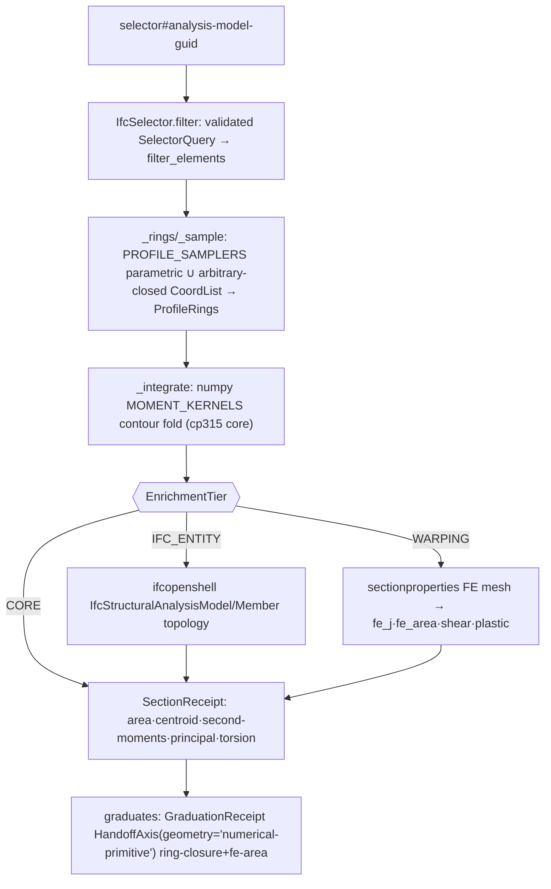

# [PY_GEOMETRY_IFC_STRUCTURAL]

The cross-section structural-property owner — the section-integral and structural-member verbs the analysis and lifecycle hops drop. `IfcStructural` resolves a closed-form section-property receipt from a profile polygon's ring coordinates by one numpy Green's-theorem contour fold over a `MOMENT_KERNELS` polynomial-weight table (area, first and second area moments, centroid, principal second moments and principal-axis rotation, polar moment, the centroid-relative elastic section moduli, and the thin-walled Bredt torsion constant) and tiers that cp315-clean spine with two gated enrichment layers selected by one `EnrichmentTier` policy vocabulary: the `ifcopenshell` structural-analysis-model layer that reads `IfcStructuralAnalysisModel`/`IfcStructuralMember` topology and assigns the section receipt onto the member, and the `sectionproperties` warping/plastic/shear layer that meshes the same rings into a triangular FE section and computes the warping, plastic, and shear receipts no closed-form integral derives. The spine rides the intended cp315 core (`numpy`) and never depends on either gated layer; the IFC-entity layer rides the `ifcopenshell` companion lane and the warping layer rides the `python_version<'3.15'` gated band (`sectionproperties`, native mesh backend `cytriangle` LGPLv3), so a `CORE`-tier run computes the full section-integral receipt on the bare cp315 interpreter and the two upper tiers add evidence only where their interpreter resolves. The selecting verb never threads a raw query into `filter_elements`: the `spec` is admitted once through `IfcSelector.parse`/`IfcSelector.filter` from `geometry:ifc/selector.md#SELECTOR`, so a malformed profile selector is a typed `Error(BoundaryFault)` on the rail at admission rather than a silent empty match deep in the tier arm, and the validated `SelectorQuery.filter_string` re-serializes to the exact grammar `ifcopenshell` consumes. The receipt graduates through the compute `HandoffAxis` geometry case as the `numerical-primitive` subject, the literal `python:compute/graduation/handoff.md#HANDOFF` owns and the same case the sibling `geometry:ifc/analysis.md#ANALYSIS` evidence crosses on — carried by the module `STRUCTURAL_SUBJECT` constant, never a per-receipt `subject: str` field racing the discriminant; the C# `IfcSemanticModel` projects the spatial hierarchy in-process and this owner adds the numerical section dimension the managed projection does not produce.

## [01]-[INDEX]

- [01]-[STRUCTURAL]: the section-integral spine and the two gated enrichment tiers under one `EnrichmentTier`-discriminated owner, emitting the `numerical-primitive` graduation subject.

## [02]-[STRUCTURAL]

- Owner: `IfcStructural` — the `@staticmethod` boundary capsule mirroring `IfcAnalysis` and `IfcLifecycle`, dispatching the enrichment tiers over the section-integral spine and the two gated layers as a rail-returning fold; `EnrichmentTier` the closed `IntEnum` ordering the tier ladder (`CORE=0` ⊂ `IFC_ENTITY=1` ⊂ `WARPING=2`) so the ordinal encodes the superset relation and a single policy value selects how far up the evidence ladder a run climbs rather than three sibling entry functions; `SectionReceipt` the typed `ReceiptContributor` carrying the spine integrals plus the per-tier enrichment fields as `None`-absent slots, owning its own `contribute` (an emitted-phase `Receipt.of` row) and `graduates` (the one `GraduationReceipt.graduates` admission) methods like the sibling `AnalysisResult`; `ProfileRings` the value object holding the outer ring and the interior void rings as `float64` `(n, 2)` coordinate arrays the spine integrates and the warping layer meshes; `MOMENT_KERNELS` the moment-weight policy table the one contour fold reads, collapsing the six near-identical shoelace integrals into one data-driven projection; `PROFILE_SAMPLERS` the parametric-subtype sampling table mapping each parameterized `IfcProfileDef` (rectangle, hollow rectangle, circle, hollow circle, I-shape) to the ring-tuple closure so a parametric profile is the same ring input as the arbitrary-closed-profile coordinate read, never a per-shape integral family.
- Spine: `_integrate` is the cp315-clean kernel — it folds Green's-theorem contour integrals over each closed ring with numpy `roll` shoelace cross-products, signs the void rings opposite the outer ring, and reads each moment off the `MOMENT_KERNELS` table rather than six hand-unrolled accumulator lines: every row carries its polynomial vertex-weight closure and its divisor, so area, first moments `Qx`/`Qy`, and origin second moments `Ixx`/`Iyy`/`Ixy` are one `sum(weight(x,y,xn,yn) * cross) / divisor` projection over the table, vectorized per ring as numpy ufuncs. It derives the centroid `(cx, cy)`, the centroidal second moments via the parallel-axis shift, the polar moment `Ip = Ixx_c + Iyy_c`, and the principal second moments and principal-axis rotation `phi` from the closed-form eigen-solution of the 2×2 centroidal inertia tensor through numpy `linalg.eigh`/`argmax`/`arctan2` — `eigh` returns ascending eigenvalues with column-aligned eigenvectors, so the fold indexes the major axis off `argmax(principal)` and reads `phi` from that same column, pairing `principal_moments[0]` and `principal_angle` to one axis rather than racing the eigh ordering; the thin-walled Bredt torsion constant derives from the enclosed area and the ring perimeter over `vstack`/`diff`/`linalg.norm`. No spine field touches `ifcopenshell` or `sectionproperties`; the spine is a pure numpy fold over the ring arrays, and a new section integral is one `MOMENT_KERNELS` row plus one `SectionReceipt` field — never a per-integral function.
- Cases: `EnrichmentTier` rows `CORE` (the numpy section-integral spine only — area, centroid, second moments, principal axes, polar moment, thin-walled torsion, on the bare cp315 interpreter) · `IFC_ENTITY` (the spine plus the `ifcopenshell` structural-analysis-model layer reading `IfcStructuralAnalysisModel`/`IfcStructuralMember`/`IfcStructuralPointConnection` member topology and the member's assigned `IfcProfileDef`, companion lane) · `WARPING` (the spine plus the `sectionproperties` triangular-FE warping/plastic/shear layer over the same rings, gated `<'3.15'`, `cytriangle` LGPLv3) — matched by `match`/`assert_never`, each arm yielding `RuntimeRail[SectionReceipt]` so the selector parse fault and the provider exception compose on one rail, each higher tier a superset that runs the spine then folds its layer's fields onto the receipt. A new enrichment layer is one `EnrichmentTier` row plus one fold arm and breaks every dispatch site at type-check time under `ty`/`py_analyzer`.
- Selector gate: every tier's profile-bearing query is admitted through `IfcSelector.filter(model, selector)` — `IfcSelector.parse(selector).map(filter_elements)` — never threaded raw into `util.selector.filter_elements`, so a malformed profile selector is an `UnexpectedInput`-derived `Error(BoundaryFault)` lifted onto the rail at admission and the validated `SelectorQuery.filter_string` re-serializes to the `ifcopenshell` grammar. The selector is the one selection engine the dispatch composes; `IFC_ENTITY` resolves its `IfcStructuralAnalysisModel` by the `#`-suffixed guid off the same `spec`, the selector half feeding the member's profile rings and the guid half the structural-model topology.
- Entry: `IfcStructural.run` takes an `ifcopenshell.file`, an `EnrichmentTier`, and a `spec` whose meaning is fixed by the tier — a `<selector>` profile-bearing element query for `CORE`/`WARPING` resolving the `IfcProfileDef` rings off each selected element's material-profile assignment, a `<selector>#<analysis-model-guid>` query for `IFC_ENTITY` joining the selected members to their structural-analysis model — and returns a `RuntimeRail[SectionReceipt]` through `boundary(f"structural.{tier}", ...).bind(lambda rail: rail)`, the rail-returning fold the sibling `IfcAnalysis.run` runs, so a provider exception (a missing profile, a degenerate ring, a non-resolving structural model) converts to a `BoundaryFault` exactly once at the seam while a selector parse fault arrives already typed on the rail. The `subjects` field derives from the tier's true subject set: profile-bearing element GlobalIds for `CORE`/`WARPING`, structural-member GlobalIds for `IFC_ENTITY` — so the subject field never carries a meaningless run.
- Auto: every tier runs `IfcSelector.filter` first (an empty match is a typed `BoundaryFault` at the seam, never a silent `elements[0]` index fault), folds the first selected element's `IfcProfileDef` through `_rings` — `get_psets`-independent ring extraction whose `_sample` projection dispatches the parametric subtypes through the `PROFILE_SAMPLERS` table (`IfcRectangleProfileDef`/`IfcRectangleHollowProfileDef`/`IfcCircleProfileDef`/`IfcCircleHollowProfileDef`/`IfcIShapeProfileDef` each folding their parametric attribute set into the closed `(outer, voids)` ring tuple) and falls through to the `IfcArbitraryClosedProfileDef.OuterCurve`/`InnerCurves` `CoordList` direct coordinate read, so both the parametric and arbitrary-closed paths hand the shape-agnostic contour integral the same ring tuple — then `_integrate` folds the spine receipt off `MOMENT_KERNELS`. `CORE` returns that receipt unchanged. `IFC_ENTITY` additionally resolves the `IfcStructuralAnalysisModel` by guid and folds its `IfcRelAssignsToGroup`-guarded `IsGroupedBy` `IfcStructuralMember` set onto the receipt's `members`/`subjects` so the structural model carries the computed section dimension — it adds only the entity topology, never re-deriving a section property, because the centroid-relative elastic section moduli (`I / c` over `_extreme_fibers`, the larger centroid-to-extreme-fibre reach per axis, never half the bounding-box span that is exact only for a doubly-symmetric profile) are a closed-form spine field every tier already carries. `WARPING` weaves three `sectionproperties` capabilities into one rail: it builds the `pre.Geometry.from_points` region from the same `ProfileRings` by emitting one closed facet loop per ring (the outer ring plus each void ring) with a per-ring index offset so the void rings are real meshed boundaries the triangulator carves out — not unbounded hole markers in a solid mesh — and passes each void's guaranteed-interior `_interior_point` through the `holes` argument, runs `create_mesh(mesh_sizes)`, binds a `Section`, runs `calculate_geometric_properties` then `calculate_warping_properties` then `calculate_plastic_properties` in the one prerequisite order, folds the FE torsion constant `j`, the shear-center coordinates, the shear areas, and the plastic moduli off the `Section.get_*` accessors onto the warping slots, AND reads the FE-derived geometric area back through `get_area` to cross-check the numpy spine area — the relative discrepancy is the `fe-area` convergence residual the graduation ledger keys against its ceiling. The closed-form spine fields stay numpy: the FE torsion lands on the distinct `fe_torsion_constant` slot, never overwriting the spine's thin-walled `torsion_constant`, so the receipt carries both the closed-form and FE torsion evidence. No tier carries an `if/else` value ladder and no tier mints a sibling per-tier class — one fold arm per row, the layer that owns the tier bound directly.
- Receipt: `SectionReceipt` is the `ReceiptContributor` — `contribute` emits one `Receipt.of("emitted", "rasm.geometry.ifc.structural", subject, facts)` row carrying the tier tag and the tier-specific facts (the section integrals for every tier, the structural-member count for `IFC_ENTITY`, the FE mesh element count and the torsion/shear/plastic scalars for `WARPING`), and `graduates` folds the tier-aware residual ledger through the one `GraduationReceipt.graduates(source_package, HandoffAxis(geometry=subject), evidence_key, measured, ceiling)` admission rather than inlining a ceiling comparison — the `STRUCTURAL_SUBJECT` `numerical-primitive` literal carried by the constant, never a per-receipt field. The measured ledger is data-driven by tier: the spine's `ring-closure` residual (the polar-moment-versus-principal-sum consistency) for every tier, plus the `WARPING` tier's `fe-area` FE-mesh convergence residual when the FE geometric area is present, so a degenerate profile whose ring-closure residual exceeds tolerance or an FE mesh whose area diverges from the closed-form spine is an `Error(BoundaryFault)` rather than a graduated section receipt.
- Packages: `numpy` (the `roll`-shoelace contour fold over `asarray`/`array`/`sum`/`float64` driven by the `MOMENT_KERNELS` weight table, `linalg.eigh`/`argmax` for the major-axis-indexed principal-axis eigen-solution, `linalg.norm` over `vstack`/`diff` for the perimeter, `arctan2` for the principal-angle resolution, `linspace`/`cos`/`sin`/`stack` for the `PROFILE_SAMPLERS` curved-subtype polylines, `argsort` for the `_interior_point` widest-x-extent marker), `geometry:ifc/selector.md#SELECTOR` (`IfcSelector.filter`/`IfcSelector.parse` — the validated selection engine, the only `filter_elements` caller), `ifcopenshell` (`by_guid`/`by_type`, `IfcProfileDef`/`IfcStructuralAnalysisModel`/`IfcStructuralMember` entity attributes over the in-process model only — `CORE` reads only the profile, `IFC_ENTITY` adds the structural-model topology), `sectionproperties` (`pre.Geometry`/`from_points`/`create_mesh`, `analysis.Section`/`calculate_geometric_properties`/`calculate_warping_properties`/`calculate_plastic_properties`/`get_area`/`get_j`/`get_sc`/`get_as`/`get_s`, `WARPING` tier only), runtime (`RuntimeRail`/`boundary`/`ContentKey`/`Receipt` — `SectionReceipt` satisfies the `ReceiptContributor` Protocol structurally), compute (`HandoffAxis`/`GeometrySubject`/`GraduationReceipt` over the graduation wire).
- Growth: a new section integral is one `MOMENT_KERNELS` row plus one `SectionReceipt` field, never a per-integral function; a new parametric profile subtype is one `PROFILE_SAMPLERS` row plus its ring constructor, never a new integral path — the rings stay the universal input and the contour fold stays profile-shape-agnostic; a new structural-entity field is one slot folded in the `IFC_ENTITY` arm; a new warping/plastic measure is one `Section.get_*` accessor folded in the `WARPING` arm; a stricter section-property residual bar is one tighter ceiling row the caller supplies; a new selection axis is one `IfcSelector` grammar alternative, never a local query-parse fold here; zero new surface, no parallel per-tier class, no per-profile-shape integral family.
- Boundary: no re-derivation of the C# `IfcSemanticModel` spatial hierarchy (projected in-process); no durable store; no Rhino/GH mutation; no mesh-file or GLB write (the `WARPING` tier's FE section mesh is an in-memory `sectionproperties` artifact consumed for its scalars, never a `mesh/repair.md` payload write); no raw `spec` string threaded past admission into `filter_elements` (the deleted stringly-typed passthrough — the selecting arms enter through `IfcSelector` and the raw query never reaches `ifcopenshell.util.selector` unvalidated); the `ifcopenshell.file` model is the only foreign object held, and `ifcopenshell`/`sectionproperties` import function-local under `# noqa: PLC0415` at the tier-gated boundary scope per the manifest import policy, never module-top — the spine's numpy import is the only module-top dependency, so a `CORE` run never touches a gated wheel. A hand-rolled warping/plastic/shear-area solver where `sectionproperties` is admitted on the gated interpreter, a closed-form section integral re-routed to `sectionproperties` when numpy owns the spine path, an FE torsion overwriting the closed-form spine torsion rather than landing on its own slot, a second selection engine where `IfcSelector` re-serializes the validated query, a per-profile-shape (I/T/L/box/circle) integral function family where the ring contour integral is shape-agnostic and the parametric subtypes fold through `PROFILE_SAMPLERS` rows, a bespoke `IfcStructuralMember` topology walk where `ifcopenshell` owns the entity model, an inlined residual-vs-ceiling comparison where `GraduationReceipt.graduates` owns the admission, a parallel `subject: str` field racing the `HandoffAxis(geometry=...)` discriminant, a boolean-chain `and`/`or` profile resolution that can return `False` where a total `is_a()` match owns the dispatch, an FE region that passes void hole-markers without their bounding facet loops so the mesh never carves the void, a principal-moment/principal-angle pair that races the `eigh` ascending order, and a section modulus taken as `I` over half the bounding-box span where the centroid-relative extreme fibre `_extreme_fibers` is exact are the deleted forms — the numpy contour integral, the `ifcopenshell` entity model, and the `sectionproperties` FE solver compose end-to-end at their respective tiers.

```python signature
from collections.abc import Callable
from enum import IntEnum
from typing import assert_never

import ifcopenshell
import numpy as np
from numpy.typing import NDArray
from msgspec import Struct
from msgspec.structs import replace

from rasm.compute.graduation.handoff import GeometrySubject, GraduationReceipt, HandoffAxis
from rasm.geometry.ifc.selector import IfcSelector
from rasm.runtime.content_identity import ContentKey
from rasm.runtime.faults import RuntimeRail, boundary
from rasm.runtime.receipts import Receipt

# --- [TYPES] ---------------------------------------------------------------------------


class EnrichmentTier(IntEnum):
    CORE = 0
    IFC_ENTITY = 1
    WARPING = 2


# --- [CONSTANTS] -----------------------------------------------------------------------

# The section-integral evidence crosses the geometry graduation case as a numerical
# primitive, the same GeometrySubject literal the sibling ifc/analysis owner crosses on.
STRUCTURAL_SUBJECT: GeometrySubject = "numerical-primitive"

# Green's-theorem contour-moment table: each row maps a closed ring to one origin moment
# as `sum(weight(x, y, xn, yn) * cross) / divisor`, the six section integrals folded as
# one data-driven projection rather than six hand-unrolled accumulator lines.
type _Moment = Callable[[NDArray[np.float64], NDArray[np.float64], NDArray[np.float64], NDArray[np.float64]], NDArray[np.float64]]
MOMENT_KERNELS: tuple[tuple[str, _Moment, float], ...] = (
    ("a", lambda x, y, xn, yn: np.ones_like(x), 2.0),
    ("qx", lambda x, y, xn, yn: y + yn, 6.0),
    ("qy", lambda x, y, xn, yn: x + xn, 6.0),
    ("ixx", lambda x, y, xn, yn: y * y + y * yn + yn * yn, 12.0),
    ("iyy", lambda x, y, xn, yn: x * x + x * xn + xn * xn, 12.0),
    ("ixy", lambda x, y, xn, yn: x * yn + 2.0 * x * y + 2.0 * xn * yn + xn * y, 24.0),
)

# Parametric-profile sampling table: each row maps an IfcProfileDef parametric subtype to
# the closure folding its attribute set into the (outer, voids) ring tuple the universal
# contour integral consumes, so a parametric I/T/L/box/circle is the same ring input as the
# arbitrary-closed-profile path rather than a per-shape integral family. The arbitrary-
# closed-profile direct coordinate read is the table's default fall-through, not a row.
type _Sampler = Callable[["ifcopenshell.entity_instance"], tuple[NDArray[np.float64], tuple[NDArray[np.float64], ...]]]
PROFILE_SAMPLERS: tuple[tuple[str, _Sampler], ...] = (
    ("IfcRectangleHollowProfileDef", lambda p: _box_rings(p.XDim, p.YDim, getattr(p, "WallThickness", None))),
    ("IfcRectangleProfileDef", lambda p: (_rect(p.XDim, p.YDim), ())),
    ("IfcCircleHollowProfileDef", lambda p: (_circle(p.Radius), (_circle(p.Radius - p.WallThickness),))),
    ("IfcCircleProfileDef", lambda p: (_circle(p.Radius), ())),
    ("IfcIShapeProfileDef", lambda p: (_i_section(p.OverallWidth, p.OverallDepth, p.WebThickness, p.FlangeThickness), ())),
)

# --- [MODELS] --------------------------------------------------------------------------


class ProfileRings(Struct, frozen=True):
    outer: NDArray[np.float64]
    voids: tuple[NDArray[np.float64], ...]

    @property
    def signed(self) -> tuple[tuple[NDArray[np.float64], float], ...]:
        return ((self.outer, 1.0), *((v, -1.0) for v in self.voids))

    @property
    def rings(self) -> tuple[NDArray[np.float64], ...]:
        return (self.outer, *self.voids)


class SectionReceipt(Struct, frozen=True):
    tier: EnrichmentTier
    subjects: tuple[str, ...]
    area: float
    centroid: tuple[float, float]
    second_moments: tuple[float, float, float]
    principal_moments: tuple[float, float]
    principal_angle: float
    polar_moment: float
    torsion_constant: float
    section_moduli: tuple[float, float]
    members: tuple[str, ...] = ()
    fe_torsion_constant: float | None = None
    fe_area: float | None = None
    shear_center: tuple[float, float] | None = None
    shear_areas: tuple[float, float] | None = None
    plastic_moduli: tuple[float, float] | None = None
    mesh_elements: int | None = None

    @property
    def measured(self) -> dict[str, float]:
        ring_closure = abs(self.polar_moment - sum(self.principal_moments)) / max(abs(self.polar_moment), 1.0)
        ledger = {"ring-closure": ring_closure}
        if self.fe_area is not None:
            ledger["fe-area"] = abs(self.fe_area - self.area) / max(self.area, 1.0)
        return ledger

    def contribute(self) -> Receipt:
        facts = {
            "tier": self.tier.name,
            "area": repr(self.area),
            "polar_moment": repr(self.polar_moment),
            "principal_angle": repr(self.principal_angle),
            "members": str(len(self.members)),
            "mesh_elements": repr(self.mesh_elements),
            "fe_torsion_constant": repr(self.fe_torsion_constant),
        }
        return Receipt.of("emitted", "rasm.geometry.ifc.structural", STRUCTURAL_SUBJECT, facts)

    def graduates(self, evidence_key: ContentKey, ceiling: dict[str, float]) -> "RuntimeRail[GraduationReceipt]":
        return GraduationReceipt.graduates(
            "rasm.geometry.ifc.structural",
            HandoffAxis(geometry=STRUCTURAL_SUBJECT),
            evidence_key,
            self.measured,
            ceiling,
        )


# --- [OPERATIONS] ----------------------------------------------------------------------

# Parametric-profile ring constructors the PROFILE_SAMPLERS closures fold over. Each returns
# closed-ring float64 coordinates in profile-local axes (centred on the profile origin per the
# IfcParameterizedProfileDef convention) so the universal contour integral reads them with no
# shape-specific branch; CIRCLE_SEGMENTS fixes the polyline fidelity of the curved subtypes.
CIRCLE_SEGMENTS: int = 64


def _rect(xdim: float, ydim: float) -> NDArray[np.float64]:
    hx, hy = xdim / 2.0, ydim / 2.0
    return np.array([(-hx, -hy), (hx, -hy), (hx, hy), (-hx, hy)], dtype=np.float64)


def _circle(radius: float) -> NDArray[np.float64]:
    theta = np.linspace(0.0, 2.0 * np.pi, CIRCLE_SEGMENTS, endpoint=False)
    return np.stack([radius * np.cos(theta), radius * np.sin(theta)], axis=1).astype(np.float64)


def _box_rings(
    xdim: float, ydim: float, wall: float | None
) -> tuple[NDArray[np.float64], tuple[NDArray[np.float64], ...]]:
    outer = _rect(xdim, ydim)
    if wall is None:
        return outer, ()
    return outer, (_rect(xdim - 2.0 * wall, ydim - 2.0 * wall),)


def _i_section(width: float, depth: float, web: float, flange: float) -> NDArray[np.float64]:
    hw, hd, hwe = width / 2.0, depth / 2.0, web / 2.0
    yf = hd - flange
    return np.array(
        [
            (-hw, -hd), (hw, -hd), (hw, -yf), (hwe, -yf), (hwe, yf),
            (hw, yf), (hw, hd), (-hw, hd), (-hw, yf), (-hwe, yf),
            (-hwe, -yf), (-hw, -yf),
        ],
        dtype=np.float64,
    )


class IfcStructural:
    @staticmethod
    def run(model: "ifcopenshell.file", tier: EnrichmentTier, spec: str) -> "RuntimeRail[SectionReceipt]":
        return boundary(f"structural.{tier.name.lower()}", lambda: IfcStructural._dispatch(model, tier, spec)).bind(lambda rail: rail)

    @staticmethod
    def _dispatch(model: "ifcopenshell.file", tier: EnrichmentTier, spec: str) -> "RuntimeRail[SectionReceipt]":
        selector, _, model_guid = spec.partition("#")
        return IfcSelector.filter(model, selector).map(
            lambda elements: IfcStructural._enrich(model, tier, model_guid, elements)
        )

    @staticmethod
    def _enrich(
        model: "ifcopenshell.file",
        tier: EnrichmentTier,
        model_guid: str,
        elements: tuple["ifcopenshell.entity_instance", ...],
    ) -> SectionReceipt:
        if not elements:
            raise LookupError("structural selector matched no profile-bearing element")
        rings = IfcStructural._rings(elements[0])
        base = IfcStructural._integrate(rings, tuple(e.GlobalId for e in elements))
        match tier:
            case EnrichmentTier.CORE:
                return base
            case EnrichmentTier.IFC_ENTITY:
                analysis_model = model.by_guid(model_guid)
                members = tuple(
                    member.GlobalId
                    for rel in (analysis_model.IsGroupedBy or ())
                    if rel.is_a("IfcRelAssignsToGroup")
                    for member in rel.RelatedObjects
                    if member.is_a("IfcStructuralMember")
                )
                return replace(base, tier=tier, subjects=members, members=members)
            case EnrichmentTier.WARPING:
                import sectionproperties.analysis as spa  # noqa: PLC0415
                import sectionproperties.pre as spp  # noqa: PLC0415

                # Every ring (outer + each void) contributes its own closed facet loop with a
                # per-ring index offset, so the void rings are real mesh boundaries the
                # triangulator carves out — not unbounded hole markers floating in a solid mesh.
                points: list[tuple[float, float]] = []
                facets: list[tuple[int, int]] = []
                for ring in rings.rings:
                    start = len(points)
                    coords = [tuple(p) for p in ring.tolist()]
                    points.extend(coords)
                    facets.extend((start + i, start + (i + 1) % len(coords)) for i in range(len(coords)))
                holes = [IfcStructural._interior_point(v) for v in rings.voids]
                geom = spp.Geometry.from_points(points, facets, [IfcStructural._interior_point(rings.outer)], holes or None)
                section = spa.Section(geom.create_mesh([base.area / 100.0]))
                section.calculate_geometric_properties()
                section.calculate_warping_properties()
                section.calculate_plastic_properties()
                return replace(
                    base,
                    tier=tier,
                    fe_torsion_constant=float(section.get_j()),
                    fe_area=float(section.get_area()),
                    shear_center=tuple(section.get_sc()),
                    shear_areas=tuple(section.get_as()),
                    plastic_moduli=tuple(section.get_s()),
                    mesh_elements=int(section.num_elements),
                )
            case unreachable:
                assert_never(unreachable)

    @staticmethod
    def _rings(element: "ifcopenshell.entity_instance") -> ProfileRings:
        profile = IfcStructural._profile(element)
        outer, voids = IfcStructural._sample(profile)
        return ProfileRings(outer=outer, voids=voids)

    @staticmethod
    def _sample(
        profile: "ifcopenshell.entity_instance",
    ) -> tuple[NDArray[np.float64], tuple[NDArray[np.float64], ...]]:
        # The parametric subtypes sample through the PROFILE_SAMPLERS table; the arbitrary-
        # closed-profile path is the table's fall-through, reading the IfcIndexedPolyCurve
        # CoordList directly. One ring tuple feeds the shape-agnostic contour integral either
        # way, so a new parametric subtype is one PROFILE_SAMPLERS row, never a new integral.
        for ifc_class, sampler in PROFILE_SAMPLERS:
            if profile.is_a(ifc_class):
                return sampler(profile)
        outer = np.asarray(profile.OuterCurve.Points.CoordList, dtype=np.float64)
        voids = tuple(np.asarray(c.Points.CoordList, dtype=np.float64) for c in (profile.InnerCurves or ()))
        return outer, voids

    @staticmethod
    def _profile(element: "ifcopenshell.entity_instance") -> "ifcopenshell.entity_instance":
        if element.is_a("IfcProfileDef"):
            return element
        for definition in element.HasAssociations or ():
            if not definition.is_a("IfcRelAssociatesMaterial"):
                continue
            material = definition.RelatingMaterial
            match material.is_a():
                case "IfcMaterialProfileSet":
                    return material.MaterialProfiles[0].Profile
                case "IfcMaterialProfileSetUsage":
                    return material.ForProfileSet.MaterialProfiles[0].Profile
                case _:
                    continue
        raise LookupError(f"no IfcProfileDef resolvable from {element.is_a()} #{element.id()}")

    @staticmethod
    def _integrate(rings: ProfileRings, subjects: tuple[str, ...]) -> SectionReceipt:
        moments = {name: 0.0 for name, _, _ in MOMENT_KERNELS}
        for ring, sign in rings.signed:
            x, y = ring[:, 0], ring[:, 1]
            xn, yn = np.roll(x, -1), np.roll(y, -1)
            cross = x * yn - xn * y
            for name, weight, divisor in MOMENT_KERNELS:
                moments[name] += sign * float(np.sum(weight(x, y, xn, yn) * cross)) / divisor
        a, qx, qy, ixx, iyy, ixy = (moments[k] for k in ("a", "qx", "qy", "ixx", "iyy", "ixy"))
        cx, cy = qy / a, qx / a
        ixx_c, iyy_c, ixy_c = ixx - a * cy * cy, iyy - a * cx * cx, ixy - a * cx * cy
        # eigh returns ascending eigenvalues with column-aligned eigenvectors; index the
        # major axis (largest principal second moment) so principal_moments[0] and
        # principal_angle name the SAME axis rather than racing the eigh ordering.
        tensor = np.array([[ixx_c, -ixy_c], [-ixy_c, iyy_c]], dtype=np.float64)
        principal, vectors = np.linalg.eigh(tensor)
        major = int(np.argmax(principal))
        phi = float(np.arctan2(vectors[1, major], vectors[0, major]))
        perimeter = sum(
            float(np.sum(np.linalg.norm(np.diff(np.vstack([r, r[:1]]), axis=0), axis=1))) for r, _ in rings.signed
        )
        cx_fibre, cy_fibre = IfcStructural._extreme_fibers(rings, (cx, cy))
        return SectionReceipt(
            tier=EnrichmentTier.CORE,
            subjects=subjects,
            area=abs(a),
            centroid=(cx, cy),
            second_moments=(ixx_c, iyy_c, ixy_c),
            principal_moments=(float(principal[major]), float(principal[1 - major])),
            principal_angle=phi,
            polar_moment=ixx_c + iyy_c,
            torsion_constant=4.0 * abs(a) * abs(a) / perimeter,
            section_moduli=(ixx_c / max(cy_fibre, 1.0), iyy_c / max(cx_fibre, 1.0)),
        )

    @staticmethod
    def _extreme_fibers(rings: ProfileRings, centroid: tuple[float, float]) -> tuple[float, float]:
        # Section modulus is I / c where c is the centroid-to-extreme-fibre distance, NOT half
        # the bounding-box span (correct only for a doubly-symmetric profile); take the larger
        # of the two centroid-relative reaches per axis so an asymmetric section is exact.
        cx, cy = centroid
        lo, hi = rings.outer.min(axis=0), rings.outer.max(axis=0)
        cx_fibre = max(abs(float(hi[0]) - cx), abs(cx - float(lo[0])))
        cy_fibre = max(abs(float(hi[1]) - cy), abs(cy - float(lo[1])))
        return cx_fibre, cy_fibre

    @staticmethod
    def _interior_point(ring: NDArray[np.float64]) -> tuple[float, float]:
        # A guaranteed-interior marker for the FE region/hole list: the mean of the two
        # vertices spanning the ring's widest x-extent lands inside even a non-convex ring,
        # where the bare centroid can fall outside and orphan the region.
        order = np.argsort(ring[:, 0])
        midpoint = (ring[order[0]] + ring[order[-1]]) / 2.0
        return float(midpoint[0]), float(midpoint[1])
```



## [03]-[RESEARCH]

- [PROFILE_RING_EXTRACTION]: the validated selection enters through `IfcSelector.filter`/`IfcSelector.parse` from `geometry:ifc/selector.md#SELECTOR` — the one `util.selector.filter_elements` caller (confirmed `ifcopenshell.md#116`), so the profile selector is admitted and re-serialized before the filter runs, never threaded raw; the branch `ifcopenshell` catalogue further confirms `by_guid`/`by_type` and the `util.shape.get_vertices` shape-vertex array (`ifcopenshell.md#120`). The `IfcProfileDef` ring access the `_rings`/`_sample`/`_profile` fold reads splits two ways under one `(outer, voids)` ring tuple: the `IfcArbitraryClosedProfileDef.OuterCurve`/`InnerCurves` `IfcIndexedPolyCurve.Points.CoordList` coordinate-list direct read is the table fall-through, and the `PROFILE_SAMPLERS` parametric rows fold each parameterized subtype's attribute set into rings — `IfcRectangleProfileDef.XDim`/`YDim`, `IfcRectangleHollowProfileDef.WallThickness`, `IfcCircleProfileDef.Radius`, `IfcCircleHollowProfileDef.WallThickness`, and `IfcIShapeProfileDef.OverallWidth`/`OverallDepth`/`WebThickness`/`FlangeThickness`. The `_profile` association resolution reads the `IfcRelAssociatesMaterial.RelatingMaterial` `IfcMaterialProfileSet.MaterialProfiles[i].Profile` / `IfcMaterialProfileSetUsage.ForProfileSet` chain by a total `material.is_a()` match, returning the element itself when it is already an `IfcProfileDef` and raising at the boundary seam when no profile resolves rather than the prior boolean-chain short circuit that could return `False`. The exact parametric attribute spellings per subtype confirm by introspection against the installed companion distribution's `IfcProfileDef` subtypes; the `CIRCLE_SEGMENTS` polyline fidelity for the curved subtypes is the one tessellation policy the caller may sharpen.
- [STRUCTURAL_MODEL_TOPOLOGY]: the `IFC_ENTITY` arm folds the `IfcStructuralMember` set off `IfcStructuralAnalysisModel.IsGroupedBy`, guarding each inverse relationship with `rel.is_a("IfcRelAssignsToGroup")` before reading `RelatedObjects` so a non-grouping inverse (`OrientationOf2DPlane`/`LoadedBy`/`HasResults`) never raises on a missing `RelatedObjects` attribute, and filtering the related objects to `IfcStructuralMember` (the `IfcStructuralCurveMember`/`IfcStructuralSurfaceMember` subtypes). The `IsGroupedBy → IfcRelAssignsToGroup → RelatedObjects` path is the IFC4 schema-standard grouping the live run confirms against the installed `ifcopenshell` distribution's inverse-attribute set.
- [NUMPY_CONTOUR_MEMBERS]: the branch `numpy` catalogue confirms `linalg.eigh` (`numpy.md#134`), `linalg.norm(x, ord, axis)` (`#138`), `argmin`/`argmax` (`#113`), `vstack` (`#104`), `stack` (`#103`), `sum` (`#112`), `abs` (`#124`), `linspace` (`#83`), `sin`/`cos` (`#123`), and `argsort` (`#120`) — the `_integrate` major-axis-indexed eigen-solution, the perimeter norm, the `PROFILE_SAMPLERS` curved-subtype polyline construction, and the `_interior_point` marker bind off these enumerated members. The six section integrals fold through the `MOMENT_KERNELS` weight table as one `sum(weight(x, y, xn, yn) * cross) / divisor` projection per row rather than six hand-unrolled accumulator lines, so the element-wise `roll`-shoelace cross-product fold (`np.roll`, the `x * yn - xn * y` ufunc product, `np.ones_like` for the area weight, `np.array`/`np.asarray` ring construction, `np.diff` for the perimeter segment vectors, `np.arctan2` for the principal-angle, and the `.tolist()` ring projection the `WARPING` arm passes to `from_points`) are core `numpy` ufuncs and array constructors outside the catalogue's enumerated reduction/linalg tables; their exact signatures confirm against the installed `numpy` distribution before the fold transcribes, the catalogue's `[CAPTURE_GAP]` enumeration of the ufunc table being the residual. The `MOMENT_KERNELS` row vocabulary is closed and data-driven: a new section integral is one table row plus one `SectionReceipt` field, never a new accumulator branch.
- [SECTIONPROPERTIES_ACCESSORS]: the branch `sectionproperties` catalogue confirms `pre.Geometry.from_points(points, facets, control_points, holes, material)`, `create_mesh(mesh_sizes)`, `analysis.Section`, `calculate_geometric_properties`/`calculate_warping_properties`/`calculate_plastic_properties`, and the `get_*` accessor family (`sectionproperties.md#03`); the exact accessor spellings the `WARPING` arm folds — `get_area` (FE geometric area, cross-checked against the numpy spine area as the `fe-area` convergence residual), `get_j` (FE torsion constant, landing on the distinct `fe_torsion_constant` slot, never overwriting the closed-form spine torsion), `get_sc` (shear center), `get_as` (shear areas), `get_s` (plastic section moduli) — and the `Section.num_elements` mesh-element count confirm against the `analysis.Section` source per the catalogue's `[CAPTURE_GAP]` note before the fence's accessor calls bind. The `WARPING` arm registers each void ring as its own closed facet loop (one per-ring index offset over `points`/`facets`) AND passes a guaranteed-interior `_interior_point` marker through the `holes` argument, so the triangulator carves the void out as a real boundary rather than meshing a solid region around an unbounded hole marker; the `_interior_point` midpoint of the widest x-extent vertex pair stays inside even a non-convex ring where the bare centroid can fall outside. The exact `from_points(points, facets, control_points, holes)` positional contract is the void-registration detail the live run confirms. The three solver passes weave as one rail — `calculate_geometric_properties` is the prerequisite the catalogue's `[04]` solver axis fixes for the warping and plastic passes — and the FE-area cross-check composes the geometric accessor back against the spine in the same op rather than a flat per-accessor read.

## [04]-[UPSTREAM]

- [TIER_INTERPRETER_FLOOR]: the `CORE` tier rides the intended cp315 core (`numpy`) and computes the full section-integral receipt on the bare cp315 interpreter with no gated import; the `IFC_ENTITY` tier rides the `ifcopenshell` companion lane (py313, no cp315 wheel) and resolves only where `ifcopenshell` resolves; the `WARPING` tier rides the `python_version<'3.15'` gated band — `sectionproperties` ships a pure-Python `py3-none-any` wheel with no interpreter ceiling of its own, but its native mesh backend `cytriangle` (3.0.2, cp311–cp314 wheels, LGPLv3) makes the warping tier a rail-policy gated enrichment row, never the spine. The fence imports `ifcopenshell`/`sectionproperties` function-local under `# noqa: PLC0415` inside the tier arm that owns them, so a `CORE` dispatch never touches a gated wheel and the spine stays cp315-clean.
- [GRADUATION_SUBJECT_OWNER]: the `numerical-primitive` subject is one literal of the `GeometrySubject` union `python:compute/graduation/handoff.md#HANDOFF` owns (alongside `registration-transform`, `reconstructed-mesh`, `topology-graph`, `network-graph`, `form-finding`, `mesh-algebra`, and `scan-deviation`); it is carried by the module `STRUCTURAL_SUBJECT: GeometrySubject` constant — typed as that imported literal union, never a per-receipt `subject: str` field racing the `HandoffAxis(geometry=...)` discriminant the handoff owner deletes — so an unlisted subject fails at the type boundary under `ty`/`py_analyzer`, matching the sibling `geometry:ifc/analysis.md#ANALYSIS` `ANALYSIS_SUBJECT` constant pattern. `SectionReceipt` is itself the `ReceiptContributor`: `contribute` emits the one `Receipt.of("emitted", ...)` row and `graduates` folds the tier-aware residual ledger (the `ring-closure` polar-moment consistency for every tier plus the `WARPING` `fe-area` convergence residual) through the one `GraduationReceipt.graduates(source_package, HandoffAxis(geometry=subject), evidence_key, measured, ceiling)` admission (handoff.md `#15`/`#34`–`#52`) rather than inlining a ceiling comparison, mirroring the sibling `AnalysisResult.graduates` that feeds the single graduation admission.
