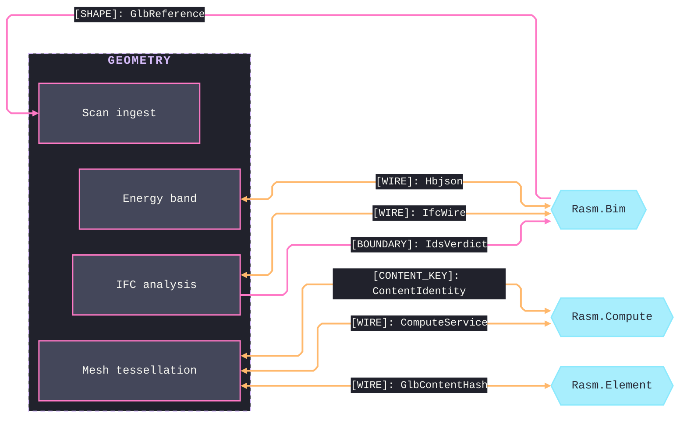
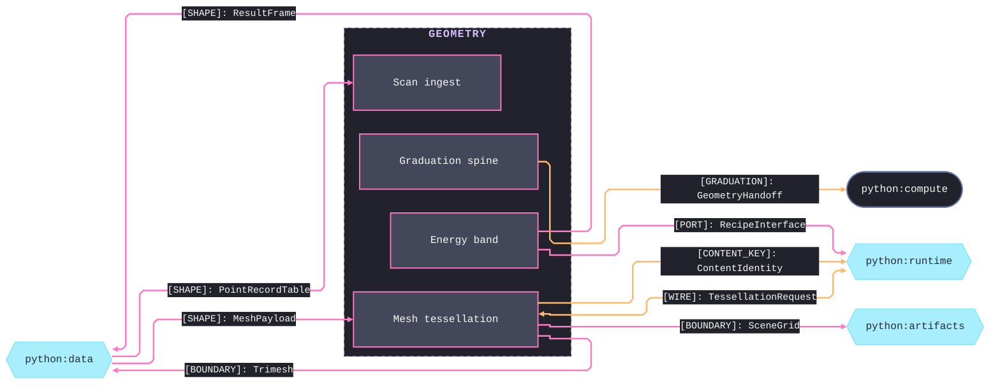
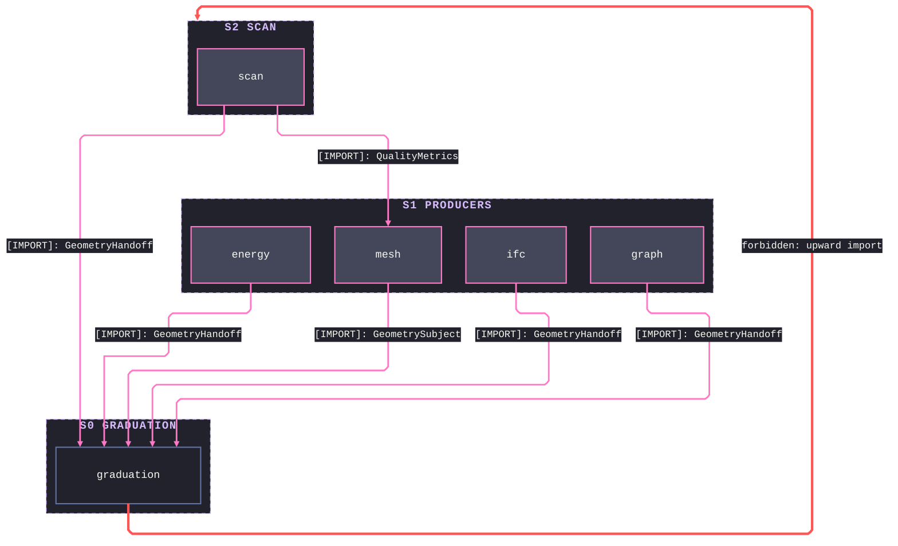

# [PY_GEOMETRY_ARCHITECTURE]

`geometry` maps the host-free geometry and IFC/BIM band of the Python branch as the load-bearing cross-boundary owner: each sub-domain folder maps to one namespace, and the `graduation` spine mints the content-keyed evidence receipt every producer graduates through. It is a peer producer, never a Rasm consumer — alignment travels through the `ComputeService`/`ArtifactSync` contract and the content-keyed GLB tessellation rail, never a shared reference.

## [01]-[DOMAIN_MAP]

```text codemap
geometry/
├── graduation.py         # Tier-0 evidence spine: the subject union and handoff carrier every producer composes
├── scan/                 # Point-cloud and 3D-scan ingestion, registration, deviation, and reconstruction
│   ├── ingestion.py      # Point-cloud ingestion and E57 station-provenance decode over the filter graph
│   ├── registration.py   # Global then multi-scale point-cloud registration
│   ├── deviation.py      # Signed nearest-surface deviation against the content-keyed reference
│   └── reconstruction.py # Registered-cloud-to-watertight-mesh reconstruction, closure-graded
├── ifc/                  # IFC property, quantity, and relationship analysis, validation, and 5D/4D lifecycle
│   ├── analysis.py       # Pset, IDS, clash, space-program, and BCF analysis and BIM-compliance evidence
│   ├── costing.py        # 5D quantity take-off, cost rollup, 4D scheduling, and revision diff
│   ├── selector.py       # Validated selector grammar gating element selection
│   ├── authoring.py      # IFC spatial, element, and geometry authoring transactions over the GUID rail
│   └── structural.py     # Section-integral properties over IfcProfileDef and the warping/plastic/shear FE
├── mesh/                 # GLB tessellation daemon, serve wire, CAD-STEP hop, mesh algebra, and B-rep
│   ├── daemon.py         # Tessellation daemon: source bytes and policy to per-element mesh rails
│   ├── serve.py          # Tessellation servicer registered in the runtime ServerHost
│   ├── cad.py            # STEP and IGES B-rep to GLB over the OCCT XCAF bridge
│   ├── repair.py         # Watertight repair, winding and normal fix, and the public manifold boolean
│   ├── brep.py           # B-rep evaluation: booleans, sew and NURBS conditioning, cross-section offset
│   ├── spatial.py        # Proximity, ray, contains, bounds/nearest, and signed-clearance queries
│   └── quality.py        # Aspect, skewness, manifold, and genus receipts and the public closure fold
├── graph/                # Non-manifold topology, AEC computational geometry, and network analytics
│   ├── analytic.py       # Analytic-value reducer union, ranked board fold, and census projections
│   ├── nonmanifold.py    # CellComplex construction, decomposition, adjacency, and the cached dual graph
│   ├── algebra.py        # Network adjacency, form-finding, numerical primitives, and mesh algebra
│   └── features.py       # Centrality, community, cycle, and connectivity analytics over the network graph
└── energy/               # Out-of-process building-physics band: climate, model, district, and simulation
    ├── climate.py        # EPW admission, series algebra, solar sunpath, and thermal-comfort maps
    ├── model.py          # HBJSON and BIM-to-BEM admission under one gate with standards-resolved assignment
    ├── district.py       # District admission, auto-zoning, and the to-honeybee model explosion
    └── simulate.py       # Offloaded energy translation, recipe binding, and result decode
```

## [02]-[SEAMS]

Seam map splits by counterpart role — the C# cross-runtime peers on one fence, the Python siblings on the other. An in-package relation between two geometry sub-domains is never a seam; it lives in the codemap, and the `graph` sub-domain projects only onto the home `graduation` spine, so it carries no cross-boundary edge.





Each collapsed edge stands for every contract between that sub-domain and that partner at the load-bearing kind: the streaming GLB transport, the IFC projection, and the payload shapes fold into the one labeled rail, and the per-contract wiring lives on the owning implementation pages. `GlbContentHash` spells from its Rasm.Element owner; geometry interior pages spell only the `ContentKey` mint beneath it. Scene facts cross one-way as glb bytes the artifacts `SceneGrid.of_glb` admits, and geometry receives nothing back on that boundary.

## [03]-[INTERNAL]

- S0 `graduation` — mints the evidence spine exactly once (`GeometrySubject`, `GeometryHandoff`, the `ContentKey` fold) and imports no sibling; every producer returns through it.
- S1 `mesh` + `ifc` + `graph` + `energy` — producer tier composing the spine alone; no import crosses among the four, and each folds its receipts onto `GeometryHandoff`.
- S2 `scan` — the one cross-producer consumer: composes graduation plus the mesh quality receipts (`QualityMetrics`) for deviation and reconstruction closure grading.



## [04]-[COMPANION_LANES]

Every sub-domain rides the companion engine the branch manifest selects, with the compiled geometry and IFC cores and the copyleft packages isolated at the process boundary.

Runtime lane carries the pure-Python spine owners; the worker lanes carry the compiled enrichment rows and the IFC core behind function-local gates. Probe selection over `find_spec` is governed, never implicit — each probe selects a capability tier, never an offload route, because a process-pool worker shares the one venv and module presence is identical on every floor. Compiled bands cross worker seams as `KernelTrait.HOSTILE` kernels on the warm process pool — no compiled package imports under an isolated subinterpreter — and a live native handle never meets the pickle seam: shapes cross as sealed STEP octets, clouds as the scan `Cloud` array carrier, models as document bytes. AGPL companion band carries no root-manifest row and provisions through the companion-lane owner; the exact lane assignments live on the owning implementation pages.

AGPL Ladybug Tools band — `ladybug-*`, `honeybee-*` with its standards backends, and `dragonfly-*` — rides the `energy/` owners with function-local boundary imports and process-boundary evidence exchange: HBJSON, dfjson, EPW document bytes, and result frames cross the wire, never a distributed link. Simulation engines — Radiance, OpenStudio, and EnergyPlus behind the runtime recipe rail; URBANopt, Modelica, RNM, and REopt behind the district translation rows — are external process-boundary services.
