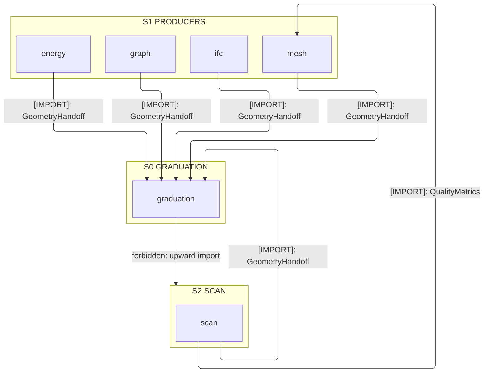
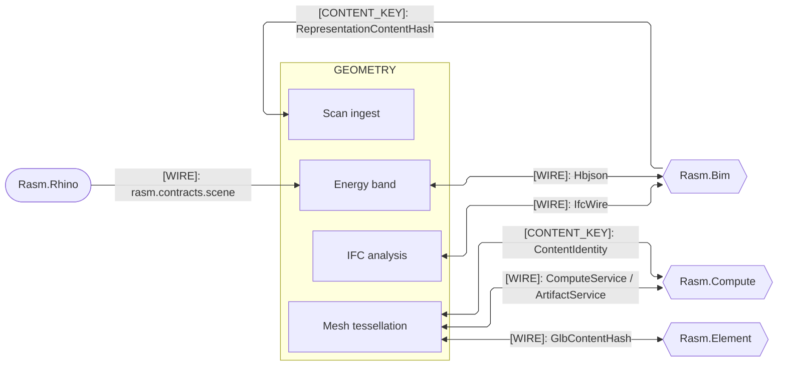
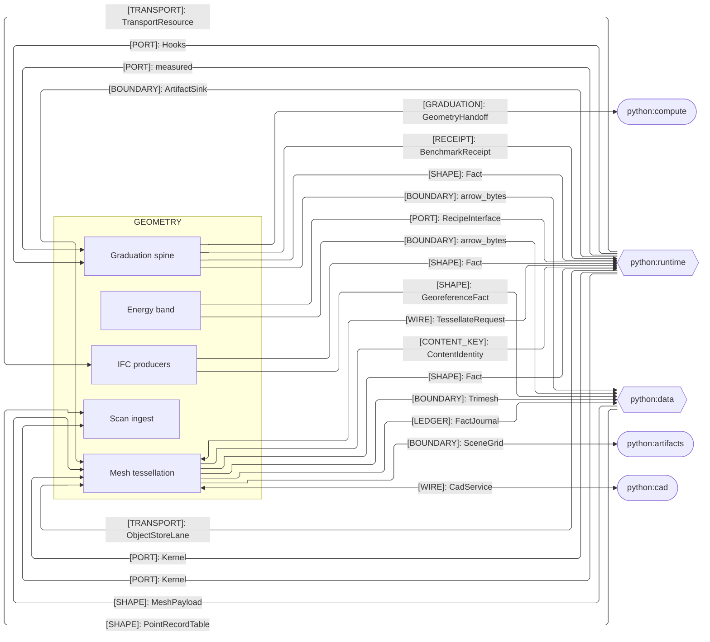
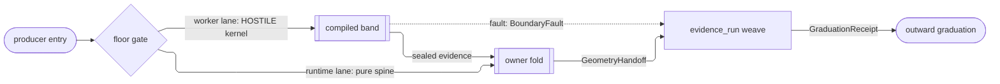

# [PY_GEOMETRY_ARCHITECTURE]

`geometry` maps the host-free geometry and IFC/BIM band of the Python branch as the load-bearing cross-boundary owner: each sub-domain folder maps to one namespace, and the `graduation` spine mints the content-keyed evidence receipt every producer graduates through. Alignment travels through the `ComputeService`/`ArtifactService` contract and the content-keyed GLB tessellation rail, never a shared reference.

## [01]-[DOMAIN_MAP]

```text
geometry/
├── graduation.py         # GeometrySubject union, GeometryLeg raise roster, EvidenceScope table, and the evidence_run weave, minted once
├── scan/                 # Reality-capture plane: captured clouds graded against content-keyed model truth
│   ├── ingestion.py      # Point-cloud ingestion and E57 station-provenance decode over the filter graph
│   ├── registration.py   # RegistrationSession N-cloud arity and the RegistrationMode strategy discriminant
│   ├── deviation.py      # DeviationStage partition and DeformationSplit over the reference GLB read
│   └── reconstruction.py # Reconstruction owner composing the sibling closure fold for its graded verdict
├── ifc/                  # IFC property, quantity, and relationship analysis, validation, and 5D/4D lifecycle
│   ├── analysis.py       # Rule and quantity analysis onto one compliance receipt; IDS parse/resolve/evaluate split
│   ├── costing.py        # LifecycleRow union the fence seats; DiffAxis and the DropLaw fidelity ledger
│   ├── selector.py       # lark EBNF grammar, the frozen SelectorQuery/Facet family, and the band-wide IfcFault floor
│   ├── authoring.py      # AuthorCarry left-fold under @transactional/@stamped, hop-keyed footprint merge; apply_async twin
│   └── structural.py     # MOMENT_KERNELS and the EnrichmentTier policy over IfcProfileDef sections
├── mesh/                 # Tessellation-and-mesh band: exact kernels behind one content-keyed GLB rail
│   ├── daemon.py         # Generated tessellation request; cross-runtime canonical key and per-element mesh rail
│   ├── serve.py          # Tessellation servicer registered at the runtime serve entry
│   ├── cad.py            # Generated CadService tessellation client and streamed GLB admission
│   ├── repair.py         # MeshRepairOp, ManifoldTier, and the to_manifold build the graders compose
│   ├── brep.py           # Generated CadService execution client and geometry evidence projection
│   ├── spatial.py        # SpatialQuery/SpatialResult family and the one _dispatch body
│   └── quality.py        # Conditioning ops and the metric receipt family; exactness carried as evidence
├── graph/                # Non-manifold topology, AEC computational geometry, and network analytics
│   ├── analytic.py       # Analytic-value reducer union, ranked board fold, and census projections
│   ├── nonmanifold.py    # CellComplex construction, decomposition, adjacency, and the cached dual graph
│   ├── algebra.py        # NumericalOp keyed catalogue: fit and bound primitives, rigid-to-projective rows
│   └── features.py       # Detection folds keyed by the stable node index; composes AnalyticValue and ranked
└── energy/               # Out-of-process building-physics band; AGPL isolation at the process boundary
    ├── climate.py        # LateBound AGPL table binding and the ClimateQuery dispatch body
    ├── model.py          # BuildingModel and EnergySpec owners over the .properties.energy spine
    ├── district.py       # District admission, auto-zoning, and the to-honeybee model explosion
    └── simulate.py       # Translation weave, the RecipeInterface port seat, and the rasm.contracts.scene decode arm
```

## [02]-[STRATA]

Strata rank the geometry interior; seating rows carry only the law the fence cannot show. Every producer composes the `graduation` floor, and the fence draws each producer's one discriminating import.


```mermaid
---
config:
  layout: elk
  flowchart:
    curve: linear
    padding: 25
---
flowchart TB
    accTitle: Geometry interior import strata
    accDescr: Import strata from scan down to the graduation foundation, each labeled edge naming one sourced type.
    subgraph S2["S2 SCAN"]
        Scan[scan]
    end
    subgraph S1["S1 PRODUCERS"]
        Mesh[mesh]
        Ifc[ifc]
        Graph[graph]
        Energy[energy]
    end
    subgraph S0["S0 GRADUATION"]
        Graduation[graduation]
    end
    Scan e1@-->|"[IMPORT]: QualityMetrics"| Mesh
    Scan e2@-->|"[IMPORT]: GeometryHandoff"| Graduation
    Mesh e3@-->|"[IMPORT]: GeometryHandoff"| Graduation
    Ifc e4@-->|"[IMPORT]: GeometryHandoff"| Graduation
    Graph e5@-->|"[IMPORT]: GeometryHandoff"| Graduation
    Energy e6@-->|"[IMPORT]: GeometryHandoff"| Graduation
    Graduation f1@-->|"forbidden: upward import"| S2
```

- S0 `graduation` — mints the evidence spine (`GeometrySubject`, `GeometryHandoff`, `ContentKey`) and the `GeometryLeg` roster, reaching no sibling.
- S1→S0 producers import the spine and return receipts through its `evidence_run` weave as values, so the return leg adds no edge.
- S1 `mesh` + `ifc` + `graph` + `energy` — producers over the spine alone; no import crosses them, each interior acyclic at one vocabulary owner.
- S1 each graduating owner folds its evidence onto `GeometryHandoff`; engine and gate owners stream typed receipts without a subject.
- S1 `mesh` interior: `cad` admits provider receipts and `ArtifactRef`, `brep` projects kernel receipts, and `repair` serves both graders.
- S1 `ifc` interior: `selector` seats `IfcFault` for the analysis, costing, structural, and authoring legs, importing no band sibling itself.
- S1 `graph/analytic` seats `AnalyticValue`/`ranked` for the nonmanifold and features producers.
- S1 `energy/district` explodes onto `model`'s one assignment fold, minting no second energy model.
- S2 `scan` — sole cross-producer consumer whose one drawn edge collapses the `QualityMetrics`, artifact-path, and `MeshSpatial` reads it composes.

## [03]-[SEAMS]

`graph` projects only onto the home `graduation` spine, so it carries no cross-boundary edge.


```mermaid
---
config:
  layout: elk
  flowchart:
    curve: linear
    padding: 25
---
flowchart LR
    accTitle: Geometry cross-runtime .NET peer seams
    accDescr: Which kinded contracts cross between the geometry owners and the .NET peers.
    subgraph geometry[GEOMETRY]
        Mesh[Mesh tessellation]
        Ifc[IFC analysis]
        Scan[Scan ingest]
        Energy[Energy band]
    end
    Bim{{Rasm.Bim}}
    Compute{{Rasm.Compute}}
    Element{{Rasm.Element}}
    Rhino([Rasm.Rhino])
    Mesh e1@<-->|"[WIRE]: ComputeService / ArtifactService"| Compute
    Mesh e2@<-->|"[CONTENT_KEY]: ContentIdentity"| Compute
    Mesh e3@<-->|"[WIRE]: GlbContentHash"| Element
    Ifc e4@<-->|"[WIRE]: IfcWire"| Bim
    Bim e6@-->|"[CONTENT_KEY]: RepresentationContentHash"| Scan
    Energy e7@<-->|"[WIRE]: Hbjson"| Bim
    Rhino e8@-->|"[WIRE]: rasm.contracts.scene"| Energy
```


```mermaid
---
config:
  layout: elk
  flowchart:
    curve: linear
    padding: 25
---
flowchart LR
    accTitle: Geometry Python sibling seams
    accDescr: Geometry sub-domain owners exchanging graduation receipts, payloads, ports, and kernel crossings with the Python siblings.
    subgraph geometry[GEOMETRY]
        Graduation[Graduation spine]
        Mesh[Mesh tessellation]
        Ifc[IFC producers]
        Scan[Scan ingest]
        Energy[Energy band]
    end
    Compute([python:compute])
    Runtime{{python:runtime}}
    Data{{python:data}}
    Artifacts([python:artifacts])
    Cad([python:cad])
    Graduation e1@-->|"[GRADUATION]: GeometryHandoff"| Compute
    Graduation e2@-->|"[BOUNDARY]: arrow_bytes"| Data
    Mesh e3@<-->|"[WIRE]: TessellateRequest"| Runtime
    Mesh e4@-->|"[CONTENT_KEY]: ContentIdentity"| Runtime
    Data e5@-->|"[SHAPE]: MeshPayload"| Mesh
    Mesh e6@-->|"[BOUNDARY]: Trimesh"| Data
    Mesh e7@-->|"[BOUNDARY]: SceneGrid"| Artifacts
    Data e8@-->|"[SHAPE]: PointRecordTable"| Scan
    Energy e9@-->|"[PORT]: RecipeInterface"| Runtime
    Energy e10@-->|"[BOUNDARY]: arrow_bytes"| Data
    Graduation e11@-->|"[RECEIPT]: BenchmarkReceipt"| Runtime
    Runtime e12@-->|"[TRANSPORT]: ObjectStoreLane"| Mesh
    Mesh e13@-->|"[LEDGER]: FactJournal"| Data
    Graduation e14@-->|"[SHAPE]: Fact"| Runtime
    Ifc e15@-->|"[SHAPE]: GeoreferenceFact"| Data
    Ifc e16@-->|"[SHAPE]: Fact"| Runtime
    Mesh e17@-->|"[SHAPE]: Fact"| Runtime
    Runtime e18@-->|"[PORT]: Kernel"| Mesh
    Runtime e19@-->|"[PORT]: Kernel"| Scan
    Runtime e20@-->|"[PORT]: measured"| Graduation
    Runtime e21@-->|"[PORT]: Hooks"| Graduation
    Runtime e22@-->|"[TRANSPORT]: TransportResource"| Ifc
    Mesh e23@<-->|"[WIRE]: CadService"| Cad
    Runtime e24@-->|"[BOUNDARY]: ArtifactSink"| Mesh
```

Each collapsed edge stands for every contract between that sub-domain and that partner at the load-bearing kind: generated ArtifactService custody, the IFC projection, and the payload shapes fold into the one labeled rail, with per-contract wiring on the owning implementation pages.

`GlbContentHash` spells from its Rasm.Element owner and `RepresentationContentHash` from its Rasm.Bim owner, while geometry interior pages spell only the semantic `ContentKey` mint beneath both. Scene shading crosses one-way as an `ArtifactRef`, and `energy/simulate` resolves and proves its SHA-256 body onto a helper-owned path for the decode scope.

`rasm.contracts.scene` is the other one-way inbound crossing: `Rasm.Rhino`'s emitter captures the whole descriptor, sun band stacked downward, and `energy/simulate#SIMULATE`'s `scene` arm fetches the descriptor's shading reference and decodes the verified path into shade meshes, a point-in-time sky, and an authority-ranked light roster, grading declared fidelity rather than re-solving the producer's own sun angles.

`GeoreferenceFact` crosses one-way from the IFC band to the data geospatial plane, whose `reproject(frame, source=)` helmert prelude composes it. That band decodes off the single `util.geolocation` transform seam collapsing every coordinate-operation subtype, the write side riding the `AuthorVerb` vocabulary as ordinary rows. Ungeoreferenced models cross as typed absence, an identity transform reading as map coordinates the moment the prelude composes it. This producer declares the georeference roster and the data decoder mirrors it arm-for-arm.

Both `arrow_bytes` edges name the data-owned crossing: `EvidenceFrame` and the energy `ResultFrame` are the geometry-side columnar carriers, each crossing as its declared column roster beside its sealed arrays, admitted by the data `tabular/columnar` `arrow_columns` entry and serialized through the `tabular/interop` `arrow_bytes` fold it feeds, so the data tier holds one admitting entry and one canonical byte fold and no geometry frame type crosses as a foreign shape.

`ObjectStoreLane` and `FactJournal` are the two COMPOSITION-ROOT edges: the mesh servicer takes a built store lane as the daemon's durable artifact tier and binds the `Ledger`/`Custody` pair the runtime daemon entry journals through, so both arrive as values a root supplies. Declaring a fact's own `Retain` class belongs to the producing fold instead: the class rides the fact under the journal's policy law, while the window pricing that class and the groom executing it stay the runtime owner's.

`[LEDGER]` and `[SHAPE]: Fact` run one evidence spine in opposite directions: the servicer binds the data-tier `Ledger` implementer into the runtime port at composition, and every producing leg records back through that port's writer. Producing legs are awaitable by law, so a synchronous entrypoint reaches the plane through its own twin. `Resource.COMPUTE` charges once per crossing at the graduation weave's async close, and the IFC and mesh edges carry the mutation, storage, and request evidence their own folds own.

`BenchmarkReceipt` carries the whole bench observability contract on one rail: the `Bench.run` measurement leg, the `Signals`-harvested receipt row, and the `bench_terminal` `JobRun.bounded` process-terminal envelope. `Kernel` carries the HOSTILE process-offload contract every compiled mesh and scan kernel crosses through `LanePolicy.offload`; the lane conduit's pickled pulse tap rides it, so `GeometryPulse` beats reach the runtime `Hooks` registry through the parent-side drain.

## [04]-[INTERNAL]

Producers meet only at the graduation spine; engine lanes are the second interior axis: every sub-domain rides the native engine the branch manifest selects, with the compiled cores and the copyleft packages isolated at the process boundary.


```mermaid
---
config:
  layout: elk
  flowchart:
    curve: linear
    padding: 25
---
flowchart LR
    accTitle: Geometry producer interior spine
    accDescr: Which lane carries a producer body and how its evidence reaches the weave before the receipt crosses outward.
    Intake([producer entry]) e1@--> Floor{floor gate}
    Floor e2@-->|"runtime lane: pure spine"| Fold[[owner fold]]
    Floor e3@-->|"worker lane: HOSTILE kernel"| Kernel[[compiled band]]
    Kernel e4@-->|"sealed evidence"| Fold
    Fold e5@-->|"GeometryHandoff"| Weave[evidence_run weave]
    Weave e6@-->|"GraduationReceipt"| Out([outward graduation])
    Kernel f1@-.->|"fault: BoundaryFault"| Weave
```

- Runtime lane carries the pure-Python spine; worker lanes carry compiled enrichment rows and long native IFC phases, never the IFC core whole.
- Compiled bands cross worker seams as `KernelTrait.HOSTILE` kernels on the warm pool, and a live native handle never meets the pickle seam.
- Sealed evidence crosses instead: shapes as STEP octets, clouds as the scan `Cloud` carrier, models as document bytes.
- Each compiled band binds one module-scope `lazy` import behind its floor gate; eager natives and unearned function-local binds are deleted forms.
- Native kernels enter with `LaneGrant.width`, thread-count APIs binding it exactly; Boolean-only OCCT parallelism runs under whole-lane custody.

AGPL Ladybug Tools bands (`ladybug-*`, `honeybee-*` with its standards backends, `dragonfly-*`) ride the `energy/` owners with function-local boundary imports, and evidence exchanges at the process boundary: HBJSON, dfjson, EPW document bytes, and result frames cross the wire, never a distributed link. Simulation engines stay external process-boundary services: Radiance, OpenStudio, and EnergyPlus behind the runtime recipe rail; URBANopt, Modelica, RNM, and REopt behind the district translation rows.

## [05]-[BOUNDARIES]

- `geometry` owns host-free geometry and IFC/BIM evidence production — a peer producer, never a Rasm consumer.
- `CORPUS` rosters graded seams and hands them to `Bench.graded` — no window or verdict mints here.
- Store handles, credentials, key custody, and retention windows arrive root-bound; no geometry page mints one.
- Unstructured mesh generation stays compute's — this folder consumes generated meshes and mints no meshing kernel.
