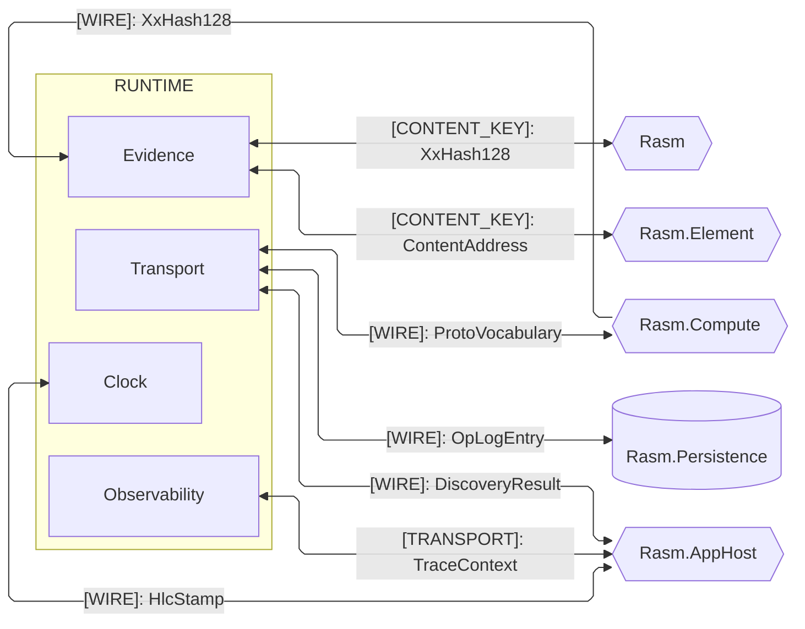
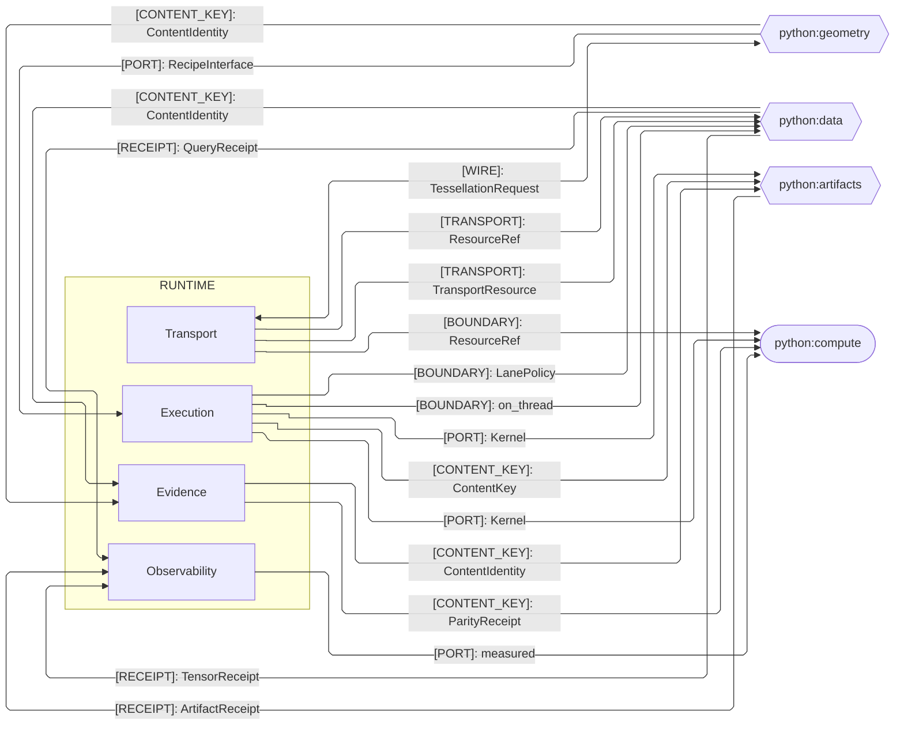
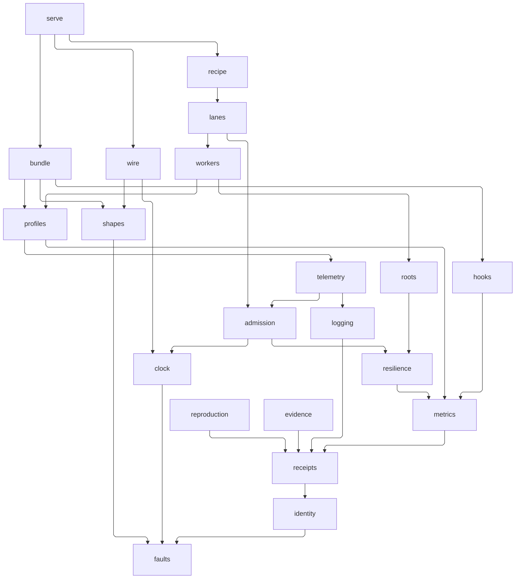

# [PY_RUNTIME_ARCHITECTURE]

`runtime` maps the host-free execution foundation every `libs/python` sibling composes: one polymorphic owner per sub-domain closes its concern, each folder mapping to exactly one module namespace. Content identity reproduces the C# `XxHash128` seed bit-identically and never re-mints, so a value carries one key across the runtime boundary; companion decode admits only C#-minted wire shapes and owns no wire vocabulary. It references no sibling — alignment travels through seam contracts and the content-keyed wire.

## [01]-[DOMAIN_MAP]

```text codemap
runtime/
├── observability/      # Local evidence production: receipts, signals, and the one OTLP install gate
│   ├── receipts.py     # Receipt union, drain taxonomy, and contributor-fold port
│   ├── logging.py      # Structlog pipeline: shared chain, stdout ship law, and the log-ship policy
│   ├── metrics.py      # One MeterProvider's instruments, the record mapping, and the instrumentor train
│   ├── hooks.py        # Scoped hook registry: point rows, modalities, and telemetry taps
│   ├── profiles.py     # Pyroscope push, benchmark receipts, and the offline-job envelope
│   ├── telemetry.py    # Profile-gated OTLP install owner
│   └── bundle.py       # Pull-driven support-bundle capsule: fenced collectors and the content-keyed archive fold
├── reliability/        # One fault family and resilience policy every sibling returns through
│   ├── faults.py       # Boundary-fault union and its exception-to-fault projector
│   └── resilience.py   # Retry policy table, one row per retryable class
├── transport/          # Resource roots, the companion server, the wire vocabulary, and the wire codec
│   ├── roots.py        # Resource roots and refs over fsspec and the remote transports
│   ├── serve.py        # gRPC server lifecycle, route roster, capability invoke, and the daemon composition root
│   ├── shapes.py       # Proto vocabulary and its descriptor drift gate
│   └── wire.py         # Protobuf transcode, frame legs, and the CRDT-op codec
├── execution/          # Caller-owned host-fact admission, bounded concurrency, the worker fabric, and recipe execution
│   ├── admission.py    # Runtime context, causal frames, and settings admission
│   ├── lanes.py        # Lane-policy task groups and the stage-plan DAG
│   ├── workers.py      # Worker fabric: kind family, kernel crossing, warm pools, remote/device arms, the guest sandbox, and supervision
│   └── recipe.py       # Content-keyed recipe execution on the thread lane
├── evidence/           # Content-addressing, the seed-parity corpus, and structural-surface evidence
│   ├── identity.py     # Content identity and key reproducing the C# seed bit-identically
│   ├── reproduction.py # Seed-reproduction corpus and its parity fold
│   └── evidence.py     # Evidence union, catalogue member facts, and grammar registry
└── clock/              # Logical time: the host-minted HLC stamp and the (origin, logical) element id
    └── clock.py        # HLC stamp, element id, tenant, and causal frame
```

## [02]-[SEAMS]





Each fence's home roster holds only the sub-domains carrying a seam with that peer plane: `reliability` crosses no boundary, `clock` faces only the C# plane, `execution` only the Python plane. Frozen registry names spell from the counterpart's endpoint page; `ServerHost`/`CommandReceipt`, `PROTO_VOCABULARY`, `CrdtOp`, and `ContentKey` are this package's interior spellings behind the `DiscoveryResult`, `ProtoVocabulary`, `OpLogEntry`, and `ContentAddress` wires.

## [03]-[INTERNAL]

Interior composition is one acyclic import rail: `faults` roots the graph, every module returns through it, and `serve` is the terminal composition tier. Edges below are the transitive reduction of the real module imports — a drawn edge is a direct import no shorter chain explains.

- S0 `faults` — mints the one boundary-fault union and rail (`BoundaryFault`, `RuntimeRail`) exactly once and imports no runtime sibling; every module above returns through it.
- S1–S3 identity band — `clock` (`Hlc`/`ElementId`/`Tenant`), `identity` (`ContentKey`), and `shapes` (`PROTO_VOCABULARY`) sit directly on faults; `receipts` composes identity, and `logging` (`LogShip`), `metrics`, `hooks`, `reproduction` (`ParityReceipt`), and `evidence` fold through receipts — `hooks` through the metrics spine it taps.
- S4–S6 execution band — `resilience` (the `RetryClass` policy table) composes metrics; `roots` (`ResourceRef`) and `admission` return through resilience while `wire` (`CrdtOp`) sits on shapes and clock; `telemetry` gates on admission and carries the `logging`-owned ship policy, and `profiles` (`BenchmarkReceipt`/`JobRun`) drives the telemetry install beside the metrics spine.
- S7–S9 composition tier — `workers` (`Kernel`) composes roots and boots its floors through profiles and telemetry, `lanes` (`StagePlan`) drives admission and workers, `recipe` (`RecipeInterface`) composes lanes and roots, `bundle` (`SupportBundle`) folds the install receipts, hook rings, and admitted context beside profiles, and `serve` (`DiscoveryResult`/`CommandReceipt`) is the terminal tier wiring recipe, bundle, and the wire codec.



## [04]-[BOUNDARIES]

Each sub-domain charter is the codemap comment; the boundary law below fixes the one ownership each holds, so a planned-but-empty sub-domain and a misplaced concern both read as gaps. Exact refusals and their enforcing mechanisms live on the owning implementation pages.

- `observability` — produces local evidence only, never an AppHost envelope or health status.
- One shared OTLP exporter and one `MeterProvider` install behind the profile gate; every receipt folds through one attribute-keyed drain.
- Every serve-leg span rides the inbound C# parent context; a pickled worker without its own telemetry install runs unparented while the carrier still crosses.
- Structured JSON events ship to stdout and the collector promotes them to OTLP log records; the telemetry root alone names the in-process log escape hatch.
- Hook points register composition-unique package-qualified ids, and telemetry subscribes to hook facts as taps.
- Contrib instrumentors and the pyroscope push activate once at the composition root; offline jobs drain every provider at the job boundary.
- Support-bundle capture is pull-driven and bounded — every archive fact passes the receipts-owned redaction before a byte lands, and the capsule serves only through the registered diagnostic route.
- Worker floors boot the parent-captured install post-spawn and drain at exit; kernel-grain cost records where it is spent, under the tenant the carrier promotes.
- `reliability` — owns the one boundary-fault surface and the single retry policy; every failure returns as a typed fault, never a sentinel.
- `execution` — admits host facts caller-owned, reads secrets through the settings-admitted boundary, and mints no stamp beside the inbound frame.
- Concurrency stays bounded under `StagePlan` and the one scheduler owner, every lane draining to a `DrainReceipt`.
- Every kernel leaves the loop as one `Kernel` value on the closed worker-kind family; warm pools, restart actuation, and the verdict projection onto the serve health flip stay the workers owner's, and lane capacity projects from the admitted profile row.
- `evidence` — keys identity by content through the one hashing owner reproducing the C# `XxHash128` seed.
- Evidence catalogue and grammar surfaces emit what the `assay code` rail consumes.
- `clock` — owns the one `Hlc`/`ElementId`/`Tenant` spelling; the two-half stamp reproduces the C# mint bit-identically and is never re-minted.
- A stamp's physical half is host-minted rather than wall-clock, its element id the `(origin, logical)` identity; the wire codec and admission consume this owner.
