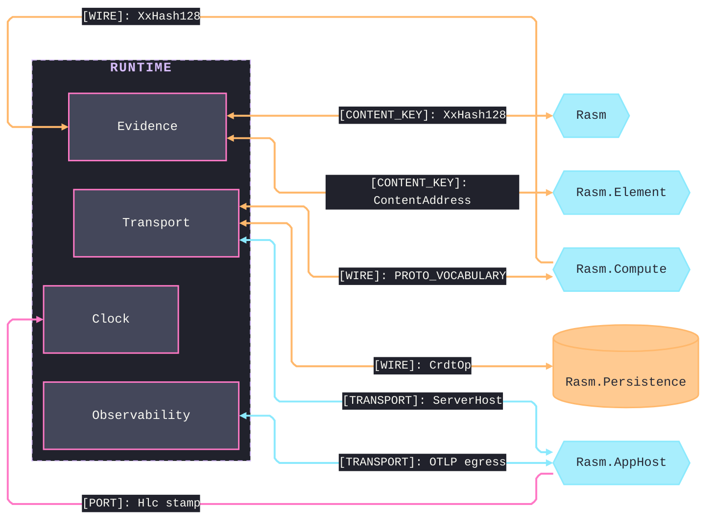
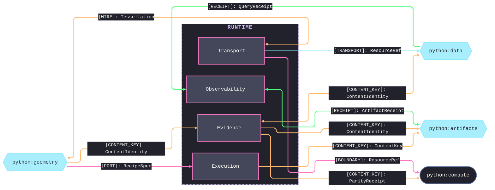

# [PY_RUNTIME_ARCHITECTURE]

`runtime` maps the host-free execution foundation every `libs/python` sibling composes: one polymorphic owner per sub-domain closes its concern, each folder mapping to exactly one module namespace. Content identity reproduces the C# `XxHash128` seed bit-identically and never re-mints, so a value carries one key across the runtime boundary; companion decode admits only C#-minted wire shapes and owns no wire vocabulary. It references no sibling — alignment travels through seam contracts and the content-keyed wire.

## [01]-[DOMAIN_MAP]

```text codemap
runtime/
├── observability/      # Local evidence production: receipts, signals, and the one OTLP install gate
│   ├── receipts.py     # Receipt union, drain taxonomy, and contributor-fold port
│   ├── metrics.py      # One MeterProvider's instruments and the record mapping
│   └── telemetry.py    # Profile-gated OTLP install owner
├── reliability/        # One fault family and resilience policy every sibling returns through
│   ├── faults.py       # Boundary-fault union and its exception-to-fault projector
│   └── resilience.py   # Retry policy table, one row per retryable class
├── transport/          # Resource roots, the companion server, the wire vocabulary, and the wire codec
│   ├── roots.py        # Resource roots and refs over fsspec and the remote transports
│   ├── serve.py        # gRPC server lifecycle, route roster, and credential admit
│   ├── shapes.py       # Proto vocabulary and its descriptor drift gate
│   └── wire.py         # Protobuf transcode, frame legs, and the CRDT-op codec
├── execution/          # Caller-owned host-fact admission, bounded concurrency, and recipe execution
│   ├── admission.py    # Runtime context, causal frames, and settings admission
│   ├── lanes.py        # Lane-policy task groups and the stage-plan DAG
│   └── recipe.py       # Content-keyed recipe execution on the thread lane
├── evidence/           # Content-addressing, the seed-parity corpus, and structural-surface evidence
│   ├── identity.py     # Content identity and key reproducing the C# seed bit-identically
│   ├── reproduction.py # Seed-reproduction corpus and its parity fold
│   └── evidence.py     # Evidence union, catalogue member facts, and grammar registry
└── clock/              # Logical time: the host-minted HLC stamp and content-stable element id
    └── clock.py        # HLC stamp, element id, tenant, and causal frame
```

## [02]-[SEAMS]





## [03]-[BOUNDARIES]

Each sub-domain charter is the codemap comment; the boundary law below fixes the one ownership each holds, so a planned-but-empty sub-domain and a misplaced concern both read as gaps. Exact refusals and their enforcing mechanisms live on the owning implementation pages.

- `observability` — produces local evidence only, never an AppHost envelope or health status.
- One shared OTLP exporter and one `MeterProvider` install behind the profile gate; every receipt folds through one attribute-keyed drain.
- Every span rides the inbound C# parent context.
- `reliability` — owns the one boundary-fault surface and the single retry policy; every failure returns as a typed fault, never a sentinel.
- `execution` — admits host facts caller-owned, reads secrets through the settings-admitted boundary, and mints no stamp beside the inbound frame.
- Concurrency stays bounded under `StagePlan` and the one scheduler owner, every lane draining to a `DrainReceipt`.
- `evidence` — keys identity by content through the one hashing owner reproducing the C# `XxHash128` seed.
- Evidence catalogue and grammar surfaces emit what the `assay code` rail consumes.
- `clock` — owns the one `Hlc`/`ElementId`/`Tenant` spelling; the two-half stamp reproduces the C# mint bit-identically and is never re-minted.
- A stamp's physical half is host-minted rather than wall-clock, its element id content-stable; the wire codec and admission consume this owner.
