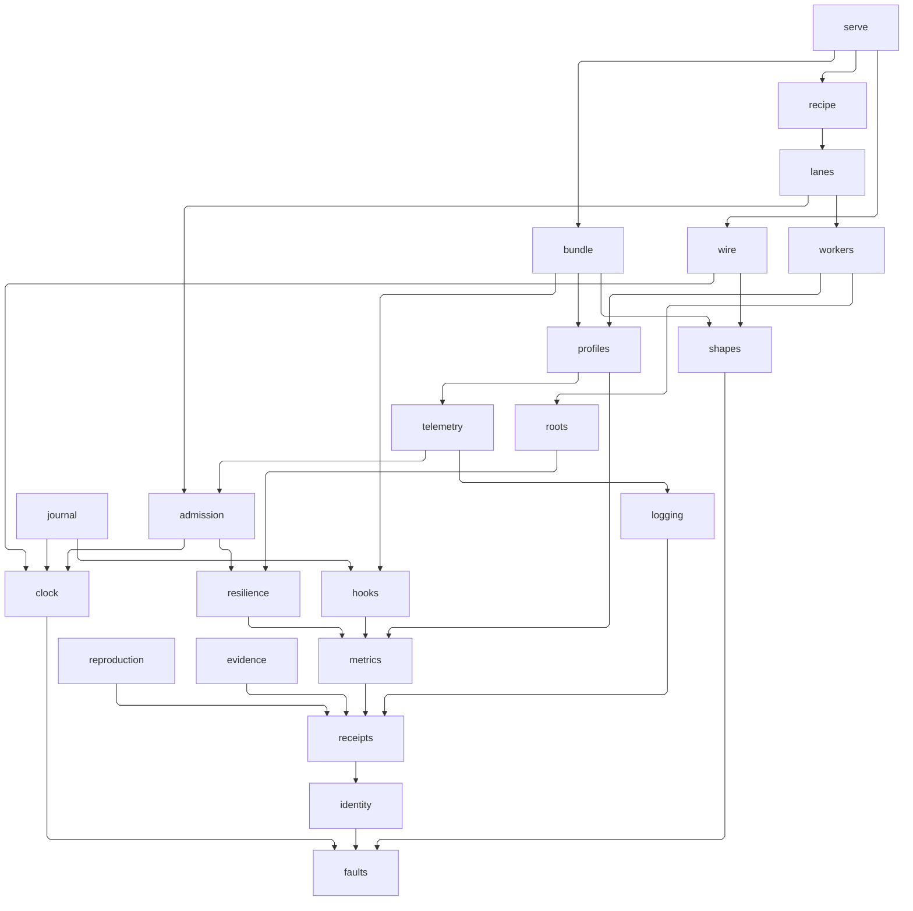
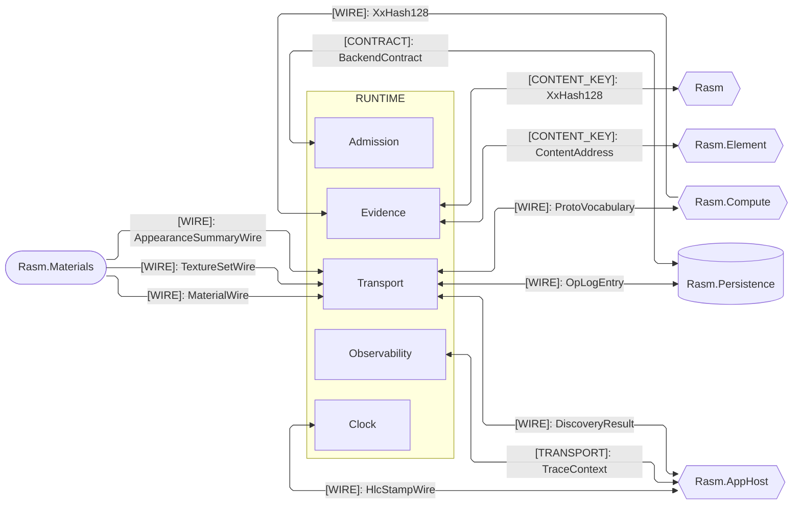
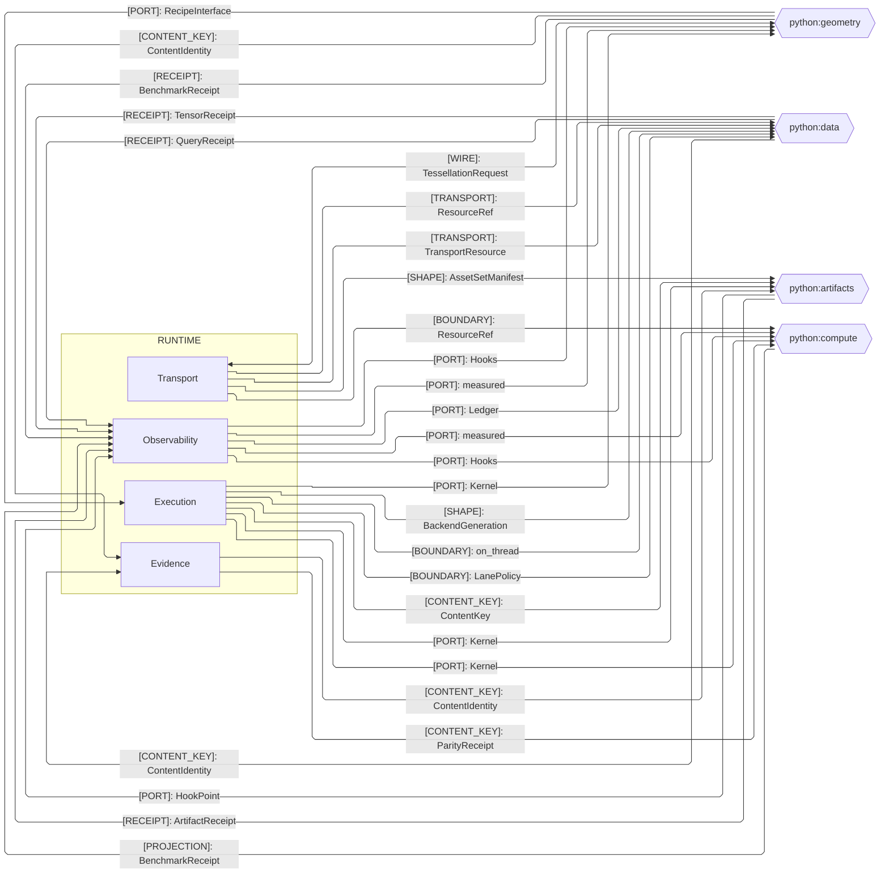

# [PY_RUNTIME_ARCHITECTURE]

`runtime` maps the host-free execution foundation every `libs/python` sibling composes: one polymorphic owner per sub-domain closes its concern, each folder mapping to one module namespace. Python owns its content-key implementation, contract bindings, wire codecs, backend admission, and execution lifecycle; shared semantics prove against the neutral contract corpus. Runtime references no sibling.

## [01]-[DOMAIN_MAP]

```text codemap
runtime/
├── observability/      # Local evidence production: receipts, signals, and the one OTLP install gate
│   ├── receipts.py     # Receipt union, drain taxonomy, the composition-scope axis, and contributor-fold port
│   ├── logging.py      # Structlog pipeline: shared chain, the OTLP wire projection, log-ship policy, terminal doors
│   ├── metrics.py      # Instrument census, metric-stream view rows and tenant budget, the record mapping, and the instrumentor train
│   ├── hooks.py        # Scoped hook registry: point rows, modalities, and telemetry taps
│   ├── profiles.py     # Pyroscope push, benchmark receipts, and the offline-job envelope
│   ├── telemetry.py    # Profile-gated OTLP install owner
│   ├── bundle.py       # Pull-driven support-bundle capsule: fenced collectors and the content-keyed archive fold
│   └── journal.py      # Durable fact stream: audit and meter records, retention classes, exact rating, crypto-shredding
├── reliability/        # One fault family and resilience policy every sibling returns through
│   ├── faults.py       # Boundary-fault union, its exception-to-fault projector, and the versioned scope coordinate
│   └── resilience.py   # Retry policy table, one row per retryable class
├── transport/          # Resource roots, the companion server, the wire vocabulary, and the wire codec
│   ├── roots.py        # Resource roots and refs over fsspec and the remote transports
│   ├── serve.py        # gRPC server lifecycle, route roster, capability invoke, and the daemon composition root
│   ├── shapes.py       # Proto vocabulary and its descriptor drift gate
│   └── wire.py         # Protobuf transcode, frame legs, and the CRDT-op codec
├── execution/          # Caller-owned host-fact admission, bounded concurrency, the worker crossing, and recipe execution
│   ├── admission.py    # Runtime context, causal frames, and settings admission
│   ├── lanes.py        # Lane-policy task groups and the stage-plan DAG
│   ├── workers.py      # Worker crossing: kind family, kernel value, warm pools, remote/device arms, the guest sandbox, and supervision
│   └── recipe.py       # Content-keyed recipe execution on the thread lane
├── evidence/           # Content-addressing, the seed-parity corpus, and structural-surface evidence
│   ├── identity.py     # Content identity and key implementing the shared digest contract
│   ├── reproduction.py # Seed-reproduction corpus and its parity fold
│   └── evidence.py     # Evidence union, catalogue member facts, and grammar registry
└── clock/              # Logical time: the locally minted HLC stamp and the (origin, logical) element id
    └── clock.py        # HLC stamp, element id, tenant, and causal frame
```

## [02]-[STRATA]

Interior composition is one acyclic import rail: `faults` roots the graph, every module returns through it, and `serve` terminates the rail. Edges below are the transitive reduction of the real module imports — a drawn edge is a direct import no shorter chain explains.


```mermaid
---
config:
  layout: elk
  flowchart:
    curve: linear
    padding: 25
---
flowchart TB
    accTitle: Runtime interior import rail
    accDescr: Transitive-reduced module import rail from serve down through the execution and install strata onto the faults root.
    Serve[serve]
    Bundle[bundle]
    Journal[journal]
    Profiles[profiles]
    Recipe[recipe]
    Telemetry[telemetry]
    Wire[wire]
    Lanes[lanes]
    Roots[roots]
    Admission[admission]
    Workers[workers]
    Shapes[shapes]
    Clock[clock]
    Resilience[resilience]
    Reproduction[reproduction]
    Evidence[evidence]
    Hooks[hooks]
    Metrics[metrics]
    Logging[logging]
    Receipts[receipts]
    Identity[identity]
    Faults[faults]
    Serve r1@--> Recipe
    Serve r2@--> Bundle
    Serve r3@--> Wire
    Bundle r28@--> Profiles
    Bundle r29@--> Hooks
    Bundle r30@--> Shapes
    Journal r32@--> Hooks
    Journal r33@--> Clock
    Workers r31@--> Profiles
    Profiles r23@--> Telemetry
    Profiles r24@--> Metrics
    Recipe r4@--> Lanes
    Workers r5@--> Roots
    Telemetry r6@--> Admission
    Telemetry r25@--> Logging
    Lanes r7@--> Admission
    Lanes r8@--> Workers
    Wire r9@--> Clock
    Wire r10@--> Shapes
    Admission r11@--> Clock
    Admission r12@--> Resilience
    Roots r14@--> Resilience
    Resilience r15@--> Metrics
    Hooks r26@--> Metrics
    Metrics r16@--> Receipts
    Logging r27@--> Receipts
    Reproduction r17@--> Receipts
    Evidence r18@--> Receipts
    Receipts r19@--> Identity
    Identity r20@--> Faults
    Shapes r21@--> Faults
    Clock r22@--> Faults
```

- S0 `faults` — mints `BoundaryFault` and the `RuntimeRail` exactly once, importing no sibling; every module above returns through it.
- S1–S3 identity strata — `clock` (`Hlc`/`ElementId`/`Tenant`), `identity` (`ContentKey`), and `shapes` (`PROTO_VOCABULARY`) sit directly on faults.
- S1–S3 `receipts` composes identity; `logging` (`LogShip`), `metrics`, `reproduction` (`ParityReceipt`), and `evidence` fold through receipts.
- S1–S3 `hooks` folds through the metrics spine it taps.
- S4–S6 execution strata — `resilience` (the `RetryClass` policy table) composes metrics; `roots` (`ResourceRef`) and `admission` return through it.
- S4–S6 `wire` (`CrdtOp`) sits on shapes and clock; `telemetry` gates on admission and carries the `logging`-owned ship policy.
- S4–S6 `profiles` (`BenchmarkReceipt`/`JobRun`) drives the telemetry install beside the metrics spine.
- S7–S9 composition strata — `serve` (`DiscoveryResult`/`CommandReceipt`) terminates the rail, wiring recipe, bundle, and the wire codec.
- S7–S9 `workers` (`Kernel`) composes roots and boots its floors through profiles and telemetry; `lanes` (`StagePlan`) drives admission and workers.
- S7–S9 `recipe` (`RecipeInterface`) composes lanes and roots; `bundle` (`SupportBundle`) folds install receipts, hook rings, and admitted context.
- S7–S9 `journal` (`Fact`) stamps through clock and registers points on hooks; its `Ledger` binds at composition, never by import.

## [03]-[SEAMS]


```mermaid
---
config:
  layout: elk
  flowchart:
    curve: linear
    padding: 25
---
flowchart LR
    accTitle: Runtime C# platform and kernel seams
    accDescr: Runtime sub-domain owners exchanging content keys, wire codecs, gRPC transport, and clock stamps with the C# peers.
    subgraph runtime[RUNTIME]
        Evidence[Evidence]
        Admission[Admission]
        Transport[Transport]
        Observability[Observability]
        Clock[Clock]
    end
    Rasm{{Rasm}}
    Element{{Rasm.Element}}
    Compute{{Rasm.Compute}}
    Persistence[(Rasm.Persistence)]
    AppHost{{Rasm.AppHost}}
    Materials([Rasm.Materials])
    Materials e10@-->|"[WIRE]: MaterialWire"| Transport
    Materials e29@-->|"[WIRE]: TextureSetWire"| Transport
    Materials e30@-->|"[WIRE]: AppearanceSummaryWire"| Transport
    Evidence e1@<-->|"[CONTENT_KEY]: XxHash128"| Rasm
    Evidence e2@<-->|"[CONTENT_KEY]: ContentAddress"| Element
    Compute e3@-->|"[WIRE]: XxHash128"| Evidence
    Transport e4@<-->|"[WIRE]: ProtoVocabulary"| Compute
    Transport e5@<-->|"[WIRE]: OpLogEntry"| Persistence
    Persistence e9@<-->|"[CONTRACT]: BackendContract"| Admission
    Transport e6@<-->|"[WIRE]: DiscoveryResult"| AppHost
    Observability e7@<-->|"[TRANSPORT]: TraceContext"| AppHost
    AppHost e8@<-->|"[WIRE]: HlcStampWire"| Clock
```


```mermaid
---
config:
  layout: elk
  flowchart:
    curve: linear
    padding: 25
---
flowchart LR
    accTitle: Runtime cross-package Python seams
    accDescr: Runtime sub-domain owners exchanging content identity, transport, kernel and hook ports, and receipts with the Python siblings.
    subgraph runtime[RUNTIME]
        Transport[Transport]
        Evidence[Evidence]
        Observability[Observability]
        Execution[Execution]
    end
    Geometry{{python:geometry}}
    Data{{python:data}}
    Artifacts{{python:artifacts}}
    Compute{{python:compute}}
    Transport e5@<-->|"[WIRE]: TessellationRequest"| Geometry
    Geometry e1@-->|"[CONTENT_KEY]: ContentIdentity"| Evidence
    Geometry e9@-->|"[PORT]: RecipeInterface"| Execution
    Data e2@-->|"[CONTENT_KEY]: ContentIdentity"| Evidence
    Transport e6@-->|"[TRANSPORT]: ResourceRef"| Data
    Transport e16@-->|"[TRANSPORT]: TransportResource"| Data
    Observability e27@-->|"[PORT]: Ledger"| Data
    Data e11@-->|"[RECEIPT]: QueryReceipt"| Observability
    Data e17@-->|"[RECEIPT]: TensorReceipt"| Observability
    Execution e14@-->|"[BOUNDARY]: on_thread"| Data
    Execution e18@-->|"[BOUNDARY]: LanePolicy"| Data
    Execution e19@-->|"[SHAPE]: BackendGeneration"| Data
    Evidence e3@-->|"[CONTENT_KEY]: ContentIdentity"| Artifacts
    Artifacts e10@-->|"[RECEIPT]: ArtifactReceipt"| Observability
    Execution e8@-->|"[CONTENT_KEY]: ContentKey"| Artifacts
    Execution e15@-->|"[PORT]: Kernel"| Artifacts
    Transport e28@-->|"[SHAPE]: AssetSetManifest"| Artifacts
    Artifacts e20@-->|"[PORT]: HookPoint"| Observability
    Evidence e4@-->|"[CONTENT_KEY]: ParityReceipt"| Compute
    Transport e7@-->|"[BOUNDARY]: ResourceRef"| Compute
    Observability e13@-->|"[PORT]: measured"| Compute
    Execution e12@-->|"[PORT]: Kernel"| Compute
    Observability e21@-->|"[PORT]: Hooks"| Compute
    Compute e22@-->|"[PROJECTION]: BenchmarkReceipt"| Observability
    Execution e23@-->|"[PORT]: Kernel"| Geometry
    Geometry e24@-->|"[RECEIPT]: BenchmarkReceipt"| Observability
    Observability e25@-->|"[PORT]: measured"| Geometry
    Observability e26@-->|"[PORT]: Hooks"| Geometry
```

Each fence's home roster holds only the sub-domains carrying a seam with that peer plane: `reliability` crosses no boundary, `clock` faces only the C# plane, `execution` only the Python plane. Frozen registry names spell from the counterpart's endpoint page; `ServerHost`/`CommandReceipt`, `PROTO_VOCABULARY`, `CrdtOp`, and `ContentKey` are this package's interior spellings behind the `DiscoveryResult`, `ProtoVocabulary`, `OpLogEntry`, and `ContentAddress` wires.

## [04]-[BOUNDARIES]

Each sub-domain charter is the codemap comment; the boundary law below fixes the one ownership each holds, so a planned-but-empty sub-domain and a misplaced concern both read as gaps. Exact refusals and their enforcing mechanisms live on the owning implementation pages.

- `observability` — produces local evidence only, never an AppHost envelope or health status.
- One shared OTLP exporter and one `MeterProvider` install behind the profile gate; every receipt folds through one attribute-keyed drain.
- Metric-stream shaping is DATA at the instrument owner and SDK construction at the install root, so no SDK type enters below the composition root.
- Every recorded measure holds an instrument row, and every emitted scope carries the fault root's one versioned semconv coordinate.
- Pushed values never feed an observable instrument; the owner of a bounded resource registers the read the export cycle samples.
- Every serve-leg span rides the inbound parent context.
- Pickled workers carrying no telemetry install of their own run unparented; the carrier still crosses.
- One chain projects every event onto the log wire and renders the operator's stdout line; the collector admits an OTLP receiver alone, so no stdout tail promotes anything.
- Terminal interpreter hooks route into that one chain, each door chaining the predecessor it wrapped.
- Only the telemetry root registers the `LoggerProvider` that chain resolves.
- Hook points register composition-unique package-qualified ids, and telemetry subscribes to hook facts as taps.
- Contrib instrumentors and the pyroscope push activate once at the composition root; offline jobs drain every provider at the job boundary.
- Support-bundle capture is pull-driven and bounded; every archive fact passes the receipts-owned redaction before a byte lands.
- Bundle capsules serve only through the registered diagnostic route.
- Journal facts are the branch's evidence truth and every series projected from them is derived, dropping at warm-up cost.
- Every fact takes its ordering coordinate from the journal writer, so a producer supplies evidence and never identity.
- Durable ledgers bind as a port at composition beside the emitter identity their rows partition on; this stratum opens no connection and executes no retention mechanism.
- Erasure destroys per-subject key material and rewrites no row, so unreadable IS erased and the append-only plane survives whole.
- Worker floors boot the parent-captured install post-spawn and drain at exit.
- Kernel-grain cost records where it is spent, under the tenant the carrier promotes.
- `reliability` — owns the one boundary-fault surface and the single retry policy; every failure returns as a typed fault, never a sentinel.
- `execution` — admits host facts caller-owned, reads secrets through the settings-admitted boundary, and mints no stamp beside the inbound frame.
- Concurrency stays bounded under `StagePlan` and the one scheduler owner, every lane draining to a `DrainReceipt`.
- Every kernel leaves the loop as one `Kernel` value on the closed worker-kind family.
- Warm pools, restart actuation, and the serve health-flip verdict projection stay the workers owner's.
- Lane capacity projects from the admitted profile row.
- `evidence` — keys identity through the Python implementation of the shared content-key contract.
- Evidence catalogue and grammar surfaces emit what the `assay code` rail consumes.
- `clock` — owns Python's `Hlc`/`ElementId`/`Tenant` spelling and proves its two-half encoding against the shared contract.
- Every stamp's physical half samples the admitted local clock; its element id is the `(origin, logical)` identity.
- `wire` and `admission` alone consume the clock owner.
