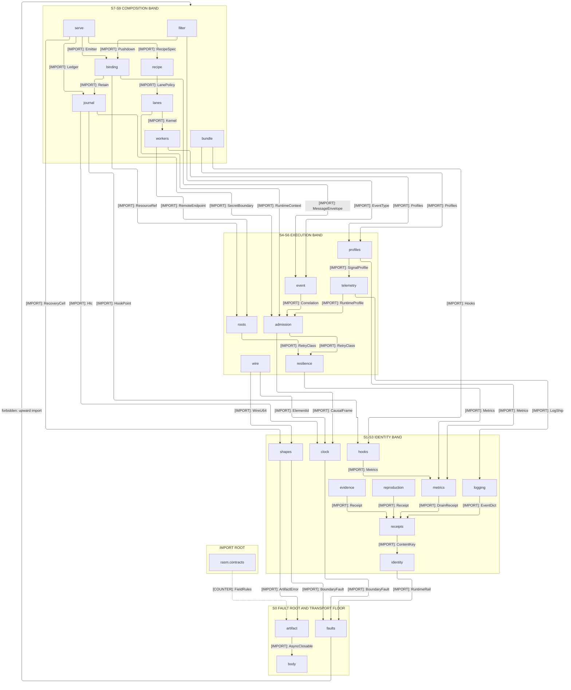
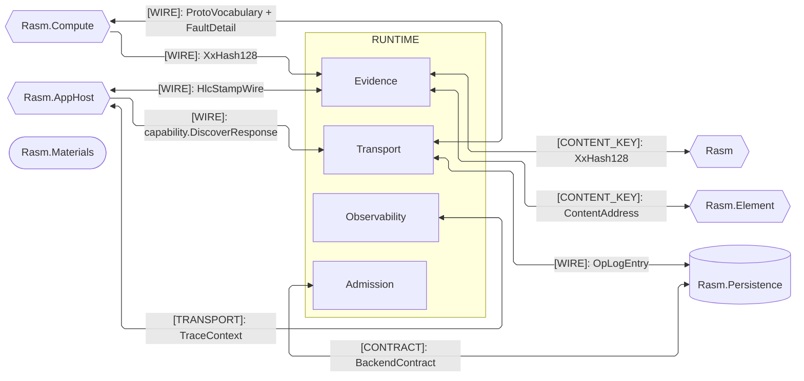
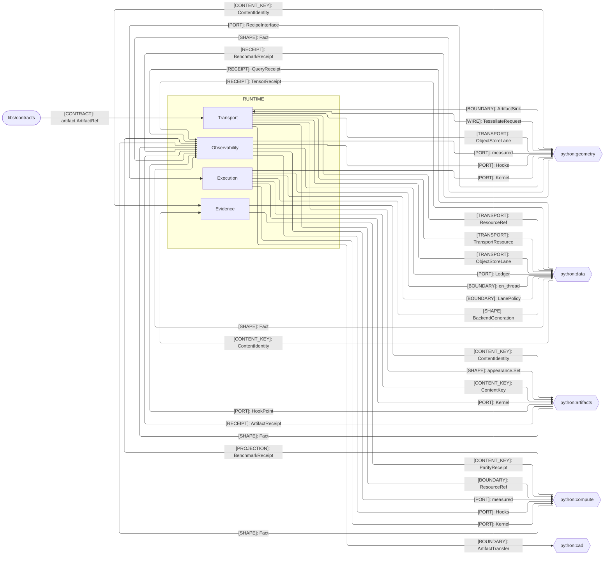
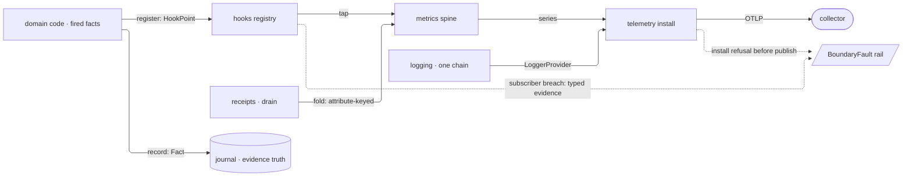

# [PY_RUNTIME_ARCHITECTURE]

`runtime` maps the host-free execution foundation every `libs/python` sibling composes: one polymorphic owner per sub-domain closes its concern, each folder mapping to one module namespace. Python owns its content-key implementation, contract bindings, wire codecs, backend admission, and execution lifecycle; shared semantics prove against the neutral contract corpus. Runtime references no sibling.

## [01]-[DOMAIN_MAP]

```text
runtime/
├── observability/      # Local evidence production: receipts, signals, and the one OTLP install gate
│   ├── receipts.py     # Six-column Receipt spine over its Payload family, DRAIN_COLUMNS, ScopeKey, Ring, and the contribute port
│   ├── logging.py      # LogPipeline chain and the LogShip policy; render line and wire projection split by door
│   ├── metrics.py      # Instrument census, metric-stream view rows and tenant budget, the record mapping, and the instrumentor train
│   ├── hooks.py        # HookPoint rows, the Modality family, the shared StageMark long-fold payload; custody keyed and released per scope
│   ├── profiles.py     # SignalProfile selection, BenchmarkReceipt and JobRun.bounded rows over the install gate
│   ├── telemetry.py    # One install gate over providers and detectors, plus the native conformance receipt
│   ├── bundle.py       # BUNDLE_DESCRIPTOR/BUNDLE_WIRE shapes and the pull-only capsule; collectors run fenced
│   └── journal.py      # Fact family with Retain classes, the JournalGate hook roster, KEK shredding, and the Ledger/Custody ports
├── reliability/        # One fault family and resilience policy every sibling returns through
│   ├── faults.py       # BoundaryFault union, RuntimeRail, the folder-wide RAISES census, SCOPES, and the boundary/scoped decorators
│   └── resilience.py   # RetryClass rows, RateGate, and the guard/guarded/guarded_sync decorators at the free BASE
├── transport/          # Resource roots, the companion server, the wire codec, and the message-envelope owner with its bindings and filters
│   ├── body.py         # AdmissionSide/AdmissionPhase posture, BodyAdmission over the four Connect shapes, AdmissionError evidence
│   ├── artifact.py     # ArtifactLaw descriptor read, ArtifactSink custody, ArtifactStream envelopes, ArtifactTransfer dial
│   ├── roots.py        # ResourceRef mint the transport and worker legs resolve bytes through
│   ├── serve.py        # Connect host with metadata admission, body validation, health, typed details, and the Supervisor drain order
│   ├── shapes.py       # SPLAT_FORMS rows, the FaultRecovery correspondence, the REGISTRY descriptor seat, and the two-way boot census over services
│   ├── wire.py         # Decode, the CRDT op-log codec, and one-family fields with retained presence/RGA horizons
│   ├── event.py        # Strict generic CloudEvents, MessageEnvelope profile, format rows, and extension codecs
│   ├── binding.py      # Binding rows, payload residence, authenticated delivery scope, and BrokerLane custody
│   └── filter.py       # Cesql lowered closures over the LALR grammar; FilterDialect pushdown rows and the Subscription seat
├── execution/          # Caller-owned host-fact admission, bounded concurrency, the worker crossing, and recipe execution
│   ├── admission.py    # RuntimeContext/Profile, SecretBoundary, SettingsAdmission, PrincipalScope, and TenantAdoption
│   ├── lanes.py        # LanePolicy/Admit task groups, whole-capacity grants, and StagePlan; capacity projects from the profile row
│   ├── workers.py      # Kernel/KernelTrait crossing values, WorkerPool and Charge, Enforcement and Supervisor arms
│   └── recipe.py       # RecipeSpec/RecipeName rows and the port seat geometry binds; lbt binds function-local
└── evidence/           # Logical time, content-addressing, the seed-parity corpus, and structural-surface evidence
    ├── clock.py        # Hlc, ElementId, Tenant, and causal-frame mints on the faults root
    ├── identity.py     # Content identity and key implementing the shared digest contract
    ├── reproduction.py # ParityReceipt fold over KEY_FMT/KeyRender views; corpus rows keyed by ContentKey
    └── evidence.py     # Scope/Disposition folds over the registered grammar; the assay code rail's one source
```

## [02]-[STRATA]

Interior composition is one acyclic import rail: `faults` roots the graph and every fault-bearing module returns through it, `body` and `artifact` seat beside it as the descriptor-driven transport floor importing no runtime sibling, and `serve` terminates the rail. Edges below are the transitive reduction of the real module imports, so a drawn edge is a direct import no shorter chain explains.


```mermaid
---
config:
  layout: elk
  flowchart:
    curve: linear
    padding: 25
---
flowchart TB
    accTitle: Runtime interior import rail
    accDescr: Transitive-reduced module import rail from serve down through the execution and identity bands onto the faults root.
    subgraph S7["S7-S9 COMPOSITION BAND"]
        Serve[serve]
        Binding[binding]
        Filter[filter]
        Workers[workers]
        Lanes[lanes]
        Recipe[recipe]
        Bundle[bundle]
        Journal[journal]
    end
    subgraph S4["S4-S6 EXECUTION BAND"]
        Event[event]
        Profiles[profiles]
        Telemetry[telemetry]
        Wire[wire]
        Admission[admission]
        Roots[roots]
        Resilience[resilience]
    end
    subgraph S1["S1-S3 IDENTITY BAND"]
        Hooks[hooks]
        Metrics[metrics]
        Logging[logging]
        Reproduction[reproduction]
        Evidence[evidence]
        Receipts[receipts]
        Clock[clock]
        Shapes[shapes]
        Identity[identity]
    end
    subgraph S0["S0 FAULT ROOT AND TRANSPORT FLOOR"]
        Faults[faults]
        Body[body]
        Artifact[artifact]
    end
    subgraph ROOTS["IMPORT ROOT"]
        Contracts[rasm.contracts]
    end
    Serve e1@-->|"[IMPORT]: RecipeSpec"| Recipe
    Serve e3@-->|"[IMPORT]: RecoveryCell"| Shapes
    Serve e4@-->|"[IMPORT]: Emitter"| Binding
    Serve e5@-->|"[IMPORT]: Ledger"| Journal
    Binding e6@-->|"[IMPORT]: MessageEnvelope"| Event
    Binding e7@-->|"[IMPORT]: Retain"| Journal
    Binding e8@-->|"[IMPORT]: ResourceRef"| Roots
    Filter e9@-->|"[IMPORT]: Pushdown"| Binding
    Filter e10@-->|"[IMPORT]: EventType"| Event
    Bundle e11@-->|"[IMPORT]: Profiles"| Profiles
    Bundle e12@-->|"[IMPORT]: Hooks"| Hooks
    Journal e14@-->|"[IMPORT]: HookPoint"| Hooks
    Journal e15@-->|"[IMPORT]: Hlc"| Clock
    Journal e16@-->|"[IMPORT]: SecretBoundary"| Admission
    Workers e17@-->|"[IMPORT]: Profiles"| Profiles
    Workers e18@-->|"[IMPORT]: RemoteEndpoint"| Roots
    Lanes e19@-->|"[IMPORT]: RuntimeContext"| Admission
    Lanes e20@-->|"[IMPORT]: Kernel"| Workers
    Recipe e21@-->|"[IMPORT]: LanePolicy"| Lanes
    Event e22@-->|"[IMPORT]: Correlation"| Admission
    Profiles e23@-->|"[IMPORT]: SignalProfile"| Telemetry
    Profiles e24@-->|"[IMPORT]: Metrics"| Metrics
    Telemetry e25@-->|"[IMPORT]: RuntimeProfile"| Admission
    Telemetry e26@-->|"[IMPORT]: LogShip"| Logging
    Wire e27@-->|"[IMPORT]: ElementId"| Clock
    Wire e28@-->|"[IMPORT]: WireU64"| Shapes
    Admission e29@-->|"[IMPORT]: CausalFrame"| Clock
    Admission e30@-->|"[IMPORT]: RetryClass"| Resilience
    Roots e31@-->|"[IMPORT]: RetryClass"| Resilience
    Resilience e32@-->|"[IMPORT]: Metrics"| Metrics
    Hooks e33@-->|"[IMPORT]: Metrics"| Metrics
    Metrics e34@-->|"[IMPORT]: DrainReceipt"| Receipts
    Logging e35@-->|"[IMPORT]: EventDict"| Receipts
    Reproduction e36@-->|"[IMPORT]: Receipt"| Receipts
    Evidence e37@-->|"[IMPORT]: Receipt"| Receipts
    Receipts e38@-->|"[IMPORT]: ContentKey"| Identity
    Identity e39@-->|"[IMPORT]: RuntimeRail"| Faults
    Shapes e40@-->|"[IMPORT]: BoundaryFault"| Faults
    Clock e41@-->|"[IMPORT]: BoundaryFault"| Faults
    Shapes e42@-->|"[IMPORT]: ArtifactError"| Artifact
    Artifact e43@-->|"[IMPORT]: AsyncClosable"| Body
    Contracts e44@-.->|"[COUNTER]: FieldRules"| Artifact
    Faults f1@-->|"forbidden: upward import"| S7
```

- S0 `faults` — mints `BoundaryFault` and the `RuntimeRail` exactly once, importing no sibling; every module above returns through it.
- S0 `body` — descriptor-generic validation importing no runtime sibling and no generated family, so it names no family and widens with none.
- S0 `artifact` — one edge above `body`, reading `buf.validate` bounds and `artifact_pb` envelopes as VALUES; the root feeds payload alone.
- `rasm.contracts` at `libs/contracts/gen/python` is an admitted import root, never a rank — descriptor-relative imports resolve inside it alone.
- S1-S3 `clock`, `identity`, `shapes` sit on the floor — `shapes` reads `artifact`'s refusal carrier — so every stamp, key, and wire row loads first.
- S1-S3 band stays module-acyclic — every member returns through `receipts` toward `identity`, and no identity member reads a fold back.
- S4-S6 banded rank is path-dependent — `profiles -> telemetry -> admission` and `event -> admission` order inside the band, no pair looping.
- S4-S6 `telemetry` carries the `logging`-owned `LogShip` policy unchanged — the gate installs, the chain owns the wire projection.
- S4-S6 `event` mints the envelope below its bindings, so a binding row grows with zero envelope edits.
- S7-S9 `serve` alone terminates the rail — nothing imports `serve`, so the daemon root is a sink, never a dependency.
- S7-S9 `filter -> binding` runs one way — `filter` reads `Pushdown` off the row and `binding` names no dialect, so the join adds no cycle.
- S7-S9 `workers` boots parent-captured installs post-spawn, so a floor import never reaches back into the parent's rail.
- S7-S9 `recipe` seats geometry's `RecipeInterface` port on the thread lane; `bundle` folds install receipts, hook rings, and admitted context.
- S7-S9 `journal`'s `Ledger` binds at composition — the evidence-truth plane arrives as a port, and no runtime module implements it.

## [03]-[SEAMS]


```mermaid
---
config:
  layout: elk
  flowchart:
    curve: linear
    padding: 25
---
flowchart LR
    accTitle: Runtime C# platform and kernel seams
    accDescr: Runtime sub-domain owners exchanging content keys, wire codecs, Connect transport, and clock stamps with the .NET peers.
    subgraph runtime[RUNTIME]
        Evidence[Evidence]
        Admission[Admission]
        Transport[Transport]
        Observability[Observability]
    end
    Rasm{{Rasm}}
    Element{{Rasm.Element}}
    Compute{{Rasm.Compute}}
    Persistence[(Rasm.Persistence)]
    AppHost{{Rasm.AppHost}}
    Materials([Rasm.Materials])
    Evidence e3@<-->|"[CONTENT_KEY]: XxHash128"| Rasm
    Evidence e4@<-->|"[CONTENT_KEY]: ContentAddress"| Element
    Compute e5@-->|"[WIRE]: XxHash128"| Evidence
    Transport e6@<-->|"[WIRE]: ProtoVocabulary + FaultDetail"| Compute
    Transport e7@<-->|"[WIRE]: OpLogEntry"| Persistence
    Persistence e8@<-->|"[CONTRACT]: BackendContract"| Admission
    AppHost e9@-->|"[WIRE]: capability.DiscoverResponse"| Transport
    Observability e10@<-->|"[TRANSPORT]: TraceContext"| AppHost
    AppHost e11@<-->|"[WIRE]: HlcStampWire"| Evidence
```


```mermaid
---
config:
  layout: elk
  flowchart:
    curve: linear
    padding: 25
---
flowchart LR
    accTitle: Runtime cross-package Python seams
    accDescr: Runtime sub-domain owners exchanging content identity, transport, kernel and hook ports, and receipts with the Python siblings.
    subgraph runtime[RUNTIME]
        Transport[Transport]
        Evidence[Evidence]
        Observability[Observability]
        Execution[Execution]
    end
    Geometry{{python:geometry}}
    Data{{python:data}}
    Artifacts{{python:artifacts}}
    Compute{{python:compute}}
    Cad{{python:cad}}
    Contracts([libs/contracts])
    Transport e1@<-->|"[WIRE]: TessellateRequest"| Geometry
    Geometry e2@-->|"[CONTENT_KEY]: ContentIdentity"| Evidence
    Geometry e3@-->|"[PORT]: RecipeInterface"| Execution
    Data e4@-->|"[CONTENT_KEY]: ContentIdentity"| Evidence
    Transport e5@-->|"[TRANSPORT]: ResourceRef"| Data
    Transport e6@-->|"[TRANSPORT]: TransportResource"| Data
    Observability e7@-->|"[PORT]: Ledger"| Data
    Data e8@-->|"[RECEIPT]: QueryReceipt"| Observability
    Data e9@-->|"[RECEIPT]: TensorReceipt"| Observability
    Execution e10@-->|"[BOUNDARY]: on_thread"| Data
    Execution e11@-->|"[BOUNDARY]: LanePolicy"| Data
    Execution e12@-->|"[SHAPE]: BackendGeneration"| Data
    Evidence e13@-->|"[CONTENT_KEY]: ContentIdentity"| Artifacts
    Artifacts e14@-->|"[RECEIPT]: ArtifactReceipt"| Observability
    Execution e15@-->|"[CONTENT_KEY]: ContentKey"| Artifacts
    Execution e16@-->|"[PORT]: Kernel"| Artifacts
    Transport e17@-->|"[SHAPE]: appearance.Set"| Artifacts
    Artifacts e18@-->|"[PORT]: HookPoint"| Observability
    Evidence e19@-->|"[CONTENT_KEY]: ParityReceipt"| Compute
    Transport e20@-->|"[BOUNDARY]: ResourceRef"| Compute
    Observability e21@-->|"[PORT]: measured"| Compute
    Execution e22@-->|"[PORT]: Kernel"| Compute
    Transport e23@-->|"[TRANSPORT]: ObjectStoreLane"| Data
    Transport e24@-->|"[TRANSPORT]: ObjectStoreLane"| Geometry
    Artifacts e25@-->|"[SHAPE]: Fact"| Observability
    Compute e26@-->|"[SHAPE]: Fact"| Observability
    Data e27@-->|"[SHAPE]: Fact"| Observability
    Geometry e28@-->|"[SHAPE]: Fact"| Observability
    Observability e23@-->|"[PORT]: Hooks"| Compute
    Compute e24@-->|"[PROJECTION]: BenchmarkReceipt"| Observability
    Execution e25@-->|"[PORT]: Kernel"| Geometry
    Geometry e26@-->|"[RECEIPT]: BenchmarkReceipt"| Observability
    Observability e27@-->|"[PORT]: measured"| Geometry
    Observability e28@-->|"[PORT]: Hooks"| Geometry
    Transport e29@-->|"[BOUNDARY]: ArtifactSink"| Geometry
    Transport e30@-->|"[BOUNDARY]: ArtifactTransfer"| Cad
    Contracts e31@-->|"[CONTRACT]: artifact.ArtifactRef"| Transport
```

Each fence's home roster holds only the sub-domains carrying a seam with that peer set: `reliability` crosses no boundary, `execution` reaches the C# fence through the backend contract alone, and evidence's clock owner carries the one causal seam with the .NET peers.

Frozen registry names spell from the counterpart's endpoint page, so `ServerHost`/`CommandReceipt`, the generated `rasm.contracts` classes, `FaultDetail`, generated `CrdtOpWire`, and `ContentKey` are this package's interior spellings behind their counterpart wires.

Transport↔AppHost's `[WIRE]` edge also carries the `grpc.health.v1` serving-status leg over the companion UDS, and upstream `health.proto` is the frozen publisher source both ends generate from.

`libs/contracts/gen/python` is the `rasm.contracts` import root, and its `[CONTRACT]` edge collapses every generated family the transport plane reads — artifact, fault, clock, event, capability, health — while `body` names none of them. `transport/artifact`'s two `[BOUNDARY]` edges carry its custody owners outward: geometry seals native output and receives framed bodies, cad stages sources and publishes through the verified transfer, and neither re-proves an octet.

## [04]-[INTERNAL]

One evidence spine runs the interior: domain code fires facts, hooks tap them onto the metrics spine, receipts fold through one attribute-keyed drain, and the profile-gated telemetry root alone installs egress. Exact refusals and their enforcing mechanisms live on the owning implementation pages.


```mermaid
---
config:
  layout: elk
  flowchart:
    curve: linear
    padding: 25
---
flowchart LR
    accTitle: Runtime observability spine
    accDescr: How fired facts, receipts, and log events converge on the profile-gated telemetry install and leave as OTLP.
    Facts[domain code · fired facts] e1@-->|"register: HookPoint"| Hooks[hooks registry]
    Hooks e2@-->|"tap"| Metrics[metrics spine]
    Receipts[receipts · drain] e3@-->|"fold: attribute-keyed"| Metrics
    Logging[logging · one chain] e4@-->|"LoggerProvider"| Telemetry[telemetry install]
    Metrics e5@-->|"series"| Telemetry
    Facts e6@-->|"record: Fact"| Journal[(journal · evidence truth)]
    Telemetry e7@-->|"OTLP"| Egress([collector])
    Hooks f1@-.->|"subscriber breach: typed evidence"| Fault[/BoundaryFault rail/]
    Telemetry f2@-.->|"install refusal before publish"| Fault
```

- One shared OTLP exporter and one `MeterProvider` install behind the profile gate; every receipt folds through one attribute-keyed drain.
- Every recorded measure holds an instrument row, and every emitted scope carries the fault root's one versioned semconv coordinate.
- Every serve-leg span rides the inbound parent context; pickled workers with no install of their own run unparented, the carrier still crossing.
- One chain projects every event onto the log wire and renders the operator's stdout line.
- Hook points register composition-unique package-qualified ids, and telemetry subscribes to hook facts as taps.
- Contrib instrumentors and the pyroscope push activate once at the composition root; offline jobs drain every provider at the job boundary.
- Every fact takes its ordering coordinate from the journal writer, so a producer supplies evidence and never identity.
- Erasure destroys per-subject key material and rewrites no row, so unreadable IS erased and the append-only plane survives whole.
- Worker floors boot the parent-captured install post-spawn and drain at exit; kernel-grain cost records where spent, under the promoted tenant.
- Support-bundle capture is pull-driven and bounded; every archive fact passes the receipts-owned redaction before a byte lands.

## [05]-[BOUNDARIES]

- `observability` produces local evidence alone — never an AppHost message envelope or health status.
- Collector ingest admits an OTLP receiver alone; no stdout tail promotes anything.
- Only the telemetry root registers the `LoggerProvider` the log chain resolves.
- Bundle capsules remain local evidence values; no diagnostic RPC is declared.
- Journal facts are the branch's evidence truth; every projected series is derived, dropping at warm-up cost.
- Durable ledgers bind as a port at composition beside the emitter identity their rows partition on.
- This stratum opens no connection and executes no retention mechanism.
- `reliability` owns the one boundary-fault surface, the retry policy, the per-dependency failure window, and the per-destination admission rate.
- `transport`'s `BrokerLane` is the one connection owner — every protocol lowering is a row, and no consumer opens a socket of its own.
- `transport`'s `body` and `artifact` own Connect body admission and verified artifact custody; consumers map refusal evidence and hold no proof.
- `execution` admits host facts caller-owned, reads secrets through the settings-admitted boundary, and mints no stamp beside the inbound frame.
- Ingress admits event source and grade against a composition-bound trust row, taking tenancy from the authenticated principal scope alone.
- Concurrency stays bounded under `StagePlan` and the one scheduler owner, every work lane draining to a `DrainReceipt`.
- Every kernel leaves the loop as one `Kernel` value on the closed worker-kind family.
- Warm pools, restart actuation, and the serve health-flip verdict projection stay the workers owner's.
- Work-lane capacity projects from the admitted profile row.
- `evidence` keys identity through the Python implementation of the shared content-key contract.
- `clock` mints Python's `Hlc`/`ElementId`/`Tenant` spelling, proven against the shared contract.
