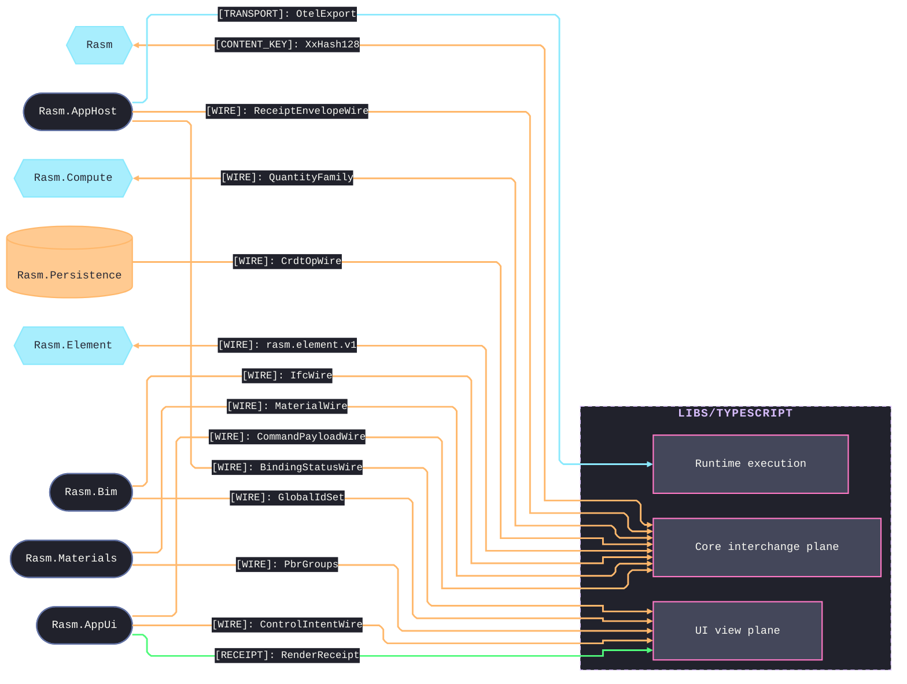

# [TYPESCRIPT_BRANCH_ARCHITECTURE]

`libs/typescript` in dependency waves — capability domains, acyclic with `core` at the base. Wire decode is the core interchange plane's boundary concern, never the branch center; deployment (`iac`) is the plane-distinct citizen outside the runtime graph; dev infrastructure lives under `tests/` (`tests/contracts/`, `tests/typescript/`), never the branch. Data-spine law is `dataflow-system.md`.

## [01]-[DOMAIN_MAP]

```text codemap
libs/typescript/
├── core/       # The acyclic branch law every folder composes — one authority per cross-language concept
├── security/   # Identity and custody, stateless behind port Tags satisfied downstream
├── data/       # The durable-persistence plane and record of truth; a backend is a guarantee row
├── runtime/    # The execution substrate across both process planes and the browser condition
├── ui/         # The browser product surface; viewer the spatial second Nx project, render-only
└── iac/        # The deploy plane outside the runtime graph; nothing imports it at runtime
```

## [02]-[SEAMS]



Every C#-minted family decodes exactly once through the core interchange codec registry; the `ui` edges name where the decoded landings materialize. TS consumes the GLB tessellation rail through the C#-owned wire; no TS↔Python seam exists. Folder-level seam rows live in each folder's `[02]-[SEAMS]` and mirror the csharp endpoint files verbatim.

## [03]-[DEPENDENCY_DIRECTION]

Dependency flows strictly downward through the waves — W0 `core`, W1 `security`, W2 `data`, W3 `runtime`, W4 `ui`/`iac`. Permitted edges are the whole import law:

| [INDEX] | [FROM]     | [MAY_IMPORT]               | [NOTES]                                                                               |
| :-----: | :--------- | :------------------------- | :------------------------------------------------------------------------------------ |
|  [01]   | `core`     | (nothing)                  | Runs identically under node, bun, and the browser; imported by every runtime folder   |
|  [02]   | `security` | `core`                     | State lives behind port Tags; the folder never imports `data`                         |
|  [03]   | `data`     | `core`, `security`         | The one `data → security` edge: `journal/retain` Shredder + `lane/tenant` TenantScope |
|  [04]   | `runtime`  | `core`, `security`, `data` | Both process planes; the browser condition is the same package, never a sibling       |
|  [05]   | `ui`       | `core`, `runtime`          | `viewer` is a second Nx project inside the folder with the same edge set              |
|  [06]   | `iac`      | `core`, `data`             | Type/value reads only (`DashboardModel`, `Alert`, `Slo.Objective`, `Pg`)              |

Port satisfaction happens at app composition, never as an upward import: every port Tag a folder declares binds to a downstream folder's Layer at the composition root, so a stateless upper folder never reaches up for its dependency. One value crosses back: typed `StackOutputs.sharding` read by `runtime` `ShardingConfig.layerFromEnv` — an env fact, never an import.
