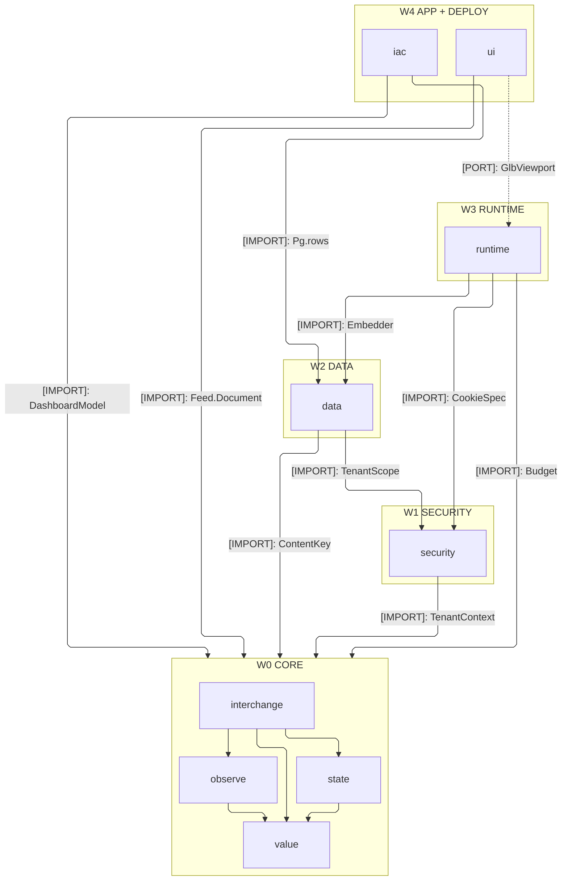
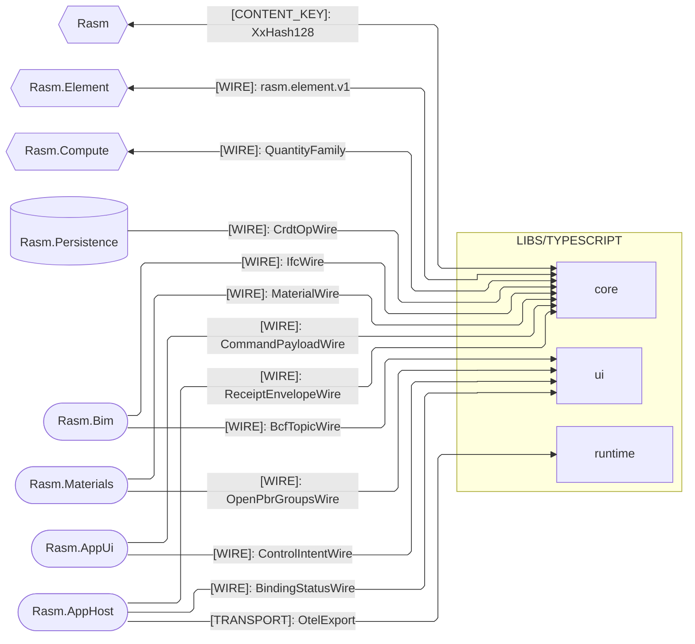

# [TYPESCRIPT_BRANCH_ARCHITECTURE]

`libs/typescript` in dependency waves — capability domains, acyclic with `core` at the base. Wire decode is the core interchange plane's boundary concern, never the branch center; deployment (`iac`) is the plane-distinct citizen outside the runtime graph; dev infrastructure lives under `tests/` (`tests/contracts/`, `tests/typescript/`), never the branch. Data-spine law is `dataflow-system.md`.

## [01]-[DOMAIN_MAP]

```text codemap
libs/typescript/
├── core/       # The acyclic branch law every folder composes — one authority per cross-language concept
├── security/   # Identity and custody, stateless behind port Tags satisfied downstream
├── data/       # The durable-persistence plane and record of truth; a backend is a guarantee row
├── runtime/    # The execution substrate across both process planes and the browser condition
├── ui/         # The browser product surface; viewer the spatial second Nx project, render-only
└── iac/        # The deploy plane outside the runtime graph; nothing imports it at runtime
```

## [02]-[STRATA]

- W0 `core` — imports nothing and runs identically under node, bun, and the browser; `value` roots the interior — `state` is pure algebra over it, `interchange` the one keyed-decode registry every C#-minted wire family lands on, `observe` composing the same floor — and every runtime folder composes it.
- W1 `security` — composes core alone (`TenantContext`); every stateful obligation is a port Tag a downstream folder satisfies, and the folder never imports `data`.
- W2 `data` — composes core (`ContentKey`) and security's one edge (`journal/retain` Shredder, `lane/tenant` TenantScope); a backend is a semantic-guarantee row.
- W3 `runtime` — composes core, security, and data (`Budget`, `CookieSpec`, `Embedder`) across both process planes; the browser condition is the same package, never a sibling.
- W4 `ui` + `iac` — `ui` imports core alone (`Feed.Document`) and reaches runtime only through its declared `GlbViewport` port and atom-bridge bindings the app root satisfies, `viewer` a second Nx project under the same law; `iac` composes core and data as type/value reads (`DashboardModel`, `Pg`), plane-distinct outside the runtime graph.

Port satisfaction happens at app composition, never as an import: every port Tag a folder declares binds to another folder's Layer at the composition root — `security` ports fill from `data`, `ui`'s `GlbViewport` fills from runtime `Depot` arrivals — so no folder reaches across for its dependency. One value crosses back: typed `StackOutputs.sharding` read by `runtime` `ShardingConfig.layerFromEnv` — an env fact, never an import.



## [03]-[SEAMS]



Every C#-minted family decodes once through the core interchange codec registry: `Core` edges freeze the wire spelling verbatim from the owning C# endpoint file; `ui` edges name the decoded landing materializing there. TS consumes the GLB tessellation rail through the C#-owned wire; no TS↔Python seam exists.

Companion contracts (`CapabilityDescriptor`, `DegradationLevel`, `SnapshotHeader`, `GeometryResidencyWire`, `EvidenceTimelineWire`, `RenderReceipt`, `BcfViewpointWire`, `DiffWire`, `GeoFeatureWire`, `CoercedValueWire`, `WriteReceiptWire`, `LayoutConstraintWire`, `CommandGateWire`, `BenchmarkClaimWire`, `HostFingerprintWire`) fold to the folder `[03]-[SEAMS]` rows, mirrored verbatim under their folder-registered kinds.

## [04]-[ADMISSION_POLICY]

One workspace manifest (`pnpm-workspace.yaml`) owns package admission and version bounds; `viewer` is the second Nx project inside `ui` carrying the same edge set, and dev infrastructure stays under `tests/`, never the branch. Installation rationale stays in the manifest; folder pages name capability, entrypoints, boundaries, and exclusions.
