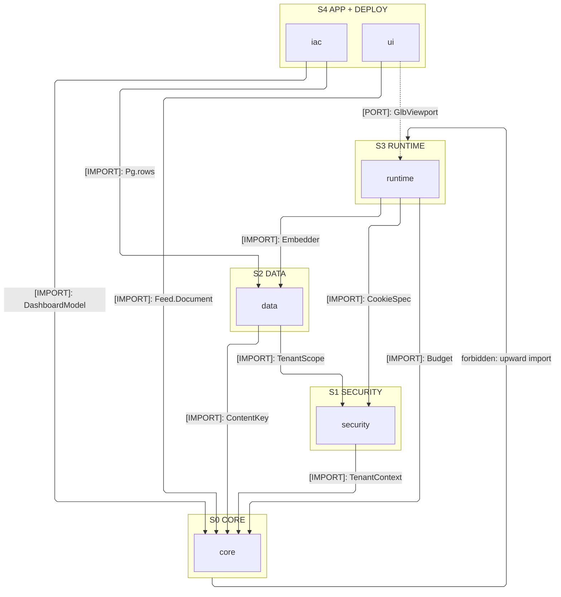
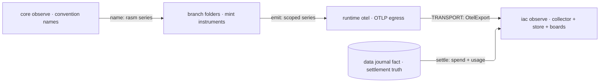

# [TYPESCRIPT_BRANCH_ARCHITECTURE]

`libs/typescript` in dependency strata — capability domains, acyclic with `core` at the base. Wire decode is the core interchange plane's boundary concern, never the branch center; deployment (`iac`) is the plane-distinct citizen outside the runtime graph.

## [01]-[DOMAIN_MAP]

```text codemap
libs/typescript/
├── core/       # The acyclic branch law every folder composes — one authority per cross-language concept
├── security/   # Identity and custody, stateless behind port Tags satisfied downstream
├── data/       # The durable-persistence plane and record of truth; a backend is a guarantee row
├── runtime/    # The execution substrate across both process planes and the browser condition
├── ui/         # The browser product surface; viewer the spatial second Nx project, render-only
└── iac/        # The deploy plane outside the runtime graph; nothing imports it at runtime
```

## [02]-[STRATA]

- S0 `core` — imports nothing and runs identically under node, bun, and the browser; every runtime folder composes it.
- S1 `security` — composes core alone (`TenantContext`); every stateful obligation is a port Tag a downstream folder satisfies; never imports `data`.
- S2 `data` — composes core (`ContentKey`) and security (`Shredder`, `TenantScope`); a backend is a semantic-guarantee row.
- S3 `runtime` — composes core (`Budget`), security (`CookieSpec`), and data (`Embedder`); the browser condition rides the same package.
- S4 `ui` — imports core alone (`Feed.Document`); reaches runtime only through the `GlbViewport` port and the atom-bridge bindings.
- S4 `iac` — composes core and data as type/value reads (`DashboardModel`, `Pg`), plane-distinct outside the runtime graph.

Port satisfaction happens at app composition, never as an import: every port Tag a folder declares binds to another folder's Layer at the composition root — `security` ports fill from `data`, `ui`'s `GlbViewport` fills from runtime `Depot` arrivals — so no folder reaches across for its dependency. One value crosses back: typed `StackOutputs.sharding` read by `runtime` `ShardingConfig.layerFromEnv` — an env fact, never an import.



## [03]-[SEAMS]


Every C#-minted family decodes once through the core interchange codec registry: `Core` edges freeze the wire spelling verbatim from the owning C# endpoint file, and `ui` edges name the decoded landing materializing there. Schema drift across these endpoints is a graded boot verdict at the core interchange contract gate — an additive change admits decode, a breaking change refuses as typed evidence — never a runtime decode failure. TS consumes the GLB tessellation rail through the C#-owned wire; no TS↔Python seam exists — both peers couple only to the C# wire.

Companion contract families beyond the diagrammed set fold to the folder `[03]-[SEAMS]` registries, mirrored verbatim under their folder-registered kinds; a new family lands as one folder seam row, never a branch edge.

## [04]-[INTERNAL]

```mermaid
---
config:
  layout: elk
  flowchart:
    curve: linear
    padding: 25
---
flowchart LR
    accTitle: TypeScript branch data spine
    accDescr: Wire octets decode once at core interchange, fold through the state algebra, persist in the data journal, and serve to the ui surfaces.
    Octets([C#-minted wire octets])
    Decode[core interchange · decode once]
    Vocab[core value + state · owned vocabulary]
    Journal[(data journal · record of truth)]
    Read[data read · fold lanes]
    Serve[runtime serve · front door]
    Surface[ui surfaces]
    Octets e1@-->|"decode: family + octets"| Decode
    Decode e2@-->|"land: decoded shape"| Vocab
    Vocab e3@-->|"append: event"| Journal
    Journal e4@-->|"fold: projection"| Read
    Read e5@-->|"publish: reactivity key"| Serve
    Serve e6@-->|"serve: resumable feed"| Surface
```



One crossing law rules the spine: `core` mints each cross-cutting primitive exactly once — content identity, clock, quantity, app identity — and every keying or stamping site delegates to the one mint. Wire octets enter at one boundary, the core interchange registry, each family landing whole into an owned vocabulary or a wire-owned decoded shape, so nothing downstream re-decodes. One fold algebra serves two altitudes — in-memory through the core state plane, durable through the data read lane — with wire-minted and app-authored families as instances of one op vocabulary.

Order crosses on one clock law with one `AsOf` replay coordinate; tenancy crosses as one scope value derived from the one app identity, pinned by the single tenant write path. Fault altitudes stay three — the decode rail reconstructs C#-minted fault detail, each folder raises its own local typed rail, and the runtime serve plane alone projects outward. Exact per-stage wiring lives on the owning implementation pages.



Each folder mints its own instruments against the core observe convention — the JS-side name source holding name-level parity with the OpenTelemetry spec, never a shared artifact — and the runtime otel plane alone laces the egress, so telemetry leaves the branch opaque on the `[TRANSPORT]` seam. Boards and retention are deploy-plane facts `iac` realizes from the core-encoded models; the data journal fact stream settles spend and usage, and the OTel series stay its lossy health projection keyed by the same identity.

## [05]-[ROUTING]

| [INDEX] | [CHANGE]             | [OWNER_SURFACE]                                     | [SHAPE_OF_THE_EDIT]                                       |
| :-----: | :------------------- | :-------------------------------------------------- | :-------------------------------------------------------- |
|  [01]   | event type           | the app's `Schema.TaggedClass` family               | one tagged case + its upcast step                         |
|  [02]   | event version        | `data/journal/evolve` upcast chains                 | one version step; the log is never rewritten              |
|  [03]   | wire family          | `core/interchange/codec` registry                   | one census row + one landing row                          |
|  [04]   | projection           | `data/read/fold` lane rows                          | one lane row at its staleness budget                      |
|  [05]   | retrieval lane       | `data/read/search` roster                           | one lane row                                              |
|  [06]   | pg capability        | `data/lane/postgres` matrix + `iac/kube` image      | one probe row + one image fact                            |
|  [07]   | retention class      | `data/journal/retain` policy table                  | one class row                                             |
|  [08]   | fold consumer        | `core/state/fold` plan instances                    | one op-vocabulary instance                                |
|  [09]   | tenancy shape        | `data/lane/tenant` cases                            | one scope case; isolation stays a scope value             |
|  [10]   | fanout engine        | `runtime/net/pubsub` engine rows                    | one engine row; the port stays engine-blind               |
|  [11]   | coordination engine  | `runtime/net/coordinate` engine rows                | one engine row on the `Accord` port; reads stay versioned |
|  [12]   | metric or instrument | owning folder mint site + `core/observe/convention` | one instrument row under one convention name              |
|  [13]   | dashboard pack       | `core/observe/board` pack rows                      | one pack row realized by `iac/operate/observe`            |
|  [14]   | hook point           | `core/observe/tap` rows + owning registry           | one name row + one registry row; a modality widens a row  |

## [06]-[BOUNDARIES]

- Folders are capability domains named for their own concern; no folder name mirrors a sibling C# or Python package.
- Each C#-minted receipt family lands as its own typed decode; per-verb receipt schemas keep the family typed end to end.
- IFC and BCF vocabulary lives only at the codec registry landings and the viewer marks; every consumer reads the decoded landing.

## [07]-[ADMISSION_POLICY]

One workspace manifest (`pnpm-workspace.yaml`) owns package admission and version bounds; `viewer` is the second Nx project inside `ui` carrying the same edge set, and dev infrastructure stays under `tests/`, never the branch. Installation rationale stays in the manifest; folder pages name capability, entrypoints, boundaries, and exclusions.
