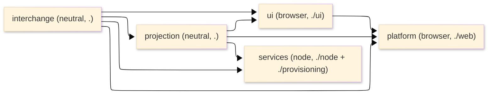

# [TYPESCRIPT_BRANCH_ARCHITECTURE]

The cross-folder atlas for the TypeScript branch — the source tree projected over the five packages in dependency order, the publication and dependency DAG, and the intra-TypeScript cross-folder seams. Per-folder owner registries live in each folder's `ARCHITECTURE.md` (the single owner-state surface per folder); this page carries no `[OWNER_REGISTRY]`. Mechanics live in the finalized per-folder pages; this page is the branch-level source-of-truth for layout, build order, dependency direction, and the seams that cross two folders.

## [1]-[SOURCE_TREE]

The flat folder layout IS the build order: `interchange` is the inbound dependency root (descriptor codegen edge → transport → rails → gateway), then `projection` folds the decoded shapes, then `ui`/`platform`/`services` consume the interior. Each folder holds its `.ts` module leaves directly at its root (no `src/` nesting), its `.planning/` charter and pages, and its `ARCHITECTURE.md`/`FEATURES.md`/`TASKLOG.md`. The branch root carries no branch-local config: the workspace catalog, the centralized tsconfig strictness floor and solution references, the folder-stratum module-boundary/eslint fence, and the vitest project set are centralized at the monorepo root; the per-package `package.json` subpath `exports` and minimal config land at implementation time.

```text codemap
libs/typescript/                          # branch root; flat package folders; no src/ nesting; config centralized at the monorepo root
│
├── interchange/                          # [1] stratum neutral; the "." export; inbound dependency root — wire boundary
│   ├── buf.gen.yaml + gen/               #   committed FileDescriptorSet input + protoc-gen-es output — transport#CODEGEN_TOOLING
│   ├── transport.ts                      #   WireTransport, WireClients, TransportCapabilityWire, ArtifactFrameStreaming, CapabilitySdk
│   ├── codec-rails.ts                    #   DecodeRail/EncodeRail, SchemaRefinement, GeometryRail, ArtifactFrameRail, FaultDetailRail
│   ├── gateway-and-quarantine.ts         #   QuarantineFold, CONTRACT_INVENTORY, CommandGateway, IntentRegistry
│   └── index.ts                          #   the single neutral "." export
│
├── projection/                           # [2] stratum neutral; reached through the "." barrel; transport-free folds; @connectrpc/* banned
│   ├── fold-algebra.ts                   #   StreamPolicy, keyedFold, RuntimeFeed/HealthStore/SnapshotFeed/ProgressStore, WindowKind/windowFold, ConflictPresenceState/conflictPresenceFold
│   ├── envelope-and-evidence.ts          #   ReceiptStore/EvidenceFeed/AvailabilityStore, the envelope carrier, the SkewBand HLC confidence-interval fold
│   └── index.ts                          #   the projection aggregation re-exported under "."
│
├── services/                             # [3] stratum node; the "./node" + "./provisioning" entries — durable/rpc/persistence/provisioning
│   ├── durable-execution.ts              #   WorkflowOwner/ActivityOwner/ClusterEngine, AiProvider literal, AgentJournal, Resilience, SagaOwner
│   ├── persistence.ts                    #   SqlBoundary, EntityRegistry, TenantScope RLS, WorkQueue/EventJournal/Notifications, AssetTransfer, FeatureFlags
│   ├── hybrid-search.ts                  #   HybridSearch fused semantic+lexical+trigram+phonetic weighted-rank owner
│   ├── internal-rpc.ts                   #   InternalRpc RpcGroup, WorkflowProxy, RunnerBackplane, ScheduledWork
│   ├── provisioning/                     #   ./provisioning subpath: TierStack, AutomationDriver, StackOutputs, SecretResolver/PolicyGuard, ObservabilityStack
│   ├── node.ts                           #   the "./node" entry — durable cluster + runner + provisioning compose
│   └── index.ts                          #   the services aggregation
│
├── ui/                                   # [4] stratum browser; the "./ui" UI library entry; MUST NEVER import ../platform
│   ├── binding.ts                        #   AtomBinding, DeepLinkBinding, url-state, OfflineState, UndoStack, dev inspector
│   ├── render-surfaces.ts                #   EvidenceTimelineRoute/BenchmarkRoute/CollectorPanel, GeoSeriesSurface/GeoSeriesLayer, GlbViewport (BLOCKED)
│   ├── component-system/                 #   the interaction-role vocabulary owner-block + theme tokens + CSS-var sync
│   └── index.ts                          #   the "./ui" entry — the standalone-consumable UI library surface
│
└── platform/                            # [5] stratum browser; the "./web" SPA entry; may import ui/, never the reverse
    ├── browser.ts                        #   the "./web" entry — CompositionRoot composes ui+interchange+projection into one Layer graph and runtime
    ├── host-runtime.ts                   #   CompositionRoot, BrowserPlatform, AuthSession (arctic), RuntimeConfig
    ├── platform-substrate.ts             #   SelfTelemetry, MetricRegistry (WebSdk), BuildPipeline, DecodeWorkerPool, LocalPersistence
    ├── routing-navigation.ts             #   AppRouter (Schema.Literal route-key axis), NavigationGuard, RouteParamCodec (nuqs)
    ├── service-worker.ts                 #   ServiceWorkerHost, CacheStrategy axis, BackgroundSyncReplay
    ├── error-boundary.ts                 #   CrashTelemetry, ErrorBoundaryBinding (react-error-boundary), CrashReport
    ├── feature-flags-config.ts           #   RemoteConfig (FlagSet fold), FlagKey axis, FlagEvaluation Match dispatch
    ├── web-vitals.ts                     #   PerformanceBudget (PerformanceObserver capture), VitalMetric axis, BudgetThreshold Record
    └── index.ts                          #   the platform aggregation; ./web resolves to browser.ts
```

The build order is the folder order: the `interchange` descriptor codegen edge emits `gen/` before any module compiles; `transport.ts` precedes the rails because `DecodeRail`/`ArtifactFrameRail` read the generated descriptor registry; `gateway-and-quarantine.ts` lands last. `projection` folds the decoded shapes interchange exports. `ui` subscribes to the projection stores and emits through the interchange gateway; `platform` composes `ui` plus interchange/projection into the SPA root; `services` composes interchange/projection plus its own durable/runner/SQL/RPC/provisioning owners. A page whose owner set spans a real taxonomy or a two-altitude split is an owner-block sub-folder (`ui/component-system/`, `services/provisioning/`); every other page transcribes to one flat module.

## [2]-[DEPENDENCY_DAG]

Dependencies flow inward from the publication entries toward the wire boundary. The branch publishes one subpath per package entry; the bundle is tree-shaken per subpath from the folder graph, so the browser bundle never carries `@effect/cluster`/`@effect/sql-pg`/`@pulumi/*`/`@effect/platform-node` and the node bundle never carries `@effect/platform-browser`/`react`/`maplibre-gl`/`@deck.gl/*`/`arctic`/`workbox-*`. Publication: `interchange`/`projection` are the neutral interior under `.`; `ui` is `./ui` (standalone UI library); `platform` is `./web` (SPA entry); `services` is `./node` + `./provisioning` (the deploy-time `@pulumi/*` closure isolated behind `./provisioning`).

| [INDEX] | [PACKAGE]     | [DEPENDS_ON]                          | [DEPENDED_BY]                          |
| :-----: | :------------ | :------------------------------------ | :------------------------------------- |
|   [1]   | `interchange` | (none — inbound root, descriptor set) | `projection`, `ui`, `platform`, `services` |
|   [2]   | `projection`  | `interchange`                         | `ui`, `platform`, `services`           |
|   [3]   | `services`    | `interchange`, `projection`           | (none — node entry leaf)               |
|   [4]   | `ui`          | `interchange`, `projection`           | `platform`                             |
|   [5]   | `platform`    | `interchange`, `projection`, `ui`     | (none — SPA entry leaf)                |



The only cycle-shaped edge is the read-gate-then-fold pair: the interchange `CommandGateway` reads the projection `AvailabilityStore` fold as a dial-time gate and writes back the command receipt — an intra-neutral read, not a tier reversal, with the dialing gateway resident in the transport-owning folder so no browser transport leaks into the fold interior. The `platform` → `ui` edge is the one intra-browser dependency; the reverse import is the named browser-internal coupling defect.

## [3]-[SEAMS]

Intra-TypeScript cross-folder facts split by altitude: mechanics at the owning `pkg/page#CLUSTER`, consequence at the consuming `pkg/page#CLUSTER`. The eleven wire-contract source seams (the upstream-owned wire shape the rails transcribe) are NOT listed here — they route through the Tier-0 seam ledger; this table carries only the branch-authored cross-folder seams.

| [INDEX] | [SEAM]                       | [MECHANICS_AT]                                            | [CONSEQUENCE_AT]                                                              |
| :-----: | :--------------------------- | :------------------------------------------------------- | :--------------------------------------------------------------------------- |
|   [1]   | decoded vocabulary           | `interchange/codec-rails#CODEC_RAILS`                     | `projection/fold-algebra#FOLD_ALGEBRA` folds the decoded shapes               |
|   [2]   | geometry projection          | `interchange/codec-rails#CODEC_RAILS`                     | `ui/render-surfaces#RENDER_SURFACES` reads the `GeometryRail` GeoJSON          |
|   [3]   | artifact blob                | `interchange/codec-rails#CODEC_RAILS`                     | `ui/render-surfaces#GLB_VIEWPORT` reads the `ArtifactFrameRail` blob           |
|   [4]   | envelope payload             | `interchange/gateway-and-quarantine#CONTRACT_INVENTORY`   | `projection/envelope-and-evidence#ENVELOPE_AND_EVIDENCE` binds the carrier     |
|   [5]   | availability read gate       | `projection/envelope-and-evidence#ENVELOPE_AND_EVIDENCE`  | `interchange/gateway-and-quarantine#GATEWAY_AND_QUARANTINE` gates the dial     |
|   [6]   | stream reconnect policy      | `projection/fold-algebra#FOLD_ALGEBRA`                    | every fold composes the one `StreamPolicy`; the staleness value reads it       |
|   [7]   | auth credential stamp        | `platform/host-runtime#HOST_RUNTIME`                     | `interchange/transport#TRANSPORT_AND_CLIENTS` reads the live bearer token      |
|   [8]   | typed config provider        | `platform/host-runtime#HOST_RUNTIME`                     | transport base url, OIDC authority, OTLP endpoint, remote-config endpoint reads |
|   [9]   | off-main-thread reassembly   | `platform/platform-substrate#PLATFORM_SUBSTRATE`         | `interchange/codec-rails#CODEC_RAILS` `ArtifactFrameRail` stitch runs in the worker pool |
|  [10]   | background-sync redial drain | `platform/service-worker#SERVICE_WORKER`                 | `interchange/gateway-and-quarantine#GATEWAY_AND_QUARANTINE` drains the offline queue |
|  [11]   | crash telemetry sink         | `platform/error-boundary#ERROR_BOUNDARY`                 | `interchange/codec-rails#FAULT_FAMILY` reconstructs each uncaught fault arm     |
|  [12]   | platform composes ui         | `platform/host-runtime#HOST_RUNTIME`                     | `ui` library composed into the SPA root; `ui` → `platform` import is the defect |
|  [13]   | auth session view leaf       | `platform/host-runtime#HOST_RUNTIME`                     | `ui/binding#BINDING` surfaces the session value through the one `AtomBinding`   |
|  [14]   | navigation guard             | `platform/routing-navigation#ROUTING_NAVIGATION`         | gates on `platform/host-runtime#HOST_RUNTIME` auth + `projection` availability  |
|  [15]   | remote-config flag read      | `services/persistence#WORK_AND_SIGNALS`                  | `platform/feature-flags-config#FEATURE_FLAGS_CONFIG` consumes the flag vocabulary |
|  [16]   | web-vitals instrument feed   | `platform/web-vitals#WEB_VITALS`                        | `platform/platform-substrate#PLATFORM_SUBSTRATE` `MetricRegistry` instrument rows |
|  [17]   | runner placement substrate   | `services/internal-rpc#RUNNER_AND_SCHEDULING`           | `services/durable-execution#DURABLE_EXECUTION` layers `WorkflowEngine` over the rows |
|  [18]   | stack topology contract      | `services/provisioning#PROVISIONING`                    | `SqlBoundary` DSN, `ObservabilityStack` OTLP, SPA-host origin consume `StackOutputs` |
