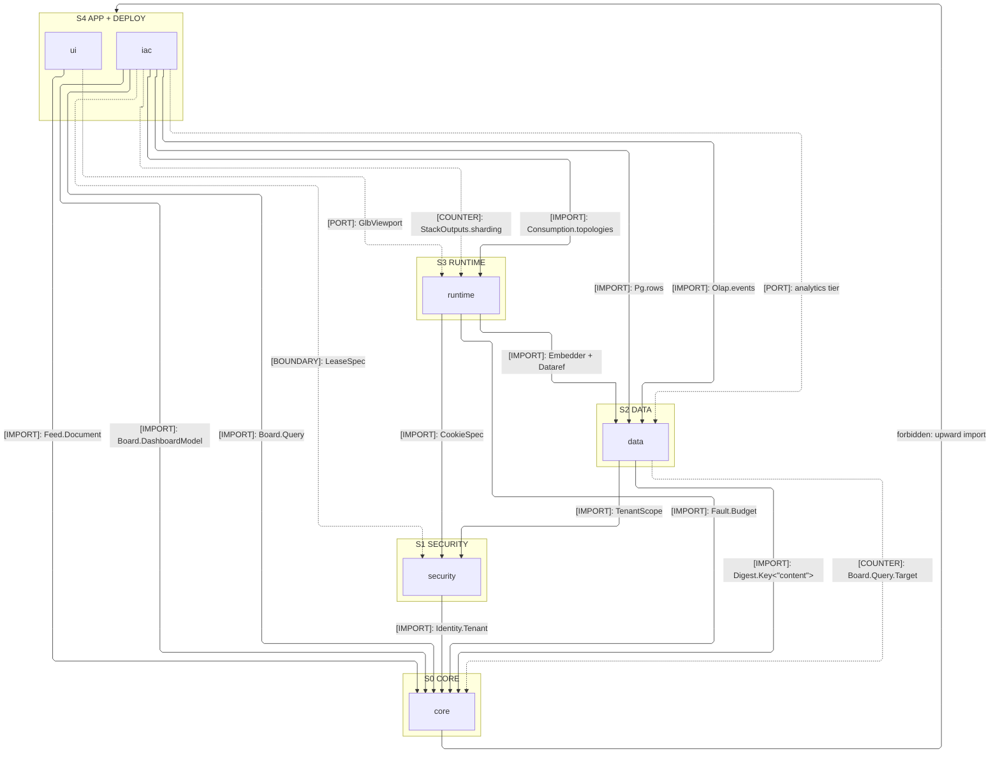
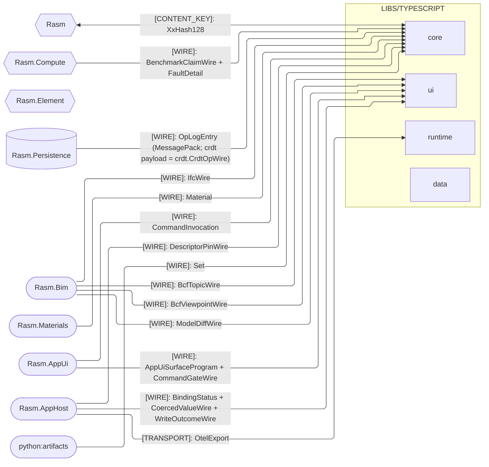

# [TYPESCRIPT_BRANCH_ARCHITECTURE]

`libs/typescript` in dependency strata: capability domains, acyclic with `core` at the base. Wire decode is the core interchange plane's boundary concern, never the branch center; deployment (`iac`) is the plane-distinct citizen outside the runtime graph.

## [01]-[DOMAIN_MAP]

```text
libs/typescript/
├── core/       # One authority per cross-language concept — decode and vocabulary floor, zero serving or persistence
├── security/   # Crypto mint, authn ceremonies, and access law behind stateless port Tags satisfied downstream
├── data/       # Journal record of truth, byte planes, and read folds; engine names never leak upward
├── runtime/    # Serve door, work economy, otel egress, and provider tables across process and browser planes
├── ui/         # Two Nx projects — the app surface and the render-only spatial viewer
└── iac/        # Pulumi programs realizing StackSpec into capability-admitted deployments; plane-distinct
```

## [02]-[STRATA]

- S0 `core` — imports nothing and runs identically under node, bun, and the browser; every runtime folder composes it.
- S3→S0 `runtime` hands `core` the scoped Node adapter and credential interceptor as values through `Invoke.Dial`; core owns the pair selection.
- S1 `security` — composes core alone (`Identity.Tenant`); downstream folders satisfy every stateful port Tag; never imports `data`.
- S2 `data` — composes core (`Digest.Key`) and security (`Shredder`, `TenantScope`); a backend is a guarantee row.
- S3 `runtime` — composes core (`Fault.Budget`), security (`CookieSpec`), and data (`Embedder`, `Dataref`); browser rides the same package.
- S4 `ui` — imports core alone (`Feed.Document`); reaches runtime only through the ports it declares and the atom-bridge bindings.
- S4 `iac` — composes core, data, and runtime as reads and decodes `security`'s `LeaseSpec` as data, plane-distinct outside the runtime graph.

Port satisfaction happens at app composition, never as an import: every port Tag a folder declares binds to another folder's Layer at the composition root, with `security` ports filling from `data` and `ui`'s `GlbViewport` filling from runtime's browser depot arrivals. Values cross back where an import may not, each a datum the lower stratum consumes: `iac` hands `runtime` typed `StackOutputs.sharding` and publishes the analytics-tier door `data` binds, and `data` hands the core board renderer a `Board.Query.Target` minted off the core-owned type.


```mermaid
---
config:
  layout: elk
  flowchart:
    curve: linear
    padding: 25
---
flowchart TB
    accTitle: TypeScript branch import strata
    accDescr: Import strata toward the core floor; dashed edges carry ports and counter-edge values rather than imports.
    subgraph S4["S4 APP + DEPLOY"]
        Ui[ui]
        Iac[iac]
    end
    subgraph S3["S3 RUNTIME"]
        Runtime[runtime]
    end
    subgraph S2["S2 DATA"]
        Data[data]
    end
    subgraph S1["S1 SECURITY"]
        Security[security]
    end
    subgraph S0["S0 CORE"]
        Core[core]
    end
    Ui e1@-->|"[IMPORT]: Feed.Document"| Core
    Ui e2@-.->|"[PORT]: GlbViewport"| Runtime
    Iac e3@-->|"[IMPORT]: Board.DashboardModel"| Core
    Iac e4@-->|"[IMPORT]: Board.Query"| Core
    Iac e5@-->|"[IMPORT]: Pg.rows"| Data
    Iac e17@-->|"[IMPORT]: Olap.events"| Data
    Iac e6@-->|"[IMPORT]: Consumption.topologies"| Runtime
    Iac e7@-.->|"[BOUNDARY]: LeaseSpec"| Security
    Iac e8@-.->|"[COUNTER]: StackOutputs.sharding"| Runtime
    Iac e9@-.->|"[PORT]: analytics tier"| Data
    Runtime e10@-->|"[IMPORT]: Fault.Budget"| Core
    Runtime e11@-->|"[IMPORT]: CookieSpec"| Security
    Runtime e12@-->|"[IMPORT]: Embedder + Dataref"| Data
    Data e13@-->|"[IMPORT]: Digest.Key&lt;&quot;content&quot;&gt;"| Core
    Data e14@-->|"[IMPORT]: TenantScope"| Security
    Data e15@-.->|"[COUNTER]: Board.Query.Target"| Core
    Security e16@-->|"[IMPORT]: Identity.Tenant"| Core
    Core f1@-->|"forbidden: upward import"| S4
```

## [03]-[CONTRACTS]


```mermaid
---
config:
  layout: elk
  flowchart:
    curve: linear
    padding: 25
---
flowchart LR
    accTitle: TypeScript external contract registry
    accDescr: TypeScript exchanges kinded wires and the backend contract with .NET packages and the neutral Python artifact producer.
    subgraph ts[LIBS/TYPESCRIPT]
        Core[core]
        Data[data]
        Runtime[runtime]
        Ui[ui]
    end
    Rasm{{Rasm}}
    Compute{{Rasm.Compute}}
    Element{{Rasm.Element}}
    Persistence[(Rasm.Persistence)]
    Bim([Rasm.Bim])
    Materials([Rasm.Materials])
    AppUi([Rasm.AppUi])
    AppHost([Rasm.AppHost])
    Artifacts([python:artifacts])
    Rasm e1@<-->|"[CONTENT_KEY]: XxHash128"| Core
    Compute e19@-->|"[WIRE]: BenchmarkClaimWire + FaultDetail"| Core
    Persistence e4@-->|"[WIRE]: OpLogEntry (MessagePack; crdt payload = crdt.CrdtOpWire)"| Core
    Bim e6@-->|"[WIRE]: IfcWire"| Core
    Materials e7@-->|"[WIRE]: Material"| Core
    AppUi e8@-->|"[WIRE]: CommandInvocation"| Core
    Bim e12@-->|"[WIRE]: BcfTopicWire"| Ui
    Bim e18@-->|"[WIRE]: BcfViewpointWire"| Ui
    Bim e15@-->|"[WIRE]: ModelDiffWire"| Ui
    AppUi e11@-->|"[WIRE]: AppUiSurfaceProgram + CommandGateWire"| Ui
    AppHost e10@-->|"[WIRE]: BindingStatus + CoercedValueWire + WriteOutcomeWire"| Ui
    AppHost e9@-->|"[TRANSPORT]: OtelExport"| Runtime
    AppHost e16@-->|"[WIRE]: DescriptorPinWire"| Core
    Artifacts e17@-->|"[WIRE]: Set"| Core
```

Every contract family decodes once at the core interchange codec registry: `core` edges freeze the wire spelling from the owning endpoint file, and `ui` and `data` edges name decoded shapes landed there. Backend is the composition exception: every persistence branch mints one generated contribution, then the data composition owner decodes foreign peers and merges the deployment generation.

Contract families beyond the diagrammed set fold to the folder `[03]-[CONTRACTS]` registries, mirrored verbatim under their folder-registered kinds; a new family lands as one folder boundary row, never a branch edge.

## [04]-[INTERNAL]


```mermaid
---
config:
  layout: elk
  flowchart:
    curve: linear
    padding: 25
---
flowchart LR
    accTitle: TypeScript branch data spine
    accDescr: Wire octets decode once at core interchange, fold through the state algebra, persist in the data journal, and serve to the ui surfaces.
    Octets([contract-conforming wire octets])
    Decode[core interchange · decode once]
    Vocab[core value + state · owned vocabulary]
    Journal[(data journal · record of truth)]
    Read[data read · fold lanes]
    Serve[runtime serve · front door]
    Surface[ui surfaces]
    Octets e1@-->|"decode: family + octets"| Decode
    Decode e2@-->|"land: decoded shape"| Vocab
    Vocab e3@-->|"append: event"| Journal
    Journal e4@-->|"fold: projection"| Read
    Read e5@-->|"publish: reactivity key"| Serve
    Serve e6@-->|"serve: resumable feed"| Surface
```

One crossing law rules the spine: `core` mints `Digest.Key`, `Clock`, `Quantity`, and `Identity.App` exactly once, and every keying or stamping site delegates to that one mint. Wire octets enter at one boundary, the core interchange registry, each family landing whole into an owned vocabulary or a wire-owned decoded shape, so nothing downstream re-decodes. One fold algebra serves two altitudes, in-memory through the core state plane and durable through the data read lane, with wire-decoded and app-authored families as instances of one op vocabulary.

Order crosses on `Clock.Hlc` with one `Fold.AsOf` replay coordinate; tenancy crosses as `Identity.Tenant.scope`, pinned by the single tenant write path and carried under `Convention.rasm.tenant`. Fault altitudes stay three: interchange reconstructs peer detail, folders raise local faults, and runtime alone projects outward. Exact per-stage wiring lives on the owning pages.


```mermaid
---
config:
  layout: elk
  flowchart:
    curve: linear
    padding: 25
---
flowchart LR
    accTitle: TypeScript branch observability spine
    accDescr: Effect outcomes and explicit domain events remain truth; runtime projects OTel signals, and the data tier supplies Board.Query targets.
    Operations[branch operations · Effect success/error]
    Settlement[terminal fold · Exit]
    Events[domain owners · explicit events]
    Tap[core observe · in-process hooks]
    Names[core observe · convention names]
    Board[core observe · board query owner]
    Mint[branch folders · instrument mints]
    Egress[runtime otel · OTLP egress]
    Deploy[iac/operate/observe · Lgtm + Boards + Dev]
    Fact[(data journal fact · settlement truth)]
    Tier[(StackOutputs.analytics · tier rows)]
    Operations e8@-->|"settle: Effect.onExit"| Settlement
    Operations e9@-->|"publish: domain event"| Events
    Events e10@-->|"observe: local extension"| Tap
    Settlement e11@-->|"project: outcome"| Mint
    Events e12@-->|"project: event"| Mint
    Names e1@-->|"name: rasm series"| Mint
    Mint e2@-->|"emit: scoped series"| Egress
    Egress e3@-->|"TRANSPORT: OtelExport"| Deploy
    Events e13@-->|"append: audit + meter"| Fact
    Fact e4@-->|"project: spend + usage"| Deploy
    Deploy e5@-->|"[PORT]: StackOutputs.analytics"| Tier
    Fact e6@-.->|"rebuild: derived plane"| Tier
    Tier e7@-->|"[SHAPE]: Board.Query.Target"| Board
```

Operations return their canonical value or typed fault on `Effect`; `Effect.onExit` observes the settled `Exit` once at the instrumentation boundary. Command lifecycles publish `Evidence.Outcome` as CloudEvent data, state machines publish `Transition.Macro`, and `Tap` carries in-process extension observation. `runtime/otel` alone owns egress, and each folder mints instruments against core conventions.

One folder owns each signal concept two folders both spell, whichever holds the platform surface producing it, and publishes the event its peer observes. Domain results and journal facts retain whatever OTel leaves unmeasured.

`Lgtm`, `Boards`, and `Dev` realize collector, store, and board topology at `iac/operate/observe`; the data journal fact stream settles spend and usage, and OTel series remain its lossy health projection keyed by the same identity. `StackOutputs.analytics` binds the tier `data` custodies, derived and rebuildable from the journal, and the one core `Query` owner renders it under a target parameter.

## [05]-[ROUTING]

| [INDEX] | [CHANGE]              | [OWNER_SURFACE]                                     | [SHAPE_OF_THE_EDIT]                                       |
| :-----: | :-------------------- | :-------------------------------------------------- | :-------------------------------------------------------- |
|  [01]   | event type            | the app's `Schema.TaggedClass` family               | one tagged case; the family's own digest moves            |
|  [02]   | event shape           | `data/journal/evolve` generation identity           | one re-mint; the log carries one generation whole         |
|  [03]   | wire family           | `core/interchange/codec` registry                   | one census row + one landing row                          |
|  [04]   | projection            | `data/read/fold` lane rows                          | one lane row at its staleness budget                      |
|  [05]   | retrieval lane        | `data/read/search` roster                           | one lane row                                              |
|  [06]   | pg capability         | `data/lane/postgres` matrix + `iac/kube` image      | one probe row + one image fact                            |
|  [07]   | retention class       | `data/journal/retain` policy table                  | one class row                                             |
|  [08]   | fold consumer         | `core/state/fold` plan instances                    | one op-vocabulary instance                                |
|  [09]   | tenancy shape         | `data/lane/tenant` cases                            | one scope case; isolation stays a scope value             |
|  [10]   | fanout engine         | `runtime/net/pubsub` engine rows                    | one engine row; the port stays engine-blind               |
|  [11]   | coordination engine   | `runtime/net/coordinate` engine rows                | one engine row on the `Accord` port; reads stay versioned |
|  [12]   | metric or instrument  | owning folder mint site + `core/observe/convention` | one instrument row under one convention name              |
|  [13]   | dashboard pack        | `core/observe/board` pack rows                      | one pack row realized by `iac/operate/observe`            |
|  [14]   | hook point            | `core/observe/tap` rows + owning registry           | one name row + one registry row; a modality widens a row  |
|  [15]   | analytics tier        | `data/lane/olap` tier rows + `iac` spec axis        | one row answering the data tier floor                     |
|  [16]   | query render target   | `core/observe/board` `Board.Query.Target` arms      | one target arm; the algebra never forks                   |
|  [17]   | columnar query end    | `data/lane/olap` Flight SQL rows                    | one row on the one Flight plane                           |
|  [18]   | reliability indicator | `core/observe/slo` `Reliability` families           | one indicator, burn, severity, or panel row               |
|  [19]   | asset transform       | `data/object/asset` `TRANSFORM_ROWS` roster         | one engine-plane row; the fanout spine stays one          |
|  [20]   | embed block kind      | `ui/view/content` `Content.Block` roster            | one block row registered at the composition root          |
|  [21]   | anchor space          | `ui/view/presence` `Anchor.Space` rows              | one space row exported by the owning surface              |
|  [22]   | command legality      | `ui/view/overlay` `Overlay.Grant` rows              | one grant row + one needs column                          |

## [06]-[BOUNDARIES]

- IFC and BCF vocabulary lives only at the codec registry landings and the viewer marks; every consumer reads the decoded landing.

## [07]-[ADMISSION_POLICY]

One workspace manifest (`pnpm-workspace.yaml`) declares package admission and version bounds, and the architecture suite refuses the manifest departing from it; `viewer` is the second Nx project inside `ui` carrying the same edge set, and dev infrastructure stays under `tests/`, never the branch. Installation rationale stays in the manifest; folder pages name capability, entrypoints, boundaries, and exclusions.
