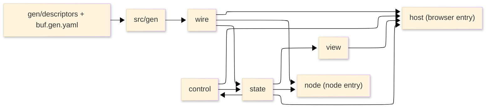

# [TYPESCRIPT_ARCHITECTURE_TREE]

The lib branch is one pnpm workspace package at `libs/typescript/<pkg>` with one publication root and a dual conditional entry — the browser SPA surface and the node execution surface — resolved by the package `exports` map, never two packages. This page is the planning atlas: the planned non-flat domain-folder source tree, the dependency direction across the domains, the buf descriptor pipeline placement, and the entry split that keeps node-only code out of the browser bundle. Mechanics live in the finalized domain pages; this atlas draws where each owner physically lands and how the folders depend, and it is re-derived from the finalized owner set each loop, never a one-time sketch.

The package name is fixed at stage [2.B] scaffolding and registered in the region ledger; `<pkg>` is the placeholder until then. Every leaf below is a domain-folder transcription unit annotated with the owners it holds and the owning page cluster; the folders group owners by domain axis exactly as the eight pages partition the concern, so the tree is the page set projected onto a file layout, not a second taxonomy.

## [1]-[SOURCE_TREE]

```text codemap
libs/typescript/<pkg>/
├── package.json                     # one name, catalog: references only, the dual conditional exports map
├── tsconfig.json                    # extends root tsconfig.base.json; a references row in the root solution
├── gen/
│   └── descriptors/                 # app-root-emitted FileDescriptorSet input — committed, never hand-copied .proto
├── buf.gen.yaml                     # the single-plugin codegen config — wire-consumption#CODEGEN_TOOLING
├── src/
│   ├── gen/                         # protoc-gen-es output: *_pb.ts, one GenService descriptor per service
│   ├── wire/
│   │   ├── transport.ts             # WireTransport, generated-client derivation — wire-contracts#TRANSPORT_AND_CLIENTS
│   │   ├── rails.ts                 # DecodeRail, GeometryRail, FaultDetailRail — wire-contracts#DECODE_RAILS
│   │   └── quarantine.ts            # QuarantineFold — wire-contracts#QUARANTINE_FOLD
│   ├── state/
│   │   ├── stream-folds.ts          # SnapshotFeed, RuntimeFeed, HealthStore, ProgressStore, ConflictPresenceStore — state-stores#STREAM_FOLDS
│   │   ├── envelope-folds.ts        # ReceiptStore, EvidenceFeed, the envelope carrier — state-stores#RECEIPT_AND_ENVELOPE_FOLDS
│   │   └── availability.ts          # AvailabilityStore, the staleness-forward posture — state-stores#STALENESS_AND_AVAILABILITY
│   ├── view/
│   │   ├── binding.ts               # AtomBinding, DeepLinkBinding, the interaction primitives — view-surfaces#ATOM_BINDING_AND_PRIMITIVES
│   │   └── observation.ts           # EvidenceTimelineRoute, BenchmarkRoute, GeoSeriesSurface, CollectorPanel — view-surfaces#OBSERVATION_ROUTES
│   ├── control/
│   │   ├── gateway.ts               # CommandGateway — control-edge#COMMAND_GATEWAY
│   │   └── intents.ts               # IntentRegistry — control-edge#INTENT_REGISTRY
│   ├── host/
│   │   ├── composition.ts           # CompositionRoot, BrowserPlatform, AuthSession — runtime-host#COMPOSITION_AND_PLATFORM
│   │   ├── telemetry.ts             # SelfTelemetry — runtime-host#SELF_TELEMETRY
│   │   └── build-and-workers.ts     # BuildPipeline, DecodeWorkerPool — runtime-host#BUILD_AND_WORKER_POOL
│   ├── browser.ts                   # the browser entry: the SPA root composing wire, state, view, control, host
│   └── node/
│       ├── resources.ts             # ResourceComponent, AutomationDriver, SecretResolver, PolicyGuard — node-tier#RESOURCE_COMPONENTS_AND_LIFECYCLE
│       ├── observability.ts         # ObservabilityStack — node-tier#OBSERVABILITY_PROVISIONING
│       ├── durable.ts               # WorkflowOwner, ActivityOwner, ClusterEngine, InternalRpc — node-tier#DURABLE_WORK_AND_RPC
│       ├── runner.ts                # RunnerBackplane, ScheduledWork — node-tier#RUNNER_AND_SCHEDULING
│       └── index.ts                 # the node entry: the durable cluster and deploy surfaces, never browser-imported
```

The folder set is the eight domain pages projected onto a layout: `wire`, `state`, `view`, `control`, and `host` are the five browser domains, and `node` holds the two node-only execution clusters plus the runner and scheduling split. `gen/descriptors` is the committed input and `src/gen` the generated output of the descriptor pipeline; both are codegen artifacts the consumer modules import, never re-author. `browser.ts` and `node/index.ts` are the two entry leaves the conditional exports map resolves.

## [2]-[ENTRY_SPLIT]

One package, one publication, two conditional entries:

- Browser entry (`browser.ts`): the SPA root that `CompositionRoot` assembles — the wire boundary, the state folds, the view surfaces, the control edge, and the host layer composed into one Layer graph and one runtime. The `exports` map resolves this entry under the browser condition; no node-only module is reachable from it, so `@effect/cluster`, `@effect/workflow`, `@effect/sql-pg`, the Pulumi providers, `ioredis`, and the S3 client never enter the browser bundle.
- Node entry (`node/index.ts`): the durable cluster, the runner and scheduling backplane, the internal RPC surface, the deploy and provisioning components, and the observability provisioning. The `exports` map resolves this entry under the node condition; it imports the shared wire and state owners but is never imported from the browser entry.
- Shared interior: the `wire`, `state`, `control`, and `view` folders are platform-neutral domain owners both entries may compose; the browser-only platform bindings live in `host` and the node-only execution bindings live in `node`, so the bundle split is a folder fact the exports map enforces, never a runtime guard.

## [3]-[DEPENDENCY_DIRECTION]

Dependencies flow inward from the entries toward the wire boundary; no folder depends on a folder above it in the flow, and the node tier never depends on the browser host.



Text equivalent: the committed descriptor set drives `buf generate` into `src/gen`; the `wire` folder derives transport, clients, and decode rails from those descriptors; `state` folds decoded values into keyed stores; `view` and `control` subscribe to and gate against the stores; the browser `host` composes wire, state, view, and control into the SPA root; and the `node` tier composes the shared wire and state owners with its own durable, runner, scheduling, deploy, and observability owners. The control edge reads the availability fold from `state` and writes back the command receipt, the only cycle, and it is a read-gate-then-fold cycle within one domain pair, not a folder dependency reversal.

## [4]-[DESCRIPTOR_PIPELINE_PLACEMENT]

The buf descriptor pipeline is a build-time stage that lands its input and output as committed tree leaves, so the runtime modules import generated values and never run the generator:

- Input leaf: `gen/descriptors` holds the app-root-emitted `FileDescriptorSet`, the same descriptor set the C# `ContractGuard` publishes beside the discovery manifest; the buf input row points here, never at a `.proto` tree.
- Config leaf: `buf.gen.yaml` carries the single-plugin codegen config the wire-consumption page fixes — one message-and-service plugin emitting `.ts` with imports embedded.
- Output leaf: `src/gen` holds the `*_pb.ts` descriptor modules; the `wire` folder imports them to derive clients and to construct the file-aware registry the fault rail consumes.
- Build edge: the generation pass runs as a pnpm build step ahead of the type-check and bundle; a regeneration after a descriptor-set refresh is the only edit to `src/gen`, and a hand-edit of a generated module is the deleted form.

## [5]-[ATLAS_LAW]

- The tree is the live file plan re-derived from the finalized owner set each loop; a new owner lands as a leaf or a row on an existing leaf in its owning folder, never a new top-level folder unless a genuinely new domain page warrants one.
- One owner has exactly one physical leaf; an owner split across two files or two owners fused into one undifferentiated module is the named layout defect.
- The folder partition mirrors the page partition exactly: the five browser domains and the node tier are the only top-level domain folders, and `gen`/`gen-descriptors` are codegen artifacts, not a domain.
- The node tier carries no browser import and the browser entry carries no node import; the conditional exports map is the single enforcement point and a cross-tier import is the named coupling defect.
