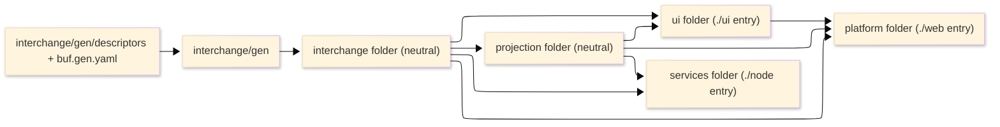

# [TYPESCRIPT_ARCHITECTURE_TREE]

The lib branch is ONE npm package `@rasm/ts` of FIVE FLAT higher-order domain folders directly under `libs/typescript/` — the top-level folders ARE the domains, never a `packages/` directory, never an `@rasm/<pkg>` nesting, never five separately-published packages, and never a `src/` nesting: each domain folder holds its `.ts` module leaves DIRECTLY at the domain root (`interchange/transport.ts`, not `interchange/src/transport.ts`), matching the C# and Python branch layouts. The publication/reachability split is a subpath-export attribute plus a folder-scoped lint stratum, never the folder axis and never a separate package: a platform-neutral interior (`interchange` + `projection`, stratum `neutral`), a browser publication of TWO folders (`ui`, the AppUi-analog UI library, stratum `browser`, subpath `./ui`; `platform`, the AppHost-analog SPA infrastructure + entry, stratum `browser`, subpath `./web`), and a node publication (`services`, stratum `node`, subpaths `./node` + `./provisioning`). This page is the planning atlas: the flat source tree projected from the twenty domain pages, the inter-domain dependency direction enforced by the folder-scoped `no-restricted-imports` strata, the descriptor-pipeline placement in the `interchange` folder, the `./provisioning` exports subpath isolating the `services/provisioning` closure, and the `GlbViewport` refinement-horizon entry. The tree is re-derived from the finalized owner set each loop. This is a `CROSS_PACKAGE_LAWS`-tier (ATLAS) page.

## [1]-[INDEX]

| [INDEX] | [CLUSTER]                     | [OWNS]                                                               |
| :-----: | :---------------------------- | :------------------------------------------------------------------- |
|   [1]   | SOURCE_TREE                   | the flat five-domain layout, one leaf per owner symbol, no src/      |
|   [2]   | PUBLICATION_TAG_SPLIT         | the browser/node/neutral tag attribute and the shared interior       |
|   [3]   | DEPENDENCY_DIRECTION          | the inter-domain folder-stratum import graph                         |
|   [4]   | DESCRIPTOR_PIPELINE_PLACEMENT | the committed buf input, config, and generated output in interchange |
|   [5]   | REFINEMENT_HORIZON            | the GlbViewport precondition-DAG entry, not a page this turn         |
|   [6]   | ATLAS_LAW                     | the re-derivation, one-owner-one-leaf, and cross-tier laws           |

## [2]-[SOURCE_TREE]

The branch is ONE package: the root carries the single `package.json` (catalog refs + subpath `exports` + the folder-stratum ESLint flat-config), `tsconfig.base.json`, the shared `vitest.workspace.ts`, and the root solution `tsconfig.json` whose `references` rows register each domain folder as a project reference for incremental builds (project references are a compiler concern, not a publication boundary). Each domain is a top-level folder with its `.ts` module leaves DIRECTLY at the folder root (NO `src/`) and a `.planning/` charter+pages, but NO own `package.json`. Inter-domain dependency direction is enforced by the folder-scoped ESLint `no-restricted-imports` strata (`browser`/`node`/`neutral` globs), the `projection/**` `@connectrpc/*` ban as the intra-neutral guard, and the `ui/**`-specific `../platform` ban as the intra-browser guard.

```text codemap
libs/typescript/                          # ONE package @rasm/ts; FLAT top-level folders ARE the higher-order domains; NO src/ nesting
├── package.json                          # the SINGLE package.json: subpath exports "." / "./ui" / "./web" / "./node" / "./provisioning"; catalog refs
├── eslint.config.ts                      # the folder-stratum bundle fence: no-restricted-imports by browser/node/neutral folder glob + ui->platform ban
├── tsconfig.base.json                    # the shared strictness floor every domain folder extends
├── tsconfig.json                         # the root solution; one references row per domain folder (five rows; incremental-build only)
├── vitest.workspace.ts                   # ONE shared workspace; node-mode projects for interchange/projection/services + ONE browser-mode project over ui+platform
├── pnpm-workspace.yaml row: libs/typescript (the ROOT as one project; the domain subfolders carry NO package.json)
│
├── interchange/                          # stratum neutral; the "." export; inbound dependency root
│   ├── buf.gen.yaml                      #   single-plugin v2 protoc-gen-es config — transport#CODEGEN_TOOLING
│   ├── gen/descriptors/                  #   committed app-root FileDescriptorSet input
│   ├── gen/                              #   protoc-gen-es output *_pb.ts; the codegen transcription unit (direct at domain root, no src/)
│   ├── transport.ts                      #   WireTransport + WireClients + TransportCapabilityWire + buf input edge — transport
│   ├── codec-rails.ts                    #   DecodeRail + EncodeRail + SchemaRefinement + GeometryRail + ArtifactFrameRail + FaultDetail family + Crc32 — codec-rails
│   ├── gateway-and-quarantine.ts         #   QuarantineFold + CONTRACT_INVENTORY + CommandGateway + IntentRegistry — gateway-and-quarantine
│   ├── index.ts                          #   the SANCTIONED neutral "." public-surface owner; re-exports BOTH interchange and ../projection (the one admitted barrel exception)
│   └── .planning/                        #   charter + transport.md, codec-rails.md, gateway-and-quarantine.md (3 pages)
│
├── projection/                           # stratum neutral; reached only through the "." barrel (no own subpath); transport-FREE folds; @connectrpc/* banned by folder lint
│   ├── fold-algebra.ts                   #   StreamPolicy + key-discriminated fold + RuntimeFeed/HealthStore/SnapshotFeed/ProgressStore/ConflictPresenceStore — fold-algebra
│   ├── envelope-and-evidence.ts          #   ReceiptStore/EvidenceFeed/AvailabilityStore + envelope carrier + SkewBand HLC fold — envelope-and-evidence
│   ├── index.ts                          #   the projection-internal aggregation re-exported by interchange/index.ts under "."
│   └── .planning/                        #   charter + fold-algebra.md, envelope-and-evidence.md (2 pages)
│
├── ui/                                   # stratum browser; the "./ui" UI library entry (AppUi-analog); MUST NEVER import ../platform
│   ├── binding.ts                        #   AtomBinding + DeepLinkBinding + url-state + OfflineState + UndoStack + dev inspector — binding
│   ├── render-surfaces.ts                #   EvidenceTimelineRoute/BenchmarkRoute/CollectorPanel + GeoSeriesSurface/GeoSeriesLayer (GlbViewport horizon) — render-surfaces
│   ├── component-system/                 #   ONE interaction-role vocabulary owner-block: actions/ collections/ inputs/ overlays/ navigation/ feedback/ pickers/ core + theme tokens + CSS-var sync — component-system
│   ├── index.ts                          #   the "./ui" entry — the standalone-consumable UI library surface
│   └── .planning/                        #   charter + binding.md, render-surfaces.md, component-system.md (3 pages)
│
├── platform/                             # stratum browser; the "./web" SPA entry (AppHost-analog); may import ui/, never the reverse
│   ├── browser.ts                        #   the "./web" entry — CompositionRoot composes ui+interchange+projection into one Layer graph and one runtime
│   ├── host-runtime.ts                   #   CompositionRoot + BrowserPlatform + AuthSession (arctic) + RuntimeConfig — host-runtime
│   ├── platform-substrate.ts             #   SelfTelemetry + MetricRegistry (WebSdk) + BuildPipeline + DecodeWorkerPool + LocalPersistence — platform-substrate
│   ├── routing-navigation.ts             #   AppRouter (Schema.Literal route-key axis + history SubscriptionRef) + NavigationGuard + RouteParamCodec (nuqs) — routing-navigation
│   ├── service-worker.ts                 #   ServiceWorkerHost + CacheStrategy axis + BackgroundSyncReplay (drains LocalPersistence.offlineQueue into CommandGateway) — service-worker
│   ├── error-boundary.ts                 #   CrashTelemetry + ErrorBoundaryBinding (react-error-boundary) + CrashReport (ships via SelfTelemetry) — error-boundary
│   ├── feature-flags-config.ts           #   RemoteConfig (FlagSet fold) + FlagKey axis (references services FeatureFlags) + FlagEvaluation Match dispatch — feature-flags-config
│   ├── web-vitals.ts                     #   PerformanceBudget (PerformanceObserver capture) + VitalMetric axis (feeds MetricRegistry) + BudgetThreshold Record — web-vitals
│   ├── index.ts                          #   the platform-internal aggregation; ./web resolves to browser.ts
│   └── .planning/                        #   charter + host-runtime.md, platform-substrate.md, routing-navigation.md, service-worker.md, error-boundary.md, feature-flags-config.md, web-vitals.md (7 pages)
│
├── services/                             # stratum node; the "./node" + "./provisioning" publication entries
│   ├── durable-execution.ts              #   WorkflowOwner/ActivityOwner/ClusterEngine + AiProvider literal + DurableUnit/DurableFault + agent journal + resilience — durable-execution
│   ├── persistence.ts                    #   SqlBoundary + entity registry (ONE Model.Class/entity) + TenantScope RLS + WorkQueue/EventJournal/Notifications + AssetTransfer + FeatureFlags — persistence
│   ├── hybrid-search.ts                  #   semantic+lexical+trigram+phonetic weighted-rank search owner + hybridQuery UNION ALL SQL — hybrid-search
│   ├── internal-rpc.ts                   #   InternalRpc RpcGroup + WorkflowProxy + RunnerBackplane + ScheduledWork — internal-rpc
│   ├── provisioning/                     #   ./provisioning subpath: platform.ts (entry-thin) + deploy.ts (impl-dense, two-mode) + PolicyGuard + bootstrap.sh — provisioning
│   ├── node.ts                           #   the "./node" entry — durable cluster + runner + provisioning compose
│   ├── index.ts                          #   the services-internal aggregation
│   └── .planning/                        #   charter + durable-execution.md, persistence.md, hybrid-search.md, internal-rpc.md, provisioning.md (5 pages)
│
└── .planning/                            # BRANCH-level SUITE planning (mirrors libs/csharp/.planning/)
    ├── README.md                         #   SUITE-STANDARD ANALOG: PAGE_INDEX across 5 domains, wire-page map, ADMISSIONS, cross-package laws; NO DENSITY_BAR
    ├── campaign-method.md                #   the branch-local campaign method aligned to the C# campaign
    ├── api-catalogues.md                 #   the evidence protocol over the .api set
    ├── FEATURES.md                       #   the dense universal-lib capability atlas, held lean
    ├── TASKLOG.md                        #   branch-level open work
    ├── architecture-posture.md           #   CROSS_PACKAGE_LAWS: altitude grammar + budget + neutrality + runtime + admission + anti-spam/co-location + RULE_ENFORCEMENT
    ├── test-strategy.md                  #   CROSS_PACKAGE_LAWS: PBT spine + BrowserE2E + MutationHarness; per-domain project rows in one vitest.workspace.ts
    ├── architecture-tree.md              #   CROSS_PACKAGE_LAWS (ATLAS): this page
    └── region-map/                       #   ONE branch ledger with five per-domain blocks (page-regions, owner-symbols, seam-splits)
```

Per-module specs are co-located one-per-source-module-per-category as `*.spec.ts` beside each owner leaf under the test category the page assigns; each domain's `test/` holds only its shared arbitrary registry, layer materialization, and (for `services`) the durable container harness. The folder set is the twenty domain pages projected at owner granularity across five domains; `gen`/`gen/descriptors` are codegen artifacts in `interchange` and `provisioning/` is the `./provisioning` exports-subpath leaf in `services`. Net: interchange 3 + projection 2 + ui 3 + platform 7 + services 5 = 20 charter domain pages, where `ui/component-system/` and `services/provisioning/` are owner-block sub-folders (one charter page each, multi-leaf) so the physical module-leaf count exceeds the page count: a single-axis page transcribes to one flat module (`platform/routing-navigation.ts`), a page whose owner set spans a real taxonomy or two-altitude split is an owner-block sub-folder. The `interchange/index.ts` barrel is the ONE sanctioned neutral-interior public-surface owner that intentionally re-exports `../projection` (the single admitted exception to the no-barrel law, recorded in the package charter), since `projection` has no own subpath and both folders compose under `.`.

## [3]-[PUBLICATION_TAG_SPLIT]

Five flat domain folders in one package, each independently consumable through a subpath export, in three reachability strata; the bundle split is a subpath-export attribute plus a folder-scoped lint stratum, never a folder boundary, never a separate package, and never a runtime guard.

- Platform-neutral interior: `interchange` (stratum `neutral`) and `projection` (stratum `neutral`) — both browser/node publications compose them through the one `.` export, which `interchange/index.ts` aggregates by re-exporting both neutral folders (`projection` has no own subpath). Because both are neutral, the stratum graph does not separate the `CommandGateway`-reads-`AvailabilityStore` intra-neutral seam, so the `projection/**` `no-restricted-imports` ban on `@connectrpc/*` is the sole mechanical guard keeping the fold interior transport-free; the read is an intra-package module edge.
- Browser publication (two folders): `ui` (stratum `browser`, subpath `./ui`) is the standalone-consumable UI library (the AppUi-analog) importing `interchange` + `projection`; `platform` (stratum `browser`, subpath `./web`) is the SPA application infrastructure + ENTRY (the AppHost-analog) whose root `CompositionRoot` (`platform/browser.ts`) assembles `ui` + `interchange` + `projection` into one Layer graph and one runtime. `platform` MAY import `ui` (the entry composes the UI library); `ui` MAY NEVER import `platform` — the intra-browser dependency direction the `ui/**`-specific lint rule enforces, mirroring the inward `interchange` <- `projection` direction.
- Node publication: `services` (stratum `node`) is the node entry, importing `interchange` + `projection`; the durable cluster, runner backplane, internal RPC, persistence, hybrid search, and provisioning surfaces compose under one node runtime; `./node` is the runtime entry subpath and `./provisioning` is the deploy-time subpath keeping `@pulumi/*` off the runtime hot path.

The bidirectional bundle fence is a compile-time folder-stratum lint constraint: a `browser` folder (`ui` or `platform`) imports only `browser` and `neutral` folders, a `node` folder only `node` and `neutral` folders, a `neutral` folder only `neutral` folders, and a `ui` folder additionally never imports `platform`. So `@effect/cluster`, `@effect/workflow`, `@effect/sql-pg`, the `@pulumi/*` rows, `ioredis`, and `@effect/platform-node` never enter the browser bundle, and `@effect/platform-browser`, `react`, `@effect-atom/atom-react`, `maplibre-gl`, the `@deck.gl/*` rows, `arctic`, `nuqs`, `react-error-boundary`, the `workbox-*` rows, and `vite` never enter the node bundle — the per-subpath bundle is tree-shaken from the one package by its entry. A cross-stratum source import, or a `ui` -> `platform` import, is the named coupling defect the folder-scoped lint rejects at lint time and the subpath bundler at build time.

## [4]-[DEPENDENCY_DIRECTION]

Dependencies flow inward from the publication entries toward the wire boundary; no domain depends on a domain above it in the flow, the node tier never depends on the browser folders, and inside the browser stratum `platform` depends on `ui` and never the reverse.



Text equivalent: the committed descriptor set drives `buf generate` into `interchange/gen`; `interchange` derives transport, clients, decode/encode rails, refinement, geometry, artifact frames, the exhaustive fault family, quarantine, and the outbound command gateway from those descriptors; `projection` folds decoded values into keyed `SubscriptionRef`-backed stores over the `StreamPolicy` reconnect vocabulary, dialing nothing (and importing no `@connectrpc/*`); `ui` subscribes to the stores through the one `AtomBinding`, renders the leaf routes and the geo surface, emits intents through the `interchange` `CommandGateway`, and holds no domain state; `platform` composes `ui` into the SPA root binding `RuntimeConfig`/`BrowserPlatform`/`AuthSession`/`SelfTelemetry`/`LocalPersistence`/`DecodeWorkerPool` plus the five strengthened infrastructure owners (`AppRouter`/`ServiceWorkerHost`/`CrashTelemetry`/`RemoteConfig`/`PerformanceBudget`); `services` composes interchange+projection plus its own durable, runner, SQL, internal-RPC, hybrid-search, and provisioning owners. The only cycle is the read-gate-then-fold pair: `interchange` `CommandGateway` reads the `projection` `AvailabilityStore` fold and writes back the command receipt — an intra-neutral read-gate, not a tier reversal, and the gateway lives in `interchange` (the transport-owning domain) so no browser transport leaks into the fold tier. The `platform` -> `ui` edge is the one intra-browser dependency: the SPA entry composes the UI library; the reverse import is the named browser-internal coupling defect.

## [5]-[DESCRIPTOR_PIPELINE_PLACEMENT]

The buf descriptor pipeline is a build-time stage in `interchange` landing its input and output as committed tree leaves directly at the domain root, so the runtime modules import generated values and never run the generator:

- Input leaf: `interchange/gen/descriptors` holds the app-root-emitted `FileDescriptorSet`, the same descriptor set the C# `ContractGuard` publishes beside the discovery manifest; the buf input row points here, never at a `.proto` tree.
- Config leaf: `interchange/buf.gen.yaml` carries the single-plugin v2 codegen config `transport.md#CODEGEN_TOOLING` fixes — one `protoc-gen-es` plugin, `target=ts`, `include_imports: true`, emitting `.ts` with the transitive descriptor graph embedded.
- Output leaf: `interchange/gen` holds the `*_pb.ts` descriptor modules directly at the domain root (no `src/`), one `GenService` descriptor per service; `transport.ts` imports them to derive clients through `createClient` and to construct the file-aware registry `FaultDetailRail` passes to `findDetails`.
- Build edge: the generation pass runs as a pnpm build step ahead of the tsgo type-check and the bundle; `@bufbuild/buf` (`allowBuilds: true` in the catalog) drives the pass and never enters a runtime import; a hand-edit of a generated module is the deleted form.

## [6]-[REFINEMENT_HORIZON]

The GLB concern splits across two altitudes: the GLB BYTE/ARTIFACT layer is landed, and only the WebGL MESH-RENDER layer is on the horizon. GLB is a server-streamed content-addressed artifact, so `interchange` `ArtifactFrameRail` (codec-rails#CODEC_RAILS) reassembles the `ArtifactFrameWire` frames into a Crc32-verified XxHash128-keyed blob today — the transcribable wire-consumption surface for GLB import and export over the existing `#TS_PROJECTION` fence. What stays deferred is `GlbViewport`, the WebGL render of a mesh, one owner-anchored refinement-horizon entry on ui/render-surfaces.md, NOT a page this turn: its mesh-render input is verified present only in C# `remote-lane.md#PROTO_VOCABULARY` and absent from the `#TS_PROJECTION` fence, so `interchange` has no transcribable mesh Schema and SIGNATURE_LAW forbids TS authoring one. The render entry routes as a four-end cross-branch precondition-DAG (the seam row lives in `region-map/seam-splits.md`): (a) C# `remote-lane.md#TS_PROJECTION` promotes `MeshTensor`/`GeometryPayload(mesh)` from `[PROTO_VOCABULARY]` into the projection fence — the single true blocker; (b) C# `interchange.md` authoring DISCHARGED; (c) the Python `libs/python/compute` IFC->GLB two-hop companion authors — a precondition the TS branch observes; (d) only then `ui` admits a WebGL viewer with a `Schema.Literal` renderer-backend axis admitting three/babylon/model-viewer and a webgpu literal for the meshlet/cluster-LOD ambition. ZERO WebGL packages are admitted until the upstream mesh `#TS_PROJECTION` exists. The viewer is a `ui` render-surface, not a `platform` infrastructure owner — the horizon entry stays on the UI library that owns the render leaves.

## [7]-[ATLAS_LAW]

- The tree is the live file plan re-derived from the finalized owner set each loop; a new owner lands as a leaf or a row on an existing leaf in its owning domain, never a new domain unless a genuinely new bounded concern warrants one.
- One owner has exactly one physical leaf; an owner split across two files or two owners fused into one undifferentiated module is the named layout defect. A page whose owner set spans a real interaction-role taxonomy or a two-altitude deploy split is an owner-block sub-folder (`ui/component-system/`, `services/provisioning/`), never a single flat module; a single-axis page transcribes to one flat module (`services/durable-execution.ts`, `platform/routing-navigation.ts`). NO domain folder carries a `src/` interior — module leaves sit directly at the domain root.
- The domain partition mirrors the page partition: five domain folders in one package, each with its `.planning/` charter and pages; `gen`/`gen/descriptors` are codegen artifacts in the `interchange` folder and `provisioning/` is the `./provisioning` subpath leaf in the `services` folder.
- The node folder carries no browser import and the browser folders carry no node import; the folder-scoped `browser`/`node`/`neutral` `no-restricted-imports` strata, the `projection/**` `@connectrpc/*` ban, and the `ui/**`-specific `../platform` ban are the enforcement points inside the one project, and a cross-stratum source import, a transport dial in the fold interior, or a `ui` -> `platform` import is the named coupling defect.
- The two browser folders share ONE browser-mode vitest project (`browser`) covering both `ui/**` and `platform/**` specs — the playwright provider is folder-agnostic and the browser publication is one runtime, so a second runner config is the named test-config defect.
- Every deepening-horizon owner lands on the densest owning domain page and surfaces here as a leaf; `GlbViewport` is the one refinement-horizon owner with no page and no leaf this turn, admitted on `ui/render-surfaces` only when the upstream mesh fence exists.
