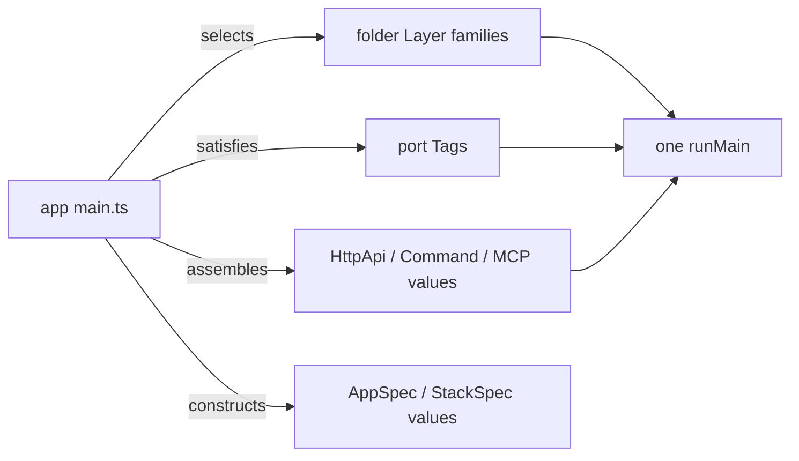

# [COMPOSITION_SYSTEM]

The fourteen folders form one composition system: every folder ships `Layer`/`Service` families, and an app is a ~30-line `main.ts` that merges the selected families into one `runMain`. Capability growth is a row, case, policy value, or dispatch arm on an owning surface; an app need that forces a lib edit is the named failure. This page carries the composition model — the package shape, the edge ledger, the port law, the app recipes — and the extension recipes; the per-folder design pages carry the fences.

## [01]-[PACKAGE_SHAPE]

One npm package `@rasm/ts` with per-folder exports subpaths (`@rasm/ts/kernel` … `@rasm/ts/iac`, plus `@rasm/ts/proof` on the dev plane). The exports map is the primary enforcement altitude: an unexported interior module is physically unresolvable, so machinery/contract splits hold at module resolution, not by convention; the Nx tag triples ride every project as graph metadata.

- Runtime-spanning folders (`store`, `security`, `telemetry`, `wire`, `host`) publish per-runtime subpaths (`./server`, `./browser`, `./wasm`); a browser bundle never resolves node code because the node entry does not exist on its resolution path.
- `wire` publishes decoded-value vocabulary through `#vocab`; the codec machinery interior is unexported. `ui` types wire values through `#vocab` only.
- `kernel` publishes its law/arbitrary substrate behind a dev-only subpath so `fast-check` never rides a runtime graph.
- `proof/gauge` audits what the exports map cannot express: the edge-ledger import audit, per-runtime subpath purity, the branch-wide migrator-import ban, and the `security` per-sub-folder crypto-admission boundaries.

## [02]-[EDGE_LEDGER]

The permitted-edge table is the boundary law: the `@rasm/ts` exports map enforces it physically (an unexported subpath is unresolvable), `proof/gauge` audits the remainder, and roster growth is a reviewed row-add. Every project carries `scope:<folder>` (`scope:viewer` for the `ui` viewer project), `runtime:{neutral,node,bun,browser}`, `plane:{runtime,deploy,dev}`; `runtime:browser` depends only on `{browser, neutral}`, `runtime:node` only on `{node, neutral}`, `plane:deploy` is depended on by nothing, `plane:dev` imports anything and is imported by nothing.

| [FOLDER] | [MAY_IMPORT] | [WAVE] |
| :--- | :--- | :---: |
| `kernel` | — | W0 |
| `proof` | anything | W0 |
| `state` | `kernel` | W1 |
| `host` | `kernel` | W1 |
| `security` | `kernel`, `host` | W1 |
| `telemetry` | `kernel`, `host` | W1 |
| `wire` | `kernel`, `state`, `host` | W2 |
| `work` | `kernel`, `host`, `security`, `telemetry` | W2 |
| `store` | `kernel`, `state`, `host`, `security` | W3 |
| `ai` | `kernel`, `host`, `work` | W3 |
| `edge` | `kernel`, `state`, `host`, `security`, `telemetry` | W4 |
| `browser` | `kernel`, `state`, `host`, `wire`, `security`, `telemetry` | W4 |
| `ui` | `kernel`, `state`, `wire` (`#vocab` only) | W4 |
| `iac` | `kernel`, `store` (capability vocabulary), `telemetry` (board functions) | W4 |

Beyond the rows: `ui` and `browser` never import each other — peers an app composes; external-package admission is folder-scoped by the ledger's admission union (`@pulumi/*` only in `iac`, `@effect/sql-*` drivers only in `store`, `jose` only in `security`, `react*` only in `ui`/`viewer`/`browser`, and so on per the ledger), audited at `proof/gauge`; the `security` sub-folder admissions (`jose` in `sign` only, `arctic` in `authn` only) ride the same audit.

## [03]-[PORTS]

A port exists only where the ledger forbids the import; the app root wires every port. A port minted to dodge a legal edge is the named defect. A `Tag` for a runtime VALUE typed against legally imported vocabulary — the `wire` gateway availability gate over `state/evidence` — is ordinary dependency injection, outside this registry.

| [INDEX] | [DECLARER] | [PORT] | [SATISFIER] |
| :-----: | :--- | :--- | :--- |
| [01] | `security` | `SessionStore`, `IdentityJournal` | `store` journal Layers |
| [02] | `work` | `SqlClient` (`@effect/sql` core), `MessageStorage` (`@effect/cluster`) | `store` driver Layer |
| [03] | `store/retrieve` | `Embedder` | `ai/embed` |
| [04] | `telemetry` | audit journal, meter journal | `store` journal Layers |
| [05] | `kernel/fault` | the fault-enricher contract | `wire` implements, `telemetry` consumes |
| [06] | `ui` | runtime-capability records (`GlbViewport` decode-worker residency) | `browser` |
| [07] | `edge/hook` | ingress + quota | `work` queue or `store` journal; `work` fenced-quota rows |
| [08] | `edge/live` | protocol-handler mount (`HttpApp`) | the `store` EventLog sync server |

## [04]-[APP_COMPOSITION]

The app root is the only place the system closes: it selects Layer families, satisfies every port, assembles the singleton entry values, and calls one `runMain`. Assembly is law across all entry families — the `HttpApi` VALUE, the CLI `Command` root, and the MCP toolkit selection each exist only in the app, assembled from contribution families the folders export as data. A god-contract is structurally impossible because the assembled value has no lib-side existence.

App-authored VALUES carry everything app-specific: `AppSpec` (browser boot budget), `StackSpec` (IaC target arm, capability profile, region/domain, Doppler ref), message catalogs (`intl` rows keyed by the kernel `Locale` brand), dashboard identity (`AppIdentity` into the `telemetry/board` total functions), store events (app `Schema.TaggedClass` families), CLI verbs, MCP toolkit selections. The archetype matrix is the acceptance gate — each archetype composes thinly, with zero lib edits, from exactly these selections:

| [ARCHETYPE] | [FOLDER_SELECTION] |
| :--- | :--- |
| Multi-tenant SaaS | kernel, state, host, security, telemetry, work, store, ai, edge, browser, ui, iac |
| Realtime dashboard | kernel, state, host, security, telemetry, wire, store, edge, browser, ui + viewer, iac |
| Geospatial/BIM viewer | kernel, state, host, security, telemetry, wire, browser, ui + viewer |
| Headless service | kernel, host, security, telemetry, wire, work, store, ai, edge, iac |
| CLI tool | kernel, host, telemetry, store (sqlite lane), edge (cli verbs) |
| AI copilot | kernel, state, host, security, telemetry, work, store, ai, edge, ui, iac |

## [05]-[EXTENSION_RECIPES]

Every extension lands on a canonical owner. An extension that seems to need a new folder, a parallel rail, or a lib edit per app is being done wrong — find the owning surface.

| [INDEX] | [CHANGE] | [OWNER_SURFACE] | [SHAPE_OF_THE_EDIT] |
| :-----: | :--- | :--- | :--- |
| [01] | new app | app repo only | Layer selection + app VALUES |
| [02] | new entry endpoint family | `edge/api` group / `edge/cli` verb contributions | one contribution family, app assembles |
| [03] | new cloud target | `iac/provider` dispatch + surface | one dispatch arm + one surface column |
| [04] | finalize a prepared cloud/provider row | app `StackSpec` | app data, zero lib edits |
| [05] | new job kind / egress channel | `work/queue` family / `work/deliver` | one family row |
| [06] | new AI provider or tool | `ai/model` provider rows / `ai/tool` toolkits | one provider row / one toolkit datum |
| [07] | new data-spine capability (wire shape, event, projection, retrieval, extension, retention) | the owning spine surface | one row per `dataflow-system.md` `[07]` |
| [08] | new cross-folder need the ledger forbids | the declaring folder's port | one port Tag + one app-root wiring |
| [09] | new folder | the edge ledger | a reviewed row-add; every plane/tag/wave named |
| [10] | a seeming new domain | the standing owner | cache/rate → `store/capability` prepared rows; search → `store/retrieve`; queue-as-data → `store`, execution → `work`; routing → `browser/route`; config/flags → `host`; agent → `ai`; notifications/email → `work/deliver`; geometry → never (C#/Python own it) |

## [06]-[BOUNDARIES]

- `proof` is infrastructure, never the spec home: specs live beside their owning folders; layer-sharing is `@effect/vitest` capability, never a hand-rolled harness.
- `@effect/cluster` (in-process durable actors/workflow) and K8s (deployment topology) are two altitudes; `work` owns the first, `iac` the second, and StackOutputs → `ShardingConfig` is their one seam.
- Apps are repos outside `libs/typescript`; the branch carries no app scaffolding, no example app, and no composition helper — the ~30-line root is the proof the surfaces compose.
