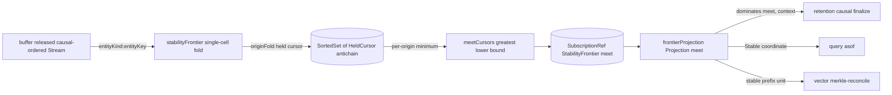

# [PROJECTION_FRONTIER]

The cross-entity horizon the per-entity buffer cannot name — `buffer#CAUSAL_BUFFER` releases each entity's gap-free causal prefix and advances its own `OriginCursor`, but a reconnecting peer, the `retention#CAUSAL_FINALIZE` causal trim, and the `vector#MERKLE_RECONCILE` reconciliation all need the one origin vector below which *every* entity is settled, not the per-entity tail. `stabilityFrontier` is that meet: it holds each released entity's held `OriginCursor` in a `SortedSet` ordered by a total canonical-position order, recomputes the greatest lower bound as the per-origin minimum sequence across every cursor on each release, and exposes the meet `VersionVectorWire` as a `SubscriptionRef` the downstream finalization reads through the one `vector#VERSION_VECTOR` `dominates` algebra — never a second clock, never a re-minted slot, never a second ordering surface. The meet is the causally-settled horizon: an op whose context the meet `dominates` is delivered on every peer, so any state at-or-below the meet is final and safe to finalize, trim, or treat as the reconciliation prefix; an origin that has gone silent pins the meet at its last released sequence, so the horizon advances exactly as fast as the slowest live origin and never claims stability a lagging peer can still violate. Two peers folding the same released multiset in any wire order compute the byte-identical meet because the greatest lower bound is the per-slot minimum of an idempotent commutative cursor set — the delivery-order independence `buffer#CAUSAL_BUFFER` establishes for the per-entity release, lifted to the cross-entity horizon.

## [01]-[INDEX]

- [01]-[STABILITY_FRONTIER]: Owns `StabilityFrontier`, `cursorPositions`, `cursorOrder`, `meetCursors`, `frontierMerge`, the `stabilityFrontier` per-cursor-set fold, and the `stableBelow`/`stableMeet` read predicates the GC, the as-of `Stable` coordinate, and the Merkle prefix consume.
- [02]-[FRONTIER_FACE]: Owns `frontierProjection`, the `Projection<VersionVectorWire>` `Subscribable` read face that lifts the meet store into the one atom-bridge surface `retention#CAUSAL_FINALIZE` and the `query/asof#AS_OF_QUERY` `Stable` coordinate subscribe to without reaching the raw `SubscriptionRef` interior.

## [02]-[STABILITY_FRONTIER]

- Owner: `StabilityFrontier`, the meet state holding the `SortedSet` of per-entity held `OriginCursor`s keyed by `entityKind:entityKey`, and the derived greatest-lower-bound `meet` `VersionVectorWire`; `cursorPositions`, the canonical-position projection flattening an `OriginCursor`'s slot map into the deterministic `origin sequence` string sequence the diagnostic surface reads; `cursorOrder`, the total `Order<HeldCursor>` over the held entity key so the cursor set stays a sorted antichain two peers materialize identically and a re-released entity replaces its own member rather than appending a duplicate; `meetCursors`, the greatest-lower-bound fold that takes the per-origin minimum sequence across every held cursor (a `0n` floor for any origin absent from a cursor, so a single entity lacking an origin pins that slot to zero — the cross-entity meet is dominated by the least-advanced entity per origin); `frontierMerge`, the scalar step that replaces the releasing entity's held cursor in the `SortedSet` and recomputes the meet in one pass; `stabilityFrontier`, the `combinators#KEYED_FOLD` `foldStream` single-cell scalar fold tracking the one `StabilityFrontier` over the released changefeed into a `SubscriptionRef<StabilityFrontier>`; and `stableBelow`/`stableMeet`, the read predicates exposing the meet as the `dominates`-tested causally-settled horizon.
- Cases: the meet is the greatest lower bound over the per-entity held cursors — for every origin present in *any* cursor, the meet slot is the minimum held sequence across *all* tracked cursors, treating a cursor with no slot for that origin as `0n`, so the meet is the largest `VersionVectorWire` every entity's cursor `dominates`. An op whose `context` the meet `dominates` is therefore released on every entity's path and safe to finalize; an op above the meet may still be causally pending on a lagging entity, so it is never finalized early — exactly the causal-stability guarantee `retention#CAUSAL_FINALIZE` weighs alongside the event-time watermark, a cell reclaimable only when it is below both the event-time frontier and this causal meet. `meetCursors` reads the union axis (every origin any held cursor names) and folds the per-origin minimum across the whole `SortedSet`, so adding a fresh entity whose cursor lacks a slow origin lowers no slot the slow origin already pins, and advancing the slowest entity's cursor is the only event that lifts a pinned slot — the horizon advances at the pace of the slowest live origin. A silent origin (no further releases) holds its meet slot at its last released sequence indefinitely, the honest stall the causal discipline demands; a re-fold of an already-tracked entity's identical cursor (reconnect-replay through `policy#STREAM_POLICY`) replaces the `SortedSet` member with an equal cursor under the same `cursorOrder` key and recomputes the byte-identical meet, idempotent under replay. The `SortedSet` keys the held cursors by `cursorOrder` so the set is a deterministic antichain and the `meetCursors` traversal visits the cursors in one canonical order, so two peers folding divergent release orders compute the identical meet — the delivery-order independence the `convergence/law#CONVERGENCE_LAW` harness extends from the per-entity release to the cross-entity horizon.
- Entry: `stabilityFrontier(released, policy)` folds the `buffer#CAUSAL_BUFFER` released causal-ordered `Stream<OpLogEntryWire>` through `foldStream` into one `SubscriptionRef<StabilityFrontier>` whose `meet` advances as the cross-entity greatest lower bound; `stableMeet(frontier)` reads the meet `VersionVectorWire` and `stableBelow(frontier, context)` is the `dominates(meet, context)` causally-settled test the GC, the as-of `Stable` coordinate, and the Merkle prefix all read.
- Packages: `effect` for `SortedSet` (the held-cursor antichain), `Order` (the total `cursorOrder` over the canonical position composed from `Order.string`), `HashMap` (the per-cursor origin slots and the meet accumulator), `Option`, `Stream`, `SubscriptionRef`, `Effect`, and `Scope`; the `OriginCursor` shape, the `cursorVector` projection, and the `dominates` predicate arrive owned from `vector#ORIGIN_CURSOR` and `#VERSION_VECTOR` — the frontier composes them and mints no parallel ordering surface (charter law, `ARCHITECTURE.md:50`).
- Growth: a new horizon consumer (a second GC arm, a snapshot checkpointer) reads the same meet `VersionVectorWire` through `stableBelow`, never a second meet projection; the held-cursor antichain stays one `SortedSet` even as origins widen, a new origin folding into the same union axis the `meetCursors` minimum reads; the meet representation stays one `VersionVectorWire` so the `d2ts` `Antichain` lower-bound the `retention#FRONTIER_REPRESENTATION` swap carries replaces the slot-map meet as one representation change, the `stableBelow` `dominates` test unchanged.
- Boundary: the frontier re-validates and re-mints nothing — it reads the `buffer#CAUSAL_BUFFER` released entity's held `OriginCursor` verbatim (the same cursor the per-entity buffer advances through `originFold`, one cursor owner serving both the per-entity release and the cross-entity meet) and projects it through the owned `cursorVector`, never re-deriving a slot the wire did not stamp; the meet is a pure greatest-lower-bound fold over the decode-admitted cursor slots, so the frontier decides *how settled* the system is, never *what* an op means or *when* a single entity releases — the buffer owns per-entity causal order, the convergence folds own convergent state, and this fold owns only the cross-entity horizon, three disjoint concerns over one changefeed sharing one cursor algebra; the held cursors live in a persistent `SortedSet` so a release shares structure with the residual antichain under replace, never a `new Set` rebuild that breaks referential transparency on reconnect-replay; the domain dials no transport.

```ts contract
import { Effect, HashMap, Option, Order, Scope, SortedSet, Stream, SubscriptionRef } from "effect";
import type { OpLogEntryWire, VersionVectorWire } from "@rasm/interchange";
import { foldStream } from "../fold/combinators";
import type { StreamPolicy } from "../fold/policy";
import { originFold, type OriginCursor, emptyOriginCursor } from "../causality/vector";

// --- [TYPES] -------------------------------------------------------------------------------

interface HeldCursor {
  readonly entity: string;
  readonly cursor: OriginCursor;
}

interface StabilityFrontier {
  readonly held: SortedSet.SortedSet<HeldCursor>;
  readonly meet: VersionVectorWire;
}

// --- [OPERATIONS] --------------------------------------------------------------------------

const cursorPositions = (cursor: OriginCursor): string =>
  Array.from(HashMap.toEntries(cursor.slots))
    .map(([origin, seq]) => `${origin} ${seq.toString().padStart(20, "0")}`)
    .sort()
    .join("|");

const cursorOrder: Order.Order<HeldCursor> = Order.combine(
  Order.mapInput(Order.string, (held: HeldCursor) => held.entity),
  Order.mapInput(Order.string, (held: HeldCursor) => cursorPositions(held.cursor)),
);

const emptyFrontier = (): StabilityFrontier => ({ held: SortedSet.empty<HeldCursor>(cursorOrder), meet: { slots: {} } });

const minSlot = (cursors: ReadonlyArray<OriginCursor>, origin: string): Option.Option<bigint> =>
  cursors.reduce(
    (lo: Option.Option<bigint>, c) => {
      const seq = Option.getOrElse(HashMap.get(c.slots, origin), () => 0n);
      return Option.some(Option.match(lo, { onNone: () => seq, onSome: (held) => (seq < held ? seq : held) }));
    },
    Option.none<bigint>(),
  );

const meetCursors = (held: SortedSet.SortedSet<HeldCursor>): VersionVectorWire => {
  const cursors = Array.from(SortedSet.values(held), (h) => h.cursor);
  const axis = Array.from(new Set(cursors.flatMap((c) => Array.from(HashMap.keys(c.slots)))));
  return {
    slots: Object.fromEntries(
      axis.flatMap((origin) =>
        Option.match(minSlot(cursors, origin), { onNone: () => [], onSome: (seq) => [[origin, seq] as const] }),
      ),
    ),
  };
};

const frontierMerge = (frontier: StabilityFrontier, entry: OpLogEntryWire): StabilityFrontier => {
  const entity = `${entry.entityKind}:${entry.entityKey}`;
  const priorCursor = Option.getOrElse(
    Option.map(Option.fromNullable(Array.from(SortedSet.values(frontier.held)).find((h) => h.entity === entity)), (h) => h.cursor),
    () => emptyOriginCursor,
  );
  const held = SortedSet.add(
    SortedSet.remove(frontier.held, { entity, cursor: priorCursor }),
    { entity, cursor: originFold(priorCursor, entry) },
  );
  return { held, meet: meetCursors(held) };
};

const stabilityFrontier = (
  released: Stream.Stream<OpLogEntryWire>,
  policy: StreamPolicy,
): Effect.Effect<SubscriptionRef.SubscriptionRef<StabilityFrontier>, never, Scope.Scope> =>
  foldStream(released, emptyFrontier(), frontierMerge, policy);

const stableMeet = (frontier: StabilityFrontier): VersionVectorWire => frontier.meet;

const stableBelow = (frontier: StabilityFrontier, context: VersionVectorWire): boolean =>
  Array.from(new Set([...Object.keys(frontier.meet.slots), ...Object.keys(context.slots)])).every(
    (k) => (frontier.meet.slots[k] ?? 0n) >= (context.slots[k] ?? 0n),
  );
```

## [03]-[FRONTIER_FACE]

- Owner: `frontierProjection`, the `Projection<VersionVectorWire>` `Subscribable` read face that lifts the `stabilityFrontier` meet store into the one `fold/projection#PROJECTION` adapter every downstream horizon consumer subscribes to — `retention#CAUSAL_FINALIZE` reads it as the causal `advanceFrontier` second-input arm, the `query/asof#AS_OF_QUERY` `Stable` coordinate reads it as the as-of horizon, and the `@effect-atom/atom` bridge binds it at the `ui` boundary, none reaching the raw `SubscriptionRef` interior. It is the projected meet, deduplicated through `Stream.changes`, never a second store holding a parallel horizon.
- Cases: `frontierProjection` maps the `SubscriptionRef<StabilityFrontier>` through `projectStore` and `derive` into the `Projection<VersionVectorWire>` carrying only the meet — a consumer subscribing sees the meet advance monotonically as the cross-entity greatest lower bound and never the held-cursor antichain interior, so the GC and the as-of coordinate read the one settled-horizon value and re-mint no cursor projection. The projection deduplicates through the `fold/projection#PROJECTION` `Stream.changes` so a release that does not lift the meet (a lagging origin still pinning a slot) emits no spurious horizon advance, the GC re-trimming only when the meet genuinely moves.
- Entry: `frontierProjection(store)` lifts the `stabilityFrontier` store into the `Projection<VersionVectorWire>` the GC, the as-of `Stable` coordinate, and the atom bridge subscribe to; the projection is the one read face, the raw `SubscriptionRef` staying the fold interior.
- Packages: `effect` for `Subscribable` (through the `fold/projection#PROJECTION` `Projection` alias) and `SubscriptionRef`; the `projectStore`/`derive` adapter arrives owned from `fold/projection#PROJECTION`, the frontier composing it and exposing no second read face.
- Growth: a new horizon consumer subscribes to the same `Projection<VersionVectorWire>`, never a second meet store; a derived horizon view (a per-origin lag readout, a settled-fraction gauge) lands as one `derive` row on the same projection, the meet store unchanged.
- Boundary: the projection exposes only the meet `VersionVectorWire`, never the held-cursor antichain, so the GC and the as-of coordinate read the settled horizon and never the per-entity interior; the projection re-mints nothing — it maps the already-folded meet through the owned `fold/projection#PROJECTION` adapter; the atom bridge binds the `Subscribable` at the `ui` boundary, never imported into the fold interior; the domain dials no transport.

```ts contract
import type { SubscriptionRef } from "effect";
import type { VersionVectorWire } from "@rasm/interchange";
import { derive, projectStore, type Projection } from "../fold/projection";
import type { StabilityFrontier } from "./stability-frontier";

// --- [COMPOSITION] -------------------------------------------------------------------------

const frontierProjection = (
  store: SubscriptionRef.SubscriptionRef<StabilityFrontier>,
): Projection<VersionVectorWire> => derive(projectStore(store), (frontier) => frontier.meet);
```


