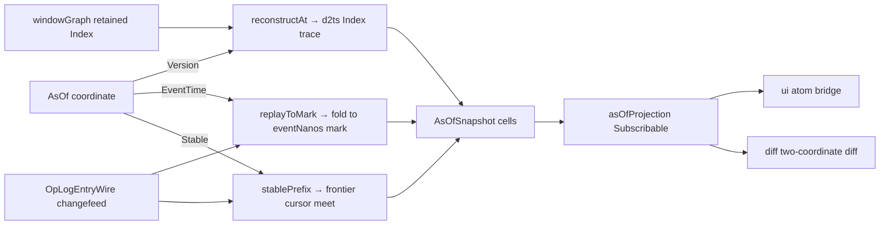

# [PROJECTION_ASOF]

The point-in-time read axis the always-latest fold structurally lacks — `AsOf` is the closed three-case coordinate (`Version`/`EventTime`/`Stable`) that names *which past* a read materializes, and `asOfQuery` is the one total `$match` over it that reconstructs the keyed map as of that coordinate without standing up a second store holding a parallel history. The `Version` arm reads the `@electric-sql/d2ts` `Index#reconstructAt` retained version-trace the `window#DATAFLOW` `windowGraph` re-founding produces, so a windowed view answers "the keyed map at differential-dataflow `Version` V" from the trace the engine already retains rather than a re-fold; the `EventTime` arm folds the decoded changefeed forward to the watermark mark through one replay-to-mark step, reusing the `watermark#WATERMARK` `eventNanos` projection so the versionless path answers "the keyed map as of event time T"; the `Stable` arm reads the `causality/frontier#STABILITY_FRONTIER` causally-settled prefix as the coordinate, so a read asks "the keyed map at the causally-stable horizon" off the cursor meet the delivery discipline already names. The coordinate discriminates ONE query surface — never a per-coordinate sibling query function and never a second history store — and the materialized snapshot is itself a `fold/projection#PROJECTION` `Projection<HashMap<K, V>>` the ui atom bridge and the `diff#AS_OF_DIFF` two-coordinate diff both read off the one read face. The fold mints no clock, no version, and no frontier the upstream engines did not stamp: the `Version` is the `d2ts` time tuple, the `EventTime` is the watermark `eventNanos`, and the `Stable` cursor is the `causality/vector#ORIGIN_CURSOR` held vector — this axis composes the three retained traces, never a fourth.

## [01]-[INDEX]

- [01]-[AS_OF_COORDINATE]: Owns `AsOf`, the closed three-case `Data.TaggedEnum` temporal coordinate, `AsOfSnapshot`, the materialized keyed-map-at-coordinate carrier, `coordinateOrder`, the per-arm monotonic comparison the diff reads, and the selector vocabulary (`versionOf`/`eventTimeOf`/`stableOf`) the `asOfQuery` dispatch projects.
- [02]-[AS_OF_QUERY]: Owns `ReconstructAt`, the retained-trace reader port the `windowGraph` exposes, `replayToMark`, the versionless replay-to-watermark fold, `stablePrefix`, the stability-frontier prefix reader, `asOfQuery`, the one total `$match` materializing the snapshot per coordinate, and `asOfProjection`, the `Projection` read face every consumer binds.

## [02]-[AS_OF_COORDINATE]

- Owner: `AsOf`, the closed three-case `Data.TaggedEnum` (`Version` carrying the `@electric-sql/d2ts` `Version` time tuple the windowed trace is indexed by, `EventTime` carrying the `eventNanos` bigint the watermark projects, `Stable` carrying the `originCursor` greatest-lower-bound vector the stability frontier names) — the one coordinate the whole axis discriminates on; `AsOfSnapshot`, the materialized `{ coordinate, cells }` carrier binding a resolved coordinate to the keyed map it reconstructs so a downstream diff reads the coordinate beside its cells; `coordinateOrder`, the partial comparator over two same-arm coordinates the `diff#AS_OF_DIFF` "from-then-to" direction reads — a `number` returning `-1`/`0`/`1` within an arm and `NaN` for a cross-arm pair (never an `effect` `Order`, whose contract forbids the `NaN` the category error needs); and the `versionOf`/`eventTimeOf`/`stableOf` selectors the `asOfQuery` `$match` projects each arm onto.
- Cases: `AsOf` is exactly three arms because the folder retains exactly three time traces — the `d2ts` differential-dataflow `Version` antichain the `windowGraph` indexes, the scalar `eventNanos` watermark the versionless fold advances, and the `version-vector` origin-cursor greatest-lower-bound the stability frontier meets — so a fourth coordinate would require a fourth retained trace and breaks the `$match` at compile time rather than smuggling in as a boolean flag on an existing arm. `coordinateOrder` is parameterized on the `Order<Version>` the `windowGraph` owns (the `d2ts` antichain partial order the graph constructs is the authority on version comparison, never re-derived here): it orders two `Version` arms through that injected order, two `EventTime` arms by the `eventNanos` bigint total order, and two `Stable` arms by the cursor `dominates` predicate the `causality/vector#VERSION_VECTOR` owns; a cross-arm pair is incomparable (`NaN`) and the diff rejects it as a category error rather than coercing one coordinate into another's unit. `AsOfSnapshot` carries the coordinate it was read at so the diff never re-derives which past it holds — the snapshot is self-describing, the coordinate is the read key, and the cells are the reconstructed `HashMap<K, V>` keyed exactly as the live store keys.
- Packages: `effect` for `Data.TaggedEnum`, `HashMap`, and `Order`; the `@electric-sql/d2ts` `Version`/`Antichain` time domain (the `Version` arm's unit) arrives owned from the catalogued operator graph, and the `eventNanos` projection and the origin cursor arrive owned from `watermark#WATERMARK` and `causality/vector#ORIGIN_CURSOR` — the coordinate re-mints none of the three.
- Growth: a new retained trace lands as one `AsOf` variant breaking the `asOfQuery` `$match` and the `coordinateOrder` dispatch at compile time, never a per-coordinate sibling query function; a new comparison axis on an existing arm lands as one `coordinateOrder` arm refinement, never a parallel ordering surface; the snapshot carrier stays one `{ coordinate, cells }` shape every coordinate materializes into, so the diff reads one shape across all three pasts.
- Boundary: the coordinate authors no time the upstream engine did not stamp — the `Version` is the `d2ts` antichain the `windowGraph` retains, the `EventTime` is the decode-admitted `eventNanos`, and the `Stable` cursor is the `version-vector` held vector, so the axis composes the three retained traces and re-derives none; a cross-arm `coordinateOrder` is the deleted form (a `Version` antichain and an `eventNanos` count are not commensurable); the snapshot keys identically to the live store so a diff against the live cells is a same-key `HashMap` comparison, never a re-keying hop; the domain dials no transport.

```ts contract
import { Data, HashMap, Order } from "effect";
import type { Version } from "@electric-sql/d2ts";
import type { VersionVectorWire } from "@rasm/interchange";
import { dominates } from "../causality/vector";

// --- [TYPES] -------------------------------------------------------------------------------

type AsOf = Data.TaggedEnum<{
  readonly Version: { readonly version: Version };
  readonly EventTime: { readonly eventNanos: bigint };
  readonly Stable: { readonly cursor: VersionVectorWire };
}>;
const AsOf = Data.taggedEnum<AsOf>();

// --- [MODELS] ------------------------------------------------------------------------------

interface AsOfSnapshot<K, V> {
  readonly coordinate: AsOf;
  readonly cells: HashMap.HashMap<K, V>;
}

// --- [OPERATIONS] --------------------------------------------------------------------------

const versionOf = (coordinate: Extract<AsOf, { _tag: "Version" }>): Version => coordinate.version;

const eventTimeOf = (coordinate: Extract<AsOf, { _tag: "EventTime" }>): bigint => coordinate.eventNanos;

const stableOf = (coordinate: Extract<AsOf, { _tag: "Stable" }>): VersionVectorWire => coordinate.cursor;

const stableOrder = (a: VersionVectorWire, b: VersionVectorWire): number =>
  dominates(b, a) ? (dominates(a, b) ? 0 : -1) : 1;

// a same-arm pair is a total order; a cross-arm pair is a category error the diff rejects,
// surfaced as NaN — so the result is a partial comparator (number, never an effect Order
// whose contract demands -1|0|1), the NaN sentinel naming the incomparable pair.
const coordinateOrder = (versionOrder: Order.Order<Version>) => (a: AsOf, b: AsOf): number =>
  AsOf.$match(a, {
    Version: ({ version: va }) => (AsOf.$is("Version")(b) ? versionOrder(va, b.version) : Number.NaN),
    EventTime: ({ eventNanos: ea }) =>
      AsOf.$is("EventTime")(b) ? (ea < b.eventNanos ? -1 : ea > b.eventNanos ? 1 : 0) : Number.NaN,
    Stable: ({ cursor: ca }) => (AsOf.$is("Stable")(b) ? stableOrder(ca, b.cursor) : Number.NaN),
  });

const comparable = (versionOrder: Order.Order<Version>) => (a: AsOf, b: AsOf): boolean =>
  !Number.isNaN(coordinateOrder(versionOrder)(a, b));

export { AsOf, coordinateOrder, comparable, eventTimeOf, stableOf, versionOf, type AsOfSnapshot };
```

## [03]-[AS_OF_QUERY]

- Owner: the `AsOfSources.reconstructAt` retained-trace reader port the `window#DATAFLOW` `windowGraph` exposes — an `Effect<HashMap<K, V>>` materialization at the `Version`-arm coordinate the `d2ts` `Index#reconstructAt` backs, read verbatim and never re-instantiating an `Index` from consumer code; `replayToMark`, the versionless replay-to-watermark fold that folds the retained `history` `Chunk` to every op whose `eventNanos` is at-or-below the `EventTime` coordinate through the live store's own `merge` step; `stablePrefix`, the stability-frontier reader that folds the same `history` restricted to the ops whose causal-dependency vector the `causality/frontier#STABILITY_FRONTIER` cursor meet has settled; `asOfQuery`, the one total `Match.tagsExhaustive` over `AsOf` that dispatches each coordinate onto its retained trace and returns the materialized `AsOfSnapshot`; `queryStore`, the `(store, coordinate)` form binding the live `AsOfStore` handle the `diff#AS_OF_DIFF` reads; and `asOfProjection`, the `fold/projection#PROJECTION` `Subscribable<AsOfSnapshot<K, V>>` read face binding a coordinate `Subscribable` to a recomputed snapshot so a coordinate change re-materializes the snapshot through the one bind every consumer reads.
- Cases: the `Version` arm reads the windowed trace — `reconstructAt(version)` asks the retained `d2ts` `Index` for the keyed-map state at that differential-dataflow `Version`, so the windowed event-time view answers a point-in-time read off the version-indexed trace the engine retains for free rather than re-running the dataflow graph to that frontier; this is the arm gated on the `windowGraph` re-founding landing, because before the re-founding the hand-rolled `windowFold` retains no `Index` trace to read. The `EventTime` arm is the versionless path — `replayToMark` folds the retained bounded `history` `Chunk` to every op whose `eventNanos` is at-or-below the coordinate through the live store's `merge` exactly as the standing fold does, so the snapshot is the keyed map as it stood when event time reached T, reconstructed by replay rather than a retained trace because the versionless store carries no version index, and the fold terminates over a finished past rather than awaiting the next live arrival; the replay is order-independent because the live `merge` is the LWW-by-HLC fold the `convergence/merge#LWW_MERGE` owner proves delivery-order-invariant, so the filter-then-fold materializes the identical cells regardless of arrival order and two replays to the same mark agree. The `Stable` arm reads the causal horizon — `stablePrefix(sources, cursor)` folds only the ops whose `contextOf` causal-dependency vector the stability-frontier cursor meet `dominates` through the same live `merge`, so the snapshot is the state every peer has causally settled on, the prefix the `causality/buffer#CAUSAL_DELIVERY` released stream has fully delivered; it reuses the `causality/vector#VERSION_VECTOR` `dominates` predicate to test membership rather than a second ordering surface. `asOfQuery` is the one `Match.tagsExhaustive` dispatch — a fourth coordinate breaks the build, and every arm returns the same `AsOfSnapshot` shape so the caller reads one carrier regardless of which past it asked for. `asOfProjection` lifts a coordinate `Subscribable` into a snapshot `Subscribable` through `Subscribable.make` so the snapshot recomputes when the coordinate changes and the ui binds one `{ get, changes }` face, never the raw materialization.
- Entry: `asOfQuery(coordinate, sources)` returns the `Effect<AsOfSnapshot<K, V>>` materializing the keyed map at the coordinate — `sources` the `AsOfSources` record wiring the `windowGraph`-exposed `reconstructAt` reader, the retained bounded `history` `Chunk` the replay and stable paths fold, and the live store's own `key`/`merge`/`contextOf` projections so the reconstructed cells are byte-identical to the live cells; `queryStore(store, coordinate)` is the live-store form the `diff#AS_OF_DIFF` reads; `asOfProjection(coordinate, sources)` lifts a coordinate `Projection` into a snapshot `Subscribable<AsOfSnapshot<K, V>>` the ui atom bridge and the diff both subscribe to off the one read face.
- Packages: `effect` for `Match`, `HashMap`, `Option`, `Chunk` (the bounded `history` the replay folds), `Stream`, `Effect`, and the `Subscribable` projection face; `@electric-sql/d2ts` for the `Index#reconstructAt` retained version-trace (catalogued at `.api/electric-sql-d2ts.md` row 53) the `Version` arm reads off the `windowGraph` — the `Index` is never instantiated here, only the `windowGraph`-exposed `reconstructAt` read is composed; the `eventNanos` projection, the live-store `merge` step, and the stability-frontier cursor arrive owned from `watermark#WATERMARK`, the live store the read replays, and `causality/frontier#STABILITY_FRONTIER`.
- Growth: a new coordinate lands as one `AsOf` arm plus one `asOfQuery` `Match` arm plus one source reader on the `AsOfSources` record, breaking the `tagsExhaustive` dispatch at compile time, never a sibling `queryAt`/`queryAsOfVersion`/`queryAsOfTime` family; a new windowed trace shape lands as one `reconstructAt` port refinement the `windowGraph` exposes, never a second history store; the snapshot stays one `Subscribable` face so a new consumer binds the existing read path.
- Boundary: the read re-decides nothing the live folds own — `replayToMark` and `stablePrefix` fold the decoded changefeed through the live store's own `merge` step so the reconstructed cells are byte-identical to the live cells at that past, never a re-decided write; the `Version` arm reads the `windowGraph`-retained `Index` trace through one `reconstructAt` read and never instantiates an `Index` from consumer code (the `.api` `LOCAL_ADMISSION` law), so `d2ts` owns the version index and this axis only reads it; the materialized snapshot keys identically to the live store so a diff is a same-key `HashMap` comparison; the coordinate is the three upstream-stamped traces and this axis mints no fourth — the as-of read is composition over retained state, never a parallel history; the domain dials no transport.

```ts contract
import { Chunk, Effect, HashMap, Match, Option, Stream, Subscribable } from "effect";
import type { OpLogEntryWire, VersionVectorWire } from "@rasm/interchange";
import { eventNanos } from "../query/watermark";
import { dominates } from "../causality/vector";
import type { Projection } from "../fold/projection";
// AsOf, AsOfSnapshot, Version are owned by the [2]-[AS_OF_COORDINATE] cluster above.

// --- [SERVICES] ----------------------------------------------------------------------------

interface AsOfSources<K, V> {
  readonly reconstructAt: (coordinate: Extract<AsOf, { _tag: "Version" }>) => Effect.Effect<HashMap.HashMap<K, V>>;
  readonly history: Chunk.Chunk<OpLogEntryWire>;
  readonly changes: Stream.Stream<unknown>;
  readonly key: (entry: OpLogEntryWire) => K;
  readonly merge: (prior: Option.Option<V>, entry: OpLogEntryWire) => V;
  readonly contextOf: (entry: OpLogEntryWire) => VersionVectorWire;
}

interface AsOfStore<K, V> {
  readonly sources: AsOfSources<K, V>;
  readonly changes: Stream.Stream<unknown>;
}

// --- [OPERATIONS] --------------------------------------------------------------------------

// the replay folds over the retained bounded history Chunk, not the live changefeed:
// an as-of read materializes a finished past, so the fold terminates rather than awaiting
// the next live arrival; the live re-materialization rides AsOfStore.changes.
const foldHistory =
  <K, V>(sources: AsOfSources<K, V>, admit: (entry: OpLogEntryWire) => boolean) =>
    Chunk.reduce(sources.history, HashMap.empty<K, V>(), (cells, entry) =>
      admit(entry)
        ? HashMap.modifyAt(cells, sources.key(entry), (prior) => Option.some(sources.merge(prior, entry)))
        : cells);

const replayToMark = <K, V>(sources: AsOfSources<K, V>, mark: bigint): HashMap.HashMap<K, V> =>
  foldHistory(sources, (entry) => eventNanos(entry) <= mark);

const stablePrefix = <K, V>(sources: AsOfSources<K, V>, cursor: VersionVectorWire): HashMap.HashMap<K, V> =>
  foldHistory(sources, (entry) => dominates(cursor, sources.contextOf(entry)));

const asOfQuery = <K, V>(
  coordinate: AsOf,
  sources: AsOfSources<K, V>,
): Effect.Effect<AsOfSnapshot<K, V>> =>
  Match.value(coordinate).pipe(
    Match.tagsExhaustive({
      Version: (version) => Effect.map(sources.reconstructAt(version), (cells) => ({ coordinate, cells })),
      EventTime: ({ eventNanos: mark }) => Effect.succeed({ coordinate, cells: replayToMark(sources, mark) }),
      Stable: ({ cursor }) => Effect.succeed({ coordinate, cells: stablePrefix(sources, cursor) }),
    }),
  );

const queryStore = <K, V>(store: AsOfStore<K, V>, coordinate: AsOf): Effect.Effect<AsOfSnapshot<K, V>> =>
  asOfQuery(coordinate, store.sources);

// --- [COMPOSITION] -------------------------------------------------------------------------

const asOfProjection = <K, V>(
  coordinate: Projection<AsOf>,
  sources: AsOfSources<K, V>,
): Subscribable.Subscribable<AsOfSnapshot<K, V>> =>
  Subscribable.make({
    get: Effect.flatMap(coordinate.get, (at) => asOfQuery(at, sources)),
    changes: Stream.changes(Stream.mapEffect(coordinate.changes, (at) => asOfQuery(at, sources))),
  });

export {
  asOfProjection,
  asOfQuery,
  queryStore,
  replayToMark,
  stablePrefix,
  type AsOfSources,
  type AsOfStore,
};
```

The `Version` arm is the one coordinate gated on the `window#DATAFLOW` re-founding: `reconstructAt` reads the `Index` version-trace the `d2ts` `windowGraph` retains, which the hand-rolled `windowFold` does not produce, so the `Version` arm materializes only once the dataflow graph lands its `Index` trace. The `EventTime` and `Stable` arms are independently buildable off the watermark `eventNanos` projection and the causal stability frontier owned by the causal-delivery sub-domain, so the coordinate family and its `replayToMark`/`stablePrefix` readers are authored whole here and the `Version` arm's `reconstructAt` wiring binds the `windowGraph` trace the moment the re-founding produces it — one axis, three retained traces, never a parallel history store.


