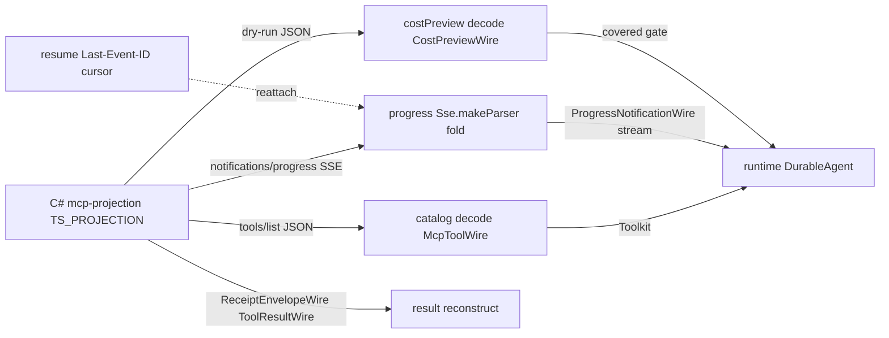

# [SERVICES_MCP]

The node-tier MCP agent transport — `McpTransport`, the consumer of the C# MCP serving surface that decodes the host tool catalog into an `@effect/ai` `Toolkit`, drains the progress server-stream off the SSE leg, reads the dry-run cost preview before a call, and reconstructs the structured tool result through the host's receipt envelope. The transport drives the host's capability registry over MCP without re-minting a tool catalog: the catalog, the cost preview, the progress frames, and the receipt envelope are the C# `csharp:Rasm.AppHost/Agent/mcp#TS_PROJECTION` settled shapes decoded at the `interchange` boundary, and the resume token replays through the SDK `Last-Event-ID` cursor. The wire vocabulary is single-minted by the C# branch; this page DECODES the settled `*Wire` shapes into `effect/Schema` carriers and never reconstructs the frame union from the raw SDK notification — a second mint of any `*Wire` shape is the named cross-language drift defect. This page is the second member of the one `./agent` subpath closure; it is node-only and crosses the .NET wire only through the decoded host projection.

## [01]-[INDEX]

- [01]-[MCP_TRANSPORT]: owns the decode of the host tool-catalog into an `@effect/ai` `Toolkit`, the progress SSE fold, the cost-preview gate, the receipt reconstruction, and the resume-token replay.

## [02]-[MCP_TRANSPORT]

- Owner: `McpTransport`, the node-tier consumer of the C# MCP serving surface — `catalog` decodes the host `McpToolWire` tool list into an `@effect/ai` `Toolkit`, `progress` folds the `ProgressNotificationWire` SSE server-stream, `costPreview` reads the `CostPreviewWire` dry-run pricing before a call, `result` reconstructs the structured tool result through the host `ReceiptEnvelopeWire<ToolResultWire>`, and `resume` replays the cursor through the SDK `Last-Event-ID` resumption. The transport is one consumer over the host projection, never a parallel MCP client per tool.
- Cases: the transport decodes the host `tools/list` JSON into the `McpToolWire` carrier (the descriptor JSON Schema plus the `readOnlyHint`/`destructiveHint`/`idempotentHint`/`approvalRequired` effect annotations and the `estimatedCost` vector) and lifts each decoded descriptor into one `@effect/ai` `Tool.make` whose only agent-facing parameter is the host `payload` (the host JSON Schema is the validating authority, mirroring the C# `CommandAIFunction` whose sole input is `payload`, so the transport carries no static parameter mirror of a host descriptor) and whose `annotate(Tool.Readonly|Destructive|Idempotent, …)` reference annotations transcribe the host effect hints, collected through `Toolkit.make(...tools)` into one `Toolkit` the `runtime#AGENT_RUNTIME` `DurableAgent` drives — the catalog is the host's own projection decoded once, never a re-minted branch-side tool definition; the `progress` arm decodes the `ProgressNotificationWire` server-stream off the SSE leg by feeding the raw SSE event `data` through the `@effect/experimental` `Sse.makeParser` into a `Stream` fold, reading the `notifications/progress` notification value directly rather than reconstructing the `ProgressFrameWire` union from the SDK; the `costPreview` arm decodes the `CostPreviewWire` dry-run pricing before a call so the agent gates on `covered` before dispatch; the structured tool result reconstructs through the host `ReceiptEnvelopeWire<ToolResultWire>`, the envelope owned at `csharp:Rasm.AppHost/Runtime/ports#TS_PROJECTION` and decoded by the `interchange` `ReceiptEnvelopeCarrier`; the resume token (`ResumeTokenWire`, the session/tool/lastLogical/physical tuple) lets the transport reattach by replaying the cursor through the SDK `Last-Event-ID` resumption, the `@effect/experimental` `Sse.Retry.lastEventId` carrying the reattach cursor. Every `*Wire` shape decoded here is single-minted by the C# branch; the `effect/Schema` carrier is a decode of the settled fence, never a second mint.
- Entry: the transport rides the same `execution/backplane#RUNNER_AND_SCHEDULING` substrate; the agent runs as a durable unit on `execution/engine#ENGINE` and journals through `execution/ai#AI_ACTIVITY` `AgentJournal`; the transport decodes the C# `csharp:Rasm.AppHost/Agent/mcp#TS_PROJECTION` `McpToolWire`/`ProgressNotificationWire`/`ProgressFrameWire`/`CostPreviewWire`/`ResumeTokenWire` shapes and the host `ReceiptEnvelopeWire<ToolResultWire>` off the `interchange` boundary, never re-minting the tool catalog or the frame union; the lifted `Toolkit` enters the `runtime#AGENT_RUNTIME` `DurableAgent` as the host-driven tool surface, distinct from the agent's own `AgentToolkit`; a `Turn` on `session#SESSION_ACTORS` that drives a host tool reaches this transport, the only .NET-wire contact of the agent-session actor.
- Wire: the transport's only .NET-wire contact is the decoded host MCP projection — the tool catalog (`McpToolWire`), the live progress value (`ProgressNotificationWire`), the buffered replay frame (`ProgressFrameWire`), the cost preview (`CostPreviewWire`), the resume cursor (`ResumeTokenWire`), and the receipt envelope (`ReceiptEnvelopeWire<ToolResultWire>`) are the C# branch's settled shapes consumed at the `interchange` decoded boundary; the transport reconstructs nothing from the raw SDK frame and re-mints no tool catalog. The `ToolResultWire` payload shape is the `mcp-projection` `ToolResult` record (`Tool`/`Content`/`IsError`/`Correlation`) single-minted at `csharp:Rasm.AppHost/Agent/mcp#TS_PROJECTION` and ridden as the `TPayload` of the existing `ReceiptEnvelopeWire`; the transport decodes the structured `content` blocks and the `isError` flag against the producer mint, never re-spelling the envelope and never authoring a second `ToolResultWire`.
- Packages: `@effect/ai` for the `Tool.make`/`Toolkit.make`/`tool.annotate(Tool.Readonly|Destructive|Idempotent, …)` lift of the host catalog, `@effect/experimental` for the `Sse.makeParser`/`Sse.Retry` SSE decode and the `Last-Event-ID` reattach cursor, `@effect/rpc` for the in-process edge, `effect` for the `Schema` wire-decode carriers, the progress `Stream` fold, and the cost-preview gate.
- Growth: a new host tool surfaces as one decoded `McpToolWire` lifted into one `Tool.make` row, never a hand-built branch-side tool; a new progress frame lands as one `ProgressFrameWire` literal the C# branch mints first and this decode mirrors, never a reconstructed frame; a new effect hint lands as one `tool.annotate` reference; the transport reattaches by one resume-token replay, never a parallel cursor.
- Boundary: the named defects — a branch-side MCP tool definition divorced from the host descriptor; a reconstructed `ProgressFrameWire` union from the SDK notification instead of decoding the host shape; a re-minted tool catalog instead of decoding the host projection; a second mint of any `*Wire` shape beside the C#-owned single mint; a hand-mirrored `ReceiptEnvelopeWire` beside the `interchange`-owned envelope; a parallel MCP client beside the one transport; a static parameter-schema mirror of a host descriptor instead of the host-validated `payload` passthrough. This is a node-only surface, never browser-reachable; the transport reads and decodes, and emits intents only through the host MCP surface, never a second transport.

```ts contract
import type { Stream } from "effect"
import { Tool, Toolkit } from "@effect/ai"
import { Sse } from "@effect/experimental"
import { Effect, Match, Option, Schema } from "effect"

class McpTransportFault extends Schema.TaggedError<McpTransportFault>()("McpTransportFault", {
  stage: Schema.Literal("catalog", "progress", "cost", "receipt", "resume"),
  detail: Schema.String,
}) {}

const McpToolWire = Schema.Struct({
  name: Schema.String,
  title: Schema.String,
  inputSchema: Schema.Unknown,
  annotations: Schema.Struct({
    readOnlyHint: Schema.Boolean,
    destructiveHint: Schema.Boolean,
    idempotentHint: Schema.Boolean,
    approvalRequired: Schema.Boolean,
  }),
  estimatedCost: Schema.Record({ key: Schema.String, value: Schema.Number }),
})
type McpToolWire = Schema.Schema.Type<typeof McpToolWire>

const CostPreviewWire = Schema.Struct({
  tool: Schema.String,
  estimated: Schema.Record({ key: Schema.String, value: Schema.Number }),
  covered: Schema.Boolean,
  shortfallUnit: Schema.NullOr(Schema.String),
})
type CostPreviewWire = Schema.Schema.Type<typeof CostPreviewWire>

const ProgressNotificationWire = Schema.Struct({
  progress: Schema.Number,
  total: Schema.optional(Schema.Number),
  message: Schema.optional(Schema.String),
})
type ProgressNotificationWire = Schema.Schema.Type<typeof ProgressNotificationWire>

const ProgressFrameWire = Schema.Union(
  Schema.Struct({ kind: Schema.Literal("started"), tool: Schema.String, logical: Schema.Number }),
  Schema.Struct({ kind: Schema.Literal("progress"), fraction: Schema.Number, stage: Schema.String, logical: Schema.Number }),
  Schema.Struct({ kind: Schema.Literal("partial"), chunk: Schema.Unknown, logical: Schema.Number }),
  Schema.Struct({ kind: Schema.Literal("completed"), result: Schema.Unknown, logical: Schema.Number }),
  Schema.Struct({ kind: Schema.Literal("failed"), fault: Schema.String, logical: Schema.Number }),
  Schema.Struct({ kind: Schema.Literal("cancelled"), reason: Schema.String, logical: Schema.Number }),
)
type ProgressFrameWire = Schema.Schema.Type<typeof ProgressFrameWire>

const ResumeTokenWire = Schema.Struct({
  session: Schema.String,
  tool: Schema.String,
  lastLogical: Schema.Number,
  physical: Schema.String,
})
type ResumeTokenWire = Schema.Schema.Type<typeof ResumeTokenWire>

// ToolResultWire decodes the producer single mint at Agent/mcp#TS_PROJECTION
// (the ToolResult Tool/Content/IsError/Correlation projection ridden as the ReceiptEnvelopeWire
// TPayload); the carrier below is the effect/Schema decode of that fence, never a second mint.
const ToolResultWire = Schema.Struct({
  tool: Schema.String,
  content: Schema.Array(Schema.Unknown),
  isError: Schema.Boolean,
  correlation: Schema.String,
})
type ToolResultWire = Schema.Schema.Type<typeof ToolResultWire>

interface McpTransport {
  readonly catalog: Effect.Effect<Toolkit.Toolkit<Record<string, Tool.Any>>, McpTransportFault>
  readonly progress: (token: ResumeTokenWire) => Stream.Stream<ProgressNotificationWire, McpTransportFault>
  readonly costPreview: (tool: string, params: unknown) => Effect.Effect<CostPreviewWire, McpTransportFault>
  readonly result: (tool: string, params: unknown) => Effect.Effect<ToolResultWire, McpTransportFault>
  readonly resume: (token: ResumeTokenWire) => Stream.Stream<ProgressNotificationWire, McpTransportFault>
}

const decodeToolWire = Schema.decodeUnknown(McpToolWire)
const decodeCostWire = Schema.decodeUnknown(CostPreviewWire)
const decodeNotificationWire = Schema.decodeUnknown(ProgressNotificationWire)
const decodeResultWire = Schema.decodeUnknown(ToolResultWire)
// ProgressFrameWire is the host-buffered interior frame; the live SSE stream and the resume replay
// both cross as ProgressNotificationWire through the host ToNotification seam, so the transport
// decodes the frame only for buffered-frame introspection, never to reconstruct the live stream.
const decodeFrameWire = Schema.decodeUnknown(ProgressFrameWire)

const liftTool = (wire: McpToolWire): Tool.Any =>
  Tool.make(wire.name, {
    description: wire.title,
    parameters: { payload: Schema.Unknown },
    success: ToolResultWire,
    failure: McpTransportFault,
  })
    .annotate(Tool.Title, wire.title)
    .annotate(Tool.Readonly, wire.annotations.readOnlyHint)
    .annotate(Tool.Destructive, wire.annotations.destructiveHint)
    .annotate(Tool.Idempotent, wire.annotations.idempotentHint)

const liftCatalog = (rows: ReadonlyArray<unknown>): Effect.Effect<Toolkit.Toolkit<Record<string, Tool.Any>>, McpTransportFault> =>
  Effect.forEach(rows, (row) =>
    decodeToolWire(row).pipe(
      Effect.mapError((cause) => new McpTransportFault({ stage: "catalog", detail: String(cause) })),
      Effect.map(liftTool),
    )).pipe(Effect.map((tools) => Toolkit.make(...tools)))

const foldProgress = (events: Stream.Stream<Sse.AnyEvent, never>): Stream.Stream<ProgressNotificationWire, McpTransportFault> =>
  events.pipe(
    Stream.filterMap((event) =>
      Match.value(event).pipe(
        Match.when({ _tag: "Event", event: "notifications/progress" }, (e) => Option.some(e.data)),
        Match.orElse(() => Option.none<string>()),
      )),
    Stream.mapEffect((data) =>
      decodeNotificationWire(JSON.parse(data)).pipe(
        Effect.mapError((cause) => new McpTransportFault({ stage: "progress", detail: String(cause) })),
      )),
  )

const reattachCursor = (event: Sse.AnyEvent): Option.Option<string> =>
  Sse.Retry.is(event) ? Option.fromNullable(event.lastEventId) : Option.none()

const decodeCost = (raw: unknown): Effect.Effect<CostPreviewWire, McpTransportFault> =>
  decodeCostWire(raw).pipe(
    Effect.mapError((cause) => new McpTransportFault({ stage: "cost", detail: String(cause) })),
  )

const decodeResult = (envelope: { readonly payload: unknown }): Effect.Effect<ToolResultWire, McpTransportFault> =>
  decodeResultWire(envelope.payload).pipe(
    Effect.mapError((cause) => new McpTransportFault({ stage: "receipt", detail: String(cause) })),
  )
```



## [03]-[RESEARCH]

- [TOOL_RESULT_WIRE_MINT]: [COMPLETE] — the `ReceiptEnvelopeWire<ToolResultWire>` `TPayload` is producer-minted at `csharp:Rasm.AppHost/Agent/mcp#[5]-[TS_PROJECTION]`, whose Owner line names `ToolResultWire` (the `ToolResult` `Tool`/`Content`/`IsError`/`Correlation` projection) beside `McpToolWire`/`ProgressNotificationWire`/`ProgressFrameWire`/`CostPreviewWire`/`ResumeTokenWire`. The `result` arm decodes that single mint through `effect/Schema`, never authoring a second `ToolResultWire`. Every `*Wire` carrier on this page decodes a producer-named single mint; the decode is settled.
