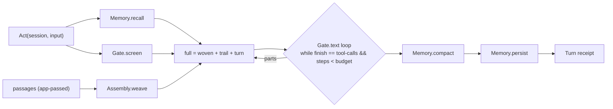

# [AI_ACTOR]

An agent is a policy value driven by one loop and hosted as a durable entity: `Agent.run` recalls the session, weaves fresh retrieval context, screens the turn once, then iterates gated generation — merging each response's parts back into the prompt while the model keeps calling tools — under a step budget, and closes by compacting and persisting the trail. The turn protocol is one schema triple — session key and input in, `Turn` receipt or `AgentFault` out — spelled from one declaration set into two forms: `Act`, the `Schema.TaggedRequest` that lifts into a toolkit row through `Tool.fromTaggedRequest` (agents composable as tools of other agents), and the `work` entity message row the app root mints from the same schemas, so one entity per session key serializes turns and memory needs no lock. Everything the loop consumes is a settled folder surface: the gate admits, the weave assembles, the budget bounds, memory remembers.

## [1]-[INDEX]

| [INDEX] | [CLUSTER]  | [OWNS]                                                          |
| :-----: | :--------- | :---------------------------------------------------------------|
|  [01]   | [LOOP]     | the agent policy, the step loop, and the fault fold              |
|  [02]   | [DURABLE]  | the `Act`/`Turn` protocol and the `work`-entity hosting law      |

## [2]-[LOOP]

[LOOP]:
- Owner: `Agent.run(policy)(call)` — one turn end-to-end: `Memory.recall` yields the stored trail (turns only), `Assembly.weave` builds the fresh system-plus-passages context from the call's app-passed passages, `Gate.screen` admits the raw input once, and the loop iterates `Gate.text` over the full prompt — each step merges `Prompt.fromResponseParts(response.content)` into both the full prompt and the trail, folds usage, and continues while `finishReason` is `"tool-calls"` and steps remain — then `Memory.compact` and `Memory.persist` close the turn and the `Turn` receipt settles.
- Law: context is re-woven every turn and never persisted — the trail carries the screened user line and the response parts only, so retrieval stays current per turn, the stored history stays model-portable, and a passage change between turns is invisible to memory by construction.
- Law: the step budget is the loop's `while`, not an interrupt — a spent budget with the model still calling tools settles by `onSpent`: `"fail"` mints `AgentFault` stage `budget`, `"settle"` returns the receipt whose `finish` still reads `"tool-calls"` — honest evidence the caller routes on; either way the trail persists, because a spent turn is still a turn.
- Law: tool safety is inherited, not re-implemented — the gate's structural admission governs every step, held `confirm`-class names ride the receipt's `held` list as the approval surface (the full call evidence lives in the persisted history the approver reads), and the supervised approval turn is a NEXT `Act` whose input answers the pause — the loop itself never blocks on a human.
- Law: the fault fold is a vocabulary row, never a switch — every upstream tag maps to an `AgentFault` stage through one table (`gate` for moderation, `budget` for the spend, `memory` for store and decode faults, `model` for the provider family), unmapped tags fall to `model`, and an already-folded `AgentFault` passes through untouched — so the protocol's failure channel is one wire-able family with routing evidence intact.
- Boundary: multi-agent orchestration is composition — an agent that consults another agent holds it as a toolkit row (`Tool.fromTaggedRequest(Act)` with `Agent.run` as the handler); no second orchestration surface exists.
- Entry: `Agent.run(policy)(call)`.
- Receipt: `Turn` — reply, steps, finish, usage triple, held names.
- Growth: a new loop concern (spend ceilings, reflection steps) is one policy field read inside the loop; a new fault route is one `_stages` row.
- Packages: `@effect/ai` (`LanguageModel`, `Prompt`, `Tokenizer`, `Tool`, `Toolkit`), `effect` (`Effect`, `Option`, `Schema`, `Struct`).



```typescript
import { type LanguageModel, Prompt, type Response, type Tokenizer, type Tool, type Toolkit } from "@effect/ai"
import { Effect, Option, Predicate, Schema, Struct } from "effect"
import { Gate } from "../model/provider.ts"
import { Assembly } from "../model/token.ts"
import { Safety } from "../tool/toolkit.ts"
import { Memory } from "./memory.ts"

const _FINISH = ["stop", "length", "content-filter", "tool-calls", "error", "pause", "other", "unknown"] as const

class _AgentFault extends Schema.TaggedError<_AgentFault>()("AgentFault", {
  stage: Schema.Literal("budget", "gate", "memory", "model"),
  detail: Schema.String,
}) {}

class _Turn extends Schema.Class<_Turn>("Turn")({
  reply: Schema.String,
  steps: Schema.Int.pipe(Schema.positive()),
  finish: Schema.Literal(..._FINISH),
  usage: Schema.Struct({
    input: Schema.Int.pipe(Schema.nonNegative()),
    output: Schema.Int.pipe(Schema.nonNegative()),
    total: Schema.Int.pipe(Schema.nonNegative()),
  }),
  held: Schema.Array(Schema.NonEmptyString),
}) {}

const _stages: Readonly<Record<string, _AgentFault["stage"]>> = {
  BadArgument: "memory",
  BudgetFault: "budget",
  GateFault: "gate",
  HttpRequestError: "model",
  HttpResponseError: "model",
  MalformedInput: "model",
  MalformedOutput: "model",
  ParseError: "memory",
  SystemError: "memory",
  UnknownError: "model",
}

const _isAgentFault = Schema.is(_AgentFault)

const _staged = (fault: unknown): _AgentFault["stage"] =>
  Predicate.hasProperty(fault, "_tag") && typeof fault._tag === "string" ? (_stages[fault._tag] ?? "model") : "model"

const _folded = (fault: unknown): _AgentFault =>
  _isAgentFault(fault) ? fault : new _AgentFault({ stage: _staged(fault), detail: String(fault) })

declare namespace Agent {
  type Act = _Act
  type Fault = _AgentFault
  type Turn = _Turn
  type Policy<Tools extends Record<string, Tool.Any>> = {
    readonly seed: string
    readonly allot: number
    readonly steps: number
    readonly onSpent: "fail" | "settle"
    readonly fold: Memory.Fold
    readonly gate: Gate.Policy
    readonly kit: Toolkit.Toolkit<Tools>
  }
  type Call = {
    readonly session: Memory.Key
    readonly input: string
    readonly passages: ReadonlyArray<Assembly.Passage>
  }
  type Context<Tools extends Record<string, Tool.Any>> =
    | LanguageModel.LanguageModel
    | Tokenizer.Tokenizer
    | Memory.Store
    | LanguageModel.ExtractContext<Gate.Woven<Tools>>
  type Shape = {
    readonly Act: typeof _Act
    readonly Fault: typeof _AgentFault
    readonly Turn: typeof _Turn
    readonly run: <Tools extends Record<string, Tool.Any>>(
      policy: Policy<Tools>,
    ) => (call: Call) => Effect.Effect<Turn, Fault, Context<Tools>>
  }
}

type _State = {
  readonly full: Prompt.Prompt
  readonly trail: Prompt.Prompt
  readonly steps: number
  readonly input: number
  readonly output: number
  readonly reply: string
  readonly finish: Option.Option<Response.FinishReason>
}

const _looped = <Tools extends Record<string, Tool.Any>>(
  policy: Agent.Policy<Tools>,
  start: { readonly full: Prompt.Prompt; readonly trail: Prompt.Prompt },
) => {
  const seed: _State = {
    full: start.full,
    trail: start.trail,
    steps: 0,
    input: 0,
    output: 0,
    reply: "",
    finish: Option.none<Response.FinishReason>(),
  }
  return Effect.iterate(seed, {
    while: (state) =>
      state.steps < policy.steps
      && Option.match(state.finish, { onNone: () => true, onSome: (finish) => finish === "tool-calls" }),
    body: (state) =>
      Effect.map(Gate.text(policy.gate)({ prompt: state.full, toolkit: policy.kit }), (response) => ({
        full: Prompt.merge(state.full, Prompt.fromResponseParts(response.content)),
        trail: Prompt.merge(state.trail, Prompt.fromResponseParts(response.content)),
        steps: state.steps + 1,
        input: state.input + (response.usage.inputTokens ?? 0),
        output: state.output + (response.usage.outputTokens ?? 0),
        reply: response.text,
        finish: Option.some(response.finishReason),
      })),
  })
}

const _run = <Tools extends Record<string, Tool.Any>>(policy: Agent.Policy<Tools>) =>
  (call: Agent.Call): Effect.Effect<_Turn, _AgentFault, Agent.Context<Tools>> =>
    Effect.mapError(
      Effect.gen(function* () {
        const trail = yield* Memory.recall(call.session)
        const woven = yield* Assembly.weave({ system: policy.seed, passages: call.passages, allot: policy.allot })
        const line = yield* Gate.screen(policy.gate, call.input)
        const note = Prompt.make(line)
        const settled = yield* _looped(policy, {
          full: Prompt.merge(Prompt.merge(woven, trail), note),
          trail: Prompt.merge(trail, note),
        })
        const spent = settled.steps >= policy.steps
          && Option.match(settled.finish, { onNone: () => false, onSome: (finish) => finish === "tool-calls" })
        yield* Effect.when(
          Effect.fail(new _AgentFault({ stage: "budget", detail: "<steps>" })),
          () => spent && policy.onSpent === "fail",
        )
        const folded = yield* Memory.compact(settled.trail, policy.fold)
        yield* Memory.persist(call.session, folded.prompt, folded.digest)
        const admitted = Safety.admit(policy.gate.tools.mode, policy.gate.tools.table, Struct.keys(policy.kit.tools))
        return new _Turn({
          reply: settled.reply,
          steps: settled.steps,
          finish: Option.getOrElse(settled.finish, () => "unknown" as const),
          usage: { input: settled.input, output: settled.output, total: settled.input + settled.output },
          held: admitted.held,
        })
      }),
      _folded,
    )
```

## [3]-[DURABLE]

[DURABLE]:
- Owner: the `Act` request — session key (the `Session` field schema itself, so the protocol and the store cannot drift), input line, `Turn` success, `AgentFault` failure, all in one `Schema.TaggedRequest` declaration whose structural `Equal` over the payload is the dedup identity any batching or mailbox seam consumes.
- Law: hosting is a `work` entity per session key — the entity's mailbox executes turns through `Agent.run`, single-writer per key, so turn order, memory consistency, and the persist-then-reply discipline are entity facts rather than lock code; the entity's message row is minted from the SAME schema triple this page owns (the payload fields, `Turn`, `AgentFault`) in the `work` protocol form at the app root, while `Act` is the triple's `Schema.TaggedRequest` form for the tool lift and in-process batching — one vocabulary, two protocol spellings, zero re-statement of any schema. The entity's handler enriches each turn with per-turn passages (the host app's retrieval step) before invoking the loop, because passages are values, not wire payload.
- Law: durability is the entity's, statelessness is the loop's — `Agent.run` holds no state between calls (memory is the store row, context is re-woven), so an entity restart replays nothing and resumes exactly at the last persisted trail; snapshot/restore machinery is unnecessary by construction.
- Law: the same declaration is a tool — `Tool.fromTaggedRequest(Act)` lifts the protocol into a toolkit row whose handler is `Agent.run`, so agent-calls-agent composes through the ordinary toolkit lane under the same safety postures, and a supervisor agent is policy, not architecture.
- Law: `ai` types the protocol, `work` executes it — this page names no cluster surface; the entity definition, its fenced registration policy, storage, and runner rows are `work/engine`'s charter, and the app root binds the turn protocol to an entity there under the work page's own registration vocabulary.
- Boundary: fleet concerns — sharding the session space, entity idle timeout, mailbox depth — are `work`'s; per-provider failover inside a turn is `Provider.plan` composed by the app root around the entity's runtime.
- Entry: `Act` (the protocol); `Agent.run` (the executor the host binds).
- Growth: a new agent capability is a policy field or a toolkit row; a new protocol verb (inspect, replay) is one sibling `Schema.TaggedRequest` beside `Act` in the entity's mailbox union.
- Packages: `@effect/ai` (`Tool`), `effect` (`Schema`).

```typescript
class _Act extends Schema.TaggedRequest<_Act>()("Act", {
  failure: _AgentFault,
  success: _Turn,
  payload: {
    session: Memory.Session.fields.key,
    input: Schema.NonEmptyString,
  },
}) {}

const Agent: Agent.Shape = {
  Act: _Act,
  Fault: _AgentFault,
  Turn: _Turn,
  run: _run,
}

// --- [EXPORTS] --------------------------------------------------------------------------

export { Agent }
```
