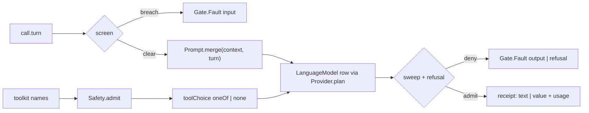

# [AI_PROVIDER]

A provider is one row, never a fork: the five `@effect/ai-*` Layer families fold onto one capability-asymmetry table whose rows carry the client Layer, the model constructor, and the asymmetry cells as data — every row's `stand` resolves the same `LanguageModel.LanguageModel` + `Model.ProviderName` pair over the same `HttpClient.HttpClient` requirement, so provider choice, failover, and cost attribution are Layer selection, an `ExecutionPlan` ladder, and a `Usage` fold rather than five APIs. ONE guardrail gate sits over every row: the input screen scans the untrusted user turn before any call, tool admission is structural — `Safety.admit` restricts `toolChoice` so a withheld tool is unnameable, never intercepted — the output sweep scans the settled text, and the object modality admits model refusal as a typed outcome through a `Schema.Union` arm instead of a parse crash. No generation call in the branch reaches a model except through this gate.

## [1]-[INDEX]

| [INDEX] | [CLUSTER] | [OWNS]                                                                                  |
| :-----: | :-------- | :--------------------------------------------------------------------------------------- |
|  [01]   | [ROWS]    | the five provider rows + the capability-asymmetry cells as data                           |
|  [02]   | [ROUTING] | the tier-routing `ExecutionPlan` ladder + the `Spend` cost fold                           |
|  [03]   | [GATE]    | the one guardrail gate — screen, structural tool admission, sweep, refusal admission      |

## [2]-[ROWS]

[ROWS]:
- Owner: the interior `_rows` table keyed by provider id — each row carries `cells` (the asymmetry columns as literals: `embed` curated/raw/none, `stream` events/re-emit/binary, `tokens` value/keyed/none, `tools` roster width, `trace` telemetry-module presence), `client` (the provider's `layerConfig` transport Layer, credentials as `Config.redacted` reads resolved at the root), and `stand(model, tuning?)` — the provider's `model()` constructor provided with its own client, yielding one uniform `Layer<LanguageModel | ProviderName, ConfigError, HttpClient>`. The exported `Provider` spreads the rows, so `Provider.anthropic.stand(...)` keeps each row's own tuning type while the guard pair holds every row to the base shape.
- Law: each client Layer is one hoisted const referenced by its row — diamond memoization by reference identity, so a row's `stand` and a direct `client` composition (the `embed/embedder` rows reuse `Provider.openai.client`) share one transport construction.
- Law: the tokenizer cells are load-bearing — `anthropic` and `openai` stand through `modelWithTokenizer` and annotate `Provider.Stood<Tokenizer.Tokenizer>`, so the meter rides the provides set type-visibly and `model/token` budgets bind with zero extra wiring; empty cells (`google`, `bedrock`, `openrouter`) fall to `model/token`'s default meter row.
- Law: per-request tuning is the provider's own `Config` Tag written through `stand`'s second parameter or scoped by the provider's `withConfigOverride` — the google row alone ships no override combinator (its `Config` Tag is set directly), and the bedrock row's transform Tag id is the upstream copy-paste spelling `@effect/ai-google/AmazonBedrockConfig`, respected verbatim wherever that Tag is named.
- Law: credentials never exist raw — every key is `Config.redacted` under the row's canonical variable name (`ANTHROPIC_API_KEY`, `OPENAI_API_KEY`, `GEMINI_API_KEY`, `AWS_ACCESS_KEY_ID`/`AWS_SECRET_ACCESS_KEY`/`AWS_REGION`, `OPENROUTER_API_KEY`); the app overrides names through the `host/config` provider chain, never through row edits. The bedrock row is node-lane only (SigV4 has no browser binding) — a runtime fact the app root's subpath selection owns.
- Law: `R` stays `HttpClient.HttpClient` on every row — the root satisfies it with the `host/net` lane client so provider egress inherits the branch timeout/retry/proxy posture; the row never names a runtime binding.
- Boundary: provider-defined tool rosters are `tool/toolkit`'s `Arsenal` rows; embedding row construction is `embed/embedder`'s; this page owns language-model standing alone.
- Growth: a sixth provider is one row — client const, cells literal, `stand` line — plus its `Arsenal` entries; nothing else in the folder changes.
- Packages: `@effect/ai-anthropic`, `@effect/ai-openai`, `@effect/ai-google`, `@effect/ai-amazon-bedrock`, `@effect/ai-openrouter`, `@effect/ai` (`Model`), `@effect/platform` (`HttpClient`), `effect` (`Config`, `Layer`).

```typescript
import { type AiError, LanguageModel, type Model, Prompt, type Response, type Tokenizer, type Tool, type Toolkit } from "@effect/ai"
import { AmazonBedrockClient, AmazonBedrockLanguageModel } from "@effect/ai-amazon-bedrock"
import { AnthropicClient, AnthropicLanguageModel } from "@effect/ai-anthropic"
import { GoogleClient, GoogleLanguageModel } from "@effect/ai-google"
import { OpenAiClient, OpenAiLanguageModel } from "@effect/ai-openai"
import { OpenRouterClient, OpenRouterLanguageModel } from "@effect/ai-openrouter"
import type { HttpClient } from "@effect/platform"
import { Array, BigDecimal, Config, type ConfigError, Data, Effect, ExecutionPlan, Layer, Option, type Schedule, Schema, Stream, Struct } from "effect"

const _anthropic = AnthropicClient.layerConfig({ apiKey: Config.redacted("ANTHROPIC_API_KEY") })
const _bedrock = AmazonBedrockClient.layerConfig({
  accessKeyId: Config.string("AWS_ACCESS_KEY_ID"),
  secretAccessKey: Config.redacted("AWS_SECRET_ACCESS_KEY"),
  region: Config.string("AWS_REGION"),
})
const _google = GoogleClient.layerConfig({ apiKey: Config.redacted("GEMINI_API_KEY") })
const _openai = OpenAiClient.layerConfig({ apiKey: Config.redacted("OPENAI_API_KEY") })
const _openrouter = OpenRouterClient.layerConfig({ apiKey: Config.redacted("OPENROUTER_API_KEY") })

const _rows = {
  anthropic: {
    cells: { embed: "none", stream: "events", tokens: "value", tools: 5, trace: false },
    client: _anthropic,
    stand: (model: string, tuning?: Omit<AnthropicLanguageModel.Config.Service, "model">): Provider.Stood<Tokenizer.Tokenizer> =>
      Layer.provide(AnthropicLanguageModel.modelWithTokenizer(model, tuning), _anthropic),
  },
  bedrock: {
    cells: { embed: "none", stream: "binary", tokens: "none", tools: 3, trace: false },
    client: _bedrock,
    stand: (model: string, tuning?: Omit<AmazonBedrockLanguageModel.Config.Service, "model">): Provider.Stood =>
      Layer.provide(AmazonBedrockLanguageModel.model(model, tuning), _bedrock),
  },
  google: {
    cells: { embed: "raw", stream: "re-emit", tokens: "none", tools: 4, trace: false },
    client: _google,
    stand: (model: string, tuning?: Omit<GoogleLanguageModel.Config.Service, "model">): Provider.Stood =>
      Layer.provide(GoogleLanguageModel.model(model, tuning), _google),
  },
  openai: {
    cells: { embed: "curated", stream: "events", tokens: "keyed", tools: 4, trace: true },
    client: _openai,
    stand: (model: string, tuning?: Omit<OpenAiLanguageModel.Config.Service, "model">): Provider.Stood<Tokenizer.Tokenizer> =>
      Layer.provide(OpenAiLanguageModel.modelWithTokenizer(model, tuning), _openai),
  },
  openrouter: {
    cells: { embed: "none", stream: "events", tokens: "none", tools: 0, trace: false },
    client: _openrouter,
    stand: (model: string, tuning?: Omit<OpenRouterLanguageModel.Config.Service, "model">): Provider.Stood =>
      Layer.provide(OpenRouterLanguageModel.model(model, tuning), _openrouter),
  },
} as const
```

## [3]-[ROUTING]

[ROUTING]:
- Owner: `Provider.plan(tiers)` — the ordered tier ladder as one `ExecutionPlan` value: each tier is a stood row plus its budget (`attempts`), curve (`schedule`), and gate (`while` over the `AiError` value), and `Effect.withExecutionPlan` attaches the whole ladder as one transformer that eliminates the model requirement from the governed call. A `catchAll` cascade re-standing providers by hand is the rejected spelling.
- Law: tier gates read the fault — a `while` admitting only `HttpRequestError`/`HttpResponseError` tags keeps schema faults (`MalformedInput`/`MalformedOutput`) from burning failover budget on a defect no second provider repairs; the gate is the family's own routing projection, never a foreign predicate.
- Law: `Provider.spend(usage, rate)` is the cost fold — token counts fold against a per-million `Rate` of `BigDecimal` prices (scale-6 construction, so per-million pricing is exact arithmetic with no division), and the `Spend` receipt carries counts and cost for the meter fact stream; prices are policy values the app passes, never literals baked into rows.
- Law: latency-and-cost tier selection is declaration order plus gates — the cheap row leads, the deep row backs it, and the ladder's shape IS the routing policy; the active row is always recoverable at runtime by yielding `Model.ProviderName`. The openrouter row refines cost attribution through its verified `FinishPartMetadata.openrouter` slot (`usage.cost`, `provider`); the accessor path from a settled response to its finish part's metadata instance is the one RESEARCH residue, and the rate fold carries attribution meanwhile.
- Entry: `Provider.plan(tiers)`; `Provider.spend(usage, rate)`.
- Receipt: `Spend` — `{ input, output, total, cost }`.
- Packages: `effect` (`ExecutionPlan`, `BigDecimal`, `Array`, `Schedule`).

```typescript
declare namespace Provider {
  type Stood<Meter = never> = Layer.Layer<
    LanguageModel.LanguageModel | Model.ProviderName | Meter,
    ConfigError.ConfigError,
    HttpClient.HttpClient
  >
  type Name = keyof typeof _rows
  type Cells = (typeof _rows)[Name]["cells"]
  type Row = {
    readonly cells: {
      readonly embed: "curated" | "none" | "raw"
      readonly stream: "binary" | "events" | "re-emit"
      readonly tokens: "keyed" | "none" | "value"
      readonly tools: number
      readonly trace: boolean
    }
    readonly client: Layer.Layer<never, ConfigError.ConfigError, HttpClient.HttpClient>
    readonly stand: (model: string) => Stood
  }
  type Tier = {
    readonly stand: Stood
    readonly attempts?: number
    readonly schedule?: Schedule.Schedule<unknown, AiError.AiError>
    readonly while?: (fault: AiError.AiError) => boolean
  }
  type Plan = ExecutionPlan.ExecutionPlan<{
    provides: LanguageModel.LanguageModel | Model.ProviderName
    input: AiError.AiError
    error: ConfigError.ConfigError
    requirements: HttpClient.HttpClient
  }>
  type Rate = { readonly input: BigDecimal.BigDecimal; readonly output: BigDecimal.BigDecimal }
  type Spend = { readonly input: number; readonly output: number; readonly total: number; readonly cost: BigDecimal.BigDecimal }
  type Shape = typeof _rows & {
    readonly plan: (tiers: Array.NonEmptyReadonlyArray<Tier>) => Plan
    readonly spend: (usage: Response.Usage, rate: Rate) => Spend
  }
  type _Rows<T extends Record<Name, Row> = typeof _rows> = T
  type _Keys<K extends Name = keyof typeof _rows> = K
}

const Provider: Provider.Shape = {
  ..._rows,
  plan: (tiers) =>
    ExecutionPlan.make(
      ...Array.map(tiers, (tier) => ({
        provide: tier.stand,
        ...(tier.attempts !== undefined && { attempts: tier.attempts }),
        ...(tier.schedule !== undefined && { schedule: tier.schedule }),
        ...(tier.while !== undefined && { while: tier.while }),
      })),
    ),
  spend: (usage, rate) => {
    const input = usage.inputTokens ?? 0
    const output = usage.outputTokens ?? 0
    return {
      input,
      output,
      total: usage.totalTokens ?? input + output,
      cost: BigDecimal.sum(
        BigDecimal.multiply(BigDecimal.make(BigInt(input), 6), rate.input),
        BigDecimal.multiply(BigDecimal.make(BigInt(output), 6), rate.output),
      ),
    }
  },
}
```

## [4]-[GATE]

[GATE]:
- Owner: `Gate` — the one admission surface over every provider row, three modalities on one policy: `Gate.text` and `Gate.stream` return the package receipts, `Gate.object` returns the folded `{ value, usage, finish }` triple because refusal admission re-types the value channel. Policy is one value: `screen` (turn ceiling + deny patterns), `sweep` (settled-text deny patterns), `tools` (the `Safety` mode and the app's class table).
- Law: the screen scans the UNTRUSTED turn only — `call.prompt` is assembled context built from admitted values (`model/token`'s weave), `call.turn` is the raw user line; a breach mints `Gate.Fault` stage `input` before any model call, and a turn-free continuation call (the agent loop's tool rounds) skips the screen by shape, not by flag. `Gate.screen(policy, turn)` is the same fold standalone — the arm `agent/actor` runs once before its loop and any ingress admission reuses — so exactly one screen implementation exists.
- Law: tool admission is structural — `Safety.admit` partitions the toolkit's own name set under the policy mode, the allowed list becomes `toolChoice: { oneOf }`, an empty list becomes `"none"`, and a withheld tool is therefore unnameable by the model; a tool-free call passes `Toolkit.empty`. Handler resolution stays the package default inside the admitted set — held `confirm`-class rows re-enter only through `agent/actor`'s supervised pause.
- Law: refusal admission is a union arm — the object modality decodes `Schema.Union(shape, _Refusal)`, so a model that declines yields a typed `Refusal` case folded to `Gate.Fault` stage `refusal` carrying the model's own reason, and the caller's channel stays `A` or a routable fault, never parse garbage.
- Law: the sweep scans `response.text` after settlement and mints stage `output`; the streaming lane ships the screen and structural tool admission today, and its delta-scan sweep is a RESEARCH row — the stream part families (`TextStartPart`/`TextDeltaPart`/`TextEndPart`, discriminated on `part.type`) are verified, the delta payload member is not — recorded here, never worked around with an unverified fold.
- Law: every gate call inherits the package's GenAI span semantics (`Telemetry.addGenAIAnnotations` rides `ProviderOptions.span` inside each provider); the gate adds no second span — one generation, one span, exported by the root's telemetry plane.
- Boundary: the `Safety` vocabulary and the fail-closed class default are `tool/toolkit`'s; token budgets and context assembly are `model/token`'s; the agent loop that drives repeated gate calls is `agent/actor`'s.
- Entry: `Gate.text(policy)(call)`, `Gate.object(policy)(call)`, `Gate.stream(policy)(call)`, `Gate.screen(policy, turn)`.
- Growth: a new moderation rule is one policy pattern row; a new admission stage is one `Gate.Fault` stage literal plus its fold.
- Packages: `@effect/ai` (`LanguageModel`, `Prompt`, `Tool`, `Toolkit`), `effect` (`Data`, `Effect`, `Option`, `Schema`, `Stream`, `Struct`).



```typescript
import { Safety } from "../tool/toolkit.ts"

class _Refusal extends Schema.TaggedClass<_Refusal>()("Refusal", {
  reason: Schema.NonEmptyString,
}) {}

const _isRefusal = Schema.is(_Refusal)

class GateFault extends Data.TaggedError("GateFault")<{
  readonly stage: "input" | "output" | "refusal"
  readonly detail: string
}> {}

declare namespace Gate {
  type Fault = GateFault
  type Policy = {
    readonly screen: { readonly ceiling: number; readonly deny: ReadonlyArray<RegExp> }
    readonly sweep: { readonly deny: ReadonlyArray<RegExp> }
    readonly tools: { readonly mode: Safety.Mode; readonly table: Safety.Table }
  }
  type Call<Tools extends Record<string, Tool.Any>> = {
    readonly prompt: Prompt.Prompt
    readonly turn?: string
    readonly toolkit: Toolkit.Toolkit<Tools>
  }
  type Woven<Tools extends Record<string, Tool.Any>> = {
    readonly prompt: Prompt.RawInput
    readonly toolkit: Toolkit.Toolkit<Tools>
    readonly toolChoice: LanguageModel.ToolChoice<Extract<keyof Tools, string>>
  }
  type Object<A> = { readonly value: A; readonly usage: Response.Usage; readonly finish: Response.FinishReason }
  type Shape = {
    readonly Fault: typeof GateFault
    readonly screen: (policy: Policy, turn: string) => Effect.Effect<string, GateFault>
    readonly text: <Tools extends Record<string, Tool.Any>>(policy: Policy) => (call: Call<Tools>) => Effect.Effect<
      LanguageModel.GenerateTextResponse<Tools>,
      GateFault | LanguageModel.ExtractError<Woven<Tools>>,
      LanguageModel.LanguageModel | LanguageModel.ExtractContext<Woven<Tools>>
    >
    readonly object: <A, I extends Record<string, unknown>, R, Tools extends Record<string, Tool.Any>>(policy: Policy) => (
      call: Call<Tools> & { readonly shape: Schema.Schema<A, I, R>; readonly label?: string },
    ) => Effect.Effect<
      Object<A>,
      GateFault | LanguageModel.ExtractError<Woven<Tools>>,
      LanguageModel.LanguageModel | R | LanguageModel.ExtractContext<Woven<Tools>>
    >
    readonly stream: <Tools extends Record<string, Tool.Any>>(policy: Policy) => (call: Call<Tools>) => Stream.Stream<
      Response.StreamPart<Tools>,
      GateFault | LanguageModel.ExtractError<Woven<Tools>>,
      LanguageModel.LanguageModel | LanguageModel.ExtractContext<Woven<Tools>>
    >
  }
}

const _screened = (policy: Gate.Policy, turn: string): Effect.Effect<string, GateFault> =>
  turn.length > policy.screen.ceiling
    ? Effect.fail(new GateFault({ stage: "input", detail: "<ceiling>" }))
    : Option.match(Array.findFirst(policy.screen.deny, (rule) => rule.test(turn)), {
        onNone: () => Effect.succeed(turn),
        onSome: (rule) => Effect.fail(new GateFault({ stage: "input", detail: rule.source })),
      })

const _choice = <Tools extends Record<string, Tool.Any>>(
  policy: Gate.Policy,
  toolkit: Toolkit.Toolkit<Tools>,
): LanguageModel.ToolChoice<Extract<keyof Tools, string>> => {
  const split = Safety.admit(policy.tools.mode, policy.tools.table, Struct.keys(toolkit.tools))
  return Array.isNonEmptyReadonlyArray(split.allowed) ? { oneOf: split.allowed } : "none"
}

const _woven = <Tools extends Record<string, Tool.Any>>(
  policy: Gate.Policy,
  call: Gate.Call<Tools>,
): Effect.Effect<Gate.Woven<Tools>, GateFault> =>
  Effect.map(
    call.turn === undefined ? Effect.succeed(call.prompt) : Effect.map(_screened(policy, call.turn), (line) => Prompt.merge(call.prompt, Prompt.make(line))),
    (prompt) => ({ prompt, toolkit: call.toolkit, toolChoice: _choice(policy, call.toolkit) }),
  )

const _swept = <Tools extends Record<string, Tool.Any>>(
  policy: Gate.Policy,
  response: LanguageModel.GenerateTextResponse<Tools>,
): Effect.Effect<LanguageModel.GenerateTextResponse<Tools>, GateFault> =>
  Option.match(Array.findFirst(policy.sweep.deny, (rule) => rule.test(response.text)), {
    onNone: () => Effect.succeed(response),
    onSome: (rule) => Effect.fail(new GateFault({ stage: "output", detail: rule.source })),
  })

const Gate: Gate.Shape = {
  Fault: GateFault,
  screen: _screened,
  text: (policy) => (call) =>
    Effect.flatMap(_woven(policy, call), (options) =>
      Effect.flatMap(LanguageModel.generateText(options), (response) => _swept(policy, response))),
  object: (policy) => (call) =>
    Effect.flatMap(_woven(policy, call), (options) =>
      Effect.flatMap(
        LanguageModel.generateObject({
          ...options,
          schema: Schema.Union(call.shape, _Refusal),
          ...(call.label !== undefined && { objectName: call.label }),
        }),
        (response) =>
          Effect.flatMap(_swept(policy, response), () =>
            _isRefusal(response.value)
              ? Effect.fail(new GateFault({ stage: "refusal", detail: response.value.reason }))
              : Effect.succeed({ value: response.value, usage: response.usage, finish: response.finishReason })),
      )),
  stream: (policy) => (call) =>
    Stream.unwrap(Effect.map(_woven(policy, call), (options) => LanguageModel.streamText(options))),
}

// --- [EXPORTS] --------------------------------------------------------------------------

export { Gate, Provider }
```
