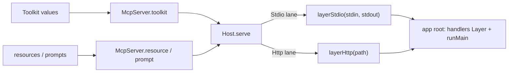

# [AI_MCP]

MCP is two lanes with one owner each and no overlap: hosting is native — `McpServer`/`McpSchema` project app toolkits as MCP tools with zero extra dependency, one transport row selected at the app root — and consumption is the reference SDK admitted for the client lane only, transcribed at the seam: `Scope`-bracketed connections, `Effect.tryPromise` per call with fiber interruption riding the request signal, and every result re-parsed through `effect/Schema` so no Zod-inferred shape and no raw `Promise` survives past this page. The SDK's `./server` subpath has no import site anywhere in the branch — hosting never moves off the native surface — and an external server's tools enter the app toolkit as ordinary rows whose handlers are `Remote.call`, indistinguishable to the model from local tools.

## [1]-[INDEX]

| [INDEX] | [CLUSTER] | [OWNS]                                                                    |
| :-----: | :-------- | :--------------------------------------------------------------------------|
|  [01]   | [HOST]    | native hosting — toolkit projection, capability mounts, the transport rows  |
|  [02]   | [CLIENT]  | the SDK client lane — scoped dial, typed calls, roster admission            |

## [2]-[HOST]

[HOST]:
- Owner: `Host.serve(spec)` — one assembly: the server identity (`name`, `version`), the transport lane, and the mount list merged into one `Layer` the root provides. Mounts are the package's own registration values — `McpServer.toolkit(kit)` projects a `Toolkit` as MCP tools (annotations become tool hints one-to-one), `McpServer.resource` registers a resource or a typed-parameter template (`McpSchema.param(id, schema)` spells the parameter), `McpServer.prompt({ name, parameters?, completion?, content })` registers a `Schema`-typed prompt — and `Host.serve` owns merge order and transport provision so no consumer composes `McpServer` internals twice.
- Law: the transport is a lane arm, never a fork — `Stdio` carries the byte stream pair, `Http` carries the router path, and both knob types derive from the package's own constructor parameters (`Parameters<typeof McpServer.layerStdio>[0]`), so a package option change lands here as compile pressure, not drift; `layerHttpRouter` is the variant row for mounting into an app-owned router, named here and selected the same way.
- Law: the stdio byte streams are boot-edge values — the app root passes its runtime's stdin `Stream` and stdout `Sink` rows into the lane; this page names no runtime binding, which is what keeps a hosted MCP server runtime-portable.
- Law: handler requirements survive assembly — a mounted toolkit's `Tool.HandlersFor` rides `R` through `Host.serve` to the root, where the app's `kit.toLayer(handlers)` Layer satisfies it; the serve signature subtracts exactly the served pair (`McpServer | McpServerClient`), so an unbound handler is a compile error at the composition root, never a runtime method-not-found.
- Law: `McpServer.elicit({ message, schema })` is the in-handler capability for server-requested structured input — its `ElicitationDeclined` outcome is a typed fault the handler folds, and it rides the same `McpServerClient` context the transport provides.
- Boundary: hosting selection (which apps expose MCP, on which transport) is the app root's, mirroring the `edge` assembly law; the toolkits themselves and their safety classes are `tool/toolkit`'s.
- Entry: `Host.serve(spec)`.
- Growth: a new transport is one lane arm; a new capability mount is one entry in the spec's mount list.
- Packages: `@effect/ai` (`McpServer`, `McpSchema`), `effect` (`Array`, `Data`, `Layer`).



```typescript
import { McpServer } from "@effect/ai"
import { Array, Data, Effect, Layer, Option, type ParseResult, Schema, type Scope } from "effect"

type _StdioLane = Parameters<typeof McpServer.layerStdio>[0]
type _HttpLane = Parameters<typeof McpServer.layerHttp>[0]
type _Served = McpServer.McpServer | McpServer.McpServerClient

type _Lane = Data.TaggedEnum<{
  Http: { readonly path: _HttpLane["path"] }
  Stdio: { readonly stdin: _StdioLane["stdin"]; readonly stdout: _StdioLane["stdout"] }
}>
const _Lane: Data.TaggedEnum.Constructor<_Lane> = Data.taggedEnum<_Lane>()

declare namespace Host {
  type Lane = _Lane
  type Spec<R> = {
    readonly name: string
    readonly version: string
    readonly lane: Lane
    readonly mounts: ReadonlyArray<Layer.Layer<never, never, R>>
  }
  type Shape = {
    readonly Lane: typeof _Lane
    readonly serve: <R>(spec: Spec<R>) => Layer.Layer<never, never, Exclude<R, _Served>>
  }
}

const Host: Host.Shape = {
  Lane: _Lane,
  serve: <R>(spec: Host.Spec<R>) => {
    const seed: Layer.Layer<never, never, R> = Layer.empty
    const transport: Layer.Layer<_Served> = _Lane.$match(spec.lane, {
      Http: ({ path }) => McpServer.layerHttp({ name: spec.name, version: spec.version, path }),
      Stdio: ({ stdin, stdout }) => McpServer.layerStdio({ name: spec.name, version: spec.version, stdin, stdout }),
    })
    return Layer.provide(Array.reduce(spec.mounts, seed, Layer.merge), transport)
  },
}
```

## [3]-[CLIENT]

[CLIENT]:
- Owner: `Remote` — the whole outbound lane: `Remote.dial` acquires a connected client as a scoped resource (connect on acquire, `close` on release, so a spawned server process or HTTP session dies with the scope on success, failure, and interruption alike), `Remote.roster` lists and decodes the server's tools through this page's own admission schema, `Remote.grade` projects the listed hints onto the `Safety` class vocabulary, and `Remote.call` is the one invocation primitive every projected tool's handler delegates to.
- Law: the seam transcribes, it never adopts — every SDK call rides `Effect.tryPromise` whose `signal` threads fiber interruption into the SDK's `RequestOptions`, faults fold into the one `McpFault` family (`connect`, `call`, `tool` stages with the server name as evidence), and every payload re-parses through `effect/Schema` — the Zod wire stays behind the seam, and `structuredContent` reaches domain code only as the caller's declared shape.
- Law: consuming an external tool means declaring its contract — the caller states `parameters` and `success` Schemas for each tool it projects (contract-first admission; the listed `inputSchema` is the server's claim, the declared Schema is the trust decision), builds the row with `Tool.make`, and binds `Remote.call` as its handler — after which the model cannot distinguish remote from local, and `Safety.admit` governs both identically with `Remote.grade` supplying the class suggestion (`destructiveHint` → `destroy`; read-only splits `search`/`read` on `openWorldHint`; the residue is `write`, and an ungraded name still falls to `tool/toolkit`'s fail-closed default).
- Law: transports discriminate on server locality — `Stdio` spawns a local server process (command, args, env, cwd as data), `Http` is the streamable remote transport whose optional `auth` slot consumes an app-passed `OAuthClientProvider` VALUE — the OAuth ceremony is composed by the app root from its own surfaces, because `ai` imports no `security` code; `InMemoryTransport.createLinkedPair()` is the dev-plane pair kit-driven specs wire, named here and imported only under `plane:dev`.
- Law: the SDK's `./server` subpath, `Zod` schemas as domain types, and a second MCP host are the three named rejections — the first has no import site, the second dies at the re-parse, the third is `[02]`'s monopoly.
- Exemption: the `try` thunks binding the SDK client and transport constructors are the platform-forced statement seam — the Promise world ends inside them.
- Entry: `Remote.dial(server)`; `Remote.roster(client, server)`; `Remote.call(options)`.
- Growth: a new transport is one lane arm; a new server capability (resources, prompts, completion) is one primitive beside `call` folding the matching SDK method through the same seam.
- Packages: `@modelcontextprotocol/sdk` (`Client`, `StdioClientTransport`, `StreamableHTTPClientTransport`), `effect` (`Data`, `Effect`, `Option`, `Schema`, `Scope`).

```typescript
import { Client } from "@modelcontextprotocol/sdk/client"
import type { OAuthClientProvider } from "@modelcontextprotocol/sdk/client/auth"
import { StdioClientTransport } from "@modelcontextprotocol/sdk/client/stdio"
import { StreamableHTTPClientTransport } from "@modelcontextprotocol/sdk/client/streamableHttp"
import type { Safety } from "./toolkit.ts"

class McpFault extends Data.TaggedError("McpFault")<{
  readonly stage: "call" | "connect" | "tool"
  readonly server: string
  readonly detail: string
}> {}

type _Link = Data.TaggedEnum<{
  Http: { readonly url: string; readonly auth?: OAuthClientProvider; readonly session?: string }
  Stdio: {
    readonly command: string
    readonly args?: ReadonlyArray<string>
    readonly cwd?: string
    readonly env?: Readonly<Record<string, string>>
  }
}>
const _Link: Data.TaggedEnum.Constructor<_Link> = Data.taggedEnum<_Link>()

const _Hints = Schema.Struct({
  destructiveHint: Schema.optionalWith(Schema.Boolean, { as: "Option" }),
  idempotentHint: Schema.optionalWith(Schema.Boolean, { as: "Option" }),
  openWorldHint: Schema.optionalWith(Schema.Boolean, { as: "Option" }),
  readOnlyHint: Schema.optionalWith(Schema.Boolean, { as: "Option" }),
})

const _Roster = Schema.Struct({
  tools: Schema.Array(Schema.Struct({
    name: Schema.NonEmptyString,
    description: Schema.optionalWith(Schema.String, { as: "Option" }),
    annotations: Schema.optionalWith(_Hints, { as: "Option" }),
  })),
})

const _Result = Schema.Struct({
  isError: Schema.optionalWith(Schema.Boolean, { as: "Option" }),
  structuredContent: Schema.optionalWith(Schema.Unknown, { as: "Option" }),
})

const _transport = (link: _Link) =>
  _Link.$match(link, {
    Http: ({ auth, session, url }) =>
      new StreamableHTTPClientTransport(new URL(url), {
        ...(auth !== undefined && { authProvider: auth }),
        ...(session !== undefined && { sessionId: session }),
      }),
    Stdio: ({ args, command, cwd, env }) =>
      new StdioClientTransport({
        command,
        ...(args !== undefined && { args: [...args] }),
        ...(cwd !== undefined && { cwd }),
        ...(env !== undefined && { env: { ...env } }),
      }),
  })

declare namespace Remote {
  type Fault = McpFault
  type Link = _Link
  type Server = { readonly name: string; readonly version: string; readonly link: Link }
  type Roster = Schema.Schema.Type<typeof _Roster>
  type Hints = Schema.Schema.Type<typeof _Hints>
  type Call<A, I, R> = {
    readonly client: Client
    readonly server: string
    readonly name: string
    readonly args: Readonly<Record<string, unknown>>
    readonly shape: Schema.Schema<A, I, R>
  }
  type Shape = {
    readonly Fault: typeof McpFault
    readonly Link: typeof _Link
    readonly dial: (server: Server) => Effect.Effect<Client, Fault, Scope.Scope>
    readonly roster: (client: Client, server: string) => Effect.Effect<Roster, Fault | ParseResult.ParseError>
    readonly grade: (hints: Hints) => Safety.Class
    readonly call: <A, I, R>(options: Call<A, I, R>) => Effect.Effect<A, Fault | ParseResult.ParseError, R>
  }
}

const Remote: Remote.Shape = {
  Fault: McpFault,
  Link: _Link,
  dial: (server) =>
    Effect.acquireRelease(
      Effect.tryPromise({
        try: (signal) => {
          const client = new Client({ name: server.name, version: server.version })
          return client.connect(_transport(server.link), { signal }).then(() => client)
        },
        catch: (defect) => new McpFault({ stage: "connect", server: server.name, detail: String(defect) }),
      }),
      (client) => Effect.promise(() => client.close()),
    ),
  roster: (client, server) =>
    Effect.flatMap(
      Effect.tryPromise({
        try: (signal) => client.listTools(undefined, { signal }),
        catch: (defect) => new McpFault({ stage: "call", server, detail: String(defect) }),
      }),
      Schema.decodeUnknown(_Roster),
    ),
  grade: (hints) =>
    Option.getOrElse(hints.destructiveHint, () => false)
      ? "destroy"
      : Option.getOrElse(hints.readOnlyHint, () => false)
        ? (Option.getOrElse(hints.openWorldHint, () => false) ? "search" : "read")
        : "write",
  call: (options) =>
    Effect.flatMap(
      Effect.flatMap(
        Effect.tryPromise({
          try: (signal) => options.client.callTool({ name: options.name, arguments: { ...options.args } }, undefined, { signal }),
          catch: (defect) => new McpFault({ stage: "call", server: options.server, detail: String(defect) }),
        }),
        Schema.decodeUnknown(_Result),
      ),
      (result) =>
        Option.getOrElse(result.isError, () => false)
          ? Effect.fail(new McpFault({ stage: "tool", server: options.server, detail: options.name }))
          : Option.match(result.structuredContent, {
              onNone: () => Effect.fail(new McpFault({ stage: "tool", server: options.server, detail: "<unstructured>" })),
              onSome: Schema.decodeUnknown(options.shape),
            }),
    ),
}

// --- [EXPORTS] --------------------------------------------------------------------------

export { Host, Remote }
```
