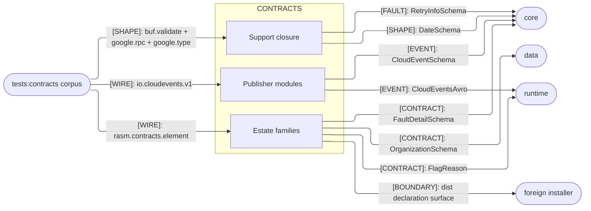

# [TS_CONTRACTS_ARCHITECTURE]

`contracts` is the branch's wire face and its one publishable package: `@rasm/contracts` ships the generated TypeScript SDK a foreign application installs without reaching a private folder. Buf authors every module from the corpus, so the folder holds no rank and no hand-written law; what it owns is the package shape carrying one emission to a workspace consumer and a tarball consumer alike. Validation, domain admission, and codec registration stay above it at the core interchange plane.

## [01]-[DOMAIN_MAP]

```text codemap
contracts/
├── .api/rasm-ts-contracts.md   # Proto-declaration to generated-symbol correspondence, and the censused entrypoints
└── gen/                        # Emission root Buf rewrites whole each run; no hand edit survives a regenerate
    ├── buf/validate/           # protovalidate rule descriptors every estate file descriptor names as a dependency
    ├── google/rpc/             # Retry and field-violation details the fault family embeds by reference
    ├── google/type/            # Calendar date, civil date-time, and time-of-day the property value family embeds
    ├── io/cloudevents/v1/      # Publisher event descriptors beside the frozen AVSC projection; both direct codec inputs
    └── rasm/contracts/         # Estate families at family/source_pb.ts, one module per proto source the closure reaches
```

## [02]-[STRATA]

- `@rasm/contracts` seats as an admitted import root, never a stratum — it ranks no branch folder and no branch folder ranks it.
- `gen/**` imports `@bufbuild/protobuf` and its own siblings alone; no branch folder, third-party package, or authored module reaches inside.
- `buf/validate`, `google/rpc`, and `google/type` are support closure Buf emits beside the elected roots, never a floor this folder designed.
- `io/cloudevents/v1` sits outside the estate closure — nothing generated imports it, and its consumers bind the module directly.
- `@rasm/core` carries `@rasm/contracts` as a `workspace:*` dependency, and the branch boundary suite refuses a `./contracts` subpath beside it.

## [03]-[SEAMS]



## [04]-[INTERNAL]

```mermaid
---
config:
  layout: elk
  flowchart:
    curve: linear
    padding: 25
---
flowchart LR
    accTitle: Contracts generation and distribution spine
    accDescr: How one elected root roster becomes a swept module tree, a censused catalogue, and a published tarball.
    Image([corpus descriptor image])
    Roots[root roster · elected per branch]
    Closure[closure · reachable descriptors]
    Sweep[gen · clean module tree]
    Assets[publisher assets · restored after sweep]
    Roster[catalogue · censused entrypoints]
    Build[dist · declarations and ESM]
    Pack([tarball])
    Image e1@-->|"filter: elected roots"| Roots
    Roots e2@-->|"expand: reachable descriptors"| Closure
    Closure e3@-->|"emit: one module per source"| Sweep
    Sweep e4@-->|"restore: frozen publisher bytes"| Assets
    Sweep e5@-->|"census: name, kind, origin"| Roster
    Sweep e6@-->|"compile: erasable sources"| Build
    Assets e7@-->|"project: readonly literal"| Build
    Build e8@-->|"pack: dist beside metadata"| Pack
```



Election rules the emission, not file selection: the roster names message roots and Buf expands their reachable descriptor closure, so a proto source contributes only the declarations that closure reaches. Sources whose siblings the roster never named arrive carrying a single message or enum, and the branch configures no service emitter, so the tree holds messages and enums alone while the corpus's own services stay unemitted here.

One wildcard carries two documents: the workspace manifest resolves committed TypeScript through `./gen/*.ts`, and `publishConfig` overlays the same subpath onto compiled declarations and ESM so a tarball consumer never sees a source tree. Compilation runs under an inverted root posture — `noEmit`, `rootDir`, and ts-extension resolution all restate at the emitting build rather than inherit.

Sweep-then-restore keeps one entrypoint canonical: Buf clears the out root whole on every run, and the frozen publisher bytes project back afterward, so a single generate command reconstructs the tree and a hand edit inside it never survives.

## [05]-[ROUTING]

| [INDEX] | [CHANGE]            | [OWNER_SURFACE]                  | [SHAPE_OF_THE_EDIT]                            |
| :-----: | :------------------ | :------------------------------- | :--------------------------------------------- |
|  [01]   | corpus declaration  | `tests/contracts/proto`          | one source edit, then regenerate               |
|  [02]   | emitted family      | `buf.gen.yaml` es type roster    | one root row on the `protoc-gen-es` plugin     |
|  [03]   | publisher asset     | `tests/contracts/vendor`         | replace the bytes, then regenerate             |
|  [04]   | runtime pin pair    | `pnpm-workspace.yaml` catalog    | one catalog row moved with its plugin pin      |
|  [05]   | package release     | `package.json`                   | one `version` bump on the workspace manifest   |
|  [06]   | emission root carve | root `tsconfig.json` + Biome     | one path row per lane reading the `gen/` tree  |

## [06]-[BOUNDARIES]

- `contracts` owns generated descriptor constants, decoded value types, and the exact publisher-asset projection; nothing above emission lands here.
- Corpus sources and frozen publisher bytes own wire shape, so a field, rule, or roster change lands there and regenerates.
- `buf.gen.yaml` owns which roots a branch emits, so widening the TypeScript surface is one root row and never a module authored here.
- Consumers own validation, domain admission, transport construction, event SDK projection, and Avro codec compilation.
- `core/interchange` alone registers estate descriptors; publisher descriptors stay direct codec inputs and enter no registry.
- `dist` is derived package output; `gen` stays the committed generation authority and never ships raw.
- Roster markers hold gate-emitted descriptor data; generator grammar stays the hand-maintained half of that catalogue.
- `@rasm/core` reaches this package by dependency, never by subpath — each folder package exports its own root alone.
