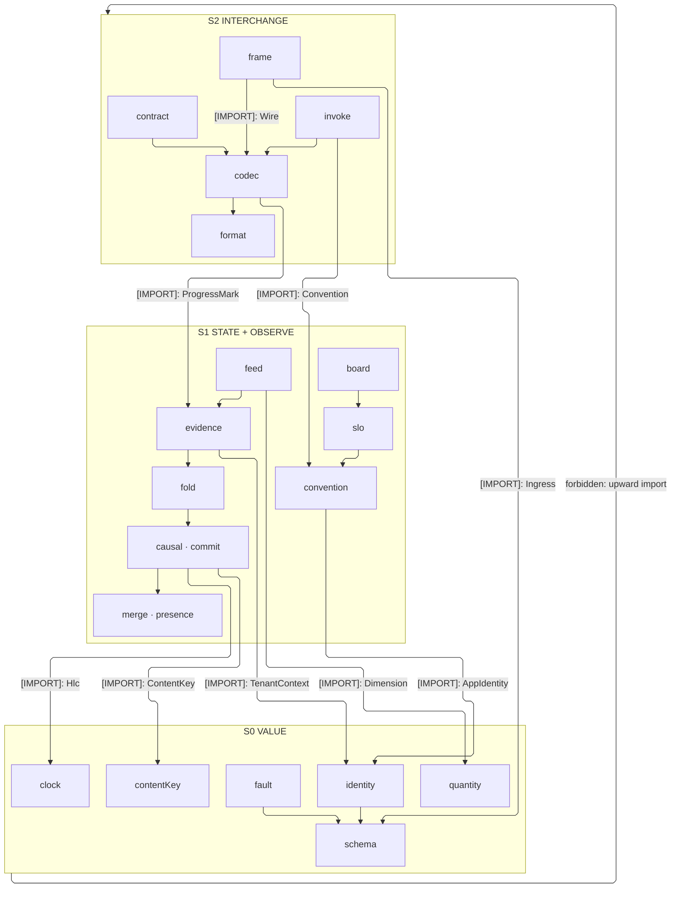
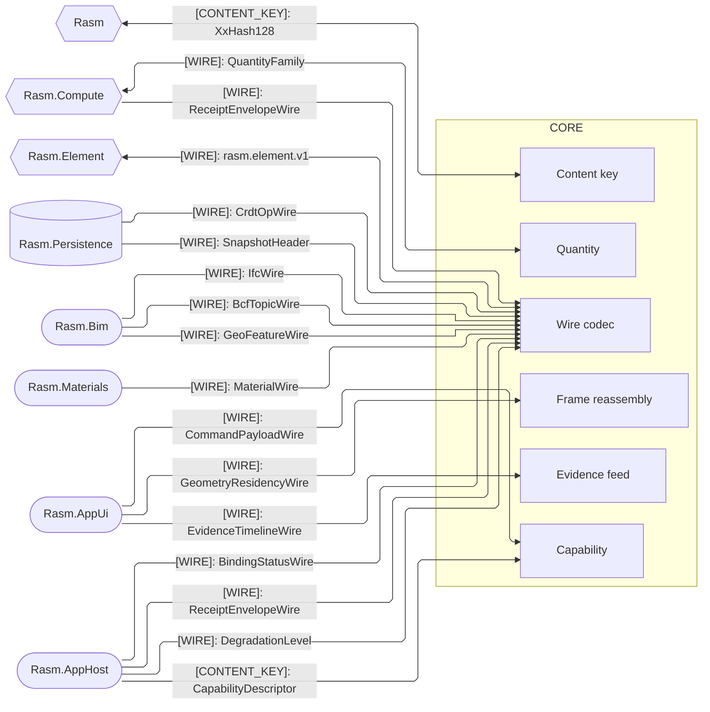
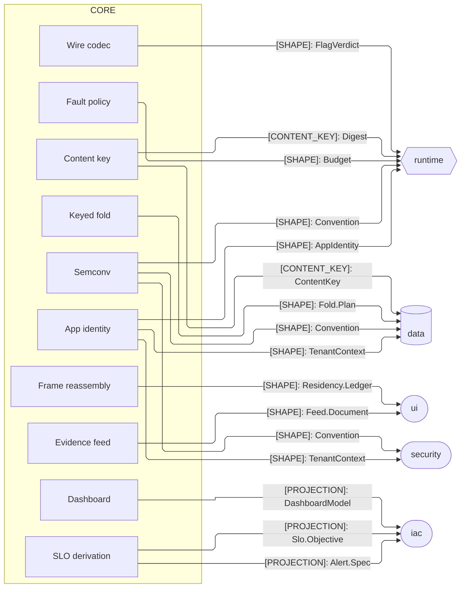

# [TS_CORE_ARCHITECTURE]

`core` is the branch's wave-0 vocabulary-and-law package: `value`, `state`, `interchange`, and `observe` meet through one content identity, one clock law, one fault vocabulary, and one keyed-decode wire registry. Core owns decode, vocabulary, and the capability dial — never serving or persistence. `value` roots the internal graph — every other sub-domain composes it and none feeds back.

## [01]-[DOMAIN_MAP]

```text codemap
core/
└── src/
    ├── value/            # Cross-language value floor — every brand decodes once and travels settled
    │   ├── schema.ts     # Refined branded-primitive vocabulary and the Ingress decode-budget ceilings
    │   ├── identity.ts   # AppIdentity deployment spine and the TenantContext scope key
    │   ├── contentKey.ts # One content-identity digest and the Digest engine beneath it
    │   ├── clock.ts      # Hlc hybrid-logical stamp and the Uncertainty grade windows
    │   ├── quantity.ts   # SI-coherent magnitude and its Dimension vector, canonicalized at admission
    │   └── fault.ts      # Fault severity vocabulary, the retry Budget ledger, and the Degrade ladder
    ├── state/            # Host-free state algebra over the value floor
    │   ├── merge.ts      # Lawful CRDT merge algebra and the Converge law surface
    │   ├── fold.ts       # Keyed-fold owner, the AsOf time coordinate, and the Replay memory lane
    │   ├── causal.ts     # Version-vector lattice, causal delivery buffer, and stability frontier
    │   ├── commit.ts     # Content-keyed commit graph, branch heads, and Merkle summaries
    │   ├── machine.ts    # Data-driven statechart, its macrostep fold, and the serializable actor
    │   ├── evidence.ts   # Decoded outcome family — receipts, progress, and availability
    │   ├── feed.ts       # Hlc-ordered evidence timeline and its column band
    │   └── presence.ts   # Actor-presence CRDT over proven merge rows
    ├── interchange/      # C#-minted wire plane — decode, vocabulary, and the capability dial; never serving
    │   ├── format.ts     # Byte-dialect engines behind one decode transform
    │   ├── codec.ts      # One keyed-decode registry over the closed wire-family census
    │   ├── frame.ts      # Frame reassembly, geometry tensor views, and the residency ledger under the Ingress budget
    │   ├── contract.ts   # Descriptor-drift diff into graded verdicts
    │   └── invoke.ts     # Capability dial and both directions of the command contract
    └── observe/          # Observability vocabulary and derivation; zero exporters live here
        ├── convention.ts # Typed semconv attribute, metric, and event vocabulary
        ├── slo.ts        # Objective/SLI algebra and the burn-rate alert derivation
        └── board.ts      # Dashboard model, query, pack/suite dispatch, and the live metric snapshot
```

## [02]-[STRATA]

- S0 `value` — mints the floor exactly once (`Refined` brands, `Hlc`, `ContentKey` under the `Digest` engine, `Quantity`/`Dimension`, `AppIdentity`/`TenantContext`, `Budget`) and imports no sibling sub-domain; `identity` and `fault` compose `schema`'s `Refined` vocabulary alone.
- S1 `state` — pure algebra over the value floor: `causal` composes `merge` and `Hlc`, `fold` composes `causal`, `evidence` mints `ProgressMark` over `fold` and `TenantContext`, `feed` orders `evidence` by `Hlc` under a `Dimension` band; `commit` rides with `causal` on `ContentKey`, `presence` with `merge`, and `machine` composes no interior sibling — the merge↔fold cycle never forms because `Fold.run` arrives as a caller parameter, never an import.
- S1 `observe` — vocabulary and derivation over `AppIdentity` alone: `convention` roots, `slo` derives `Alert`, `board` composes both into `DashboardModel`; peer to state with no edge between them.
- S2 `interchange` — the decode boundary composing all three: `format` proto engines under `codec`'s keyed registry, `frame`/`contract`/`invoke` over `Wire`, `frame` admitting under `Ingress`, `codec` landing `ProgressMark`, `invoke` landing `Convention`.



## [03]-[SEAMS]





## [04]-[ORGANIZATION]

One authority per concept and growth-as-row is the organization law: `value` mints each floor primitive exactly once and everything above composes it settled, `state` stays pure algebra whose one `AsOf` coordinate forbids a second replay vocabulary, `interchange` lands a new C#-minted wire family as one census row with its landing row — never a page — and `observe` owns vocabulary and derivation only. Exact delegating sites and per-owner wiring live on the owning implementation pages.

## [05]-[BOUNDARIES]

- Core imports nothing from the branch and nothing host-bound; every module runs identically under node, bun, and the browser.
- C# owns every `*Wire` shape; core decodes it verbatim, authors no wire, and lands each family's decoded shape once even for a later-wave consumer.
- Secret derivation is the security folder's concern; the digest engine here is content identity only.
- Persistence, serving, transport hosting, rendering, and exporters are later-wave concerns; core defines the shapes they carry and nothing they run.
