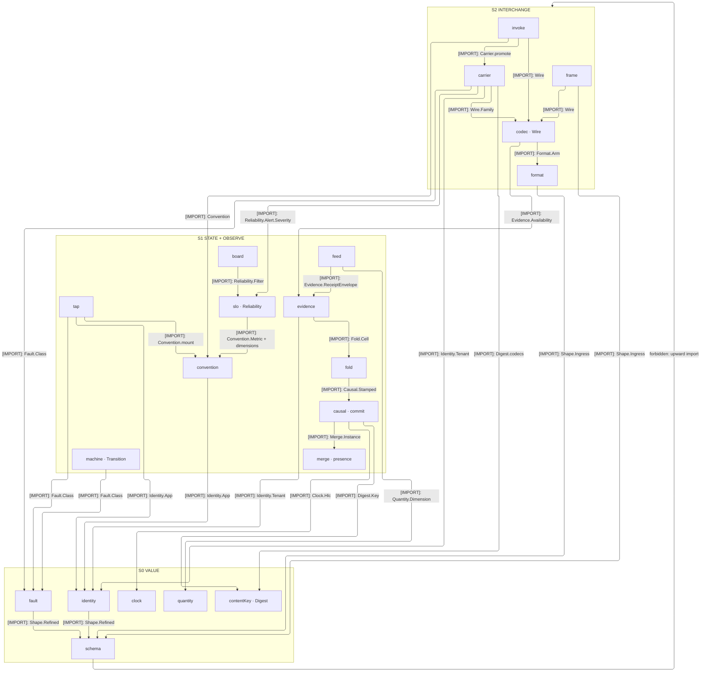
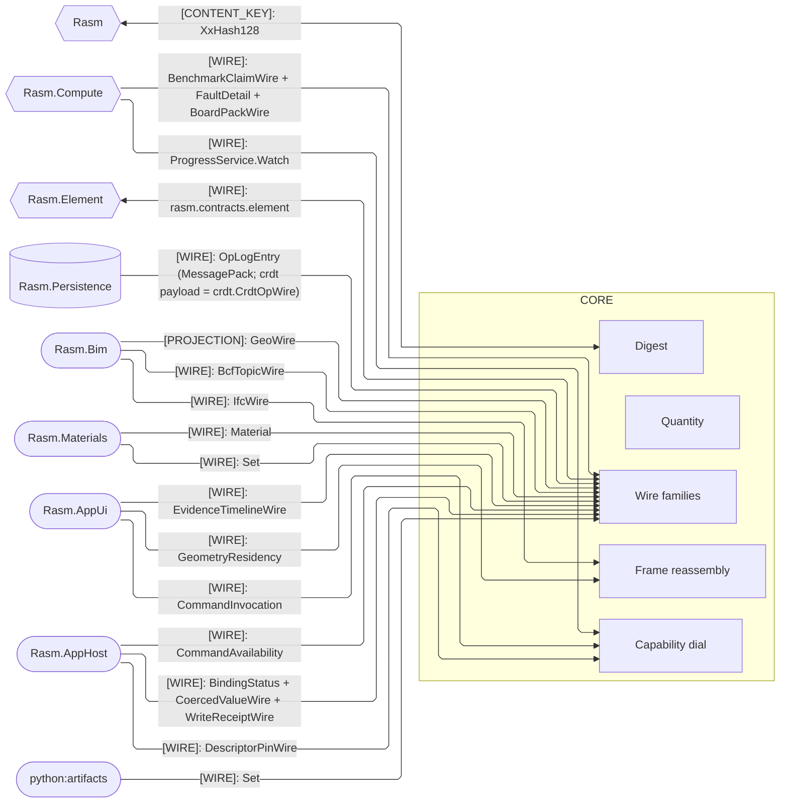
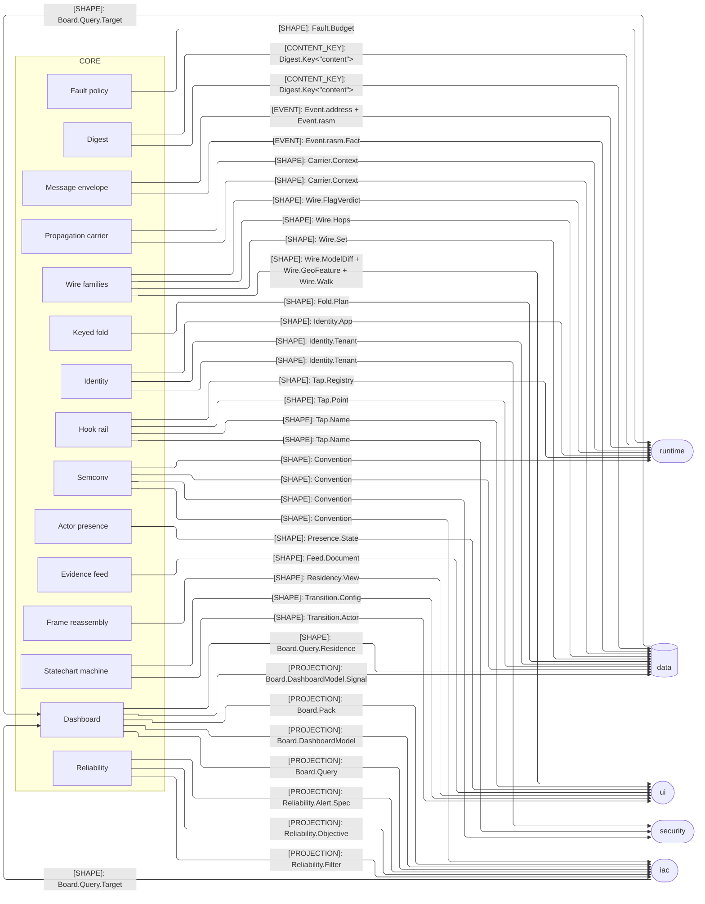
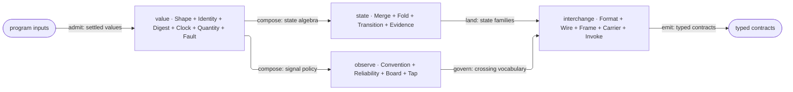

# [TS_CORE_ARCHITECTURE]

`core` is the branch's S0 vocabulary-and-law package: `value`, `state`, `interchange`, and `observe` meet through one content identity, one clock law, one fault vocabulary, and one keyed-decode wire registry. Core owns decode, vocabulary, and the capability dial, never serving or persistence. `value` roots the internal graph: every other sub-domain composes it and none feeds back.

## [01]-[DOMAIN_MAP]

```text codemap
core/
└── src/
    ├── value/            # Cross-language value floor — every brand decodes once and travels settled
    │   ├── schema.ts     # Shape vocabulary, Shape.Refined brands, and Shape.Ingress decode ceilings
    │   ├── identity.ts   # Identity.App deployment spine and the Identity.Tenant scope key
    │   ├── contentKey.ts # Digest engine and its Digest.Key content identity
    │   ├── clock.ts      # Clock.Hlc hybrid-logical stamp and Clock.Uncertainty windows
    │   ├── quantity.ts   # Quantity magnitude and its Quantity.Dimension vector, canonicalized at admission
    │   └── fault.ts      # Fault.Class vocabulary, Fault.Budget ledger, and Fault.Degrade ladder
    ├── state/            # Host-free state algebra over the value floor
    │   ├── merge.ts      # Lawful CRDT algebra and the Merge.Law table
    │   ├── fold.ts       # Keyed folds, Fold.AsOf, Fold.Replay, and Fold.Window
    │   ├── causal.ts     # Version-vector lattice, causal delivery buffer, and stability frontier
    │   ├── commit.ts     # Content-keyed commit graph, branch heads, and Merkle summaries
    │   ├── machine.ts    # Transition invocation, data-driven statechart, and host-neutral restore
    │   ├── evidence.ts   # Decoded outcomes, receipts, progress, and Evidence.Availability verdicts
    │   ├── feed.ts       # Feed.Entry union and the Feed.Document column band under one Clock.Hlc order
    │   └── presence.ts   # Actor-presence CRDT over proven merge rows
    ├── interchange/      # Contract wire plane — codecs over the generated contracts bindings and the capability dial; never serving
    │   ├── format.ts     # Byte-dialect engines behind one decode transform
    │   ├── codec.ts      # Wire families over one keyed-decode registry, the closed family roster, and one bounded tree walk
    │   ├── frame.ts      # Frame reassembly, geometry tensor views, and residency under Shape.Ingress ceilings
    │   ├── carrier.ts    # Carrier.Context total parse/print folds, transport dialect rows, and the extension-slot seat
    │   └── invoke.ts     # Capability dial and both directions of the command contract
    └── observe/          # Observability vocabulary and derivation; zero exporters live here
        ├── convention.ts # Typed semconv, metric, and event vocabulary with wire-name translation, the metric-plane roster, and one instrument mount
        ├── slo.ts        # Reliability owner — Objective schema class, Sli union over its role table, burn and severity rows, Alert.Spec compile
        ├── board.ts      # Dashboard model, the query algebra with its render targets, pack dispatch, metric snapshot
        └── tap.ts        # Hook-point name rows, the veto/observe/replay modality table, and the tap contract
```

## [02]-[STRATA]

- S0 `value` — mints the floor once; `identity` and `fault` compose only `Shape.Refined` from `schema`.
- S1 `state` — pure algebra over the value floor; the merge↔fold cycle never forms: `Fold.run` arrives as a caller parameter, never an import.
- S1 `commit` rides beside `causal` on `Digest.Key`; `presence` rides beside `merge`; `machine` composes no interior sibling.
- S1 `observe` — vocabulary and derivation over the value floor alone; peer to `state` with no edge between them.
- S1 depth law — interior chains rank by lowest shared consumer, never path length, so a five-deep import rail still seats one stratum.
- S2 `interchange` — `codec` is the one decode seat; siblings consume decoded `Wire` values and re-parse no bytes.
- S2 `carrier` takes the same census union type-only, so its typed-metadata roster closes against the wire families with no value edge.
- S2 `carrier` also seats the message envelope, since its extension slot IS a carrier frame and a second seat forks one attribute record.
- S2 `format` holds the ingress ceiling universal — every admitted message passes one bound, and no lane mints a private cap.
- S2 `format` seats the one `Validator` and descriptor registry — every message admits through `Format.proto.message`, and no sibling re-validates.


```mermaid
---
config:
  layout: elk
  flowchart:
    curve: linear
    padding: 25
---
flowchart TB
    accTitle: Core interior import strata
    accDescr: How the interior sub-domains rank onto the value floor, every import downward.
    subgraph S2["S2 INTERCHANGE"]
        Invoke[invoke]
        CarrierP[carrier]
        Codec[codec · Wire]
        Format[format]
        Frame[frame]
    end
    subgraph S1["S1 STATE + OBSERVE"]
        Tap[tap]
        Board[board]
        Reliability[slo · Reliability]
        Convention[convention]
        Feed[feed]
        Evidence[evidence]
        Transition[machine · Transition]
        Fold[fold]
        Causal["causal · commit"]
        Merge["merge · presence"]
    end
    subgraph S0["S0 VALUE"]
        Identity[identity]
        Quantity[quantity]
        Clock[clock]
        Digest[contentKey · Digest]
        Schema[schema]
        Fault[fault]
    end
    Codec e1@-->|"[IMPORT]: Format.Arm"| Format
    Codec e2@-->|"[IMPORT]: Evidence.Availability"| Evidence
    Frame e3@-->|"[IMPORT]: Wire"| Codec
    Frame e4@-->|"[IMPORT]: Shape.Ingress"| Schema
    Invoke e6@-->|"[IMPORT]: Wire"| Codec
    Invoke e7@-->|"[IMPORT]: Carrier.promote"| CarrierP
    Invoke e8@-->|"[IMPORT]: Convention"| Convention
    CarrierP e9@-->|"[IMPORT]: Wire.Family"| Codec
    CarrierP e10@-->|"[IMPORT]: Identity.Tenant"| Identity
    CarrierP e11@-->|"[IMPORT]: Digest.codecs"| Digest
    CarrierP e12@-->|"[IMPORT]: Fault.Class"| Fault
    CarrierP e13@-->|"[IMPORT]: Reliability.Alert.Severity"| Reliability
    Format e14@-->|"[IMPORT]: Shape.Ingress"| Schema
    Causal e15@-->|"[IMPORT]: Clock.Hlc"| Clock
    Causal e16@-->|"[IMPORT]: Merge.Instance"| Merge
    Causal e17@-->|"[IMPORT]: Digest.Key"| Digest
    Fold e18@-->|"[IMPORT]: Causal.Stamped"| Causal
    Evidence e19@-->|"[IMPORT]: Fold.Cell"| Fold
    Evidence e20@-->|"[IMPORT]: Identity.Tenant"| Identity
    Feed e21@-->|"[IMPORT]: Evidence.ReceiptEnvelope"| Evidence
    Feed e22@-->|"[IMPORT]: Quantity.Dimension"| Quantity
    Transition e23@-->|"[IMPORT]: Fault.Class"| Fault
    Reliability e24@-->|"[IMPORT]: Convention.Metric + dimensions"| Convention
    Tap e25@-->|"[IMPORT]: Convention.mount"| Convention
    Tap e26@-->|"[IMPORT]: Fault.Class"| Fault
    Tap e27@-->|"[IMPORT]: Identity.App"| Identity
    Board e28@-->|"[IMPORT]: Reliability.Filter"| Reliability
    Convention e29@-->|"[IMPORT]: Identity.App"| Identity
    Identity e30@-->|"[IMPORT]: Shape.Refined"| Schema
    Fault e31@-->|"[IMPORT]: Shape.Refined"| Schema
    Schema f1@-->|"forbidden: upward import"| S2
```

## [03]-[SEAMS]


```mermaid
---
config:
  layout: elk
  flowchart:
    curve: linear
    padding: 25
---
flowchart LR
    accTitle: Core wire-plane seam registry
    accDescr: Wire, Frame, and Invoke admit peer-owned contracts; every external edge preserves its producer spelling.
    subgraph core[CORE]
        Digest[Digest]
        Quantity[Quantity]
        Wire[Wire families]
        Frame[Frame reassembly]
        Invoke[Capability dial]
    end
    Rasm{{Rasm}}
    Compute{{Rasm.Compute}}
    Element{{Rasm.Element}}
    Persistence[(Rasm.Persistence)]
    Bim([Rasm.Bim])
    Materials([Rasm.Materials])
    AppUi([Rasm.AppUi])
    AppHost([Rasm.AppHost])
    Artifacts([python:artifacts])
    Rasm e1@<-->|"[CONTENT_KEY]: XxHash128"| Digest
    Compute e2@-->|"[WIRE]: BenchmarkClaimWire + FaultDetail + BoardPackWire"| Wire
    Compute e21@-->|"[WIRE]: ProgressService.Watch"| Invoke
    Element e3@<-->|"[WIRE]: rasm.contracts.element"| Wire
    Persistence e4@-->|"[WIRE]: OpLogEntry (MessagePack; crdt payload = crdt.CrdtOpWire)"| Wire
    Bim e6@-->|"[WIRE]: IfcWire"| Frame
    Bim e7@-->|"[WIRE]: BcfTopicWire"| Wire
    Materials e9@-->|"[WIRE]: Material"| Wire
    Materials e10@-->|"[WIRE]: Set"| Wire
    Artifacts e11@-->|"[WIRE]: Set"| Wire
    AppUi e12@-->|"[WIRE]: CommandInvocation"| Invoke
    AppUi e13@-->|"[WIRE]: GeometryResidency"| Frame
    AppUi e14@-->|"[WIRE]: EvidenceTimelineWire"| Wire
    AppHost e15@-->|"[WIRE]: DescriptorPinWire"| Invoke
    AppHost e17@-->|"[WIRE]: CommandAvailability"| Wire
    AppHost e18@-->|"[WIRE]: BindingStatus + CoercedValueWire + WriteReceiptWire"| Wire
    Bim e20@-->|"[PROJECTION]: GeoWire"| Wire
```


```mermaid
---
config:
  layout: elk
  flowchart:
    curve: linear
    padding: 25
---
flowchart LR
    accTitle: Core TypeScript sibling seam registry
    accDescr: Which core-owned shapes each sibling folder consumes, and which query targets the olap and operate owners hand back to Board.
    subgraph core[CORE]
        Digest[Digest]
        Wire[Wire families]
        Frame[Frame reassembly]
        Fold[Keyed fold]
        Feed[Evidence feed]
        Identity[Identity]
        Fault[Fault policy]
        Convention[Semconv]
        Reliability[Reliability]
        Board[Dashboard]
        Tap[Hook rail]
        Carrier[Propagation carrier]
        Event[Message envelope]
        Transition[Statechart machine]
        Presence[Actor presence]
    end
    Runtime([runtime])
    Data[(data)]
    Ui([ui])
    Security([security])
    Iac([iac])
    Digest e1@-->|"[CONTENT_KEY]: Digest.Key&lt;&quot;content&quot;&gt;"| Data
    Digest e2@-->|"[CONTENT_KEY]: Digest.Key&lt;&quot;content&quot;&gt;"| Runtime
    Wire e3@-->|"[SHAPE]: Wire.FlagVerdict"| Runtime
    Wire e4@-->|"[SHAPE]: Wire.ModelDiff + Wire.GeoFeature + Wire.Walk"| Ui
    Wire e5@-->|"[SHAPE]: Wire.Hops"| Data
    Wire e6@-->|"[SHAPE]: Wire.Set"| Data
    Fold e7@-->|"[SHAPE]: Fold.Plan"| Data
    Feed e8@-->|"[SHAPE]: Feed.Document"| Ui
    Identity e9@-->|"[SHAPE]: Identity.Tenant"| Security
    Identity e10@-->|"[SHAPE]: Identity.Tenant"| Data
    Identity e11@-->|"[SHAPE]: Identity.App"| Runtime
    Fault e12@-->|"[SHAPE]: Fault.Budget"| Runtime
    Convention e13@-->|"[SHAPE]: Convention"| Runtime
    Convention e14@-->|"[SHAPE]: Convention"| Data
    Convention e15@-->|"[SHAPE]: Convention"| Security
    Convention e16@-->|"[SHAPE]: Convention"| Iac
    Board e17@-->|"[PROJECTION]: Board.DashboardModel"| Iac
    Board e18@-->|"[PROJECTION]: Board.Query"| Iac
    Board e19@-->|"[SHAPE]: Board.Query.Residence"| Data
    Board e20@-->|"[PROJECTION]: Board.DashboardModel.Signal"| Data
    Reliability e21@-->|"[PROJECTION]: Reliability.Alert.Spec"| Iac
    Reliability e22@-->|"[PROJECTION]: Reliability.Objective"| Iac
    Reliability e23@-->|"[PROJECTION]: Reliability.Filter"| Iac
    Frame e24@-->|"[SHAPE]: Residency.View"| Ui
    Tap e25@-->|"[SHAPE]: Tap.Registry"| Runtime
    Tap e26@-->|"[SHAPE]: Tap.Point"| Data
    Tap e27@-->|"[SHAPE]: Tap.Name"| Ui
    Tap e28@-->|"[SHAPE]: Tap.Name"| Security
    Carrier e29@-->|"[SHAPE]: Carrier.Context"| Runtime
    Carrier e30@-->|"[SHAPE]: Carrier.Context"| Data
    Event e31@-->|"[EVENT]: Event.rasm.Fact"| Data
    Event e32@-->|"[EVENT]: Event.address + Event.rasm"| Runtime
    Transition e33@-->|"[SHAPE]: Transition.Config"| Ui
    Transition e34@-->|"[SHAPE]: Transition.Actor"| Ui
    Presence e35@-->|"[SHAPE]: Presence.State"| Ui
    Data e36@-->|"[SHAPE]: Board.Query.Target"| Board
    Iac e37@-->|"[SHAPE]: Board.Query.Target"| Board
    Board e38@-->|"[PROJECTION]: Board.Pack"| Iac
```

Each sibling edge collapses every contract between its endpoints at its labeled kind: the `Wire`, `Tap`, and `Presence` edges toward `ui` and `security` carry representative shapes, and the consuming folder's own seam registry enumerates the full family.

## [04]-[INTERNAL]


```mermaid
---
config:
  layout: elk
  flowchart:
    curve: linear
    padding: 25
---
flowchart LR
    accTitle: Core capability spine
    accDescr: Value owners ground state and observe; both land through interchange as typed contracts.
    Input([program inputs])
    Value[value · Shape + Identity + Digest + Clock + Quantity + Fault]
    State[state · Merge + Fold + Transition + Evidence]
    Observe[observe · Convention + Reliability + Board + Tap]
    Interchange[interchange · Format + Wire + Frame + Carrier + Invoke]
    Output([typed contracts])
    Input e1@-->|"admit: settled values"| Value
    Value e2@-->|"compose: state algebra"| State
    Value e3@-->|"compose: signal policy"| Observe
    State e4@-->|"land: state families"| Interchange
    Observe e5@-->|"govern: crossing vocabulary"| Interchange
    Interchange e6@-->|"emit: typed contracts"| Output
```

One authority per concept and growth-as-row is the organization law: `value` mints each floor primitive exactly once and everything above composes it settled, `state` stays pure algebra whose one `AsOf` coordinate forbids a second replay vocabulary, `interchange` lands a new contract family as one census row with its landing row and never a page, and `observe` owns vocabulary and derivation only.

Exact delegating sites and per-owner wiring live on the owning implementation pages.

## [05]-[BOUNDARIES]

- Core imports nothing from the branch and nothing host-bound; every module runs identically under node, bun, and the browser.
- Core composes generated contract bindings by module path; one registry encodes and decodes each wire family for every later stratum.
- Each cross-language primitive admits and brands at one seam; corpus parity compares map-free bytes and semantic values elsewhere.
- Secret derivation is the security folder's concern; the digest engine here is content identity only.
- Persistence, serving, transport hosting, rendering, and exporters are later-wave concerns; core defines the shapes they carry and nothing they run.
