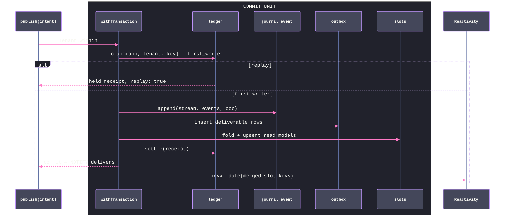

# [DATA_APPEND]

The ONE write owner of the record of truth: journal, outbox, and idempotency ledger as a single atomic surface. Streams are keyed `(app, tenant, aggregate)` as one `StreamKey` value, events are closed `Schema.TaggedClass` families with `eventVersion` stamped from the evolve plan at write, and optimistic concurrency is an `Occ` value checked under a per-stream advisory transaction lock with the unique `(stream, version)` constraint as the structural backstop. `Journal.of(spec)` binds a family once and yields the whole bound surface — `append`, `head`, `read`, and `publish`, where publish composes the scope-qualified `first_writer` ledger claim, the OCC append, the outbox insert, the inline projection slots, and the ledger settle into ONE commit: replays return the stored receipt, deliverable rows become facts atomically with the events they announce, the NOTIFY wake fires at commit, and the reactivity stamp follows a successful commit. The same statements run the pg spine and every sqlite profile through the dialect arms, and every bound member expects to run inside the scope's `Tenant.within` pin; this page owns queue-as-data — the relay claim and completion statements the work plane drains through its `SqlClient` port — while execution semantics stay across that seam.

## [01]-[CLUSTERS]

| [INDEX] | [CLUSTER]           | [OWNS]                                                                            |
| :-----: | :------------------ | :-------------------------------------------------------------------------------- |
|  [01]   | `STREAM_VOCABULARY` | `StreamKey`, the event-family contract, the persisted row models, the ensure rows |
|  [02]   | `APPEND_SURFACE`    | `Occ`, the locked OCC append, `VersionConflict`, the receipt, the bulk lane       |
|  [03]   | `LEDGER_CLAIM`      | the idempotency ledger — scoped key, explicit first-writer marker, replay receipt |
|  [04]   | `ATOMIC_PUBLISH`    | the one publish transaction — claim, append, outbox, slots, settle, wake          |
|  [05]   | `READ_SURFACE`      | `head` and the windowed `read` stream lifted through the evolve plan              |
|  [06]   | `RELAY_ROWS`        | the deliverable model, the SKIP-LOCKED claim/complete pair, the overlay bindings  |

## [02]-[STREAM_VOCABULARY]

- Owner: `StreamKey` — one `Schema.Class` whose fields are the core identity brands plus the aggregate brand-in-field; the interior `_Row` model typing the persisted event row, its `sequence` column decoding through the bigint-safe `_Sequence` codec so the model authority and the `BIGINT` DDL agree; the journal ensure rows the provisioning plane applies and `lane/capability.md` proves.
- Packages: `effect` (`Schema`); `@effect/sql` (`Model`); `@rasm/ts/core` (`AppIdentity`, `TenantContext`).
- Growth: a new stream dimension is a `StreamKey` field plus a column pair in the ensure rows — every keyed surface in the folder re-keys with it because the class is the one spelling of stream identity.
- Law: events are app-authored closed `Schema.TaggedClass` families — the journal stores their encoded form plus the `(tag, eventVersion)` coordinate and never interprets payloads, so a family evolves without touching this page.
- Law: the payload column is `Model.JsonFromString` — TEXT in the database variants, native object in the JSON variants — so the object-versus-text dialect difference is the model's, and no page hand-parses a payload column.
- Law: `sequence` is the global total order (identity column), `version` the per-stream order (the OCC coordinate); both are engine-generated or engine-checked, never computed in process.
- Law: `sequence` is bigint-safe end to end — the persisted model, every process-side read, and the receipt decode through `Journal.Sequence` (bigint, string, or number driver posture folds to `bigint`), because the global identity column grows unbounded across every stream and a `Number()` coercion past 2^53 silently corrupts checkpoints and joins; per-stream `version` stays number-valued because aggregate cardinality is provably bounded, and it decodes through `Journal.Version` — the number-or-string codec — because a BIGINT column crosses the wire as text on the spine driver and as number on the sqlite profiles.
- Law: `recordedAt` is write time minted by `Model.DateTimeInsert` — domain time lives inside event payloads, and conflating the two is the named defect.
- Boundary: the tenant column is what `Tenancy.rls("journal_event")` predicates over; `Model.makeRepository` is banned on this table — the journal issues neither `UPDATE` nor `DELETE` against events, and erasure is `journal/retain.md`'s key destruction.

```typescript
import { Schema } from "effect"
import { Model } from "@effect/sql"
import { AppIdentity, TenantContext } from "@rasm/ts/core"
import type { Capability } from "../lane/capability.ts"
import { Tenant, Tenancy } from "../lane/tenant.ts"

const _Sequence = Schema.Union(Schema.BigIntFromSelf, Schema.BigInt, Schema.BigIntFromNumber)

const _VersionNumber = Schema.Int.pipe(Schema.between(0, Number.MAX_SAFE_INTEGER))

const _Version = Schema.Union(
  _VersionNumber,
  Schema.NumberFromString.pipe(Schema.int(), Schema.between(0, Number.MAX_SAFE_INTEGER)),
)

class StreamKey extends Schema.Class<StreamKey>("StreamKey")({
  app: AppIdentity.fields.app,
  tenant: TenantContext.fields.tenant,
  aggregate: Schema.NonEmptyString.pipe(
    Schema.pattern(/^[a-z][a-z0-9-]*\/[A-Za-z0-9._:-]+$/),
    Schema.brand("Aggregate"),
  ),
}) {}

class _Row extends Model.Class<_Row>("JournalEvent")({
  sequence: Model.Generated(_Sequence),
  app: AppIdentity.fields.app,
  tenant: TenantContext.fields.tenant,
  aggregate: StreamKey.fields.aggregate,
  version: _Version,
  tag: Schema.NonEmptyString,
  event_version: Schema.Int,
  payload: Model.JsonFromString(Schema.Unknown),
  recorded_at: Model.DateTimeInsert,
}) {}

const _journalDdl: Capability.Ensure = {
  relation: "journal_event",
  pg: `CREATE TABLE IF NOT EXISTS journal_event (
    sequence BIGINT GENERATED ALWAYS AS IDENTITY PRIMARY KEY,
    app TEXT NOT NULL, tenant TEXT NOT NULL, aggregate TEXT NOT NULL,
    version BIGINT NOT NULL CHECK (version BETWEEN 1 AND 9007199254740991),
    tag TEXT NOT NULL, event_version INT NOT NULL CHECK (event_version > 0),
    payload JSONB NOT NULL,
    recorded_at TIMESTAMPTZ NOT NULL DEFAULT now(),
    UNIQUE (app, tenant, aggregate, version));
  ${Tenancy.rls("journal_event")}`,
  sqlite: `CREATE TABLE IF NOT EXISTS journal_event (
    sequence INTEGER PRIMARY KEY AUTOINCREMENT,
    app TEXT NOT NULL, tenant TEXT NOT NULL, aggregate TEXT NOT NULL,
    version INTEGER NOT NULL CHECK (version BETWEEN 1 AND 9007199254740991),
    tag TEXT NOT NULL, event_version INTEGER NOT NULL CHECK (event_version > 0),
    payload TEXT NOT NULL,
    recorded_at TEXT NOT NULL DEFAULT (strftime('%Y-%m-%dT%H:%M:%fZ','now')),
    UNIQUE (app, tenant, aggregate, version));`,
}
```

## [03]-[APPEND_SURFACE]

- Owner: `Occ` — the tagged concurrency expectation; `VersionConflict` — the concurrency fault; `JournalFault` — the reason-discriminated malformed-plan, landing, and replay-integrity fault; `_append` — the locked OCC insert every write funnels through, whose `RETURNING` carries the landed global sequences into the receipt.
- Packages: `effect` (`Effect`, `Array`, `Data`, `Schema`); `@effect/sql` (`SqlClient`, `SqlSchema`, `sql.insert`, `sql.onDialectOrElse`, `SqlError`).
- Entry: `bound.append(stream, events, occ)` — ONE entry whose plural modality is the input shape (`A | NonEmptyReadonlyArray<A>`), never an `appendMany` sibling; standalone it owns its commit, inside `publish` it folds to a savepoint.
- Receipt: `Journal.Receipt` — `{ stream, version, count, first, rows }` — the new head, the appended count, the first written version, and the encoded rows the outbox re-projects, each carrying its landed global `sequence`; the ledger stores it for replay and the publish wake announces the last sequence so drains skip empty cycles.
- Growth: a new write-side invariant is a guard inside `_append`, never a second append; a new event tag costs this page nothing — the plan stamps its `eventVersion` and the union admits it.
- Law: concurrency is `Occ` — `Exact` fails as `VersionConflict` when the locked head disagrees, `None` demands version zero, `Any` serializes under the lock and appends at head; the advisory lock is `pg_advisory_xact_lock(hashtextextended(...))` on the spine and degrades to the single writer through `onDialectOrElse` — the unique constraint remains the structural backstop on every profile.
- Law: the conflict carries evidence — `expected` and `actual` — so recovery is reload-fold-retry as data, and retrying rides a `Schedule` gated on the tag, never a loop.
- Law: `eventVersion` is stamped from `plan.latest(tag)` at write — the write coordinate and the read lift share one anchor; a tag the plan does not know fails typed as `JournalFault.reason = "unknownTag"` before any row is written, never as a defect exit.
- Law: the `RETURNING` roster is total over the encoded batch — every written version must carry its global sequence; a missing row fails `JournalFault.reason = "landing"` and rolls back the transaction, so no receipt fabricates an identity sentinel.
- Law: `Journal.now(sql)` is the one dialect-now fragment — every sibling statement that stamps a timestamp splices it, so the dialect pair exists in exactly one spelling folder-wide.
- Boundary: encode faults are `ParseError` on the admission rail; the atomic composition is `[5]`'s.

```typescript
import { Array, Data, Effect, HashMap, Option, type ParseResult } from "effect"
import { SqlClient, SqlSchema, type SqlError } from "@effect/sql"
import { Upcast } from "./evolve.ts"

class VersionConflict extends Data.TaggedError("VersionConflict")<{
  readonly stream: StreamKey
  readonly expected: number
  readonly actual: number
}> {}

class JournalFault extends Data.TaggedError("JournalFault")<{
  readonly reason: "unknownTag" | "landing" | "replay"
  readonly stream: StreamKey
  readonly detail: string
}> {}

declare namespace Journal {
  type Occ = Data.TaggedEnum<{
    Exact: { readonly version: number }
    None: {}
    Any: {}
  }>
  type Conflict = VersionConflict
  type Event = { readonly _tag: string }
  type Spec<A extends Event, I> = {
    readonly family: Schema.Schema<A, I>
    readonly plan: Upcast.Plan<A>
  }
  type Receipt = {
    readonly stream: StreamKey
    readonly version: number
    readonly count: number
    readonly first: number
    readonly rows: Array.NonEmptyReadonlyArray<{ readonly sequence: bigint; readonly version: number; readonly tag: string; readonly payload: string }>
  }
}

const _Occ = Data.taggedEnum<Journal.Occ>()

const _Landed = Schema.Struct({ sequence: _Sequence, version: _Version })

const _head = (sql: SqlClient.SqlClient, stream: StreamKey) =>
  SqlSchema.single({
    Request: StreamKey,
    Result: Schema.Struct({ head: _Version }),
    execute: (key) =>
      sql`SELECT coalesce(max(version), 0) AS head FROM journal_event
          WHERE app = ${key.app} AND tenant = ${key.tenant} AND aggregate = ${key.aggregate}`,
  })(stream).pipe(Effect.map((row) => row.head))

const _append = <A extends Journal.Event, I>(spec: Journal.Spec<A, I>) =>
  (stream: StreamKey, events: A | Array.NonEmptyReadonlyArray<A>, occ: Journal.Occ) =>
    Effect.flatMap(SqlClient.SqlClient, (sql) =>
      sql.withTransaction(
        Effect.gen(function* () {
          const batch = Array.ensure(events)
          yield* sql.onDialectOrElse({
            orElse: () => sql`SELECT 1`,
            pg: () =>
              sql`SELECT pg_advisory_xact_lock(hashtextextended(${stream.app} || ':' || ${stream.tenant} || ':' || ${stream.aggregate}, 0))`,
          })
          const held = yield* _head(sql, stream)
          yield* _Occ.$match(occ, {
            Exact: ({ version }) =>
              held === version
                ? Effect.void
                : Effect.fail(new VersionConflict({ stream, expected: version, actual: held })),
            None: () =>
              held === 0
                ? Effect.void
                : Effect.fail(new VersionConflict({ stream, expected: 0, actual: held })),
            Any: () => Effect.void,
          })
          const encode = Schema.encode(Schema.parseJson(spec.family))
          const rows = yield* Effect.forEach(batch, (event, index) =>
            Effect.gen(function* () {
              const payload = yield* encode(event)
              const eventVersion = yield* Effect.fromOption(spec.plan.latest(event._tag), () =>
                new JournalFault({ reason: "unknownTag", stream, detail: event._tag }))
              return {
                app: stream.app,
                tenant: stream.tenant,
                aggregate: stream.aggregate,
                version: held + 1 + index,
                tag: event._tag,
                event_version: eventVersion,
                payload,
              }
            }))
          const landed = yield* Effect.flatMap(
            sql`INSERT INTO journal_event ${sql.insert(rows)} RETURNING sequence, version`,
            Schema.decodeUnknown(Schema.Array(_Landed)),
          )
          const bySequence = HashMap.fromIterable(Array.map(landed, (row) => [row.version, row.sequence] as const))
          const received = yield* Effect.forEach(rows, (row) =>
            Effect.map(
              Effect.fromOption(HashMap.get(bySequence, row.version), () =>
                new JournalFault({ reason: "landing", stream, detail: String(row.version) })),
              (sequence) => ({ sequence, version: row.version, tag: row.tag, payload: row.payload }),
            ))
          return {
            stream,
            version: held + batch.length,
            count: batch.length,
            first: held + 1,
            rows: received,
          } satisfies Journal.Receipt
        }),
      ))
```

## [04]-[LEDGER_CLAIM]

- Owner: the `idempotency_ledger` ensure row, the `IdempotencyKey` brand, and `_claim` — the one statement that inserts-or-touches the scope-qualified `(app, tenant, key)` identity and reports first-writer truth plus the stored receipt in a single round trip; `_settle` writes the receipt through the same identity.
- Packages: `@effect/sql` (`sql.insert`, `sql.onDialectOrElse`); `effect` (`Option`, `Schema`).
- Receipt: `Journal.Claim` — `{ key, first, held }` — `first` from the explicit `first_writer` insert/update marker shared by both dialects; timestamp equality and PostgreSQL transaction internals never stand in for protocol state. A replay is served entirely from this row, and the whole claim decodes through one `SqlSchema.single` — the marker through the dialect-honest `_Flag` codec, the stored receipt through `Upcast.json(_Receipt)` — so no ledger cell is ever hand-coerced.
- Growth: a new ledger dimension (scope column, expiry class) is a column pair plus a field on the claim row — the statement shape never changes.
- Law: the claim is one statement — `INSERT … ON CONFLICT (app, tenant, key) DO UPDATE SET touched_at = …, first_writer = false RETURNING first_writer AS inserted, receipt` — the spine's `conflictClaim` primitive row realized; a SELECT-then-INSERT pair is the torn spelling.
- Law: idempotency identity includes the tenant coordinate — equal caller keys in different apps or tenants are independent claims, and settle repeats the full predicate so one scope cannot overwrite another scope's receipt.
- Law: the ledger stores the receipt after the append succeeds, so a replayed key returns the ORIGINAL receipt — idempotency means the duplicate caller cannot distinguish itself from the first writer.
- Law: ledger rows age by `touched_at` under a `journal/retain.md` window — a replay past the window is a fresh publish by declaration, and the window is a policy value, never a literal.

```typescript
const _IdempotencyKey = Schema.NonEmptyString.pipe(Schema.maxLength(200), Schema.brand("IdempotencyKey"))

const _Receipt = Schema.Struct({
  stream: StreamKey,
  version: _Version,
  count: Schema.Int.pipe(Schema.positive()),
  first: _Version.pipe(Schema.positive()),
  rows: Schema.NonEmptyArray(Schema.Struct({ sequence: Schema.BigInt, version: _Version, tag: Schema.String, payload: Schema.String })),
})

declare namespace Journal {
  type Key = typeof _IdempotencyKey.Type
  type Claim = {
    readonly key: Key
    readonly first: boolean
    readonly held: Option.Option<Journal.Receipt>
  }
}

const _Flag = Schema.transform(Schema.Union(Schema.Boolean, Schema.Number), Schema.Boolean, {
  strict: true,
  decode: (raw) => raw === true || raw === 1,
  encode: (flag) => flag,
})

const _Claimed = Schema.Struct({
  inserted: _Flag,
  receipt: Schema.OptionFromNullOr(Upcast.json(_Receipt)),
})

const _claim = (sql: SqlClient.SqlClient, stream: StreamKey, key: Journal.Key) =>
  SqlSchema.single({
    Request: Schema.Struct({ key: _IdempotencyKey, app: StreamKey.fields.app, tenant: StreamKey.fields.tenant }),
    Result: _Claimed,
    execute: (row) =>
      sql`INSERT INTO idempotency_ledger ${sql.insert([{ ...row, first_writer: true }])}
          ON CONFLICT (app, tenant, key) DO UPDATE SET touched_at = ${_now(sql)}, first_writer = false
          RETURNING first_writer AS inserted, receipt`,
  })({ key, app: stream.app, tenant: stream.tenant }).pipe(
    Effect.map((row): Journal.Claim => ({ key, first: row.inserted, held: row.receipt })),
  )

const _settle = (sql: SqlClient.SqlClient, stream: StreamKey, key: Journal.Key, receipt: Journal.Receipt) =>
  Effect.flatMap(
    Schema.encode(Schema.parseJson(_Receipt))(receipt),
    (held) => sql`UPDATE idempotency_ledger SET receipt = ${held}
                  WHERE app = ${stream.app} AND tenant = ${stream.tenant} AND key = ${key}`,
  )

const _ledgerDdl: Capability.Ensure = {
  relation: "idempotency_ledger",
  pg: `CREATE TABLE IF NOT EXISTS idempotency_ledger (
    key TEXT NOT NULL,
    app TEXT NOT NULL, tenant TEXT NOT NULL,
    receipt JSONB,
    first_writer BOOLEAN NOT NULL DEFAULT true,
    claimed_at TIMESTAMPTZ NOT NULL DEFAULT now(),
    touched_at TIMESTAMPTZ NOT NULL DEFAULT now(),
    PRIMARY KEY (app, tenant, key));
  ${Tenancy.rls("idempotency_ledger")}`,
  sqlite: `CREATE TABLE IF NOT EXISTS idempotency_ledger (
    key TEXT NOT NULL,
    app TEXT NOT NULL, tenant TEXT NOT NULL,
    receipt TEXT,
    first_writer INTEGER NOT NULL DEFAULT 1 CHECK (first_writer IN (0, 1)),
    claimed_at TEXT NOT NULL DEFAULT (strftime('%Y-%m-%dT%H:%M:%fZ','now')),
    touched_at TEXT NOT NULL DEFAULT (strftime('%Y-%m-%dT%H:%M:%fZ','now')),
    PRIMARY KEY (app, tenant, key));`,
}
```

## [05]-[ATOMIC_PUBLISH]

- Owner: `bound.publish(intent)` — the one write entry apps and edges call; everything the commit must carry is a field of `Journal.Intent`, and the inline projection slots arrive as values, never as imports.
- Packages: `effect` (`Effect`, `Hash`, `Option`, `Stream`); `@effect/sql` (`sql.withTransaction`); `@effect/sql-pg` (`PgClient.listen` — the spine wake stream, read as an optional service); `@effect/experimental` (`Reactivity.invalidate`); `data/read/live.md` (`Live.Keys`, `Live.merged`).
- Entry: `bound.publish(intent)` runs inside the scope's `Tenant.within` — the pin provides the client, so publish outside the tenancy boundary is unspellable; `intent` carries stream, events, occ, the optional idempotency key, and the slot values the inline projection lane inhabits.
- Receipt: `Journal.Published` — `{ journal, key, replay }` — the append receipt, the claiming key when present, and `replay: true` when the ledger served a duplicate.
- Growth: a new atomic participant is one step inside the transaction fold, never a second publish; a new wake consumer composes `Journal.wake(app)` — the channel derives from the app key bounded to the NOTIFY identifier cap, parameterized ingress.
- Law: ordering inside the transaction is load-bearing — claim first (a replay short-circuits before any write), append second, outbox third, slots fourth, settle last; the pg arm invokes `pg_notify(channel, payload)` through the transaction-bound `SqlClient`, so PostgreSQL delivers at commit and a rolled-back publish wakes nobody. `PgClient.notify` is rejected here because its published body calls the pool directly and does not enlist in this transaction.
- Law: the NOTIFY payload is the last landed global `sequence` — a drain daemon compares it against its checkpoint and skips the claim transaction when no work exists, so a high-fanout deployment pays zero empty wake cycles; the payload is an accelerator only, and a garbled payload costs one probing cycle, never correctness. `Journal.wake` catches only `SqlError` into the empty stream because the relay's lease-width tick is the durable fallback; a listener loss delays the next claim and cannot lose a deliverable.
- Law: publish is total over its faults — `VersionConflict`, `JournalFault`, `SqlError`, `ParseError`; an unknown plan tag, incomplete `RETURNING` roster, or duplicate claim lacking its settled receipt fails typed and rolls back whole.
- Law: each slot returns the read owner's exact `Live.Keys` value; publish composes the roster through `Live.merged` and registers one `Reactivity.invalidate` through `Tenant.afterCommit`. `Tenant.within` drains the invocation-local roster only after its outer transaction commits. A savepoint release, rollback, and ledger replay stamp nothing, so no reader can wake into pre-commit state and no duplicate commit emits a second mutation.



```typescript
import { Hash } from "effect"
import { PgClient } from "@effect/sql-pg"
import { Reactivity } from "@effect/experimental"
import { Live } from "../read/live.ts"

declare namespace Journal {
  type Slot<A> = {
    readonly keys: (stream: StreamKey) => Live.Keys
    readonly project: (stream: StreamKey, events: ReadonlyArray<A>, receipt: Journal.Receipt) => Effect.Effect<
      void,
      SqlError.SqlError | ParseResult.ParseError,
      SqlClient.SqlClient
    >
  }
  type Intent<A> = {
    readonly stream: StreamKey
    readonly events: A | Array.NonEmptyReadonlyArray<A>
    readonly occ: Occ
    readonly key: Option.Option<Key>
    readonly slots: ReadonlyArray<Slot<A>>
  }
  type Published = {
    readonly journal: Receipt
    readonly key: Option.Option<Key>
    readonly replay: boolean
  }
}

const _CHANNEL = { stem: 46, seal: 8 } as const // journal: + stem + "-" + seal hex = 63, the NOTIFY identifier cap — LISTEN truncates and pg_notify errors past it

const _channel = (app: AppIdentity.Key): string =>
  app.length <= _CHANNEL.stem + _CHANNEL.seal + 1
    ? `journal:${app}`
    : `journal:${app.slice(0, _CHANNEL.stem)}-${(Hash.string(app) >>> 0).toString(16).padStart(_CHANNEL.seal, "0")}` // deterministic on both the LISTEN and NOTIFY sides: the hash of the full key preserves distinctness past the cap

const _wake = (app: AppIdentity.Key): Stream.Stream<string> =>
  Stream.unwrap(
    Effect.map(Effect.serviceOption(PgClient.PgClient), Option.match({
      onNone: () => Stream.empty,
      onSome: (pg) => pg.listen(_channel(app)),
    })),
  ).pipe(Stream.catchTag("SqlError", () => Stream.empty))

const _deliverables = (stream: StreamKey, receipt: Journal.Receipt) =>
  receipt.rows.map((row) => ({
    sequence: row.sequence,
    app: stream.app,
    tenant: stream.tenant,
    aggregate: stream.aggregate,
    version: row.version,
    tag: row.tag,
    payload: row.payload,
  }))

const _publish = <A extends Journal.Event, I>(spec: Journal.Spec<A, I>) =>
  (intent: Journal.Intent<A>) =>
    Effect.flatMap(SqlClient.SqlClient, (sql) =>
      sql.withTransaction(
        Effect.gen(function* () {
          const claim = yield* Effect.transposeOption(
            Option.map(intent.key, (key) => _claim(sql, intent.stream, key)))
          const replay = yield* Option.match(claim, {
            onNone: () => Effect.succeed(Option.none<Journal.Receipt>()),
            onSome: (held) =>
              held.first
                ? Effect.succeed(Option.none<Journal.Receipt>())
                : Effect.map(
                    Effect.fromOption(held.held, () =>
                      new JournalFault({ reason: "replay", stream: intent.stream, detail: String(held.key) })),
                    Option.some,
                  ),
          })
          return yield* Option.match(replay, {
            onSome: (held) =>
              Effect.succeed<Journal.Published>({ journal: held, key: intent.key, replay: true }),
            onNone: () =>
              Effect.gen(function* () {
                const journal = yield* _append(spec)(intent.stream, intent.events, intent.occ)
                const batch = Array.ensure(intent.events)
                yield* sql`INSERT INTO outbox ${sql.insert(_deliverables(intent.stream, journal))}`
                yield* Effect.forEach(intent.slots, (slot) => slot.project(intent.stream, batch, journal), { discard: true })
                yield* Effect.transposeOption(Option.map(intent.key, (key) => _settle(sql, intent.stream, key, journal)))
                yield* sql.onDialectOrElse({
                  orElse: () => Effect.void,
                  pg: () => sql`SELECT pg_notify(
                    ${_channel(intent.stream.app)},
                    ${String(Array.lastNonEmpty(journal.rows).sequence)}
                  )`,
                })
                return { journal, key: intent.key, replay: false } satisfies Journal.Published
              }),
          })
        }),
      ).pipe(
        Effect.tap((published) =>
          published.replay
            ? Effect.void
            : Effect.flatMap(Tenant, (tenant) =>
                tenant.afterCommit(
                  Reactivity.invalidate(
                    Live.merged(Array.map(intent.slots, (slot) => slot.keys(intent.stream))).coordinates,
                  ),
                ))),
      ))
```

## [06]-[READ_SURFACE]

- Owner: the bound `head` and `read` members — `read` is a backpressured statement stream lifted row-by-row through the evolve plan into live family values.
- Packages: `effect` (`Stream`); `@effect/sql` (`Statement.stream` over the backpressured cursor).
- Entry: `bound.read(stream, window?)` — the one replay road; projection lanes, `journal/retain.md`'s DSAR fold, and snapshot-plus-tail hydration compose it with a `from` window instead of minting their own SELECT.
- Growth: a new read shape (by tag, by time) is a window field, never a sibling read.
- Law: rows leave the statement as the decoded `_EventRow` (payload through `Upcast.Column`) projected into `Upcast.Raw` and exist as nothing else — the decoded family value is the only shape past this seam, so a malformed historical payload surfaces as `ParseError` exactly once, at the lift, and no cursor cell is hand-coerced.

```typescript
import { Stream } from "effect"

const _EventRow = Schema.Struct({
  tag: Schema.String,
  event_version: Schema.Int,
  payload: Upcast.Column,
  version: _Version,
})

const _read = <A extends Journal.Event, I>(spec: Journal.Spec<A, I>) =>
  (stream: StreamKey, window?: { readonly from?: number; readonly to?: number }) =>
    Stream.unwrap(
      Effect.map(SqlClient.SqlClient, (sql) =>
        sql`SELECT tag, event_version, payload, version FROM journal_event
            WHERE app = ${stream.app} AND tenant = ${stream.tenant} AND aggregate = ${stream.aggregate}
              AND version >= ${window?.from ?? 1} AND version <= ${window?.to ?? Number.MAX_SAFE_INTEGER}
            ORDER BY version`.stream.pipe(
          Stream.mapEffect((raw) =>
            Effect.flatMap(Schema.decodeUnknown(_EventRow)(raw), (row) =>
              spec.plan.decode({ tag: row.tag, version: row.event_version, payload: row.payload }))),
        )),
    )
```

## [07]-[RELAY_ROWS]

- Owner: the `outbox` ensure row, the `_Deliverable` result model, the two decoded statements the work drain composes — `Journal.claimBatch` (SKIP LOCKED with attempts increment) and `Journal.complete` — the wake channel name, the EventLog overlay bindings, and the assembled `Journal` export.
- Packages: `@effect/sql` (`Model`, `sql.in`, `SqlEventJournal`, `SqlEventLogServer`).
- Entry: the work plane drains through its `SqlClient` port with these statement values — `claimBatch(sql, request)` takes the decoded `_ClaimBatch` carrier, and `complete(sql, ids)` requires a non-empty bigint identity roster; this page publishes the vocabulary, the drain owns fan-out policy, retry budgets, and egress quota; the async projection lane listens on the same channel.
- Growth: a new deliverable dimension (priority, deliver-at) is a column plus a `claimBatch` ORDER BY term — the drain contract never widens.
- Law: `claimBatch` is the competing-consumer claim realizing the `skipLocked` primitive row — attempts increment on every claim so poison rows surface as data, and the visibility-timeout redelivery idiom is the `claimed_at` lease predicate: a claimed row is invisible for `leaseSeconds`, so a crashed claimant's rows redeliver only after the lease lapses and a live claimant is never raced; the sqlite arm serializes on the single writer and drops the lock clause while keeping the lease predicate. `SqlSchema.findAll` decodes every returned identity and payload through `_Deliverable`; raw driver rows never cross the data seam.
- Law: each deliverable carries the journal's global `sequence` beside its stream version, so a drain receipt, checkpoint, or forensic join names the exact source fact without re-querying by payload coordinates.
- Law: the overlay bindings are overlay ONLY — the EventLog journal and sync-server storage persist onto this owning `SqlClient`, accelerate local-first reads, and are never the record of truth; a record whose loss corrupts state lives in THIS journal and projects outward, never the reverse.
- Law: `layerStorageSubtle` is the default overlay posture — zero-knowledge storage for the untrusted multi-tenant deployment, where the server persists ciphertext it cannot read; the plain `layerStorage` row is the explicit single-tenant opt-in, selected at the composition root.
- Law: the overlay backings are adopted only while their table bootstrap is verifiably ensure-shaped — idempotent, additive, provision-runnable; otherwise their DDL is owned locally beside these rows and the layers still bind.

```typescript
import { SqlEventJournal, SqlEventLogServer } from "@effect/sql"

class _Deliverable extends Model.Class<_Deliverable>("OutboxRow")({
  id: Model.Generated(_Sequence),
  sequence: _Sequence,
  app: AppIdentity.fields.app,
  tenant: TenantContext.fields.tenant,
  aggregate: StreamKey.fields.aggregate,
  version: _Version,
  tag: Schema.NonEmptyString,
  payload: Model.JsonFromString(Schema.Unknown),
  attempts: Schema.Int,
  created_at: Model.DateTimeInsert,
  claimed_at: Model.FieldOption(Schema.DateTimeUtc),
  delivered_at: Model.FieldOption(Schema.DateTimeUtc),
}) {}

const _ClaimBatch = Schema.Struct({
  app: AppIdentity.fields.app,
  take: Schema.Int.pipe(Schema.positive()),
  leaseSeconds: Schema.Int.pipe(Schema.positive()),
})

const _outboxDdl: Capability.Ensure = {
  relation: "outbox",
  pg: `CREATE TABLE IF NOT EXISTS outbox (
    id BIGINT GENERATED ALWAYS AS IDENTITY PRIMARY KEY,
    sequence BIGINT NOT NULL,
    app TEXT NOT NULL, tenant TEXT NOT NULL, aggregate TEXT NOT NULL,
    version BIGINT NOT NULL CHECK (version BETWEEN 1 AND 9007199254740991), tag TEXT NOT NULL,
    payload JSONB NOT NULL, attempts INT NOT NULL DEFAULT 0,
    created_at TIMESTAMPTZ NOT NULL DEFAULT now(),
    claimed_at TIMESTAMPTZ,
    delivered_at TIMESTAMPTZ);
  ${Tenancy.rls("outbox")}
  CREATE INDEX IF NOT EXISTS outbox_pending ON outbox (app, id) WHERE delivered_at IS NULL;`,
  sqlite: `CREATE TABLE IF NOT EXISTS outbox (
    id INTEGER PRIMARY KEY AUTOINCREMENT,
    sequence INTEGER NOT NULL,
    app TEXT NOT NULL, tenant TEXT NOT NULL, aggregate TEXT NOT NULL,
    version INTEGER NOT NULL CHECK (version BETWEEN 1 AND 9007199254740991), tag TEXT NOT NULL,
    payload TEXT NOT NULL, attempts INTEGER NOT NULL DEFAULT 0,
    created_at TEXT NOT NULL DEFAULT (strftime('%Y-%m-%dT%H:%M:%fZ','now')),
    claimed_at TEXT,
    delivered_at TEXT);`,
}

const _now = (sql: SqlClient.SqlClient) =>
  sql.onDialectOrElse({
    orElse: () => sql.literal("strftime('%Y-%m-%dT%H:%M:%fZ','now')"),
    pg: () => sql.literal("now()"),
  })

const _overlay = {
  journal: SqlEventJournal.layer,
  server: SqlEventLogServer.layerStorage,
  serverSubtle: SqlEventLogServer.layerStorageSubtle,
} as const

const _claimBatch = (sql: SqlClient.SqlClient) =>
  SqlSchema.findAll({
    Request: _ClaimBatch,
    Result: _Deliverable,
    execute: ({ app, take, leaseSeconds }) =>
      sql.onDialectOrElse({
        orElse: () =>
          sql`UPDATE outbox SET attempts = attempts + 1, claimed_at = ${_now(sql)}
              WHERE id IN (SELECT id FROM outbox WHERE app = ${app} AND delivered_at IS NULL
                           AND (claimed_at IS NULL OR claimed_at < strftime('%Y-%m-%dT%H:%M:%fZ','now', '-' || ${leaseSeconds} || ' seconds'))
                           ORDER BY id LIMIT ${take})
              RETURNING *`,
        pg: () =>
          sql`UPDATE outbox SET attempts = attempts + 1, claimed_at = ${_now(sql)}
              WHERE id IN (SELECT id FROM outbox WHERE app = ${app} AND delivered_at IS NULL
                           AND (claimed_at IS NULL OR claimed_at < now() - make_interval(secs => ${leaseSeconds}))
                           ORDER BY id LIMIT ${take} FOR UPDATE SKIP LOCKED)
              RETURNING *`,
      }),
  })

const Journal = {
  of: <A extends Journal.Event, I>(spec: Journal.Spec<A, I>) => ({
    append: _append(spec),
    head: (stream: StreamKey) => Effect.flatMap(SqlClient.SqlClient, (sql) => _head(sql, stream)),
    read: _read(spec),
    publish: _publish(spec),
  }),
  now: _now,
  channel: _channel,
  wake: _wake,
  claimBatch: (sql: SqlClient.SqlClient, request: typeof _ClaimBatch.Type) =>
    _claimBatch(sql)(request),
  complete: (sql: SqlClient.SqlClient, ids: Array.NonEmptyReadonlyArray<bigint>) =>
    sql`UPDATE outbox SET delivered_at = ${_now(sql)} WHERE ${sql.in("id", ids)}`,
  ddl: [_journalDdl, _ledgerDdl, _outboxDdl],
  overlay: _overlay,
  Occ: _Occ,
  Key: _IdempotencyKey,
  Sequence: _Sequence,
  Version: _Version,
  Conflict: VersionConflict,
  Fault: JournalFault,
} as const

// --- [EXPORTS] --------------------------------------------------------------------------

export { Journal, JournalFault, StreamKey }
```
