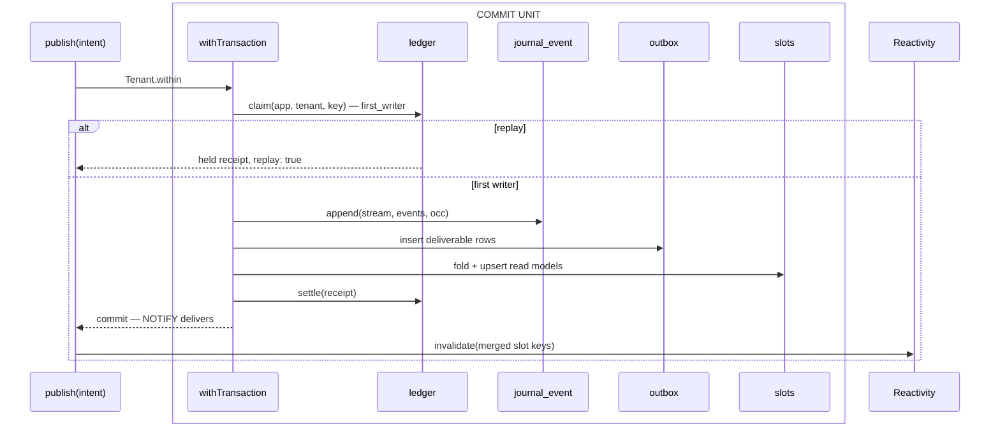

# [DATA_APPEND]

ONE write owner of the record of truth: journal, outbox, and idempotency ledger as a single atomic surface. Streams are keyed `(app, tenant, aggregate)` as one `StreamKey` value, events are closed `Schema.TaggedClass` families with `eventVersion` stamped from the evolve plan at write, and optimistic concurrency is an `Occ` value checked under a per-stream advisory transaction lock with the unique `(stream, version)` constraint as the structural backstop.

`Journal.of(spec)` binds a family once and yields the bound surface — `append`, `head`, `read`, and `publish`, where publish folds the `first_writer` ledger claim, the OCC append, the outbox insert, the inline slots, and the ledger settle into ONE commit, a replay returning the stored receipt. One statement set runs the pg spine and every sqlite profile through the dialect arms, every bound member runs inside the `Tenant.within` pin, and this page owns queue-as-data — the relay statements the work plane drains through its `SqlClient` port — while execution semantics stay across that seam.

## [01]-[INDEX]

- [02]-[STREAM_VOCABULARY]: `StreamKey`, the event-family contract, the persisted row models, the ensure rows.
- [03]-[APPEND_SURFACE]: `Occ`, the locked OCC append, `VersionConflict`, the receipt, the bulk lane.
- [04]-[LEDGER_CLAIM]: the idempotency ledger — scoped key, explicit first-writer marker, replay receipt.
- [05]-[ATOMIC_PUBLISH]: the one publish transaction — claim, append, outbox, slots, settle, wake.
- [06]-[READ_SURFACE]: `head` and the windowed `read` stream lifted through the evolve plan.
- [07]-[RELAY_ROWS]: the deliverable model, the SKIP-LOCKED claim/complete pair, the CloudEvents envelope, the overlay bindings.
- [08]-[HOOK_POINTS]: the core-brand data hook points and the publisher port the app mounts on the runtime engine.

## [02]-[STREAM_VOCABULARY]

- Owner: `StreamKey` — one `Schema.Class` whose fields are the core identity brands with the aggregate brand-in-field; the interior `_Row` model typing the persisted event row, its `sequence` column decoding through the bigint-safe `_Sequence` codec so the model authority and the `BIGINT` DDL agree; the journal ensure rows the provisioning plane applies and `lane/capability.md` proves.
- Packages: `effect` (`Schema`); `@effect/sql` (`Model`); `@rasm/ts/core` (`Identity.App`, `Identity.Tenant`).
- Growth: a new stream dimension is a `StreamKey` field with a column pair in the ensure rows and one operand on the identity fragment — every keyed surface in the folder re-keys with it because the class is the one spelling of stream identity.
- Law: the COMPOSED identity is one owned fragment with two composition shapes — `StreamKey.identity` joins a held key's bound values and `StreamKey.identityColumn` joins the relation's own escaped identifiers, both through one separator and one order — so the advisory lock's hash input and the head resolver's grouping key are provably the same string; a hand-repeated `|| ':' ||` at either site desyncs the lock from the resolver on the first separator or column-order edit, and nothing about that divergence is visible until two callers disagree over which stream they hold.
- Law: events are app-authored closed `Schema.TaggedClass` families — the journal stores their encoded form with the `(tag, eventVersion)` coordinate and never interprets payloads, so a family evolves without touching this page.
- Law: the payload column is `Model.JsonFromString` — TEXT in the database variants, native object in the JSON variants — so the object-versus-text dialect difference is the model's, and no page hand-parses a payload column.
- Law: `sequence` is the global total order (identity column), `version` the per-stream order (the OCC coordinate); both are engine-generated or engine-checked, never computed in process.
- Law: the BIGINT read posture is PINNED, never inferred — `_safe` brackets every sequence-bearing statement with `SqlClient.SafeIntegers`, so the journal states the posture it reads under instead of accepting whatever a driver defaults to; the three-member codec below is the honest degrade for a driver that ignores the reference, never a substitute for declaring it.
- Law: `sequence` is bigint-safe end to end — the persisted model and every process-side read decode through `Journal.Sequence` (bigint, string, or number driver posture folds to `bigint`), because the global identity column grows unbounded across every stream and a `Number()` coercion past 2^53 silently corrupts checkpoints and joins; the STORED receipt rides `Schema.BigInt` alone, because that receipt round-trips through `Schema.parseJson` and the driver-posture union's identity member encodes `bigint` back out, which `JSON.stringify` refuses — one codec crosses a driver row, the other crosses a text column, and conflating them wedges the ledger settle on its first write.
- Law: per-stream `version` stays number-valued because aggregate cardinality is provably bounded, and it decodes through `Journal.Version` — the number-or-string codec — because a BIGINT column crosses the wire as text on the spine driver and as number on the sqlite profiles.
- Law: `recordedAt` is write time minted by `Model.DateTimeInsert` — domain time lives inside event payloads, and conflating the two is the named defect.
- Boundary: the tenant column is what `Tenancy.rls("journal_event")` predicates over; `Model.makeRepository` is banned on this table — the journal issues neither `UPDATE` nor `DELETE` against events, and erasure is `journal/retain.md`'s key destruction.

```typescript signature
import { Reactivity } from "@effect/experimental"
import {
  Model, SqlClient, SqlEventJournal, SqlEventLogServer, SqlSchema, type SqlError, type Statement,
} from "@effect/sql"
import { PgClient } from "@effect/sql-pg"
import { CloudEvent, type CloudEventV1, ValidationError, V1 } from "cloudevents"
import {
  Array, Context, Data, DateTime, Effect, Either, Encoding, Hash, HashMap, Option, Predicate, Record, Schedule, Schema,
  Stream, pipe, type ParseResult,
} from "effect"
import { Carrier, Fault, Identity, Tap } from "@rasm/ts/core"
import type { Capability } from "../lane/capability.ts"
import { Tenant, Tenancy } from "../lane/tenant.ts"
import { Live } from "../read/live.ts"
import { Upcast } from "./evolve.ts"

// `SqlClient.SafeIntegers` pins the BIGINT read posture per fiber, so `_safe` brackets every sequence-bearing statement
// and the journal DECLARES what it reads under rather than discovering it. Union members below stay the honest degrade:
// a driver ignoring the reference still hands back text or a number, and a codec admitting `bigint` alone fails the
// read rather than the assumption it was built on.
const _Sequence = Schema.Union(Schema.BigIntFromSelf, Schema.BigInt, Schema.BigIntFromNumber)

const _safe = <A, E, R>(effect: Effect.Effect<A, E, R>): Effect.Effect<A, E, R> =>
  Effect.provideService(effect, SqlClient.SafeIntegers, true)

const _VersionNumber = Schema.Int.pipe(Schema.between(0, Number.MAX_SAFE_INTEGER))

const _Version = Schema.Union(
  _VersionNumber,
  Schema.NumberFromString.pipe(Schema.int(), Schema.between(0, Number.MAX_SAFE_INTEGER)),
)

// The composed identity has ONE spelling and two composition shapes, because two SQL sites need the same string from
// different operands: the advisory lock hashes it from a held `StreamKey`'s bound values, the head resolver groups it
// from the relation's own columns. Separator and join order live here alone, so neither site can desync the lock key
// from the resolver key — which is exactly the failure a hand-repeated `|| ':' ||` makes invisible until two callers
// disagree about which stream they hold.
const _SEPARATOR = ":"

const _joined = (
  sql: SqlClient.SqlClient,
  parts: readonly [Statement.Fragment, Statement.Fragment, Statement.Fragment],
): Statement.Fragment => sql`${parts[0]} || ${_SEPARATOR} || ${parts[1]} || ${_SEPARATOR} || ${parts[2]}`

class StreamKey extends Schema.Class<StreamKey>("StreamKey")({
  app: Identity.App.fields.app,
  tenant: Identity.Tenant.fields.tenant,
  aggregate: Schema.NonEmptyString.pipe(
    Schema.pattern(/^[a-z][a-z0-9-]*\/[A-Za-z0-9._:-]+$/),
    Schema.brand("Aggregate"),
  ),
}) {
  // Values: the three brands bind as parameters, so a held key composes with nothing interpolated into statement text.
  static readonly identity = (sql: SqlClient.SqlClient, stream: StreamKey): Statement.Fragment =>
    _joined(sql, [sql`${stream.app}`, sql`${stream.tenant}`, sql`${stream.aggregate}`])
  // Columns: the same join over the relation's own identifiers, escaped by the compiler rather than spliced as text.
  static readonly identityColumn = (sql: SqlClient.SqlClient): Statement.Fragment =>
    _joined(sql, [sql`${sql("app")}`, sql`${sql("tenant")}`, sql`${sql("aggregate")}`])
}

class _Row extends Model.Class<_Row>("JournalEvent")({
  sequence: Model.Generated(_Sequence),
  app: Identity.App.fields.app,
  tenant: Identity.Tenant.fields.tenant,
  aggregate: StreamKey.fields.aggregate,
  version: _Version,
  tag: Schema.NonEmptyString,
  event_version: Schema.Int,
  payload: Model.JsonFromString(Schema.Unknown),
  recorded_at: Model.DateTimeInsert,
}) {}

// Named because the OCC re-spell binds to THIS constraint rather than to the class of every uniqueness refusal: one
// spelling serves the DDL and the guard, so a second unique constraint landing on this relation cannot silently start
// answering "version conflict" to a race that has nothing to do with stream version. The KEY roster is the second half
// of that identity: no sqlite driver reports a constraint name, so the guard reads the columns SQLite prints instead,
// and both halves are spelled from these two values the DDL itself interpolates.
const _STREAM_UNIQUE = "journal_event_stream"
const _STREAM_KEY = ["app", "tenant", "aggregate", "version"] as const

const _journalDdl: Capability.Ensure = {
  relation: "journal_event",
  pg: `CREATE TABLE IF NOT EXISTS journal_event (
    sequence BIGINT GENERATED ALWAYS AS IDENTITY PRIMARY KEY,
    app TEXT NOT NULL, tenant TEXT NOT NULL, aggregate TEXT NOT NULL,
    version BIGINT NOT NULL CHECK (version BETWEEN 1 AND 9007199254740991),
    tag TEXT NOT NULL, event_version INT NOT NULL CHECK (event_version > 0),
    payload JSONB NOT NULL,
    recorded_at TIMESTAMPTZ NOT NULL DEFAULT now(),
    CONSTRAINT ${_STREAM_UNIQUE} UNIQUE (${_STREAM_KEY.join(", ")}));
  ${Tenancy.rls("journal_event")}`,
  sqlite: `CREATE TABLE IF NOT EXISTS journal_event (
    sequence INTEGER PRIMARY KEY AUTOINCREMENT,
    app TEXT NOT NULL, tenant TEXT NOT NULL, aggregate TEXT NOT NULL,
    version INTEGER NOT NULL CHECK (version BETWEEN 1 AND 9007199254740991),
    tag TEXT NOT NULL, event_version INTEGER NOT NULL CHECK (event_version > 0),
    payload TEXT NOT NULL,
    recorded_at TEXT NOT NULL DEFAULT (strftime('%Y-%m-%dT%H:%M:%fZ','now')),
    CONSTRAINT ${_STREAM_UNIQUE} UNIQUE (${_STREAM_KEY.join(", ")}));`,
}
```

## [03]-[APPEND_SURFACE]

- Owner: `Occ` carries concurrency expectation; `VersionConflict` carries mismatch evidence.
- Owner: `JournalFault` closes reason rows through `Fault.Class.family`.
- Owner: `_append` locks, admits, inserts, and returns every landed global sequence.
- Packages: `effect`, `@effect/sql`, and `@rasm/ts/core` (`Fault.Class`).
- Entry: `bound.append(stream, events, occ)` — ONE entry whose plural modality is the input shape (`A | NonEmptyReadonlyArray<A>`), never an `appendMany` sibling; standalone it owns its commit, inside `publish` it folds to a savepoint.
- Receipt: `Journal.Receipt` — `{ stream, version, count, first, rows }` — the new head, the appended count, the first written version, and the encoded rows the outbox re-projects, each carrying its landed global `sequence`; the ledger stores it for replay and the publish wake announces the last sequence so drains skip empty cycles.
- Growth: a new write-side invariant is a guard inside `_append`, never a second append; a new event tag costs this page nothing — the plan stamps its `eventVersion` and the union admits it.
- Owner: `Journal.signal` folds a driver fault onto the closed `conflicted`/`refused`/`transient` vocabulary every retry gate in the folder reads.
- Law: concurrency is `Occ` — `Exact` fails as `VersionConflict` when the locked head disagrees, `None` demands version zero, `Any` serializes under the lock and appends at head; the advisory lock is `pg_advisory_xact_lock(hashtextextended(...))` on the spine and degrades to the single writer through `onDialectOrElse` — the unique constraint remains the structural backstop on every profile.
- Law: the structural backstop re-spells onto the SAME typed conflict — one contention fact reaches the caller on one channel, because the locked head read and the `journal_event_stream` violation are the same race refused at two depths and a recovery predicate gated on `VersionConflict` alone is dead code exactly on the profiles carrying no advisory lock; the fold runs at the insert, so `expected` carries the head the transaction admitted against and `actual` stays `Option.none` rather than fabricating a value the aborted transaction can no longer read.
- Law: the re-spell identifies the violated UNIQUE, never the code class alone — pg-wire carries the constraint name beside its SQLSTATE and the guard matches that name, while SQLite reports the violated index's COLUMNS and no sqlite driver carries a constraint field, so there the guard matches this relation's own key roster; either way a uniqueness refusal from another unique on this relation stays an ordinary fault instead of reaching a caller as a stream-version conflict it reload-fold-retries forever.
- Law: the classifier reads TWO channels because the drivers carry two — a `code` field where one exists, the engine's own message where none survives. Node and libSQL raise the SQLite extended result-code NAMES, so those profiles resolve on the same lookup the SQLSTATE rows serve; the wasm build raises the C API's primary result code as a NUMBER that separates no constraint from another, its OPFS worker crosses a `postMessage` boundary carrying the message string alone, and D1 wraps that same text behind its own prefix. `sqlite3_errmsg` reaches all three, so the message rows are the total route rather than a convenience, and the code lookup runs first so a driver naming its refusal exactly is never re-read out of prose.
- Law: [SPIKE] the message rows converge on live profile evidence — the sentences are engine-fixed, the wrapping around them is per-profile, and `bun:sqlite` ships inside its runtime with no package and no declaration this workspace resolves, so its field set stays unproven here and is enumerated nowhere. DETERMINISTIC FLOOR: the code table classifies every driver that names its refusal, containment matching survives an unknown wrapper, and an unrecognized fault on any profile still defaults to `transient` — patience the unbounded drain schedule already prices.
- Law: the signal vocabulary is three-valued and its default is `transient` — `conflicted` names a uniqueness refusal, `refused` names the enumerated rejections no retry can change, and every unrecognized code stays retryable, so an unmapped driver degrades to patience rather than to data loss.
- Law: the conflict carries evidence — `expected` and the optional read `actual` — so recovery is reload-fold-retry as data, and retrying rides a `Schedule` gated on the tag, never a loop.
- Law: `VersionConflict` classifies `conflicted`; reload-fold-retry owns recovery.
- Law: Unknown tags classify `invalid`; malformed envelopes classify `malformed`.
- Law: Incomplete landing and unsettled replay receipts classify `breached`.
- Law: `Fault.Class` derives retryability, blame, and quarantine from `class` alone, so every fault leaving this page carries one — the tagged faults as a getter, and a raw `SqlError` through `Journal.classOf`, because a driver fault reaching `Fault.Class.of` with no `class` property grades `defect`, and `defect` refuses every retry and every failover without saying so.
- Law: `Journal.retryable` is the gate a budget or schedule takes over this page's statement faults — `Fault.Budget.schedule` defaults to the property grader, which is inert against a driver fault, so a drain that accepts that default parks a connection blip permanently instead of deferring it on the lease.
- Law: `eventVersion` is stamped from `plan.latest(tag)` at write — the write coordinate and the read lift share one anchor; a tag the plan does not know fails typed as `JournalFault.reason = "unknownTag"` before any row is written, never as a defect exit.
- Law: the `RETURNING` roster is total over the encoded batch — every written version must carry its global sequence; a missing row fails `JournalFault.reason = "landing"` and rolls back the transaction, so no receipt fabricates an identity sentinel.
- Law: `Journal.now(sql)` is the one dialect-now fragment — every sibling statement that stamps a timestamp splices it, so the dialect pair exists in exactly one spelling folder-wide.
- Boundary: encode faults are `ParseError` on the admission rail; the atomic composition is `[5]`'s.

```typescript signature
// One row per reason: the core kind alone. Severity, retryability, blame, and quarantine are the core
// Fault.Class row table's — a rank or retry literal here would fork the taxonomy into this folder.
const _family = Fault.Class.family(["unknownTag", "landing", "replay", "envelope"] as const, {
  unknownTag: { class: "invalid" },
  landing: { class: "breached" },
  replay: { class: "breached" },
  envelope: { class: "malformed" },
})

// SQLSTATE and the SQLite result codes are both the specification's own vocabulary rather than package members, so one
// table transcribes each directly and the two alphabets never collide. The pg-wire family — the spine and every PGlite
// profile alike, both raising the `NoticeOrError` shape whose `code` and `constraint` fields the embedded build
// declares — answers on SQLSTATE; the node driver and libSQL raise the extended result-code NAME on the same field,
// libSQL re-wrapping the local driver's own value and carrying the remote server's verbatim. `refused` stays a CLOSED
// roster of rejections no schedule can outlast: a missing relation, a violated constraint, an over-long value.
// Everything unlisted defaults to `transient`, because a retry costs latency where a wrong `refused` verdict parks a
// row for a human, so the safe default is patience.
const _SIGNALS = {
  "22001": "refused", // string_data_right_truncation
  "23502": "refused", // not_null_violation
  "23503": "refused", // foreign_key_violation
  "23514": "refused", // check_violation
  "23505": "conflicted", // unique_violation — the journal's structural OCC backstop
  "42703": "refused", // undefined_column
  "42P01": "refused", // undefined_table
  SQLITE_CONSTRAINT_CHECK: "refused",
  SQLITE_CONSTRAINT_DATATYPE: "refused",
  SQLITE_CONSTRAINT_FOREIGNKEY: "refused",
  SQLITE_CONSTRAINT_NOTNULL: "refused",
  SQLITE_CONSTRAINT_PRIMARYKEY: "conflicted", // the rowid and stream keys are the same race at two depths
  SQLITE_CONSTRAINT_ROWID: "conflicted",
  SQLITE_CONSTRAINT_UNIQUE: "conflicted", // the same structural backstop the spine spells 23505
  SQLITE_ERROR: "refused", // the engine's catch-all for a statement no schedule repairs: absent relation, absent column, bad syntax
  SQLITE_TOOBIG: "refused",
} as const satisfies Record.ReadonlyRecord<string, Journal.Signal>

// Code-less channels answer here. `@effect/wa-sqlite` raises the C API's PRIMARY result code as a NUMBER, which
// separates no constraint from another, and its OPFS worker crosses a `postMessage` boundary that carries no error
// object at all — the worker posts `e.message` and the client wraps that bare string. D1 wraps the engine's text the
// same way behind its own prefix. Every one of those channels still carries `sqlite3_errmsg`, whose constraint
// sentences are engine-fixed, so a substring read is the one total route rather than a convenience. Rows are matched
// by containment because the wrapping prefixes differ per profile while the sentence does not.
const _TEXT = {
  "UNIQUE constraint failed": "conflicted",
  "PRIMARY KEY constraint failed": "conflicted",
  "CHECK constraint failed": "refused",
  "NOT NULL constraint failed": "refused",
  "FOREIGN KEY constraint failed": "refused",
  "no such table": "refused",
  "no such column": "refused",
  "string or blob too big": "refused",
} as const satisfies Record.ReadonlyRecord<string, Journal.Signal>

// Drivers hang their own fields on the wrapped cause, so one boundary read serves every field this page names off a
// record cause: absence, a non-record cause, and a non-string value all fold to none, which is why the pg-wire
// `code`/`constraint` pair — both declared optional at the source — needs no guard of its own at any call site.
const _field = (fault: SqlError.SqlError, key: string): Option.Option<string> =>
  pipe(
    Option.liftPredicate(fault.cause, Predicate.isRecord),
    Option.flatMap((cause) => Record.get(cause, key)),
    Option.filter(Predicate.isString),
  )

// Two shapes reach `cause` and only one of them is a record: the node, libSQL, and embedded drivers hand their own
// error object across, where the OPFS worker hands the message string alone. One read serves both, so the message fold
// below covers the profiles a code lookup can never reach.
const _text = (fault: SqlError.SqlError): Option.Option<string> =>
  Predicate.isString(fault.cause) ? Option.some(fault.cause) : _field(fault, "message")

// Code first, prose second: a driver naming its own refusal is never re-read out of a sentence, and a driver naming
// nothing still classifies rather than defaulting to a patience the OCC backstop cannot afford on a single-writer lane.
const _signal = (fault: SqlError.SqlError): Journal.Signal =>
  Option.getOrElse(
    Option.orElse(
      Option.flatMap(_field(fault, "code"), (code) => Record.get(_SIGNALS, code)),
      () =>
        Option.flatMap(_text(fault), (message) =>
          Option.map(Record.findFirst(_TEXT, (_verdict, sentence) => message.includes(sentence)), ([, signal]) => signal)),
    ),
    (): Journal.Signal => "transient",
  )

// Two answers settle the violated-constraint question under one owner. Pg-wire names the CONSTRAINT, so the guard matches
// its name; SQLite names the violated index's COLUMNS and no sqlite driver carries a constraint field at all, so the
// guard matches this relation's own key roster instead. Both routes read values the DDL interpolates, so a renamed
// constraint or a re-keyed unique moves the guard with it, and neither route admits a bare uniqueness refusal — which
// on this relation folds a foreign unique onto a version conflict a caller then reload-fold-retries forever.
const _violated = (fault: SqlError.SqlError): boolean =>
  Option.exists(_field(fault, "constraint"), (name) => name === _STREAM_UNIQUE) ||
  Option.exists(_text(fault), (message) => Array.every(_STREAM_KEY, (column) => message.includes(column)))

// `Fault.Class.of` grades on a `class` PROPERTY and answers `defect` for a value carrying none, and `defect` is
// non-retryable — so a consumer grading a raw `SqlError` through it refuses every retry and every failover in silence,
// and `Fault.Budget.schedule` takes that grader as its DEFAULT gate. Statements here fail with exactly that shape, so
// this owner projects its signal onto the shared class vocabulary rather than leaving each consumer to invent one.
const _CLASSES = {
  conflicted: "conflicted", // contention a reload-fold-retry resolves: retryable, caller-blamed
  refused: "invalid", // no schedule outlasts it: non-retryable and quarantine-worthy
  transient: "unavailable", // the system is momentarily unable: retryable, system-blamed
} as const satisfies Record.ReadonlyRecord<Journal.Signal, Fault.Class.Kind>

const _classOf = (fault: SqlError.SqlError): Fault.Class.Kind => _CLASSES[_signal(fault)]

// Reads the class table rather than comparing a signal literal, so a retryability edit at the fault owner moves every
// gate composing this with it and no drain carries a second opinion about what a refusal is.
const _retryable = (fault: SqlError.SqlError): boolean => Fault.Class.at(_classOf(fault)).retryable

class VersionConflict extends Schema.TaggedError<VersionConflict>()("VersionConflict", {
  stream: StreamKey,
  expected: _VersionNumber,
  // Locked arms read the head before refusing; structural arms learn of the race from an aborted statement that can
  // issue no further read. Absence IS that distinction, and recovery reloads the head regardless.
  actual: Schema.optionalWith(_VersionNumber, { as: "Option" }),
}) {
  get class(): Fault.Class.Kind {
    return "conflicted" // the one honest kind: contention a reload-fold-retry resolves
  }
  override get message(): string {
    const actual = Option.match(this.actual, { onNone: () => "unread", onSome: String })
    return `<journal:conflict> ${this.stream.aggregate} expected ${this.expected} actual ${actual}`
  }
}

class JournalFault extends Schema.TaggedError<JournalFault>()("JournalFault", {
  reason: _family.schema,
  stream: StreamKey,
  detail: Schema.Union(Schema.String, Schema.Array(Schema.Unknown)),
}) {
  get class(): Fault.Class.Kind {
    return _family.classOf(this.reason)
  }
  override get message(): string {
    const detail = typeof this.detail === "string"
      ? this.detail
      : Array.join(Array.map(this.detail, String), ";")
    return `<journal:${this.reason}> ${this.stream.aggregate}: ${detail}`
  }
}

declare namespace Journal {
  type Occ = Data.TaggedEnum<{
    Exact: { readonly version: number }
    None: {}
    Any: {}
  }>
  type Signal = "conflicted" | "refused" | "transient"
  type Conflict = VersionConflict
  type Event = { readonly _tag: string }
  type Spec<A extends Event, I> = {
    readonly family: Schema.Schema<A, I>
    readonly plan: Upcast.Plan<A>
  }
  type Receipt = typeof _Receipt.Type
}

const _Occ = Data.taggedEnum<Journal.Occ>()

const _Landed = Schema.Struct({ sequence: _Sequence, version: _Version })

const _head = (sql: SqlClient.SqlClient, stream: StreamKey) =>
  SqlSchema.single({
    Request: StreamKey,
    Result: Schema.Struct({ head: _Version }),
    execute: (key) =>
      sql`SELECT coalesce(max(version), 0) AS head FROM journal_event
          WHERE app = ${key.app} AND tenant = ${key.tenant} AND aggregate = ${key.aggregate}`,
  })(stream).pipe(Effect.map((row) => row.head))

const _append = <A extends Journal.Event, I>(spec: Journal.Spec<A, I>) =>
  (stream: StreamKey, events: A | Array.NonEmptyReadonlyArray<A>, occ: Journal.Occ) =>
    Effect.flatMap(SqlClient.SqlClient, (sql) =>
      sql.withTransaction(
        Effect.gen(function* () {
          // `Array.ensure` erases the arity the entry's own input union already proves, and the receipt's `rows`
          // roster is NonEmpty — so the erasure would demand a re-proof no value on this path can supply, and the
          // publish wake's own last-row read would need a fallback for a batch the signature forbids. `isArray`
          // narrows the union instead and `Array.of` lifts the singular arm, so arity is proven once at the split
          // and every downstream roster — landed rows, receipt, deliverables, slot projection — stays total.
          const batch: Array.NonEmptyReadonlyArray<A> = Array.isArray(events) ? events : Array.of(events)
          yield* sql.onDialectOrElse({
            orElse: () => sql`SELECT 1`,
            pg: () =>
              sql`SELECT pg_advisory_xact_lock(hashtextextended(${StreamKey.identity(sql, stream)}, 0))`,
          })
          const held = yield* _head(sql, stream)
          yield* _Occ.$match(occ, {
            Exact: ({ version }) =>
              held === version
                ? Effect.void
                : Effect.fail(new VersionConflict({ stream, expected: version, actual: Option.some(held) })),
            None: () =>
              held === 0
                ? Effect.void
                : Effect.fail(new VersionConflict({ stream, expected: 0, actual: Option.some(held) })),
            Any: () => Effect.void,
          })
          const encode = Schema.encode(Schema.parseJson(spec.family))
          const rows = yield* Effect.forEach(batch, (event, index) =>
            Effect.gen(function* () {
              const payload = yield* encode(event)
              const eventVersion = yield* Effect.fromOption(spec.plan.latest(event._tag), () =>
                new JournalFault({ reason: "unknownTag", stream, detail: event._tag }))
              return {
                app: stream.app,
                tenant: stream.tenant,
                aggregate: stream.aggregate,
                version: held + 1 + index,
                tag: event._tag,
                event_version: eventVersion,
                payload,
              }
            }))
          const landed = yield* _safe(Effect.flatMap(
            sql`INSERT INTO journal_event ${sql.insert(rows)} RETURNING sequence, version`,
            Schema.decodeUnknown(Schema.Array(_Landed)),
          )).pipe(
            // Where no advisory lock serializes the head read, two writers admit the same `held` and the unique
            // constraint refuses the loser as a driver fault. Folding it onto the conflict value HERE is what makes
            // one reload-fold-retry gate serve every profile: gated on the typed arm alone, that recovery never runs
            // on exactly the lanes whose only OCC enforcement is the constraint.
            Effect.catchTag("SqlError", (fault) =>
              _signal(fault) === "conflicted" && _violated(fault)
                ? Effect.fail(new VersionConflict({ stream, expected: held, actual: Option.none() }))
                : Effect.fail(fault)),
          )
          const bySequence = HashMap.fromIterable(Array.map(landed, (row) => [row.version, row.sequence] as const))
          const received = yield* Effect.forEach(rows, (row) =>
            Effect.map(
              Effect.fromOption(HashMap.get(bySequence, row.version), () =>
                new JournalFault({ reason: "landing", stream, detail: String(row.version) })),
              (sequence) => ({ sequence, version: row.version, tag: row.tag, payload: row.payload }),
            ))
          return {
            stream,
            version: held + batch.length,
            count: batch.length,
            first: held + 1,
            rows: received,
          } satisfies Journal.Receipt
        }),
      ))
```

## [04]-[LEDGER_CLAIM]

- Owner: the `idempotency_ledger` ensure row, the `IdempotencyKey` brand, and `_claim` — the one statement that inserts-or-touches the scope-qualified `(app, tenant, key)` identity and reports first-writer truth with the stored receipt in a single round trip; `_settle` writes the receipt through the same identity.
- Packages: `@effect/sql` (`sql.insert`, `sql.onDialectOrElse`); `effect` (`Option`, `Schema`).
- Receipt: `Journal.Claim` — `{ key, first, held }` — `first` from the explicit `first_writer` insert/update marker shared by both dialects; timestamp equality and PostgreSQL transaction internals never stand in for protocol state. A replay is served entirely from this row, and the whole claim decodes through one `SqlSchema.single`; `Journal.Receipt` derives from `_Receipt.Type`, so the stored schema and process type cannot drift.
- Growth: a new ledger dimension (scope column, expiry class) is a column pair and a field on the claim row — the statement shape never changes.
- Law: the claim is one statement — `INSERT … ON CONFLICT (app, tenant, key) DO UPDATE SET touched_at = …, first_writer = false RETURNING first_writer AS inserted, receipt` — the spine's `conflictClaim` primitive row realized; a SELECT-then-INSERT pair is the torn spelling.
- Law: idempotency identity includes the tenant coordinate — equal caller keys in different apps or tenants are independent claims, and settle repeats the full predicate so one scope cannot overwrite another scope's receipt.
- Law: the ledger stores the receipt after the append succeeds, so a replayed key returns the ORIGINAL receipt — idempotency means the duplicate caller cannot distinguish itself from the first writer.
- Law: ledger rows age by `touched_at` under a `journal/retain.md` window — a replay past the window is a fresh publish by declaration, and the window is a policy value, never a literal.

```typescript signature
const _IdempotencyKey = Schema.NonEmptyString.pipe(Schema.maxLength(200), Schema.brand("IdempotencyKey"))

const _Receipt = Schema.Struct({
  stream: StreamKey,
  version: _Version,
  count: Schema.Int.pipe(Schema.positive()),
  first: _Version.pipe(Schema.positive()),
  rows: Schema.NonEmptyArray(Schema.Struct({ sequence: Schema.BigInt, version: _Version, tag: Schema.String, payload: Schema.String })),
})

declare namespace Journal {
  type Key = typeof _IdempotencyKey.Type
  type Claim = {
    readonly key: Key
    readonly first: boolean
    readonly held: Option.Option<Journal.Receipt>
  }
}

// `Model.BooleanFromNumber` already ships the embedded half's `0|1` transform, so only the spine's native boolean is
// this page's to add. Hand-rolling both arms re-derives a shipped member AND loosens it: a numeric decode written as
// `raw === 1` reads every other number as `false`, where the shipped literal pair refuses it as a parse fault — a
// ledger row holding an unexpected number then answers "not the first writer" and replays a publish forever.
const _Flag = Schema.Union(Schema.Boolean, Model.BooleanFromNumber)

const _Claimed = Schema.Struct({
  inserted: _Flag,
  receipt: Schema.OptionFromNullOr(Upcast.json(_Receipt)),
})

const _claim = (sql: SqlClient.SqlClient, stream: StreamKey, key: Journal.Key) =>
  SqlSchema.single({
    Request: Schema.Struct({ key: _IdempotencyKey, app: StreamKey.fields.app, tenant: StreamKey.fields.tenant }),
    Result: _Claimed,
    execute: (row) =>
      sql`INSERT INTO idempotency_ledger ${sql.insert([{ ...row, first_writer: true }])}
          ON CONFLICT (app, tenant, key) DO UPDATE SET touched_at = ${_now(sql)}, first_writer = false
          RETURNING first_writer AS inserted, receipt`,
  })({ key, app: stream.app, tenant: stream.tenant }).pipe(
    Effect.map((row): Journal.Claim => ({ key, first: row.inserted, held: row.receipt })),
  )

const _settle = (sql: SqlClient.SqlClient, stream: StreamKey, key: Journal.Key, receipt: Journal.Receipt) =>
  Effect.flatMap(
    Schema.encode(Schema.parseJson(_Receipt))(receipt),
    (held) => sql`UPDATE idempotency_ledger SET receipt = ${held}
                  WHERE app = ${stream.app} AND tenant = ${stream.tenant} AND key = ${key}`,
  )

const _ledgerDdl: Capability.Ensure = {
  relation: "idempotency_ledger",
  pg: `CREATE TABLE IF NOT EXISTS idempotency_ledger (
    key TEXT NOT NULL,
    app TEXT NOT NULL, tenant TEXT NOT NULL,
    receipt JSONB,
    first_writer BOOLEAN NOT NULL DEFAULT true,
    claimed_at TIMESTAMPTZ NOT NULL DEFAULT now(),
    touched_at TIMESTAMPTZ NOT NULL DEFAULT now(),
    PRIMARY KEY (app, tenant, key));
  ${Tenancy.rls("idempotency_ledger")}`,
  sqlite: `CREATE TABLE IF NOT EXISTS idempotency_ledger (
    key TEXT NOT NULL,
    app TEXT NOT NULL, tenant TEXT NOT NULL,
    receipt TEXT,
    first_writer INTEGER NOT NULL DEFAULT 1 CHECK (first_writer IN (0, 1)),
    claimed_at TEXT NOT NULL DEFAULT (strftime('%Y-%m-%dT%H:%M:%fZ','now')),
    touched_at TEXT NOT NULL DEFAULT (strftime('%Y-%m-%dT%H:%M:%fZ','now')),
    PRIMARY KEY (app, tenant, key));`,
}
```

## [05]-[ATOMIC_PUBLISH]

- Owner: `bound.publish(intent)` — the one write entry apps and edges call; everything the commit must carry is a field of `Journal.Intent`, and the inline projection slots arrive as values, never as imports.
- Packages: `effect` (`Effect`, `Hash`, `Option`, `Stream`); `@effect/sql` (`sql.withTransaction`); `@effect/sql-pg` (`PgClient.listen` — the spine wake stream, read as an optional service); `@effect/experimental` (`Reactivity.invalidate`); `data/read/live.md` (`Live.Keys`, `Live.merged`).
- Entry: `bound.publish(intent)` runs inside the scope's `Tenant.within` — the pin binds the client, so publish outside the tenancy boundary is unspellable; `intent` carries stream, events, occ, the optional idempotency key, the deliverable urgency, and the slot values the inline projection lane inhabits.
- Law: `urgency` stamps at enqueue as an opaque integer, ascending-first — this page owns the column and the ORDER BY term, the drain owns what the number MEANS (`runtime:work/queue#LANE_POLICY` populates it from its own service-class row), so the ordering axis crosses the seam as a value and neither end imports the other's vocabulary; a claim ordered by insert identity alone strands an interactive deliverable behind a bulk backlog no matter what policy the drain declares.
- Receipt: `Journal.Published` — `{ journal, key, replay }` — the append receipt, the claiming key when present, and `replay: true` when the ledger served a duplicate.
- Growth: a new atomic participant is one step inside the transaction fold, never a second publish; a new wake consumer composes `Journal.wake(app)` — the channel derives from the app key bounded to the NOTIFY identifier cap, parameterized ingress.
- Law: ordering inside the transaction is load-bearing — claim first (a replay short-circuits before any write), append second, outbox third, slots fourth, settle last; the pg arm invokes `pg_notify(channel, payload)` through the transaction-bound `SqlClient`, so PostgreSQL delivers at commit and a rolled-back publish wakes nobody. `PgClient.notify` is rejected here because its published body calls the pool directly and does not enlist in this transaction.
- Law: the NOTIFY payload is the last landed global `sequence` — a drain daemon compares it against its checkpoint and skips the claim transaction when no work exists, so a high-fanout deployment pays zero empty wake cycles; the payload is an accelerator only, and a garbled payload costs one probing cycle, never correctness. `Journal.wake` catches only `SqlError` into the empty stream because the relay's lease-width tick is the durable fallback; a listener loss delays the next claim and cannot lose a deliverable.
- Law: publish is total over its faults — `VersionConflict`, `JournalFault`, `HookVeto`, `SqlError`, `ParseError`; an unknown plan tag, incomplete `RETURNING` roster, duplicate claim lacking its settled receipt, or app-armed admission veto fails typed and rolls back whole.
- Law: the hook points bracket the commit from both sides — the `journalPublish` veto runs pre-append inside the transaction after the replay short-circuit (a replay is already-settled truth no policy re-adjudicates), and the observe fan rides `Tenant.afterCommit` beside the Live stamp, so a subscriber can never see pre-commit state, join the commit, or slow the write path beyond the post-commit drain it subscribed to.
- Law: each slot returns the read owner's exact `Live.Keys` value; publish composes the roster through `Live.merged` and registers one `Reactivity.invalidate` through `Tenant.afterCommit`. `Tenant.within` drains the invocation-local roster only after its outer transaction commits. A savepoint release, rollback, and ledger replay stamp nothing, so no reader can wake into pre-commit state and no duplicate commit emits a second mutation.
- Owner: `Journal.causal(spec)` is the host op-log admission — one producer entry decodes into one `Journal.Intent` and lands through the SAME publish transaction every app write takes, so a synced entry inherits OCC, idempotency, the outbox, and slot projection instead of a second write path that has none of them.
- Law: a synced entry claims the ledger on its operation DOT, `${origin}:${counter}` — the identity the producer minted, never the payload digest, so two peers writing identical bytes land two rows and a redelivery replays the stored receipt; a content-keyed claim reports the second genuine edit as a duplicate and the ledger then serves a receipt for a write that never happened. Causal CONTEXT stays out of the key: it is ordering evidence this plane does not arbitrate, and folding it in makes one operation re-appendable every time its minter's frontier re-encodes.
- Law: every synced entry publishes under `Occ.Any`. Stream version is this plane's single-writer coordinate and the entry already carries its own causal position, so `Occ.Exact` refuses exactly the concurrent operations the producer's merge policy declares commutative — the journal records causal order, and re-adjudicating it here arbitrates a decision the CRDT plane already settled.


```mermaid
sequenceDiagram
  accTitle: Atomic journal publish
  accDescr: The transaction claims idempotency, appends events and deliverables, projects slots, settles the receipt, commits, and then invalidates reactive readers.
  participant P as publish(intent)
  box transparent COMMIT UNIT
    participant T as withTransaction
    participant L as ledger
    participant J as journal_event
    participant O as outbox
    participant S as slots
  end
  participant R as Reactivity
  P->>T: Tenant.within
  T->>L: claim(app, tenant, key) — first_writer
  alt replay
    L-->>P: held receipt, replay: true
  else first writer
    T->>J: append(stream, events, occ)
    T->>O: insert deliverable rows
    T->>S: fold + upsert read models
    T->>L: settle(receipt)
    T-->>P: commit — NOTIFY delivers
    P->>R: invalidate(merged slot keys)
  end
```

```typescript signature
declare namespace Journal {
  type Slot<A> = {
    readonly keys: (stream: StreamKey) => Live.Keys
    // Arity is proven at the append split and travels: a slot receives the same NonEmpty batch the receipt's rows
    // align against positionally, so no slot re-proves inhabitance and no slot carries a dead empty-batch arm.
    readonly project: (stream: StreamKey, events: Array.NonEmptyReadonlyArray<A>, receipt: Journal.Receipt) => Effect.Effect<
      void,
      SqlError.SqlError | ParseResult.ParseError,
      SqlClient.SqlClient
    >
  }
  type Intent<A> = {
    readonly stream: StreamKey
    readonly events: A | Array.NonEmptyReadonlyArray<A>
    readonly occ: Occ
    readonly key: Option.Option<Key>
    readonly urgency: number // ascending-first claim order; the draining plane's service-class row is what fills it
    readonly slots: ReadonlyArray<Slot<A>>
  }
  type Published = {
    readonly journal: Receipt
    readonly key: Option.Option<Key>
    readonly replay: boolean
  }
}

const _CHANNEL = { stem: 46, seal: 8 } as const // journal: + stem + "-" + seal hex = 63, the NOTIFY identifier cap — LISTEN truncates and pg_notify errors past it

const _channel = (app: Identity.App.Key): string =>
  app.length <= _CHANNEL.stem + _CHANNEL.seal + 1
    ? `journal:${app}`
    : `journal:${app.slice(0, _CHANNEL.stem)}-${(Hash.string(app) >>> 0).toString(16).padStart(_CHANNEL.seal, "0")}` // deterministic on both sides; a suffix collision only coalesces a wake, and every listener re-polls scoped rows

// Losing the LISTEN socket must not retire the accelerator for the process's lifetime. Reconnection jitters so a fleet
// losing one backend does not re-listen in lockstep, and the terminal catch states the type's floor rather than a
// reachable arm — the schedule never exhausts, and the lease-width tick carries the drain across every gap meanwhile.
const _RELISTEN = Schedule.jittered(Schedule.spaced("5 seconds"))

const _wake = (app: Identity.App.Key): Stream.Stream<string> =>
  Stream.unwrap(
    Effect.map(Effect.serviceOption(PgClient.PgClient), Option.match({
      onNone: () => Stream.empty,
      onSome: (pg) => pg.listen(_channel(app)),
    })),
  ).pipe(Stream.retry(_RELISTEN), Stream.catchTag("SqlError", () => Stream.empty))

const _deliverables = (stream: StreamKey, receipt: Journal.Receipt, urgency: number) =>
  Array.map(receipt.rows, (row) => ({
    sequence: row.sequence,
    app: stream.app,
    tenant: stream.tenant,
    aggregate: stream.aggregate,
    version: row.version,
    tag: row.tag,
    payload: row.payload,
    urgency,
  }))

// --- [BOUNDARIES] --------------------------------------------------------------------------

// Host op-log admission. `Operation` is the producer's identity verbatim — a `(origin, counter)` dot beside the
// frontier its minter had observed — and the context arrives already SORTED by origin, which is why it decodes into an
// ordered array rather than a record: a re-sort here would hide a producer that stopped sorting, and every digest
// taken over the vector agrees across runtimes only while that order holds.
const _Operation = Schema.Struct({
  origin: Schema.NonEmptyString,
  counter: Schema.Int.pipe(Schema.nonNegative()),
  context: Schema.Array(Schema.Tuple(Schema.NonEmptyString, Schema.Int.pipe(Schema.nonNegative()))),
})

// Lane beside the versioned payload triple the upcast plan already takes, so a synced row lifts through the SAME
// `spec.plan.decode` the windowed read runs and a producer-side schema move rides the one upcast chain.
const _Entry = Schema.Struct({
  id: _Operation,
  family: Schema.NonEmptyString,
  entity: StreamKey.fields.aggregate,
  tag: Schema.String,
  eventVersion: Schema.Int,
  payload: Upcast.Column,
})

// Replicated edits claim behind every locally originated one: the drain orders ascending, and a sync backlog that
// preempts interactive work inverts exactly the service class the urgency column exists to express.
const _SYNC_URGENCY = 100

declare namespace Journal {
  type Operation = typeof _Operation.Type
  type Entry = typeof _Entry.Type
}

// Dot alone claims the ledger: it is already unique per operation, so widening the claim with the causal context
// re-opens the same operation on every frontier re-encoding, and narrowing it to the payload digest collapses two
// peers' identical writes into one landed row.
const _claimOf = (id: Journal.Operation): Journal.Key =>
  Schema.decodeSync(_IdempotencyKey)(`${id.origin}:${id.counter}`)

// One entry becomes one intent, and the intent takes the standing publish path: `Occ.Any` because the producer's
// causal position already orders the write and the stream version is this plane's own single-writer coordinate, and
// `urgency` at the sync floor because a replicated edit never preempts a locally originated one.
const _causal = <A extends Journal.Event, I>(spec: Journal.Spec<A, I>) =>
  (
    app: typeof Identity.App.fields.app.Type,
    tenant: typeof Identity.Tenant.fields.tenant.Type,
    entry: Journal.Entry,
    slots: ReadonlyArray<Journal.Slot<A>> = [],
  ) =>
    Effect.map(spec.plan.decode({ tag: entry.tag, version: entry.eventVersion, payload: entry.payload }), (event): Journal.Intent<A> => ({
      stream: new StreamKey({ app, tenant, aggregate: entry.entity }),
      events: [event],
      occ: _Occ.Any(),
      key: Option.some(_claimOf(entry.id)),
      urgency: _SYNC_URGENCY,
      slots,
    }))

const _publish = <A extends Journal.Event, I>(spec: Journal.Spec<A, I>) =>
  (intent: Journal.Intent<A>) =>
    Effect.flatMap(SqlClient.SqlClient, (sql) =>
      sql.withTransaction(
        Effect.gen(function* () {
          const claim = yield* Effect.transposeOption(
            Option.map(intent.key, (key) => _claim(sql, intent.stream, key)))
          const replay = yield* Option.match(claim, {
            onNone: () => Effect.succeed(Option.none<Journal.Receipt>()),
            onSome: (held) =>
              held.first
                ? Effect.succeed(Option.none<Journal.Receipt>())
                : Effect.map(
                    Effect.fromOption(held.held, () =>
                      new JournalFault({ reason: "replay", stream: intent.stream, detail: String(held.key) })),
                    Option.some,
                  ),
          })
          return yield* Option.match(replay, {
            onSome: (held) =>
              Effect.succeed<Journal.Published>({ journal: held, key: intent.key, replay: true }),
            onNone: () =>
              Effect.gen(function* () {
                const batch: Array.NonEmptyReadonlyArray<A> = Array.isArray(intent.events)
                  ? intent.events
                  : Array.of(intent.events) // the same split the append runs: one arity proof serves the veto fact, the slots, and the receipt
                yield* Hook.gated("journalPublish", {
                  stream: intent.stream,
                  count: batch.length,
                  tags: Array.map(batch, (event) => event._tag),
                }) // pre-commit veto: a refusal rolls the whole transaction back before any row lands
                const journal = yield* _append(spec)(intent.stream, intent.events, intent.occ)
                yield* sql`INSERT INTO outbox ${sql.insert(_deliverables(intent.stream, journal, intent.urgency))}`
                yield* Effect.forEach(intent.slots, (slot) => slot.project(intent.stream, batch, journal), { discard: true })
                yield* Effect.transposeOption(Option.map(intent.key, (key) => _settle(sql, intent.stream, key, journal)))
                yield* sql.onDialectOrElse({
                  orElse: () => Effect.void,
                  pg: () => sql`SELECT pg_notify(
                    ${_channel(intent.stream.app)},
                    ${String(Array.lastNonEmpty(journal.rows).sequence)}
                  )`,
                })
                return { journal, key: intent.key, replay: false } satisfies Journal.Published
              }),
          })
        }),
      ).pipe(
        Effect.tap((published) =>
          published.replay
            ? Effect.void
            : Effect.flatMap(Tenant, (tenant) =>
                tenant.afterCommit(
                  Effect.zipRight(
                    Reactivity.invalidate(
                      Live.merged(Array.map(intent.slots, (slot) => slot.keys(intent.stream))).coordinates,
                    ),
                    Hook.tapped("journalPublish", {
                      stream: intent.stream,
                      count: published.journal.count,
                      tags: Array.map(published.journal.rows, (row) => row.tag),
                    }), // observe fan beside the Live stamp: post-durable-completion, never inside the commit
                  ),
                ))),
      ))
```

## [06]-[READ_SURFACE]

- Owner: the bound `head` and `read` members — `read` is a backpressured statement stream lifted row-by-row through the evolve plan into live family values.
- Packages: `effect` (`Stream`); `@effect/sql` (`Statement.stream` over the backpressured cursor).
- Entry: `bound.read(stream, window?)` — the one replay road; projection lanes, `journal/retain.md`'s DSAR fold, and snapshot-tail hydration compose it with a `from` window instead of minting SELECT.
- Growth: a new read shape (by tag, by time) is a window field, never a sibling read.
- Law: rows leave the statement as the decoded `_EventRow` (payload through `Upcast.Column`) projected into `Upcast.Raw` and exist as nothing else — the decoded family value is the only shape past this seam, so a malformed historical payload surfaces as `ParseError` exactly once, at the lift, and no cursor cell is hand-coerced.

```typescript signature
const _EventRow = Schema.Struct({
  tag: Schema.String,
  event_version: Schema.Int,
  payload: Upcast.Column,
  version: _Version,
})

const _read = <A extends Journal.Event, I>(spec: Journal.Spec<A, I>) =>
  (stream: StreamKey, window?: { readonly from?: number; readonly to?: number }) =>
    Stream.unwrap(
      Effect.map(SqlClient.SqlClient, (sql) =>
        sql`SELECT tag, event_version, payload, version FROM journal_event
            WHERE app = ${stream.app} AND tenant = ${stream.tenant} AND aggregate = ${stream.aggregate}
              AND version >= ${window?.from ?? 1} AND version <= ${window?.to ?? Number.MAX_SAFE_INTEGER}
            ORDER BY version`.stream.pipe(
          Stream.mapEffect((raw) =>
            Effect.flatMap(Schema.decodeUnknown(_EventRow)(raw), (row) =>
              spec.plan.decode({ tag: row.tag, version: row.event_version, payload: row.payload }))),
        )),
    )
```

## [07]-[RELAY_ROWS]

- Owner: `_Deliverable` and the outbox ensure row own queued journal records.
- Owner: `Journal.claimBatch`, `Journal.complete`, and `Journal.census` are the work-plane SQL ports.
- Owner: `Journal.envelope` and `Journal.carrier` own CloudEvents projection and authenticated inverse.
- Owner: `_overlay` binds EventLog storage onto the owning `SqlClient`.
- Packages: `@effect/sql` (`Model`, `sql.in`, `SqlEventJournal`, `SqlEventLogServer`); `cloudevents` (`CloudEvent` — strict-validated envelope construction; core owns the catalog and the carrier dialect table).
- Entry: the work plane drains through its `SqlClient` port with these statement values — `claimBatch(sql, request)` takes the decoded `_ClaimBatch` carrier, and `complete(sql, ids)` requires a non-empty bigint identity roster; this page publishes the vocabulary, the drain owns fan-out policy, retry budgets, and egress quota; the async projection lane listens on the same channel.
- Growth: a new deliverable dimension (deliver-at, shard affinity) is a column and a `claimBatch` ORDER BY term — the drain contract never widens.
- Law: claim order is `(urgency, id)` — the urgency term ahead of insert identity, so ordering is a stamped policy value and FIFO is the degenerate case where every publisher stamps one number; the partial pending index leads on the same pair, because an ORDER BY term the index cannot serve turns each claim into a scan of the whole undelivered backlog.
- Law: the relay's tenancy is `multi` and STATED, never inherited from the caller's scope — `claimBatch` predicates on `app` alone by design, one drain serving every tenant of an app, so it runs on an UNPINNED client: `outbox` registers RLS, and a drain started inside `Tenant.within` claims that tenant's rows exclusively while every other tenant's deliverables sit undelivered behind a lease that keeps lapsing, each pass reporting a healthy claim. `publish` answers the opposite coordinate — `single`, pinned, stamping the tenant column the drain later carries — so the two ends of one relation decide tenancy separately and each says which it is.
- Law: `census` shares the relay's scope — it answers per `app` across every tenant, so its depth and age gauges describe the backlog the drain claims; sampled under a pin it reports one tenant's slice as the whole plane's health.
- Law: `claimBatch` is the competing-consumer claim realizing the `skipLocked` primitive row — attempts increment on every claim so poison rows surface as data, and the visibility-timeout redelivery idiom is the `claimed_at` lease predicate: a claimed row is invisible for `leaseSeconds`, so a crashed claimant's rows redeliver only after the lease lapses and a live claimant is never raced; the sqlite arm serializes on the single writer and drops the lock clause while keeping the lease predicate. `SqlSchema.findAll` decodes every returned identity and payload through `_Deliverable`; raw driver rows never cross the data seam.
- Law: each deliverable carries the journal's global `sequence` beside its stream version, so a drain receipt, checkpoint, or forensic join names the exact source fact without re-querying by payload coordinates.
- Law: outbox observability is the census projected across the seam — `Journal.census` answers `{ depth, oldest, redelivered }` in one decoded aggregate, the runtime meter bridge samples it through its `Probe` port and sets the `Convention.metric.outboxDepth`/`outboxAge`/`outboxRedelivered` gauges, and this page mints no instrument: the outbox rows stay the evidence truth and the gauges stay the lossy dashboard projection.
- Law: the envelope is a projection fold over the claimed deliverable, never a second record of truth — `type` is the event tag, `source` is the `StreamKey` spelled as one URI path, `id` is the landed global `sequence` so a redelivered claim replays the SAME envelope id and consumer dedup is structural, `data` is the decoded payload under `application/json`, and construction runs strict validation with `ValidationError` folding to the `envelope` fault reason — a malformed projection is a typed rail outcome, never a raw throw. `Journal.envelope` requires a `Carrier.Context`; `Carrier.empty` spells absence, so an omitted continuation argument cannot silently orphan a drain span.
- Law: `Carrier.promote` seats the complete tenant scope before CloudEvents extension injection.
- Law: `Journal.envelope` constructs one complete `CloudEventV1` with no parallel tenant extension.
- Law: binding mode is the carrier's fact across the claim seam — the runtime transport selects structured versus binary through its own dialect row and serializes the envelope VALUE this page mints; no `Binding`, `Mode`, or emitter surface is reached here, and the process-global `Emitter` singleton stays banned estate-wide.
- Law: `Journal.carrier` parses through `Carrier.extract("cloudevents", ...)`.
- Law: `Identity.Tenant.alike` admits only the authenticated full scope; every mismatch folds to `Option.none`.
- Law: Successful inverse re-promotes authenticated tenancy and removes duplicate tenant members.
- Law: the overlay bindings are overlay ONLY — the EventLog journal and sync-server storage persist onto this owning `SqlClient`, accelerate local-first reads, and are never the record of truth; a record whose loss corrupts state lives in THIS journal and projects outward, never the reverse.
- Law: `layerStorageSubtle` is the default overlay posture — zero-knowledge storage for the untrusted multi-tenant deployment, where the server persists ciphertext it cannot read; the plain `layerStorage` row is the explicit single-tenant opt-in, selected at the composition root.
- Law: the overlay backings are adopted only while their table bootstrap is verifiably ensure-shaped — idempotent, additive, provision-runnable; otherwise their DDL is owned locally beside these rows and the layers still bind.

```typescript signature
class _Deliverable extends Model.Class<_Deliverable>("OutboxRow")({
  id: Model.Generated(_Sequence),
  sequence: _Sequence,
  app: Identity.App.fields.app,
  tenant: Identity.Tenant.fields.tenant,
  aggregate: StreamKey.fields.aggregate,
  version: _Version,
  tag: Schema.NonEmptyString,
  payload: Model.JsonFromString(Schema.Unknown),
  urgency: Schema.Int,
  attempts: Schema.Int,
  created_at: Model.DateTimeInsert,
  claimed_at: Model.FieldOption(Schema.DateTimeUtc),
  delivered_at: Model.FieldOption(Schema.DateTimeUtc),
}) {}

const _ClaimBatch = Schema.Struct({
  app: Identity.App.fields.app,
  take: Schema.Int.pipe(Schema.positive()),
  leaseSeconds: Schema.Int.pipe(Schema.positive()),
})

const _outboxDdl: Capability.Ensure = {
  relation: "outbox",
  pg: `CREATE TABLE IF NOT EXISTS outbox (
    id BIGINT GENERATED ALWAYS AS IDENTITY PRIMARY KEY,
    sequence BIGINT NOT NULL,
    app TEXT NOT NULL, tenant TEXT NOT NULL, aggregate TEXT NOT NULL,
    version BIGINT NOT NULL CHECK (version BETWEEN 1 AND 9007199254740991), tag TEXT NOT NULL,
    payload JSONB NOT NULL, urgency INT NOT NULL, attempts INT NOT NULL DEFAULT 0,
    created_at TIMESTAMPTZ NOT NULL DEFAULT now(),
    claimed_at TIMESTAMPTZ,
    delivered_at TIMESTAMPTZ);
  ${Tenancy.rls("outbox")}
  CREATE INDEX IF NOT EXISTS outbox_pending ON outbox (app, urgency, id) WHERE delivered_at IS NULL;`,
  sqlite: `CREATE TABLE IF NOT EXISTS outbox (
    id INTEGER PRIMARY KEY AUTOINCREMENT,
    sequence INTEGER NOT NULL,
    app TEXT NOT NULL, tenant TEXT NOT NULL, aggregate TEXT NOT NULL,
    version INTEGER NOT NULL CHECK (version BETWEEN 1 AND 9007199254740991), tag TEXT NOT NULL,
    payload TEXT NOT NULL, urgency INTEGER NOT NULL, attempts INTEGER NOT NULL DEFAULT 0,
    created_at TEXT NOT NULL DEFAULT (strftime('%Y-%m-%dT%H:%M:%fZ','now')),
    claimed_at TEXT,
    delivered_at TEXT);
  CREATE INDEX IF NOT EXISTS outbox_pending ON outbox (app, urgency, id) WHERE delivered_at IS NULL;`,
}

const _now = (sql: SqlClient.SqlClient) =>
  sql.onDialectOrElse({
    orElse: () => sql.literal("strftime('%Y-%m-%dT%H:%M:%fZ','now')"),
    pg: () => sql.literal("now()"),
  })

const _CensusRow = Schema.Struct({
  depth: Schema.NonNegativeInt,
  oldest_seconds: Schema.NonNegative, // 0 on an empty outbox: absence of lag, never a sentinel
  redelivered: Schema.NonNegativeInt,
})

const _census = (sql: SqlClient.SqlClient) =>
  SqlSchema.single({
    Request: Identity.App.fields.app,
    Result: _CensusRow,
    execute: (app) =>
      sql.onDialectOrElse({
        orElse: () =>
          sql`SELECT count(*) AS depth,
                     coalesce((julianday('now') - julianday(min(created_at))) * 86400.0, 0) AS oldest_seconds,
                     count(*) FILTER (WHERE attempts > 1) AS redelivered
              FROM outbox WHERE app = ${app} AND delivered_at IS NULL`,
        pg: () =>
          sql`SELECT count(*)::int AS depth,
                     coalesce(extract(epoch FROM now() - min(created_at)), 0) AS oldest_seconds,
                     (count(*) FILTER (WHERE attempts > 1))::int AS redelivered
              FROM outbox WHERE app = ${app} AND delivered_at IS NULL`,
      }),
  })

const _overlay = {
  journal: SqlEventJournal.layer,
  server: SqlEventLogServer.layerStorage,
  serverSubtle: SqlEventLogServer.layerStorageSubtle,
} as const

const _envelope = (deliverable: _Deliverable, carrier: Carrier.Context): Effect.Effect<CloudEvent<unknown>, JournalFault> =>
  Effect.gen(function* () {
    const stream = new StreamKey({ app: deliverable.app, tenant: deliverable.tenant, aggregate: deliverable.aggregate })
    const fault = (caught: unknown) => new JournalFault({
      reason: "envelope",
      stream,
      detail: caught instanceof ValidationError ? caught.errors ?? [caught.message] : String(caught),
    })
    const { app, tenant, aggregate } = yield* Either.mapLeft(
      Either.all({
        app: Encoding.encodeUriComponent(deliverable.app),
        tenant: Encoding.encodeUriComponent(deliverable.tenant),
        aggregate: Encoding.encodeUriComponent(deliverable.aggregate),
      }),
      fault,
    )
    const attributes = {
      id: String(deliverable.sequence), // Redelivery keeps the landed sequence as the same consumer-dedup identity.
      specversion: V1,
      type: deliverable.tag,
      source: `rasm://journal/${app}/${tenant}/${aggregate}`,
      time: DateTime.formatIso(deliverable.created_at),
      datacontenttype: "application/json",
      data: deliverable.payload,
    } satisfies CloudEventV1<unknown>
    const scope = new Identity.Tenant({ app: deliverable.app, tenant: deliverable.tenant })
    return yield* Effect.try({
      try: () => new CloudEvent({ ...Carrier.inject("cloudevents", Carrier.promote(carrier, scope), attributes) }),
      catch: fault,
    })
  })

// Inbound tenancy must equal the complete authenticated scope; success re-promotes that authority and strips
// duplicate tenant members, while absence, malformed data, and cross-app or cross-tenant values fail closed.
const _carrier = (envelope: CloudEventV1<unknown>, scope: Identity.Tenant): Option.Option<Carrier.Context> =>
  pipe(Carrier.extract("cloudevents", envelope), (carried) =>
    Option.map(
      Option.filter(Carrier.tenant(carried), (candidate) => Identity.Tenant.alike(candidate, scope)),
      () => Carrier.promote(carried, scope),
    ))

const _claimBatch = (sql: SqlClient.SqlClient) =>
  SqlSchema.findAll({
    Request: _ClaimBatch,
    Result: _Deliverable,
    execute: ({ app, take, leaseSeconds }) =>
      sql.onDialectOrElse({
        orElse: () =>
          sql`UPDATE outbox SET attempts = attempts + 1, claimed_at = ${_now(sql)}
              WHERE id IN (SELECT id FROM outbox WHERE app = ${app} AND delivered_at IS NULL
                           AND (claimed_at IS NULL OR claimed_at < strftime('%Y-%m-%dT%H:%M:%fZ','now', '-' || ${leaseSeconds} || ' seconds'))
                           ORDER BY urgency, id LIMIT ${take})
              RETURNING *`,
        pg: () =>
          sql`UPDATE outbox SET attempts = attempts + 1, claimed_at = ${_now(sql)}
              WHERE id IN (SELECT id FROM outbox WHERE app = ${app} AND delivered_at IS NULL
                           AND (claimed_at IS NULL OR claimed_at < now() - make_interval(secs => ${leaseSeconds}))
                           ORDER BY urgency, id LIMIT ${take} FOR UPDATE SKIP LOCKED)
              RETURNING *`,
      }),
  })

const Journal = {
  of: <A extends Journal.Event, I>(spec: Journal.Spec<A, I>) => ({
    append: _append(spec),
    head: (stream: StreamKey) => Effect.flatMap(SqlClient.SqlClient, (sql) => _head(sql, stream)),
    read: _read(spec),
    publish: _publish(spec),
    causal: _causal(spec),
  }),
  now: _now,
  channel: _channel,
  signal: _signal,
  classOf: _classOf,
  retryable: _retryable, // the gate `Fault.Budget.schedule` takes in place of its inert default
  wake: _wake,
  claimBatch: (sql: SqlClient.SqlClient, request: typeof _ClaimBatch.Type) =>
    _safe(_claimBatch(sql)(request)), // the claim decodes two BIGINT identities, so it reads under the same pinned posture
  envelope: _envelope,
  carrier: _carrier,
  census: (sql: SqlClient.SqlClient, app: typeof Identity.App.fields.app.Type) =>
    _census(sql)(app),
  complete: (sql: SqlClient.SqlClient, ids: Array.NonEmptyReadonlyArray<bigint>) =>
    sql`UPDATE outbox SET delivered_at = ${_now(sql)} WHERE ${sql.in("id", ids)}`,
  ddl: [_journalDdl, _ledgerDdl, _outboxDdl],
  overlay: _overlay,
  Occ: _Occ,
  Key: _IdempotencyKey,
  Entry: _Entry,
  Operation: _Operation,
  Sequence: _Sequence,
  Version: _Version,
  Conflict: VersionConflict,
  Fault: JournalFault,
} as const
```

## [08]-[HOOK_POINTS]

- Owner: the core-brand data hook vocabulary and its publisher port — `_facts`, the per-point fact schemas this page's own payloads anchor; `_points`, the four `Tap.PointRow` rows whose names spell the `rasm.data.<domain>.<point>` brand and whose modality sets carry veto legality as data; `_POINTS`, the minted `Tap.Point` values pairing each row with its fact schema through the core `Tap.point` mint; `Hook`, the publisher port — one `Context.Tag` whose `publish` member the app root satisfies from the runtime dispatch engine scoped to the owning app; `HookVeto`, the typed admission refusal carrying the core `Tap.Veto` evidence and projecting the `denied` core class; and the two optional-service combinators `Hook.gated`/`Hook.tapped` every tap seam composes, so an app that mounts no engine pays nothing and refuses nothing.
- Packages: `effect`; `@rasm/ts/core` (`Tap`, `Fault.Class`).
- Entry: App roots bind `Hook` to runtime dispatch under `Identity.App.Key`.
- Growth: a new domain seam is one `_facts` schema, one `_points` row, and the `Hook.gated`/`tapped` line at the owning seam — the mapped fact contract breaks every consumer until the row exists.
- Law: the vocabulary is core's, the execution is runtime's, the facts are this page's — the point names re-prove the core `TapPoint` brand at module init, veto legality derives from the row's modality set (`Hook.VetoPoint` remaps on `"veto"` membership, so gating an observe-only point is a compile error), and this page stores no taps, runs no fan, and isolates no breach: the engine owns column-driven dispatch, forked deliveries, and the `Tap.isolated` breach fold, so data's seams stay publisher-only.
- Law: verdicts are values and vetoes are pure — a subscriber's veto arm is the core `(fact) => Option<Tap.Veto>` decide, the engine folds first-refusal-wins before any journal row lands, `Hook.gated` re-spells the verdict as the `HookVeto` rail fault the publish transaction rolls back on, and an observe delivery runs only after durable completion on the engine's isolated fibers — the journal's atomicity and write availability are untouchable by any subscriber.
- Law: telemetry and policy subscribe to domain facts, never instrument domain code — a compliance observer, an admission quota, or an audit mirror is a `Tap.subscription` row over `Hook.points`, and forking an owner page to intercept its seam is the defect this vocabulary deletes.

```typescript signature
const _facts = {
  journalPublish: Schema.Struct({ stream: StreamKey, count: Schema.Int, tags: Schema.Array(Schema.String) }),
  objectAdmit: Schema.Struct({ key: Schema.String, owner: Schema.String, bytes: Schema.OptionFromSelf(Schema.Number) }),
  retainErase: Schema.Struct({ tenant: Schema.String, subject: Schema.String }),
  laneEscalate: Schema.Struct({ engine: Schema.String, trigger: Schema.String, delta: Schema.Number }),
} as const

const _points = {
  journalPublish: { name: "rasm.data.journal.publish", modalities: ["veto", "observe"] },
  objectAdmit: { name: "rasm.data.object.admit", modalities: ["veto", "observe"] },
  retainErase: { name: "rasm.data.retain.erase", modalities: ["observe"] },
  laneEscalate: { name: "rasm.data.lane.escalate", modalities: ["observe"] },
} as const satisfies Record<string, Tap.PointRow>

const _point = <A, I>(row: Tap.PointRow, fact: Schema.Schema<A, I>): Tap.Point<A> =>
  pipe(Tap.point(row, fact), Either.getOrThrowWith((fault) => fault))

const _POINTS = {
  // Module-init branding surfaces malformed names on the authoring side, never inside dispatch.
  journalPublish: _point(_points.journalPublish, _facts.journalPublish),
  objectAdmit: _point(_points.objectAdmit, _facts.objectAdmit),
  retainErase: _point(_points.retainErase, _facts.retainErase),
  laneEscalate: _point(_points.laneEscalate, _facts.laneEscalate),
} as const

declare namespace Hook {
  type Point = keyof typeof _points
  type Key = (typeof _points)[Point]["name"]
  type VetoPoint = { [P in Point]: "veto" extends (typeof _points)[P]["modalities"][number] ? P : never }[Point]
  type Payload = { readonly [P in Point]: Schema.Schema.Type<(typeof _facts)[P]> }
  type Verdict = Option.Option<InstanceType<typeof Tap.Veto>>
}

class HookVeto extends Data.TaggedError("HookVeto")<{
  readonly point: Hook.Key
  readonly veto: InstanceType<typeof Tap.Veto>
}> {
  get class(): Fault.Class.Kind {
    return "denied" // an armed app policy refused admission: caller-blamed, never re-driven
  }
}

class Hook extends Context.Tag("data/Hook")<Hook, {
  readonly publish: <P extends Hook.Point>(point: P, fact: Hook.Payload[P]) => Effect.Effect<Hook.Verdict>
}>() {
  static readonly facts = _facts
  static readonly points = _POINTS
  static readonly gated = <P extends Hook.VetoPoint>(point: P, fact: Hook.Payload[P]): Effect.Effect<void, HookVeto> =>
    Effect.flatMap(Effect.serviceOption(Hook), Option.match({
      onNone: () => Effect.void, // no mounted engine: no app policy exists and the seam admits
      onSome: (hook) =>
        Effect.flatMap(hook.publish(point, fact), Option.match({
          onNone: () => Effect.void,
          onSome: (veto) => Effect.fail(new HookVeto({ point: _points[point].name, veto })), // Engine verdict re-spelled onto the publish rail.
        })),
    }))
  static readonly tapped = <P extends Hook.Point>(point: P, fact: Hook.Payload[P]): Effect.Effect<void> =>
    Effect.flatMap(Effect.serviceOption(Hook), Option.match({
      onNone: () => Effect.void,
      onSome: (hook) => Effect.asVoid(hook.publish(point, fact)), // observe points answer none; deliveries fork on the engine's isolated fibers
    }))
}

// --- [EXPORTS] --------------------------------------------------------------------------

export { Hook, HookVeto, Journal, JournalFault, StreamKey }
```

## [09]-[RESEARCH]

<!-- source-only: research row template:
[TOKEN]-[OPEN|BLOCKED]: <exact question>; <verification route>.
[SPLIT_MEMBER]-[OPEN]: does `shape-core` expose `split_all`; verify against the member rail.
-->

(none)
