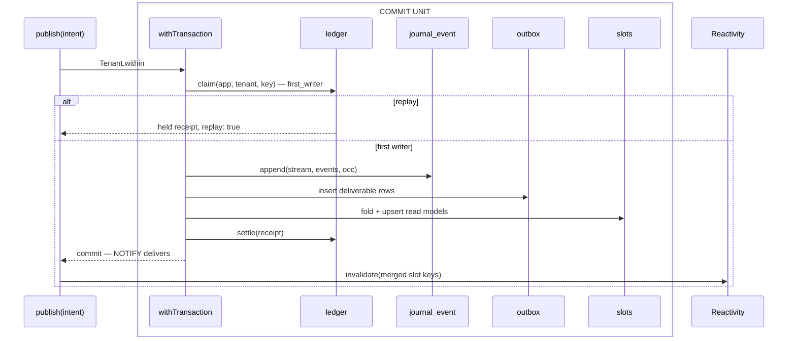

# [DATA_APPEND]

ONE write owner of the record of truth: journal, outbox, and idempotency ledger as a single atomic surface. Streams are keyed `(app, tenant, aggregate)` as one `StreamKey` value, events are closed `Schema.TaggedClass` families the log holds under one generation every transaction proves against, and optimistic concurrency is an `Occ` value checked under a per-stream advisory transaction lock with the unique `(stream, version)` constraint as the structural backstop.

`Journal.of(spec)` binds a family once and yields the bound surface — `append`, `head`, `read`, and `publish`, where publish folds the `first_writer` ledger claim, the OCC append, the outbox insert, the inline slots, and the ledger settle into ONE commit, a replay returning the stored receipt. One statement set runs the pg spine and every sqlite profile through the dialect arms, every bound member runs inside the `Tenant.within` pin, and this page owns queue-as-data — the relay statements the work plane drains through its `SqlClient` port — while execution semantics stay across that seam.

## [01]-[INDEX]

- [02]-[STREAM_VOCABULARY]: `StreamKey`, the event-family contract, the persisted row models, the ensure rows.
- [03]-[APPEND_SURFACE]: `Occ`, the locked OCC append, `VersionConflict`, `Fence` with the monotone-CAS `advance`, the receipt, the bulk lane.
- [04]-[LEDGER_CLAIM]: `IdempotencyKey`, the scope-qualified claim, the first-writer marker, the replay receipt.
- [05]-[ATOMIC_PUBLISH]: `publish` — claim, append, outbox, slots, settle, and wake inside one commit.
- [06]-[READ_SURFACE]: `head` and the windowed `read` stream decoded through the compiled family.
- [07]-[RELAY_ROWS]: `_Deliverable` with its announcement projection and lease generation, the SKIP-LOCKED claim/fenced-complete pair, the overlay bindings.
- [08]-[HOOK_POINTS]: `Hook` — the core-brand data hook points and the publisher port an app root mounts.

## [02]-[STREAM_VOCABULARY]

- Owner: `StreamKey` — one `Schema.Class` whose fields are the core identity brands with the aggregate brand-in-field; the interior `_Row` model typing the persisted event row, its `sequence` column decoding through the bigint-safe `_Sequence` codec so the model authority and the `BIGINT` DDL agree; the journal ensure rows the provisioning plane applies and `lane/capability.md` proves.
- Packages: `effect` (`Schema`); `@effect/sql` (`Model`); `@rasm/core` (`Identity.App`, `Identity.Tenant`).
- Growth: a new stream dimension is a `StreamKey` field with a column pair in the ensure rows and one operand on the identity fragment — every keyed surface in the folder re-keys with it because the class is the one spelling of stream identity.
- Law: the COMPOSED identity is one owned fragment with two composition shapes — `StreamKey.identity` joins a held key's bound values and `StreamKey.identityColumn` joins the relation's own escaped identifiers, both through one separator and one order — so the advisory lock's hash input and the head resolver's grouping key are provably the same string; a hand-repeated `|| ':' ||` at either site desyncs the lock from the resolver on the first separator or column-order edit, and nothing about that divergence is visible until two callers disagree over which stream they hold.
- Law: events are app-authored closed `Schema.TaggedClass` families — the journal stores their encoded form under the `(tag, payload)` coordinate and never interprets payloads, so a family reshapes without touching this page.
- Law: the payload column is `Model.JsonFromString` over TEXT in EVERY dialect, the pg spine included, because the stored bytes are the digest preimage the receipt's `subject` addresses — JSONB drops whitespace, key order, and duplicate keys at write, so a JSONB column hands every later read a respelling of the bytes the digest was minted over and the preservation slice, a dataref resolve, and any byte-true forward diverge silently; TEXT keeps stored bytes identical to inserted bytes, and no page hand-parses a payload column.
- Law: `sequence` is the global total order (identity column), `version` the per-stream order (the OCC coordinate); both are engine-generated or engine-checked, never computed in process.
- Law: the BIGINT read posture is PINNED, never inferred — `_safe` brackets every sequence-bearing statement with `SqlClient.SafeIntegers`, so the journal states the posture it reads under instead of accepting whatever a driver defaults to; the three-member codec below is the honest degrade for a driver that ignores the reference, never a substitute for declaring it.
- Law: `sequence` is bigint-safe end to end — the persisted model and every process-side read decode through `Journal.Sequence` (bigint, string, or number driver posture folds to `bigint`), because the global identity column grows unbounded across every stream and a `Number()` coercion past 2^53 silently corrupts checkpoints and joins; the STORED receipt rides `Schema.BigInt` alone, because that receipt round-trips through `Schema.parseJson` and the driver-posture union's identity member encodes `bigint` back out, which `JSON.stringify` refuses — one codec crosses a driver row, the other crosses a text column, and conflating them wedges the ledger settle on its first write.
- Law: per-stream `version` stays number-valued because aggregate cardinality is provably bounded, and it decodes through `Journal.Version` — the number-or-string codec — because a BIGINT column crosses the wire as text on the spine driver and as number on the sqlite profiles.
- Law: `recordedAt` is write time minted by `Model.DateTimeInsert` — domain time lives inside event payloads, and conflating the two is the named defect.
- Law: `Journal.relation(name, spine)` is the relation's ONE DDL owner — the ensure the deploy plane plants idempotently and the mint a cutover runs once under the shadow name are two heads over one body, so the shadow is the log's own shape rather than a structural copy that carries neither its keys nor its policy; the stream unique's name derives from the relation's (`Journal.unique`), because pg index names are schema-wide and a shadow under the live name refuses to exist, and the guard reads the live derivation.
- Law: the spine posture is the composition root's — `Journal.ddl(spine)` seats the ensure the root ships, and the partitioned spine carries no stream unique, because PostgreSQL refuses a unique constraint omitting the partition key; its OCC is the advisory lock and the head read alone, and the constraint-name re-spell arm sleeps there.
- Boundary: the tenant column is what `Tenancy.rls("journal_event")` predicates over; `Model.makeRepository` is banned on this table — the journal issues neither `UPDATE` nor `DELETE` against events, and erasure is `journal/retain.md`'s key destruction.

```typescript signature
import { Reactivity } from "@effect/experimental"
import {
  Model, SqlClient, SqlEventJournal, SqlEventLogServer, SqlSchema, type SqlError, type Statement,
} from "@effect/sql"
import { PgClient } from "@effect/sql-pg"
import type { CloudEvent, CloudEventV1 } from "cloudevents"
import {
  Array, Context, Data, DateTime, Effect, Either, Hash, HashMap, Option, Predicate, Record, Schedule, Schema,
  Stream, pipe, type ParseResult,
} from "effect"
import { Carrier, Digest, Event, Fault, Identity, Tap } from "@rasm/core"
import type { Capability } from "../lane/capability.ts"
import { Tenant, Tenancy } from "../lane/tenant.ts"
import { Live } from "../read/live.ts"
import { Generation, Payload } from "./generation.ts"

const _Sequence = Schema.Union(Schema.BigIntFromSelf, Schema.BigInt, Schema.BigIntFromNumber)

const _safe = <A, E, R>(effect: Effect.Effect<A, E, R>): Effect.Effect<A, E, R> =>
  Effect.provideService(effect, SqlClient.SafeIntegers, true)

const _VersionNumber = Schema.Int.pipe(Schema.between(0, Number.MAX_SAFE_INTEGER))

const _Version = Schema.Union(
  _VersionNumber,
  Schema.NumberFromString.pipe(Schema.int(), Schema.between(0, Number.MAX_SAFE_INTEGER)),
)

const _SEPARATOR = ":"

const _joined = (
  sql: SqlClient.SqlClient,
  parts: readonly [Statement.Fragment, Statement.Fragment, Statement.Fragment],
): Statement.Fragment => sql`${parts[0]} || ${_SEPARATOR} || ${parts[1]} || ${_SEPARATOR} || ${parts[2]}`

class StreamKey extends Schema.Class<StreamKey>("StreamKey")({
  app: Identity.App.fields.app,
  tenant: Identity.Tenant.fields.tenant,
  aggregate: Schema.NonEmptyString.pipe(
    Schema.pattern(/^[a-z][a-z0-9-]*\/[A-Za-z0-9._:-]+$/),
    Schema.brand("Aggregate"),
  ),
}) {
  static readonly identity = (sql: SqlClient.SqlClient, stream: StreamKey): Statement.Fragment =>
    _joined(sql, [sql`${stream.app}`, sql`${stream.tenant}`, sql`${stream.aggregate}`])
  static readonly identityColumn = (sql: SqlClient.SqlClient): Statement.Fragment =>
    _joined(sql, [sql`${sql("app")}`, sql`${sql("tenant")}`, sql`${sql("aggregate")}`])
}

class _Row extends Model.Class<_Row>("JournalEvent")({
  sequence: Model.Generated(_Sequence),
  app: Identity.App.fields.app,
  tenant: Identity.Tenant.fields.tenant,
  aggregate: StreamKey.fields.aggregate,
  version: _Version,
  tag: Schema.NonEmptyString,
  payload: Model.JsonFromString(Schema.Unknown),
  recorded_at: Model.DateTimeInsert,
}) {}

const _LOG = "journal_event"
const _STREAM_KEY = ["app", "tenant", "aggregate", "version"] as const
const _unique = (relation: string): string => `${relation}_stream`
const _STREAM_UNIQUE = _unique(_LOG)

declare namespace Journal {
  type Spine = keyof typeof _SPINES
  type Relation = {
    readonly ensure: Capability.Ensure
    readonly mint: Pick<Capability.Ensure, "pg" | "sqlite">
  }
}

const _SPINES = {
  monolith: {
    unique: (relation: string) => `,
    CONSTRAINT ${_unique(relation)} UNIQUE (${_STREAM_KEY.join(", ")})`,
    range: "",
    child: () => "",
  },
  partitioned: {
    unique: () => "",
    range: " PARTITION BY RANGE (sequence)",
    child: (relation: string) => `
  CREATE TABLE ${relation}_default PARTITION OF ${relation} DEFAULT;`,
  },
} as const

const _relation = (relation: string, spine: Journal.Spine): Journal.Relation => {
  const posture = _SPINES[spine]
  const pg = `${relation} (
    sequence BIGINT GENERATED ALWAYS AS IDENTITY PRIMARY KEY,
    app TEXT NOT NULL, tenant TEXT NOT NULL, aggregate TEXT NOT NULL,
    version BIGINT NOT NULL CHECK (version BETWEEN 1 AND 9007199254740991),
    tag TEXT NOT NULL,
    payload TEXT NOT NULL,
    recorded_at TIMESTAMPTZ NOT NULL DEFAULT now()${posture.unique(relation)})${posture.range};`
  const sqlite = `${relation} (
    sequence INTEGER PRIMARY KEY AUTOINCREMENT,
    app TEXT NOT NULL, tenant TEXT NOT NULL, aggregate TEXT NOT NULL,
    version INTEGER NOT NULL CHECK (version BETWEEN 1 AND 9007199254740991),
    tag TEXT NOT NULL,
    payload TEXT NOT NULL,
    recorded_at TEXT NOT NULL DEFAULT (strftime('%Y-%m-%dT%H:%M:%fZ','now')),
    CONSTRAINT ${_unique(relation)} UNIQUE (${_STREAM_KEY.join(", ")}));`
  return {
    ensure: {
      relation,
      pg: `CREATE TABLE IF NOT EXISTS ${pg}
  ${Tenancy.rls(relation)}`,
      sqlite: `CREATE TABLE IF NOT EXISTS ${sqlite}`,
    },
    mint: {
      pg: `CREATE TABLE ${pg}${posture.child(relation)}
  ${Tenancy.rls(relation)}`,
      sqlite: `CREATE TABLE ${sqlite}`,
    },
  }
}
```

## [03]-[APPEND_SURFACE]

- Owner: `Occ` carries concurrency expectation; `VersionConflict` carries mismatch evidence.
- Owner: `Journal.Fence` closes the verdict a store-validated conditional write answers; `Journal.advance` is the one monotone upsert answering it.
- Owner: `JournalFault` closes reason rows through `Fault.Class.family`.
- Owner: `_append` locks, admits, inserts, and returns every landed global sequence.
- Packages: `effect`, `@effect/sql`, and `@rasm/core` (`Fault.Class`).
- Entry: `bound.append(stream, events, occ)` — ONE entry whose plural modality is the input shape (`A | NonEmptyReadonlyArray<A>`), never an `appendMany` sibling; standalone it owns its commit, inside `publish` it folds to a savepoint.
- Receipt: `Journal.Receipt` — `{ stream, version, count, first, rows }` — the new head, the appended count, the first written version, and the encoded rows the outbox re-projects, each carrying its landed global `sequence` and the `subject` content key minted over the exact bytes this transaction wrote; the ledger stores it for replay and the publish wake announces the last sequence so drains skip empty cycles.
- Law: `subject` mints at the write and never at the projection — `Digest.mint("content", …)` reads the encoded payload text this statement inserts, so the announced content key addresses the stored bytes rather than a re-encoding of them, and the parse-then-reserialize spelling that respells float forms, key order, and escapes has no site here.
- Growth: a new write-side invariant is a guard inside `_append`, never a second append; a new event tag costs this page nothing — the union admits it and the family's own digest moves.
- Owner: `Journal.signal` folds a driver fault onto the closed `conflicted`/`refused`/`transient` vocabulary every retry gate in the folder reads.
- Law: concurrency is `Occ` — `Exact` fails as `VersionConflict` when the locked head disagrees, `None` demands version zero, `Any` serializes under the lock and appends at head; the advisory lock is `pg_advisory_xact_lock(hashtextextended(...))` on the spine and degrades to the single writer through `onDialectOrElse` — the unique constraint remains the structural backstop on the monolith spine and every sqlite profile, while the partitioned pg spine carries no stream unique at all (PostgreSQL refuses a unique constraint omitting the partition key) and rests on the lock and the head read, which already serialize every writer of one stream.
- Law: the structural backstop re-spells onto the SAME typed conflict — one contention fact reaches the caller on one channel, because the locked head read and the `journal_event_stream` violation are the same race refused at two depths and a recovery predicate gated on `VersionConflict` alone is dead code exactly on the profiles carrying no advisory lock; the fold runs at the insert, so `expected` carries the head the transaction admitted against and `actual` stays `Option.none` rather than fabricating a value the aborted transaction can no longer read.
- Law: the re-spell identifies the violated UNIQUE, never the code class alone — pg-wire carries the constraint name beside its SQLSTATE and the guard matches that name, while SQLite reports the violated index's COLUMNS and no sqlite driver carries a constraint field, so there the guard matches this relation's own key roster; either way a uniqueness refusal from another unique on this relation stays an ordinary fault instead of reaching a caller as a stream-version conflict it reload-fold-retries forever.
- Law: the classifier reads TWO channels because the drivers carry two — a `code` field where one exists, the engine's own message where none survives. Node, bun, and libSQL raise the SQLite extended result-code NAMES (bun beside a numeric `errno`, libSQL beside a numeric `rawCode`), so those profiles resolve on the same lookup the SQLSTATE rows serve; the wasm build raises the C API's primary result code as a NUMBER that separates no constraint from another, its OPFS worker crosses a `postMessage` boundary carrying the message string alone, and D1 wraps that same text behind its own prefix. `sqlite3_errmsg` reaches all three, so the message rows are the total route rather than a convenience, and the code lookup runs first so a driver naming its refusal exactly is never re-read out of prose.
- Law: the message rows are engine-fixed and the wrapping is per-profile — node and bun hand the engine sentence back bare, libSQL prefixes it with the extended result-code name, and D1 with its own tag — so containment matching survives every wrapper, the code table classifies every driver that names its refusal (node, bun, and libSQL carry the NAME; wasm the primary NUMBER, which the code lookup never matches), and an unrecognized fault on any profile still defaults to `transient` — patience the unbounded drain schedule already prices.
- Law: the signal vocabulary is three-valued and its default is `transient` — `conflicted` names a uniqueness refusal, `refused` names the enumerated rejections no retry can change, and every unrecognized code stays retryable, so an unmapped driver degrades to patience rather than to data loss.
- Law: the conflict carries evidence — `expected` and the optional read `actual` — so recovery is reload-fold-retry as data, and retrying rides a `Schedule` gated on the tag, never a loop.
- Law: `VersionConflict` classifies `conflicted`; reload-fold-retry owns recovery.
- Law: a monotone CAS answers a VERDICT and never `void` — the loser has to READ its own outcome, because a statement that reports nothing reports success and failure in the same silence. The verdict rides the swapped value, so `Journal.advance` answers the gate the store NOW holds and both arms leave with evidence.
- Law: the gate rides every ASSIGNMENT and never an `ON CONFLICT … WHERE` arm — a WHERE-gated upsert hands the loser NO row, so one empty roster spells "a fresher writer won" and "this identity vanished" alike, and the writer that reads it is left re-deriving an outcome it never observed; splicing `CASE WHEN <gate> THEN excluded.<column> ELSE <relation>.<column> END` into each assignment keeps the whole condition where the engine re-evaluates it PER CONFLICTING ROW, which is `[SNAPSHOT_FROZEN_GUARD]`'s posture, and leaves `RETURNING` total over both arms.
- Law: `Fence.Advanced` states that the store HOLDS the offered coordinate and never that this statement wrote it — a second writer offering the same coordinate lands the identical fold, so authorship is a question no gate can answer and no consumer asks; a snapshotter, a frontier handoff, and a relay settle all ask the one answerable question, whether the coordinate they carry is the current one.
- Law: `Fence.Vanished` reaches only a writer whose identity can disappear between the read and the write — `advance` inserts what it misses, so its RETURNING roster is exactly one row and the case answers nowhere on this arm, while the outbox lease's UPDATE over a groomable relation is precisely where it does.
- Law: `columns` is the ONE correspondence — the INSERT roster, the accepted row type, and the SET assignment set all derive from it while `key` and `gate` CHECK against it through `NoInfer` rather than driving inference, so a gate naming a column the row never carries is a compile break instead of a runtime statement fault; every one of those names is a sealed page-side value at each composing site exactly as `_GROOMS` seals its sweep relations, so no caller value reaches a statement identifier.
- Law: Generation skew classifies `invalid`; malformed message envelopes classify `malformed`.
- Law: Incomplete landing and unsettled replay receipts classify `breached`.
- Law: `Fault.Class` derives retryability, blame, and quarantine from `class` alone, so every fault leaving this page carries one — the tagged faults as a getter, and a raw `SqlError` through `Journal.classOf`, because a driver fault reaching `Fault.Class.of` with no `class` property grades `defect`, and `defect` refuses every retry and every failover without saying so.
- Law: `Journal.retryable` is the gate a budget or schedule takes over this page's statement faults — `Fault.Budget.schedule` defaults to the property grader, which is inert against a driver fault, so a drain that accepts that default parks a connection blip permanently instead of deferring it on the lease.
- Law: the transaction opens on `Generation.guard` — the shared app fence and the custody head read in one round trip, so a writer bound before a re-mint refuses typed as `GenerationSkew` before any row is written rather than landing superseded bytes in a re-minted log; the compiled family is the whole write coordinate, so the row carries a tag and its bytes and no per-entry shape stamp exists to drift.
- Law: the `RETURNING` roster is total over the encoded batch — every written version must carry its global sequence; a missing row fails on the `landing` reason of `JournalFault` and rolls back the transaction, so no receipt fabricates an identity sentinel.
- Law: `Journal.now(sql)` is the one dialect-now fragment — every sibling statement that stamps a timestamp splices it, so the dialect pair exists in exactly one spelling folder-wide.
- Boundary: encode faults are `ParseError` on the admission rail; the atomic composition is `[5]`'s.

```typescript signature
const _Subject = Schema.Struct({ stream: StreamKey, detail: Schema.NonEmptyString })

const _family = Fault.Class.family(["landing", "replay", "envelope"] as const, {
  landing: Fault.Class.row({
    class: "breached",
    leg: "append",
    detail: _Subject,
    render: ({ stream, detail }) => `${stream.aggregate} wrote version ${detail} and the RETURNING roster carried no sequence for it`,
  }),
  replay: Fault.Class.row({
    class: "breached",
    leg: "append",
    detail: _Subject,
    render: ({ stream, detail }) => `${stream.aggregate} holds claim ${detail} with no settled receipt to replay`,
  }),
  envelope: Fault.Class.row({
    class: "malformed",
    leg: "deliver",
    detail: _Subject,
    render: ({ stream, detail }) => `${stream.aggregate} built no carriable envelope — ${detail}`,
  }),
})

const _SIGNALS = {
  "22001": "refused",
  "23502": "refused",
  "23503": "refused",
  "23514": "refused",
  "23505": "conflicted",
  "42703": "refused",
  "42P01": "refused",
  SQLITE_CONSTRAINT_CHECK: "refused",
  SQLITE_CONSTRAINT_DATATYPE: "refused",
  SQLITE_CONSTRAINT_FOREIGNKEY: "refused",
  SQLITE_CONSTRAINT_NOTNULL: "refused",
  SQLITE_CONSTRAINT_PRIMARYKEY: "conflicted",
  SQLITE_CONSTRAINT_ROWID: "conflicted",
  SQLITE_CONSTRAINT_UNIQUE: "conflicted",
  SQLITE_ERROR: "refused",
  SQLITE_TOOBIG: "refused",
} as const satisfies Record.ReadonlyRecord<string, Journal.Signal>

const _TEXT = {
  "UNIQUE constraint failed": "conflicted",
  "PRIMARY KEY constraint failed": "conflicted",
  "CHECK constraint failed": "refused",
  "NOT NULL constraint failed": "refused",
  "FOREIGN KEY constraint failed": "refused",
  "no such table": "refused",
  "no such column": "refused",
  "string or blob too big": "refused",
} as const satisfies Record.ReadonlyRecord<string, Journal.Signal>

const _field = (fault: SqlError.SqlError, key: string): Option.Option<string> =>
  pipe(
    Option.liftPredicate(fault.cause, Predicate.isRecord),
    Option.flatMap((cause) => Record.get(cause, key)),
    Option.filter(Predicate.isString),
  )

const _text = (fault: SqlError.SqlError): Option.Option<string> =>
  Predicate.isString(fault.cause) ? Option.some(fault.cause) : _field(fault, "message")

const _signal = (fault: SqlError.SqlError): Journal.Signal =>
  Option.getOrElse(
    Option.orElse(
      Option.flatMap(_field(fault, "code"), (code) => Record.get(_SIGNALS, code)),
      () =>
        Option.flatMap(_text(fault), (message) =>
          Option.map(Record.findFirst(_TEXT, (_verdict, sentence) => message.includes(sentence)), ([, signal]) => signal)),
    ),
    (): Journal.Signal => "transient",
  )

const _violated = (fault: SqlError.SqlError): boolean =>
  Option.exists(_field(fault, "constraint"), (name) => name === _STREAM_UNIQUE) ||
  Option.exists(_text(fault), (message) => Array.every(_STREAM_KEY, (column) => message.includes(column)))

const _CLASSES = {
  conflicted: "conflicted",
  refused: "invalid",
  transient: "unavailable",
} as const satisfies Record.ReadonlyRecord<Journal.Signal, Fault.Class.Kind>

const _classOf = (fault: SqlError.SqlError): Fault.Class.Kind => _CLASSES[_signal(fault)]

const _retryable = (fault: SqlError.SqlError): boolean => Fault.Class.retryable(_classOf(fault))

class VersionConflict extends Schema.TaggedError<VersionConflict>()("VersionConflict", {
  stream: StreamKey,
  expected: _VersionNumber,
  actual: Schema.optionalWith(_VersionNumber, { as: "Option" }),
}) {
  get class(): Fault.Class.Kind {
    return "conflicted"
  }
  override get message(): string {
    const actual = Option.match(this.actual, { onNone: () => "unread", onSome: String })
    return `<journal:conflict> ${this.stream.aggregate} expected ${this.expected} actual ${actual}`
  }
}

class JournalFault extends Schema.TaggedError<JournalFault>()("JournalFault", {
  case: _family.payload,
}) {
  get class(): Fault.Class.Kind {
    return _family.classOf(this.case.reason)
  }
  get leg(): string {
    return _family.legOf(this.case.reason)
  }
  override get message(): string {
    return _family.render(this.case)
  }
}

declare namespace Journal {
  type Occ = Data.TaggedEnum<{
    Exact: { readonly version: number }
    None: {}
    Any: {}
  }>
  type Signal = "conflicted" | "refused" | "transient"
  type Conflict = VersionConflict
  type Event = { readonly _tag: string }
  type Spec<A extends Event, I> = {
    readonly family: Schema.Schema<A, I>
    readonly generation: Generation.Held
  }
  type Receipt = typeof _Receipt.Type
  type Fence<G> = Data.TaggedEnum<{
    Advanced: { readonly held: G }
    Stale: { readonly offered: G; readonly held: G }
    Vanished: {}
  }>
  type Advance<K extends string, G, I> = {
    readonly relation: string
    readonly columns: Array.NonEmptyReadonlyArray<K>
    readonly key: Array.NonEmptyReadonlyArray<NoInfer<K>>
    readonly gate: NoInfer<K>
    readonly touched: string
    readonly coordinate: Schema.Schema<G, I>
  }
}

const _Occ = Data.taggedEnum<Journal.Occ>()

interface _FenceKind extends Data.TaggedEnum.WithGenerics<1> {
  readonly taggedEnum: Journal.Fence<this["A"]>
}

const _Fence = Data.taggedEnum<_FenceKind>()

const _advance = <const K extends string, G extends number | bigint, I>(spec: Journal.Advance<K, G, I>) => {
  const _Answered = Schema.Tuple(Schema.Struct({ held: spec.coordinate }))
  const carried = Array.difference(spec.columns, spec.key)
  return (sql: SqlClient.SqlClient, row: Record.ReadonlyRecord<K, unknown>, offered: G) => {
    const stored = (column: string): Statement.Fragment => sql`${sql(spec.relation)}.${sql(column)}`
    const fresher = sql`excluded.${sql(spec.gate)} > ${stored(spec.gate)}`
    const assign = (column: string, fresh: Statement.Fragment): Statement.Fragment =>
      sql`${sql(column)} = CASE WHEN ${fresher} THEN ${fresh} ELSE ${stored(column)} END`
    return Effect.map(
      Effect.flatMap(
        sql`INSERT INTO ${sql(spec.relation)} ${sql.insert([row])}
            ON CONFLICT (${sql.csv(Array.map(spec.key, (column) => sql(column)))}) DO UPDATE
            SET ${sql.csv([
              ...Array.map(carried, (column) => assign(column, sql`excluded.${sql(column)}`)),
              assign(spec.touched, _now(sql)),
            ])}
            RETURNING ${sql(spec.gate)} AS held`,
        Schema.decodeUnknown(_Answered),
      ),
      ([{ held }]): Journal.Fence<G> =>
        held === offered ? _Fence.Advanced({ held }) : _Fence.Stale({ offered, held }),
    )
  }
}

const _utf8 = new TextEncoder()

const _Landed = Schema.Struct({ sequence: _Sequence, version: _Version })

const _head = (sql: SqlClient.SqlClient, stream: StreamKey) =>
  SqlSchema.single({
    Request: StreamKey,
    Result: Schema.Struct({ head: _Version }),
    execute: (key) =>
      sql`SELECT coalesce(max(version), 0) AS head FROM journal_event
          WHERE app = ${key.app} AND tenant = ${key.tenant} AND aggregate = ${key.aggregate}`,
  })(stream).pipe(Effect.map((row) => row.head))

const _append = <A extends Journal.Event, I>(spec: Journal.Spec<A, I>) =>
  (stream: StreamKey, events: A | Array.NonEmptyReadonlyArray<A>, occ: Journal.Occ) =>
    Effect.flatMap(SqlClient.SqlClient, (sql) =>
      sql.withTransaction(
        Effect.gen(function* () {
          const batch: Array.NonEmptyReadonlyArray<A> = Array.isArray(events) ? events : Array.of(events)
          yield* Generation.guard(sql, spec.generation)
          yield* sql.onDialectOrElse({
            orElse: () => sql`SELECT 1`,
            pg: () =>
              sql`SELECT pg_advisory_xact_lock(hashtextextended(${StreamKey.identity(sql, stream)}, 0))`,
          })
          const held = yield* _head(sql, stream)
          yield* _Occ.$match(occ, {
            Exact: ({ version }) =>
              held === version
                ? Effect.void
                : Effect.fail(new VersionConflict({ stream, expected: version, actual: Option.some(held) })),
            None: () =>
              held === 0
                ? Effect.void
                : Effect.fail(new VersionConflict({ stream, expected: 0, actual: Option.some(held) })),
            Any: () => Effect.void,
          })
          const encode = Schema.encode(Schema.parseJson(spec.family))
          const rows = yield* Effect.forEach(batch, (event, index) =>
            Effect.gen(function* () {
              const payload = yield* encode(event)
              return {
                app: stream.app,
                tenant: stream.tenant,
                aggregate: stream.aggregate,
                version: held + 1 + index,
                tag: event._tag,
                payload,
              }
            }))
          const landed = yield* _safe(Effect.flatMap(
            sql`INSERT INTO journal_event ${sql.insert(rows)} RETURNING sequence, version`,
            Schema.decodeUnknown(Schema.Array(_Landed)),
          )).pipe(
            Effect.catchTag("SqlError", (fault) =>
              _signal(fault) === "conflicted" && _violated(fault)
                ? Effect.fail(new VersionConflict({ stream, expected: held, actual: Option.none() }))
                : Effect.fail(fault)),
          )
          const bySequence = HashMap.fromIterable(Array.map(landed, (row) => [row.version, row.sequence] as const))
          const received = yield* Effect.forEach(rows, (row) =>
            Effect.all({
              sequence: Effect.fromOption(HashMap.get(bySequence, row.version), () =>
                new JournalFault({ case: { reason: "landing", stream, detail: String(row.version) } })),
              subject: Digest.mint("content", _utf8.encode(row.payload)),
            }).pipe(Effect.map(({ sequence, subject }) => ({
              sequence,
              version: row.version,
              tag: row.tag,
              payload: row.payload,
              subject,
            }))))
          return {
            stream,
            version: held + batch.length,
            count: batch.length,
            first: held + 1,
            rows: received,
          } satisfies Journal.Receipt
        }),
      ))
```

## [04]-[LEDGER_CLAIM]

- Owner: the `idempotency_ledger` ensure row, the `IdempotencyKey` brand, and `_claim` — the one statement that inserts-or-touches the scope-qualified `(app, tenant, key)` identity and reports first-writer truth with the stored receipt in a single round trip; `_settle` writes the receipt through the same identity.
- Packages: `@effect/sql` (`sql.insert`, `sql.onDialectOrElse`); `effect` (`Option`, `Schema`).
- Receipt: `Journal.Claim` — `{ key, first, held }` — `first` from the explicit `first_writer` insert/update marker shared by both dialects; timestamp equality and PostgreSQL transaction internals never stand in for protocol state. This one row serves a replay whole, and the claim decodes through one `SqlSchema.single`; `Journal.Receipt` derives from `_Receipt.Type`, so the stored schema and process type cannot drift.
- Growth: a new ledger dimension (scope column, expiry class) is a column pair and a field on the claim row — the statement shape never changes.
- Law: the claim is one statement — `INSERT … ON CONFLICT (app, tenant, key) DO UPDATE SET touched_at = …, first_writer = false RETURNING first_writer AS inserted, receipt` — the spine's `conflictClaim` primitive row realized; a SELECT-then-INSERT pair is the torn spelling.
- Law: idempotency identity includes the tenant coordinate — equal caller keys in different apps or tenants are independent claims, and settle repeats the full predicate so one scope cannot overwrite another scope's receipt.
- Law: the ledger stores the receipt after the append succeeds, so a replayed key returns the ORIGINAL receipt — idempotency means the duplicate caller cannot distinguish itself from the first writer.
- Law: ledger rows age by `touched_at` under a `journal/retain.md` window — a replay past the window is a fresh publish by declaration, and the window is a policy value, never a literal.

```typescript signature
const _IdempotencyKey = Schema.NonEmptyString.pipe(Schema.maxLength(200), Schema.brand("IdempotencyKey"))

const _Receipt = Schema.Struct({
  stream: StreamKey,
  version: _Version,
  count: Schema.Int.pipe(Schema.positive()),
  first: _Version.pipe(Schema.positive()),
  rows: Schema.NonEmptyArray(Schema.Struct({
    sequence: Schema.BigInt,
    version: _Version,
    tag: Schema.String,
    payload: Schema.String,
    subject: Digest.Key.content,
  })),
})

declare namespace Journal {
  type Key = typeof _IdempotencyKey.Type
  type Claim = {
    readonly key: Key
    readonly first: boolean
    readonly held: Option.Option<Journal.Receipt>
  }
}

const _Flag = Schema.Union(Schema.Boolean, Model.BooleanFromNumber)

const _Claimed = Schema.Struct({
  inserted: _Flag,
  receipt: Schema.OptionFromNullOr(Payload.json(_Receipt)),
})

const _claim = (sql: SqlClient.SqlClient, stream: StreamKey, key: Journal.Key) =>
  SqlSchema.single({
    Request: Schema.Struct({ key: _IdempotencyKey, app: StreamKey.fields.app, tenant: StreamKey.fields.tenant }),
    Result: _Claimed,
    execute: (row) =>
      sql`INSERT INTO idempotency_ledger ${sql.insert([{ ...row, first_writer: true }])}
          ON CONFLICT (app, tenant, key) DO UPDATE SET touched_at = ${_now(sql)}, first_writer = false
          RETURNING first_writer AS inserted, receipt`,
  })({ key, app: stream.app, tenant: stream.tenant }).pipe(
    Effect.map((row): Journal.Claim => ({ key, first: row.inserted, held: row.receipt })),
  )

const _settle = (sql: SqlClient.SqlClient, stream: StreamKey, key: Journal.Key, receipt: Journal.Receipt) =>
  Effect.flatMap(
    Schema.encode(Schema.parseJson(_Receipt))(receipt),
    (held) => sql`UPDATE idempotency_ledger SET receipt = ${held}
                  WHERE app = ${stream.app} AND tenant = ${stream.tenant} AND key = ${key}`,
  )

const _ledgerDdl: Capability.Ensure = {
  relation: "idempotency_ledger",
  pg: `CREATE TABLE IF NOT EXISTS idempotency_ledger (
    key TEXT NOT NULL,
    app TEXT NOT NULL, tenant TEXT NOT NULL,
    receipt TEXT,
    first_writer BOOLEAN NOT NULL DEFAULT true,
    claimed_at TIMESTAMPTZ NOT NULL DEFAULT now(),
    touched_at TIMESTAMPTZ NOT NULL DEFAULT now(),
    PRIMARY KEY (app, tenant, key));
  ${Tenancy.rls("idempotency_ledger")}`,
  sqlite: `CREATE TABLE IF NOT EXISTS idempotency_ledger (
    key TEXT NOT NULL,
    app TEXT NOT NULL, tenant TEXT NOT NULL,
    receipt TEXT,
    first_writer INTEGER NOT NULL DEFAULT 1 CHECK (first_writer IN (0, 1)),
    claimed_at TEXT NOT NULL DEFAULT (strftime('%Y-%m-%dT%H:%M:%fZ','now')),
    touched_at TEXT NOT NULL DEFAULT (strftime('%Y-%m-%dT%H:%M:%fZ','now')),
    PRIMARY KEY (app, tenant, key));`,
}
```

## [05]-[ATOMIC_PUBLISH]

- Owner: `bound.publish(intent)` — the one write entry apps and edges call; everything the commit must carry is a field of `Journal.Intent`, and the inline projection slots arrive as values, never as imports.
- Packages: `effect` (`Effect`, `Hash`, `Option`, `Stream`); `@effect/sql` (`sql.withTransaction`); `@effect/sql-pg` (`PgClient.listen` — the spine wake stream, read as an optional service); `@effect/experimental` (`Reactivity.invalidate`); `data/read/live.md` (`Live.Keys`, `Live.merged`).
- Entry: `bound.publish(intent)` runs inside the scope's `Tenant.within` — the pin binds the client, so publish outside the tenancy boundary is unspellable; `intent` carries stream, events, occ, the optional idempotency key, the deliverable urgency, and the slot values the inline projection lane inhabits.
- Law: `urgency` stamps at enqueue as an opaque integer, ascending-first — this page owns the column and the ORDER BY term, the drain owns what the number MEANS (`runtime:work/queue#LANE_POLICY` populates it from its own service-class row), so the ordering axis crosses the seam as a value and neither end imports the other's vocabulary; a claim ordered by insert identity alone strands an interactive deliverable behind a bulk backlog no matter what policy the drain declares.
- Receipt: `Journal.Published` — `{ journal, key, replay }` — the append receipt, the claiming key when present, and `replay: true` when the ledger served a duplicate.
- Growth: a new atomic participant is one step inside the transaction fold, never a second publish; a new wake consumer composes `Journal.wake(app)` — the channel derives from the app key bounded to the NOTIFY identifier cap, parameterized ingress.
- Law: ordering inside the transaction is load-bearing — claim first (a replay short-circuits before any write), append second, outbox third, slots fourth, settle last; the pg arm invokes `pg_notify(channel, payload)` through the transaction-bound `SqlClient`, so PostgreSQL delivers at commit and a rolled-back publish wakes nobody. `PgClient.notify` is rejected here because its published body calls the pool directly and does not enlist in this transaction.
- Law: the NOTIFY payload is the last landed global `sequence` — a drain daemon compares it against its checkpoint and skips the claim transaction when no work exists, so a high-fanout deployment pays zero empty wake cycles; the payload is an accelerator only, and a garbled payload costs one probing cycle, never correctness. `Journal.wake` catches only `SqlError` into the empty stream because the relay's lease-width tick is the durable fallback; a listener loss delays the next claim and cannot lose a deliverable.
- Law: publish is total over its faults — `VersionConflict`, `JournalFault`, `GenerationSkew`, `HookVeto`, `SqlError`, `ParseError`; a log holding a shape this binding does not carry, an incomplete `RETURNING` roster, a duplicate claim lacking its settled receipt, or an app-armed admission veto fails typed and rolls back whole.
- Law: the hook points bracket the commit from both sides — the `journalPublish` veto runs pre-append inside the transaction after the replay short-circuit (a replay is already-settled truth no policy re-adjudicates), and the observe fan rides `Tenant.afterCommit` beside the Live stamp, so a subscriber can never see pre-commit state, join the commit, or slow the write path beyond the post-commit drain it subscribed to.
- Law: each slot returns the read owner's exact `Live.Keys` value; publish composes the roster through `Live.merged` and registers one `Reactivity.invalidate` through `Tenant.afterCommit`. `Tenant.within` drains the invocation-local roster only after its outer transaction commits. Savepoint release, rollback, and ledger replay stamp nothing, so no reader can wake into pre-commit state and no duplicate commit emits a second mutation.


```mermaid
sequenceDiagram
  accTitle: Atomic journal publish
  accDescr: The transaction claims idempotency, appends events and deliverables, projects slots, settles the receipt, commits, and then invalidates reactive readers.
  participant P as publish(intent)
  box transparent COMMIT UNIT
    participant T as withTransaction
    participant L as ledger
    participant J as journal_event
    participant O as outbox
    participant S as slots
  end
  participant R as Reactivity
  P->>T: Tenant.within
  T->>L: claim(app, tenant, key) — first_writer
  alt replay
    L-->>P: held receipt, replay: true
  else first writer
    T->>J: append(stream, events, occ)
    T->>O: insert deliverable rows
    T->>S: fold + upsert read models
    T->>L: settle(receipt)
    T-->>P: commit — NOTIFY delivers
    P->>R: invalidate(merged slot keys)
  end
```

```typescript signature
declare namespace Journal {
  type Slot<A> = {
    readonly keys: (stream: StreamKey) => Live.Keys
    readonly project: (stream: StreamKey, events: Array.NonEmptyReadonlyArray<A>, receipt: Journal.Receipt) => Effect.Effect<
      void,
      SqlError.SqlError | ParseResult.ParseError,
      SqlClient.SqlClient
    >
  }
  type Intent<A> = {
    readonly stream: StreamKey
    readonly events: A | Array.NonEmptyReadonlyArray<A>
    readonly occ: Occ
    readonly key: Option.Option<Key>
    readonly urgency: number
    readonly classification: Event.Class
    readonly slots: ReadonlyArray<Slot<A>>
  }
  type Published = {
    readonly journal: Receipt
    readonly key: Option.Option<Key>
    readonly replay: boolean
  }
}

const _CHANNEL = { stem: 46, seal: 8 } as const

const _channel = (app: Identity.App.Key): string =>
  app.length <= _CHANNEL.stem + _CHANNEL.seal + 1
    ? `journal:${app}`
    : `journal:${app.slice(0, _CHANNEL.stem)}-${(Hash.string(app) >>> 0).toString(16).padStart(_CHANNEL.seal, "0")}`

const _RELISTEN = Schedule.jittered(Schedule.spaced("5 seconds"))

const _wake = (app: Identity.App.Key): Stream.Stream<string> =>
  Stream.unwrap(
    Effect.map(Effect.serviceOption(PgClient.PgClient), Option.match({
      onNone: () => Stream.empty,
      onSome: (pg) => pg.listen(_channel(app)),
    })),
  ).pipe(Stream.retry(_RELISTEN), Stream.catchTag("SqlError", () => Stream.empty))

const _deliverables = <A extends Journal.Event>(intent: Journal.Intent<A>, receipt: Journal.Receipt) =>
  Array.map(receipt.rows, (row) => ({
    sequence: row.sequence,
    app: intent.stream.app,
    tenant: intent.stream.tenant,
    aggregate: intent.stream.aggregate,
    version: row.version,
    tag: row.tag,
    subject: row.subject,
    classification: intent.classification,
    payload: row.payload,
    urgency: intent.urgency,
  }))

const _publish = <A extends Journal.Event, I>(spec: Journal.Spec<A, I>) =>
  (intent: Journal.Intent<A>) =>
    Effect.flatMap(SqlClient.SqlClient, (sql) =>
      sql.withTransaction(
        Effect.gen(function* () {
          const claim = yield* Effect.transposeOption(
            Option.map(intent.key, (key) => _claim(sql, intent.stream, key)))
          const replay = yield* Option.match(claim, {
            onNone: () => Effect.succeed(Option.none<Journal.Receipt>()),
            onSome: (held) =>
              held.first
                ? Effect.succeed(Option.none<Journal.Receipt>())
                : Effect.map(
                    Effect.fromOption(held.held, () =>
                      new JournalFault({ case: { reason: "replay", stream: intent.stream, detail: String(held.key) } })),
                    Option.some,
                  ),
          })
          return yield* Option.match(replay, {
            onSome: (held) =>
              Effect.succeed<Journal.Published>({ journal: held, key: intent.key, replay: true }),
            onNone: () =>
              Effect.gen(function* () {
                const batch: Array.NonEmptyReadonlyArray<A> = Array.isArray(intent.events)
                  ? intent.events
                  : Array.of(intent.events)
                yield* Hook.gated("journalPublish", {
                  stream: intent.stream,
                  count: batch.length,
                  tags: Array.map(batch, (event) => event._tag),
                })
                const journal = yield* _append(spec)(intent.stream, intent.events, intent.occ)
                yield* sql`INSERT INTO outbox ${sql.insert(_deliverables(intent, journal))}`
                yield* Effect.forEach(intent.slots, (slot) => slot.project(intent.stream, batch, journal), { discard: true })
                yield* Effect.transposeOption(Option.map(intent.key, (key) => _settle(sql, intent.stream, key, journal)))
                yield* sql.onDialectOrElse({
                  orElse: () => Effect.void,
                  pg: () => sql`SELECT pg_notify(
                    ${_channel(intent.stream.app)},
                    ${String(Array.lastNonEmpty(journal.rows).sequence)}
                  )`,
                })
                return { journal, key: intent.key, replay: false } satisfies Journal.Published
              }),
          })
        }),
      ).pipe(
        Effect.tap((published) =>
          published.replay
            ? Effect.void
            : Effect.flatMap(Tenant, (tenant) =>
                tenant.afterCommit(
                  Effect.zipRight(
                    Reactivity.invalidate(
                      Live.merged(Array.map(intent.slots, (slot) => slot.keys(intent.stream))).coordinates,
                    ),
                    Hook.tapped("journalPublish", {
                      stream: intent.stream,
                      count: published.journal.count,
                      tags: Array.map(published.journal.rows, (row) => row.tag),
                    }),
                  ),
                ))),
      ))
```

## [06]-[READ_SURFACE]

- Owner: the bound `head` and `read` members — `read` is a backpressured statement stream decoded row-by-row through the compiled family into live values.
- Packages: `effect` (`Stream`); `@effect/sql` (`Statement.stream` over the backpressured cursor).
- Entry: `bound.read(stream, window?)` — the one replay road; projection lanes, `journal/retain.md`'s DSAR fold, and snapshot-tail hydration compose it with a `from` window instead of minting SELECT.
- Growth: a new read shape (by tag, by time) is a window field, never a sibling read.
- Law: `_EventRow` is the envelope's projection plus this relation's own `version` column, so the decoded row carries the stored bytes and the compiled family proves them — the decoded family value is the only shape past this seam, a malformed payload surfaces as `ParseError` exactly once at the admission, and no cursor cell is hand-coerced.
- Law: the read composes the compiled family with the column codec ONCE at the binding, so the stream's per-row cost is one decode and the generation the guard proved at write is the generation this read assumes; a log a re-mint moved under an open reader answers the reader's next transaction with skew.

```typescript signature
const _EventRow = Schema.Struct({
  ...Payload.Envelope.fields,
  version: _Version,
})

const _read = <A extends Journal.Event, I>(spec: Journal.Spec<A, I>) =>
  (stream: StreamKey, window?: { readonly from?: number; readonly to?: number }) =>
    Stream.unwrap(
      Effect.map(SqlClient.SqlClient, (sql) =>
        sql`SELECT tag, payload, version FROM journal_event
            WHERE app = ${stream.app} AND tenant = ${stream.tenant} AND aggregate = ${stream.aggregate}
              AND version >= ${window?.from ?? 1} AND version <= ${window?.to ?? Number.MAX_SAFE_INTEGER}
            ORDER BY version`.stream.pipe(
          Stream.mapEffect((raw) =>
            Effect.flatMap(
              Schema.decodeUnknown(_EventRow)(raw),
              (row) => Schema.decodeUnknown(Payload.json(spec.family))(row.payload),
            )),
        )),
    )
```

## [07]-[RELAY_ROWS]

- Owner: `_Deliverable` and the outbox ensure row own queued journal records.
- Owner: `Journal.claimBatch`, `Journal.complete`, and `Journal.census` are the work-plane SQL ports.
- Owner: `_Deliverable.envelope` and `Journal.carrier` own the announcement projection and its authenticated inverse.
- Owner: `_overlay` binds EventLog storage onto the owning `SqlClient`.
- Packages: `@effect/sql` (`Model`, `sql.in`, `SqlEventJournal`, `SqlEventLogServer`); `@rasm/core` (`Event` — the branch's one mint entry, roster, and grammar; `Digest` — the content-key mint).
- Entry: the work plane drains through its `SqlClient` port with these statement values — `claimBatch(sql, request)` takes the decoded `_ClaimBatch` carrier, and `complete(sql, held)` requires the non-empty `Journal.Held` roster the claim itself answered, each row's identity travelling beside the generation the claim minted for it; this page publishes the vocabulary, the drain owns fan-out policy, retry budgets, and egress quota; the async projection lane listens on the same channel.
- Growth: a new deliverable dimension (deliver-at, shard affinity) is a column and a `claimBatch` ORDER BY term — the drain contract never widens.
- Law: claim order is `(urgency, id)` — the urgency term ahead of insert identity, so ordering is a stamped policy value and FIFO is the degenerate case where every publisher stamps one number; the partial pending index leads on the same pair, because an ORDER BY term the index cannot serve turns each claim into a scan of the whole undelivered backlog.
- Law: the relay's tenancy is `multi` and STATED, never inherited from the caller's scope — `claimBatch` predicates on `app` alone by design, one drain serving every tenant of an app, so it runs under the MAINTENANCE-PLANE session posture `lane/tenant.md` mints: `outbox` registers RLS and the landed policy is FORCE, so an unpinned session reads ZERO deliverables and reports each empty claim as healthy, while a drain started inside `Tenant.within` claims that tenant's rows exclusively and every other tenant's deliverables sit undelivered behind a lease that keeps lapsing — the plane posture is the one session state that widens the claim to the app's whole estate, and its coordinate and policy arm are the tenancy owner's. `publish` answers the opposite coordinate — `single`, pinned, stamping the tenant column the drain later carries — so the two ends of one relation decide tenancy separately and each says which it is.
- Law: `census` shares the relay's plane — it answers per `app` across every tenant, so its depth and age gauges describe the backlog the drain claims; sampled under a tenant pin it reports one tenant's slice as the whole plane's health, and sampled unpinned it reads an empty relation under the FORCE policy — both are the misreads the maintenance-plane posture forecloses.
- Law: `claimBatch` is the competing-consumer claim realizing the `skipLocked` primitive row — attempts increment on every claim so poison rows surface as data, the `lease` generation increments beside them so the claim MINTS the identity its own completion later proves, and the visibility-timeout redelivery idiom is the `claimed_at` lease predicate: a claimed row is invisible for `leaseSeconds`, so a crashed claimant's rows redeliver only after the lease lapses and the displaced claimant's own completion refuses typed at the fence rather than overwriting the live one; the sqlite arm serializes on the single writer and drops the lock clause while keeping both. `SqlSchema.findAll` decodes every returned identity and payload through `_Deliverable`; raw driver rows never cross the data seam.
- Law: the lease is TWO facts and each carries its own column — `claimed_at` prices EXPIRY so a crashed claimant's rows redeliver, and `lease` carries IDENTITY, a per-row generation `claimBatch` bumps on every claim so the holder is nameable at the write; time alone fences nothing, because a claimant whose window lapsed while it was transmitting still holds the same ids and still spells a completion the store cannot tell from the live claimant's, which is the lost update the visibility timeout was never able to close.
- Law: `complete` fences on the held generation and answers `Journal.Fence` per requested id — the gate rides the `delivered_at` ASSIGNMENT while the id roster rides the WHERE, so EVERY requested row returns the lease it currently carries: a holder whose generation still stands marks delivered and reads `Advanced`, a lapsed one marks nothing and reads `Stale` carrying the generation that displaced it, and an id the groom already took reads `Vanished`; the answer is TOTAL over the request, so a drain meters settled against refused instead of reading a statement's silence as delivery.
- Law: `lease` is its own column and never `attempts` — the two counters move together at the claim and part everywhere else, because a park replay resets attempts by design and a fence that ever resets is an ABA the next lapsed holder walks straight through; `attempts` stays the poison-census column the redelivery gauge reads.
- Law: the settle's cost is one no-op write per displaced row and that cost is already paid — the id roster locks and touches exactly the rows the unfenced mark touched, so the fence buys its refusal for a dead tuple where the old spelling bought a lost delivery; a displaced holder that finds a live claimant mid-commit waits on that row's lock and then writes nothing, which is the ordering the unfenced form waited for and then overwrote.
- Law: each deliverable carries the journal's global `sequence` beside its stream version, so a drain receipt, checkpoint, or forensic join names the exact source fact without re-querying by payload coordinates.
- Law: outbox observability is the census projected across the seam — `Journal.census` answers `{ depth, oldest, redelivered }` in one decoded aggregate, the runtime meter bridge samples it through its `Probe` port and sets the `Convention.metric.outboxDepth`/`outboxAge`/`outboxRedelivered` gauges, and this page mints no instrument: the outbox rows stay the evidence truth and the gauges stay the lossy dashboard projection.
- Law: the announcement is a projection fold the claimed row owns and never a second record of truth — `_Deliverable.envelope` composes `Event.rasm.mint`, so this page states no attribute grammar or SDK construction.
- Law: the addressed attributes decode ONCE through `Event.rasm.Fact`; this opaque JSON payload publishes no `dataschema`, while the log's own generation remains journal state rather than an envelope alias.
- Law: `subject` publishes the content key as 32 LOWERCASE hex and `data` carries the exact UTF-8 bytes that key addresses. No `dataref` is projected: the relay retains the subject-bound bytes and every binding frames that one payload rather than resolving or reserializing a second representation.
- Law: the app's event family spells its own `_tag` as the estate grammar's `rasm.<domain>.<subject>.<fact>`, since the tag IS the announced `type`; a tag outside that grammar fails typed at the projection rather than reaching a subscription that keys on it, and the tag carries no version tail because the log's own generation answers every shape question.
- Law: the journal relay states `journal` as its stable producer capability beside the event type; the type's subject remains the payload's domain concept, while stream coordinates stay in `partitionkey` and never enter producer identity.
- Law: the announced `type` carries event semantics whole and the log's generation reaches no envelope attribute — a store coordinate published as an announcement field impersonates a payload schema URI every subscriber then keys on.
- Law: the landed global `sequence` is both producer operation identity and the generated D20 string extension; bigint formatting left-pads to exactly 20 digits, so lexical and numeric order agree without Number coercion or a duplicate sequence-domain field.
- Tests: sequence `2` projects as `00000000000000000002` before `10` as `00000000000000000010`, and both the event identity and generated extension carry that one spelling.
- Law: `partitionkey` is the stream triple, so a transport partitioning on it keeps one aggregate's announcements in one ordering domain, and `dataclassification` is the writer's declared grade a binding reads before deciding the payload crosses at all.
- Law: `Carrier.promote` seats the complete tenant scope before the mint injects, so the CREATION-time trace and the tenant baggage ride the roster extensions the mint writes; the transport's own hop context is its binding's, never this projection's.
- Law: binding mode is the transport's fact across the claim seam — the runtime engine selects structured versus binary through its own binding row and carries the VALUE this page mints; no `Binding`, `Mode`, or emitter surface is reached here, and the process-global `Emitter` singleton stays banned estate-wide.
- Law: `Journal.carrier` parses through `Carrier.extract("cloudevents", ...)` and answers `Journal.Carried` whole — the tenancy verdict on `context`, the extraction's own `Fault.Ledger.Census` on `dropped`.
- Law: the extraction census is TOTAL over the inverse and never folds into the refusal — propagation damage is a fact of the announcement rather than of the tenancy vote, and a census a refusal swallows is the silence the drop vocabulary exists to end; this page mints no instrument, so the intake holding the fiber spends it.
- Law: `Identity.Tenant.alike` admits only the authenticated full scope; every mismatch folds to `Option.none`.
- Law: Successful inverse re-promotes authenticated tenancy and removes duplicate tenant members.
- Law: the overlay bindings are overlay ONLY — the EventLog journal and sync-server storage persist onto this owning `SqlClient`, accelerate local-first reads, and are never the record of truth; a record whose loss corrupts state lives in THIS journal and projects outward, never the reverse.
- Law: `layerStorageSubtle` is the default overlay posture — zero-knowledge storage for the untrusted multi-tenant deployment, where the server persists ciphertext it cannot read; the plain `layerStorage` row is the explicit single-tenant opt-in, selected at the composition root.
- Law: the overlay backings are adopted only while their table bootstrap is verifiably ensure-shaped — idempotent, additive, provision-runnable; otherwise their DDL is owned locally beside these rows and the layers still bind.

```typescript signature
class _Deliverable extends Model.Class<_Deliverable>("OutboxRow")({
  id: Model.Generated(_Sequence),
  sequence: _Sequence,
  app: Identity.App.fields.app,
  tenant: Identity.Tenant.fields.tenant,
  aggregate: StreamKey.fields.aggregate,
  version: _Version,
  tag: Schema.NonEmptyString,
  subject: Digest.Key.content,
  classification: Event.rasm.classes.schema,
  payload: Schema.String,
  urgency: Schema.Int,
  attempts: Schema.Int,
  lease: Model.Generated(_Sequence),
  created_at: Model.DateTimeInsert,
  claimed_at: Model.FieldOption(Schema.DateTimeUtc),
  delivered_at: Model.FieldOption(Schema.DateTimeUtc),
}) {
  envelope(carrier: Carrier.Context): Effect.Effect<CloudEvent<unknown>, JournalFault> {
    return _envelope(this, carrier)
  }
  get held(): Journal.Held {
    return { id: this.id, lease: this.lease }
  }
}

declare namespace Journal {
  type Deliverable = _Deliverable
  type Held = { readonly id: bigint; readonly lease: bigint }
  type Settlement = { readonly id: bigint; readonly fence: Fence<bigint> }
  type Carried = { readonly context: Option.Option<Carrier.Context>; readonly dropped: Fault.Ledger.Census }
}

const _ClaimBatch = Schema.Struct({
  app: Identity.App.fields.app,
  take: Schema.Int.pipe(Schema.positive()),
  leaseSeconds: Schema.Int.pipe(Schema.positive()),
})

const _outboxDdl: Capability.Ensure = {
  relation: "outbox",
  pg: `CREATE TABLE IF NOT EXISTS outbox (
    id BIGINT GENERATED ALWAYS AS IDENTITY PRIMARY KEY,
    sequence BIGINT NOT NULL,
    app TEXT NOT NULL, tenant TEXT NOT NULL, aggregate TEXT NOT NULL,
    version BIGINT NOT NULL CHECK (version BETWEEN 1 AND 9007199254740991), tag TEXT NOT NULL,
    subject TEXT NOT NULL, classification TEXT NOT NULL,
    payload TEXT NOT NULL, urgency INT NOT NULL, attempts INT NOT NULL DEFAULT 0,
    lease BIGINT NOT NULL DEFAULT 0,
    created_at TIMESTAMPTZ NOT NULL DEFAULT now(),
    claimed_at TIMESTAMPTZ,
    delivered_at TIMESTAMPTZ);
  ${Tenancy.rls("outbox")}
  CREATE INDEX IF NOT EXISTS outbox_pending ON outbox (app, urgency, id) WHERE delivered_at IS NULL;`,
  sqlite: `CREATE TABLE IF NOT EXISTS outbox (
    id INTEGER PRIMARY KEY AUTOINCREMENT,
    sequence INTEGER NOT NULL,
    app TEXT NOT NULL, tenant TEXT NOT NULL, aggregate TEXT NOT NULL,
    version INTEGER NOT NULL CHECK (version BETWEEN 1 AND 9007199254740991), tag TEXT NOT NULL,
    subject TEXT NOT NULL, classification TEXT NOT NULL,
    payload TEXT NOT NULL, urgency INTEGER NOT NULL, attempts INTEGER NOT NULL DEFAULT 0,
    lease INTEGER NOT NULL DEFAULT 0,
    created_at TEXT NOT NULL DEFAULT (strftime('%Y-%m-%dT%H:%M:%fZ','now')),
    claimed_at TEXT,
    delivered_at TEXT);
  CREATE INDEX IF NOT EXISTS outbox_pending ON outbox (app, urgency, id) WHERE delivered_at IS NULL;`,
}

const _now = (sql: SqlClient.SqlClient) =>
  sql.onDialectOrElse({
    orElse: () => sql.literal("strftime('%Y-%m-%dT%H:%M:%fZ','now')"),
    pg: () => sql.literal("now()"),
  })

const _CensusRow = Schema.Struct({
  depth: Schema.NonNegativeInt,
  oldest_seconds: Schema.NonNegative,
  redelivered: Schema.NonNegativeInt,
})

const _census = (sql: SqlClient.SqlClient) =>
  SqlSchema.single({
    Request: Identity.App.fields.app,
    Result: _CensusRow,
    execute: (app) =>
      sql.onDialectOrElse({
        orElse: () =>
          sql`SELECT count(*) AS depth,
                     coalesce((julianday('now') - julianday(min(created_at))) * 86400.0, 0) AS oldest_seconds,
                     count(*) FILTER (WHERE attempts > 1) AS redelivered
              FROM outbox WHERE app = ${app} AND delivered_at IS NULL`,
        pg: () =>
          sql`SELECT count(*)::int AS depth,
                     coalesce(extract(epoch FROM now() - min(created_at)), 0) AS oldest_seconds,
                     (count(*) FILTER (WHERE attempts > 1))::int AS redelivered
              FROM outbox WHERE app = ${app} AND delivered_at IS NULL`,
      }),
  })

const _overlay = {
  journal: SqlEventJournal.layer,
  server: SqlEventLogServer.layerStorage,
  serverSubtle: SqlEventLogServer.layerStorageSubtle,
} as const

const _SERDES = {
  media: "application/json",
} as const

const _EVENT_CAPABILITY = "journal"

const _eventSequence = (sequence: bigint): string => String(sequence).padStart(20, "0")

const _envelope = (deliverable: _Deliverable, carrier: Carrier.Context): Effect.Effect<CloudEvent<unknown>, JournalFault> =>
  Effect.gen(function* () {
    const stream = new StreamKey({ app: deliverable.app, tenant: deliverable.tenant, aggregate: deliverable.aggregate })
    const fault = (detail: string) => new JournalFault({ case: { reason: "envelope", stream, detail } })
    const sequence = _eventSequence(deliverable.sequence)
    const source = yield* Effect.mapError(
      Event.rasm.source(deliverable.tag, _EVENT_CAPABILITY),
      (issue) => fault(issue.message),
    )
    const fact = yield* Effect.mapError(
      Effect.flatMap(Schema.encode(Digest.codecs.content.wire)(deliverable.subject), (subject) =>
        Schema.decode(Event.rasm.Fact)({
          id: sequence,
          source,
          type: deliverable.tag,
          time: DateTime.formatIso(deliverable.created_at),
          subject: subject.toLowerCase(),

          datacontenttype: _SERDES.media,
          data: _utf8.encode(deliverable.payload),
        })),
      (issue) => fault(issue.message),
    )
    const scope = new Identity.Tenant({ app: deliverable.app, tenant: deliverable.tenant })
    return yield* Effect.mapError(
      Event.rasm.mint(
        fact,
        {
          partitionkey: `${deliverable.app}${_SEPARATOR}${deliverable.tenant}${_SEPARATOR}${deliverable.aggregate}`,
          sequence,
          dataclassification: deliverable.classification,
        },
        Carrier.promote(carrier, scope),
      ),
      (refusal) => fault(refusal.message),
    )
  })

const _carrier = (envelope: CloudEventV1<unknown>, scope: Identity.Tenant): Journal.Carried =>
  pipe(Carrier.extract("cloudevents", envelope), (extraction) => ({
    context: Option.map(
      Option.filter(Carrier.tenant(extraction.context), (candidate) => Identity.Tenant.alike(candidate, scope)),
      () => Carrier.promote(extraction.context, scope),
    ),
    dropped: extraction.dropped,
  }))

const _claimBatch = (sql: SqlClient.SqlClient) =>
  SqlSchema.findAll({
    Request: _ClaimBatch,
    Result: _Deliverable,
    execute: ({ app, take, leaseSeconds }) =>
      sql.onDialectOrElse({
        orElse: () =>
          sql`UPDATE outbox SET attempts = attempts + 1, lease = lease + 1, claimed_at = ${_now(sql)}
              WHERE id IN (SELECT id FROM outbox WHERE app = ${app} AND delivered_at IS NULL
                           AND (claimed_at IS NULL OR claimed_at < strftime('%Y-%m-%dT%H:%M:%fZ','now', '-' || ${leaseSeconds} || ' seconds'))
                           ORDER BY urgency, id LIMIT ${take})
              RETURNING *`,
        pg: () =>
          sql`UPDATE outbox SET attempts = attempts + 1, lease = lease + 1, claimed_at = ${_now(sql)}
              WHERE id IN (SELECT id FROM outbox WHERE app = ${app} AND delivered_at IS NULL
                           AND (claimed_at IS NULL OR claimed_at < now() - make_interval(secs => ${leaseSeconds}))
                           ORDER BY urgency, id LIMIT ${take} FOR UPDATE SKIP LOCKED)
              RETURNING *`,
      }),
  })

const _Settled = Schema.Struct({ id: _Sequence, lease: _Sequence })

const _complete = (sql: SqlClient.SqlClient, held: Array.NonEmptyReadonlyArray<Journal.Held>) =>
  Effect.map(
    Effect.flatMap(
      sql`UPDATE outbox
          SET delivered_at = CASE WHEN ${
            sql.or(Array.map(held, (row) => sql`(id = ${row.id} AND lease = ${row.lease})`))
          } THEN ${_now(sql)} ELSE delivered_at END
          WHERE ${sql.in("id", Array.map(held, (row) => row.id))}
          RETURNING id, lease`,
      Schema.decodeUnknown(Schema.Array(_Settled)),
    ),
    (settled) => {
      const observed = HashMap.fromIterable(Array.map(settled, (row) => [row.id, row.lease] as const))
      return Array.map(held, (row): Journal.Settlement => ({
        id: row.id,
        fence: Option.match(HashMap.get(observed, row.id), {
          onNone: () => _Fence.Vanished(),
          onSome: (lease) =>
            lease === row.lease
              ? _Fence.Advanced({ held: lease })
              : _Fence.Stale({ offered: row.lease, held: lease }),
        }),
      }))
    },
  )

const Journal = {
  of: <A extends Journal.Event, I>(spec: Journal.Spec<A, I>) => ({
    append: _append(spec),
    head: (stream: StreamKey) => Effect.flatMap(SqlClient.SqlClient, (sql) => _head(sql, stream)),
    read: _read(spec),
    publish: _publish(spec),
  }),
  now: _now,
  advance: _advance,
  channel: _channel,
  signal: _signal,
  classOf: _classOf,
  retryable: _retryable,
  wake: _wake,
  claimBatch: (sql: SqlClient.SqlClient, request: typeof _ClaimBatch.Type) =>
    _safe(_claimBatch(sql)(request)),
  Deliverable: _Deliverable,
  carrier: _carrier,
  census: (sql: SqlClient.SqlClient, app: typeof Identity.App.fields.app.Type) =>
    _census(sql)(app),
  complete: (sql: SqlClient.SqlClient, held: Array.NonEmptyReadonlyArray<Journal.Held>) =>
    _safe(_complete(sql, held)),
  log: _LOG,
  relation: _relation,
  unique: _unique,
  ddl: (spine: Journal.Spine) => [_relation(_LOG, spine).ensure, _ledgerDdl, _outboxDdl],

  overlay: _overlay,
  Fence: _Fence,
  Occ: _Occ,
  Key: _IdempotencyKey,
  Sequence: _Sequence,
  Version: _Version,
  Conflict: VersionConflict,
  Fault: JournalFault,
} as const
```

## [08]-[HOOK_POINTS]

- Owner: the core-brand data hook vocabulary and its publisher port — `_facts`, the per-point fact schemas this page's own payloads anchor; `_points`, the four `Tap.PointRow` rows whose names spell the `rasm.data.<domain>.<point>` brand, whose modality sets carry veto legality as data, and whose `depth` reads off the `_DEPTH` band its publishing act selects; `_POINTS`, the minted `Tap.Point` values pairing each row with its fact schema through the core `Tap.point` mint; `Hook`, the publisher port — one `Context.Tag` whose `publish` member the app root satisfies from the runtime dispatch engine scoped to the owning app; `HookVeto`, the typed admission refusal carrying the core `Tap.Veto` evidence and projecting the `denied` core class; and the two optional-service combinators `Hook.gated`/`Hook.tapped` every tap seam composes, so an app that mounts no engine pays nothing and refuses nothing.
- Packages: `effect`; `@rasm/core` (`Tap`, `Fault.Class`).
- Entry: App roots bind `Hook` to runtime dispatch under `Identity.App.Key`.
- Growth: a new domain seam is one `_facts` schema, one `_points` row carrying its `_DEPTH` band, and the `Hook.gated`/`tapped` line at the owning seam — the mapped fact contract breaks every consumer until the row exists.
- Law: `depth` is CAPACITY on every row here and retention on none — the core modality table's `buffered` column decides the replay window and `_retained` projects it, so a replay-carrying data point would be one modality edit at the core owner rather than a width this page re-reads; declaring the non-retaining zero is unspellable anyway, because `Tap.Depth` proves positivity at admission and this page's module-init mint turns a zero into an authoring-time throw.
- Law: the vocabulary is core's, the execution is runtime's, the facts are this page's — the point names re-prove the core `TapPoint` brand at module init, veto legality derives from the row's modality set (`Hook.VetoPoint` remaps on `"veto"` membership, so gating an observe-only point is a compile error), and this page stores no taps, runs no fan, and isolates no breach: the engine owns column-driven dispatch, forked deliveries, and the `Tap.isolated` breach fold, so data's seams stay publisher-only.
- Law: verdicts are values and vetoes are pure — a subscriber's veto arm is the core `(fact) => Option<Tap.Veto>` decide, the engine folds first-refusal-wins before any journal row lands, and an observe delivery runs only after durable completion on the engine's isolated fibers — the journal's atomicity and write availability are untouchable by any subscriber.
- Law: the verdict vocabulary and its delivery are core's and the runtime seats the rail; the port answers `Tap.Verdict` whole and `Hook.gated` re-spells its `vetoed` arm as the `HookVeto` rail fault the publish transaction rolls back on — a port collapsing three arms to an option erases the fan arity, the delivery census, and the unrostered case at the one seam that must read them.
- Law: telemetry and policy subscribe to domain facts, never instrument domain code — a compliance observer, an admission quota, or an audit mirror is a `Tap.subscription` row over `Hook.points`, and forking an owner page to intercept its seam is the defect this vocabulary deletes.

```typescript signature
const _facts = {
  journalPublish: Schema.Struct({ stream: StreamKey, count: Schema.Int, tags: Schema.Array(Schema.String) }),
  objectAdmit: Schema.Struct({ key: Schema.String, owner: Schema.String, bytes: Schema.OptionFromSelf(Schema.Number) }),
  retainErase: Schema.Struct({ tenant: Schema.String, subject: Schema.String }),
  laneEscalate: Schema.Struct({ engine: Schema.String, trigger: Schema.String, delta: Schema.Number }),
} as const

const _DEPTH = { write: 256, operator: 16 } as const

const _points = {
  journalPublish: { name: "rasm.data.journal.publish", modalities: ["veto", "observe"], depth: _DEPTH.write },
  objectAdmit: { name: "rasm.data.object.admit", modalities: ["veto", "observe"], depth: _DEPTH.write },
  retainErase: { name: "rasm.data.retain.erase", modalities: ["observe"], depth: _DEPTH.operator },
  laneEscalate: { name: "rasm.data.lane.escalate", modalities: ["observe"], depth: _DEPTH.operator },
} as const satisfies Record<string, Tap.PointRow>

const _point = <A, I>(row: Tap.PointRow, fact: Schema.Schema<A, I>): Tap.Point<A> =>
  pipe(Tap.point(row, fact), Either.getOrThrowWith((fault) => fault))

const _POINTS = {
  journalPublish: _point(_points.journalPublish, _facts.journalPublish),
  objectAdmit: _point(_points.objectAdmit, _facts.objectAdmit),
  retainErase: _point(_points.retainErase, _facts.retainErase),
  laneEscalate: _point(_points.laneEscalate, _facts.laneEscalate),
} as const

declare namespace Hook {
  type Point = keyof typeof _points
  type Key = (typeof _points)[Point]["name"]
  type VetoPoint = { [P in Point]: "veto" extends (typeof _points)[P]["modalities"][number] ? P : never }[Point]
  type Payload = { readonly [P in Point]: Schema.Schema.Type<(typeof _facts)[P]> }
}

class HookVeto extends Data.TaggedError("HookVeto")<{
  readonly point: Hook.Key
  readonly veto: InstanceType<typeof Tap.Veto>
}> {
  get class(): Fault.Class.Kind {
    return "denied"
  }
}

class Hook extends Context.Tag("data/Hook")<Hook, {
  readonly publish: <P extends Hook.Point>(point: P, fact: Hook.Payload[P]) => Effect.Effect<Tap.Verdict>
}>() {
  static readonly facts = _facts
  static readonly points = _POINTS
  static readonly gated = <P extends Hook.VetoPoint>(point: P, fact: Hook.Payload[P]): Effect.Effect<void, HookVeto> =>
    Effect.flatMap(Effect.serviceOption(Hook), Option.match({
      onNone: () => Effect.void,
      onSome: (hook) =>
        Effect.flatMap(hook.publish(point, fact), (verdict) =>
          Tap.Verdict.$match(verdict, {
            fanned: () => Effect.void,
            unrostered: () => Effect.void,
            vetoed: ({ veto }) => Effect.fail(new HookVeto({ point: _points[point].name, veto })),
          })),
    }))
  static readonly tapped = <P extends Hook.Point>(point: P, fact: Hook.Payload[P]): Effect.Effect<void> =>
    Effect.flatMap(Effect.serviceOption(Hook), Option.match({
      onNone: () => Effect.void,
      onSome: (hook) => Effect.asVoid(hook.publish(point, fact)),
    }))
}

// --- [EXPORTS] -------------------------------------------------------------------------

export { Hook, HookVeto, Journal, JournalFault, StreamKey }
```

## [09]-[RESEARCH]

<!-- source-only: research row template:
[TOKEN]-[OPEN|BLOCKED]: <exact question>; <verification route>.
[SPLIT_MEMBER]-[OPEN]: does `shape-core` expose `split_all`; verify against the member rail.
-->

(none)
