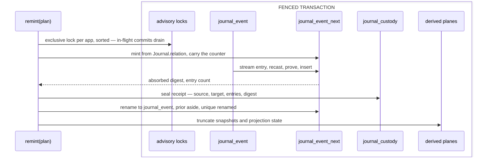

# [DATA_EVOLVE]

One owner holds the journal's shape change and its read accelerator: `Cutover.remint` rebuilds the log WHOLE on an event-shape change — fence every app the ledger knows, mint the shadow from the relation's own DDL under the shadow name, carry the identity counter, re-encode every entry, seal one custody receipt, swap atomically, retire what it superseded. `Snapshot` projects latest-per-stream state keyed by its own digest — discardable evidence a replay rebuilds. Generation identity, the custody ledger, and the payload coordinate arrive settled from `journal/generation.md`; the relation's DDL, sequence codec, and monotone upsert from `journal/append.md`; the row-level policy from `lane/tenant.md`.

Three costs land where this page states them: a shape change is a CUTOVER, so no live log reshapes under an open writer; one fold at the cutover replaces a lift priced on every read forever; and re-encoding re-addresses every content key, so a custody slice preserved under a superseded generation joins through its receipt. Neither engine's structural copy form carries what the log's guarantees rest on, so the shadow mints from the relation's own DDL; compaction leaves the maximum below what the log ever issued, so the counter carries from the engine's own ledger.

## [01]-[INDEX]

- [02]-[REMINT]: `Cutover.remint` — spine read, shadow mint, counter carry, fence, re-encode fold, custody seal, swap roster, retirement.
- [03]-[SNAPSHOT_ROW]: `Snapshot.of` — its projection ensure, its bound save and load, and the monotone upsert verdict.
- [04]-[HYDRATE]: `Snapshot.due` over the cadence policy row, beside the snapshot-plus-tail recovery fold.

## [02]-[REMINT]

- Owner: `Cutover.remint(plan)` folds the whole cutover — spine read, shadow mint, counter carry, fence, re-encode, seal, swap, derived-plane truncate — and answers the `Generation.Custody` receipt it sealed; `Cutover.retire(sql)` drops the superseded log once the deployment declares no live process binds it; `_SWAP` is the per-dialect, per-spine statement roster the swap runs in order; `_KIND` maps the catalog's relation kind onto `Journal.Spine`.
- Packages: `effect` (`Array`, `Effect`, `Option`, `Record`, `Schema`, `Stream`); `@effect/sql` (`SqlClient`, `SqlSchema`, `sql.withTransaction`, `sql.insert`, `sql.onDialectOrElse`, `sql.unsafe`, the `.stream` cursor); `@rasm/core` (`Digest.Session` — the incremental fold the receipt's digest closes; `Identity.App`); `journal/generation.md` (`Generation.of`, `Generation.fence`, `Generation.head`, `Generation.seal`, `Generation.Custody`, `Payload.Envelope`); `journal/append.md` (`Journal.log`, `Journal.relation`, `Journal.unique`, `Journal.Spine`).
- Entry: `Cutover.remint(plan)` is the one cutover road an operator runs against a drained app; the `recast` it carries is a CUTOVER value the deployment that ran it deletes with itself.
- Receipt: `Generation.Custody` — the position it seated, the generation it left, the generation it landed, the count it re-encoded, and the digest over the bytes it wrote, in sequence order.
- Law: `@effect/sql` publishes an append log and no re-encode primitive — `SqlEventJournal` stores and streams entries, `Migrator` never binds — so this folder owns the fold and states it here rather than reaching for a member the package does not carry.
- Law: the shadow mints from the relation's OWN DDL owner under the shadow name, never a structural copy of the live relation — `CREATE TABLE … AS SELECT … WHERE 0` keeps affinity names alone and drops the primary key, `AUTOINCREMENT`, every `NOT NULL`, every default, and the stream unique, so a duplicate stream key and a NULL sequence both land in it; `LIKE … INCLUDING ALL` copies no row-level policy and renames the unique the OCC guard matches, so the swapped-in log reads every tenant to every session and re-spells no version conflict; `Journal.relation(_NEXT, spine).mint` is the same body the ensure plants, and the mint refuses a leftover shadow rather than copying into it, because DDL is transactional on every profile and a shadow surviving a fold names an operator's hand.
- Law: the spine is READ off the catalog inside the fence, never asserted — the live relation's `pg_class.relkind` selects `partitioned` or `monolith` through `_KIND`, and every sqlite profile answers `monolith`; the partitioned shadow carries one DEFAULT child so the copy lands, its parent-level policy answers every read through the parent, the swap leaves the partition manager's `part_config` naming the live parent, and `retire` runs in the SAME operator road before the next maintenance tick, because the prior's ranged children hold the child names the manager mints for the live parent; the maintenance plane's `partition_data_proc` then re-seats the default's rows into ranged children.
- Law: the shadow's identity counter carries from the LIVE log's own ledger BEFORE the copy and the copied maximum never speaks — a partition drop or an export-snapshot-and-truncate leaves the maximum below what the log ever issued, and a generator restarted from that maximum re-issues sequences checkpoints and subjects already hold; pg reads `pg_sequences.last_value` through `pg_get_serial_sequence` into `setval` because an `OVERRIDING SYSTEM VALUE` copy advances nothing, sqlite inserts the live `sqlite_sequence` row under the shadow's name because the engine's counter is `max(seq, rowid)` and the rename carries the row; a never-written log has no row and no `last_value`, so both arms select nothing and the first append is one; `UPDATE sqlite_sequence` on an absent row changes zero rows in silence and `INSERT OR REPLACE` mints a duplicate row the engine reads past, so neither is the form.
- Law: the pg swap renames the stream unique into the live name as a PAIR — the prior's out, the shadow's in — because index names are schema-wide and the OCC guard matches `journal_event_stream` by name; sqlite's constraint name is inert (the guard reads the violated columns and the autoindex renames with the table), and the partitioned spine carries no unique to rename.
- Law: the fence is EVERY app the custody ledger knows, taken exclusive in sorted order — the swap replaces the relation for every app sharing it, so a sibling app's writer admitted under its own shared fence during the fold lands rows the swap strands; sorted acquisition keeps two concurrent cutovers deadlock-free, and a sibling app's rows cross the fold verbatim under its own unchanged generation.
- Law: identity crosses the cutover WHOLE — `sequence`, the stream triple, `version`, and `recorded_at` copy raw, so the subject index, every checkpoint, and every forensic join still resolve against the re-minted log; the fold decodes only what it READS — the envelope and the app — because a decoded `recorded_at` re-spells the spine's timestamp through a runtime date, and the fold rewrites `tag` and `payload` and nothing else.
- Law: `recast` is a total pure function over one encoded entry, declared for exactly ONE source-to-target transition and held nowhere — the target family's own decode proves each landing, so partiality has no place to hide and an additive reshape runs it as identity.
- Law: the fold decodes nothing through a superseded family — it reads stored bytes, recasts them, and proves the result against the compiled family, so the cutover needs the current shape alone and carries no history of shapes it passed through.
- Law: the digest absorbs each written payload in sequence order through one `Digest.Session`, so the receipt proves what the swap landed without buffering a log; a re-run recomputing a different digest names a fold that read a moving log, which the exclusive fence forecloses.
- Law: the swap is the rename pair inside the fenced transaction — the shadow becomes the log and the log becomes the prior — so no reader ever observes a half-written relation and a failed fold leaves the live log untouched, the shadow and its counter row rolled back with it.
- Law: derived planes truncate at the swap — snapshots and projection state carry zero authority and rebuild from the log, so a stale fold surviving the cutover answers state the live log never produced.
- Law: re-encoding RE-ADDRESSES every entry — the content key minted over superseded bytes addresses bytes the live log no longer holds, so a preservation slice landed under a superseded generation is evidence OF that generation and joins the live log through the custody receipt rather than through a subject; announcements are drained before the fence, so no undelivered deliverable survives carrying a stale subject.
- Law: retirement is a DEPLOYMENT declaration and never an inference — `retire` drops the prior log when the deployment states no process binds the superseded generation, and the custody row it left behind outlives the relation as the lineage a later audit reads; a partitioned prior drops with its children.
- Law: the fenced cutover is unspellable on the D1 profile — `D1Client` dies at transaction acquisition and the platform refuses `BEGIN` and `SAVEPOINT` outright — while its authorizer admits every statement this fold issues (`CREATE TABLE`, `ALTER TABLE … RENAME`, the `sqlite_sequence` write; only `_cf_`-prefixed names refuse), so a D1 log re-mints through the platform export, this cutover on a server profile, and the platform import, never in place.
- Growth: a second cutover is one more custody ordinal; a wider entry coordinate is a column on the carry roster; a third spine posture is one `_KIND` row and one `Journal.relation` body.
- Boundary: the fold runs outside every request path and holds the app's whole log; the app supplies `recast`, and this page supplies the fence, the shadow, the counter, the identity carry, the receipt, and the swap.



```typescript signature
import { Array, type Cause, Effect, Option, type ParseResult, Record, Schema, Stream } from "effect"
import { SqlClient, type SqlError, SqlSchema, type Statement } from "@effect/sql"
import { Digest, Identity } from "@rasm/core"
import { Journal } from "./append.ts"
import { Generation, Payload } from "./generation.ts"

const _utf8 = new TextEncoder()

const _NEXT = `${Journal.log}_next`
const _PRIOR = `${Journal.log}_prior`

declare namespace Cutover {
  type Plan<A, I> = {
    readonly app: Identity.App.Key
    readonly family: Schema.Schema<A, I>
    readonly recast: (entry: Payload.Raw) => Payload.Raw
  }
}

const _CARRIED = ["sequence", "app", "tenant", "aggregate", "version", "recorded_at"] as const

const _Entry = Schema.Struct({
  ...Payload.Envelope.fields,
  app: Identity.App.fields.app,
})

const _KIND = { r: "monolith", p: "partitioned" } as const satisfies Record<string, Journal.Spine>

const _Kind = Schema.Struct({ relkind: Schema.Literal(...Record.keys(_KIND)) })

const _spine = (sql: SqlClient.SqlClient): Effect.Effect<Journal.Spine, SqlError.SqlError | ParseResult.ParseError | Cause.NoSuchElementException> =>
  sql.onDialectOrElse({
    orElse: () => Effect.succeed<Journal.Spine>("monolith"),
    pg: () =>
      Effect.map(
        SqlSchema.single({
          Request: Schema.Void,
          Result: _Kind,
          execute: () => sql`SELECT relkind FROM pg_class WHERE oid = to_regclass(${Journal.log})`,
        })(void 0),
        (row) => _KIND[row.relkind],
      ),
  })

const _fenceAll = (sql: SqlClient.SqlClient) =>
  Effect.flatMap(
    SqlSchema.findAll({
      Request: Schema.Void,
      Result: Schema.Struct({ app: Identity.App.fields.app }),
      execute: () => sql`SELECT DISTINCT app FROM journal_custody ORDER BY app`,
    })(void 0),
    (rows) => Effect.forEach(rows, (row) => Generation.fence(sql, row.app, "exclusive"), { discard: true }),
  )

const _mint = (sql: SqlClient.SqlClient, spine: Journal.Spine) => {
  const { mint } = Journal.relation(_NEXT, spine)
  return sql.onDialectOrElse({
    orElse: () => sql.unsafe(mint.sqlite),
    pg: () => sql.unsafe(mint.pg),
  })
}

const _carry = (sql: SqlClient.SqlClient) =>
  sql.onDialectOrElse({
    orElse: () =>
      sql`INSERT INTO sqlite_sequence (name, seq)
          SELECT ${_NEXT}, seq FROM sqlite_sequence WHERE name = ${Journal.log}`,
    pg: () =>
      sql`SELECT setval(pg_get_serial_sequence(${_NEXT}, 'sequence'), s.last_value, true)
          FROM pg_sequences s
          WHERE format('%I.%I', s.schemaname, s.sequencename) = pg_get_serial_sequence(${Journal.log}, 'sequence')
            AND s.last_value IS NOT NULL`,
  })

const _copy = (sql: SqlClient.SqlClient, rows: Array.NonEmptyReadonlyArray<Record.ReadonlyRecord<string, unknown>>) =>
  sql.onDialectOrElse({
    orElse: () => sql`INSERT INTO ${sql(_NEXT)} ${sql.insert(rows)}`,
    pg: () => sql`INSERT INTO ${sql(_NEXT)} OVERRIDING SYSTEM VALUE ${sql.insert(rows)}`,
  })

const _RENAMES = {
  monolith: (sql: SqlClient.SqlClient): ReadonlyArray<Statement.Statement<unknown>> => [
    sql`ALTER TABLE ${sql(_PRIOR)} RENAME CONSTRAINT ${sql(Journal.unique(Journal.log))} TO ${sql(Journal.unique(_PRIOR))}`,
    sql`ALTER TABLE ${sql(Journal.log)} RENAME CONSTRAINT ${sql(Journal.unique(_NEXT))} TO ${sql(Journal.unique(Journal.log))}`,
  ],
  partitioned: (): ReadonlyArray<Statement.Statement<unknown>> => [],
} as const satisfies Record<Journal.Spine, (sql: SqlClient.SqlClient) => ReadonlyArray<Statement.Statement<unknown>>>

const _SWAP = (sql: SqlClient.SqlClient, spine: Journal.Spine): ReadonlyArray<Statement.Statement<unknown>> => [
  sql`ALTER TABLE ${sql(Journal.log)} RENAME TO ${sql(_PRIOR)}`,
  sql`ALTER TABLE ${sql(_NEXT)} RENAME TO ${sql(Journal.log)}`,
  ...sql.onDialectOrElse({ orElse: () => [], pg: () => _RENAMES[spine](sql) }),
]

const _remint = <A, I>(plan: Cutover.Plan<A, I>) =>
  Effect.flatMap(SqlClient.SqlClient, (sql) =>
    sql.withTransaction(
      Effect.gen(function* () {
        yield* _fenceAll(sql)
        const target = yield* Generation.of(plan.family)
        const head = yield* Generation.head(sql, plan.app)
        const spine = yield* _spine(sql)
        yield* _mint(sql, spine)
        yield* _carry(sql)
        const admit = Schema.decodeUnknown(plan.family)
        const encode = Schema.encode(Schema.parseJson(plan.family))
        const sealed = yield* Stream.runFoldEffect(
          sql`SELECT ${sql.csv(Array.map([..._CARRIED, "tag", "payload"], (column) => sql(column)))}
              FROM ${sql(Journal.log)} ORDER BY sequence`.stream,
          { session: yield* Digest.Session.open("content"), entries: 0n },
          (fold, raw) =>
            Effect.flatMap(Schema.decodeUnknown(_Entry)(raw), (entry) =>
              entry.app === plan.app
                ? Effect.gen(function* () {
                  const recast = plan.recast({ tag: entry.tag, payload: entry.payload })
                  const payload = yield* encode(yield* admit(recast.payload))
                  yield* _copy(sql, [{
                    ...Record.filter(raw, (_value, column) => Array.contains(_CARRIED, column)),
                    tag: recast.tag,
                    payload,
                  }])
                  return {
                    session: yield* Digest.Session.absorb(fold.session, _utf8.encode(payload)),
                    entries: fold.entries + 1n,
                  }
                })
                : Effect.as(_copy(sql, [raw]), fold)),
        )
        const custody = {
          ordinal: head.ordinal + 1,
          source: Option.some(head.target),
          target,
          entries: sealed.entries,
          digest: yield* Digest.Session.finish(sealed.session),
        } satisfies Generation.Custody
        yield* Generation.seal(sql, plan.app, custody)
        yield* Effect.forEach(_SWAP(sql, spine), (statement) => statement, { discard: true })
        yield* sql`DELETE FROM journal_snapshot`
        return custody
      }),
    ))

const _retire = (sql: SqlClient.SqlClient) => sql`DROP TABLE IF EXISTS ${sql(_PRIOR)}`

const Cutover = {
  remint: _remint,
  retire: _retire,
} as const
```

## [03]-[SNAPSHOT_ROW]

- Owner: `Snapshot.of(spec)` — binds one state schema and yields `{ save, load }` over the neutral `SqlClient`; the `journal_snapshot` ensure row with its latest-only primary key.
- Packages: `effect` (`Effect`, `Option`, `Schema`); `@effect/sql` (`SqlClient`, `SqlSchema` — the load decodes through a `Result` schema whose `body` field is `Payload.Column`, so no snapshot cell is ever hand-coerced); `journal/append.md` (`Journal.advance` — the folder's one monotone conditional upsert, dialect-shared because both engines carry the same `ON CONFLICT … DO UPDATE … SET` form and the gate rides each assignment rather than a WHERE arm); `journal/generation.md` (`Generation.of` — the one identity fold both shapes read; `Payload.Column`); `lane/tenant.md` (`Tenancy.rls`).
- Entry: `bound.save(stream, state, version)` and `bound.load(stream)` — the only snapshot road; projection lanes and rebuilds compose these, and nothing else touches the table.
- Receipt: `save` yields `Journal.Fence<number>` — `Advanced` means the store holds this fold's version, `Stale` names the version that beat it beside the one offered; the verdict is the swapped value, so a losing snapshotter never has to read success out of a statement that answered nothing.
- Receipt: `load` yields `Option<{ state, version }>` — present means fold-from-`version + 1`, absent means replay from origin; the option IS the protocol.
- Law: the snapshot is a projection — latest-per-stream folded state addressed by the same `StreamKey`, rebuilt from the journal at will; its authority is zero and its value is read cost.
- Law: the state shape identifies by its OWN digest, minted through the same `Generation.of` fold the event family reads — a state reshape moves that digest, every stored row for the binding reads as absence on its next load, and the lane replays; one identity fold serves both shapes because both answer the same question about a declared schema.
- Law: a load whose stored shape disagrees answers `Option.none` and never a fault — a rebuildable projection has one honest reaction to a shape it cannot read, and pricing it as a refusal turns a replay every lane already knows how to run into an outage.
- Law: the upsert is monotonic AND verdict-returning — `Journal.advance` gates on `excluded.version > journal_snapshot.version` inside every assignment, so a stale snapshotter racing a fresh one still commits nothing AND still reads the version that beat it; cadence needs no coordination either way, because the loser's whole recovery is to drop its fold, and a retry only mints a second loser.
- Law: the loser drops its fold and never reloads — `Stale` is not contention a reload-fold-retry resolves, it is the report that a fresher fold already covers this stream, so a lane treating it like `VersionConflict` re-reads a head it has no write to land against.
- Law: a load whose body fails its own state schema is `ParseError` on the admission rail — the consuming lane discards the snapshot and replays; corruption degrades to cost, never to wrong state.
- Law: the snapshot relation registers `Tenancy.rls` like every tenant-carrying relation — saves and loads run inside the consuming lane's pin, and the maintenance plane never reads snapshots, so the registration costs no reader a posture it lacks.
- Growth: a second snapshotted shape for one stream family is a second `Snapshot.of` binding, never a widened row.
- Boundary: the state codec is app material; this page stores its bytes, its version, and its shape digest, and reads none of the three as domain values.

```typescript signature
import { SqlClient, SqlSchema, type SqlError } from "@effect/sql"
import type { Capability } from "../lane/capability.ts"
import { Tenancy } from "../lane/tenant.ts"
import { Journal, StreamKey } from "./append.ts"

declare namespace Snapshot {
  type Spec<S, I> = {
    readonly state: Schema.Schema<S, I>
  }
  type Held<S> = {
    readonly state: S
    readonly version: number
  }
}

const _ddl: Capability.Ensure = {
  relation: "journal_snapshot",
  pg: `CREATE TABLE IF NOT EXISTS journal_snapshot (
    app TEXT NOT NULL, tenant TEXT NOT NULL, aggregate TEXT NOT NULL,
    version BIGINT NOT NULL,
    shape TEXT NOT NULL,
    body JSONB NOT NULL,
    taken_at TIMESTAMPTZ NOT NULL DEFAULT now(),
    PRIMARY KEY (app, tenant, aggregate));
  ${Tenancy.rls("journal_snapshot")}`,
  sqlite: `CREATE TABLE IF NOT EXISTS journal_snapshot (
    app TEXT NOT NULL, tenant TEXT NOT NULL, aggregate TEXT NOT NULL,
    version INTEGER NOT NULL,
    shape TEXT NOT NULL,
    body TEXT NOT NULL,
    taken_at TEXT NOT NULL DEFAULT (strftime('%Y-%m-%dT%H:%M:%fZ','now')),
    PRIMARY KEY (app, tenant, aggregate));`,
}

const _ADVANCE = Journal.advance({
  relation: "journal_snapshot",
  columns: ["app", "tenant", "aggregate", "version", "shape", "body"],
  key: ["app", "tenant", "aggregate"],
  gate: "version",
  touched: "taken_at",
  coordinate: Journal.Version,
})

const _save = <S, I>(spec: Snapshot.Spec<S, I>, shape: Generation.Key) =>
(stream: StreamKey, state: S, version: number) =>
  Effect.gen(function* () {
    const sql = yield* SqlClient.SqlClient
    const body = yield* Schema.encode(Schema.parseJson(spec.state))(state)
    return yield* _ADVANCE(sql, {
      app: stream.app,
      tenant: stream.tenant,
      aggregate: stream.aggregate,
      version,
      shape,
      body,
    }, version)
  })

const _SnapshotRow = Schema.Struct({
  version: Journal.Version,
  shape: Digest.Key.content,
  body: Payload.Column,
})

const _load = <S, I>(spec: Snapshot.Spec<S, I>, shape: Generation.Key) => (stream: StreamKey) =>
  Effect.gen(function* () {
    const sql = yield* SqlClient.SqlClient
    const found = SqlSchema.findOne({
      Request: StreamKey,
      Result: _SnapshotRow,
      execute: (key) =>
        sql`SELECT version, shape, body FROM journal_snapshot
            WHERE app = ${key.app} AND tenant = ${key.tenant} AND aggregate = ${key.aggregate}`,
    })
    return yield* Effect.transposeOption(
      Option.map(
        Option.filter(yield* found(stream), (row) => row.shape === shape),
        (row) =>
          Effect.map(
            Schema.decodeUnknown(spec.state)(row.body),
            (state): Snapshot.Held<S> => ({ state, version: row.version }),
          ),
      ),
    )
  })
```

## [04]-[HYDRATE]

- Owner: the admitted `Snapshot.Cadence` policy, the `due` cadence fold, and `hydrate` — snapshot-plus-tail is one load: the option folds to a seed and a `from` window, the journal read stream folds the tail.
- Packages: `effect` (`Stream`); `journal/append.md` (`Journal.of(...).read`, `Journal.Receipt`).
- Entry: lanes call `Snapshot.due(receipt, cadence)` with the receipt the append just returned and `bound.save` when it answers true, reading the `Journal.Fence` it answers rather than discarding it; `Snapshot.hydrate(bound, journal, stream, fold)` is the one state-recovery entry every lane and rebuild composes.
- Growth: a new cadence shape (byte budget, elapsed time) is a field on the policy row read inside `due` against the same span — the call sites never change.
- Law: cadence reads the landed SPAN, never the head alone — the receipt states `first` and `version`, so a multiple crossed anywhere inside a batch fires exactly once and a batch geometry cannot silently divide the effective cadence; asking the head for a multiple is the shape that makes cadence a function of batch size with nothing observable saying so.
- Law: cadence is admitted data — `Snapshot.Cadence` proves a positive integer before the crossing fold; snapshotting is always safe to skip and safe to repeat, so `due` is pure and no lane coordinates with another.

```typescript signature
import { Stream } from "effect"

const _Cadence = Schema.Struct({ every: Schema.Int.pipe(Schema.positive()) })

declare namespace Snapshot {
  type Cadence = typeof _Cadence.Type
  type Bound<S> = {
    readonly save: (stream: StreamKey, state: S, version: number) => Effect.Effect<
      Journal.Fence<number>,
      SqlError.SqlError | ParseResult.ParseError,
      SqlClient.SqlClient
    >
    readonly load: (stream: StreamKey) => Effect.Effect<
      Option.Option<Held<S>>,
      SqlError.SqlError | ParseResult.ParseError,
      SqlClient.SqlClient
    >
  }
}

const _due = (receipt: Journal.Receipt, cadence: Snapshot.Cadence): boolean =>
  Math.floor(receipt.version / cadence.every) > Math.floor((receipt.first - 1) / cadence.every)

const _hydrate = <S, A extends Journal.Event>(
  bound: Snapshot.Bound<S>,
  journal: ReturnType<typeof Journal.of<A, unknown>>,
  stream: StreamKey,
  fold: { readonly seed: S; readonly step: (state: S, event: A) => S },
) =>
  Effect.gen(function* () {
    const held = yield* bound.load(stream)
    const origin = Option.match(held, {
      onNone: () => ({ state: fold.seed, from: 1 }),
      onSome: (row) => ({ state: row.state, from: row.version + 1 }),
    })
    return yield* Stream.runFold(
      journal.read(stream, { from: origin.from }),
      origin.state,
      fold.step,
    )
  })

const Snapshot = {
  of: <S, I>(spec: Snapshot.Spec<S, I>): Effect.Effect<Snapshot.Bound<S>> =>
    Effect.map(Generation.of(spec.state), (shape) => ({ save: _save(spec, shape), load: _load(spec, shape) })),
  Cadence: _Cadence,
  due: _due,
  hydrate: _hydrate,
  ddl: [_ddl],
} as const

// --- [EXPORTS] -------------------------------------------------------------------------

export { Cutover, Snapshot }
```

## [05]-[RESEARCH]

<!-- source-only: research row template:
[TOKEN]-[OPEN|BLOCKED]: <exact question>; <verification route>.
[SPLIT_MEMBER]-[OPEN]: does `shape-core` expose `split_all`; verify against the member rail.
-->

(none)
