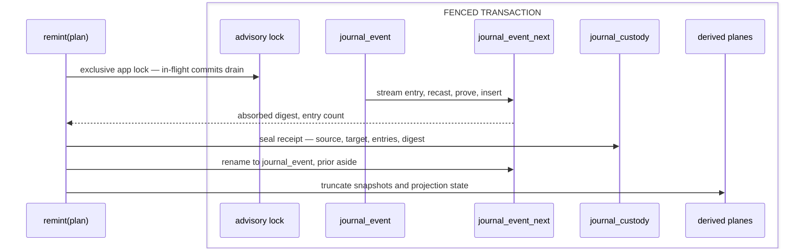

# [DATA_EVOLVE]

One owner holds the journal's shape identity and its read accelerator: a log carries ONE generation — a content digest over the compiled event family's declared shape — on an append-only custody ledger whose head every binder and every transaction proves against, so a runtime compiled elsewhere refuses at the consumer. `Generation.remint` rebuilds the log WHOLE on an event-shape change: fence, re-encode every entry, seal one custody receipt, swap atomically, retire what it superseded. `Snapshot` projects latest-per-stream state keyed by its own digest — discardable evidence a replay rebuilds.

Every entry carries its tag and its bytes alone, because a homogeneous log leaves a per-entry shape coordinate nothing to say, and one fused codec admits the TEXT column a digest addresses beside the json column none does. Three costs land where this page states them: a shape change is a CUTOVER, so no live log reshapes under an open writer; one fold at the cutover replaces a lift priced on every read forever; and re-encoding re-addresses every content key, so a custody slice preserved under a superseded generation joins through its receipt.

## [01]-[INDEX]

- [02]-[PAYLOAD_COLUMN]: `Payload.Envelope`, its fused JSON-column codec, and the typed column read composing both.
- [03]-[GENERATION_IDENTITY]: `Generation.of` over the framed shape preimage, the custody head, `bind`, the per-transaction guard, `GenerationSkew`.
- [04]-[REMINT]: `Generation.remint` — fence, re-encode fold, custody receipt, atomic swap, retirement.
- [05]-[SNAPSHOT_ROW]: `Snapshot.of` — its projection ensure, its bound save and load, and the monotone upsert verdict.
- [06]-[HYDRATE]: `Snapshot.due` over the cadence policy row, beside the snapshot-plus-tail recovery fold.

## [02]-[PAYLOAD_COLUMN]

- Owner: `Payload.Envelope` is the persisted `(tag, payload)` coordinate every journal projection spreads and `Payload.Raw` its decoded type; `Payload.Column` is the fused JSON-column codec every payload-bearing field composes; `Payload.json(shape)` composes that codec with an owning shape.
- Packages: `effect` (`Either`, `ParseResult`, `Schema`).
- Growth: a new payload-bearing relation spreads the envelope fields and declares only the columns it owns.
- Law: the envelope coordinate is ONE declaration and every persisted projection spreads `Payload.Envelope.fields`; a struct restating the pair beside this family is the parallel-shape defect, and a form diverging in MEANING rather than in spelling keeps its own declaration and reuses the field alone.
- Law: the entry carries its tag and its bytes and nothing else — the log is homogeneous in shape by the generation law, so a per-entry shape coordinate carries a value every reader already holds, and every read decodes through the one compiled family.
- Law: the pair spells one key set in every dialect, so the coordinate stays a plain struct — a variant family binds two projections differing in no key.
- Law: `Payload.Column` exists because two column postures reach one decode — every digest-preimage payload column is TEXT in every dialect by the append owner's byte-truth law, while the snapshot body and frontier floor stay json columns the spine driver hands back as live objects — so one codec admits string and object arrivals alike, the miss rides `ParseError` on the one admission rail, and a malformed stored text is a projection-time `ParseError` because the column was written by `Schema.encode` and cannot lawfully hold non-JSON.
- Boundary: the current family is app material arriving as a `Schema.Union` value; the relations carrying this envelope are `journal/append.md`'s journal rows and `journal/retain.md`'s export rows; the native op-log keeps a distinct thirteen-position envelope that aliases this coordinate nowhere.

```typescript signature
import { Either, ParseResult, Schema } from "effect"

const _Column: Schema.Schema<unknown> = Schema.transformOrFail(Schema.Unknown, Schema.Unknown, {
  strict: true,
  decode: (column, _options, ast) =>
    typeof column === "string"
      ? Either.try({ try: (): unknown => JSON.parse(column), catch: () => new ParseResult.Type(ast, column) })
      : ParseResult.succeed(column),
  encode: (value) => ParseResult.succeed(value),
})

// Opaque at the coordinate: this page owns payload authority per generation, so a projection decoding the column at
// its own site freezes a shape only the compiled family may read.
const _Envelope = Schema.Struct({
  tag: Schema.String,
  payload: _Column,
})

const Payload = {
  Column: _Column,
  Envelope: _Envelope,
  json: <A, I>(shape: Schema.Schema<A, I>): Schema.Schema<A, unknown> =>
    Schema.compose(_Column, shape, { strict: false }),
} as const

declare namespace Payload {
  type Raw = typeof _Envelope.Type
}
```

## [03]-[GENERATION_IDENTITY]

- Owner: `Generation.of(shape)` mints the content digest over one framed shape preimage; `Generation.bind(app, family)` seats the compiled generation against the log's custody head and answers `Generation.Held`; `Generation.guard(sql, held)` is the one statement every append transaction opens with; `GenerationSkew` refuses a binder or a writer whose compiled digest disagrees; the `journal_custody` ensure row is the append-only lineage whose HEAD is the live generation.
- Packages: `effect` (`Array`, `Effect`, `JSONSchema`, `Option`, `Order`, `Predicate`, `Record`, `Schema`); `@effect/sql` (`SqlClient`, `SqlSchema`); `@rasm/core` (`CanonicalWriter`, `Digest`, `Fault.Class`, `Identity.App`).
- Entry: the composition root binds once — `Generation.bind` answers the `Generation.Held` the journal spec carries, so write path, read path, and re-mint all name one anchor and none re-derives it.
- Receipt: `Generation.Held` — `{ app, generation, ordinal }` — the app's log, the digest it holds, and the custody position that seated it.
- Law: the generation IS a content key over declared shape, so it decodes through the one content-key codec and mints no second brand; `Digest.mint("content", …)` reads the framed preimage `CanonicalWriter` emits, exactly as every other generation identity in this branch does.
- Law: the preimage frames the JSON Schema projection of the family — the ENCODED shape a reader must decode — so a transformation edit leaving the stored shape identical moves nothing, while a member added, removed, or reshaped moves the digest.
- Law: framing sorts every record key and keeps every array position — a record's key order is enumeration order, so a digest reading it gives one logical shape a different preimage per build, while `anyOf` member order IS the family's declared order and the sort destroys that meaning.
- Law: record and array nodes emit their own kind marker before their members, so a positional array and a numerically-keyed record cannot fold onto one preimage.
- Law: the ledger is append-only and its HEAD is the live generation — one row per re-mint, `ordinal` monotone from the origin row a binder seats itself, so the lineage a receipt reads and the identity a runtime proves are one relation rather than a current-value row beside a history nobody joins.
- Law: the origin row carries a structural zero — a log at ordinal zero holds no entry and no source, so `entries` is a MEASURED zero and `source` is absent rather than self-referential; the digest is the empty fold's own answer, so the receipt shape stays total across the log's whole life.
- Law: skew classifies `invalid` — no schedule outlasts a process compiled against a shape the store does not hold, so the refusal is terminal evidence a deployment repairs, never a re-drive.
- Law: the guard rides EVERY append transaction and answers in one round trip — the shared app lock and the head read compose into one statement, so a writer that bound before a re-mint and kept writing across the swap refuses at its next transaction rather than landing old-shaped bytes in a re-minted log; the cost is one indexed single-row read per commit, and what it buys is a fence that closes on an in-flight writer instead of only on a re-binder.
- Law: the lock is SHARED at the guard and exclusive at the re-mint, so concurrent appends never serialize against each other and the re-mint waits for every in-flight commit before the fold begins; the sqlite profiles carry no advisory lock and rest on their single writer, exactly as the per-stream OCC lock already does.
- Law: custody carries no tenant column and registers no row-level policy — the log's generation spans every tenant of its app, so a tenant-scoped generation lets one tenant's re-mint fence another's, and the maintenance plane reads this relation under the posture the tenancy owner mints.
- Growth: a shape change is one re-mint landing one custody row; a second app is one origin row.
- Boundary: the compiled family is app material and this page never reads a payload — it digests the family's declared shape and compares digests.

```typescript signature
import { Array, Effect, JSONSchema, Option, Order, Predicate, Record, Schema, type SqlError } from "effect"
import { SqlClient, SqlSchema, type Statement } from "@effect/sql"
import { CanonicalWriter, Digest, Fault, Identity } from "@rasm/core"
import type { Capability } from "../lane/capability.ts"

// `CanonicalWriter` carries the preimage, so shape identity here and contract identity at the capability rail read
// one writer rather than two hand-rolled canonicalizations. Record keys SORT because enumeration order gives one
// logical shape a different preimage per build; array positions HOLD because an `anyOf` roster's order is the
// family's own declared order. Kind markers keep `["a"]` and `{"0":"a"}` apart.
const _framed = (writer: CanonicalWriter, node: unknown): CanonicalWriter =>
  Array.isArray(node)
    ? writer.string("[").rows(node, (member, held) => {
      _framed(held, member)
    })
    : Predicate.isRecord(node)
    ? writer.string("{").rows(
      Array.sort(Record.toEntries(node), Order.mapInput(Order.string, ([key]: readonly [string, unknown]) => key)),
      ([key, value], held) => {
        _framed(held.string(key), value)
      },
    )
    : writer.string(JSON.stringify(node)) // leaves are string, number, boolean, and null: one spelling each

const _of = <A, I>(shape: Schema.Schema<A, I>): Effect.Effect<Digest.Key<"content">> =>
  Digest.mint("content", _framed(new CanonicalWriter(), JSONSchema.make(shape)).close())

const _Ordinal = Schema.Int.pipe(Schema.nonNegative())

class GenerationSkew extends Schema.TaggedError<GenerationSkew>()("GenerationSkew", {
  app: Identity.App.fields.app,
  compiled: Digest.Key.content,
  observed: Digest.Key.content,
  ordinal: _Ordinal,
}) {
  get class(): Fault.Class.Kind {
    return "invalid" // the store holds a shape this process cannot read: terminal evidence a deployment repairs
  }
  override get message(): string {
    return `<journal:generation> ${this.app} compiled ${this.compiled} observed ${this.observed} at ${this.ordinal}`
  }
}

const _custodyDdl: Capability.Ensure = {
  relation: "journal_custody",
  pg: `CREATE TABLE IF NOT EXISTS journal_custody (
    app TEXT NOT NULL,
    ordinal INT NOT NULL,
    source TEXT,
    target TEXT NOT NULL,
    entries BIGINT NOT NULL,
    digest TEXT NOT NULL,
    sealed_at TIMESTAMPTZ NOT NULL DEFAULT now(),
    PRIMARY KEY (app, ordinal));`,
  sqlite: `CREATE TABLE IF NOT EXISTS journal_custody (
    app TEXT NOT NULL,
    ordinal INTEGER NOT NULL,
    source TEXT,
    target TEXT NOT NULL,
    entries INTEGER NOT NULL,
    digest TEXT NOT NULL,
    sealed_at TEXT NOT NULL DEFAULT (strftime('%Y-%m-%dT%H:%M:%fZ','now')),
    PRIMARY KEY (app, ordinal));`,
}

declare namespace Generation {
  type Key = Digest.Key<"content">
  type Held = {
    readonly app: Identity.App.Key
    readonly generation: Key
    readonly ordinal: number
  }
}

const _Head = Schema.Struct({ target: Digest.Key.content, ordinal: _Ordinal })

const _head = (sql: SqlClient.SqlClient, app: Identity.App.Key) =>
  SqlSchema.single({
    Request: Identity.App.fields.app,
    Result: _Head,
    execute: (key) =>
      sql`SELECT target, ordinal FROM journal_custody
          WHERE app = ${key} ORDER BY ordinal DESC LIMIT 1`,
  })(app)

// One whole-log fence spells itself here and takes two modes. Appends and binders take it SHARED, so they never
// serialize against each other; the re-mint takes it exclusive and therefore waits out every in-flight commit before
// its fold reads a row. Profiles carrying no advisory lock rest on their single writer, which is the same degrade
// this folder's per-stream OCC lock already declares.
const _fence = (sql: SqlClient.SqlClient, app: Identity.App.Key, mode: "shared" | "exclusive"): Statement.Fragment =>
  sql.onDialectOrElse({
    orElse: () => sql`SELECT 1`,
    pg: () =>
      mode === "shared"
        ? sql`SELECT pg_advisory_xact_lock_shared(hashtextextended(${app}, 0))`
        : sql`SELECT pg_advisory_xact_lock(hashtextextended(${app}, 0))`,
  })

const _held = (app: Identity.App.Key, compiled: Generation.Key) => (row: typeof _Head.Type) =>
  row.target === compiled
    ? Effect.succeed<Generation.Held>({ app, generation: compiled, ordinal: row.ordinal })
    : Effect.fail(new GenerationSkew({ app, compiled, observed: row.target, ordinal: row.ordinal }))

// Origin seating is one idempotent insert rather than a read-then-write pair: ordinal zero is the origin's own
// coordinate, so `DO NOTHING` makes a racing second binder a no-op and the head read below answers both of them.
const _bind = <A, I>(app: Identity.App.Key, family: Schema.Schema<A, I>) =>
  Effect.flatMap(SqlClient.SqlClient, (sql) =>
    sql.withTransaction(
      Effect.gen(function* () {
        const compiled = yield* _of(family)
        const empty = yield* Digest.Session.finish(yield* Digest.Session.open("content"))
        yield* _fence(sql, app, "shared")
        yield* sql`INSERT INTO journal_custody ${sql.insert([{
          app,
          ordinal: 0,
          source: null,
          target: compiled,
          entries: 0, // measured: a log at its origin holds no entry, so the count states emptiness rather than absence
          digest: empty,
        }])} ON CONFLICT (app, ordinal) DO NOTHING`
        return yield* Effect.flatMap(_head(sql, app), _held(app, compiled))
      }),
    ))

// One statement opens every append transaction: the shared fence and the head read together, so a writer bound before
// a re-mint refuses at its next commit instead of landing superseded bytes in a re-minted log.
const _guard = (sql: SqlClient.SqlClient, held: Generation.Held) =>
  Effect.gen(function* () {
    yield* _fence(sql, held.app, "shared")
    return yield* Effect.flatMap(_head(sql, held.app), _held(held.app, held.generation))
  })
```

## [04]-[REMINT]

- Owner: `Generation.remint(plan)` folds the whole cutover — fence, re-encode, seal, swap — and answers the `Generation.Custody` receipt it sealed; `Generation.retire(app)` drops the superseded log once the deployment declares no live process binds it.
- Packages: `effect` (`Effect`, `Option`, `Schema`, `Stream`); `@effect/sql` (`SqlClient`, `sql.withTransaction`, `sql.insert`, `sql.onDialectOrElse`, the `.stream` cursor); `@rasm/core` (`Digest.Session` — the incremental fold the receipt's digest closes).
- Entry: `Generation.remint(plan)` is the one cutover road an operator runs against a drained app; the `recast` it carries is a CUTOVER value the deployment that ran it deletes with itself.
- Receipt: `Generation.Custody` — `{ ordinal, source, target, entries, digest }` — the position it seated, the generation it left, the generation it landed, the count it re-encoded, and the digest over the bytes it wrote, in sequence order.
- Law: `@effect/sql` publishes an append log and no re-encode primitive — `SqlEventJournal` stores and streams entries, `Migrator` never binds — so this folder owns the fold and states it here rather than reaching for a member the package does not carry.
- Law: identity crosses the re-mint WHOLE — `sequence`, the stream triple, `version`, and `recorded_at` copy verbatim, so the subject index, every checkpoint, and every forensic join still resolve against the re-minted log; the fold rewrites `tag` and `payload` and nothing else.
- Law: the identity generator restarts past the carried maximum at the swap — a re-minted log whose generator resumes at one hands the next append a sequence the log already holds, and the unique key refuses it as a conflict no reload repairs.
- Law: `recast` is a total pure function over one encoded entry, declared for exactly ONE source-to-target transition and held nowhere — the target family's own decode proves each landing, so partiality has no place to hide and an additive reshape runs it as identity.
- Law: the fold decodes nothing through a superseded family — it reads stored bytes, recasts them, and proves the result against the compiled family, so the cutover needs the current shape alone and carries no history of shapes it passed through.
- Law: the digest absorbs each written payload in sequence order through one `Digest.Session`, so the receipt proves what the swap landed without buffering a log; a re-run recomputing a different digest names a fold that read a moving log, which the exclusive fence forecloses.
- Law: the swap is a rename pair inside the fenced transaction — the shadow becomes the log and the log becomes the prior, so no reader ever observes a half-written relation and a failed fold leaves the live log untouched.
- Law: derived planes truncate at the swap — snapshots and projection state carry zero authority and rebuild from the log, so a stale fold surviving the cutover answers state the live log never produced.
- Law: re-encoding RE-ADDRESSES every entry — the content key minted over superseded bytes addresses bytes the live log no longer holds, so a preservation slice landed under a superseded generation is evidence OF that generation and joins the live log through the custody receipt rather than through a subject; announcements are drained before the fence, so no undelivered deliverable survives carrying a stale subject.
- Law: retirement is a DEPLOYMENT declaration and never an inference — `retire` drops the prior log when the deployment states no process binds the superseded generation, and the custody row it left behind outlives the relation as the lineage a later audit reads.
- Growth: a second cutover is one more custody ordinal; a wider entry coordinate is a column on the copy roster.
- Boundary: the fold runs outside every request path and holds the app's whole log; the app supplies `recast`, and this page supplies the fence, the identity carry, the receipt, and the swap.



```typescript signature
import { Array, Effect, Option, Record, Schema, Stream } from "effect"
import { SqlClient, type SqlError } from "@effect/sql"
import { Digest, Identity } from "@rasm/core"
import { Journal, StreamKey } from "./append.ts"

// Digests read bytes and the payload column holds text, so one encoder crosses that seam for the whole fold.
const _utf8 = new TextEncoder()

declare namespace Generation {
  type Custody = typeof _Custody.Type
  type Plan<A, I> = {
    readonly app: Identity.App.Key
    readonly family: Schema.Schema<A, I>
    // ONE transition's total transform over an encoded entry, never a chain: the deployment that runs this cutover
    // owns the value and deletes it with itself, so no accumulated history of shapes exists to index or complete.
    readonly recast: (entry: Payload.Raw) => Payload.Raw
  }
}

const _Custody = Schema.Struct({
  ordinal: _Ordinal,
  source: Schema.OptionFromNullOr(Digest.Key.content),
  target: Digest.Key.content,
  entries: Schema.BigInt,
  digest: Digest.Key.content,
})

// Every column the re-mint CARRIES rather than rewrites. Identity crosses whole, so the subject index, the projection
// checkpoints, and every forensic join still resolve; `tag` and `payload` are the two the fold owns and neither
// appears here. A wider entry coordinate lands as one name on this roster.
const _CARRIED = ["sequence", "app", "tenant", "aggregate", "version", "recorded_at"] as const

const _shadowDdl: Capability.Ensure = {
  relation: "journal_event_next",
  pg: `CREATE TABLE IF NOT EXISTS journal_event_next (LIKE journal_event INCLUDING ALL);`,
  sqlite: `CREATE TABLE IF NOT EXISTS journal_event_next AS SELECT * FROM journal_event WHERE 0;`,
}

const _Entry = Schema.Struct({
  ..._Envelope.fields,
  sequence: Journal.Sequence,
  app: Identity.App.fields.app,
  tenant: Identity.Tenant.fields.tenant,
  aggregate: StreamKey.fields.aggregate,
  version: Journal.Version,
  recorded_at: Schema.String,
})

// Copying the log means copying its identity column, so the insert states `OVERRIDING SYSTEM VALUE` on the spine —
// an `ALWAYS AS IDENTITY` column silently substitutes a fresh value otherwise, and the re-minted log then holds
// sequences no checkpoint, subject row, or announcement can find. SQLite's rowid takes the explicit value directly.
const _copy = (sql: SqlClient.SqlClient, rows: Array.NonEmptyReadonlyArray<Record.ReadonlyRecord<string, unknown>>) =>
  sql.onDialectOrElse({
    orElse: () => sql`INSERT INTO journal_event_next ${sql.insert(rows)}`,
    pg: () => sql`INSERT INTO journal_event_next OVERRIDING SYSTEM VALUE ${sql.insert(rows)}`,
  })

// `sequence` resumes PAST the carried maximum: a re-minted log whose identity restarts at one hands the next append
// a value the relation already holds, and the stream-unique constraint refuses it as a conflict that no
// reload-fold-retry can clear. SQLite's `sqlite_sequence` row carries the same fact for an AUTOINCREMENT rowid.
const _restart = (sql: SqlClient.SqlClient, head: bigint) =>
  sql.onDialectOrElse({
    orElse: () => sql`UPDATE sqlite_sequence SET seq = ${String(head)} WHERE name = 'journal_event'`,
    pg: () => sql`ALTER TABLE journal_event ALTER COLUMN sequence RESTART WITH ${head + 1n}`,
  })

const _remint = <A, I>(plan: Generation.Plan<A, I>) =>
  Effect.flatMap(SqlClient.SqlClient, (sql) =>
    sql.withTransaction(
      Effect.gen(function* () {
        yield* _fence(sql, plan.app, "exclusive") // in-flight commits drain here; every later append refuses at its own guard
        const target = yield* _of(plan.family)
        const head = yield* _head(sql, plan.app)
        const admit = Schema.decodeUnknown(plan.family)
        const encode = Schema.encode(Schema.parseJson(plan.family))
        const sealed = yield* Stream.runFoldEffect(
          sql`SELECT ${sql.csv(Array.map([..._CARRIED, "tag", "payload"], (column) => sql(column)))}
              FROM journal_event WHERE app = ${plan.app} ORDER BY sequence`.stream,
          { session: yield* Digest.Session.open("content"), entries: 0n, top: 0n },
          (fold, raw) =>
            Effect.gen(function* () {
              const entry = yield* Schema.decodeUnknown(_Entry)(raw)
              const recast = plan.recast({ tag: entry.tag, payload: entry.payload })
              // Admission proves the landing: a recast answering a shape the current schema refuses fails the
              // cutover here, inside the fence, with the live log untouched.
              const payload = yield* encode(yield* admit(recast.payload))
              yield* _copy(sql, [{
                ...Record.filter(raw, (_value, column) => Array.contains(_CARRIED, column)),
                tag: recast.tag,
                payload,
              }])
              return {
                session: yield* Digest.Session.absorb(fold.session, _utf8.encode(payload)),
                entries: fold.entries + 1n,
                top: entry.sequence,
              }
            }),
        )
        const custody = {
          ordinal: head.ordinal + 1,
          source: Option.some(head.target),
          target,
          entries: sealed.entries,
          digest: yield* Digest.Session.finish(sealed.session),
        } satisfies Generation.Custody
        yield* sql`INSERT INTO journal_custody ${sql.insert([{
          app: plan.app,
          ordinal: custody.ordinal,
          source: head.target,
          target,
          entries: custody.entries,
          digest: custody.digest,
        }])}`
        yield* sql`ALTER TABLE journal_event RENAME TO journal_event_prior`
        yield* sql`ALTER TABLE journal_event_next RENAME TO journal_event`
        yield* _restart(sql, sealed.top)
        // Derived planes carry zero authority and rebuild from the log, so the cutover drops their held folds rather
        // than leaving state the live log never produced to answer a reader that outlives the swap.
        yield* sql`DELETE FROM journal_snapshot`
        return custody
      }),
    ))

// Retirement is the deployment's own declaration that no process binds the superseded generation — the custody row
// outlives the relation, so the lineage a later audit reads survives the bytes it describes.
const _retire = (sql: SqlClient.SqlClient) => sql`DROP TABLE IF EXISTS journal_event_prior`
```

## [05]-[SNAPSHOT_ROW]

- Owner: `Snapshot.of(spec)` — binds one state schema and yields `{ save, load }` over the neutral `SqlClient`; the `journal_snapshot` ensure row with its latest-only primary key.
- Packages: `effect` (`Effect`, `Option`, `Schema`); `@effect/sql` (`SqlClient`, `SqlSchema` — the load decodes through a `Result` schema whose `body` field is `Payload.Column`, so no snapshot cell is ever hand-coerced); `journal/append.md` (`Journal.advance` — the folder's one monotone conditional upsert, dialect-shared because both engines carry the same `ON CONFLICT … DO UPDATE … SET` form and the gate rides each assignment rather than a WHERE arm).
- Entry: `bound.save(stream, state, version)` and `bound.load(stream)` — the only snapshot road; projection lanes and rebuilds compose these, and nothing else touches the table.
- Receipt: `save` yields `Journal.Fence<number>` — `Advanced` means the store holds this fold's version, `Stale` names the version that beat it beside the one offered; the verdict is the swapped value, so a losing snapshotter never has to read success out of a statement that answered nothing.
- Receipt: `load` yields `Option<{ state, version }>` — present means fold-from-`version + 1`, absent means replay from origin; the option IS the protocol.
- Law: the snapshot is a projection — latest-per-stream folded state addressed by the same `StreamKey`, rebuilt from the journal at will; its authority is zero and its value is read cost.
- Law: the state shape identifies by its OWN digest, minted through the same `Generation.of` fold the event family reads — a state reshape moves that digest, every stored row for the binding reads as absence on its next load, and the lane replays; one identity fold serves both shapes because both answer the same question about a declared schema.
- Law: a load whose stored shape disagrees answers `Option.none` and never a fault — a rebuildable projection has one honest reaction to a shape it cannot read, and pricing it as a refusal turns a replay every lane already knows how to run into an outage.
- Law: the upsert is monotonic AND verdict-returning — `Journal.advance` gates on `excluded.version > journal_snapshot.version` inside every assignment, so a stale snapshotter racing a fresh one still commits nothing AND still reads the version that beat it; cadence needs no coordination either way, because the loser's whole recovery is to drop its fold, and a retry only mints a second loser.
- Law: the loser drops its fold and never reloads — `Stale` is not contention a reload-fold-retry resolves, it is the report that a fresher fold already covers this stream, so a lane treating it like `VersionConflict` re-reads a head it has no write to land against.
- Law: a load whose body fails its own state schema is `ParseError` on the admission rail — the consuming lane discards the snapshot and replays; corruption degrades to cost, never to wrong state.
- Law: the snapshot relation registers `Tenancy.rls` like every tenant-carrying relation — saves and loads run inside the consuming lane's pin, and the maintenance plane never reads snapshots, so the registration costs no reader a posture it lacks.
- Growth: a second snapshotted shape for one stream family is a second `Snapshot.of` binding, never a widened row.
- Boundary: the state codec is app material; this page stores its bytes, its version, and its shape digest, and reads none of the three as domain values.

```typescript signature
import { SqlClient, SqlSchema, type SqlError } from "@effect/sql"
import type { Capability } from "../lane/capability.ts"
import { Tenancy } from "../lane/tenant.ts"
import { Journal, StreamKey } from "./append.ts"

declare namespace Snapshot {
  type Spec<S, I> = {
    readonly state: Schema.Schema<S, I>
  }
  type Held<S> = {
    readonly state: S
    readonly version: number
  }
}

const _ddl: Capability.Ensure = {
  relation: "journal_snapshot",
  pg: `CREATE TABLE IF NOT EXISTS journal_snapshot (
    app TEXT NOT NULL, tenant TEXT NOT NULL, aggregate TEXT NOT NULL,
    version BIGINT NOT NULL,
    shape TEXT NOT NULL,
    body JSONB NOT NULL,
    taken_at TIMESTAMPTZ NOT NULL DEFAULT now(),
    PRIMARY KEY (app, tenant, aggregate));
  ${Tenancy.rls("journal_snapshot")}`,
  sqlite: `CREATE TABLE IF NOT EXISTS journal_snapshot (
    app TEXT NOT NULL, tenant TEXT NOT NULL, aggregate TEXT NOT NULL,
    version INTEGER NOT NULL,
    shape TEXT NOT NULL,
    body TEXT NOT NULL,
    taken_at TEXT NOT NULL DEFAULT (strftime('%Y-%m-%dT%H:%M:%fZ','now')),
    PRIMARY KEY (app, tenant, aggregate));`,
}

// `Journal.advance` instantiates the folder's ONE conditional-write owner on this relation: `columns`
// declares the write roster the row type and the assignment set both derive from, `version` is the gate, and
// `taken_at` is the column the winning arm restamps. Nothing here spells a statement — a second spelling beside the
// frontier ledger's is exactly how one of them would keep a `WHERE`-gated arm that reports its loser nothing.
const _ADVANCE = Journal.advance({
  relation: "journal_snapshot",
  columns: ["app", "tenant", "aggregate", "version", "shape", "body"],
  key: ["app", "tenant", "aggregate"],
  gate: "version",
  touched: "taken_at",
  coordinate: Journal.Version,
})

const _save = <S, I>(spec: Snapshot.Spec<S, I>, shape: Generation.Key) =>
(stream: StreamKey, state: S, version: number) =>
  Effect.gen(function* () {
    const sql = yield* SqlClient.SqlClient
    const body = yield* Schema.encode(Schema.parseJson(spec.state))(state)
    return yield* _ADVANCE(sql, {
      app: stream.app,
      tenant: stream.tenant,
      aggregate: stream.aggregate,
      version,
      shape,
      body,
    }, version)
  })

// Snapshots carry no tag and their state rides `body`, so this row keeps its own declaration and reuses the column
// codec alone — an entry envelope's coordinate says nothing about a folded projection.
const _SnapshotRow = Schema.Struct({
  version: Journal.Version,
  shape: Digest.Key.content,
  body: _Column,
})

const _load = <S, I>(spec: Snapshot.Spec<S, I>, shape: Generation.Key) => (stream: StreamKey) =>
  Effect.gen(function* () {
    const sql = yield* SqlClient.SqlClient
    const found = SqlSchema.findOne({
      Request: StreamKey,
      Result: _SnapshotRow,
      execute: (key) =>
        sql`SELECT version, shape, body FROM journal_snapshot
            WHERE app = ${key.app} AND tenant = ${key.tenant} AND aggregate = ${key.aggregate}`,
    })
    return yield* Effect.transposeOption(
      Option.map(
        // Rows folded under a superseded state shape read as ABSENCE, so the lane replays from origin exactly as
        // it does for a stream nobody has snapshotted — one honest reaction a rebuildable projection has.
        Option.filter(yield* found(stream), (row) => row.shape === shape),
        (row) =>
          Effect.map(
            Schema.decodeUnknown(spec.state)(row.body),
            (state): Snapshot.Held<S> => ({ state, version: row.version }),
          ),
      ),
    )
  })
```

## [06]-[HYDRATE]

- Owner: the admitted `Snapshot.Cadence` policy, the `due` cadence fold, and `hydrate` — snapshot-plus-tail is one load: the option folds to a seed and a `from` window, the journal read stream folds the tail.
- Packages: `effect` (`Stream`); `journal/append.md` (`Journal.of(...).read`, `Journal.Receipt`).
- Entry: lanes call `Snapshot.due(receipt, cadence)` with the receipt the append just returned and `bound.save` when it answers true, reading the `Journal.Fence` it answers rather than discarding it; `Snapshot.hydrate(bound, journal, stream, fold)` is the one state-recovery entry every lane and rebuild composes.
- Growth: a new cadence shape (byte budget, elapsed time) is a field on the policy row read inside `due` against the same span — the call sites never change.
- Law: cadence reads the landed SPAN, never the head alone — the receipt states `first` and `version`, so a multiple crossed anywhere inside a batch fires exactly once and a batch geometry cannot silently divide the effective cadence; asking the head for a multiple is the shape that makes cadence a function of batch size with nothing observable saying so.
- Law: cadence is admitted data — `Snapshot.Cadence` proves a positive integer before the crossing fold; snapshotting is always safe to skip and safe to repeat, so `due` is pure and no lane coordinates with another.

```typescript signature
import { Stream } from "effect"

const _Cadence = Schema.Struct({ every: Schema.Int.pipe(Schema.positive()) })

declare namespace Snapshot {
  type Cadence = typeof _Cadence.Type
  type Bound<S> = {
    // Verdicts ride the swapped value: a lane that snapshots on cadence learns whether its fold is the stored one,
    // and a `void` here reports the losing writer's discarded fold as a landed snapshot.
    readonly save: (stream: StreamKey, state: S, version: number) => Effect.Effect<
      Journal.Fence<number>,
      SqlError.SqlError | ParseResult.ParseError,
      SqlClient.SqlClient
    >
    readonly load: (stream: StreamKey) => Effect.Effect<
      Option.Option<Held<S>>,
      SqlError.SqlError | ParseResult.ParseError,
      SqlClient.SqlClient
    >
  }
}

// Batch appends move the head by their own length, so asking whether the HEAD is a multiple fires only when a batch
// happens to LAND on one: writers whose batch size shares no factor with the cadence cross multiple after multiple
// without ever answering true, and their streams replay from an ever-older snapshot with nothing reporting the drift.
// Reading the SPAN each receipt already carries answers whether a multiple lies inside it, so one cadence holds for
// every batch shape and singular appends stay the degenerate one-wide span.
const _due = (receipt: Journal.Receipt, cadence: Snapshot.Cadence): boolean =>
  Math.floor(receipt.version / cadence.every) > Math.floor((receipt.first - 1) / cadence.every)

const _hydrate = <S, A extends Journal.Event>(
  bound: Snapshot.Bound<S>,
  journal: ReturnType<typeof Journal.of<A, unknown>>,
  stream: StreamKey,
  fold: { readonly seed: S; readonly step: (state: S, event: A) => S },
) =>
  Effect.gen(function* () {
    const held = yield* bound.load(stream)
    const origin = Option.match(held, {
      onNone: () => ({ state: fold.seed, from: 1 }),
      onSome: (row) => ({ state: row.state, from: row.version + 1 }),
    })
    return yield* Stream.runFold(
      journal.read(stream, { from: origin.from }),
      origin.state,
      fold.step,
    )
  })

const Generation = {
  of: _of,
  bind: _bind,
  guard: _guard,
  remint: _remint,
  retire: _retire,
  ddl: [_custodyDdl, _shadowDdl],
} as const

const Snapshot = {
  of: <S, I>(spec: Snapshot.Spec<S, I>): Effect.Effect<Snapshot.Bound<S>> =>
    Effect.map(_of(spec.state), (shape) => ({ save: _save(spec, shape), load: _load(spec, shape) })),
  Cadence: _Cadence,
  due: _due,
  hydrate: _hydrate,
  ddl: [_ddl],
} as const

// --- [EXPORTS] --------------------------------------------------------------------------

export { Generation, GenerationSkew, Payload, Snapshot }
```

## [07]-[RESEARCH]

<!-- source-only: research row template:
[TOKEN]-[OPEN|BLOCKED]: <exact question>; <verification route>.
[SPLIT_MEMBER]-[OPEN]: does `shape-core` expose `split_all`; verify against the member rail.
-->

- [SHADOW_CLONE]-[OPEN]: does every admitted sqlite profile carry `CREATE TABLE … AS SELECT … WHERE 0` with the source's column affinities intact, or does the shadow need the journal relation's own DDL text; verify against each profile's driver on the embedded lane.
- [SEQUENCE_RESTART]-[OPEN]: does a re-minted sqlite log whose source relation held no `sqlite_sequence` row need that row inserted rather than updated; verify against the node and libSQL drivers.
