# [DATA_STREAM]

The ONE resumable content-addressed rail: large payloads move in bounded chunks, resume after any failure at verified offsets, and prove integrity end to end with a single identity from first byte to durable key. Ingress is pull-based Web Streams lifted BYOB into `Stream<Uint8Array>`; the chunk stage is content-defined cutting (FastCDC — an owned wasm surface over the maintained Rust crate, because every published JS binding is stale) minting per-chunk sub-keys that are children of the object `ContentKey` under the same digest algebra; the identity fold is the core digest session absorbed chunk by chunk in bounded memory, so the client-computed address, the store-verified checksum, and the core key are one value. Resume is the tus protocol — `@tus/server` over `@tus/s3-store` maps `Upload-Offset` onto S3 multipart parts into a staging band — and finalize re-homes staged bytes onto their content key through the object plane's conditional legs, where 412 closes the loop as the idempotent already-present noop. Reads mirror ingest: ranged streaming with structural staleness immunity, because a content key cannot change under a resumed range.

## [01]-[CLUSTERS]

| [INDEX] | [CLUSTER]       | [OWNS]                                                                             |
| :-----: | :-------------- | :--------------------------------------------------------------------------------- |
|  [01]   | `BYTE_INGRESS`  | the BYOB lift, the bounded form-data seam, backpressure law                        |
|  [02]   | `CHUNK_STAGE`   | the owned FastCDC wasm surface, chunk receipts, sub-key identity                   |
|  [03]   | `IDENTITY_FOLD` | the incremental digest session, the one-identity law, checkpointed resume state    |
|  [04]   | `RESUME_RAIL`   | the tus server over the S3 staging store, hooks, finalize re-home, protocol growth |
|  [05]   | `RANGE_READS`   | ranged resumable reads over content and staging bands                              |

## [02]-[BYTE_INGRESS]

- Owner: the ingress lifts — `Rail.bytes` over any `ReadableStream<Uint8Array>` through the BYOB reader, and `Rail.form(schema)` — the typed and bounded multipart seam for direct HTTP ingest — one pull geometry whose demand propagates upstream so a fast producer throttles to the slow consumer with order and completeness preserved.
- Packages: `effect` (`Stream.fromReadableStreamByob`, `Stream.fromReadableStream`); `@effect/platform` (`Multipart` — `schemaPersisted`, `withLimits`, `toPersisted`, `HttpApiSchema.Multipart` typed endpoints).
- Entry: every byte source in the unit enters here — a fetch body, a staged tus read lifted from its `Readable` through the platform interop, a filesystem stream from `object/file.md` — and leaves as one `Stream<Uint8Array>` the chunk stage consumes; no consumer meets a raw reader.
- Growth: a new byte source is one lift call; the allocation size and the form bounds are policy values, never per-site literals.
- Law: ingress is pull — the BYOB reader drives `pull()` by `desiredSize`, the Effect stream carries the backpressure plus the typed error channel and `Scope` release, and an eager materialization of a body is the memory defect this rail exists to delete.
- Law: form-data ingest is typed AND bounded before any byte materializes — `Multipart.schemaPersisted(schema)` proves the whole form as one decoded struct and `Multipart.withLimitsStream` composes the bounds onto the part stream as a value at the seam (never ambient fiber-ref mutation at call sites); `maxParts` and `maxFileSize` are `Option`-shaped by the fiber-ref contract, so an unbounded axis is a spelled `Option.none()`, never an omission; file parts hand into this same lift.

```typescript signature
import { Effect, Option, Schema, Stream } from "effect"
import { Multipart } from "@effect/platform"
import { ObjectFault } from "./store.ts"

const _INGRESS = { allocBytes: 256 * 1024 } as const

const _FORM = {
  maxFileSize: Option.some(512 * 1024 * 1024),
  maxParts: Option.some(32),
  maxFieldSize: 64 * 1024,
} satisfies Multipart.withLimits.Options

const _bytes = (body: ReadableStream<Uint8Array>): Stream.Stream<Uint8Array, ObjectFault> =>
  Stream.fromReadableStreamByob(
    () => body,
    (caught) => new ObjectFault({ reason: "io", key: "<ingress>", detail: String(caught) }),
    _INGRESS.allocBytes,
  )

const _form = <A, I extends Partial<Multipart.Persisted>>(shape: Schema.Schema<A, I>) =>
  (parts: Stream.Stream<Multipart.Part, Multipart.MultipartError>) =>
    Effect.flatMap(
      Multipart.toPersisted(Multipart.withLimitsStream(parts, _FORM)),
      Multipart.schemaPersisted(shape),
    )
```

## [03]-[CHUNK_STAGE]

- Owner: the content-defined chunk stage — `Rail.chunked`, a stream transform re-cutting the byte flow at Gear-hash boundaries so an insert or delete re-aligns cut points and versioned payloads dedup maximally — and the `ChunkMark` receipt carrying each chunk's span and sub-key.
- Packages: the owned FastCDC wasm surface (a `wasm-pack` build of the maintained Rust `fastcdc` crate, normalized-chunking v2020, held as a folder-owned artifact behind a capability Tag per the wasm boundary law — every published JS/wasm npm binding is years stale and refused); `@rasm/ts/core` (`Digest` — the sub-key mint); `effect` (`Stream`, `Chunk`).
- Entry: `Rail.chunked(bytes, policy)` between ingress and the identity fold; the policy row carries `{ min, avg, max }` cut bounds; consumers that need whole-payload identity only skip the stage — chunking earns its cost where dedup or chunk-level proofs are real.
- Receipt: `ChunkMark` — `{ seq, offset, bytes, sub }` — the sub-key is `Digest.mint("content", chunkBytes)`, the SAME algebra as the object key at finer grain, so chunk identity and object identity share one mint and a second hashing vocabulary is unspellable.
- Law: the Merkle proof tree is one fold over the chunk receipts — `Rail.prove(marks)` folds the proven-non-empty mark set through the core digest's `proof` row (`createBLAKE3(256)`, the `ProofKey` brand): each leaf mints over its sub-key's decoded bytes under the leaf framing byte, pairs join under the node byte, an odd node promotes, and the receipt carries `{ root, leaves, depth, paths }`; every path is the ordered sibling-key and side sequence for its `ChunkMark.seq`, so a range consumer verifies any admitted leaf in `O(log n)` without rebuilding the tree.
- Law: proof decoding stays on the object integrity rail — a malformed branded key or an impossible empty reduction is `ObjectFault { reason: "integrity" }`, never `die`, `orDie`, or an unchecked assertion hidden beneath the proof surface.
- Law: the wasm module is capability, not code — instantiation is a scoped acquisition behind the Tag, cuts run through the marked kernel, and no linear-memory view escapes; the stage is a pure `Stream` transform above that seam.
- Law: cut bounds are policy data — the row travels with the payload class (artifact, snapshot, media), and re-cutting with different bounds mints different sub-keys by construction, so the policy row is part of the dedup contract and never drifts silently.

```typescript signature
import { Array, Context, Encoding } from "effect"
import { ContentKey, Digest } from "@rasm/ts/core"

declare namespace Rail {
  type CutPolicy = { readonly min: number; readonly avg: number; readonly max: number }
  type ChunkMark = { readonly seq: number; readonly offset: number; readonly bytes: number; readonly sub: ContentKey }
  type ProofStep = { readonly side: "left" | "right"; readonly sibling: Digest.Key<"proof"> }
  type ProofPath = { readonly seq: number; readonly leaf: Digest.Key<"proof">; readonly steps: ReadonlyArray<ProofStep> }
  type Proof = { readonly root: Digest.Key<"proof">; readonly leaves: number; readonly depth: number; readonly paths: ReadonlyArray<ProofPath> }
}

class Cutter extends Context.Tag("data/Cutter")<Cutter, {
  readonly cut: (policy: Rail.CutPolicy) => (bytes: Stream.Stream<Uint8Array, ObjectFault>) => Stream.Stream<Uint8Array, ObjectFault>
}>() {}

const _CUT = { min: 256 * 1024, avg: 1024 * 1024, max: 4 * 1024 * 1024 } as const satisfies Rail.CutPolicy

const _chunked = (bytes: Stream.Stream<Uint8Array, ObjectFault>, policy: Rail.CutPolicy) =>
  Stream.unwrap(
    Effect.map(Cutter, (cutter) =>
      cutter.cut(policy)(bytes).pipe(
        Stream.mapAccumEffect({ seq: 0, offset: 0 }, (state, chunk) =>
          Effect.map(Digest.mint("content", chunk), (sub) =>
            [
              { seq: state.seq + 1, offset: state.offset + chunk.byteLength },
              { chunk, mark: { seq: state.seq, offset: state.offset, bytes: chunk.byteLength, sub } satisfies Rail.ChunkMark },
            ] as const),
        ),
      )),
  )

const _DOMAIN = { leaf: Uint8Array.of(0), node: Uint8Array.of(1) } as const // the framing byte is this page's domain separation — the core proof row's stated consumer obligation

type _ProofNode = { readonly hash: Digest.Key<"proof">; readonly paths: ReadonlyArray<Rail.ProofPath> }

const _proofFault = (key: string) => (fault: unknown): ObjectFault =>
  new ObjectFault({ reason: "integrity", key, detail: String(fault) })

const _joined = (pair: Array.NonEmptyReadonlyArray<_ProofNode>): Effect.Effect<_ProofNode, ObjectFault> => {
  const left = Array.headNonEmpty(pair)
  return Option.match(Array.get(pair, 1), {
    onNone: () => Effect.succeed(left),
    onSome: (right) =>
      Effect.map(
        Effect.flatMap(
          Effect.all([
            Effect.mapError(Encoding.decodeHex(left.hash), _proofFault(left.hash)),
            Effect.mapError(Encoding.decodeHex(right.hash), _proofFault(right.hash)),
          ]),
          ([leftBytes, rightBytes]) => Digest.mint("proof", [_DOMAIN.node, leftBytes, rightBytes]),
        ),
        (hash): _ProofNode => ({
          hash,
          paths: [
            ...Array.map(left.paths, (path) => ({ ...path, steps: Array.append(path.steps, { side: "right", sibling: right.hash }) })),
            ...Array.map(right.paths, (path) => ({ ...path, steps: Array.append(path.steps, { side: "left", sibling: left.hash }) })),
          ],
        }),
      ),
  })
}

const _fold = (nodes: Array.NonEmptyReadonlyArray<_ProofNode>, depth: number): Effect.Effect<Rail.Proof, ObjectFault> =>
  nodes.length === 1
    ? Effect.succeed({ root: Array.headNonEmpty(nodes).hash, leaves: nodes.length, depth, paths: Array.headNonEmpty(nodes).paths })
    : Effect.flatMap(Effect.forEach(Array.chunksOf(nodes, 2), _joined), (level) =>
        Array.isNonEmptyReadonlyArray(level)
          ? Effect.map(_fold(level, depth + 1), (proof) => ({
              ...proof,
              leaves: Array.reduce(nodes, 0, (count, node) => count + node.paths.length),
            }))
          : Effect.fail(new ObjectFault({ reason: "integrity", key: "<proof>", detail: "<empty-level>" })))

const _prove = (marks: Array.NonEmptyReadonlyArray<Rail.ChunkMark>): Effect.Effect<Rail.Proof, ObjectFault> =>
  Effect.flatMap(
    Effect.forEach(marks, (mark) =>
      Effect.map(
        Effect.flatMap(Effect.mapError(Encoding.decodeHex(mark.sub), _proofFault(mark.sub)), (bytes) => Digest.mint("proof", [_DOMAIN.leaf, bytes])),
        (leaf): _ProofNode => ({ hash: leaf, paths: [{ seq: mark.seq, leaf, steps: [] }] }),
      )),
    (leaves) =>
      Array.isNonEmptyReadonlyArray(leaves)
        ? Effect.map(_fold(leaves, 0), (proof) => ({ ...proof, leaves: marks.length }))
        : Effect.fail(new ObjectFault({ reason: "integrity", key: "<proof>", detail: "<empty-leaves>" })),
  )
```

## [04]-[IDENTITY_FOLD]

- Owner: `Rail.identity` — the incremental fold from a chunked flow to the object `ContentKey` in bounded memory — and `Rail.identityActor`/`Rail.restoreIdentity`, the serializable checkpoint actor whose saved digest state travels with the verified offset.
- Packages: `@rasm/ts/core` (`Digest.session`, `Digest.absorb`, `Digest.finish` — the checkpoint algebra over one compiled hasher); `@effect/experimental` (`Machine.makeSerializable`, `Machine.serializable.add`, `Machine.boot`, `Machine.snapshot`, `Machine.restore`); `effect` (`Stream`, `Effect`, `Schema`).
- Entry: the finalize fold runs `Rail.identity` over the staged read; a client-side leg runs the same fold in the browser (the core digest is isomorphic across runtimes) so the announced key and the server-verified key are one mint by construction.
- Receipt: `{ key, bytes, chunks, checkpoint, frozen }` — the object key, total span, chunk census, live checkpoint, and schema-encoded machine snapshot; transport-level `x-amz-checksum` verification rides the object client's checksum policy in parallel, and the two proofs answer different questions: the trailer proves the wire, the mint proves identity.
- Growth: a windowed rolling digest for chunk-run verification is a consumer fold over `absorb`/`finish` — the session algebra already carries it.
- Law: one identity end to end — client-computed address, store-verified checksum, and core key converge on the same digest value; a second hashing or chunking vocabulary anywhere on the rail is the named cross-language drift defect the core key page seals.
- Law: the resume checkpoint is `{ offset, chunks, session }` — `Absorb` advances bytes, chunk census, and digest state atomically on the machine's serialized request plane; `IdentityActor.changes` exposes each acknowledged checkpoint for the durable subscriber to `freeze`, the terminal fold always snapshots its final state, and `Machine.restore` re-admits persisted state through the checkpoint schema before another byte can enter.
- Law: the saved hasher state is as sensitive as the bytes it absorbed and persists only in the staging band's metadata under the same custody; a checkpoint crossing a hasher build boundary is a defect the caller owns, and a resumed flow starts exactly at `checkpoint.offset`.

```typescript signature
import { Machine } from "@effect/experimental"
import { Schema } from "effect"

const _Checkpoint = Schema.Struct({
  offset: Schema.Int.pipe(Schema.nonNegative()),
  chunks: Schema.Int.pipe(Schema.nonNegative()),
  session: Schema.Struct({ kind: Schema.Literal("content"), state: Schema.Uint8ArrayFromSelf }),
})

declare namespace Rail {
  type Checkpoint = typeof _Checkpoint.Type
  type FrozenIdentity = readonly [input: unknown, state: unknown]
  type IdentityActor = {
    readonly absorb: (chunk: Uint8Array) => Effect.Effect<Checkpoint>
    readonly checkpoint: Effect.Effect<Checkpoint>
    readonly changes: Stream.Stream<Checkpoint>
    readonly freeze: Effect.Effect<FrozenIdentity, ObjectFault>
  }
}

class _Absorb extends Schema.TaggedRequest<_Absorb>()("Absorb", {
  failure: Schema.Never,
  success: _Checkpoint,
  payload: { chunk: Schema.Uint8ArrayFromSelf },
}) {}

const _identityMachine = Machine.makeSerializable({ state: _Checkpoint, input: _Checkpoint }, (origin, previous) =>
  Machine.serializable.make(previous ?? origin).pipe(
    Machine.serializable.add(_Absorb, ({ request, state }) =>
      Effect.map(Digest.absorb(state.session, request.chunk), (session) => {
        const next = { offset: state.offset + request.chunk.byteLength, chunks: state.chunks + 1, session }
        return [next, next] as const
      })),
  ))

const _identitySurface = (actor: Machine.SerializableActor<typeof _identityMachine>): Rail.IdentityActor => ({
  absorb: (chunk) => actor.send(new _Absorb({ chunk })),
  checkpoint: actor.get,
  changes: actor,
  freeze: Effect.mapError(Machine.snapshot(actor), _proofFault("<identity-snapshot>")),
})

const _identityActor = (checkpoint?: Rail.Checkpoint) =>
  Effect.flatMap(
    checkpoint === undefined
      ? Effect.map(Digest.session("content"), (session): Rail.Checkpoint => ({ offset: 0, chunks: 0, session }))
      : Effect.succeed(checkpoint),
    (origin) => Effect.map(Machine.boot(_identityMachine, origin), _identitySurface),
  )

const _restoreIdentity = (frozen: Rail.FrozenIdentity) =>
  Effect.map(
    Effect.mapError(Machine.restore(_identityMachine, frozen), _proofFault("<identity-restore>")),
    _identitySurface,
  )

const _identity = (
  flow: Stream.Stream<{ readonly chunk: Uint8Array; readonly mark: Rail.ChunkMark }, ObjectFault>,
  checkpoint?: Rail.Checkpoint,
) =>
  Effect.scoped(Effect.gen(function* () {
    const actor = yield* _identityActor(checkpoint)
    yield* Stream.runForEach(flow, (piece) => actor.absorb(piece.chunk))
    const held = yield* actor.checkpoint
    const key = yield* Digest.finish(held.session)
    const frozen = yield* actor.freeze
    return { key, bytes: held.offset, chunks: held.chunks, checkpoint: held, frozen }
  }))
```

## [05]-[RESUME_RAIL]

- Owner: the tus assembly — the staging `S3Store` under one part-policy row, the `Server` with every hook seam armed (`onUploadCreate` admission, `onIncomingRequest` gate, `onUploadFinish` finalize, `onResponseError` observation, the `MemoryLocker` PATCH exclusivity), the finalize re-home, and the staging groom — plus the protocol growth row: the IETF resumable-upload draft swaps in on RFC with identical offset/complete semantics and zero store or hook edits.
- Packages: `@tus/server` (`Server`, `EVENTS`, `MemoryLocker`, `ServerOptions` — `onUploadCreate`/`onIncomingRequest`/`onResponseError`/`lockDrainTimeout`/`postReceiveInterval`); `@tus/s3-store` (`S3Store` — `partSize`/`minPartSize`/`maxConcurrentPartUploads`/`useTags`/`cache`); `@aws-sdk/lib-storage` (through `object/store.md`'s `putKeyed` — the streaming conditional re-home); `effect` (`Effect`, `Layer`, `Metric`, `Schedule`); `@rasm/ts/core` (`Convention` — the throughput instrument row); `journal/append.md` (`Hook` — the `objectAdmit` veto and observe taps).
- Entry: the serving plane mounts `rail.node` (node req/res) or `rail.web` (fetch Request→Response) under its route; the browser leg is `tus-js-client` driving POST/PATCH/HEAD against this mount — a ui-branch consumer of the wire protocol, never of this module.
- Receipt: `onUploadFinish` returns the finalize receipt onto the reply — `{ key, bytes, written }` — so the client learns its content key in the completing response; the 412 case reads `written: false`, the dedup success.
- Growth: a per-caller quota is the `maxSize` function reading the caller's admission; a second staging band (media versus artifact) is a second `Rail.of` with its own cut policy and retention row; RUFH lands as the protocol row swap.
- Law: staging and content never share keys — tus ids are random staging identity, `namingFunction` prefixes the staging band, and identity exists only after the finalize fold; a staging key leaking as a content coordinate is the named defect.
- Law: the hook seams are the admission and gate rows — `onUploadCreate` stamps the staging owner into the upload metadata before creation, `onIncomingRequest` runs the spec's `gate` (the serving plane's admission handoff) per request, `onResponseError` folds every error reply into one structured log, and `postReceiveInterval` paces the progress events the `EVENTS` taps observe — every seam a `Rail.Spec` value, never a fork of the handler classes.
- Law: the create seam IS the `rasm.data.object.admit` veto point — after the spec's `admit` enriches metadata, `Hook.gated("objectAdmit", ...)` runs the app-armed veto with the staging id, resolved owner, and declared length (`Option`-carried because a deferred-length upload declares none), and a refusal rejects the bridge as the tus-conformant error reply; the finalize fold fans the same point's observe taps with the landed content key AFTER the conditional re-home and reference row commit, so no subscriber sees a key that is not yet durable.
- Law: resumable-upload throughput projects from the finalize receipt — the landed span increments the `Convention.instrument.streamBytes` counter once per completed upload, so the rate IS throughput while the receipt stays the truth; a per-PATCH byte meter would double-count retried offsets and is the rejected spelling.
- Law: finalize is fold-then-conditional — read the staged object as a stream, run the chunk stage and the identity fold, re-home through the streaming conditional put (`putKeyed` carrying the proven span), record the reference row through `store.refer` (the derived retention tag lands with it), remove the staging upload; the whole fold is idempotent because the re-home lands 412 on replay, the reference upsert re-arms, and the staging removal is the only destructive step, ordered last.
- Law: finalize is TWO bounded staging reads by the same law that governs disk intake — the content key cannot exist before the last byte is hashed, so the identity pass precedes the re-home pass and memory stays constant at any size; a buffering tee that halves staging egress buys bytes with unbounded memory and is the rejected trade.
- Law: every provider promise on the resume rail converts through `Effect.tryPromise` into `ObjectFault` — the staged read, the re-home, the staging removal, the dispatch members, and the groom alike — so a failed staging read or removal is a typed rail outcome, never a bare rejection; `Effect.promise` is unspellable on this page because no tus or store promise is rejection-free.
- Law: the groom never sleeps — `cleanUpExpiredUploads` plus the store's `deleteExpired` ride the maintenance cadence, and an abandoned upload costs staging bytes for exactly the expiration window.
- Boundary: the tus construction is the page's platform-forced kernel — the `Server`/`S3Store` mints, the hook callbacks bridged through `Runtime.runPromise` (a typed rail fault rejects the bridge and surfaces as the tus-conformant error reply), the `Readable.toWeb` node-web interop whose element type the node declarations erase (the `as ReadableStream<Uint8Array>` re-pin), and the `crypto.randomUUID` staging-id mint all live inside this one seam; above it the rail is typed end to end.
- Growth: a durable snapshot store subscribes to `IdentityActor.changes` and persists `freeze` after acknowledged offsets; cluster placement and replay remain runtime-plane policies over this serializable actor, never a second digest machine.

```mermaid conceptual
---
config:
  theme: base
  look: classic
  themeVariables:
    darkMode: true
    fontFamily: "SF Mono, Menlo, Cascadia Mono, Segoe UI Mono, Consolas, monospace"
    useGradient: false
    dropShadow: "none"
    background: "#282A36"
    primaryColor: "#44475A"
    primaryTextColor: "#F8F8F2"
    noteBkgColor: "#44475A"
    noteTextColor: "#F8F8F2"
    noteBorderColor: "#6272A4"
    actorBkg: "#44475A"
    actorBorder: "#BD93F9"
    actorTextColor: "#F8F8F2"
    actorLineColor: "#6272A4"
    signalColor: "#FF79C6"
    signalTextColor: "#F8F8F2"
    sequenceNumberColor: "#282A36"
    activationBkgColor: "#44475A"
    activationBorderColor: "#BD93F9"
    loopTextColor: "#F8F8F2"
    labelBoxBkgColor: "#21222C"
    labelBoxBorderColor: "#D6BCFA"
    labelTextColor: "#F8F8F2"
  themeCSS: "text.actor tspan{font-size:13px;font-weight:600}.messageText{font-size:12px;font-weight:500}.noteText{font-size:12px}.loopText,.labelText{font-size:12px;font-weight:500}.messageLine0{stroke-width:2px}.messageLine1{stroke-width:1.5px;stroke-dasharray:4 6}.actor{stroke-width:1.5px}rect.actor{filter:none!important}[id$='-filled-head'] path{fill:#FF79C6;stroke:#FF79C6}"
---
sequenceDiagram
  accTitle: Resumable upload finalization
  accDescr: The client uploads resumable parts into staging, and the finalize fold proves identity, conditionally lands the content object, records retention, and removes staging last.
  participant C as client (tus)
  participant S as Server + S3Store
  participant G as staging band
  participant F as finalize fold
  participant O as ObjectStore
  C->>S: POST create (metadata)
  rect rgb(33, 34, 44)
    loop until complete
      C->>S: PATCH at Upload-Offset
      S->>G: parts via multipart
      C->>S: HEAD on reconnect
    end
  end
  S->>F: onUploadFinish
  F->>G: read staged stream
  F->>F: chunk stage + identity fold
  F->>O: putKeyed(key) conditional
  O-->>F: written | 412 noop
  F->>O: refer(key, owner, retention)
  F->>G: remove staging upload
  F-->>C: reply carries { key, bytes, written }
```



```typescript signature
import { Duration, Metric, Redacted, Runtime } from "effect"
import { EVENTS, MemoryLocker, Server } from "@tus/server"
import { S3Store } from "@tus/s3-store"
import { Readable } from "node:stream"
import type http from "node:http"
import { Convention } from "@rasm/ts/core"
import { Hook } from "../journal/append.ts"
import { ObjectStore } from "./store.ts"
import type { Retain } from "../journal/retain.ts"

const _streamed = Metric.counter(Convention.instrument.streamBytes.name, {
  description: Convention.instrument.streamBytes.description,
  incremental: true,
})

declare namespace Rail {
  type Admission = { readonly id: string; readonly metadata: Readonly<Record<string, string | null>> }
  type Spec = {
    readonly route: string
    readonly staging: string
    readonly cut: CutPolicy
    readonly maxBytes: number
    readonly retention: Retain.Class
    readonly admit?: (req: Request, upload: Admission) => Effect.Effect<Readonly<Record<string, string | null>>, ObjectFault>
    readonly gate?: (req: Request, uploadId: string) => Effect.Effect<void, ObjectFault>
  }
}

const _STAGE = {
  expiry: Duration.hours(24),
  lockDrain: Duration.seconds(10),
  pulse: Duration.seconds(5),
} as const

const _staged = (staging: S3Store, id: string) =>
  Effect.tryPromise({
    try: () => staging.read(id),
    catch: (caught) => new ObjectFault({ reason: "io", key: id, detail: String(caught) }),
  })

const _rail = (spec: Rail.Spec) =>
  Effect.gen(function* () {
    const store = yield* ObjectStore
    const staging = new S3Store({
      s3ClientConfig: {
        bucket: store.bucket,
        endpoint: store.provider.endpoint,
        region: store.provider.region,
        forcePathStyle: store.provider.forcePathStyle,
        credentials: {
          accessKeyId: Redacted.value(store.provider.accessKeyId),
          secretAccessKey: Redacted.value(store.provider.secretAccessKey),
        },
      },
      partSize: store.partBytes,
      maxConcurrentPartUploads: store.partFlight,
      useTags: true,
      expirationPeriodInMilliseconds: Duration.toMillis(_STAGE.expiry),
    })
    const runtime = yield* Effect.runtime<never>()
    const server = new Server({
      datastore: staging,
      path: spec.route,
      maxSize: spec.maxBytes,
      locker: new MemoryLocker(),
      lockDrainTimeout: Duration.toMillis(_STAGE.lockDrain),
      postReceiveInterval: Duration.toMillis(_STAGE.pulse),
      namingFunction: () => `${spec.staging}/${crypto.randomUUID()}`,
      onUploadCreate: async (req, upload) => {
        const supplied = upload.metadata ?? {}
        const admitted = spec.admit === undefined
          ? {}
          : await Runtime.runPromise(runtime)(spec.admit(req, { id: upload.id, metadata: supplied }))
        const owner = admitted.owner ?? supplied.owner ?? `tus:${spec.staging}`
        await Runtime.runPromise(runtime)(
          Hook.gated("objectAdmit", { key: upload.id, owner, bytes: Option.fromNullable(upload.size) }),
        ) // the app-armed veto: a refusal rejects the bridge as the tus-conformant error reply
        return { metadata: { ...supplied, ...admitted, owner } }
      },
      onIncomingRequest: async (req, uploadId) => {
        if (spec.gate !== undefined) await Runtime.runPromise(runtime)(spec.gate(req, uploadId))
      },
      onResponseError: async (_req, error) =>
        Runtime.runPromise(runtime)(
          Effect.annotateLogs(Effect.logWarning("tus reply faulted"), { route: spec.route, error: String(error) }),
        ),
      onUploadFinish: async (_req, upload) => {
        const receipt = await Runtime.runPromise(runtime)(
          Effect.gen(function* () {
            const staged = yield* _staged(staging, upload.id)
            const flow = _chunked(_bytes(Readable.toWeb(staged) as ReadableStream<Uint8Array>), spec.cut)
            const identity = yield* _identity(flow)
            const landed = yield* store.putKeyed(
              identity.key,
              Readable.toWeb(yield* _staged(staging, upload.id)) as ReadableStream<Uint8Array>,
              identity.bytes,
            )
            yield* store.refer(identity.key, upload.metadata?.owner ?? `tus:${spec.staging}`, spec.retention)
            yield* Metric.incrementBy(_streamed, identity.bytes) // throughput projects once per completed upload: retried offsets never double-count
            yield* Hook.tapped("objectAdmit", {
              key: identity.key,
              owner: upload.metadata?.owner ?? `tus:${spec.staging}`,
              bytes: Option.some(identity.bytes),
            }) // observe fan after the durable re-home and reference commit
            yield* Effect.tryPromise({
              try: () => staging.remove(upload.id),
              catch: (caught) => new ObjectFault({ reason: "io", key: upload.id, detail: String(caught) }),
            })
            return { key: identity.key, bytes: identity.bytes, written: landed.written } // the reply projects the receipt contract only: checkpoint and frozen hasher state are staging-band custody, never wire material
          }),
        )
        return { status_code: 201, body: JSON.stringify(receipt) }
      },
    })
    server.on(EVENTS.POST_TERMINATE, (_req, _res, id) => {
      void Runtime.runPromise(runtime)(Effect.annotateLogs(Effect.logInfo("tus upload terminated"), { id }))
    })
    const fold = (key: string) => (caught: unknown): ObjectFault => new ObjectFault({ reason: "io", key, detail: String(caught) })
    return {
      node: (req: http.IncomingMessage, res: http.ServerResponse) =>
        Effect.tryPromise({ try: () => server.handle(req, res), catch: fold(spec.route) }),
      web: (req: Request) => Effect.tryPromise({ try: () => server.handleWeb(req), catch: fold(spec.route) }),
      groom: Effect.zipRight(
        Effect.tryPromise({ try: () => server.cleanUpExpiredUploads(), catch: fold(spec.staging) }),
        Effect.tryPromise({ try: () => staging.deleteExpired(), catch: fold(spec.staging) }),
      ),
    }
  })
```

## [06]-[RANGE_READS]

- Owner: the resumable read family — `Rail.range(key, span)` streaming a byte window of a content object, and the staging-band probe pair that resumes an interrupted serve.
- Packages: `@aws-sdk/client-s3` (`GetObjectCommand` `Range`/`PartNumber`, `HeadObjectCommand`); `effect` (`Stream`).
- Entry: the serving plane's byte egress and the browser's range-fetching consumers ride this read; a resumed download issues `Range: bytes=<offset>-` and receives the 206 remainder.
- Growth: part-aligned reads (`PartNumber`) land as a span variant when a consumer aligns to upload parts; the verified-streaming read verifies ranged chunks against `Rail.prove`'s root through their inclusion paths — the projection `[3]`'s growth row names.
- Law: content-band resume is structurally stale-proof — the key is the bytes, mutation is unrepresentable, so a resumed range needs no conditional and mid-transfer object change is impossible by identity; the staleness-guard conditional (`IfMatch` on the probed ETag) rides only staging-band reads, where bytes move under a stable id.
- Law: a range read is a stream, never a buffer — the response body lifts through the same `[2]` geometry, and a consumer that needs the whole object states no range and folds the stream.
- Boundary: `transformToWebStream` is the one SDK interop seam — the reply body's erased element type re-pins to `Uint8Array` at the lift and nowhere else.

```typescript signature
import { GetObjectCommand } from "@aws-sdk/client-s3"

const _range = (key: ContentKey, span?: { readonly from: number; readonly to?: number }) =>
  Stream.unwrap(
    Effect.flatMap(ObjectStore, (store) =>
      Effect.map(
        Effect.tryPromise({
          try: (signal) =>
            store.client.send(new GetObjectCommand({
              Bucket: store.bucket, Key: key,
              ...(span !== undefined && { Range: `bytes=${span.from}-${span.to ?? ""}` }),
            }), { abortSignal: signal }),
          catch: store.folded(key),
        }),
        (reply) =>
          reply.Body === undefined
            ? Stream.fail(new ObjectFault({ reason: "missing", key, detail: "<empty>" }))
            : _bytes(reply.Body.transformToWebStream() as ReadableStream<Uint8Array>),
      )),
  )

const Rail = {
  cut: _CUT,
  bytes: _bytes,
  form: _form,
  chunked: _chunked,
  identity: _identity,
  identityActor: _identityActor,
  restoreIdentity: _restoreIdentity,
  prove: _prove,
  of: _rail,
  range: _range,
} as const

// --- [EXPORTS] --------------------------------------------------------------------------

export { Cutter, Rail }
```
