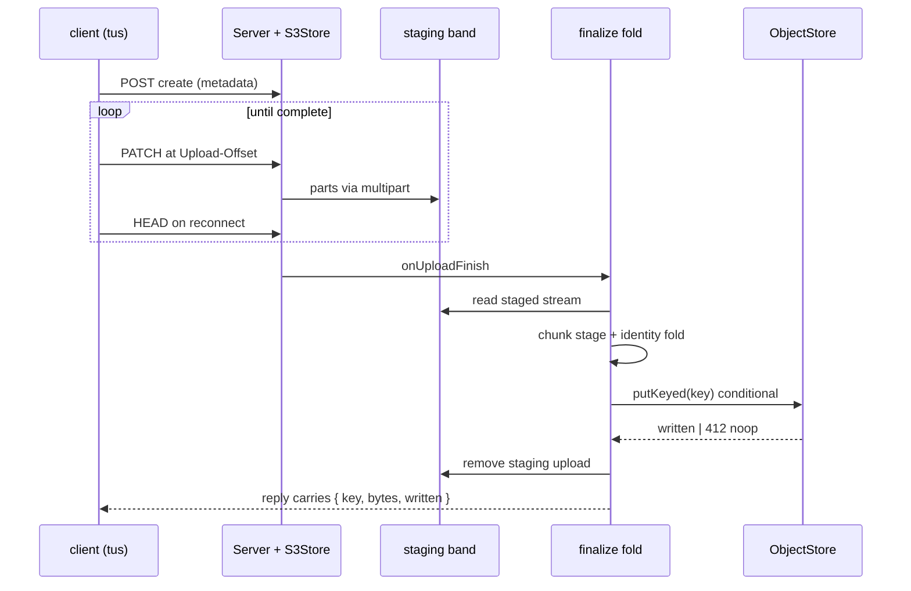

# [DATA_STREAM]

The ONE resumable content-addressed rail: large payloads move in bounded chunks, resume after any failure at verified offsets, and prove integrity end to end with a single identity from first byte to durable key. Ingress is pull-based Web Streams lifted BYOB into `Stream<Uint8Array>`; the chunk stage is content-defined cutting (FastCDC — an owned wasm surface over the maintained Rust crate, because every published JS binding is stale) minting per-chunk sub-keys that are children of the object `ContentKey` under the same digest algebra; the identity fold is the core digest session absorbed chunk by chunk in bounded memory, so the client-computed address, the store-verified checksum, and the core key are one value. Resume is the tus protocol — `@tus/server` over `@tus/s3-store` maps `Upload-Offset` onto S3 multipart parts into a staging band — and finalize re-homes staged bytes onto their content key through the object plane's conditional legs, where 412 closes the loop as the idempotent already-present noop. Reads mirror ingest: ranged streaming with structural staleness immunity, because a content key cannot change under a resumed range.

## [1]-[CLUSTERS]

| [INDEX] | [CLUSTER]       | [OWNS]                                                                          |
| :-----: | :-------------- | :--------------------------------------------------------------------------------- |
|  [01]   | `BYTE_INGRESS`  | the BYOB lift, the bounded form-data seam, backpressure law                          |
|  [02]   | `CHUNK_STAGE`   | the owned FastCDC wasm surface, chunk receipts, sub-key identity                     |
|  [03]   | `IDENTITY_FOLD` | the incremental digest session, the one-identity law, checkpointed resume state      |
|  [04]   | `RESUME_RAIL`   | the tus server over the S3 staging store, hooks, finalize re-home, protocol growth   |
|  [05]   | `RANGE_READS`   | ranged resumable reads over content and staging bands                                |

## [2]-[BYTE_INGRESS]

- Owner: the ingress lifts — `Rail.bytes` over any `ReadableStream<Uint8Array>` through the BYOB reader, and the bounded multipart form seam for direct HTTP ingest — one pull geometry whose demand propagates upstream so a fast producer throttles to the slow consumer with order and completeness preserved.
- Packages: `effect` (`Stream.fromReadableStreamByob`, `Stream.fromReadableStream`); `@effect/platform` (`Multipart` — `toPersisted`, the `MaxFileSize`/`MaxParts` fiber-ref bounds, `HttpApiSchema.Multipart` typed endpoints).
- Entry: every byte source in the unit enters here — a fetch body, a staged tus read lifted from its `Readable` through the platform interop, a filesystem stream from `object/file.md` — and leaves as one `Stream<Uint8Array>` the chunk stage consumes; no consumer meets a raw reader.
- Growth: a new byte source is one lift call; the allocation size is a policy value on the BYOB lift, never a per-site literal.
- Law: ingress is pull — the BYOB reader drives `pull()` by `desiredSize`, the Effect stream carries the backpressure plus the typed error channel and `Scope` release, and an eager materialization of a body is the memory defect this rail exists to delete.
- Law: form-data ingest is bounded before any byte materializes — the platform multipart bounds (`MaxFileSize`, `MaxFieldSize`, `MaxParts`) are fiber-ref policy at the seam, and file parts hand into this same lift.

```typescript
import { Effect, Stream } from "effect"
import { ObjectFault } from "./store.ts"

const _INGRESS = { allocBytes: 256 * 1024 } as const

const _bytes = (body: ReadableStream<Uint8Array>): Stream.Stream<Uint8Array, ObjectFault> =>
  Stream.fromReadableStreamByob(
    () => body,
    (caught) => new ObjectFault({ reason: "io", key: "<ingress>", detail: String(caught) }),
    _INGRESS.allocBytes,
  )
```

## [3]-[CHUNK_STAGE]

- Owner: the content-defined chunk stage — `Rail.chunked`, a stream transform re-cutting the byte flow at Gear-hash boundaries so an insert or delete re-aligns cut points and versioned payloads dedup maximally — and the `ChunkMark` receipt carrying each chunk's span and sub-key.
- Packages: the owned FastCDC wasm surface (a `wasm-pack` build of the maintained Rust `fastcdc` crate, normalized-chunking v2020, held as a folder-owned artifact behind a capability Tag per the wasm boundary law — every published JS/wasm npm binding is years stale and refused); `@rasm/ts/core` (`Digest` — the sub-key mint); `effect` (`Stream`, `Chunk`).
- Entry: `Rail.chunked(bytes, policy)` between ingress and the identity fold; the policy row carries `{ min, avg, max }` cut bounds; consumers that need whole-payload identity only skip the stage — chunking earns its cost where dedup or chunk-level proofs are real.
- Receipt: `ChunkMark` — `{ seq, offset, bytes, sub }` — the sub-key is `Digest.mint("content", chunkBytes)`, the SAME algebra as the object key at finer grain, so chunk identity and object identity share one mint and a second hashing vocabulary is unspellable.
- Growth: a chunk-level Merkle proof tree (verified streaming, O(log n) chunk proofs) lands as one digest row — RESEARCH: the keyed-tree row (`createBLAKE3` unkeyed table row plus its brand anchor) lands in the core digest table per its stated growth clause before the proof-tree fence settles; the chunk receipts already carry everything the tree folds.
- Law: the wasm module is capability, not code — instantiation is a scoped acquisition behind the Tag, cuts run through the marked kernel, and no linear-memory view escapes; the stage is a pure `Stream` transform above that seam.
- Law: cut bounds are policy data — the row travels with the payload class (artifact, snapshot, media), and re-cutting with different bounds mints different sub-keys by construction, so the policy row is part of the dedup contract and never drifts silently.

```typescript
import { Context } from "effect"
import { ContentKey, Digest } from "@rasm/ts/core"

declare namespace Rail {
  type CutPolicy = { readonly min: number; readonly avg: number; readonly max: number }
  type ChunkMark = { readonly seq: number; readonly offset: number; readonly bytes: number; readonly sub: ContentKey }
}

class Cutter extends Context.Tag("data/Cutter")<Cutter, {
  readonly cut: (policy: Rail.CutPolicy) => (bytes: Stream.Stream<Uint8Array, ObjectFault>) => Stream.Stream<Uint8Array, ObjectFault>
}>() {}

const _CUT = { min: 256 * 1024, avg: 1024 * 1024, max: 4 * 1024 * 1024 } as const satisfies Rail.CutPolicy

const _chunked = (bytes: Stream.Stream<Uint8Array, ObjectFault>, policy: Rail.CutPolicy) =>
  Stream.unwrap(
    Effect.map(Cutter, (cutter) =>
      cutter.cut(policy)(bytes).pipe(
        Stream.mapAccumEffect({ seq: 0, offset: 0 }, (state, chunk) =>
          Effect.map(Digest.mint("content", chunk), (sub) =>
            [
              { seq: state.seq + 1, offset: state.offset + chunk.byteLength },
              { chunk, mark: { seq: state.seq, offset: state.offset, bytes: chunk.byteLength, sub } satisfies Rail.ChunkMark },
            ] as const),
        ),
      )),
  )
```

## [4]-[IDENTITY_FOLD]

- Owner: `Rail.identity` — the incremental fold from a chunked flow to the object `ContentKey` in bounded memory — and the checkpointed resume state: the digest session's saved snapshot travels with the tus offset, so a resumed upload continues its identity fold from the verified byte instead of re-reading the prefix.
- Packages: `@rasm/ts/core` (`Digest.session`, `Digest.absorb`, `Digest.finish` — the checkpoint algebra over one compiled hasher); `effect` (`Stream`, `Effect`).
- Entry: the finalize fold runs `Rail.identity` over the staged read; a client-side leg runs the same fold in the browser (the core digest is isomorphic across runtimes) so the announced key and the server-verified key are one mint by construction.
- Receipt: `{ key, bytes, chunks }` — the object key, the total span, and the chunk census; transport-level `x-amz-checksum` verification rides the object client's checksum policy in parallel, and the two proofs answer different questions: the trailer proves the wire, the mint proves identity.
- Growth: a windowed rolling digest for chunk-run verification is a consumer fold over `absorb`/`finish` — the session algebra already carries it.
- Law: one identity end to end — client-computed address, store-verified checksum, and core key converge on the same digest value; a second hashing or chunking vocabulary anywhere on the rail is the named cross-language drift defect the core key page seals.
- Law: the resume checkpoint is `{ offset, session }` — the saved hasher state is as sensitive as the bytes it absorbed and persists only in the staging band's metadata under the same custody; a checkpoint crossing a hasher build boundary is a defect the caller owns, the core session law restated as this rail's persistence rule.

```typescript
const _identity = (flow: Stream.Stream<{ readonly chunk: Uint8Array; readonly mark: Rail.ChunkMark }, ObjectFault>) =>
  Effect.gen(function* () {
    const opened = yield* Digest.session("content")
    const folded = yield* Stream.runFoldEffect(
      flow,
      { session: opened, bytes: 0, chunks: 0 },
      (state, piece) =>
        Effect.map(Digest.absorb(state.session, piece.chunk), (session) => ({
          session,
          bytes: state.bytes + piece.chunk.byteLength,
          chunks: state.chunks + 1,
        })),
    )
    const key = yield* Digest.finish(folded.session)
    return { key, bytes: folded.bytes, chunks: folded.chunks }
  })
```

## [5]-[RESUME_RAIL]

- Owner: the tus assembly — the staging `S3Store`, the `Server` with its hook seams, the finalize re-home, and the staging groom — plus the protocol growth row: the IETF resumable-upload draft swaps in on RFC with identical offset/complete semantics and zero store or hook edits.
- Packages: `@tus/server` (`Server`, `EVENTS`, `MemoryLocker`); `@tus/s3-store` (`S3Store`); `@aws-sdk/lib-storage` (through `object/store.md`'s `putKeyed` — the streaming conditional re-home); `effect` (`Effect`, `Layer`, `Schedule`).
- Entry: the serving plane mounts `rail.node` (node req/res) or `rail.web` (fetch Request→Response) under its route; the browser leg is `tus-js-client` driving POST/PATCH/HEAD against this mount — a ui-branch consumer of the wire protocol, never of this module.
- Receipt: `onUploadFinish` returns the finalize receipt onto the reply — `{ key, bytes, written }` — so the client learns its content key in the completing response; the 412 case reads `written: false`, the dedup success.
- Growth: a per-caller quota is the `maxSize` function reading the caller's admission; a second staging band (media versus artifact) is a second `Rail.of` with its own cut policy; RUFH lands as the protocol row swap.
- Law: staging and content never share keys — tus ids are random staging identity, `namingFunction` prefixes the staging band, and identity exists only after the finalize fold; a staging key leaking as a content coordinate is the named defect.
- Law: finalize is fold-then-conditional — read the staged object as a stream, run the chunk stage and the identity fold, re-home through the streaming conditional put (`putKeyed`), record the reference row, remove the staging upload; the whole fold is idempotent because the re-home lands 412 on replay and the staging removal is the only destructive step, ordered last.
- Law: the groom never sleeps — `cleanUpExpiredUploads` plus the store's `deleteExpired` ride the maintenance cadence, and an abandoned upload costs staging bytes for exactly the expiration window.



```typescript
import { Duration, Redacted, Runtime } from "effect"
import { Server } from "@tus/server"
import { S3Store } from "@tus/s3-store"
import { Readable } from "node:stream"
import type http from "node:http"
import { ObjectStore } from "./store.ts"

declare namespace Rail {
  type Spec = {
    readonly route: string
    readonly staging: string
    readonly cut: CutPolicy
    readonly maxBytes: number
  }
}

const _rail = (spec: Rail.Spec) =>
  Effect.gen(function* () {
    const store = yield* ObjectStore
    const staging = new S3Store({
      s3ClientConfig: {
        bucket: store.bucket,
        endpoint: store.provider.endpoint,
        region: store.provider.region,
        forcePathStyle: store.provider.forcePathStyle,
        credentials: {
          accessKeyId: Redacted.value(store.provider.accessKeyId),
          secretAccessKey: Redacted.value(store.provider.secretAccessKey),
        },
      },
      partSize: store.partBytes,
      expirationPeriodInMilliseconds: Duration.toMillis(Duration.hours(24)),
    })
    const runtime = yield* Effect.runtime<never>()
    const server = new Server({
      datastore: staging,
      path: spec.route,
      maxSize: spec.maxBytes,
      namingFunction: () => `${spec.staging}/${crypto.randomUUID()}`,
      onUploadFinish: async (_req, upload) => {
        const receipt = await Runtime.runPromise(runtime)(
          Effect.gen(function* () {
            const staged = yield* Effect.promise(() => staging.read(upload.id))
            const flow = _chunked(_bytes(Readable.toWeb(staged) as ReadableStream<Uint8Array>), spec.cut)
            const identity = yield* _identity(flow)
            const landed = yield* store.putKeyed(identity.key, Readable.toWeb(yield* Effect.promise(() => staging.read(upload.id))) as ReadableStream<Uint8Array>)
            yield* Effect.promise(() => staging.remove(upload.id))
            return { ...identity, written: landed.written }
          }),
        )
        return { status_code: 201, body: JSON.stringify(receipt) }
      },
    })
    return {
      node: (req: http.IncomingMessage, res: http.ServerResponse) => Effect.promise(() => server.handle(req, res)),
      web: (req: Request) => Effect.promise(() => server.handleWeb(req)),
      groom: Effect.zipRight(
        Effect.promise(() => server.cleanUpExpiredUploads()),
        Effect.promise(() => staging.deleteExpired()),
      ),
    }
  })
```

## [6]-[RANGE_READS]

- Owner: the resumable read family — `Rail.range(key, span)` streaming a byte window of a content object, and the staging-band probe pair that resumes an interrupted serve.
- Packages: `@aws-sdk/client-s3` (`GetObjectCommand` `Range`/`PartNumber`, `HeadObjectCommand`); `effect` (`Stream`).
- Entry: the serving plane's byte egress and the browser's range-fetching consumers ride this read; a resumed download issues `Range: bytes=<offset>-` and receives the 206 remainder.
- Growth: part-aligned reads (`PartNumber`) land as a span variant when a consumer aligns to upload parts; a verified-streaming read (chunk proofs against the Merkle row) follows the `[3]` RESEARCH row.
- Law: content-band resume is structurally stale-proof — the key is the bytes, mutation is unrepresentable, so a resumed range needs no conditional and mid-transfer object change is impossible by identity; the staleness-guard conditional (`IfMatch` on the probed ETag) rides only staging-band reads, where bytes move under a stable id.
- Law: a range read is a stream, never a buffer — the response body lifts through the same `[2]` geometry, and a consumer that needs the whole object states no range and folds the stream.

```typescript
import { GetObjectCommand } from "@aws-sdk/client-s3"

const _range = (key: ContentKey, span?: { readonly from: number; readonly to?: number }) =>
  Stream.unwrap(
    Effect.flatMap(ObjectStore, (store) =>
      Effect.map(
        Effect.tryPromise({
          try: (signal) =>
            store.client.send(new GetObjectCommand({
              Bucket: store.bucket, Key: key,
              ...(span !== undefined && { Range: `bytes=${span.from}-${span.to ?? ""}` }),
            }), { abortSignal: signal }),
          catch: store.folded(key),
        }),
        (reply) =>
          reply.Body === undefined
            ? Stream.fail(new ObjectFault({ reason: "missing", key, detail: "<empty>" }))
            : _bytes(reply.Body.transformToWebStream() as ReadableStream<Uint8Array>),
      )),
  )

const Rail = {
  cut: _CUT,
  bytes: _bytes,
  chunked: _chunked,
  identity: _identity,
  of: _rail,
  range: _range,
} as const

// --- [EXPORTS] --------------------------------------------------------------------------

export { Cutter, Rail }
```
